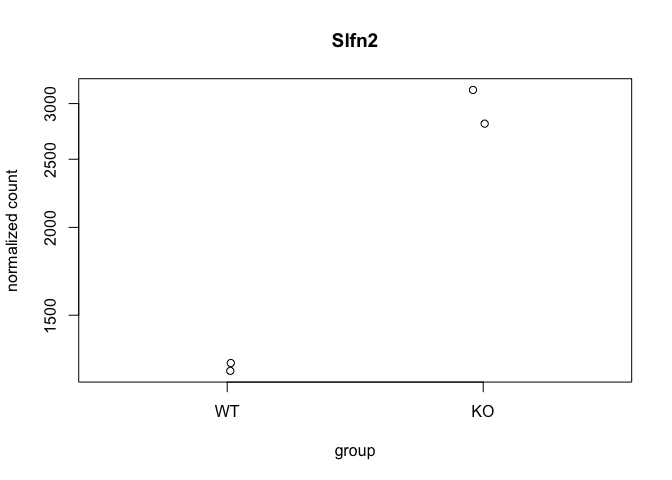
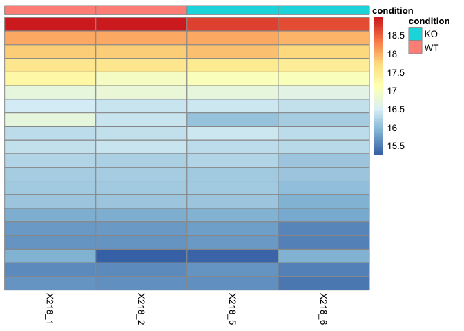
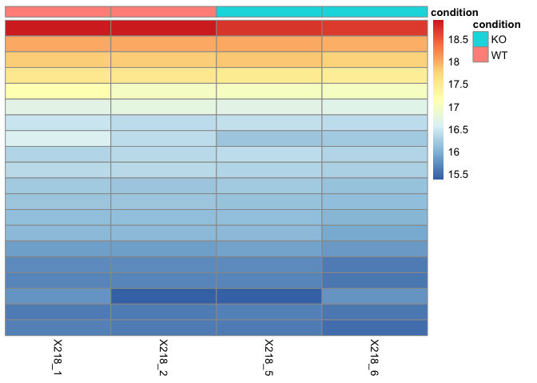
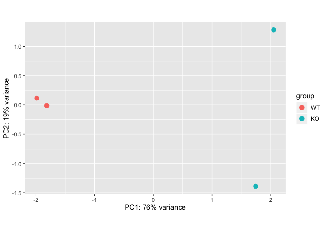
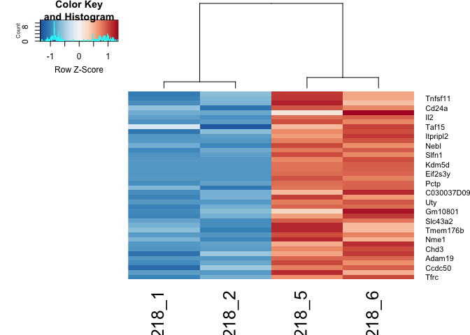

Rev-Erba in Th17 RNA-seq Practice
================

#### This is a demo analysis for the RNA-seq data from Amir et al., 2018, Cell Reports 25, 3733–3749.

In this work, we use REV-ERBa WT versus KO RNA-seq from Th17 cells [GEO:
GSE122726](https://ftp.ncbi.nlm.nih.gov/geo/series/GSE122nnn/GSE122726/suppl/GSE122726_processed_218.xlsx)
There’re two biological replicates for each genotypes in this
experiment.

### 1\. Load `DESeq2` package for differential gene expresion analysis.

``` r
library(DESeq2)
```

    ## Loading required package: S4Vectors

    ## Loading required package: stats4

    ## Loading required package: BiocGenerics

    ## Loading required package: parallel

    ## 
    ## Attaching package: 'BiocGenerics'

    ## The following objects are masked from 'package:parallel':
    ## 
    ##     clusterApply, clusterApplyLB, clusterCall, clusterEvalQ,
    ##     clusterExport, clusterMap, parApply, parCapply, parLapply,
    ##     parLapplyLB, parRapply, parSapply, parSapplyLB

    ## The following objects are masked from 'package:stats':
    ## 
    ##     IQR, mad, sd, var, xtabs

    ## The following objects are masked from 'package:base':
    ## 
    ##     anyDuplicated, append, as.data.frame, basename, cbind, colnames,
    ##     dirname, do.call, duplicated, eval, evalq, Filter, Find, get, grep,
    ##     grepl, intersect, is.unsorted, lapply, Map, mapply, match, mget,
    ##     order, paste, pmax, pmax.int, pmin, pmin.int, Position, rank,
    ##     rbind, Reduce, rownames, sapply, setdiff, sort, table, tapply,
    ##     union, unique, unsplit, which, which.max, which.min

    ## 
    ## Attaching package: 'S4Vectors'

    ## The following object is masked from 'package:base':
    ## 
    ##     expand.grid

    ## Loading required package: IRanges

    ## Loading required package: GenomicRanges

    ## Loading required package: GenomeInfoDb

    ## Loading required package: SummarizedExperiment

    ## Loading required package: Biobase

    ## Welcome to Bioconductor
    ## 
    ##     Vignettes contain introductory material; view with
    ##     'browseVignettes()'. To cite Bioconductor, see
    ##     'citation("Biobase")', and for packages 'citation("pkgname")'.

    ## Loading required package: DelayedArray

    ## Loading required package: matrixStats

    ## 
    ## Attaching package: 'matrixStats'

    ## The following objects are masked from 'package:Biobase':
    ## 
    ##     anyMissing, rowMedians

    ## Loading required package: BiocParallel

    ## 
    ## Attaching package: 'DelayedArray'

    ## The following objects are masked from 'package:matrixStats':
    ## 
    ##     colMaxs, colMins, colRanges, rowMaxs, rowMins, rowRanges

    ## The following objects are masked from 'package:base':
    ## 
    ##     aperm, apply, rowsum

``` r
library(dplyr)
```

    ## 
    ## Attaching package: 'dplyr'

    ## The following object is masked from 'package:matrixStats':
    ## 
    ##     count

    ## The following object is masked from 'package:Biobase':
    ## 
    ##     combine

    ## The following objects are masked from 'package:GenomicRanges':
    ## 
    ##     intersect, setdiff, union

    ## The following object is masked from 'package:GenomeInfoDb':
    ## 
    ##     intersect

    ## The following objects are masked from 'package:IRanges':
    ## 
    ##     collapse, desc, intersect, setdiff, slice, union

    ## The following objects are masked from 'package:S4Vectors':
    ## 
    ##     first, intersect, rename, setdiff, setequal, union

    ## The following objects are masked from 'package:BiocGenerics':
    ## 
    ##     combine, intersect, setdiff, union

    ## The following objects are masked from 'package:stats':
    ## 
    ##     filter, lag

    ## The following objects are masked from 'package:base':
    ## 
    ##     intersect, setdiff, setequal, union

### 2\. Prepare data object for analysis

#### 2.1 DESeq2 Required Inputs

As input, the DESeq2 package expects **(1)** a data.frame of **count
data** (as obtained from RNA-seq or another high-throughput sequencing
experiment) and **(2)** a second data.frame with information about the
samples - often called sample metadata (or `colData` in DESeq2-speak
because it supplies metadata/information about the columns of the
countData matrix).

#### 2.2 Load count data from GEO database

**Note**: The count values must be raw counts of sequencing reads. This
is important for **DESeq2**’s statistic model to hold.

``` r
# load count table 
count<- read.csv("GSE122726 WTVSKO.csv",stringsAsFactors = FALSE,row.names = 1)
rownames(count) <- gsub("\t", "", rownames(count))
head(count)
```

    ##               X218_1 X218_2 X218_5 X218_6
    ## 0610007P14Rik   2928   2789   2776   2565
    ## 0610009B22Rik    170    177    160    172
    ## 0610009E02Rik      4      9      3      2
    ## 0610009L18Rik     51     59     44     39
    ## 0610009O20Rik   1286   1306   1225   1076
    ## 0610010F05Rik    753    673    674    727

Some genes have **zero** read counts for all 4 samples. We tidy up the
counts data to exclude genes with **zero** value.

``` r
filter.Count <- count[rowSums(count)!=0,]
head(filter.Count)
```

    ##               X218_1 X218_2 X218_5 X218_6
    ## 0610007P14Rik   2928   2789   2776   2565
    ## 0610009B22Rik    170    177    160    172
    ## 0610009E02Rik      4      9      3      2
    ## 0610009L18Rik     51     59     44     39
    ## 0610009O20Rik   1286   1306   1225   1076
    ## 0610010F05Rik    753    673    674    727

#### 2.3 Create colData

Create a `meta` for metadata

``` r
id <- colnames(filter.Count)

meta <- data.frame("id"=id[1:4], "condition" = c(rep("WT",2),rep("KO",2)), stringsAsFactors = FALSE)
```

Take a look at metadata

``` r
head(meta)
```

    ##       id condition
    ## 1 X218_1        WT
    ## 2 X218_2        WT
    ## 3 X218_5        KO
    ## 4 X218_6        KO

### 3\. DESeq2 analysis

We will use the **DESeqDataSetFromMatrix()** function to build the
required DESeqDataSet object and call it `dds`, short for our
DESeqDataSet.

``` r
dds <- DESeqDataSetFromMatrix(countData=filter.Count, 
                              colData=meta, 
                              design=~condition
                              )
```

    ## Warning in DESeqDataSet(se, design = design, ignoreRank): some variables in
    ## design formula are characters, converting to factors

``` r
#set WT as reference level
dds$condition <- relevel(dds$condition, ref = "WT")
```

We’re ready to run the differential expression pipeline. We use
**DEseq()** to run DESeq2 analysis.

``` r
dds <- DESeq(dds)
```

    ## estimating size factors

    ## estimating dispersions

    ## gene-wise dispersion estimates

    ## mean-dispersion relationship

    ## final dispersion estimates

    ## fitting model and testing

``` r
head(dds)
```

    ## class: DESeqDataSet 
    ## dim: 6 4 
    ## metadata(1): version
    ## assays(4): counts mu H cooks
    ## rownames(6): 0610007P14Rik 0610009B22Rik ... 0610009O20Rik
    ##   0610010F05Rik
    ## rowData names(22): baseMean baseVar ... deviance maxCooks
    ## colnames(4): X218_1 X218_2 X218_5 X218_6
    ## colData names(3): id condition sizeFactor

### 4\. Inspect result tale

Get Deseq results by calling **results()** function

``` r
res <- results(dds)
summary(res)
```

    ## 
    ## out of 19509 with nonzero total read count
    ## adjusted p-value < 0.1
    ## LFC > 0 (up)       : 53, 0.27%
    ## LFC < 0 (down)     : 79, 0.4%
    ## outliers [1]       : 0, 0%
    ## low counts [2]     : 6808, 35%
    ## (mean count < 11)
    ## [1] see 'cooksCutoff' argument of ?results
    ## [2] see 'independentFiltering' argument of ?results

#### 4.1 Dignostic plot

##### MA-plot

The MA plot represents each gene with a dot. The x axis is the average
expression over all samples, the y axis the log2 fold change between
treatment and control. Genes with an adjusted p value below a treshold
(0.1 by default) are shown in red.

``` r
# unshrunken
plotMA(res,ylim=c(-2,2))
```

<!-- -->

The MA-plot shows the log2 fold changes from the treatment over the mean
of normalized counts, i.e. the average of counts normalized by size
factor.

When count values are too low to allow an accurate estimate of the log
fold changes(LFCs), the value is “shrunken” towards zero to avoid that
these values dominate the top-ranked log fold changes.

``` r
#Shrunken
res_shrink <- lfcShrink(dds, contrast=c("condition","KO","WT"), res=res)
```

    ## using 'normal' for LFC shrinkage, the Normal prior from Love et al (2014).
    ## 
    ## Note that type='apeglm' and type='ashr' have shown to have less bias than type='normal'.
    ## See ?lfcShrink for more details on shrinkage type, and the DESeq2 vignette.
    ## Reference: https://doi.org/10.1093/bioinformatics/bty895

``` r
plotMA(res_shrink,ylim=c(-2,2))
```

<!-- -->

##### Plot of despersion estimates

The function **plotDispEsts** visualizes DESeq2’s dispersion estimates.

``` r
# Plot dispersion estimates
plotDispEsts(dds, main="DESeq2")
```

<!-- -->
The black points are the dispersion estimates for each gene.We fit the
red trend line, and shrink each gene’s estimate towards the red line to
obtain the final estimates(blue points) that are used in the hypothesis
test. The blue circles above the main “cloud” of points are genes which
have high gene-wise dispersion estimates which are labelled as
dispersion outliers.

##### Plot counts

This is to examine the counts of reads for a single gene across the
groups. `plotCounts()` normalizes counts by sequencing depth and adds a
pseudocount of 1/2 to allow for log scale
plotting.

``` r
plotCounts(dds, gene=which.min(res$padj),intgroup = "condition")
```

<!-- -->

##### Blind dispersion estimation

``` r
rld <- rlog(dds,blind=FALSE)
vsd <- varianceStabilizingTransformation(dds,blind=FALSE)
vsd.fast <- vst(dds,blind=FALSE)
head(assay(rld),3)
```

    ##                  X218_1    X218_2    X218_5    X218_6
    ## 0610007P14Rik 11.447803 11.410782 11.470369 11.391508
    ## 0610009B22Rik  7.399939  7.406135  7.403720  7.410757
    ## 0610009E02Rik  2.150429  2.155967  2.149637  2.148360

``` r
head(assay(vsd),3)
```

    ##                  X218_1    X218_2    X218_5    X218_6
    ## 0610007P14Rik 11.941990 11.888606 11.974721 11.860552
    ## 0610009B22Rik  9.974410  9.988549  9.983008  9.999112
    ## 0610009E02Rik  9.343774  9.401414  9.332575  9.312164

``` r
head(assay(vsd.fast),3)
```

    ##                  X218_1    X218_2    X218_5    X218_6
    ## 0610007P14Rik 11.830873 11.773687 11.865879 11.743589
    ## 0610009B22Rik  9.635285  9.651702  9.645269  9.663963
    ## 0610009E02Rik  8.897569  8.965292  8.884409  8.860421

##### Sample distances

Assess overall similarity between samples is a useful first step in an
RNA-Seq analysis.

Here we plot sample distances.

``` r
sampleDists <- dist(t(assay(rld)))
```

``` r
library("pheatmap")
library("RColorBrewer")
sampleDistMatrix <- as.matrix(sampleDists)
rownames(sampleDistMatrix) <- paste(rld$condition,rld$id)
colnames(sampleDistMatrix) <- NULL
colors <- colorRampPalette(rev(brewer.pal(9,"Blues")))(100)
pheatmap(sampleDistMatrix,
         clustering_distance_rows = sampleDists,
         clustering_distance_cols = sampleDists,
         col=colors)
```

<!-- -->

``` r
#plot p-value distribution
#hist(resAdjSig05$pvalue)
```

##### Heatmap of the count matrix

``` r
select <- order(rowMeans(counts(dds,normalized=TRUE)),decreasing =TRUE)[1:20]
nt <- normTransform(dds) #defaults to log2(x+1)
log2.norm.counts <- assay(nt)[select,]
df <- data.frame("condition" = c(rep("WT",2),rep("KO",2)))
rownames(df) <- meta$id
pheatmap(log2.norm.counts,cluster_rows = FALSE,show_rownames = FALSE,cluster_cols = FALSE,annotation_col =df)
```

<!-- -->

``` r
pheatmap(assay(rld)[select,],cluster_rows = FALSE,show_rownames = FALSE,cluster_cols = FALSE,annotation_col =df)
```

<!-- -->

``` r
pheatmap(assay(vsd)[select,],cluster_rows = FALSE,show_rownames = FALSE,cluster_cols = FALSE,annotation_col =df)
```

<!-- -->

##### PCA plot

``` r
plotPCA(rld,intgroup = "condition")
```

<!-- -->

#### 4.2 Getting results of differentially expressed genes

Subset the DEG with adjust p value lower than 0.05

``` r
resAdjSig05 <- subset(as.data.frame(res),padj <0.05)
head(resAdjSig05)
```

    ##                 baseMean log2FoldChange      lfcSE      stat       pvalue
    ## 1700048O20Rik   37.84731      2.4004142 0.50252080  4.776746 1.781546e-06
    ## 2610035D17Rik   86.18120      1.2653131 0.31323403  4.039513 5.356221e-05
    ## AA465934       184.28219      1.6673535 0.23046624  7.234698 4.665676e-13
    ## Acvrl1        3171.68370     -0.3189819 0.07893704 -4.040966 5.323142e-05
    ## Adam19        3159.52117      0.3854628 0.07194738  5.357565 8.435090e-08
    ## Aldh1l1         68.26443     -1.4162160 0.35175762 -4.026113 5.670640e-05
    ##                       padj
    ## 1700048O20Rik 4.190262e-04
    ## 2610035D17Rik 8.617295e-03
    ## AA465934      2.821845e-10
    ## Acvrl1        8.617295e-03
    ## Adam19        2.747028e-05
    ## Aldh1l1       9.002850e-03

Get upregulated and downregulated gene, respectively

``` r
resAdjSig05up <- subset(resAdjSig05,resAdjSig05$log2FoldChange>0)
resAdjSig05down <- subset(resAdjSig05,resAdjSig05$log2FoldChange<0)
head(resAdjSig05up)
```

    ##                 baseMean log2FoldChange      lfcSE     stat       pvalue
    ## 1700048O20Rik   37.84731      2.4004142 0.50252080 4.776746 1.781546e-06
    ## 2610035D17Rik   86.18120      1.2653131 0.31323403 4.039513 5.356221e-05
    ## AA465934       184.28219      1.6673535 0.23046624 7.234698 4.665676e-13
    ## Adam19        3159.52117      0.3854628 0.07194738 5.357565 8.435090e-08
    ## C030037D09Rik  133.61907      0.9508722 0.25593385 3.715304 2.029592e-04
    ## Ccdc50        5286.99347      0.2836683 0.06914969 4.102235 4.091783e-05
    ##                       padj
    ## 1700048O20Rik 4.190262e-04
    ## 2610035D17Rik 8.617295e-03
    ## AA465934      2.821845e-10
    ## Adam19        2.747028e-05
    ## C030037D09Rik 2.657509e-02
    ## Ccdc50        7.119142e-03

``` r
head(resAdjSig05down)
```

    ##           baseMean log2FoldChange      lfcSE      stat       pvalue
    ## Acvrl1  3171.68370     -0.3189819 0.07893704 -4.040966 5.323142e-05
    ## Aldh1l1   68.26443     -1.4162160 0.35175762 -4.026113 5.670640e-05
    ## Alpk2   1408.36458     -0.9718010 0.09752012 -9.965133 2.165836e-23
    ## Anxa3    504.47960     -0.6760196 0.13622227 -4.962621 6.954810e-07
    ## App       74.20809     -1.4192135 0.33912030 -4.184985 2.851846e-05
    ## Arl4c   2640.49342     -0.2904073 0.07557178 -3.842801 1.216383e-04
    ##                 padj
    ## Acvrl1  8.617295e-03
    ## Aldh1l1 9.002850e-03
    ## Alpk2   9.169427e-20
    ## Anxa3   1.879427e-04
    ## App     5.207065e-03
    ## Arl4c   1.716587e-02

Save result with DE gene ordered by padj

``` r
write.csv(resAdjSig05, "adjsignif05_results.csv")
write.csv(resAdjSig05up, "adjsignif05_results_up.csv")
write.csv(resAdjSig05down, "adjsignif05_results_down.csv")
```

##### Genome annotation

``` r
library(org.Mm.eg.db)
```

    ## Loading required package: AnnotationDbi

    ## 
    ## Attaching package: 'AnnotationDbi'

    ## The following object is masked from 'package:dplyr':
    ## 
    ##     select

    ## 

``` r
library("AnnotationDbi")
```

``` r
columns(org.Mm.eg.db)
```

    ##  [1] "ACCNUM"       "ALIAS"        "ENSEMBL"      "ENSEMBLPROT"  "ENSEMBLTRANS"
    ##  [6] "ENTREZID"     "ENZYME"       "EVIDENCE"     "EVIDENCEALL"  "GENENAME"    
    ## [11] "GO"           "GOALL"        "IPI"          "MGI"          "ONTOLOGY"    
    ## [16] "ONTOLOGYALL"  "PATH"         "PFAM"         "PMID"         "PROSITE"     
    ## [21] "REFSEQ"       "SYMBOL"       "UNIGENE"      "UNIPROT"

``` r
res$entrez <-unname(mapIds(org.Mm.eg.db, rownames(res), "ENTREZID", "SYMBOL"))
```

    ## 'select()' returned 1:1 mapping between keys and columns

``` r
res$ensembl <- unname(mapIds(org.Mm.eg.db, rownames(res), "ENSEMBL", "SYMBOL"))
```

    ## 'select()' returned 1:many mapping between keys and columns

``` r
head(res)
```

    ## log2 fold change (MLE): condition KO vs WT 
    ## Wald test p-value: condition KO vs WT 
    ## DataFrame with 6 rows and 8 columns
    ##                       baseMean      log2FoldChange             lfcSE
    ##                      <numeric>           <numeric>         <numeric>
    ## 0610007P14Rik   2761.145515685 0.00433554420887819 0.082302842092855
    ## 0610009B22Rik 169.517594574222  0.0374447614202501  0.21705934959602
    ## 0610009E02Rik 4.43064706808115   -1.27386465722263  1.34837468052316
    ## 0610009L18Rik 48.0137820042001  -0.303630572303751 0.402019106683867
    ## 0610009O20Rik 1220.85738826761 -0.0688936107315965 0.104482147143169
    ## 0610010F05Rik 706.126988945113  0.0755392000171109 0.120639528105799
    ##                             stat            pvalue              padj
    ##                        <numeric>         <numeric>         <numeric>
    ## 0610007P14Rik 0.0526779403800756 0.957988515643088 0.999813356907188
    ## 0610009B22Rik  0.172509322864647 0.863037132649025 0.999813356907188
    ## 0610009E02Rik -0.944740861440959 0.344791190500969                NA
    ## 0610009L18Rik -0.755264034110983 0.450090574095594 0.999813356907188
    ## 0610009O20Rik -0.659381651462365  0.50965072162742 0.999813356907188
    ## 0610010F05Rik  0.626156295562299 0.531212430280559 0.999813356907188
    ##                    entrez            ensembl
    ##               <character>        <character>
    ## 0610007P14Rik          NA                 NA
    ## 0610009B22Rik       66050 ENSMUSG00000007777
    ## 0610009E02Rik   100125929 ENSMUSG00000086714
    ## 0610009L18Rik       66838 ENSMUSG00000043644
    ## 0610009O20Rik          NA                 NA
    ## 0610010F05Rik       71675 ENSMUSG00000042208

``` r
resOrdered <- res[order(res$pvalue),]
head(resOrdered)
```

    ## log2 fold change (MLE): condition KO vs WT 
    ## Wald test p-value: condition KO vs WT 
    ## DataFrame with 6 rows and 8 columns
    ##                 baseMean     log2FoldChange              lfcSE
    ##                <numeric>          <numeric>          <numeric>
    ## Slfn2   2119.19662615432   1.23152346597708 0.0878076920804373
    ## Xist    2179.65878242058  -11.4551817642219  0.836570068118894
    ## Alpk2   1408.36457970491 -0.971800977440168 0.0975201202518518
    ## Eif2s3y 878.412211630237   13.2737344786665    1.4463775756324
    ## Basp1   1011.28976655667 -0.929072307373019  0.102598181494546
    ## Igfbp4   5190.5461238049  -0.60718180806414 0.0680295460042288
    ##                      stat               pvalue                 padj      entrez
    ##                 <numeric>            <numeric>            <numeric> <character>
    ## Slfn2    14.0252344276277 1.09250535086622e-44 1.38759104613519e-40       20556
    ## Xist    -13.6930332565925 1.11745238657994e-42  7.0963813809759e-39      213742
    ## Alpk2   -9.96513309182179 2.16583585218974e-23 9.16942705288732e-20      225638
    ## Eif2s3y  9.17722640498129  4.4233758427207e-20 1.40453241445989e-16       26908
    ## Basp1   -9.05544614767274 1.36010623612147e-19 3.45494186099576e-16       70350
    ## Igfbp4  -8.92526620751514 4.44628565312558e-19   9.412045680058e-16       16010
    ##                    ensembl
    ##                <character>
    ## Slfn2   ENSMUSG00000072620
    ## Xist    ENSMUSG00000086503
    ## Alpk2   ENSMUSG00000032845
    ## Eif2s3y ENSMUSG00000069049
    ## Basp1   ENSMUSG00000045763
    ## Igfbp4  ENSMUSG00000017493

Save results

``` r
write.csv(as.data.frame(resOrdered), file="results.csv")
```

#### 4.3 Data visualization

##### Heatmap for gene clustering

``` r
library("genefilter")
```

    ## 
    ## Attaching package: 'genefilter'

    ## The following objects are masked from 'package:matrixStats':
    ## 
    ##     rowSds, rowVars

``` r
topVarGenes <- head(order(rowVars(assay(rld)), decreasing = TRUE), 100)
```

``` r
library("gplots")
```

    ## 
    ## Attaching package: 'gplots'

    ## The following object is masked from 'package:IRanges':
    ## 
    ##     space

    ## The following object is masked from 'package:S4Vectors':
    ## 
    ##     space

    ## The following object is masked from 'package:stats':
    ## 
    ##     lowess

``` r
#head(rownames(resOrdered))
LFCvsdup <- subset(assay(vsd), rownames(assay(vsd)) %in% rownames(resAdjSig05up))
LFCvsddown <- subset(assay(vsd), rownames(assay(vsd)) %in% rownames(resAdjSig05down))


LFCtopVarGenesup <- head(order(rowVars(LFCvsdup),decreasing=TRUE),40)
LFCtopVarGenesdown <- head(order(rowVars(LFCvsddown), decreasing = TRUE),67)

#Heatmap for topVarGenes from resAdjSig05up
heatmap.2(LFCvsdup[LFCtopVarGenesup,], scale = "row", trace = "none", dendrogram = "column",
col = colorRampPalette(rev(brewer.pal(9, "RdBu")))(255))
```

<!-- -->

``` r
heatmap.2(LFCvsddown[LFCtopVarGenesdown,], scale = "row", trace = "none", dendrogram = "column",Colv=FALSE,
col = colorRampPalette(rev(brewer.pal(9, "RdBu")))(255),labRow = rownames(LFCvsddown)[LFCtopVarGenesdown])
```

    ## Warning in heatmap.2(LFCvsddown[LFCtopVarGenesdown, ], scale = "row", trace =
    ## "none", : Discrepancy: Colv is FALSE, while dendrogram is `column'. Omitting
    ## column dendogram.

<!-- -->

``` r
pheatmap(LFCvsdup[LFCtopVarGenesup,],scale = "row",clustering_distance_rows = "correlation",cluster_rows = FALSE,show_rownames = TRUE,cluster_cols = FALSE,annotation_col =df)
```

<!-- -->

##### GSEA and pathway analysis

GSEA with `gage` package

``` r
library(gage)
library(pathview)
```

    ## Loading required package: org.Hs.eg.db

    ## 

    ## ##############################################################################
    ## Pathview is an open source software package distributed under GNU General
    ## Public License version 3 (GPLv3). Details of GPLv3 is available at
    ## http://www.gnu.org/licenses/gpl-3.0.html. Particullary, users are required to
    ## formally cite the original Pathview paper (not just mention it) in publications
    ## or products. For details, do citation("pathview") within R.
    ## 
    ## The pathview downloads and uses KEGG data. Non-academic uses may require a KEGG
    ## license agreement (details at http://www.kegg.jp/kegg/legal.html).
    ## ##############################################################################

``` r
library(gageData)
data("kegg.sets.mm")
data(sigmet.idx.mm)
```

``` r
kegg.sets.M=kegg.sets.mm[sigmet.idx.mm]
head(kegg.sets.mm,3)
```

    ## $`mmu04144 Endocytosis`
    ##   [1] "100017"    "100039024" "100044874" "100045864" "103967"    "106572"   
    ##   [7] "106952"    "107305"    "107568"    "109689"    "110355"    "110557"   
    ##  [13] "110696"    "11554"     "11555"     "11556"     "116733"    "11771"    
    ##  [19] "11772"     "11773"     "11845"     "11848"     "12389"     "12390"    
    ##  [25] "12391"     "12402"     "12540"     "12757"     "12765"     "12767"    
    ##  [31] "12774"     "12978"     "13132"     "13196"     "13429"     "13430"    
    ##  [37] "13645"     "13649"     "13660"     "13854"     "13855"     "13858"    
    ##  [43] "13867"     "13869"     "140500"    "14062"     "14183"     "14184"    
    ##  [49] "14186"     "14254"     "14275"     "14276"     "14772"     "14773"    
    ##  [55] "14963"     "14964"     "14972"     "14985"     "14990"     "14991"    
    ##  [61] "14997"     "15006"     "15007"     "15013"     "15018"     "15019"    
    ##  [67] "15024"     "15039"     "15040"     "15042"     "15043"     "15051"    
    ##  [73] "15239"     "15461"     "15481"     "15482"     "15511"     "15512"    
    ##  [79] "16001"     "16184"     "16185"     "16186"     "16396"     "16542"    
    ##  [85] "16590"     "16835"     "17126"     "17127"     "17130"     "17131"    
    ##  [91] "17246"     "17295"     "17999"     "18211"     "18571"     "18595"    
    ##  [97] "18717"     "18719"     "18720"     "18759"     "18762"     "18805"    
    ## [103] "18806"     "18854"     "19326"     "19334"     "19341"     "19344"    
    ## [109] "19345"     "19349"     "193740"    "194309"    "19713"     "20404"    
    ## [115] "20405"     "20408"     "20479"     "20779"     "208092"    "20844"    
    ## [121] "208650"    "211914"    "212285"    "213990"    "215445"    "215632"   
    ## [127] "216238"    "216439"    "216724"    "216859"    "216869"    "216963"   
    ## [133] "21803"     "21808"     "21809"     "21812"     "21813"     "218441"   
    ## [139] "22034"     "22042"     "22088"     "22365"     "224753"    "224754"   
    ## [145] "224756"    "224761"    "227288"    "227700"    "227733"    "228998"   
    ## [151] "230597"    "230837"    "232227"    "232910"    "234353"    "234852"   
    ## [157] "24013"     "243621"    "245666"    "259300"    "26385"     "26431"    
    ## [163] "268451"    "271457"    "27681"     "28084"     "330192"    "333715"   
    ## [169] "347722"    "399549"    "433749"    "52055"     "52348"     "53869"    
    ## [175] "54189"     "54673"     "547349"    "56324"     "56513"     "57440"    
    ## [181] "58194"     "58220"     "64931"     "66201"     "66251"     "66313"    
    ## [187] "66371"     "66700"     "66914"     "67028"     "67064"     "67300"    
    ## [193] "67588"     "68942"     "68953"     "69710"     "69780"     "70160"    
    ## [199] "70527"     "71770"     "71889"     "72543"     "72685"     "73711"    
    ## [205] "73728"     "74002"     "74006"     "74325"     "74998"     "75608"    
    ## [211] "75767"     "75788"     "76959"     "77038"     "78287"     "78618"    
    ## [217] "80794"     "83814"     "84092"     "93737"     "93742"     "98366"    
    ## [223] "98878"    
    ## 
    ## $`mmu03008 Ribosome biogenesis in eukaryotes`
    ##  [1] "100019"    "100044829" "100045148" "100045968" "100045999" "100047957"
    ##  [7] "100503708" "100505330" "101592"    "102462"    "102614"    "103573"   
    ## [13] "104444"    "105372"    "108143"    "110816"    "117109"    "12995"    
    ## [19] "13000"     "13001"     "14000"     "14113"     "14791"     "16418"    
    ## [25] "170722"    "17724"     "17725"     "19384"     "19428"     "195434"   
    ## [31] "20826"     "208366"    "213773"    "213895"    "21453"     "216987"   
    ## [37] "217109"    "21771"     "217995"    "224092"    "225348"    "227522"   
    ## [43] "230082"    "230737"    "237082"    "237107"    "24127"     "24128"    
    ## [49] "245474"    "245610"    "269470"    "27993"     "30877"     "434401"   
    ## [55] "52530"     "53319"     "54364"     "55989"     "56488"     "57815"    
    ## [61] "59028"     "633406"    "633966"    "66161"     "66181"     "66711"    
    ## [67] "66932"     "67045"     "67134"     "67459"     "67619"     "67724"    
    ## [73] "67973"     "68147"     "68272"     "69237"     "69961"     "71340"    
    ## [79] "72515"     "72554"     "73674"     "73736"     "74097"     "74778"    
    ## [85] "75471"     "83454"     "97112"     "98956"    
    ## 
    ## $`mmu04141 Protein processing in endoplasmic reticulum`
    ##   [1] "100037258" "100041121" "100042561" "100043027" "100043039" "100046078"
    ##   [7] "100046302" "100504754" "103963"    "105245"    "107513"    "108687"   
    ##  [13] "109815"    "110379"    "110616"    "116891"    "11911"     "12017"    
    ##  [19] "12018"     "12028"     "12043"     "12282"     "12304"     "12317"    
    ##  [25] "12330"     "12333"     "12334"     "12364"     "12915"     "12954"    
    ##  [31] "12955"     "13002"     "13135"     "13198"     "13200"     "13418"    
    ##  [37] "13665"     "13666"     "140499"    "140740"    "14376"     "14827"    
    ##  [43] "14828"     "15467"     "15481"     "15482"     "15502"     "15505"    
    ##  [49] "15511"     "15512"     "15516"     "15519"     "16430"     "17155"    
    ##  [55] "17156"     "17872"     "18024"     "18415"     "18453"     "18786"    
    ##  [61] "19089"     "19106"     "192193"    "19358"     "19359"     "193740"   
    ##  [67] "20014"     "20224"     "20334"     "20335"     "20338"     "20832"    
    ##  [73] "213539"    "21402"     "216080"    "216197"    "216440"    "217365"   
    ##  [79] "218793"    "218811"    "22027"     "22030"     "22193"     "22194"    
    ##  [85] "22213"     "22230"     "223455"    "22393"     "22433"     "226418"   
    ##  [91] "226641"    "227619"    "230815"    "230904"    "231098"    "235416"   
    ##  [97] "23802"     "240667"    "244178"    "244179"    "26400"     "26408"    
    ## [103] "26414"     "26419"     "26420"     "269523"    "26965"     "27054"    
    ## [109] "27061"     "270669"    "27103"     "320011"    "386649"    "50527"    
    ## [115] "50762"     "50873"     "50907"     "53421"     "54197"     "54609"    
    ## [121] "56085"     "56228"     "56424"     "56438"     "56445"     "56453"    
    ## [127] "56550"     "56709"     "56812"     "57377"     "57743"     "59007"    
    ## [133] "632883"    "63958"     "64209"     "66105"     "66212"     "66245"    
    ## [139] "66256"     "66326"     "66397"     "66435"     "66530"     "66753"    
    ## [145] "66861"     "66890"     "66967"     "67128"     "67397"     "67437"    
    ## [151] "67475"     "67819"     "67838"     "68292"     "69162"     "69276"    
    ## [157] "69608"     "70361"     "70377"     "71853"     "72265"     "74126"    
    ## [163] "75744"     "77371"     "78943"     "80286"     "81489"     "81500"    
    ## [169] "81910"     "94232"     "99683"

``` r
foldchanges <-  res$log2FoldChange
names(foldchanges) <- res$entrez
head(foldchanges)
```

    ##         <NA>        66050    100125929        66838         <NA>        71675 
    ##  0.004335544  0.037444761 -1.273864657 -0.303630572 -0.068893611  0.075539200

``` r
keggres = gage(foldchanges,gsets = kegg.sets.mm)
attributes(keggres)
```

    ## $names
    ## [1] "greater" "less"    "stats"

``` r
keggl <- keggres$less
keggs <- keggres$stats
```

``` r
lapply(keggres,head)
```

    ## $greater
    ##                                                        p.geomean stat.mean
    ## mmu05222 Small cell lung cancer                        0.1315726 1.1240497
    ## mmu03013 RNA transport                                 0.1453328 1.0587147
    ## mmu00561 Glycerolipid metabolism                       0.1585434 1.0070968
    ## mmu04062 Chemokine signaling pathway                   0.1668675 0.9682386
    ## mmu00603 Glycosphingolipid biosynthesis - globo series 0.1737546 0.9594562
    ## mmu05146 Amoebiasis                                    0.1760803 0.9333003
    ##                                                            p.val     q.val
    ## mmu05222 Small cell lung cancer                        0.1315726 0.8430796
    ## mmu03013 RNA transport                                 0.1453328 0.8430796
    ## mmu00561 Glycerolipid metabolism                       0.1585434 0.8430796
    ## mmu04062 Chemokine signaling pathway                   0.1668675 0.8430796
    ## mmu00603 Glycosphingolipid biosynthesis - globo series 0.1737546 0.8430796
    ## mmu05146 Amoebiasis                                    0.1760803 0.8430796
    ##                                                        set.size      exp1
    ## mmu05222 Small cell lung cancer                              78 0.1315726
    ## mmu03013 RNA transport                                      143 0.1453328
    ## mmu00561 Glycerolipid metabolism                             43 0.1585434
    ## mmu04062 Chemokine signaling pathway                        151 0.1668675
    ## mmu00603 Glycosphingolipid biosynthesis - globo series       13 0.1737546
    ## mmu05146 Amoebiasis                                          80 0.1760803
    ## 
    ## $less
    ##                                                        p.geomean stat.mean
    ## mmu04672 Intestinal immune network for IgA production 0.05171106 -1.652349
    ## mmu00590 Arachidonic acid metabolism                  0.08602947 -1.381137
    ## mmu04960 Aldosterone-regulated sodium reabsorption    0.08783525 -1.368787
    ## mmu04610 Complement and coagulation cascades          0.13653874 -1.105336
    ## mmu04930 Type II diabetes mellitus                    0.13864232 -1.093912
    ## mmu04340 Hedgehog signaling pathway                   0.14574758 -1.062963
    ##                                                            p.val     q.val
    ## mmu04672 Intestinal immune network for IgA production 0.05171106 0.7377774
    ## mmu00590 Arachidonic acid metabolism                  0.08602947 0.7377774
    ## mmu04960 Aldosterone-regulated sodium reabsorption    0.08783525 0.7377774
    ## mmu04610 Complement and coagulation cascades          0.13653874 0.7377774
    ## mmu04930 Type II diabetes mellitus                    0.13864232 0.7377774
    ## mmu04340 Hedgehog signaling pathway                   0.14574758 0.7377774
    ##                                                       set.size       exp1
    ## mmu04672 Intestinal immune network for IgA production       37 0.05171106
    ## mmu00590 Arachidonic acid metabolism                        33 0.08602947
    ## mmu04960 Aldosterone-regulated sodium reabsorption          35 0.08783525
    ## mmu04610 Complement and coagulation cascades                35 0.13653874
    ## mmu04930 Type II diabetes mellitus                          41 0.13864232
    ## mmu04340 Hedgehog signaling pathway                         37 0.14574758
    ## 
    ## $stats
    ##                                                        stat.mean      exp1
    ## mmu05222 Small cell lung cancer                        1.1240497 1.1240497
    ## mmu03013 RNA transport                                 1.0587147 1.0587147
    ## mmu00561 Glycerolipid metabolism                       1.0070968 1.0070968
    ## mmu04062 Chemokine signaling pathway                   0.9682386 0.9682386
    ## mmu00603 Glycosphingolipid biosynthesis - globo series 0.9594562 0.9594562
    ## mmu05146 Amoebiasis                                    0.9333003 0.9333003

``` r
keggrespathways <- data.frame(id=rownames(keggres$greater,keggres$greater %>% tbl_df() %>% filter(row_number()<=5 %>% .$id %>% as.character())))
head(keggrespathways,20)
```

    ##                                                        id
    ## 1                         mmu05222 Small cell lung cancer
    ## 2                                  mmu03013 RNA transport
    ## 3                        mmu00561 Glycerolipid metabolism
    ## 4                    mmu04062 Chemokine signaling pathway
    ## 5  mmu00603 Glycosphingolipid biosynthesis - globo series
    ## 6                                     mmu05146 Amoebiasis
    ## 7          mmu04622 RIG-I-like receptor signaling pathway
    ## 8                      mmu03015 mRNA surveillance pathway
    ## 9                         mmu04740 Olfactory transduction
    ## 10                                  mmu04540 Gap junction
    ## 11               mmu00900 Terpenoid backbone biosynthesis
    ## 12                          mmu00100 Steroid biosynthesis
    ## 13                            mmu04742 Taste transduction
    ## 14                             mmu04744 Phototransduction
    ## 15                           mmu00620 Pyruvate metabolism
    ## 16                mmu04966 Collecting duct acid secretion
    ## 17                                    mmu04110 Cell cycle
    ## 18             mmu04662 B cell receptor signaling pathway
    ## 19                         mmu04115 p53 signaling pathway
    ## 20                      mmu04512 ECM-receptor interaction

``` r
keggresids <- substr(keggrespathways$id,start=1,stop=8)
head(keggresids)
```

    ## [1] "mmu05222" "mmu03013" "mmu00561" "mmu04062" "mmu00603" "mmu05146"

??

``` r
#plot_pathway <- function(pid) pathview(gene.data = foldchanges,pathway.id = pid, species = "mm")
#tmp <- sapply(keggresids,function(pid) pathview(gene.data = foldchanges,pathway.id = pid,species="mm"))
```

## GO analysis

``` r
data("go.sets.mm")
data("go.subs.mm")
gobpsets <- go.sets.mm[go.subs.mm$BP]
gobpres <- gage(foldchanges,gsets = gobpsets,same.dir = TRUE)
lapply(gobpres,head,10)
```

    ## $greater
    ##                                                                                        p.geomean
    ## GO:0060350 endochondral bone morphogenesis                                           0.003527372
    ## GO:0060351 cartilage development involved in endochondral bone morphogenesis         0.019485854
    ## GO:0003416 endochondral bone growth                                                  0.022609824
    ## GO:0060349 bone morphogenesis                                                        0.023775643
    ## GO:0033555 multicellular organismal response to stress                               0.029151819
    ## GO:0042596 fear response                                                             0.029299065
    ## GO:0009187 cyclic nucleotide metabolic process                                       0.038604587
    ## GO:0007143 female meiosis                                                            0.039743416
    ## GO:0031644 regulation of neurological system process                                 0.041237177
    ## GO:0007188 adenylate cyclase-modulating G-protein coupled receptor signaling pathway 0.043250955
    ##                                                                                      stat.mean
    ## GO:0060350 endochondral bone morphogenesis                                            2.795152
    ## GO:0060351 cartilage development involved in endochondral bone morphogenesis          2.157913
    ## GO:0003416 endochondral bone growth                                                   2.153683
    ## GO:0060349 bone morphogenesis                                                         2.007905
    ## GO:0033555 multicellular organismal response to stress                                1.925938
    ## GO:0042596 fear response                                                              1.973985
    ## GO:0009187 cyclic nucleotide metabolic process                                        1.777093
    ## GO:0007143 female meiosis                                                             1.808272
    ## GO:0031644 regulation of neurological system process                                  1.741424
    ## GO:0007188 adenylate cyclase-modulating G-protein coupled receptor signaling pathway  1.730631
    ##                                                                                            p.val
    ## GO:0060350 endochondral bone morphogenesis                                           0.003527372
    ## GO:0060351 cartilage development involved in endochondral bone morphogenesis         0.019485854
    ## GO:0003416 endochondral bone growth                                                  0.022609824
    ## GO:0060349 bone morphogenesis                                                        0.023775643
    ## GO:0033555 multicellular organismal response to stress                               0.029151819
    ## GO:0042596 fear response                                                             0.029299065
    ## GO:0009187 cyclic nucleotide metabolic process                                       0.038604587
    ## GO:0007143 female meiosis                                                            0.039743416
    ## GO:0031644 regulation of neurological system process                                 0.041237177
    ## GO:0007188 adenylate cyclase-modulating G-protein coupled receptor signaling pathway 0.043250955
    ##                                                                                          q.val
    ## GO:0060350 endochondral bone morphogenesis                                           0.9237747
    ## GO:0060351 cartilage development involved in endochondral bone morphogenesis         0.9237747
    ## GO:0003416 endochondral bone growth                                                  0.9237747
    ## GO:0060349 bone morphogenesis                                                        0.9237747
    ## GO:0033555 multicellular organismal response to stress                               0.9237747
    ## GO:0042596 fear response                                                             0.9237747
    ## GO:0009187 cyclic nucleotide metabolic process                                       0.9237747
    ## GO:0007143 female meiosis                                                            0.9237747
    ## GO:0031644 regulation of neurological system process                                 0.9237747
    ## GO:0007188 adenylate cyclase-modulating G-protein coupled receptor signaling pathway 0.9237747
    ##                                                                                      set.size
    ## GO:0060350 endochondral bone morphogenesis                                                 32
    ## GO:0060351 cartilage development involved in endochondral bone morphogenesis               17
    ## GO:0003416 endochondral bone growth                                                        11
    ## GO:0060349 bone morphogenesis                                                              51
    ## GO:0033555 multicellular organismal response to stress                                     37
    ## GO:0042596 fear response                                                                   17
    ## GO:0009187 cyclic nucleotide metabolic process                                             96
    ## GO:0007143 female meiosis                                                                  18
    ## GO:0031644 regulation of neurological system process                                      179
    ## GO:0007188 adenylate cyclase-modulating G-protein coupled receptor signaling pathway       54
    ##                                                                                             exp1
    ## GO:0060350 endochondral bone morphogenesis                                           0.003527372
    ## GO:0060351 cartilage development involved in endochondral bone morphogenesis         0.019485854
    ## GO:0003416 endochondral bone growth                                                  0.022609824
    ## GO:0060349 bone morphogenesis                                                        0.023775643
    ## GO:0033555 multicellular organismal response to stress                               0.029151819
    ## GO:0042596 fear response                                                             0.029299065
    ## GO:0009187 cyclic nucleotide metabolic process                                       0.038604587
    ## GO:0007143 female meiosis                                                            0.039743416
    ## GO:0031644 regulation of neurological system process                                 0.041237177
    ## GO:0007188 adenylate cyclase-modulating G-protein coupled receptor signaling pathway 0.043250955
    ## 
    ## $less
    ##                                                              p.geomean
    ## GO:0002793 positive regulation of peptide secretion         0.02779746
    ## GO:0090277 positive regulation of peptide hormone secretion 0.02779746
    ## GO:0031099 regeneration                                     0.02914810
    ## GO:0034504 protein localization to nucleus                  0.03145212
    ## GO:0042886 amide transport                                  0.03316359
    ## GO:0045346 regulation of MHC class II biosynthetic process  0.03326773
    ## GO:0002790 peptide secretion                                0.03436770
    ## GO:0010464 regulation of mesenchymal cell proliferation     0.03504973
    ## GO:0030072 peptide hormone secretion                        0.03659752
    ## GO:0015833 peptide transport                                0.03743852
    ##                                                             stat.mean
    ## GO:0002793 positive regulation of peptide secretion         -1.944091
    ## GO:0090277 positive regulation of peptide hormone secretion -1.944091
    ## GO:0031099 regeneration                                     -1.915551
    ## GO:0034504 protein localization to nucleus                  -1.865223
    ## GO:0042886 amide transport                                  -1.844161
    ## GO:0045346 regulation of MHC class II biosynthetic process  -1.940639
    ## GO:0002790 peptide secretion                                -1.829354
    ## GO:0010464 regulation of mesenchymal cell proliferation     -1.844934
    ## GO:0030072 peptide hormone secretion                        -1.800685
    ## GO:0015833 peptide transport                                -1.789130
    ##                                                                  p.val
    ## GO:0002793 positive regulation of peptide secretion         0.02779746
    ## GO:0090277 positive regulation of peptide hormone secretion 0.02779746
    ## GO:0031099 regeneration                                     0.02914810
    ## GO:0034504 protein localization to nucleus                  0.03145212
    ## GO:0042886 amide transport                                  0.03316359
    ## GO:0045346 regulation of MHC class II biosynthetic process  0.03326773
    ## GO:0002790 peptide secretion                                0.03436770
    ## GO:0010464 regulation of mesenchymal cell proliferation     0.03504973
    ## GO:0030072 peptide hormone secretion                        0.03659752
    ## GO:0015833 peptide transport                                0.03743852
    ##                                                                 q.val set.size
    ## GO:0002793 positive regulation of peptide secretion         0.8157684       39
    ## GO:0090277 positive regulation of peptide hormone secretion 0.8157684       39
    ## GO:0031099 regeneration                                     0.8157684       51
    ## GO:0034504 protein localization to nucleus                  0.8157684      210
    ## GO:0042886 amide transport                                  0.8157684      130
    ## GO:0045346 regulation of MHC class II biosynthetic process  0.8157684       11
    ## GO:0002790 peptide secretion                                0.8157684      109
    ## GO:0010464 regulation of mesenchymal cell proliferation     0.8157684       32
    ## GO:0030072 peptide hormone secretion                        0.8157684      106
    ## GO:0015833 peptide transport                                0.8157684      121
    ##                                                                   exp1
    ## GO:0002793 positive regulation of peptide secretion         0.02779746
    ## GO:0090277 positive regulation of peptide hormone secretion 0.02779746
    ## GO:0031099 regeneration                                     0.02914810
    ## GO:0034504 protein localization to nucleus                  0.03145212
    ## GO:0042886 amide transport                                  0.03316359
    ## GO:0045346 regulation of MHC class II biosynthetic process  0.03326773
    ## GO:0002790 peptide secretion                                0.03436770
    ## GO:0010464 regulation of mesenchymal cell proliferation     0.03504973
    ## GO:0030072 peptide hormone secretion                        0.03659752
    ## GO:0015833 peptide transport                                0.03743852
    ## 
    ## $stats
    ##                                                                                      stat.mean
    ## GO:0060350 endochondral bone morphogenesis                                            2.795152
    ## GO:0060351 cartilage development involved in endochondral bone morphogenesis          2.157913
    ## GO:0003416 endochondral bone growth                                                   2.153683
    ## GO:0060349 bone morphogenesis                                                         2.007905
    ## GO:0033555 multicellular organismal response to stress                                1.925938
    ## GO:0042596 fear response                                                              1.973985
    ## GO:0009187 cyclic nucleotide metabolic process                                        1.777093
    ## GO:0007143 female meiosis                                                             1.808272
    ## GO:0031644 regulation of neurological system process                                  1.741424
    ## GO:0007188 adenylate cyclase-modulating G-protein coupled receptor signaling pathway  1.730631
    ##                                                                                          exp1
    ## GO:0060350 endochondral bone morphogenesis                                           2.795152
    ## GO:0060351 cartilage development involved in endochondral bone morphogenesis         2.157913
    ## GO:0003416 endochondral bone growth                                                  2.153683
    ## GO:0060349 bone morphogenesis                                                        2.007905
    ## GO:0033555 multicellular organismal response to stress                               1.925938
    ## GO:0042596 fear response                                                             1.973985
    ## GO:0009187 cyclic nucleotide metabolic process                                       1.777093
    ## GO:0007143 female meiosis                                                            1.808272
    ## GO:0031644 regulation of neurological system process                                 1.741424
    ## GO:0007188 adenylate cyclase-modulating G-protein coupled receptor signaling pathway 1.730631

``` r
gobprespathways <- data.frame(id=rownames(gobpres$greater,gobpres$greater %>% tbl_df() %>% filter(row_number()<=5 %>% .$id %>% as.character())))
head(gobprespathways,20)
```

    ##                                                                                                        id
    ## 1                                                              GO:0060350 endochondral bone morphogenesis
    ## 2                            GO:0060351 cartilage development involved in endochondral bone morphogenesis
    ## 3                                                                     GO:0003416 endochondral bone growth
    ## 4                                                                           GO:0060349 bone morphogenesis
    ## 5                                                  GO:0033555 multicellular organismal response to stress
    ## 6                                                                                GO:0042596 fear response
    ## 7                                                          GO:0009187 cyclic nucleotide metabolic process
    ## 8                                                                               GO:0007143 female meiosis
    ## 9                                                    GO:0031644 regulation of neurological system process
    ## 10                   GO:0007188 adenylate cyclase-modulating G-protein coupled receptor signaling pathway
    ## 11                                                            GO:0060395 SMAD protein signal transduction
    ## 12 GO:0007187 G-protein coupled receptor signaling pathway, coupled to cyclic nucleotide second messenger
    ## 13                                                                                      GO:0007613 memory
    ## 14                                                                          GO:0001822 kidney development
    ## 15                                                          GO:0045109 intermediate filament organization
    ## 16                                                     GO:0060218 hematopoietic stem cell differentiation
    ## 17                                                                    GO:0001662 behavioral fear response
    ## 18                                                                 GO:0002209 behavioral defense response
    ## 19                                                                      GO:0032835 glomerulus development
    ## 20                                                                  GO:0060081 membrane hyperpolarization

``` r
gobpresterm <- substr(gobprespathways$id,12,100)
head(gobpresterm,20)
```

    ##  [1] "endochondral bone morphogenesis"                                                          
    ##  [2] "cartilage development involved in endochondral bone morphogenesis"                        
    ##  [3] "endochondral bone growth"                                                                 
    ##  [4] "bone morphogenesis"                                                                       
    ##  [5] "multicellular organismal response to stress"                                              
    ##  [6] "fear response"                                                                            
    ##  [7] "cyclic nucleotide metabolic process"                                                      
    ##  [8] "female meiosis"                                                                           
    ##  [9] "regulation of neurological system process"                                                
    ## [10] "adenylate cyclase-modulating G-protein coupled receptor signaling pathway"                
    ## [11] "SMAD protein signal transduction"                                                         
    ## [12] "G-protein coupled receptor signaling pathway, coupled to cyclic nucleotide second messeng"
    ## [13] "memory"                                                                                   
    ## [14] "kidney development"                                                                       
    ## [15] "intermediate filament organization"                                                       
    ## [16] "hematopoietic stem cell differentiation"                                                  
    ## [17] "behavioral fear response"                                                                 
    ## [18] "behavioral defense response"                                                              
    ## [19] "glomerulus development"                                                                   
    ## [20] "membrane hyperpolarization"

``` r
#keggrld <- assay(rld)
#head(keggrld)
#geneData(genes = keggresids, exprs = assay(rld)[], outname = outname,txt=T, heatmap = T,limit = 3,scartterplot=TRUE)
```

``` r
#gobprespathways$id[1]
```

``` r
#for (gs in gobprespathways$greater){
  #outname=gsub(" |:|/","_",substr(gs,12,100))
  #geneData(genes = kegg.sets.mm[[gs]], exprs = assay(rld), outname=outname,txt=T,heatmap=T,limit = 3,scatterplot = T)
#}
```

``` r
#assay(rld)
#keggresids
```
