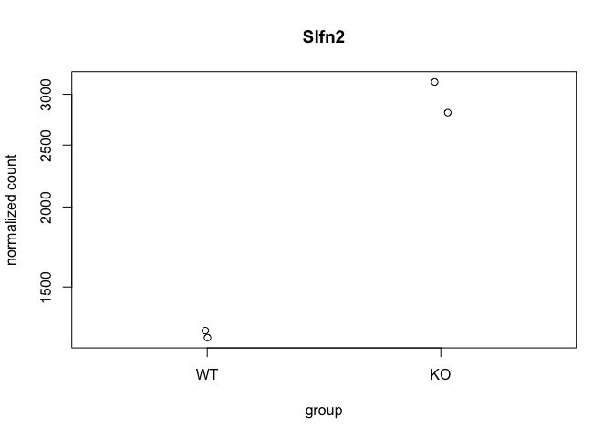

Rev-Erba in Th17 RNA-seq Practice
================

## This is the RNA-seq data from Rev-ERBa Th17 paper published on Cell Reports.

``` r
library(DESeq2)
```

    ## Loading required package: S4Vectors

    ## Loading required package: stats4

    ## Loading required package: BiocGenerics

    ## Loading required package: parallel

    ## 
    ## Attaching package: 'BiocGenerics'

    ## The following objects are masked from 'package:parallel':
    ## 
    ##     clusterApply, clusterApplyLB, clusterCall, clusterEvalQ,
    ##     clusterExport, clusterMap, parApply, parCapply, parLapply,
    ##     parLapplyLB, parRapply, parSapply, parSapplyLB

    ## The following objects are masked from 'package:stats':
    ## 
    ##     IQR, mad, sd, var, xtabs

    ## The following objects are masked from 'package:base':
    ## 
    ##     anyDuplicated, append, as.data.frame, basename, cbind, colnames,
    ##     dirname, do.call, duplicated, eval, evalq, Filter, Find, get, grep,
    ##     grepl, intersect, is.unsorted, lapply, Map, mapply, match, mget,
    ##     order, paste, pmax, pmax.int, pmin, pmin.int, Position, rank,
    ##     rbind, Reduce, rownames, sapply, setdiff, sort, table, tapply,
    ##     union, unique, unsplit, which, which.max, which.min

    ## 
    ## Attaching package: 'S4Vectors'

    ## The following object is masked from 'package:base':
    ## 
    ##     expand.grid

    ## Loading required package: IRanges

    ## Loading required package: GenomicRanges

    ## Loading required package: GenomeInfoDb

    ## Loading required package: SummarizedExperiment

    ## Loading required package: Biobase

    ## Welcome to Bioconductor
    ## 
    ##     Vignettes contain introductory material; view with
    ##     'browseVignettes()'. To cite Bioconductor, see
    ##     'citation("Biobase")', and for packages 'citation("pkgname")'.

    ## Loading required package: DelayedArray

    ## Loading required package: matrixStats

    ## 
    ## Attaching package: 'matrixStats'

    ## The following objects are masked from 'package:Biobase':
    ## 
    ##     anyMissing, rowMedians

    ## Loading required package: BiocParallel

    ## 
    ## Attaching package: 'DelayedArray'

    ## The following objects are masked from 'package:matrixStats':
    ## 
    ##     colMaxs, colMins, colRanges, rowMaxs, rowMins, rowRanges

    ## The following objects are masked from 'package:base':
    ## 
    ##     aperm, apply, rowsum

``` r
library(dplyr)
```

    ## 
    ## Attaching package: 'dplyr'

    ## The following object is masked from 'package:matrixStats':
    ## 
    ##     count

    ## The following object is masked from 'package:Biobase':
    ## 
    ##     combine

    ## The following objects are masked from 'package:GenomicRanges':
    ## 
    ##     intersect, setdiff, union

    ## The following object is masked from 'package:GenomeInfoDb':
    ## 
    ##     intersect

    ## The following objects are masked from 'package:IRanges':
    ## 
    ##     collapse, desc, intersect, setdiff, slice, union

    ## The following objects are masked from 'package:S4Vectors':
    ## 
    ##     first, intersect, rename, setdiff, setequal, union

    ## The following objects are masked from 'package:BiocGenerics':
    ## 
    ##     combine, intersect, setdiff, union

    ## The following objects are masked from 'package:stats':
    ## 
    ##     filter, lag

    ## The following objects are masked from 'package:base':
    ## 
    ##     intersect, setdiff, setequal, union

load count data from GEO
database

``` r
count<- read.csv("GSE122726 WTVSKO.csv",stringsAsFactors = FALSE,row.names = 1)
rownames(count) <- gsub("\t", "", rownames(count))
head(count)
```

    ##               X218_1 X218_2 X218_5 X218_6
    ## 0610007P14Rik   2928   2789   2776   2565
    ## 0610009B22Rik    170    177    160    172
    ## 0610009E02Rik      4      9      3      2
    ## 0610009L18Rik     51     59     44     39
    ## 0610009O20Rik   1286   1306   1225   1076
    ## 0610010F05Rik    753    673    674    727

Tidy up the counts data to exclude `zero` value

``` r
filter.Count <- count[rowSums(count)!=0,]
head(filter.Count)
```

    ##               X218_1 X218_2 X218_5 X218_6
    ## 0610007P14Rik   2928   2789   2776   2565
    ## 0610009B22Rik    170    177    160    172
    ## 0610009E02Rik      4      9      3      2
    ## 0610009L18Rik     51     59     44     39
    ## 0610009O20Rik   1286   1306   1225   1076
    ## 0610010F05Rik    753    673    674    727

Create a `meta` for
metadata

``` r
id <- colnames(filter.Count)
```

``` r
meta <- data.frame("id"=id[1:4], "condition" = c(rep("WT",2),rep("KO",2)), stringsAsFactors = FALSE)
```

``` r
dds <- DESeqDataSetFromMatrix(countData=filter.Count, 
                              colData=meta, 
                              design=~condition
                              )
```

    ## Warning in DESeqDataSet(se, design = design, ignoreRank): some variables in
    ## design formula are characters, converting to factors

``` r
#set WT as reference level
dds$condition <- relevel(dds$condition, ref = "WT")
```

``` r
dds <- DESeq(dds)
```

    ## estimating size factors

    ## estimating dispersions

    ## gene-wise dispersion estimates

    ## mean-dispersion relationship

    ## final dispersion estimates

    ## fitting model and testing

``` r
head(dds)
```

    ## class: DESeqDataSet 
    ## dim: 6 4 
    ## metadata(1): version
    ## assays(4): counts mu H cooks
    ## rownames(6): 0610007P14Rik 0610009B22Rik ... 0610009O20Rik
    ##   0610010F05Rik
    ## rowData names(22): baseMean baseVar ... deviance maxCooks
    ## colnames(4): X218_1 X218_2 X218_5 X218_6
    ## colData names(3): id condition sizeFactor

Get Deseq results

``` r
res <- results(dds)
summary(res)
```

    ## 
    ## out of 19509 with nonzero total read count
    ## adjusted p-value < 0.1
    ## LFC > 0 (up)       : 53, 0.27%
    ## LFC < 0 (down)     : 79, 0.4%
    ## outliers [1]       : 0, 0%
    ## low counts [2]     : 6808, 35%
    ## (mean count < 11)
    ## [1] see 'cooksCutoff' argument of ?results
    ## [2] see 'independentFiltering' argument of ?results

Subset the DEG with adjust p value lower than 0.05

``` r
resAdjSig05 <- subset(as.data.frame(res),padj <0.05)
head(resAdjSig05)
```

    ##                 baseMean log2FoldChange      lfcSE      stat       pvalue
    ## 1700048O20Rik   37.84731      2.4004142 0.50252080  4.776746 1.781546e-06
    ## 2610035D17Rik   86.18120      1.2653131 0.31323403  4.039513 5.356221e-05
    ## AA465934       184.28219      1.6673535 0.23046624  7.234698 4.665676e-13
    ## Acvrl1        3171.68370     -0.3189819 0.07893704 -4.040966 5.323142e-05
    ## Adam19        3159.52117      0.3854628 0.07194738  5.357565 8.435090e-08
    ## Aldh1l1         68.26443     -1.4162160 0.35175762 -4.026113 5.670640e-05
    ##                       padj
    ## 1700048O20Rik 4.190262e-04
    ## 2610035D17Rik 8.617295e-03
    ## AA465934      2.821845e-10
    ## Acvrl1        8.617295e-03
    ## Adam19        2.747028e-05
    ## Aldh1l1       9.002850e-03

``` r
resAdjSig05up <- subset(resAdjSig05,resAdjSig05$log2FoldChange>0)
resAdjSig05down <- subset(resAdjSig05,resAdjSig05$log2FoldChange<0)
head(resAdjSig05up)
```

    ##                 baseMean log2FoldChange      lfcSE     stat       pvalue
    ## 1700048O20Rik   37.84731      2.4004142 0.50252080 4.776746 1.781546e-06
    ## 2610035D17Rik   86.18120      1.2653131 0.31323403 4.039513 5.356221e-05
    ## AA465934       184.28219      1.6673535 0.23046624 7.234698 4.665676e-13
    ## Adam19        3159.52117      0.3854628 0.07194738 5.357565 8.435090e-08
    ## C030037D09Rik  133.61907      0.9508722 0.25593385 3.715304 2.029592e-04
    ## Ccdc50        5286.99347      0.2836683 0.06914969 4.102235 4.091783e-05
    ##                       padj
    ## 1700048O20Rik 4.190262e-04
    ## 2610035D17Rik 8.617295e-03
    ## AA465934      2.821845e-10
    ## Adam19        2.747028e-05
    ## C030037D09Rik 2.657509e-02
    ## Ccdc50        7.119142e-03

``` r
head(resAdjSig05down)
```

    ##           baseMean log2FoldChange      lfcSE      stat       pvalue
    ## Acvrl1  3171.68370     -0.3189819 0.07893704 -4.040966 5.323142e-05
    ## Aldh1l1   68.26443     -1.4162160 0.35175762 -4.026113 5.670640e-05
    ## Alpk2   1408.36458     -0.9718010 0.09752012 -9.965133 2.165836e-23
    ## Anxa3    504.47960     -0.6760196 0.13622227 -4.962621 6.954810e-07
    ## App       74.20809     -1.4192135 0.33912030 -4.184985 2.851846e-05
    ## Arl4c   2640.49342     -0.2904073 0.07557178 -3.842801 1.216383e-04
    ##                 padj
    ## Acvrl1  8.617295e-03
    ## Aldh1l1 9.002850e-03
    ## Alpk2   9.169427e-20
    ## Anxa3   1.879427e-04
    ## App     5.207065e-03
    ## Arl4c   1.716587e-02

Save result with DE gene ordered by padj

``` r
write.csv(resAdjSig05, "adjsignif05_results.csv")
write.csv(resAdjSig05up, "adjsignif05_results_up.csv")
write.csv(resAdjSig05down, "adjsignif05_results_down.csv")
```

\#\#Plot Deseq Result

\#MA-plot

``` r
# unshrunken
plotMA(res,ylim=c(-2,2))
```

<!-- -->

``` r
#Shrunken
res_shrink <- lfcShrink(dds, contrast=c("condition","KO","WT"), res=res)
```

    ## using 'normal' for LFC shrinkage, the Normal prior from Love et al (2014).
    ## 
    ## Note that type='apeglm' and type='ashr' have shown to have less bias than type='normal'.
    ## See ?lfcShrink for more details on shrinkage type, and the DESeq2 vignette.
    ## Reference: https://doi.org/10.1093/bioinformatics/bty895

``` r
plotMA(res_shrink,ylim=c(-2,2))
```

<!-- -->

``` r
#plot p-value distribution
hist(resAdjSig05$pvalue)
```

<!-- -->

``` r
# Plot dispersion estimates
plotDispEsts(dds, main="DESeq2")
```

<!-- -->

\#Plot counts

This is to examine the counts of reads for a single gene across the
groups. `plotCounts()` normalizes counts by sequencing depth and adds a
pseudocount of 1/2 to allow for log scale plotting.

``` r
plotCounts(dds, gene=which.min(res$padj),intgroup = "condition")
```

<!-- -->

Blind dispersion estimation

``` r
rld <- rlog(dds,blind=FALSE)
vsd <- varianceStabilizingTransformation(dds,blind=FALSE)
vsd.fast <- vst(dds,blind=FALSE)
head(assay(rld),3)
```

    ##                  X218_1    X218_2    X218_5    X218_6
    ## 0610007P14Rik 11.447803 11.410782 11.470369 11.391508
    ## 0610009B22Rik  7.399939  7.406135  7.403720  7.410757
    ## 0610009E02Rik  2.150429  2.155967  2.149637  2.148360

``` r
head(assay(vsd),3)
```

    ##                  X218_1    X218_2    X218_5    X218_6
    ## 0610007P14Rik 11.941990 11.888606 11.974721 11.860552
    ## 0610009B22Rik  9.974410  9.988549  9.983008  9.999112
    ## 0610009E02Rik  9.343774  9.401414  9.332575  9.312164

``` r
head(assay(vsd.fast),3)
```

    ##                  X218_1    X218_2    X218_5    X218_6
    ## 0610007P14Rik 11.830873 11.773687 11.865879 11.743589
    ## 0610009B22Rik  9.635285  9.651702  9.645269  9.663963
    ## 0610009E02Rik  8.897569  8.965292  8.884409  8.860421

## Heatmap of the count matrix

``` r
library("pheatmap")
select <- order(rowMeans(counts(dds,normalized=TRUE)),decreasing =TRUE)[1:20]
nt <- normTransform(dds) #defaults to log2(x+1)
log2.norm.counts <- assay(nt)[select,]
df <- data.frame("condition" = c(rep("WT",2),rep("KO",2)))
rownames(df) <- meta$id
pheatmap(log2.norm.counts,cluster_rows = FALSE,show_rownames = FALSE,cluster_cols = FALSE,annotation_col =df)
```

<!-- -->

``` r
pheatmap(assay(rld)[select,],cluster_rows = FALSE,show_rownames = FALSE,cluster_cols = FALSE,annotation_col =df)
```

<!-- -->

``` r
pheatmap(assay(vsd)[select,],cluster_rows = FALSE,show_rownames = FALSE,cluster_cols = FALSE,annotation_col =df)
```

<!-- -->

??? Not sure how to do it

``` r
select.padj <- order(res$padj,res$log2FoldChange)[1:50]

df <- data.frame("condition" = c(rep("WT",2),rep("KO",2)))
rownames(df) <- meta$id

pheatmap(assay(vsd)[select.padj,],cluster_rows = FALSE,show_rownames = FALSE,cluster_cols = FALSE,annotation_col =df)
```

<!-- -->

``` r
sampleDists <- dist(t(assay(rld)))
```

``` r
library("RColorBrewer")
sampleDistMatrix <- as.matrix(sampleDists)
rownames(sampleDistMatrix) <- paste(rld$condition,rld$id)
colnames(sampleDistMatrix) <- NULL
colors <- colorRampPalette(rev(brewer.pal(9,"Blues")))(100)
pheatmap(sampleDistMatrix,
         clustering_distance_rows = sampleDists,
         clustering_distance_cols = sampleDists,
         col=colors)
```

<!-- -->

PCA plot

``` r
plotPCA(rld,intgroup = "condition")
```

<!-- -->

``` r
library(ggplot2)
data <- plotPCA(rld, intgroup="condition", returnData=TRUE)
percentVar <- round(100 * attr(data, "percentVar"))
ggplot(data, aes(PC1, PC2, color=condition)) +
    geom_point(size=3) +
    xlab(paste0("PC1: ",percentVar[1],"% variance")) 
```

<!-- -->

``` r
    ylab(paste0("PC2: ",percentVar[2],"% variance"))
```

    ## $y
    ## [1] "PC2: 19% variance"
    ## 
    ## attr(,"class")
    ## [1] "labels"

``` r
library(org.Mm.eg.db)
```

    ## Loading required package: AnnotationDbi

    ## 
    ## Attaching package: 'AnnotationDbi'

    ## The following object is masked from 'package:dplyr':
    ## 
    ##     select

    ## 

``` r
library("AnnotationDbi")
```

``` r
columns(org.Mm.eg.db)
```

    ##  [1] "ACCNUM"       "ALIAS"        "ENSEMBL"      "ENSEMBLPROT"  "ENSEMBLTRANS"
    ##  [6] "ENTREZID"     "ENZYME"       "EVIDENCE"     "EVIDENCEALL"  "GENENAME"    
    ## [11] "GO"           "GOALL"        "IPI"          "MGI"          "ONTOLOGY"    
    ## [16] "ONTOLOGYALL"  "PATH"         "PFAM"         "PMID"         "PROSITE"     
    ## [21] "REFSEQ"       "SYMBOL"       "UNIGENE"      "UNIPROT"

``` r
res$entrez <-unname(mapIds(org.Mm.eg.db, rownames(res), "ENTREZID", "SYMBOL"))
```

    ## 'select()' returned 1:1 mapping between keys and columns

``` r
res$ensembl <- unname(mapIds(org.Mm.eg.db, rownames(res), "ENSEMBL", "SYMBOL"))
```

    ## 'select()' returned 1:many mapping between keys and columns

``` r
head(res)
```

    ## log2 fold change (MLE): condition KO vs WT 
    ## Wald test p-value: condition KO vs WT 
    ## DataFrame with 6 rows and 8 columns
    ##                       baseMean      log2FoldChange             lfcSE
    ##                      <numeric>           <numeric>         <numeric>
    ## 0610007P14Rik   2761.145515685 0.00433554420887819 0.082302842092855
    ## 0610009B22Rik 169.517594574222  0.0374447614202501  0.21705934959602
    ## 0610009E02Rik 4.43064706808115   -1.27386465722263  1.34837468052316
    ## 0610009L18Rik 48.0137820042001  -0.303630572303751 0.402019106683867
    ## 0610009O20Rik 1220.85738826761 -0.0688936107315965 0.104482147143169
    ## 0610010F05Rik 706.126988945113  0.0755392000171109 0.120639528105799
    ##                             stat            pvalue              padj
    ##                        <numeric>         <numeric>         <numeric>
    ## 0610007P14Rik 0.0526779403800756 0.957988515643088 0.999813356907188
    ## 0610009B22Rik  0.172509322864647 0.863037132649025 0.999813356907188
    ## 0610009E02Rik -0.944740861440959 0.344791190500969                NA
    ## 0610009L18Rik -0.755264034110983 0.450090574095594 0.999813356907188
    ## 0610009O20Rik -0.659381651462365  0.50965072162742 0.999813356907188
    ## 0610010F05Rik  0.626156295562299 0.531212430280559 0.999813356907188
    ##                    entrez            ensembl
    ##               <character>        <character>
    ## 0610007P14Rik          NA                 NA
    ## 0610009B22Rik       66050 ENSMUSG00000007777
    ## 0610009E02Rik   100125929 ENSMUSG00000086714
    ## 0610009L18Rik       66838 ENSMUSG00000043644
    ## 0610009O20Rik          NA                 NA
    ## 0610010F05Rik       71675 ENSMUSG00000042208

``` r
resOrdered <- res[order(res$pvalue),]
head(resOrdered)
```

    ## log2 fold change (MLE): condition KO vs WT 
    ## Wald test p-value: condition KO vs WT 
    ## DataFrame with 6 rows and 8 columns
    ##                 baseMean     log2FoldChange              lfcSE
    ##                <numeric>          <numeric>          <numeric>
    ## Slfn2   2119.19662615432   1.23152346597708 0.0878076920804373
    ## Xist    2179.65878242058  -11.4551817642219  0.836570068118894
    ## Alpk2   1408.36457970491 -0.971800977440168 0.0975201202518518
    ## Eif2s3y 878.412211630237   13.2737344786665    1.4463775756324
    ## Basp1   1011.28976655667 -0.929072307373019  0.102598181494546
    ## Igfbp4   5190.5461238049  -0.60718180806414 0.0680295460042288
    ##                      stat               pvalue                 padj      entrez
    ##                 <numeric>            <numeric>            <numeric> <character>
    ## Slfn2    14.0252344276277 1.09250535086622e-44 1.38759104613519e-40       20556
    ## Xist    -13.6930332565925 1.11745238657994e-42  7.0963813809759e-39      213742
    ## Alpk2   -9.96513309182179 2.16583585218974e-23 9.16942705288732e-20      225638
    ## Eif2s3y  9.17722640498129  4.4233758427207e-20 1.40453241445989e-16       26908
    ## Basp1   -9.05544614767274 1.36010623612147e-19 3.45494186099576e-16       70350
    ## Igfbp4  -8.92526620751514 4.44628565312558e-19   9.412045680058e-16       16010
    ##                    ensembl
    ##                <character>
    ## Slfn2   ENSMUSG00000072620
    ## Xist    ENSMUSG00000086503
    ## Alpk2   ENSMUSG00000032845
    ## Eif2s3y ENSMUSG00000069049
    ## Basp1   ENSMUSG00000045763
    ## Igfbp4  ENSMUSG00000017493

``` r
write.csv(as.data.frame(resOrdered), file="results.csv")
```

heatmap for gene clustering

``` r
library("genefilter")
```

    ## 
    ## Attaching package: 'genefilter'

    ## The following objects are masked from 'package:matrixStats':
    ## 
    ##     rowSds, rowVars

``` r
topVarGenes <- head(order(rowVars(assay(rld)), decreasing = TRUE), 100)
```

``` r
library("gplots")
```

    ## 
    ## Attaching package: 'gplots'

    ## The following object is masked from 'package:IRanges':
    ## 
    ##     space

    ## The following object is masked from 'package:S4Vectors':
    ## 
    ##     space

    ## The following object is masked from 'package:stats':
    ## 
    ##     lowess

``` r
#head(rownames(resOrdered))
LFCvsdup <- subset(assay(vsd), rownames(assay(vsd)) %in% rownames(resAdjSig05up))
LFCvsddown <- subset(assay(vsd), rownames(assay(vsd)) %in% rownames(resAdjSig05down))


LFCtopVarGenesup <- head(order(rowVars(LFCvsdup),decreasing=TRUE),40)
LFCtopVarGenesdown <- head(order(rowVars(LFCvsddown), decreasing = TRUE),67)

#Heatmap for topVarGenes from resAdjSig05up
heatmap.2(LFCvsdup[LFCtopVarGenesup,], scale = "row", trace = "none", dendrogram = "column",
col = colorRampPalette(rev(brewer.pal(9, "RdBu")))(255))
```

<!-- -->

``` r
heatmap.2(LFCvsddown[LFCtopVarGenesdown,], scale = "row", trace = "none", dendrogram = "column",Colv=FALSE,
col = colorRampPalette(rev(brewer.pal(9, "RdBu")))(255),labRow = rownames(LFCvsddown)[LFCtopVarGenesdown])
```

    ## Warning in heatmap.2(LFCvsddown[LFCtopVarGenesdown, ], scale = "row", trace =
    ## "none", : Discrepancy: Colv is FALSE, while dendrogram is `column'. Omitting
    ## column dendogram.

<!-- -->

``` r
pheatmap(LFCvsdup[LFCtopVarGenesup,],scale = "row",clustering_distance_rows = "correlation",cluster_rows = FALSE,show_rownames = TRUE,cluster_cols = FALSE,annotation_col =df)
```

<!-- -->

## GSEA with `gage` package

``` r
library(gage)
library(pathview)
```

    ## Loading required package: org.Hs.eg.db

    ## 

    ## ##############################################################################
    ## Pathview is an open source software package distributed under GNU General
    ## Public License version 3 (GPLv3). Details of GPLv3 is available at
    ## http://www.gnu.org/licenses/gpl-3.0.html. Particullary, users are required to
    ## formally cite the original Pathview paper (not just mention it) in publications
    ## or products. For details, do citation("pathview") within R.
    ## 
    ## The pathview downloads and uses KEGG data. Non-academic uses may require a KEGG
    ## license agreement (details at http://www.kegg.jp/kegg/legal.html).
    ## ##############################################################################

``` r
library(gageData)
data("kegg.sets.mm")
data(sigmet.idx.mm)
```

``` r
kegg.sets.M=kegg.sets.mm[sigmet.idx.mm]
head(kegg.sets.mm,3)
```

    ## $`mmu04144 Endocytosis`
    ##   [1] "100017"    "100039024" "100044874" "100045864" "103967"    "106572"   
    ##   [7] "106952"    "107305"    "107568"    "109689"    "110355"    "110557"   
    ##  [13] "110696"    "11554"     "11555"     "11556"     "116733"    "11771"    
    ##  [19] "11772"     "11773"     "11845"     "11848"     "12389"     "12390"    
    ##  [25] "12391"     "12402"     "12540"     "12757"     "12765"     "12767"    
    ##  [31] "12774"     "12978"     "13132"     "13196"     "13429"     "13430"    
    ##  [37] "13645"     "13649"     "13660"     "13854"     "13855"     "13858"    
    ##  [43] "13867"     "13869"     "140500"    "14062"     "14183"     "14184"    
    ##  [49] "14186"     "14254"     "14275"     "14276"     "14772"     "14773"    
    ##  [55] "14963"     "14964"     "14972"     "14985"     "14990"     "14991"    
    ##  [61] "14997"     "15006"     "15007"     "15013"     "15018"     "15019"    
    ##  [67] "15024"     "15039"     "15040"     "15042"     "15043"     "15051"    
    ##  [73] "15239"     "15461"     "15481"     "15482"     "15511"     "15512"    
    ##  [79] "16001"     "16184"     "16185"     "16186"     "16396"     "16542"    
    ##  [85] "16590"     "16835"     "17126"     "17127"     "17130"     "17131"    
    ##  [91] "17246"     "17295"     "17999"     "18211"     "18571"     "18595"    
    ##  [97] "18717"     "18719"     "18720"     "18759"     "18762"     "18805"    
    ## [103] "18806"     "18854"     "19326"     "19334"     "19341"     "19344"    
    ## [109] "19345"     "19349"     "193740"    "194309"    "19713"     "20404"    
    ## [115] "20405"     "20408"     "20479"     "20779"     "208092"    "20844"    
    ## [121] "208650"    "211914"    "212285"    "213990"    "215445"    "215632"   
    ## [127] "216238"    "216439"    "216724"    "216859"    "216869"    "216963"   
    ## [133] "21803"     "21808"     "21809"     "21812"     "21813"     "218441"   
    ## [139] "22034"     "22042"     "22088"     "22365"     "224753"    "224754"   
    ## [145] "224756"    "224761"    "227288"    "227700"    "227733"    "228998"   
    ## [151] "230597"    "230837"    "232227"    "232910"    "234353"    "234852"   
    ## [157] "24013"     "243621"    "245666"    "259300"    "26385"     "26431"    
    ## [163] "268451"    "271457"    "27681"     "28084"     "330192"    "333715"   
    ## [169] "347722"    "399549"    "433749"    "52055"     "52348"     "53869"    
    ## [175] "54189"     "54673"     "547349"    "56324"     "56513"     "57440"    
    ## [181] "58194"     "58220"     "64931"     "66201"     "66251"     "66313"    
    ## [187] "66371"     "66700"     "66914"     "67028"     "67064"     "67300"    
    ## [193] "67588"     "68942"     "68953"     "69710"     "69780"     "70160"    
    ## [199] "70527"     "71770"     "71889"     "72543"     "72685"     "73711"    
    ## [205] "73728"     "74002"     "74006"     "74325"     "74998"     "75608"    
    ## [211] "75767"     "75788"     "76959"     "77038"     "78287"     "78618"    
    ## [217] "80794"     "83814"     "84092"     "93737"     "93742"     "98366"    
    ## [223] "98878"    
    ## 
    ## $`mmu03008 Ribosome biogenesis in eukaryotes`
    ##  [1] "100019"    "100044829" "100045148" "100045968" "100045999" "100047957"
    ##  [7] "100503708" "100505330" "101592"    "102462"    "102614"    "103573"   
    ## [13] "104444"    "105372"    "108143"    "110816"    "117109"    "12995"    
    ## [19] "13000"     "13001"     "14000"     "14113"     "14791"     "16418"    
    ## [25] "170722"    "17724"     "17725"     "19384"     "19428"     "195434"   
    ## [31] "20826"     "208366"    "213773"    "213895"    "21453"     "216987"   
    ## [37] "217109"    "21771"     "217995"    "224092"    "225348"    "227522"   
    ## [43] "230082"    "230737"    "237082"    "237107"    "24127"     "24128"    
    ## [49] "245474"    "245610"    "269470"    "27993"     "30877"     "434401"   
    ## [55] "52530"     "53319"     "54364"     "55989"     "56488"     "57815"    
    ## [61] "59028"     "633406"    "633966"    "66161"     "66181"     "66711"    
    ## [67] "66932"     "67045"     "67134"     "67459"     "67619"     "67724"    
    ## [73] "67973"     "68147"     "68272"     "69237"     "69961"     "71340"    
    ## [79] "72515"     "72554"     "73674"     "73736"     "74097"     "74778"    
    ## [85] "75471"     "83454"     "97112"     "98956"    
    ## 
    ## $`mmu04141 Protein processing in endoplasmic reticulum`
    ##   [1] "100037258" "100041121" "100042561" "100043027" "100043039" "100046078"
    ##   [7] "100046302" "100504754" "103963"    "105245"    "107513"    "108687"   
    ##  [13] "109815"    "110379"    "110616"    "116891"    "11911"     "12017"    
    ##  [19] "12018"     "12028"     "12043"     "12282"     "12304"     "12317"    
    ##  [25] "12330"     "12333"     "12334"     "12364"     "12915"     "12954"    
    ##  [31] "12955"     "13002"     "13135"     "13198"     "13200"     "13418"    
    ##  [37] "13665"     "13666"     "140499"    "140740"    "14376"     "14827"    
    ##  [43] "14828"     "15467"     "15481"     "15482"     "15502"     "15505"    
    ##  [49] "15511"     "15512"     "15516"     "15519"     "16430"     "17155"    
    ##  [55] "17156"     "17872"     "18024"     "18415"     "18453"     "18786"    
    ##  [61] "19089"     "19106"     "192193"    "19358"     "19359"     "193740"   
    ##  [67] "20014"     "20224"     "20334"     "20335"     "20338"     "20832"    
    ##  [73] "213539"    "21402"     "216080"    "216197"    "216440"    "217365"   
    ##  [79] "218793"    "218811"    "22027"     "22030"     "22193"     "22194"    
    ##  [85] "22213"     "22230"     "223455"    "22393"     "22433"     "226418"   
    ##  [91] "226641"    "227619"    "230815"    "230904"    "231098"    "235416"   
    ##  [97] "23802"     "240667"    "244178"    "244179"    "26400"     "26408"    
    ## [103] "26414"     "26419"     "26420"     "269523"    "26965"     "27054"    
    ## [109] "27061"     "270669"    "27103"     "320011"    "386649"    "50527"    
    ## [115] "50762"     "50873"     "50907"     "53421"     "54197"     "54609"    
    ## [121] "56085"     "56228"     "56424"     "56438"     "56445"     "56453"    
    ## [127] "56550"     "56709"     "56812"     "57377"     "57743"     "59007"    
    ## [133] "632883"    "63958"     "64209"     "66105"     "66212"     "66245"    
    ## [139] "66256"     "66326"     "66397"     "66435"     "66530"     "66753"    
    ## [145] "66861"     "66890"     "66967"     "67128"     "67397"     "67437"    
    ## [151] "67475"     "67819"     "67838"     "68292"     "69162"     "69276"    
    ## [157] "69608"     "70361"     "70377"     "71853"     "72265"     "74126"    
    ## [163] "75744"     "77371"     "78943"     "80286"     "81489"     "81500"    
    ## [169] "81910"     "94232"     "99683"

``` r
foldchanges <-  res$log2FoldChange
names(foldchanges) <- res$entrez
head(foldchanges)
```

    ##         <NA>        66050    100125929        66838         <NA>        71675 
    ##  0.004335544  0.037444761 -1.273864657 -0.303630572 -0.068893611  0.075539200

``` r
keggres = gage(foldchanges,gsets = kegg.sets.mm)
attributes(keggres)
```

    ## $names
    ## [1] "greater" "less"    "stats"

``` r
keggl <- keggres$less
keggs <- keggres$stats
```

``` r
lapply(keggres,head)
```

    ## $greater
    ##                                                        p.geomean stat.mean
    ## mmu05222 Small cell lung cancer                        0.1315726 1.1240497
    ## mmu03013 RNA transport                                 0.1453328 1.0587147
    ## mmu00561 Glycerolipid metabolism                       0.1585434 1.0070968
    ## mmu04062 Chemokine signaling pathway                   0.1668675 0.9682386
    ## mmu00603 Glycosphingolipid biosynthesis - globo series 0.1737546 0.9594562
    ## mmu05146 Amoebiasis                                    0.1760803 0.9333003
    ##                                                            p.val     q.val
    ## mmu05222 Small cell lung cancer                        0.1315726 0.8430796
    ## mmu03013 RNA transport                                 0.1453328 0.8430796
    ## mmu00561 Glycerolipid metabolism                       0.1585434 0.8430796
    ## mmu04062 Chemokine signaling pathway                   0.1668675 0.8430796
    ## mmu00603 Glycosphingolipid biosynthesis - globo series 0.1737546 0.8430796
    ## mmu05146 Amoebiasis                                    0.1760803 0.8430796
    ##                                                        set.size      exp1
    ## mmu05222 Small cell lung cancer                              78 0.1315726
    ## mmu03013 RNA transport                                      143 0.1453328
    ## mmu00561 Glycerolipid metabolism                             43 0.1585434
    ## mmu04062 Chemokine signaling pathway                        151 0.1668675
    ## mmu00603 Glycosphingolipid biosynthesis - globo series       13 0.1737546
    ## mmu05146 Amoebiasis                                          80 0.1760803
    ## 
    ## $less
    ##                                                        p.geomean stat.mean
    ## mmu04672 Intestinal immune network for IgA production 0.05171106 -1.652349
    ## mmu00590 Arachidonic acid metabolism                  0.08602947 -1.381137
    ## mmu04960 Aldosterone-regulated sodium reabsorption    0.08783525 -1.368787
    ## mmu04610 Complement and coagulation cascades          0.13653874 -1.105336
    ## mmu04930 Type II diabetes mellitus                    0.13864232 -1.093912
    ## mmu04340 Hedgehog signaling pathway                   0.14574758 -1.062963
    ##                                                            p.val     q.val
    ## mmu04672 Intestinal immune network for IgA production 0.05171106 0.7377774
    ## mmu00590 Arachidonic acid metabolism                  0.08602947 0.7377774
    ## mmu04960 Aldosterone-regulated sodium reabsorption    0.08783525 0.7377774
    ## mmu04610 Complement and coagulation cascades          0.13653874 0.7377774
    ## mmu04930 Type II diabetes mellitus                    0.13864232 0.7377774
    ## mmu04340 Hedgehog signaling pathway                   0.14574758 0.7377774
    ##                                                       set.size       exp1
    ## mmu04672 Intestinal immune network for IgA production       37 0.05171106
    ## mmu00590 Arachidonic acid metabolism                        33 0.08602947
    ## mmu04960 Aldosterone-regulated sodium reabsorption          35 0.08783525
    ## mmu04610 Complement and coagulation cascades                35 0.13653874
    ## mmu04930 Type II diabetes mellitus                          41 0.13864232
    ## mmu04340 Hedgehog signaling pathway                         37 0.14574758
    ## 
    ## $stats
    ##                                                        stat.mean      exp1
    ## mmu05222 Small cell lung cancer                        1.1240497 1.1240497
    ## mmu03013 RNA transport                                 1.0587147 1.0587147
    ## mmu00561 Glycerolipid metabolism                       1.0070968 1.0070968
    ## mmu04062 Chemokine signaling pathway                   0.9682386 0.9682386
    ## mmu00603 Glycosphingolipid biosynthesis - globo series 0.9594562 0.9594562
    ## mmu05146 Amoebiasis                                    0.9333003 0.9333003

``` r
keggrespathways <- data.frame(id=rownames(keggres$greater,keggres$greater %>% tbl_df() %>% filter(row_number()<=5 %>% .$id %>% as.character())))
keggrespathways
```

    ##                                                                      id
    ## 1                                       mmu05222 Small cell lung cancer
    ## 2                                                mmu03013 RNA transport
    ## 3                                      mmu00561 Glycerolipid metabolism
    ## 4                                  mmu04062 Chemokine signaling pathway
    ## 5                mmu00603 Glycosphingolipid biosynthesis - globo series
    ## 6                                                   mmu05146 Amoebiasis
    ## 7                        mmu04622 RIG-I-like receptor signaling pathway
    ## 8                                    mmu03015 mRNA surveillance pathway
    ## 9                                       mmu04740 Olfactory transduction
    ## 10                                                mmu04540 Gap junction
    ## 11                             mmu00900 Terpenoid backbone biosynthesis
    ## 12                                        mmu00100 Steroid biosynthesis
    ## 13                                          mmu04742 Taste transduction
    ## 14                                           mmu04744 Phototransduction
    ## 15                                         mmu00620 Pyruvate metabolism
    ## 16                              mmu04966 Collecting duct acid secretion
    ## 17                                                  mmu04110 Cell cycle
    ## 18                           mmu04662 B cell receptor signaling pathway
    ## 19                                       mmu04115 p53 signaling pathway
    ## 20                                    mmu04512 ECM-receptor interaction
    ## 21                                                    mmu05218 Melanoma
    ## 22                         mmu05014 Amyotrophic lateral sclerosis (ALS)
    ## 23                     mmu00630 Glyoxylate and dicarboxylate metabolism
    ## 24                                      mmu05414 Dilated cardiomyopathy
    ## 25            mmu00534 Glycosaminoglycan biosynthesis - heparan sulfate
    ## 26                                                   mmu04145 Phagosome
    ## 27                                                 mmu03040 Spliceosome
    ## 28                                         mmu05012 Parkinson's disease
    ## 29                                    mmu00360 Phenylalanine metabolism
    ## 30                   mmu05142 Chagas disease (American trypanosomiasis)
    ## 31                                       mmu00240 Pyrimidine metabolism
    ## 32                                             mmu03018 RNA degradation
    ## 33                                       mmu00071 Fatty acid metabolism
    ## 34                    mmu00040 Pentose and glucuronate interconversions
    ## 35                                              mmu04510 Focal adhesion
    ## 36                                               mmu05145 Toxoplasmosis
    ## 37                             mmu00051 Fructose and mannose metabolism
    ## 38                               mmu00562 Inositol phosphate metabolism
    ## 39                                           mmu00230 Purine metabolism
    ## 40                                                   mmu04210 Apoptosis
    ## 41                                 mmu00970 Aminoacyl-tRNA biosynthesis
    ## 42                           mmu03008 Ribosome biogenesis in eukaryotes
    ## 43                                 mmu03022 Basal transcription factors
    ## 44                                   mmu00020 Citrate cycle (TCA cycle)
    ## 45                                        mmu00340 Histidine metabolism
    ## 46                                  mmu04350 TGF-beta signaling pathway
    ## 47                   mmu04650 Natural killer cell mediated cytotoxicity
    ## 48                                   mmu00190 Oxidative phosphorylation
    ## 49                                    mmu05220 Chronic myeloid leukemia
    ## 50                              mmu04120 Ubiquitin mediated proteolysis
    ## 51                                          mmu00310 Lysine degradation
    ## 52                                      mmu04720 Long-term potentiation
    ## 53                                             mmu03030 DNA replication
    ## 54                     mmu04914 Progesterone-mediated oocyte maturation
    ## 55                                mmu00010 Glycolysis / Gluconeogenesis
    ## 56                                   mmu04020 Calcium signaling pathway
    ## 57                                          mmu04970 Salivary secretion
    ## 58                                              mmu04530 Tight junction
    ## 59                                      mmu04010 MAPK signaling pathway
    ## 60                                             mmu03430 Mismatch repair
    ## 61                                    mmu03440 Homologous recombination
    ## 62                           mmu00053 Ascorbate and aldarate metabolism
    ## 63                                        mmu00052 Galactose metabolism
    ## 64                                   mmu04710 Circadian rhythm - mammal
    ## 65                                      mmu00565 Ether lipid metabolism
    ## 66                                              mmu03060 Protein export
    ## 67                                                  mmu03050 Proteasome
    ## 68                                    mmu05340 Primary immunodeficiency
    ## 69                                                      mmu05214 Glioma
    ## 70                                        mmu05211 Renal cell carcinoma
    ## 71                                     mmu00410 beta-Alanine metabolism
    ## 72                              mmu00564 Glycerophospholipid metabolism
    ## 73                                       mmu00640 Propanoate metabolism
    ## 74                                              mmu03020 RNA polymerase
    ## 75                                        mmu03410 Base excision repair
    ## 76                                      mmu04971 Gastric acid secretion
    ## 77                                        mmu00650 Butanoate metabolism
    ## 78                                    mmu00511 Other glycan degradation
    ## 79                                         mmu04122 Sulfur relay system
    ## 80             mmu00604 Glycosphingolipid biosynthesis - ganglio series
    ## 81                                              mmu04114 Oocyte meiosis
    ## 82                     mmu01040 Biosynthesis of unsaturated fatty acids
    ## 83                                   mmu00450 Selenocompound metabolism
    ## 84                 mmu00250 Alanine, aspartate and glutamate metabolism
    ## 85       mmu00563 Glycosylphosphatidylinositol(GPI)-anchor biosynthesis
    ## 86  mmu00601 Glycosphingolipid biosynthesis - lacto and neolacto series
    ## 87                                      mmu04912 GnRH signaling pathway
    ## 88                            mmu00512 Mucin type O-Glycan biosynthesis
    ## 89                                  mmu03420 Nucleotide excision repair
    ## 90                            mmu04810 Regulation of actin cytoskeleton
    ## 91                                     mmu04330 Notch signaling pathway
    ## 92                                     mmu04140 Regulation of autophagy
    ## 93                                               mmu05140 Leishmaniasis
    ## 94                                              mmu05219 Bladder cancer
    ## 95                                           mmu05210 Colorectal cancer
    ## 96                                   mmu00670 One carbon pool by folate
    ## 97                                   mmu00030 Pentose phosphate pathway
    ## 98                          mmu00270 Cysteine and methionine metabolism
    ## 99                                                  mmu04146 Peroxisome
    ## 100                       mmu04670 Leukocyte transendothelial migration
    ## 101                                         mmu05200 Pathways in cancer
    ## 102                    mmu04080 Neuroactive ligand-receptor interaction
    ## 103                      mmu04070 Phosphatidylinositol signaling system
    ## 104                          mmu00982 Drug metabolism - cytochrome P450
    ## 105                                              mmu04360 Axon guidance
    ## 106                                         mmu00830 Retinol metabolism
    ## 107               mmu00980 Metabolism of xenobiotics by cytochrome P450
    ## 108       mmu00532 Glycosaminoglycan biosynthesis - chondroitin sulfate
    ## 109                       mmu00514 Other types of O-glycan biosynthesis
    ## 110                        mmu04612 Antigen processing and presentation
    ## 111                                                    mmu05144 Malaria
    ## 112                                    mmu00600 Sphingolipid metabolism
    ## 113                                        mmu00350 Tyrosine metabolism
    ## 114                                       mmu05016 Huntington's disease
    ## 115                            mmu00592 alpha-Linolenic acid metabolism
    ## 116                                      mmu00380 Tryptophan metabolism
    ## 117                                 mmu03450 Non-homologous end-joining
    ## 118                          mmu04660 T cell receptor signaling pathway
    ## 119                     mmu05100 Bacterial invasion of epithelial cells
    ## 120                                     mmu04012 ErbB signaling pathway
    ## 121                                 mmu04380 Osteoclast differentiation
    ## 122                                      mmu00510 N-Glycan biosynthesis
    ## 123                           mmu04977 Vitamin digestion and absorption
    ## 124                            mmu04664 Fc epsilon RI signaling pathway
    ## 125                                       mmu04972 Pancreatic secretion
    ## 126                   mmu00260 Glycine, serine and threonine metabolism
    ## 127                       mmu04950 Maturity onset diabetes of the young
    ## 128                                       mmu04730 Long-term depression
    ## 129                                     mmu05221 Acute myeloid leukemia
    ## 130                                             mmu05216 Thyroid cancer
    ## 131                                              mmu04916 Melanogenesis
    ## 132                     mmu04060 Cytokine-cytokine receptor interaction
    ## 133                                     mmu04370 VEGF signaling pathway
    ## 134                                 mmu04630 Jak-STAT signaling pathway
    ## 135                                             mmu05020 Prion diseases
    ## 136                                                     mmu05310 Asthma
    ## 137                          mmu05410 Hypertrophic cardiomyopathy (HCM)
    ## 138                             mmu04722 Neurotrophin signaling pathway
    ## 139                                 mmu04640 Hematopoietic cell lineage
    ## 140                                            mmu05215 Prostate cancer
    ## 141                       mmu00860 Porphyrin and chlorophyll metabolism
    ## 142                              mmu00500 Starch and sucrose metabolism
    ## 143                                                   mmu03010 Ribosome
    ## 144                             mmu04514 Cell adhesion molecules (CAMs)
    ## 145                              mmu00531 Glycosaminoglycan degradation
    ## 146                   mmu04962 Vasopressin-regulated water reabsorption
    ## 147                 mmu00072 Synthesis and degradation of ketone bodies
    ## 148                          mmu00770 Pantothenate and CoA biosynthesis
    ## 149                           mmu04974 Protein digestion and absorption
    ## 150                  mmu04130 SNARE interactions in vesicular transport
    ## 151                                      mmu04310 Wnt signaling pathway
    ## 152                                          mmu05212 Pancreatic cancer
    ## 153                               mmu00140 Steroid hormone biosynthesis
    ## 154                            mmu00983 Drug metabolism - other enzymes
    ## 155                                 mmu05320 Autoimmune thyroid disease
    ## 156                     mmu00760 Nicotinate and nicotinamide metabolism
    ## 157                                 mmu04260 Cardiac muscle contraction
    ## 158                        mmu04621 NOD-like receptor signaling pathway
    ## 159                                        mmu05010 Alzheimer's disease
    ## 160                                          mmu04520 Adherens junction
    ## 161                                   mmu04940 Type I diabetes mellitus
    ## 162                                          mmu05416 Viral myocarditis
    ## 163           mmu00533 Glycosaminoglycan biosynthesis - keratan sulfate
    ## 164                                       mmu05323 Rheumatoid arthritis
    ## 165                         mmu04270 Vascular smooth muscle contraction
    ## 166                                     mmu03320 PPAR signaling pathway
    ## 167                                                mmu04144 Endocytosis
    ## 168                 mmu00280 Valine, leucine and isoleucine degradation
    ## 169                            mmu04920 Adipocytokine signaling pathway
    ## 170                                 mmu05223 Non-small cell lung cancer
    ## 171                                           mmu02010 ABC transporters
    ## 172                                         mmu05213 Endometrial cancer
    ## 173                           mmu04666 Fc gamma R-mediated phagocytosis
    ## 174                mmu04141 Protein processing in endoplasmic reticulum
    ## 175                                       mmu05217 Basal cell carcinoma
    ## 176                                  mmu05332 Graft-versus-host disease
    ## 177                                                   mmu04142 Lysosome
    ## 178                mmu00520 Amino sugar and nucleotide sugar metabolism
    ## 179                       mmu04620 Toll-like receptor signaling pathway
    ## 180     mmu05412 Arrhythmogenic right ventricular cardiomyopathy (ARVC)
    ## 181                                                mmu05160 Hepatitis C
    ## 182                              mmu04623 Cytosolic DNA-sensing pathway
    ## 183                                     mmu04150 mTOR signaling pathway
    ## 184                                             mmu04976 Bile secretion
    ## 185                      mmu04973 Carbohydrate digestion and absorption
    ## 186                               mmu05322 Systemic lupus erythematosus
    ## 187                            mmu00330 Arginine and proline metabolism
    ## 188                               mmu04320 Dorso-ventral axis formation
    ## 189                    mmu04964 Proximal tubule bicarbonate reclamation
    ## 190                                     mmu00480 Glutathione metabolism
    ## 191                                  mmu04910 Insulin signaling pathway
    ## 192                            mmu05150 Staphylococcus aureus infection
    ## 193                                        mmu05330 Allograft rejection
    ## 194                             mmu00120 Primary bile acid biosynthesis
    ## 195                                        mmu00910 Nitrogen metabolism
    ## 196                                    mmu05143 African trypanosomiasis
    ## 197                               mmu04975 Fat digestion and absorption
    ## 198                                 mmu04340 Hedgehog signaling pathway
    ## 199                                  mmu04930 Type II diabetes mellitus
    ## 200                        mmu04610 Complement and coagulation cascades
    ## 201                  mmu04960 Aldosterone-regulated sodium reabsorption
    ## 202                                mmu00590 Arachidonic acid metabolism
    ## 203               mmu04672 Intestinal immune network for IgA production
    ## 204                                         mmu01100 Metabolic pathways
    ## 205                                   mmu00591 Linoleic acid metabolism
    ## 206        mmu00400 Phenylalanine, tyrosine and tryptophan biosynthesis
    ## 207                                      mmu00740 Riboflavin metabolism
    ## 208                                    mmu00061 Fatty acid biosynthesis
    ## 209                mmu00290 Valine, leucine and isoleucine biosynthesis
    ## 210                                      mmu00750 Vitamin B6 metabolism
    ## 211                        mmu00524 Butirosin and neomycin biosynthesis
    ## 212                                        mmu00730 Thiamine metabolism
    ## 213                                 mmu00460 Cyanoamino acid metabolism
    ## 214                                        mmu00790 Folate biosynthesis
    ## 215                                        mmu00300 Lysine biosynthesis
    ## 216                                          mmu00780 Biotin metabolism
    ## 217                                   mmu04614 Renin-angiotensin system
    ## 218                         mmu00430 Taurine and hypotaurine metabolism
    ## 219        mmu00130 Ubiquinone and other terpenoid-quinone biosynthesis
    ## 220                                        mmu00232 Caffeine metabolism
    ## 221                      mmu00472 D-Arginine and D-ornithine metabolism
    ## 222                     mmu00471 D-Glutamine and D-glutamate metabolism
    ## 223                      mmu00062 Fatty acid elongation in mitochondria
    ## 224                                          mmu00920 Sulfur metabolism
    ## 225                                     mmu00785 Lipoic acid metabolism

``` r
keggresids <- substr(keggrespathways$id,start=1,stop=8)
head(keggresids)
```

    ## [1] "mmu05222" "mmu03013" "mmu00561" "mmu04062" "mmu00603" "mmu05146"

??

``` r
#plot_pathway <- function(pid) pathview(gene.data = foldchanges,pathway.id = pid, species = "mm")
#tmp <- sapply(keggresids,function(pid) pathview(gene.data = foldchanges,pathway.id = pid,species="mm"))
```

## GO analysis

``` r
data("go.sets.mm")
data("go.subs.mm")
gobpsets <- go.sets.mm[go.subs.mm$BP]
gobpres <- gage(foldchanges,gsets = gobpsets,same.dir = TRUE)
lapply(gobpres,head)
```

    ## $greater
    ##                                                                                p.geomean
    ## GO:0060350 endochondral bone morphogenesis                                   0.003527372
    ## GO:0060351 cartilage development involved in endochondral bone morphogenesis 0.019485854
    ## GO:0003416 endochondral bone growth                                          0.022609824
    ## GO:0060349 bone morphogenesis                                                0.023775643
    ## GO:0033555 multicellular organismal response to stress                       0.029151819
    ## GO:0042596 fear response                                                     0.029299065
    ##                                                                              stat.mean
    ## GO:0060350 endochondral bone morphogenesis                                    2.795152
    ## GO:0060351 cartilage development involved in endochondral bone morphogenesis  2.157913
    ## GO:0003416 endochondral bone growth                                           2.153683
    ## GO:0060349 bone morphogenesis                                                 2.007905
    ## GO:0033555 multicellular organismal response to stress                        1.925938
    ## GO:0042596 fear response                                                      1.973985
    ##                                                                                    p.val
    ## GO:0060350 endochondral bone morphogenesis                                   0.003527372
    ## GO:0060351 cartilage development involved in endochondral bone morphogenesis 0.019485854
    ## GO:0003416 endochondral bone growth                                          0.022609824
    ## GO:0060349 bone morphogenesis                                                0.023775643
    ## GO:0033555 multicellular organismal response to stress                       0.029151819
    ## GO:0042596 fear response                                                     0.029299065
    ##                                                                                  q.val
    ## GO:0060350 endochondral bone morphogenesis                                   0.9237747
    ## GO:0060351 cartilage development involved in endochondral bone morphogenesis 0.9237747
    ## GO:0003416 endochondral bone growth                                          0.9237747
    ## GO:0060349 bone morphogenesis                                                0.9237747
    ## GO:0033555 multicellular organismal response to stress                       0.9237747
    ## GO:0042596 fear response                                                     0.9237747
    ##                                                                              set.size
    ## GO:0060350 endochondral bone morphogenesis                                         32
    ## GO:0060351 cartilage development involved in endochondral bone morphogenesis       17
    ## GO:0003416 endochondral bone growth                                                11
    ## GO:0060349 bone morphogenesis                                                      51
    ## GO:0033555 multicellular organismal response to stress                             37
    ## GO:0042596 fear response                                                           17
    ##                                                                                     exp1
    ## GO:0060350 endochondral bone morphogenesis                                   0.003527372
    ## GO:0060351 cartilage development involved in endochondral bone morphogenesis 0.019485854
    ## GO:0003416 endochondral bone growth                                          0.022609824
    ## GO:0060349 bone morphogenesis                                                0.023775643
    ## GO:0033555 multicellular organismal response to stress                       0.029151819
    ## GO:0042596 fear response                                                     0.029299065
    ## 
    ## $less
    ##                                                              p.geomean
    ## GO:0002793 positive regulation of peptide secretion         0.02779746
    ## GO:0090277 positive regulation of peptide hormone secretion 0.02779746
    ## GO:0031099 regeneration                                     0.02914810
    ## GO:0034504 protein localization to nucleus                  0.03145212
    ## GO:0042886 amide transport                                  0.03316359
    ## GO:0045346 regulation of MHC class II biosynthetic process  0.03326773
    ##                                                             stat.mean
    ## GO:0002793 positive regulation of peptide secretion         -1.944091
    ## GO:0090277 positive regulation of peptide hormone secretion -1.944091
    ## GO:0031099 regeneration                                     -1.915551
    ## GO:0034504 protein localization to nucleus                  -1.865223
    ## GO:0042886 amide transport                                  -1.844161
    ## GO:0045346 regulation of MHC class II biosynthetic process  -1.940639
    ##                                                                  p.val
    ## GO:0002793 positive regulation of peptide secretion         0.02779746
    ## GO:0090277 positive regulation of peptide hormone secretion 0.02779746
    ## GO:0031099 regeneration                                     0.02914810
    ## GO:0034504 protein localization to nucleus                  0.03145212
    ## GO:0042886 amide transport                                  0.03316359
    ## GO:0045346 regulation of MHC class II biosynthetic process  0.03326773
    ##                                                                 q.val set.size
    ## GO:0002793 positive regulation of peptide secretion         0.8157684       39
    ## GO:0090277 positive regulation of peptide hormone secretion 0.8157684       39
    ## GO:0031099 regeneration                                     0.8157684       51
    ## GO:0034504 protein localization to nucleus                  0.8157684      210
    ## GO:0042886 amide transport                                  0.8157684      130
    ## GO:0045346 regulation of MHC class II biosynthetic process  0.8157684       11
    ##                                                                   exp1
    ## GO:0002793 positive regulation of peptide secretion         0.02779746
    ## GO:0090277 positive regulation of peptide hormone secretion 0.02779746
    ## GO:0031099 regeneration                                     0.02914810
    ## GO:0034504 protein localization to nucleus                  0.03145212
    ## GO:0042886 amide transport                                  0.03316359
    ## GO:0045346 regulation of MHC class II biosynthetic process  0.03326773
    ## 
    ## $stats
    ##                                                                              stat.mean
    ## GO:0060350 endochondral bone morphogenesis                                    2.795152
    ## GO:0060351 cartilage development involved in endochondral bone morphogenesis  2.157913
    ## GO:0003416 endochondral bone growth                                           2.153683
    ## GO:0060349 bone morphogenesis                                                 2.007905
    ## GO:0033555 multicellular organismal response to stress                        1.925938
    ## GO:0042596 fear response                                                      1.973985
    ##                                                                                  exp1
    ## GO:0060350 endochondral bone morphogenesis                                   2.795152
    ## GO:0060351 cartilage development involved in endochondral bone morphogenesis 2.157913
    ## GO:0003416 endochondral bone growth                                          2.153683
    ## GO:0060349 bone morphogenesis                                                2.007905
    ## GO:0033555 multicellular organismal response to stress                       1.925938
    ## GO:0042596 fear response                                                     1.973985

``` r
gobprespathways <- data.frame(id=rownames(gobpres$greater,gobpres$greater %>% tbl_df() %>% filter(row_number()<=5 %>% .$id %>% as.character())))
gobprespathways
```

    ##                                                                                                                                                                                                  id
    ## 1                                                                                                                                                        GO:0060350 endochondral bone morphogenesis
    ## 2                                                                                                                      GO:0060351 cartilage development involved in endochondral bone morphogenesis
    ## 3                                                                                                                                                               GO:0003416 endochondral bone growth
    ## 4                                                                                                                                                                     GO:0060349 bone morphogenesis
    ## 5                                                                                                                                            GO:0033555 multicellular organismal response to stress
    ## 6                                                                                                                                                                          GO:0042596 fear response
    ## 7                                                                                                                                                    GO:0009187 cyclic nucleotide metabolic process
    ## 8                                                                                                                                                                         GO:0007143 female meiosis
    ## 9                                                                                                                                              GO:0031644 regulation of neurological system process
    ## 10                                                                                                             GO:0007188 adenylate cyclase-modulating G-protein coupled receptor signaling pathway
    ## 11                                                                                                                                                      GO:0060395 SMAD protein signal transduction
    ## 12                                                                                           GO:0007187 G-protein coupled receptor signaling pathway, coupled to cyclic nucleotide second messenger
    ## 13                                                                                                                                                                                GO:0007613 memory
    ## 14                                                                                                                                                                    GO:0001822 kidney development
    ## 15                                                                                                                                                    GO:0045109 intermediate filament organization
    ## 16                                                                                                                                               GO:0060218 hematopoietic stem cell differentiation
    ## 17                                                                                                                                                              GO:0001662 behavioral fear response
    ## 18                                                                                                                                                           GO:0002209 behavioral defense response
    ## 19                                                                                                                                                                GO:0032835 glomerulus development
    ## 20                                                                                                                                                            GO:0060081 membrane hyperpolarization
    ## 21                                                                                                                         GO:0050907 detection of chemical stimulus involved in sensory perception
    ## 22                                                                                                                                                GO:0009190 cyclic nucleotide biosynthetic process
    ## 23                                                                                                                                            GO:0052652 cyclic purine nucleotide metabolic process
    ## 24                                                                                                                                              GO:0071241 cellular response to inorganic substance
    ## 25                                                                                                                                                          GO:0001913 T cell mediated cytotoxicity
    ## 26                                                                                                                                                  GO:0035249 synaptic transmission, glutamatergic
    ## 27                                                                                                                                             GO:1901293 nucleoside phosphate biosynthetic process
    ## 28                                                                                                                                                       GO:0009165 nucleotide biosynthetic process
    ## 29                                                                                                                                            GO:0001914 regulation of T cell mediated cytotoxicity
    ## 30                                                                                                                                                                      GO:0060348 bone development
    ## 31                                                                                                                                               GO:0007606 sensory perception of chemical stimulus
    ## 32                                                                                                                                                        GO:0009593 detection of chemical stimulus
    ## 33                                                                                                                                   GO:0001916 positive regulation of T cell mediated cytotoxicity
    ## 34                                                                                                                                                                             GO:0050890 cognition
    ## 35                                                                                                                             GO:0045844 positive regulation of striated muscle tissue development
    ## 36                                                                                                                                       GO:0048636 positive regulation of muscle organ development
    ## 37                                                                                                                                      GO:1901863 positive regulation of muscle tissue development
    ## 38                                                                                                                                               GO:2000736 regulation of stem cell differentiation
    ## 39                                                                                                                                                        GO:0045132 meiotic chromosome segregation
    ## 40                                                                                                                                                                    GO:0007611 learning or memory
    ## 41                                                                                                                                                   GO:0009260 ribonucleotide biosynthetic process
    ## 42                                                                                                                                            GO:0009152 purine ribonucleotide biosynthetic process
    ## 43                                                                                                                                                                GO:0046058 cAMP metabolic process
    ## 44                                                                                                                                                 GO:0046390 ribose phosphate biosynthetic process
    ## 45                                                                                                                                                   GO:0007270 neuron-neuron synaptic transmission
    ## 46                                                                                                                                       GO:0072522 purine-containing compound biosynthetic process
    ## 47                                                                                                                                                GO:0006164 purine nucleotide biosynthetic process
    ## 48                                                                                                                                                          GO:0044057 regulation of system process
    ## 49                                                                                                                GO:0050912 detection of chemical stimulus involved in sensory perception of taste
    ## 50                                                                                                                                                   GO:0050804 regulation of synaptic transmission
    ## 51                                                                                                                                    GO:0051966 regulation of synaptic transmission, glutamatergic
    ## 52                                                                                                                GO:0051281 positive regulation of release of sequestered calcium ion into cytosol
    ## 53                                                                                                                                           GO:0051969 regulation of transmission of nerve impulse
    ## 54                                                                                                                                                             GO:0001958 endochondral ossification
    ## 55                                                                                                                                                              GO:0036075 replacement ossification
    ## 56                                                                                                                                                           GO:0050909 sensory perception of taste
    ## 57                                                                                                                                                             GO:0015698 inorganic anion transport
    ## 58                                                                                                                                            GO:0055021 regulation of cardiac muscle tissue growth
    ## 59                                                                                                                                                            GO:0003300 cardiac muscle hypertrophy
    ## 60                                                                                                                                                           GO:0014897 striated muscle hypertrophy
    ## 61                                                                                                                                                                     GO:0007050 cell cycle arrest
    ## 62                                                                                                                                       GO:0055012 ventricular cardiac muscle cell differentiation
    ## 63                                                                                                                                                       GO:0015909 long-chain fatty acid transport
    ## 64                                                                                                                                                                GO:0046068 cGMP metabolic process
    ## 65                                                                                                                                                                    GO:0014896 muscle hypertrophy
    ## 66                                                                                                                                    GO:0031646 positive regulation of neurological system process
    ## 67                                                                                                                                                                  GO:0048589 developmental growth
    ## 68                                                                                                                                                            GO:0060048 cardiac muscle contraction
    ## 69                                                                                                                                              GO:0051930 regulation of sensory perception of pain
    ## 70                                                                                                                                                      GO:0051931 regulation of sensory perception
    ## 71                                                                                                                                                         GO:0001655 urogenital system development
    ## 72                                                                                                                                                            GO:0009584 detection of visible light
    ## 73                                                                                                                                                            GO:0048857 neural nucleus development
    ## 74                                                                                                                                                    GO:0043044 ATP-dependent chromatin remodeling
    ## 75                                                                                                                                              GO:0045667 regulation of osteoblast differentiation
    ## 76                                                                                                                                                            GO:0060420 regulation of heart growth
    ## 77                                                                                                                                                             GO:0006171 cAMP biosynthetic process
    ## 78                                                                                                                                                                       GO:0006820 anion transport
    ## 79                                                                                                                                GO:0060600 dichotomous subdivision of an epithelial terminal unit
    ## 80                                                                                                                                                    GO:0010737 protein kinase A signaling cascade
    ## 81                                                                                                                                      GO:0010738 regulation of protein kinase A signaling cascade
    ## 82                                                                                                                           GO:2000649 regulation of sodium ion transmembrane transporter activity
    ## 83                                                                                                                                                            GO:0006970 response to osmotic stress
    ## 84                                                                                                                                                       GO:0010035 response to inorganic substance
    ## 85                                                                                                                                                                 GO:0048247 lymphocyte chemotaxis
    ## 86                                                                                                                                                GO:0051954 positive regulation of amine transport
    ## 87                                                                                                                                                            GO:0030318 melanocyte differentiation
    ## 88                                                                                                                                                              GO:0060359 response to ammonium ion
    ## 89                                                                                                             GO:0007193 adenylate cyclase-inhibiting G-protein coupled receptor signaling pathway
    ## 90                                                                                                                                                          GO:0055017 cardiac muscle tissue growth
    ## 91                                                                                                                                                                GO:0007059 chromosome segregation
    ## 92                                                                                                                                GO:0001912 positive regulation of leukocyte mediated cytotoxicity
    ## 93                                                                                                                                                           GO:0002062 chondrocyte differentiation
    ## 94                                                                                                                                                    GO:0071300 cellular response to retinoic acid
    ## 95                                                                                                                                                                       GO:0032288 myelin assembly
    ## 96                                                                                                                                          GO:0050806 positive regulation of synaptic transmission
    ## 97                                                                                                                                                          GO:0050931 pigment cell differentiation
    ## 98                                                                                                                                                                  GO:0048729 tissue morphogenesis
    ## 99                                                                                                                                                             GO:0007062 sister chromatid cohesion
    ## 100                                                                                                                                                           GO:0035051 cardiocyte differentiation
    ## 101                                                                                                                                         GO:1901137 carbohydrate derivative biosynthetic process
    ## 102                                                                                                                                                                GO:0007286 spermatid development
    ## 103                                                                                                                                                             GO:0048820 hair follicle maturation
    ## 104                                                                                                                                                   GO:0002028 regulation of sodium ion transport
    ## 105                                                                                                                                                           GO:0030278 regulation of ossification
    ## 106                                                                                                                                                             GO:0072001 renal system development
    ## 107                                                                                                                                                                  GO:0006342 chromatin silencing
    ## 108                                                                                                                                         GO:0060122 inner ear receptor stereocilium organization
    ## 109                                                                                                                                          GO:0046131 pyrimidine ribonucleoside metabolic process
    ## 110                                                                                                                                                    GO:0030500 regulation of bone mineralization
    ## 111                                                                                                                                                            GO:0001942 hair follicle development
    ## 112                                                                                                                                                                GO:0022404 molting cycle process
    ## 113                                                                                                                                                                   GO:0022405 hair cycle process
    ## 114                                                                                                                                                            GO:0006182 cGMP biosynthetic process
    ## 115                                                                                                                                                            GO:0048515 spermatid differentiation
    ## 116                                                                                                                                                      GO:0010092 specification of organ identity
    ## 117                                                                                                                                                                  GO:0042220 response to cocaine
    ## 118                                                                                                                                            GO:0090162 establishment of epithelial cell polarity
    ## 119                                                                                                                                      GO:0045104 intermediate filament cytoskeleton organization
    ## 120                                                                                                                                                             GO:0055006 cardiac cell development
    ## 121                                                                                                                                                         GO:0060968 regulation of gene silencing
    ## 122                                                                                                                                          GO:0070167 regulation of biomineral tissue development
    ## 123                                                                                                                                              GO:0006213 pyrimidine nucleoside metabolic process
    ## 124                                                                                                                          GO:0038032 termination of G-protein coupled receptor signaling pathway
    ## 125                                                                                                                           GO:0035088 establishment or maintenance of apical/basal cell polarity
    ## 126                                                                                                                                GO:0061245 establishment or maintenance of bipolar cell polarity
    ## 127                                                                                                                                                                        GO:0070988 demethylation
    ## 128                                                                                                                                                              GO:0001504 neurotransmitter uptake
    ## 129                                                                                                                        GO:0030804 positive regulation of cyclic nucleotide biosynthetic process
    ## 130                                                                                                                                 GO:0051971 positive regulation of transmission of nerve impulse
    ## 131                                                                                                                                                           GO:0046939 nucleotide phosphorylation
    ## 132                                                                                                                                 GO:0030802 regulation of cyclic nucleotide biosynthetic process
    ## 133                                                                                                                                                    GO:0045786 negative regulation of cell cycle
    ## 134                                                                                                                                             GO:0007190 activation of adenylate cyclase activity
    ## 135                                                                                                                                                 GO:0072498 embryonic skeletal joint development
    ## 136                                                                                                                            GO:0045086 positive regulation of interleukin-2 biosynthetic process
    ## 137                                                                                                                                    GO:2000177 regulation of neural precursor cell proliferation
    ## 138                                                                                                                                    GO:0045762 positive regulation of adenylate cyclase activity
    ## 139                                                                                                                                                              GO:0002063 chondrocyte development
    ## 140                                                                                                                                                         GO:0007585 respiratory gaseous exchange
    ## 141                                                                                                                                                                   GO:0007128 meiotic prophase I
    ## 142                                                                                                                                                                             GO:0051324 prophase
    ## 143                                                                                                                                                  GO:0030279 negative regulation of ossification
    ## 144                                                                                                                                                                    GO:0009636 response to toxin
    ## 145                                                                                                                                                                  GO:0072006 nephron development
    ## 146                                                                                                                   GO:0035589 G-protein coupled purinergic nucleotide receptor signaling pathway
    ## 147                                                                                                                                       GO:0045746 negative regulation of Notch signaling pathway
    ## 148                                                                                                                                                      GO:0070252 actin-mediated cell contraction
    ## 149                                                                                                                                      GO:0043496 regulation of protein homodimerization activity
    ## 150                                                                                                                                          GO:0034446 substrate adhesion-dependent cell spreading
    ## 151                                                                                                                                                          GO:0009583 detection of light stimulus
    ## 152                                                                                                                                                   GO:0023021 termination of signal transduction
    ## 153                                                                                                                                        GO:0060078 regulation of postsynaptic membrane potential
    ## 154                                                                                                                                    GO:0030799 regulation of cyclic nucleotide metabolic process
    ## 155                                                                                                                                         GO:0051926 negative regulation of calcium ion transport
    ## 156                                                                                                                                                                        GO:0042303 molting cycle
    ## 157                                                                                                                                                                           GO:0042633 hair cycle
    ## 158                                                                                                                                                        GO:0030048 actin filament-based movement
    ## 159                                                                                                                                                 GO:0090407 organophosphate biosynthetic process
    ## 160                                                                                                                                                                 GO:0072676 lymphocyte migration
    ## 161                                                                                                                                                               GO:0043064 flagellum organization
    ## 162                                                                                                                                                              GO:0003170 heart valve development
    ## 163                                                                                                                                                 GO:0002834 regulation of response to tumor cell
    ## 164                                                                                                                                          GO:0002837 regulation of immune response to tumor cell
    ## 165                                                                                                                                        GO:0032892 positive regulation of organic acid transport
    ## 166                                                                                                                                                GO:0051349 positive regulation of lyase activity
    ## 167                                                                                                                                                              GO:0051592 response to calcium ion
    ## 168                                                                                                                                        GO:0007163 establishment or maintenance of cell polarity
    ## 169                                                                                                                                                           GO:0003016 respiratory system process
    ## 170                                                                                                                                   GO:0045814 negative regulation of gene expression, epigenetic
    ## 171                                                                                                                                              GO:0001738 morphogenesis of a polarized epithelium
    ## 172                                                                                                                              GO:0090199 regulation of release of cytochrome c from mitochondria
    ## 173                                                                                                                                                                  GO:0032309 icosanoid secretion
    ## 174                                                                                                                                                                       GO:0031424 keratinization
    ## 175                                                                                                                                                                            GO:0007127 meiosis I
    ## 176                                                                                                                                                          GO:0010002 cardioblast differentiation
    ## 177                                                                                                                                    GO:0045669 positive regulation of osteoblast differentiation
    ## 178                                                                                                                                                                 GO:0006814 sodium ion transport
    ## 179                                                                                                                                                           GO:0019233 sensory perception of pain
    ## 180                                                                                                                                                                GO:0001841 neural tube formation
    ## 181                                                                                                                                                                    GO:0043500 muscle adaptation
    ## 182                                                                                                                                                                         GO:0060419 heart growth
    ## 183                                                                                                                                                              GO:0001659 temperature homeostasis
    ## 184                                                                                                                                              GO:0031281 positive regulation of cyclase activity
    ## 185                                                                                                                                                      GO:0060291 long-term synaptic potentiation
    ## 186                                                                                                                                                GO:0003215 cardiac right ventricle morphogenesis
    ## 187                                                                                                                                                       GO:0071248 cellular response to metal ion
    ## 188                                                                                                                              GO:0035588 G-protein coupled purinergic receptor signaling pathway
    ## 189                                                                                                                                                         GO:0070076 histone lysine demethylation
    ## 190                                                                                                                                                        GO:0014020 primary neural tube formation
    ## 191                                                                                                                                           GO:0034383 low-density lipoprotein particle clearance
    ## 192                                                                                                                                                    GO:0048741 skeletal muscle fiber development
    ## 193                                                                                                                                                      GO:0001909 leukocyte mediated cytotoxicity
    ## 194                                                                                                                               GO:0045723 positive regulation of fatty acid biosynthetic process
    ## 195                                                                                                                                                   GO:0050913 sensory perception of bitter taste
    ## 196                                                                                                                                                                GO:0006482 protein demethylation
    ## 197                                                                                                                                                                 GO:0008214 protein dealkylation
    ## 198                                                                                                                                                                GO:0016577 histone demethylation
    ## 199                                                                                                                                         GO:1901566 organonitrogen compound biosynthetic process
    ## 200                                                                                                                                                              GO:0006817 phosphate ion transport
    ## 201                                                                                                                                           GO:0071604 transforming growth factor beta production
    ## 202                                                                                                                             GO:0071634 regulation of transforming growth factor beta production
    ## 203                                                                                                                                                    GO:0032863 activation of Rac GTPase activity
    ## 204                                                                                                                                                                        GO:0003015 heart process
    ## 205                                                                                                                                                                    GO:0060047 heart contraction
    ## 206                                                                                                                                            GO:0010948 negative regulation of cell cycle process
    ## 207                                                                                                                                         GO:0043032 positive regulation of macrophage activation
    ## 208                                                                                                                                                                    GO:0007602 phototransduction
    ## 209                                                                                                                                       GO:0043267 negative regulation of potassium ion transport
    ## 210                                                                                                                                               GO:0002709 regulation of T cell mediated immunity
    ## 211                                                                                                                                  GO:0045879 negative regulation of smoothened signaling pathway
    ## 212                                                                                                                                                  GO:0031343 positive regulation of cell killing
    ## 213                                                                                                                                                          GO:0051208 sequestering of calcium ion
    ## 214                                                                                                                                                  GO:0071482 cellular response to light stimulus
    ## 215                                                                                                                                           GO:0043576 regulation of respiratory gaseous exchange
    ## 216                                                                                                                                                                   GO:0060425 lung morphogenesis
    ## 217                                                                                                                                                    GO:0009311 oligosaccharide metabolic process
    ## 218                                                                                                                           GO:2000179 positive regulation of neural precursor cell proliferation
    ## 219                                                                                                                                                               GO:0021544 subpallium development
    ## 220                                                                                                                                                                GO:0048246 macrophage chemotaxis
    ## 221                                                                                                                                      GO:0060043 regulation of cardiac muscle cell proliferation
    ## 222                                                                                                                                                                GO:0046051 UTP metabolic process
    ## 223                                                                                                                                 GO:0048260 positive regulation of receptor-mediated endocytosis
    ## 224                                                                                                                                                                  GO:0001843 neural tube closure
    ## 225                                                                                                                                                                         GO:0060606 tube closure
    ## 226                                                                                                                                                            GO:0033002 muscle cell proliferation
    ## 227                                                                                                                                              GO:0006220 pyrimidine nucleotide metabolic process
    ## 228                                                                                                                                                  GO:0071470 cellular response to osmotic stress
    ## 229                                                                                                                                                       GO:0030010 establishment of cell polarity
    ## 230                                                                                                                                                  GO:0055008 cardiac muscle tissue morphogenesis
    ## 231                                                                                                                                      GO:0055024 regulation of cardiac muscle tissue development
    ## 232                                                                                                                                                  GO:0007212 dopamine receptor signaling pathway
    ## 233                                                                                                                                        GO:0001910 regulation of leukocyte mediated cytotoxicity
    ## 234                                                                                                                                                  GO:0043088 regulation of Cdc42 GTPase activity
    ## 235                                                                                                                          GO:0051968 positive regulation of synaptic transmission, glutamatergic
    ## 236                                                                                                                             GO:0009208 pyrimidine ribonucleoside triphosphate metabolic process
    ## 237                                                                                                                                                                GO:0000075 cell cycle checkpoint
    ## 238                                                                                                                                                                 GO:0015908 fatty acid transport
    ## 239                                                                                                                                                          GO:0071173 spindle assembly checkpoint
    ## 240                                                                                                                                               GO:0034260 negative regulation of GTPase activity
    ## 241                                                                                                                                       GO:0007094 mitotic cell cycle spindle assembly checkpoint
    ## 242                                                                                                                                         GO:0050805 negative regulation of synaptic transmission
    ## 243                                                                                                                                                        GO:0048705 skeletal system morphogenesis
    ## 244                                                                                                                                                               GO:0006325 chromatin organization
    ## 245                                                                                                                                                         GO:0051339 regulation of lyase activity
    ## 246                                                                                                                          GO:0009209 pyrimidine ribonucleoside triphosphate biosynthetic process
    ## 247                                                                                                                                             GO:0045761 regulation of adenylate cyclase activity
    ## 248                                                                                                                                     GO:0030819 positive regulation of cAMP biosynthetic process
    ## 249                                                                                                                                                             GO:0042634 regulation of hair cycle
    ## 250                                                                                                                                                GO:0071174 mitotic cell cycle spindle checkpoint
    ## 251                                                                                                                                     GO:0001658 branching involved in ureteric bud morphogenesis
    ## 252                                                                                                                                        GO:0030808 regulation of nucleotide biosynthetic process
    ## 253                                                                                                                                 GO:1900371 regulation of purine nucleotide biosynthetic process
    ## 254                                                                                                                                      GO:0002711 positive regulation of T cell mediated immunity
    ## 255                                                                                                                                 GO:0009147 pyrimidine nucleoside triphosphate metabolic process
    ## 256                                                                                                                                            GO:0001836 release of cytochrome c from mitochondria
    ## 257                                                                                                                                                      GO:0055013 cardiac muscle cell development
    ## 258                                                                                                                                                 GO:0043270 positive regulation of ion transport
    ## 259                                                                                                                                                                GO:0006972 hyperosmotic response
    ## 260                                                                                                                                              GO:0051797 regulation of hair follicle development
    ## 261                                                                                                                                    GO:1900542 regulation of purine nucleotide metabolic process
    ## 262                                                                                                                                 GO:0051970 negative regulation of transmission of nerve impulse
    ## 263                                                                                                                                                GO:0007091 mitotic metaphase/anaphase transition
    ## 264                                                                                                                                   GO:0045648 positive regulation of erythrocyte differentiation
    ## 265                                                                                                                                           GO:0006140 regulation of nucleotide metabolic process
    ## 266                                                                                                                                                                  GO:0007566 embryo implantation
    ## 267                                                                                                                                                       GO:0031279 regulation of cyclase activity
    ## 268                                                                                                                         GO:0045841 negative regulation of mitotic metaphase/anaphase transition
    ## 269                                                                                                                                                    GO:0031032 actomyosin structure organization
    ## 270                                                                                                                                          GO:0009218 pyrimidine ribonucleotide metabolic process
    ## 271                                                                                                            GO:0007189 adenylate cyclase-activating G-protein coupled receptor signaling pathway
    ## 272                                                                                                                                                     GO:0090183 regulation of kidney development
    ## 273                                                                                                                                GO:0010927 cellular component assembly involved in morphogenesis
    ## 274                                                                                                                                                          GO:0060415 muscle tissue morphogenesis
    ## 275                                                                                                                                                           GO:0060675 ureteric bud morphogenesis
    ## 276                                                                                                                              GO:0009148 pyrimidine nucleoside triphosphate biosynthetic process
    ## 277                                                                                                                                                    GO:0032862 activation of Rho GTPase activity
    ## 278                                                                                                                                                           GO:0048644 muscle organ morphogenesis
    ## 279                                                                                                                                                GO:0034381 plasma lipoprotein particle clearance
    ## 280                                                                                                                                                             GO:0006413 translational initiation
    ## 281                                                                                                                                               GO:0045661 regulation of myoblast differentiation
    ## 282                                                                                                                                   GO:0002833 positive regulation of response to biotic stimulus
    ## 283                                                                                                                              GO:0003085 negative regulation of systemic arterial blood pressure
    ## 284                                                                                                                                    GO:0045668 negative regulation of osteoblast differentiation
    ## 285                                                                                                                                       GO:0009220 pyrimidine ribonucleotide biosynthetic process
    ## 286                                                                                                                                       GO:0046132 pyrimidine ribonucleoside biosynthetic process
    ## 287                                                                                                                                           GO:0046134 pyrimidine nucleoside biosynthetic process
    ## 288                                                                                                                                          GO:0010922 positive regulation of phosphatase activity
    ## 289                                                                                                                                                                  GO:0022612 gland morphogenesis
    ## 290                                                                                                                                                               GO:0002347 response to tumor cell
    ## 291                                                                                                                                                            GO:0048708 astrocyte differentiation
    ## 292                                                                                                                                                          GO:0008206 bile acid metabolic process
    ## 293                                                                                                                                                          GO:0006941 striated muscle contraction
    ## 294                                                                                                                                                 GO:0030814 regulation of cAMP metabolic process
    ## 295                                                                                                                                           GO:0006221 pyrimidine nucleotide biosynthetic process
    ## 296                                                                                                                                  GO:0030071 regulation of mitotic metaphase/anaphase transition
    ## 297                                                                                                                                                    GO:0043506 regulation of JUN kinase activity
    ## 298                                                                                                                            GO:0010524 positive regulation of calcium ion transport into cytosol
    ## 299                                                                                                                                                            GO:0048863 stem cell differentiation
    ## 300                                                                                                                                                                   GO:0031577 spindle checkpoint
    ## 301                                                                                                              GO:0090190 positive regulation of branching involved in ureteric bud morphogenesis
    ## 302                                                                                                                                        GO:0042304 regulation of fatty acid biosynthetic process
    ## 303                                                                                                                        GO:0023019 signal transduction involved in regulation of gene expression
    ## 304                                                                                                                                                  GO:0045103 intermediate filament-based process
    ## 305                                                                                                                                                                       GO:0016458 gene silencing
    ## 306                                                                                                                                                                GO:0010038 response to metal ion
    ## 307                                                                                                                           GO:0030801 positive regulation of cyclic nucleotide metabolic process
    ## 308                                                                                                                                             GO:0051588 regulation of neurotransmitter transport
    ## 309                                                                                                                                       GO:0017158 regulation of calcium ion-dependent exocytosis
    ## 310                                                                                                                                                   GO:0014855 striated muscle cell proliferation
    ## 311                                                                                                                                                    GO:0060038 cardiac muscle cell proliferation
    ## 312                                                                                                                                              GO:0030817 regulation of cAMP biosynthetic process
    ## 313                                                                                                                                                        GO:0007130 synaptonemal complex assembly
    ## 314                                                                                                                                           GO:0043507 positive regulation of JUN kinase activity
    ## 315                                                                                                                               GO:0030810 positive regulation of nucleotide biosynthetic process
    ## 316                                                                                                                        GO:1900373 positive regulation of purine nucleotide biosynthetic process
    ## 317                                                                                                                                           GO:0030502 negative regulation of bone mineralization
    ## 318                                                                                                                                          GO:0010765 positive regulation of sodium ion transport
    ## 319                                                                                                                                                                      GO:0031649 heat generation
    ## 320                                                                                                                                                                     GO:0001764 neuron migration
    ## 321                                                                                                                                                       GO:0002009 morphogenesis of an epithelium
    ## 322                                                                                                                                         GO:0000038 very long-chain fatty acid metabolic process
    ## 323                                                                                                                          GO:0032799 low-density lipoprotein receptor particle metabolic process
    ## 324                                                                                                                                                        GO:0009108 coenzyme biosynthetic process
    ## 325                                                                                                                                   GO:1901070 guanosine-containing compound biosynthetic process
    ## 326                                                                                                                                                          GO:0007608 sensory perception of smell
    ## 327                                                                                                                                   GO:0060445 branching involved in salivary gland morphogenesis
    ## 328                                                                                                                                                              GO:0009651 response to salt stress
    ## 329                                                                                                                    GO:0071636 positive regulation of transforming growth factor beta production
    ## 330                                                                                                                                   GO:2001014 regulation of skeletal muscle cell differentiation
    ## 331                                                                                                                                                                GO:0090103 cochlea morphogenesis
    ## 332                                                                                                                                                  GO:0055007 cardiac muscle cell differentiation
    ## 333                                                                                                                                                           GO:0009416 response to light stimulus
    ## 334                                                                                                                                  GO:0072528 pyrimidine-containing compound biosynthetic process
    ## 335                                                                                                                                              GO:0060113 inner ear receptor cell differentiation
    ## 336                                                                                                                                                  GO:0001838 embryonic epithelial tube formation
    ## 337                                                                                                                                                            GO:0072175 epithelial tube formation
    ## 338                                                                                                                                          GO:0070192 chromosome organization involved in meiosis
    ## 339                                                                                                                                             GO:0019363 pyridine nucleotide biosynthetic process
    ## 340                                                                                                                                    GO:0072525 pyridine-containing compound biosynthetic process
    ## 341                                                                                                                                                                         GO:0045851 pH reduction
    ## 342                                                                                                                                                            GO:0032526 response to retinoic acid
    ## 343                                                                                                                                                          GO:0031069 hair follicle morphogenesis
    ## 344                                                                                                                                            GO:0033962 cytoplasmic mRNA processing body assembly
    ## 345                                                                                                                                                                  GO:0043113 receptor clustering
    ## 346                                                                                                                                                    GO:0070193 synaptonemal complex organization
    ## 347                                                                                                                                                                   GO:0006821 chloride transport
    ## 348                                                                                                                                                               GO:0060216 definitive hemopoiesis
    ## 349                                                                                                                                              GO:0030826 regulation of cGMP biosynthetic process
    ## 350                                                                                                                                                         GO:0020027 hemoglobin metabolic process
    ## 351                                                                                                                                                        GO:0007093 mitotic cell cycle checkpoint
    ## 352                                                                                                                                                             GO:0048747 muscle fiber development
    ## 353                                                                                                                                                             GO:0014009 glial cell proliferation
    ## 354                                                                                                                                             GO:0021694 cerebellar Purkinje cell layer formation
    ## 355                                                                                                                                             GO:0021702 cerebellar Purkinje cell differentiation
    ## 356                                                                                                                                                       GO:0009395 phospholipid catabolic process
    ## 357                                                                                                                                                       GO:0042461 photoreceptor cell development
    ## 358                                                                                                                                                            GO:0072348 sulfur compound transport
    ## 359                                                                                                                                      GO:0051209 release of sequestered calcium ion into cytosol
    ## 360                                                                                                                                            GO:0051282 regulation of sequestering of calcium ion
    ## 361                                                                                                                                   GO:0051283 negative regulation of sequestering of calcium ion
    ## 362                                                                                                                       GO:0090189 regulation of branching involved in ureteric bud morphogenesis
    ## 363                                                                                                                   GO:0090288 negative regulation of cellular response to growth factor stimulus
    ## 364                                                                                                                                                                GO:0007281 germ cell development
    ## 365                                                                                                                                                    GO:0014033 neural crest cell differentiation
    ## 366                                                                                                                                                           GO:0003013 circulatory system process
    ## 367                                                                                                                                                GO:0045777 positive regulation of blood pressure
    ## 368                                                                                                                                         GO:0033032 regulation of myeloid cell apoptotic process
    ## 369                                                                                                                                                    GO:0006333 chromatin assembly or disassembly
    ## 370                                                                                                                         GO:2000134 negative regulation of G1/S transition of mitotic cell cycle
    ## 371                                                                                                                                                                    GO:0008015 blood circulation
    ## 372                                                                                                                                                           GO:0050482 arachidonic acid secretion
    ## 373                                                                                                                                                                  GO:0007626 locomotory behavior
    ## 374                                                                                                                                                      GO:0071156 regulation of cell cycle arrest
    ## 375                                                                                                                                             GO:0045822 negative regulation of heart contraction
    ## 376                                                                                                                                                             GO:0001840 neural plate development
    ## 377                                                                                                                                                                 GO:0070527 platelet aggregation
    ## 378                                                                                                                                                  GO:0061035 regulation of cartilage development
    ## 379                                                                                                                          GO:0051155 positive regulation of striated muscle cell differentiation
    ## 380                                                                                                    GO:0030512 negative regulation of transforming growth factor beta receptor signaling pathway
    ## 381                                                                                                                                                  GO:0060571 morphogenesis of an epithelial fold
    ## 382                                                                                                                                                                              GO:0007126 meiosis
    ## 383                                                                                                                                                        GO:0051327 M phase of meiotic cell cycle
    ## 384                                                                                                                                               GO:2000278 regulation of DNA biosynthetic process
    ## 385                                                                                                                                                   GO:0007528 neuromuscular junction development
    ## 386                                                                                                                                                               GO:0016568 chromatin modification
    ## 387                                                                                                                                                             GO:0002456 T cell mediated immunity
    ## 388                                                                                                                                                            GO:0051238 sequestering of metal ion
    ## 389                                                                                                                                             GO:0009132 nucleoside diphosphate metabolic process
    ## 390                                                                                                                                                         GO:0007435 salivary gland morphogenesis
    ## 391                                                                                                                                         GO:0021692 cerebellar Purkinje cell layer morphogenesis
    ## 392                                                                                                                                                                   GO:0007030 Golgi organization
    ## 393                                                                                                                                                                   GO:0051321 meiotic cell cycle
    ## 394                                                                                                                                                   GO:0014706 striated muscle tissue development
    ## 395                                                                                                                                                     GO:0007164 establishment of tissue polarity
    ## 396                                                                                                                                                      GO:0043502 regulation of muscle adaptation
    ## 397                                                                                                                                                    GO:0048167 regulation of synaptic plasticity
    ## 398                                                                                                                                                                   GO:0007600 sensory perception
    ## 399                                                                                                                                 GO:0060688 regulation of morphogenesis of a branching structure
    ## 400                                                                                                                                          GO:0033598 mammary gland epithelial cell proliferation
    ## 401                                                                                                                                             GO:0010611 regulation of cardiac muscle hypertrophy
    ## 402                                                                                                                                                     GO:0014743 regulation of muscle hypertrophy
    ## 403                                                                                                                                        GO:0086004 regulation of cardiac muscle cell contraction
    ## 404                                                                                                                             GO:0060045 positive regulation of cardiac muscle cell proliferation
    ## 405                                                                                                                                                                GO:0009314 response to radiation
    ## 406                                                                                                                                                                   GO:0014046 dopamine secretion
    ## 407                                                                                                                                                     GO:0014059 regulation of dopamine secretion
    ## 408                                                                                                                                                     GO:0071277 cellular response to calcium ion
    ## 409                                                                                                                                                                   GO:0048536 spleen development
    ## 410                                                                                                                                            GO:0045932 negative regulation of muscle contraction
    ## 411                                                                                                                                 GO:0070168 negative regulation of biomineral tissue development
    ## 412                                                                                                                                                           GO:0048066 developmental pigmentation
    ## 413                                                                                                                                                                 GO:0051653 spindle localization
    ## 414                                                                                                                                                 GO:0090307 spindle assembly involved in mitosis
    ## 415                                                                                                                                                         GO:0007052 mitotic spindle organization
    ## 416                                                                                                                                                              GO:0050000 chromosome localization
    ## 417                                                                                                                                             GO:0051303 establishment of chromosome localization
    ## 418                                                                                                                                    GO:0010613 positive regulation of cardiac muscle hypertrophy
    ## 419                                                                                                                                            GO:0014742 positive regulation of muscle hypertrophy
    ## 420                                                                                                                                                    GO:0048738 cardiac muscle tissue development
    ## 421                                                                                                                                                                  GO:0007041 lysosomal transport
    ## 422                                                                                                                                  GO:0061005 cell differentiation involved in kidney development
    ## 423                                                                                                                                                                      GO:0043084 penile erection
    ## 424                                                                                                                                                              GO:0034728 nucleosome organization
    ## 425                                                                                                                                                             GO:0030031 cell projection assembly
    ## 426                                                                                                                                                             GO:0030224 monocyte differentiation
    ## 427                                                                                                                                                        GO:0002418 immune response to tumor cell
    ## 428                                                                                                                                                GO:0051293 establishment of spindle localization
    ## 429                                                                                                          GO:0045744 negative regulation of G-protein coupled receptor protein signaling pathway
    ## 430                                                                                                                                             GO:0071824 protein-DNA complex subunit organization
    ## 431                                                                                                                                                           GO:0003351 epithelial cilium movement
    ## 432                                                                                                                                                      GO:0016601 Rac protein signal transduction
    ## 433                                                                                                                                               GO:0033674 positive regulation of kinase activity
    ## 434                                                                                                                                                GO:0003254 regulation of membrane depolarization
    ## 435                                                                                                                                                 GO:0043271 negative regulation of ion transport
    ## 436                                                                                                                                                   GO:0007519 skeletal muscle tissue development
    ## 437                                                                                                                                                              GO:0055001 muscle cell development
    ## 438                                                                                                                                                GO:0035587 purinergic receptor signaling pathway
    ## 439                                                                                                                                      GO:0045663 positive regulation of myoblast differentiation
    ## 440                                                                                                                                   GO:2000108 positive regulation of leukocyte apoptotic process
    ## 441                                                                                                                                                                         GO:0035265 organ growth
    ## 442                                                                                                                                                           GO:0061333 renal tubule morphogenesis
    ## 443                                                                                                                                                                   GO:0006826 iron ion transport
    ## 444                                                                                                                                                        GO:2000021 regulation of ion homeostasis
    ## 445                                                                                                                                                      GO:0007265 Ras protein signal transduction
    ## 446                                                                                                                                                        GO:0000087 M phase of mitotic cell cycle
    ## 447                                                                                                                                                           GO:0031341 regulation of cell killing
    ## 448                                                                                                                                                                             GO:0007129 synapsis
    ## 449                                                                                                                                                                 GO:0008306 associative learning
    ## 450                                                                                                                                                 GO:2000147 positive regulation of cell motility
    ## 451                                                                                                                       GO:0043536 positive regulation of blood vessel endothelial cell migration
    ## 452                                                                                                                                   GO:0031645 negative regulation of neurological system process
    ## 453                                                                                                                                   GO:0051272 positive regulation of cellular component movement
    ## 454                                                                                                                                                              GO:0015711 organic anion transport
    ## 455                                                                                                                                                                     GO:0048265 response to pain
    ## 456                                                                                                                                             GO:0045823 positive regulation of heart contraction
    ## 457                                                                                                                     GO:0051057 positive regulation of small GTPase mediated signal transduction
    ## 458                                                                                                                                                              GO:0034661 ncRNA catabolic process
    ## 459                                                                                                                                                    GO:0060538 skeletal muscle organ development
    ## 460                                                                                                             GO:0017015 regulation of transforming growth factor beta receptor signaling pathway
    ## 461                                                                                                                                                           GO:0008210 estrogen metabolic process
    ## 462                                                                                                                                                   GO:2000191 regulation of fatty acid transport
    ## 463                                                                                                                                  GO:0007026 negative regulation of microtubule depolymerization
    ## 464                                                                                                                                                GO:0000086 G2/M transition of mitotic cell cycle
    ## 465                                                                                                                                                                    GO:0001967 suckling behavior
    ## 466                                                                                                                                                             GO:0001657 ureteric bud development
    ## 467                                                                                                                                     GO:0035590 purinergic nucleotide receptor signaling pathway
    ## 468                                                                                                                                                                              GO:0000279 M phase
    ## 469                                                                                                                                                    GO:0010959 regulation of metal ion transport
    ## 470                                                                                                                                     GO:0032695 negative regulation of interleukin-12 production
    ## 471                                                                                                                                                             GO:0031570 DNA integrity checkpoint
    ## 472                                                                                                                                                       GO:0001701 in utero embryonic development
    ## 473                                                                                                                                                                GO:0031269 pseudopodium assembly
    ## 474                                                                                                                                                                   GO:0000278 mitotic cell cycle
    ## 475                                                                                                                                                                                GO:0007568 aging
    ## 476                                                                                                                                                             GO:0046174 polyol catabolic process
    ## 477                                                                                                                                                GO:0031572 G2/M transition DNA damage checkpoint
    ## 478                                                                                                                                             GO:0055117 regulation of cardiac muscle contraction
    ## 479                                                                                                                                                                    GO:0048285 organelle fission
    ## 480                                                                                                                                                       GO:0072009 nephron epithelium development
    ## 481                                                                                                                        GO:0032414 positive regulation of ion transmembrane transporter activity
    ## 482                                                                                                                                       GO:0072524 pyridine-containing compound metabolic process
    ## 483                                                                                                                                                            GO:0060537 muscle tissue development
    ## 484                                                                                                                                                  GO:0001963 synaptic transmission, dopaminergic
    ## 485                                                                                                                                                                    GO:0007601 visual perception
    ## 486                                                                                                                                            GO:0045930 negative regulation of mitotic cell cycle
    ## 487                                                                                                                                      GO:0048742 regulation of skeletal muscle fiber development
    ## 488                                                                                                                               GO:0046579 positive regulation of Ras protein signal transduction
    ## 489                                                                                                                                                            GO:0002467 germinal center formation
    ## 490                                                                                                                                                             GO:0002027 regulation of heart rate
    ## 491                                                                                                                                                           GO:0046620 regulation of organ growth
    ## 492                                                                                                                                    GO:0061298 retina vasculature development in camera-type eye
    ## 493                                                                                                                                                           GO:0072080 nephron tubule development
    ## 494                                                                                                                                                             GO:0006911 phagocytosis, engulfment
    ## 495                                                                                                                                                                        GO:0006323 DNA packaging
    ## 496                                                                                                                                                                GO:0050905 neuromuscular process
    ## 497                                                                                                                                                       GO:0050873 brown fat cell differentiation
    ## 498                                                                                                                                                                GO:0034453 microtubule anchoring
    ## 499                                                                                                                                                                   GO:0007034 vacuolar transport
    ## 500                                                                                                                                                                     GO:0000280 nuclear division
    ## 501                                                                                                                                                                              GO:0007067 mitosis
    ## 502                                                                                                                                                               GO:0048813 dendrite morphogenesis
    ## 503                                                                                                                                                  GO:0045682 regulation of epidermis development
    ## 504                                                                                                                                                       GO:0022411 cellular component disassembly
    ## 505                                                                                                                                       GO:0045860 positive regulation of protein kinase activity
    ## 506                                                                                                                                                             GO:0071897 DNA biosynthetic process
    ## 507                                                                                                                                             GO:0050848 regulation of calcium-mediated signaling
    ## 508                                                                                                                                                      GO:0008637 apoptotic mitochondrial changes
    ## 509                                                                                                                                             GO:0071230 cellular response to amino acid stimulus
    ## 510                                                                                                                                          GO:2000403 positive regulation of lymphocyte migration
    ## 511                                                                                                                                                      GO:0042490 mechanoreceptor differentiation
    ## 512                                                                                                                                                           GO:0030539 male genitalia development
    ## 513                                                                                                                                                 GO:0050953 sensory perception of light stimulus
    ## 514                                                                                                                                           GO:0043406 positive regulation of MAP kinase activity
    ## 515                                                                                                                                       GO:0050995 negative regulation of lipid catabolic process
    ## 516                                                                                                                     GO:0090200 positive regulation of release of cytochrome c from mitochondria
    ## 517                                                                                                                                                 GO:0030823 regulation of cGMP metabolic process
    ## 518                                                                                                                                          GO:0032411 positive regulation of transporter activity
    ## 519                                                                                                                                                 GO:0051146 striated muscle cell differentiation
    ## 520                                                                                                                                                                  GO:0045471 response to ethanol
    ## 521                                                                                                                                   GO:0032332 positive regulation of chondrocyte differentiation
    ## 522                                                                                                                                                    GO:0032856 activation of Ras GTPase activity
    ## 523                                                                                                                                                        GO:0030219 megakaryocyte differentiation
    ## 524                                                                                                                                                               GO:0046677 response to antibiotic
    ## 525                                                                                                                                                            GO:0003179 heart valve morphogenesis
    ## 526                                                                                                                                       GO:0033238 regulation of cellular amine metabolic process
    ## 527                                                                                                                                                GO:0021513 spinal cord dorsal/ventral patterning
    ## 528                                                                                                                                                                 GO:0007051 spindle organization
    ## 529                                                                                                                                                                       GO:0009268 response to pH
    ## 530                                                                                                                                        GO:0030816 positive regulation of cAMP metabolic process
    ## 531                                                                                                                                                        GO:0043462 regulation of ATPase activity
    ## 532                                                                                                                                                          GO:0001755 neural crest cell migration
    ## 533                                                                                                                                                    GO:0009743 response to carbohydrate stimulus
    ## 534                                                                                                                                                                     GO:0051225 spindle assembly
    ## 535                                                                                                                                                            GO:0071229 cellular response to acid
    ## 536                                                                                                                                   GO:0042559 pteridine-containing compound biosynthetic process
    ## 537                                                                                                                                                              GO:0072089 stem cell proliferation
    ## 538                                                                                                                             GO:0035196 production of miRNAs involved in gene silencing by miRNA
    ## 539                                                                                                                                                           GO:0007431 salivary gland development
    ## 540                                                                                                                                          GO:2000193 positive regulation of fatty acid transport
    ## 541                                                                                                                                                  GO:0052646 alditol phosphate metabolic process
    ## 542                                                                                                                                       GO:0032461 positive regulation of protein oligomerization
    ## 543                                                                                                                                               GO:0002090 regulation of receptor internalization
    ## 544                                                                                                                                         GO:0050803 regulation of synapse structure and activity
    ## 545                                                                                                                                                               GO:0031639 plasminogen activation
    ## 546                                                                                                                                                                GO:0003012 muscle system process
    ## 547                                                                                                                                    GO:0072111 cell proliferation involved in kidney development
    ## 548                                                                                                                         GO:0060071 Wnt receptor signaling pathway, planar cell polarity pathway
    ## 549                                                                                                                                       GO:0090175 regulation of establishment of planar polarity
    ## 550                                                                                                                                                   GO:2000401 regulation of lymphocyte migration
    ## 551                                                                                                                                                GO:0030335 positive regulation of cell migration
    ## 552                                                                                                                                                        GO:0043393 regulation of protein binding
    ## 553                                                                                                                                                              GO:0001656 metanephros development
    ## 554                                                                                                                                     GO:0016202 regulation of striated muscle tissue development
    ## 555                                                                                                                                              GO:1901861 regulation of muscle tissue development
    ## 556                                                                                                                                                                      GO:0001510 RNA methylation
    ## 557                                                                                                                                                        GO:0042733 embryonic digit morphogenesis
    ## 558                                                                                                                                                        GO:0060562 epithelial tube morphogenesis
    ## 559                                                                                                                                                           GO:0031576 G2/M transition checkpoint
    ## 560                                                                                                                                                           GO:0009791 post-embryonic development
    ## 561                                                                                                                                                             GO:0032623 interleukin-2 production
    ## 562                                                                                                                                              GO:0043687 post-translational protein modification
    ## 563                                                                                                                                                       GO:0008333 endosome to lysosome transport
    ## 564                                                                                                                                    GO:0086065 cell communication involved in cardiac conduction
    ## 565                                                                                                                                                      GO:0043200 response to amino acid stimulus
    ## 566                                                                                                                                  GO:0045981 positive regulation of nucleotide metabolic process
    ## 567                                                                                                                                           GO:0032846 positive regulation of homeostatic process
    ## 568                                                                                                                                                       GO:0018198 peptidyl-cysteine modification
    ## 569                                                                                                                           GO:1900544 positive regulation of purine nucleotide metabolic process
    ## 570                                                                                                                                                   GO:0042462 eye photoreceptor cell development
    ## 571                                                                                                                                                               GO:0006337 nucleosome disassembly
    ## 572                                                                                                                                                                GO:0031498 chromatin disassembly
    ## 573                                                                                                                                                      GO:0032986 protein-DNA complex disassembly
    ## 574                                                                                                                                                                     GO:0008037 cell recognition
    ## 575                                                                                                                                       GO:0003006 developmental process involved in reproduction
    ## 576                                                                                                                        GO:0051279 regulation of release of sequestered calcium ion into cytosol
    ## 577                                                                                                                                    GO:0010822 positive regulation of mitochondrion organization
    ## 578                                                                                                                                               GO:1900274 regulation of phospholipase C activity
    ## 579                                                                                                                                            GO:0030852 regulation of granulocyte differentiation
    ## 580                                                                                                                                                                   GO:0060021 palate development
    ## 581                                                                                                                            GO:0033599 regulation of mammary gland epithelial cell proliferation
    ## 582                                                                                                                                      GO:0002052 positive regulation of neuroblast proliferation
    ## 583                                                                                                                                                GO:0071214 cellular response to abiotic stimulus
    ## 584                                                                                                                                        GO:0035020 regulation of Rac protein signal transduction
    ## 585                                                                                                                                                       GO:0045839 negative regulation of mitosis
    ## 586                                                                                                                                              GO:0051784 negative regulation of nuclear division
    ## 587                                                                                                                                                              GO:0071103 DNA conformation change
    ## 588                                                                                                                                             GO:0046890 regulation of lipid biosynthetic process
    ## 589                                                                                                                                           GO:0021680 cerebellar Purkinje cell layer development
    ## 590                                                                                                                                               GO:0032781 positive regulation of ATPase activity
    ## 591                                                                                                                                                                 GO:0008347 glial cell migration
    ## 592                                                                                                                                              GO:0061138 morphogenesis of a branching epithelium
    ## 593                                                                                                                                                        GO:0044070 regulation of anion transport
    ## 594                                                                                                                                                    GO:0021533 cell differentiation in hindbrain
    ## 595                                                                                                                                                   GO:0010762 regulation of fibroblast migration
    ## 596                                                                                                                                                                     GO:0035510 DNA dealkylation
    ## 597                                                                                                                                                           GO:0042417 dopamine metabolic process
    ## 598                                                                                                                                                                     GO:0072678 T cell migration
    ## 599                                                                                                                                                                   GO:0008038 neuron recognition
    ## 600                                                                                                                                                         GO:0030029 actin filament-based process
    ## 601                                                                                                                                                          GO:0021987 cerebral cortex development
    ## 602                                                                                                                                                                 GO:0006997 nucleus organization
    ## 603                                                                                                                                                             GO:0061326 renal tubule development
    ## 604                                                                                                                                               GO:0042491 auditory receptor cell differentiation
    ## 605                                                                                                                                 GO:0040015 negative regulation of multicellular organism growth
    ## 606                                                                                                                                                                GO:0051606 detection of stimulus
    ## 607                                                                                                                                                            GO:0035855 megakaryocyte development
    ## 608                                                                                                                   GO:0086010 membrane depolarization involved in regulation of action potential
    ## 609                                                                                               GO:0086012 membrane depolarization involved in regulation of cardiac muscle cell action potential
    ## 610                                                                                                                                            GO:0032330 regulation of chondrocyte differentiation
    ## 611                                                                                                                                                       GO:0021591 ventricular system development
    ## 612                                                                                                                                       GO:0033057 multicellular organismal reproductive behavior
    ## 613                                                                                                                                         GO:0045684 positive regulation of epidermis development
    ## 614                                                                                                                                                                     GO:0001660 fever generation
    ## 615                                                                                                                                                                      GO:0042384 cilium assembly
    ## 616                                                                                                                                                     GO:0007131 reciprocal meiotic recombination
    ## 617                                                                                                                                                         GO:0035825 reciprocal DNA recombination
    ## 618                                                                                                                                                                          GO:0000910 cytokinesis
    ## 619                                                                                                                                                            GO:0032465 regulation of cytokinesis
    ## 620                                                                                                                                                  GO:0006687 glycosphingolipid metabolic process
    ## 621                                                                                                                GO:0031111 negative regulation of microtubule polymerization or depolymerization
    ## 622                                                                                                                                               GO:0060251 regulation of glial cell proliferation
    ## 623                                                                                                                                              GO:0044275 cellular carbohydrate catabolic process
    ## 624                                                                                                           GO:0086002 regulation of cardiac muscle cell action potential involved in contraction
    ## 625                                                                                                                                    GO:0010823 negative regulation of mitochondrion organization
    ## 626                                                                                                                                            GO:0032462 regulation of protein homooligomerization
    ## 627                                                                                                                                                                     GO:0001101 response to acid
    ## 628                                                                                                                                               GO:0032663 regulation of interleukin-2 production
    ## 629                                                                                                                                             GO:0030195 negative regulation of blood coagulation
    ## 630                                                                                                                                                    GO:1900047 negative regulation of hemostasis
    ## 631                                                                                                                                                             GO:0044708 single-organism behavior
    ## 632                                                                                                                                           GO:0031114 regulation of microtubule depolymerization
    ## 633                                                                                                                                                               GO:0015849 organic acid transport
    ## 634                                                                                                                                                            GO:0046942 carboxylic acid transport
    ## 635                                                                                                                                                    GO:0040017 positive regulation of locomotion
    ## 636                                                                                                                                                              GO:0048730 epidermis morphogenesis
    ## 637                                                                                                                                                       GO:0071478 cellular response to radiation
    ## 638                                                                                                                              GO:0051056 regulation of small GTPase mediated signal transduction
    ## 639                                                                                                                                                           GO:0008610 lipid biosynthetic process
    ## 640                                                                                                                                                GO:0000226 microtubule cytoskeleton organization
    ## 641                                                                                                                                                                GO:0018149 peptide cross-linking
    ## 642                                                                                                                                                                  GO:0031050 dsRNA fragmentation
    ## 643                                                                                                                            GO:0070918 production of small RNA involved in gene silencing by RNA
    ## 644                                                                                                                                       GO:0030201 heparan sulfate proteoglycan metabolic process
    ## 645                                                                                                                                                             GO:0007405 neuroblast proliferation
    ## 646                                                                                                                                                       GO:0034405 response to fluid shear stress
    ## 647                                                                                                                                          GO:0051347 positive regulation of transferase activity
    ## 648                                                                                                                          GO:0034122 negative regulation of toll-like receptor signaling pathway
    ## 649                                                                                                                                                                    GO:0080111 DNA demethylation
    ## 650                                                                                                                                                                 GO:0060993 kidney morphogenesis
    ## 651                                                                                                                                                                   GO:0031638 zymogen activation
    ## 652                                                                                                                                                          GO:0009746 response to hexose stimulus
    ## 653                                                                                                                                                  GO:0034284 response to monosaccharide stimulus
    ## 654                                                                                                                                                                  GO:0090102 cochlea development
    ## 655                                                                                                                                                 GO:0032890 regulation of organic acid transport
    ## 656                                                                                                                                            GO:0045646 regulation of erythrocyte differentiation
    ## 657                                                                                                                                               GO:0070301 cellular response to hydrogen peroxide
    ## 658                                                                                                                                                    GO:0043405 regulation of MAP kinase activity
    ## 659                                                                                                                                                GO:0071346 cellular response to interferon-gamma
    ## 660                                                                                                                                                       GO:0046503 glycerolipid catabolic process
    ## 661                                                                                                                                                   GO:0006929 substrate-dependent cell migration
    ## 662                                                                                                                                        GO:0002825 regulation of T-helper 1 type immune response
    ## 663                                                                                                                                            GO:0050885 neuromuscular process controlling balance
    ## 664                                                                                                                                                   GO:0022618 ribonucleoprotein complex assembly
    ## 665                                                                                                                                                GO:0031076 embryonic camera-type eye development
    ## 666                                                                                                                                   GO:0002705 positive regulation of leukocyte mediated immunity
    ## 667                                                                                                                                  GO:0002708 positive regulation of lymphocyte mediated immunity
    ## 668                                                                                                                                              GO:0048710 regulation of astrocyte differentiation
    ## 669                                                                                                                                               GO:0001763 morphogenesis of a branching structure
    ## 670                                                                                                                                                                      GO:0060326 cell chemotaxis
    ## 671                                                                                                                                    GO:0043666 regulation of phosphoprotein phosphatase activity
    ## 672                                                                                                                                              GO:0001676 long-chain fatty acid metabolic process
    ## 673                                                                                                                                                             GO:0008585 female gonad development
    ## 674                                                                                                                                                                      GO:0001759 organ induction
    ## 675                                                                                                                                                                GO:0051098 regulation of binding
    ## 676                                                                                                                                                                     GO:0007616 long-term memory
    ## 677                                                                                                                                                                           GO:0007569 cell aging
    ## 678                                                                                                                                                        GO:0060997 dendritic spine morphogenesis
    ## 679                                                                                                                           GO:2000178 negative regulation of neural precursor cell proliferation
    ## 680                                                                                                                                                     GO:0055002 striated muscle cell development
    ## 681                                                                                                                                                           GO:0007005 mitochondrion organization
    ## 682                                                                                                                                                     GO:0022617 extracellular matrix disassembly
    ## 683                                                                                                                                  GO:2000045 regulation of G1/S transition of mitotic cell cycle
    ## 684                                                                                                                                                                    GO:0007507 heart development
    ## 685                                                                                                                                            GO:0006942 regulation of striated muscle contraction
    ## 686                                                                                                                     GO:0090177 establishment of planar polarity involved in neural tube closure
    ## 687                                                                                                                                                        GO:0051952 regulation of amine transport
    ## 688                                                                                                                                                                       GO:0046717 acid secretion
    ## 689                                                                                                                                   GO:0072594 establishment of protein localization to organelle
    ## 690                                                                                                                                                 GO:0035914 skeletal muscle cell differentiation
    ## 691                                                                                                                                                      GO:0060401 cytosolic calcium ion transport
    ## 692                                                                                                                                                   GO:0060402 calcium ion transport into cytosol
    ## 693                                                                                                                                           GO:1901616 organic hydroxy compound catabolic process
    ## 694                                                                                                                                                               GO:0007628 adult walking behavior
    ## 695                                                                                                                                          GO:0048259 regulation of receptor-mediated endocytosis
    ## 696                                                                                                                                           GO:0030811 regulation of nucleotide catabolic process
    ## 697                                                                                                                                    GO:0033121 regulation of purine nucleotide catabolic process
    ## 698                                                                                                                                             GO:0010821 regulation of mitochondrion organization
    ## 699                                                                                                                                                          GO:2000145 regulation of cell motility
    ## 700                                                                                                                                                                  GO:0016197 endosomal transport
    ## 701                                                                                                                                                               GO:0015914 phospholipid transport
    ## 702                                                                                                                                     GO:0009084 glutamine family amino acid biosynthetic process
    ## 703                                                                                                                                               GO:0006904 vesicle docking involved in exocytosis
    ## 704                                                                                                                                       GO:0032228 regulation of synaptic transmission, GABAergic
    ## 705                                                                                                                                                GO:0032459 regulation of protein oligomerization
    ## 706                                                                                                                                                                       GO:0035148 tube formation
    ## 707                                                                                                                                                  GO:0051924 regulation of calcium ion transport
    ## 708                                                                                                                                                              GO:0030261 chromosome condensation
    ## 709                                                                                                                              GO:0048661 positive regulation of smooth muscle cell proliferation
    ## 710                                                                                                                               GO:0048385 regulation of retinoic acid receptor signaling pathway
    ## 711                                                                                                                                                       GO:0051099 positive regulation of binding
    ## 712                                                                                                                                                       GO:0016055 Wnt receptor signaling pathway
    ## 713                                                                                                                                                                 GO:0006338 chromatin remodeling
    ## 714                                                                                                                                               GO:0048634 regulation of muscle organ development
    ## 715                                                                                                                                       GO:0006383 transcription from RNA polymerase III promoter
    ## 716                                                                                                                                                    GO:0032319 regulation of Rho GTPase activity
    ## 717                                                                                                                    GO:0040036 regulation of fibroblast growth factor receptor signaling pathway
    ## 718                                                                                                                                                   GO:0042094 interleukin-2 biosynthetic process
    ## 719                                                                                                                                                                   GO:0030239 myofibril assembly
    ## 720                                                                                                                                                    GO:0032303 regulation of icosanoid secretion
    ## 721                                                                                                      GO:0090004 positive regulation of establishment of protein localization to plasma membrane
    ## 722                                                                                                                                                 GO:0010824 regulation of centrosome duplication
    ## 723                                                                                                                                                   GO:0050820 positive regulation of coagulation
    ## 724                                                                                                                                                        GO:0072073 kidney epithelium development
    ## 725                                                                                                                                                      GO:0035303 regulation of dephosphorylation
    ## 726                                                                                                                                                      GO:0007266 Rho protein signal transduction
    ## 727                                                                                                                                     GO:0045076 regulation of interleukin-2 biosynthetic process
    ## 728                                                                                                                                                      GO:0003208 cardiac ventricle morphogenesis
    ## 729                                                                                                                                                                          GO:0007254 JNK cascade
    ## 730                                                                                                                                                               GO:0033205 cell cycle cytokinesis
    ## 731                                                                                                                                                   GO:0010921 regulation of phosphatase activity
    ## 732                                                                                                                                                                     GO:0051591 response to cAMP
    ## 733                                                                                                                                                                            GO:0030728 ovulation
    ## 734                                                                                                                                                                GO:0010324 membrane invagination
    ## 735                                                                                                                       GO:0032786 positive regulation of DNA-dependent transcription, elongation
    ## 736                                                                                                                             GO:0042249 establishment of planar polarity of embryonic epithelium
    ## 737                                                                                                                                                         GO:0097061 dendritic spine organization
    ## 738                                                                                                                                                    GO:2000027 regulation of organ morphogenesis
    ## 739                                                                                                                                       GO:0060560 developmental growth involved in morphogenesis
    ## 740                                              GO:0002822 regulation of adaptive immune response based on somatic recombination of immune receptors built from immunoglobulin superfamily domains
    ## 741                                                                                                                                                       GO:0046605 regulation of centrosome cycle
    ## 742                                                                                                                                                        GO:0048593 camera-type eye morphogenesis
    ## 743                                                                                                                             GO:0006368 transcription elongation from RNA polymerase II promoter
    ## 744                                                                                                                                      GO:0010863 positive regulation of phospholipase C activity
    ## 745                                                                                                                                                                GO:0000077 DNA damage checkpoint
    ## 746                                                                                                                                                      GO:0060841 venous blood vessel development
    ## 747                                                                                                                      GO:0070302 regulation of stress-activated protein kinase signaling cascade
    ## 748                                                                                                                                                         GO:0007224 smoothened signaling pathway
    ## 749                                                                                                                                                              GO:0051899 membrane depolarization
    ## 750                                                                                                                                                     GO:0042391 regulation of membrane potential
    ## 751                                                                                                                                                            GO:0070670 response to interleukin-4
    ## 752                                                                                                                                                               GO:0060429 epithelium development
    ## 753                                                                                                                                                           GO:0000209 protein polyubiquitination
    ## 754                                                                                                                                               GO:0002902 regulation of B cell apoptotic process
    ## 755                                                                                                                                                                GO:0046039 GTP metabolic process
    ## 756                                                                                                                                                           GO:0006020 inositol metabolic process
    ## 757                                                                                                                      GO:0071902 positive regulation of protein serine/threonine kinase activity
    ## 758                                                                                                                                    GO:0015012 heparan sulfate proteoglycan biosynthetic process
    ## 759                                                                                                                                               GO:0033688 regulation of osteoblast proliferation
    ## 760                                                                                                                                  GO:0010389 regulation of G2/M transition of mitotic cell cycle
    ## 761                                                                                                                                                  GO:0070588 calcium ion transmembrane transport
    ## 762                                                                                                                                 GO:0050906 detection of stimulus involved in sensory perception
    ## 763                                                                                                                                 GO:0010977 negative regulation of neuron projection development
    ## 764                                                                                                                                                            GO:0031268 pseudopodium organization
    ## 765                                                                                                                                        GO:0046578 regulation of Ras protein signal transduction
    ## 766                                                                                                                                                             GO:0033687 osteoblast proliferation
    ## 767                                                                                                                                   GO:0009792 embryo development ending in birth or egg hatching
    ## 768                                                                                                                                                            GO:0046328 regulation of JNK cascade
    ## 769                                                                                                                                                  GO:0045778 positive regulation of ossification
    ## 770                                                                                                                                                         GO:0034341 response to interferon-gamma
    ## 771                                                                                                                                                         GO:0034109 homotypic cell-cell adhesion
    ## 772                                                                                                                                                              GO:0035195 gene silencing by miRNA
    ## 773                                                                                                                                                     GO:0051445 regulation of meiotic cell cycle
    ## 774                                                                                                                                      GO:1901068 guanosine-containing compound metabolic process
    ## 775                                                                                                                                                         GO:0007019 microtubule depolymerization
    ## 776                                                                                                                                                   GO:0016441 posttranscriptional gene silencing
    ## 777                                                                                                                                            GO:0035194 posttranscriptional gene silencing by RNA
    ## 778                                                                                                                                                                GO:0048864 stem cell development
    ## 779                                                                                                                                               GO:0002819 regulation of adaptive immune response
    ## 780                                                                                            GO:0002504 antigen processing and presentation of peptide or polysaccharide antigen via MHC class II
    ## 781                                                                                                                                                 GO:0048814 regulation of dendrite morphogenesis
    ## 782                                                                                                                                                      GO:0051602 response to electrical stimulus
    ## 783                                                                                                                                                            GO:0060347 heart trabecula formation
    ## 784                                                                                                                                         GO:0018958 phenol-containing compound metabolic process
    ## 785                                                                                                                                                        GO:0003231 cardiac ventricle development
    ## 786                                                                                                                                                                GO:0007268 synaptic transmission
    ## 787                                                                                                                                                                         GO:0042311 vasodilation
    ## 788                                                                                                                                                                      GO:0048278 vesicle docking
    ## 789                                                                                                                                            GO:0043086 negative regulation of catalytic activity
    ## 790                                                                                                                                       GO:0048660 regulation of smooth muscle cell proliferation
    ## 791                                                                                                                                                     GO:0048659 smooth muscle cell proliferation
    ## 792                                                                                                                                           GO:0031023 microtubule organizing center organization
    ## 793                                                                                                                                                                             GO:0007610 behavior
    ## 794                                                                                                                                            GO:0051270 regulation of cellular component movement
    ## 795                                                                                                                                                             GO:0040012 regulation of locomotion
    ## 796                                                                                                                                                       GO:0043009 chordate embryonic development
    ## 797                                                                                                                                                                GO:0006816 calcium ion transport
    ## 798                                                                                                                                  GO:0045639 positive regulation of myeloid cell differentiation
    ## 799                                                                                                                                        GO:0009064 glutamine family amino acid metabolic process
    ## 800                                                                                                                       GO:0035850 epithelial cell differentiation involved in kidney development
    ## 801                                                                                                                                                                   GO:0006818 hydrogen transport
    ## 802                                                                                                                                                                    GO:0048592 eye morphogenesis
    ## 803                                                                                                                                                    GO:0007257 activation of JUN kinase activity
    ## 804                                                                                                                                                   GO:0032984 macromolecular complex disassembly
    ## 805                                                                                                                                                                     GO:0048284 organelle fusion
    ## 806                                                                                                                                                                     GO:0022406 membrane docking
    ## 807                                                                                                                                           GO:0030501 positive regulation of bone mineralization
    ## 808                                                                                                                                 GO:0070169 positive regulation of biomineral tissue development
    ## 809                                                                                                                                      GO:0002821 positive regulation of adaptive immune response
    ## 810                                                                                                                                        GO:0046838 phosphorylated carbohydrate dephosphorylation
    ## 811                                                                                                                                                 GO:0046855 inositol phosphate dephosphorylation
    ## 812                                                                                                                                       GO:0045833 negative regulation of lipid metabolic process
    ## 813                                                                                                                               GO:0001911 negative regulation of leukocyte mediated cytotoxicity
    ## 814                                                                                                                                                  GO:0031342 negative regulation of cell killing
    ## 815                                                                                                                                                   GO:0042133 neurotransmitter metabolic process
    ## 816                                                                                                                                                                      GO:0015837 amine transport
    ## 817                                                                                                                                                   GO:0035637 multicellular organismal signaling
    ## 818                                                                                                                                                  GO:0060119 inner ear receptor cell development
    ## 819                                                                                                                                                               GO:0006399 tRNA metabolic process
    ## 820                                                                                                                                                GO:0001505 regulation of neurotransmitter levels
    ## 821                                                                                                                                                                     GO:0007098 centrosome cycle
    ## 822                                                                                                                                                           GO:0042312 regulation of vasodilation
    ## 823                                                                                                                                          GO:0032872 regulation of stress-activated MAPK cascade
    ## 824                                                                                                                                                          GO:0060996 dendritic spine development
    ## 825                                                                                                                                                                     GO:0006885 regulation of pH
    ## 826                                                                                                                                               GO:0032092 positive regulation of protein binding
    ## 827                                                                                                                                                                GO:0046033 AMP metabolic process
    ## 828                                     GO:0002824 positive regulation of adaptive immune response based on somatic recombination of immune receptors built from immunoglobulin superfamily domains
    ## 829                                                                                                                                        GO:0003229 ventricular cardiac muscle tissue development
    ## 830                                                                                                                                                 GO:0022613 ribonucleoprotein complex biogenesis
    ## 831                                                                                                                                                              GO:0035329 hippo signaling cascade
    ## 832                                                                                                                                                  GO:0009214 cyclic nucleotide catabolic process
    ## 833                                                                                                                                              GO:0048557 embryonic digestive tract morphogenesis
    ## 834                                                                                                                                                               GO:0015807 L-amino acid transport
    ## 835                                                                                                                                                    GO:0032844 regulation of homeostatic process
    ## 836                                                                                                                                          GO:0045652 regulation of megakaryocyte differentiation
    ## 837                                                                                                                                     GO:0072527 pyrimidine-containing compound metabolic process
    ## 838                                                                                                                                                          GO:0060986 endocrine hormone secretion
    ## 839                                                                                                                                                                        GO:0051301 cell division
    ## 840                                                                                                                                                               GO:0051298 centrosome duplication
    ## 841                                                                                                                                     GO:0010522 regulation of calcium ion transport into cytosol
    ## 842                                                                                                                                                               GO:0021511 spinal cord patterning
    ## 843                                                                                                                                                    GO:0032314 regulation of Rac GTPase activity
    ## 844                                                                                                                                                 GO:0071545 inositol phosphate catabolic process
    ## 845                                                                                                                                                                     GO:0034470 ncRNA processing
    ## 846                                                                                                                                                    GO:0010543 regulation of platelet activation
    ## 847                                                                                                                                                         GO:0046683 response to organophosphorus
    ## 848                                                                                                                                                           GO:0005980 glycogen catabolic process
    ## 849                                                                                                                                                             GO:0009251 glucan catabolic process
    ## 850                                                                                                                                            GO:0044247 cellular polysaccharide catabolic process
    ## 851                                                                                                                                                       GO:0001892 embryonic placenta development
    ## 852                                                                                                                                                    GO:0009950 dorsal/ventral axis specification
    ## 853                                                                                                                                              GO:0048704 embryonic skeletal system morphogenesis
    ## 854                                                                                                                                          GO:0009133 nucleoside diphosphate biosynthetic process
    ## 855                                                                                                                                                      GO:0006633 fatty acid biosynthetic process
    ## 856                                                                                                                                                                GO:0019827 stem cell maintenance
    ## 857                                                                                                                                                        GO:0009582 detection of abiotic stimulus
    ## 858                                                                                                                                                               GO:0006198 cAMP catabolic process
    ## 859                                                                                                                                                   GO:0050807 regulation of synapse organization
    ## 860                                                                                                                                                                GO:0008544 epidermis development
    ## 861                                                                                                                                 GO:0044089 positive regulation of cellular component biogenesis
    ## 862                                                                                                                                    GO:0051962 positive regulation of nervous system development
    ## 863                                                                                                                                              GO:0051965 positive regulation of synapse assembly
    ## 864                                                                                                                                                         GO:0030334 regulation of cell migration
    ## 865                                                                                                                                                                 GO:0045333 cellular respiration
    ## 866                                                                                                              GO:0006921 cellular component disassembly involved in execution phase of apoptosis
    ## 867                                                                                                                  GO:0022412 cellular process involved in reproduction in multicellular organism
    ## 868                                                                                                                           GO:0030800 negative regulation of cyclic nucleotide metabolic process
    ## 869                                                                                                                        GO:0030803 negative regulation of cyclic nucleotide biosynthetic process
    ## 870                                                                                                                                        GO:0030815 negative regulation of cAMP metabolic process
    ## 871                                                                                                                                     GO:0030818 negative regulation of cAMP biosynthetic process
    ## 872                                                                                                                                    GO:0008608 attachment of spindle microtubules to kinetochore
    ## 873                                                                                                                                              GO:0010720 positive regulation of cell development
    ## 874                                                                                                                                                     GO:0010564 regulation of cell cycle process
    ## 875                                                                                                                                                              GO:0051297 centrosome organization
    ## 876                                                                                                                                                           GO:0006302 double-strand break repair
    ## 877                                                                                                                                                             GO:0001783 B cell apoptotic process
    ## 878                                                                                                                                               GO:0045740 positive regulation of DNA replication
    ## 879                                                                                                                                       GO:0048873 homeostasis of number of cells within a tissue
    ## 880                                                                                                                  GO:0003081 regulation of systemic arterial blood pressure by renin-angiotensin
    ## 881                                                                                                                                                                           GO:0006281 DNA repair
    ## 882                                                                                                                                                             GO:0055090 acylglycerol homeostasis
    ## 883                                                                                                                                                             GO:0070328 triglyceride homeostasis
    ## 884                                                                                                                                           GO:0008589 regulation of smoothened signaling pathway
    ## 885                                                                                                                                                            GO:0030262 apoptotic nuclear changes
    ## 886                                                                                                                                                      GO:0006584 catecholamine metabolic process
    ## 887                                                                                                                                       GO:0009712 catechol-containing compound metabolic process
    ## 888                                                                                                                                                               GO:0034311 diol metabolic process
    ## 889                                                                                                                                       GO:0071826 ribonucleoprotein complex subunit organization
    ## 890                                                                                                                                      GO:0055010 ventricular cardiac muscle tissue morphogenesis
    ## 891                                                                                                                                                      GO:0008016 regulation of heart contraction
    ## 892                                                                                                                                   GO:0002704 negative regulation of leukocyte mediated immunity
    ## 893                                                                                                                                  GO:0002707 negative regulation of lymphocyte mediated immunity
    ## 894                                                                                                                                             GO:0030194 positive regulation of blood coagulation
    ## 895                                                                                                                                                    GO:1900048 positive regulation of hemostasis
    ## 896                                                                                                                                                             GO:0006471 protein ADP-ribosylation
    ## 897                                                                                                                                                                    GO:0006903 vesicle targeting
    ## 898                                                                                                                                                        GO:0031650 regulation of heat generation
    ## 899                                                                                                                                                                          GO:0006412 translation
    ## 900                                                                                                                                                       GO:0006644 phospholipid metabolic process
    ## 901                                                                                                                                                     GO:0007346 regulation of mitotic cell cycle
    ## 902                                                                                                                                                    GO:0016053 organic acid biosynthetic process
    ## 903                                                                                                                                                 GO:0046394 carboxylic acid biosynthetic process
    ## 904                                                                                                                                                GO:0002228 natural killer cell mediated immunity
    ## 905                                                                                                                                            GO:0042267 natural killer cell mediated cytotoxicity
    ## 906                                                                                                                                                                   GO:0061337 cardiac conduction
    ## 907                                                                                                                                                                GO:0043038 amino acid activation
    ## 908                                                                                                                                                                  GO:0043039 tRNA aminoacylation
    ## 909                                                                                                                                                  GO:0006195 purine nucleotide catabolic process
    ## 910                                                                                                                                         GO:0072523 purine-containing compound catabolic process
    ## 911                                                                                                                                                         GO:0009749 response to glucose stimulus
    ## 912                                                                                                                                                GO:0040023 establishment of nucleus localization
    ## 913                                                                                                                                                 GO:0031122 cytoplasmic microtubule organization
    ## 914                                                                                                                                            GO:0051004 regulation of lipoprotein lipase activity
    ## 915                                                                                                                                           GO:0009118 regulation of nucleoside metabolic process
    ## 916                                                                                                                                            GO:0006733 oxidoreduction coenzyme metabolic process
    ## 917                                                                                                                                                          GO:0035272 exocrine system development
    ## 918                                                                                                                                         GO:0043470 regulation of carbohydrate catabolic process
    ## 919                                                                                                                                GO:0043471 regulation of cellular carbohydrate catabolic process
    ## 920                                                                                                                                                      GO:0023058 adaptation of signaling pathway
    ## 921                                                                                                                                                 GO:0043624 cellular protein complex disassembly
    ## 922                                                                                                                                                                   GO:0036314 response to sterol
    ## 923                                                                                                                                                              GO:0070723 response to cholesterol
    ## 924                                                                                                                                          GO:0061001 regulation of dendritic spine morphogenesis
    ## 925                                                                                                                                           GO:0032855 positive regulation of Rac GTPase activity
    ## 926                                                                                                                                                                 GO:0006953 acute-phase response
    ## 927                                                                                                                                                            GO:0046164 alcohol catabolic process
    ## 928                                                                                                                                                  GO:0047496 vesicle transport along microtubule
    ## 929                                                                                                                              GO:0000724 double-strand break repair via homologous recombination
    ## 930                                                                                                                                        GO:0035023 regulation of Rho protein signal transduction
    ## 931                                                                                                                                      GO:0009188 ribonucleoside diphosphate biosynthetic process
    ## 932                                                                                                                                                  GO:0044283 small molecule biosynthetic process
    ## 933                                                                                                                                                GO:0048706 embryonic skeletal system development
    ## 934                                                                                                                                                         GO:0009628 response to abiotic stimulus
    ## 935                                                                                                                                                                      GO:0006260 DNA replication
    ## 936                                                                                                                                  GO:0002715 regulation of natural killer cell mediated immunity
    ## 937                                                                                                                              GO:0042269 regulation of natural killer cell mediated cytotoxicity
    ## 938                                                                                                                                                        GO:0003156 regulation of organ formation
    ## 939                                                                                                                                            GO:0010955 negative regulation of protein processing
    ## 940                                                                                                                                                GO:0019362 pyridine nucleotide metabolic process
    ## 941                                                                                                                                                        GO:0043087 regulation of GTPase activity
    ## 942                                                                                                                                                                  GO:0007548 sex differentiation
    ## 943                                                                                                                                                           GO:0046660 female sex differentiation
    ## 944                                                                                                                                                                  GO:0060343 trabecula formation
    ## 945                                                                                                                                                      GO:0071695 anatomical structure maturation
    ## 946                                                                                                              GO:0002029 desensitization of G-protein coupled receptor protein signaling pathway
    ## 947                                                                                                                                             GO:0022401 negative adaptation of signaling pathway
    ## 948                                                                                                                                                     GO:0001736 establishment of planar polarity
    ## 949                                                                                                                              GO:0051241 negative regulation of multicellular organismal process
    ## 950                                                                                                                    GO:0010575 positive regulation vascular endothelial growth factor production
    ## 951                                                                                                                                             GO:0072330 monocarboxylic acid biosynthetic process
    ## 952                                                                                                                                                         GO:0009166 nucleotide catabolic process
    ## 953                                                                                                                                                           GO:0007018 microtubule-based movement
    ## 954                                                                                                                                                            GO:0007017 microtubule-based process
    ## 955                                                                                                                                                               GO:0000725 recombinational repair
    ## 956                                                                                                                                                                    GO:0045730 respiratory burst
    ## 957                                                                                                                                                              GO:0018904 ether metabolic process
    ## 958                                                                                                                                            GO:0007264 small GTPase mediated signal transduction
    ## 959                                                                                                                                                                      GO:0060914 heart formation
    ## 960                                                                                                                                                                       GO:0009411 response to UV
    ## 961                                                                                                                                       GO:0009161 ribonucleoside monophosphate metabolic process
    ## 962                                                                                                                                          GO:0006418 tRNA aminoacylation for protein translation
    ## 963                                                                                                                                                                  GO:0030282 bone mineralization
    ## 964                                                                                                                                                                        GO:0042060 wound healing
    ## 965                                                                                                                                GO:0009167 purine ribonucleoside monophosphate metabolic process
    ## 966                                                                                                                               GO:0046580 negative regulation of Ras protein signal transduction
    ## 967                                                                                                                                                        GO:0019226 transmission of nerve impulse
    ## 968                                                                                                                                                   GO:0050819 negative regulation of coagulation
    ## 969                                                                                                                                          GO:0030890 positive regulation of B cell proliferation
    ## 970                                                                                                                                           GO:0032321 positive regulation of Rho GTPase activity
    ## 971                                                                                                                                              GO:0009154 purine ribonucleotide catabolic process
    ## 972                                                                                                                                                     GO:0009261 ribonucleotide catabolic process
    ## 973                                                                                                                                                  GO:0033124 regulation of GTP catabolic process
    ## 974                                                                                                                                                   GO:0046530 photoreceptor cell differentiation
    ## 975                                                                                                                                                     GO:0070613 regulation of protein processing
    ## 976                                                                                                                                                                 GO:0006378 mRNA polyadenylation
    ## 977                                                                                                                                                                  GO:0043631 RNA polyadenylation
    ## 978                                                                                                                                                                     GO:0042493 response to drug
    ## 979                                                                                                                                   GO:0042439 ethanolamine-containing compound metabolic process
    ## 980                                                                                                                                          GO:0060333 interferon-gamma-mediated signaling pathway
    ## 981                                                                                                                                  GO:0009396 folic acid-containing compound biosynthetic process
    ## 982                                                                                                                                     GO:0048641 regulation of skeletal muscle tissue development
    ## 983                                                                                                                                                   GO:0030888 regulation of B cell proliferation
    ## 984                                                                                                                               GO:0071900 regulation of protein serine/threonine kinase activity
    ## 985                                                                                                                                                                         GO:0001906 cell killing
    ## 986                                                                                                                                       GO:0048011 nerve growth factor receptor signaling pathway
    ## 987                                                                                                                                                      GO:0044060 regulation of endocrine process
    ## 988                                                                                                                                              GO:0060740 prostate gland epithelium morphogenesis
    ## 989                                                                                                                                              GO:0006354 DNA-dependent transcription, elongation
    ## 990                                                                                                                                                                  GO:0030168 platelet activation
    ## 991                                                                                                                                                        GO:0031670 cellular response to nutrient
    ## 992                                                                                                                                                                 GO:0042100 B cell proliferation
    ## 993                                                                                                                                                GO:0002089 lens morphogenesis in camera-type eye
    ## 994                                                                                                                                                   GO:0006677 glycosylceramide metabolic process
    ## 995                                                                                                                                        GO:0045137 development of primary sexual characteristics
    ## 996                                                                                                                                                 GO:0043062 extracellular structure organization
    ## 997                                                                                                                                GO:0032784 regulation of DNA-dependent transcription, elongation
    ## 998                                                                                                                                               GO:0032370 positive regulation of lipid transport
    ## 999                                                                                                                                                         GO:0009164 nucleoside catabolic process
    ## 1000                                                                                                                                                                GO:0010761 fibroblast migration
    ## 1001                                                                                                                                           GO:0009141 nucleoside triphosphate metabolic process
    ## 1002                                                                                                                                   GO:0046889 positive regulation of lipid biosynthetic process
    ## 1003                                                                                                                                                           GO:0006119 oxidative phosphorylation
    ## 1004                                                                                                                                                                     GO:0048645 organ formation
    ## 1005                                                                                                                                                                    GO:0015992 proton transport
    ## 1006                                                                                                                                                    GO:0010508 positive regulation of autophagy
    ## 1007                                                                                                                                       GO:0031575 mitotic cell cycle G1/S transition checkpoint
    ## 1008                                                                                                                                               GO:0045859 regulation of protein kinase activity
    ## 1009                                                                                                                                                    GO:0042454 ribonucleoside catabolic process
    ## 1010                                                                                                                                                                            GO:0007612 learning
    ## 1011                                                                                                                                          GO:0050951 sensory perception of temperature stimulus
    ## 1012                                                                                                                                                   GO:0032318 regulation of Ras GTPase activity
    ## 1013                                                                                                                                      GO:2001252 positive regulation of chromosome organization
    ## 1014                                                                                                                                                              GO:0001824 blastocyst development
    ## 1015                                                                                                                                                  GO:0034502 protein localization to chromosome
    ## 1016                                                                                                                                                              GO:0050657 nucleic acid transport
    ## 1017                                                                                                                                                                       GO:0050658 RNA transport
    ## 1018                                                                                                                                                   GO:0051236 establishment of RNA localization
    ## 1019                                                                                                                                                     GO:0009163 nucleoside biosynthetic process
    ## 1020                                                                                                                                                 GO:0042455 ribonucleoside biosynthetic process
    ## 1021                                                                                                                                              GO:1901659 glycosyl compound biosynthetic process
    ## 1022                                                                                                                                                             GO:0006839 mitochondrial transport
    ## 1023                                                                                                                                                            GO:0007517 muscle organ development
    ## 1024                                                                                                                                                        GO:0014909 smooth muscle cell migration
    ## 1025                                                                                                                                                                 GO:0090398 cellular senescence
    ## 1026                                                                                                                                              GO:1901292 nucleoside phosphate catabolic process
    ## 1027                                                                                                                                                        GO:0006694 steroid biosynthetic process
    ## 1028                                                                                                                                                     GO:0016569 covalent chromatin modification
    ## 1029                                                                                                                                                        GO:0000819 sister chromatid segregation
    ## 1030                                                                                                                                                                   GO:0051180 vitamin transport
    ## 1031                                                                                                                                                                  GO:0016559 peroxisome fission
    ## 1032                                                                                                                                                                 GO:0032941 secretion by tissue
    ## 1033                                                                                                                                           GO:0009143 nucleoside triphosphate catabolic process
    ## 1034                                                                                                                                                               GO:0006308 DNA catabolic process
    ## 1035                                                                                                                                           GO:2000106 regulation of leukocyte apoptotic process
    ## 1036                                                                                                                                                                 GO:0071715 icosanoid transport
    ## 1037                                                                                                                                                     GO:1901571 fatty acid derivative transport
    ## 1038                                                                                                                                                      GO:0051453 regulation of intracellular pH
    ## 1039                                                                                                                                          GO:0045637 regulation of myeloid cell differentiation
    ## 1040                                                                                                                                 GO:0008543 fibroblast growth factor receptor signaling pathway
    ## 1041                                                                                                                                                        GO:0006631 fatty acid metabolic process
    ## 1042                                                                                                                                                 GO:0019882 antigen processing and presentation
    ## 1043                                                                                                                                                          GO:0071359 cellular response to dsRNA
    ## 1044                                                                                                                                                GO:0000070 mitotic sister chromatid segregation
    ## 1045                                                                                                                                         GO:0032410 negative regulation of transporter activity
    ## 1046                                                                                                                                                       GO:1901698 response to nitrogen compound
    ## 1047                                                                                                                                                           GO:0030641 regulation of cellular pH
    ## 1048                                                                                                                                                        GO:0060512 prostate gland morphogenesis
    ## 1049                                                                                                   GO:0030511 positive regulation of transforming growth factor beta receptor signaling pathway
    ## 1050                                                                                                                                             GO:0048596 embryonic camera-type eye morphogenesis
    ## 1051                                                                                                                                                       GO:0048546 digestive tract morphogenesis
    ## 1052                                                                                                                                                                  GO:0010876 lipid localization
    ## 1053                                                                                                                                                         GO:0035456 response to interferon-beta
    ## 1054                                                                                                                                               GO:0016331 morphogenesis of embryonic epithelium
    ## 1055                                                                                                                                        GO:0035567 non-canonical Wnt receptor signaling pathway
    ## 1056                                                                                                                        GO:0045078 positive regulation of interferon-gamma biosynthetic process
    ## 1057                                                                                                                                                         GO:0034508 centromere complex assembly
    ## 1058                                                                                                                                                   GO:0030198 extracellular matrix organization
    ## 1059                                                                                                                                  GO:0051149 positive regulation of muscle cell differentiation
    ## 1060                                                                                                                                            GO:0045649 regulation of macrophage differentiation
    ## 1061                                                                                                                                                GO:0016339 calcium-dependent cell-cell adhesion
    ## 1062                                                                                                                                   GO:0050850 positive regulation of calcium-mediated signaling
    ## 1063                                                                                                                                                 GO:1901658 glycosyl compound catabolic process
    ## 1064                                                                                                                                                       GO:0046513 ceramide biosynthetic process
    ## 1065                                                                                                                                              GO:0046856 phosphatidylinositol dephosphorylation
    ## 1066                                                                                                                                       GO:0009199 ribonucleoside triphosphate metabolic process
    ## 1067                                                                                                                                GO:0009205 purine ribonucleoside triphosphate metabolic process
    ## 1068                                                                                                                                                                      GO:0051028 mRNA transport
    ## 1069                                                                                                                                           GO:0022409 positive regulation of cell-cell adhesion
    ## 1070                                                                                                                                                          GO:0001774 microglial cell activation
    ## 1071                                                                                                                                                        GO:0007159 leukocyte cell-cell adhesion
    ## 1072                                                                                                                                    GO:0009144 purine nucleoside triphosphate metabolic process
    ## 1073                                                                                                                                       GO:0040001 establishment of mitotic spindle localization
    ## 1074                                                                                                                        GO:0002717 positive regulation of natural killer cell mediated immunity
    ## 1075                                                                                                                    GO:0045954 positive regulation of natural killer cell mediated cytotoxicity
    ## 1076                                                                                                                                              GO:0042451 purine nucleoside biosynthetic process
    ## 1077                                                                                                                                          GO:0046129 purine ribonucleoside biosynthetic process
    ## 1078                                                                                                                                                  GO:0045861 negative regulation of proteolysis
    ## 1079                                                                                                                                  GO:0043243 positive regulation of protein complex disassembly
    ## 1080                                                                                                                                                  GO:0060117 auditory receptor cell development
    ## 1081                                                                                                                                         GO:0050851 antigen receptor-mediated signaling pathway
    ## 1082                                                                                                                                                               GO:0014812 muscle cell migration
    ## 1083                                                                                                                                                 GO:0045909 positive regulation of vasodilation
    ## 1084                                                                                                                                                                  GO:0016337 cell-cell adhesion
    ## 1085                                                                                                                                           GO:0031952 regulation of protein autophosphorylation
    ## 1086                                                                                                                                                 GO:0006925 inflammatory cell apoptotic process
    ## 1087                                                                                                                                                               GO:0046031 ADP metabolic process
    ## 1088                                                                                                                                                       GO:0043549 regulation of kinase activity
    ## 1089                                                                                                                                GO:0009207 purine ribonucleoside triphosphate catabolic process
    ## 1090                                                                                                                                GO:0046545 development of primary female sexual characteristics
    ## 1091                                                                                                                                                  GO:0048608 reproductive structure development
    ## 1092                                                                                                                            GO:0043123 positive regulation of I-kappaB kinase/NF-kappaB cascade
    ## 1093                                                                                                                             GO:1901796 regulation of signal transduction by p53 class mediator
    ## 1094                                                                                                                                       GO:0009203 ribonucleoside triphosphate catabolic process
    ## 1095                                                                                                                                                             GO:0050432 catecholamine secretion
    ## 1096                                                                                                                                      GO:2000602 regulation of interphase of mitotic cell cycle
    ## 1097                                                                                                                                                 GO:0006152 purine nucleoside catabolic process
    ## 1098                                                                                                                                             GO:0046130 purine ribonucleoside catabolic process
    ## 1099                                                                                                                                                         GO:0006541 glutamine metabolic process
    ## 1100                                                                                                                                                                   GO:0042026 protein refolding
    ## 1101                                                                                                                                                             GO:0051705 multi-organism behavior
    ## 1102                                                                                                                                                  GO:0046329 negative regulation of JNK cascade
    ## 1103                                                                                                                                           GO:0051345 positive regulation of hydrolase activity
    ## 1104                                                                                                                                                         GO:0000187 activation of MAPK activity
    ## 1105                                                                                                                                    GO:0009146 purine nucleoside triphosphate catabolic process
    ## 1106                                                                                                                                                     GO:0061458 reproductive system development
    ## 1107                                                                                                                                                               GO:0006184 GTP catabolic process
    ## 1108                                                                                                                                                    GO:0048762 mesenchymal cell differentiation
    ## 1109                                                                                                                                                GO:0051294 establishment of spindle orientation
    ## 1110                                                                                                                                                                  GO:0035239 tube morphogenesis
    ## 1111                                                                                                                                                GO:0019935 cyclic-nucleotide-mediated signaling
    ## 1112                                                                                                                                                                       GO:0001553 luteinization
    ## 1113                                                                                                                                        GO:0000132 establishment of mitotic spindle orientation
    ## 1114                                                                                                                                                     GO:0015748 organophosphate ester transport
    ## 1115                                                                                                                                     GO:1901069 guanosine-containing compound catabolic process
    ## 1116                                                                                                                                                             GO:0014902 myotube differentiation
    ## 1117                                                                                                                                                                  GO:0001782 B cell homeostasis
    ## 1118                                                                                                                                                                 GO:0055057 neuroblast division
    ## 1119                                                                                                                                                          GO:0019722 calcium-mediated signaling
    ## 1120                                                                                                                                                      GO:0060711 labyrinthine layer development
    ## 1121                                                                                                                                                         GO:0071887 leukocyte apoptotic process
    ## 1122                                                                                                                                                  GO:0014015 positive regulation of gliogenesis
    ## 1123                                                                                                                                               GO:0045426 quinone cofactor biosynthetic process
    ## 1124                                                                                                                                                        GO:1901663 quinone biosynthetic process
    ## 1125                                                                                                                                                 GO:0042743 hydrogen peroxide metabolic process
    ## 1126                                                                                                                                                              GO:0009994 oocyte differentiation
    ## 1127                                                                                                                                                          GO:0030225 macrophage differentiation
    ## 1128                                                                                                                                              GO:0043547 positive regulation of GTPase activity
    ## 1129                                                                                                                                          GO:0032479 regulation of type I interferon production
    ## 1130                                                                                                                                                   GO:0030148 sphingolipid biosynthetic process
    ## 1131                                                                                                                                                               GO:0009988 cell-cell recognition
    ## 1132                                                                                                                                    GO:0097006 regulation of plasma lipoprotein particle levels
    ## 1133                                                                                                                                                  GO:0032467 positive regulation of cytokinesis
    ## 1134                                                                                                                                               GO:0060041 retina development in camera-type eye
    ## 1135                                                                                                                                            GO:0009263 deoxyribonucleotide biosynthetic process
    ## 1136                                                                                                                                                                    GO:0010224 response to UV-B
    ## 1137                                                                                                                           GO:0048008 platelet-derived growth factor receptor signaling pathway
    ## 1138                                                                                                                                                          GO:0001649 osteoblast differentiation
    ## 1139                                                                                                                                       GO:0071777 positive regulation of cell cycle cytokinesis
    ## 1140                                                                                                                                                                  GO:0009303 rRNA transcription
    ## 1141                                                                                                                                                                  GO:0048599 oocyte development
    ## 1142                                                                                                                                                                    GO:0016180 snRNA processing
    ## 1143                                                                                                                                                   GO:0050853 B cell receptor signaling pathway
    ## 1144                                                                                                                                                                     GO:0035176 social behavior
    ## 1145                                                                                                                                                                GO:0060271 cilium morphogenesis
    ## 1146                                                                                                                                GO:0050680 negative regulation of epithelial cell proliferation
    ## 1147                                                                                                                                                  GO:0007339 binding of sperm to zona pellucida
    ## 1148                                                                                                                                                               GO:0035036 sperm-egg recognition
    ## 1149                                                                                                                                                  GO:0071353 cellular response to interleukin-4
    ## 1150                                                                                                                                        GO:0007186 G-protein coupled receptor signaling pathway
    ## 1151                                                                                                                                               GO:0050433 regulation of catecholamine secretion
    ## 1152                                                                                                                                       GO:0048754 branching morphogenesis of an epithelial tube
    ## 1153                                                                                                                                                          GO:0000726 non-recombinational repair
    ## 1154                                                                                                                                                         GO:0051310 metaphase plate congression
    ## 1155                                                                                                                                            GO:0032648 regulation of interferon-beta production
    ## 1156                                                                                                                                                           GO:0032615 interleukin-12 production
    ## 1157                                                                                                                                             GO:2000406 positive regulation of T cell migration
    ## 1158                                                                                                                                   GO:0032728 positive regulation of interferon-beta production
    ## 1159                                                                                                                                         GO:0090305 nucleic acid phosphodiester bond hydrolysis
    ## 1160                                                                                                                                                GO:0044272 sulfur compound biosynthetic process
    ## 1161                                                                                                                                                                GO:0016570 histone modification
    ## 1162                                                                                                                                                GO:0046854 phosphatidylinositol phosphorylation
    ## 1163                                                                                                                                                               GO:0015813 L-glutamate transport
    ## 1164                                                                                                                                                GO:0071775 regulation of cell cycle cytokinesis
    ## 1165                                                                                                                                                           GO:0008202 steroid metabolic process
    ## 1166                                                                                                                                   GO:0031098 stress-activated protein kinase signaling cascade
    ## 1167                                                                                                                                                GO:0044711 single-organism biosynthetic process
    ## 1168                                                                                                                                                        GO:0035455 response to interferon-alpha
    ## 1169                                                                                                                                                  GO:0006626 protein targeting to mitochondrion
    ## 1170                                                                                                                                                                   GO:0008406 gonad development
    ## 1171                                                                                                                                             GO:0032655 regulation of interleukin-12 production
    ## 1172                                    GO:0002823 negative regulation of adaptive immune response based on somatic recombination of immune receptors built from immunoglobulin superfamily domains
    ## 1173                                                                                                                                               GO:0006650 glycerophospholipid metabolic process
    ## 1174                                                                                                                                                GO:0090303 positive regulation of wound healing
    ## 1175                                                                                                                                                GO:0001829 trophectodermal cell differentiation
    ## 1176                                                                                                                                                     GO:0008299 isoprenoid biosynthetic process
    ## 1177                                                                                                                                                               GO:0019674 NAD metabolic process
    ## 1178                                                                                                                                  GO:0002675 positive regulation of acute inflammatory response
    ## 1179                                                                                                                                                       GO:0015718 monocarboxylic acid transport
    ## 1180                                                                                                                                                          GO:0030850 prostate gland development
    ## 1181                                                                                                                                       GO:0045824 negative regulation of innate immune response
    ## 1182                                                                                                                                                 GO:0061351 neural precursor cell proliferation
    ## 1183                                                                                                                                       GO:0070646 protein modification by small protein removal
    ## 1184                                                                                                                                                GO:0051983 regulation of chromosome segregation
    ## 1185                                                                                                                                     GO:0002903 negative regulation of B cell apoptotic process
    ## 1186                                                                                                                                                                     GO:0008033 tRNA processing
    ## 1187                                                                                                                                                         GO:0010970 microtubule-based transport
    ## 1188                                                                                                                                      GO:0030705 cytoskeleton-dependent intracellular transport
    ## 1189                                                                                                                                              GO:0051351 positive regulation of ligase activity
    ## 1190                                                                                                                                                          GO:0032608 interferon-beta production
    ## 1191                                                                                                                                                              GO:0045214 sarcomere organization
    ## 1192                                                                                                                                                       GO:0051188 cofactor biosynthetic process
    ## 1193                                                                                                                                                      GO:2000404 regulation of T cell migration
    ## 1194                                                                                                                                               GO:0072384 organelle transport along microtubule
    ## 1195                                                                                                                                                                   GO:0010458 exit from mitosis
    ## 1196                                                                                                                                                 GO:0051384 response to glucocorticoid stimulus
    ## 1197                                                                                                                                                      GO:0009581 detection of external stimulus
    ## 1198                                                                                                                            GO:0006367 transcription initiation from RNA polymerase II promoter
    ## 1199                                                                                                                                                             GO:0001522 pseudouridine synthesis
    ## 1200                                                                                                                                                             GO:0043968 histone H2A acetylation
    ## 1201                                                                                                                                                            GO:0051383 kinetochore organization
    ## 1202                                                                                                                                                             GO:0016073 snRNA metabolic process
    ## 1203                                                                                                                                                            GO:0006110 regulation of glycolysis
    ## 1204                                                                                                                                   GO:0009713 catechol-containing compound biosynthetic process
    ## 1205                                                                                                                                                           GO:0034312 diol biosynthetic process
    ## 1206                                                                                                                                                  GO:0042423 catecholamine biosynthetic process
    ## 1207                                                                                                                                     GO:0046189 phenol-containing compound biosynthetic process
    ## 1208                                                                                                                                          GO:0044743 intracellular protein transmembrane import
    ## 1209                                                                                                                                                        GO:0070838 divalent metal ion transport
    ## 1210                                                                                                                                                                      GO:0007141 male meiosis I
    ## 1211                                                                                                                                          GO:0032320 positive regulation of Ras GTPase activity
    ## 1212                                                                                                                                                 GO:0072511 divalent inorganic cation transport
    ## 1213                                                                                                                                     GO:0002820 negative regulation of adaptive immune response
    ## 1214                                                                                                                                       GO:0065002 intracellular protein transmembrane transport
    ## 1215                                                                                                                                                     GO:0071806 protein transmembrane transport
    ## 1216                                                                                                                                                           GO:0006999 nuclear pore organization
    ## 1217                                                                                                                                                      GO:0008334 histone mRNA metabolic process
    ## 1218                                                                                                                                                             GO:0034644 cellular response to UV
    ## 1219                                                                                                                                                      GO:0006639 acylglycerol metabolic process
    ## 1220                                                                                                                                                              GO:0060485 mesenchyme development
    ## 1221                                                                                                                                              GO:0032673 regulation of interleukin-4 production
    ## 1222                                                                                                                   GO:0045005 maintenance of fidelity involved in DNA-dependent DNA replication
    ## 1223                                                                                                                                 GO:0032481 positive regulation of type I interferon production
    ## 1224                                                                                                                                                         GO:0043241 protein complex disassembly
    ## 1225                                                                                                                                                   GO:0050852 T cell receptor signaling pathway
    ## 1226                                                                                                                                                             GO:0007272 ensheathment of neurons
    ## 1227                                                                                                                                                                   GO:0008366 axon ensheathment
    ## 1228                                                                                                                                                              GO:0007020 microtubule nucleation
    ## 1229                                                                                                                                          GO:0014910 regulation of smooth muscle cell migration
    ## 1230                                                                                                                                                      GO:0051963 regulation of synapse assembly
    ## 1231                                                                                                                              GO:0044344 cellular response to fibroblast growth factor stimulus
    ## 1232                                                                                                                                       GO:0071774 response to fibroblast growth factor stimulus
    ## 1233                                                                                                                                                     GO:0006974 response to DNA damage stimulus
    ## 1234                                                                                                                                                     GO:0006638 neutral lipid metabolic process
    ## 1235                                                                                      GO:0031145 anaphase-promoting complex-dependent proteasomal ubiquitin-dependent protein catabolic process
    ## 1236                                                                                                                                                        GO:0032606 type I interferon production
    ## 1237                                                                                                                                                            GO:0032633 interleukin-4 production
    ## 1238                                                                                                                                           GO:0050884 neuromuscular process controlling posture
    ## 1239                                                                                                                                                    GO:0051932 synaptic transmission, GABAergic
    ## 1240                                                                                                                                                  GO:0042375 quinone cofactor metabolic process
    ## 1241                                                                                                                                  GO:0031954 positive regulation of protein autophosphorylation
    ## 1242                                                                                                                                                   GO:0070534 protein K63-linked ubiquitination
    ## 1243                                                                                                                                                   GO:0034367 macromolecular complex remodeling
    ## 1244                                                                                                                                                    GO:0034368 protein-lipid complex remodeling
    ## 1245                                                                                                                                              GO:0034369 plasma lipoprotein particle remodeling
    ## 1246                                                                                                                                          GO:0002706 regulation of lymphocyte mediated immunity
    ## 1247                                                                                                                                                 GO:0019932 second-messenger-mediated signaling
    ## 1248                                                                                                                                                       GO:0051403 stress-activated MAPK cascade
    ## 1249                                                                                                                                                               GO:0007099 centriole replication
    ## 1250                                                                                                                                                             GO:0007031 peroxisome organization
    ## 1251                                                                                                                                  GO:0043922 negative regulation by host of viral transcription
    ## 1252                                                                                                                                                 GO:0000302 response to reactive oxygen species
    ## 1253                                                                                                                                                  GO:0060749 mammary gland alveolus development
    ## 1254                                                                                                                                                    GO:0061377 mammary gland lobule development
    ## 1255                                                                                                                                                   GO:0070936 protein K48-linked ubiquitination
    ## 1256                                                                                                                                                                   GO:0043331 response to dsRNA
    ## 1257                                                                                                                                     GO:0060389 pathway-restricted SMAD protein phosphorylation
    ## 1258                                                                                                                                                         GO:0032607 interferon-alpha production
    ## 1259                                                                                                                                           GO:0032647 regulation of interferon-alpha production
    ## 1260                                                                                                                                              GO:0060491 regulation of cell projection assembly
    ## 1261                                                                                                                            GO:0006303 double-strand break repair via nonhomologous end joining
    ## 1262                                                                                                                                                                     GO:0003401 axis elongation
    ## 1263                                                                                                                                 GO:0014911 positive regulation of smooth muscle cell migration
    ## 1264                                                                                                                                                             GO:0034660 ncRNA metabolic process
    ## 1265                                                                                                                                                      GO:0006493 protein O-linked glycosylation
    ## 1266                                                                                                                                                  GO:0009225 nucleotide-sugar metabolic process
    ## 1267                                                                                                                                                       GO:0051340 regulation of ligase activity
    ## 1268                                                                                                                                                 GO:0031290 retinal ganglion cell axon guidance
    ## 1269                                                                                                                       GO:0060393 regulation of pathway-restricted SMAD protein phosphorylation
    ## 1270                                                                                                                                                 GO:0000959 mitochondrial RNA metabolic process
    ## 1271                                                                                                                                                            GO:0016579 protein deubiquitination
    ## 1272                                                                                                                                GO:0032873 negative regulation of stress-activated MAPK cascade
    ## 1273                                                                                                            GO:0070303 negative regulation of stress-activated protein kinase signaling cascade
    ## 1274                                                                                                                                                GO:0061180 mammary gland epithelium development
    ## 1275                                                                                                                                                          GO:0032801 receptor catabolic process
    ## 1276                                                                                                                    GO:1901797 negative regulation of signal transduction by p53 class mediator
    ## 1277                                                                                                                                                  GO:0001833 inner cell mass cell proliferation
    ## 1278                                                                                                        GO:0003044 regulation of systemic arterial blood pressure mediated by a chemical signal
    ## 1279                                                                                                                                                               GO:0046040 IMP metabolic process
    ## 1280                                                                                                                                GO:0071559 response to transforming growth factor beta stimulus
    ## 1281                                                                                                                       GO:0071560 cellular response to transforming growth factor beta stimulus
    ## 1282                                                                                                                                                                    GO:0009408 response to heat
    ## 1283                                                                                                                                                   GO:0030166 proteoglycan biosynthetic process
    ## 1284                                                                                                                              GO:0048002 antigen processing and presentation of peptide antigen
    ## 1285                                                                                                                                                   GO:0042403 thyroid hormone metabolic process
    ## 1286                                                                                                                                                                      GO:0030317 sperm motility
    ## 1287                                                                                                                                                   GO:0048013 ephrin receptor signaling pathway
    ## 1288                                                                                                                                         GO:0050830 defense response to Gram-positive bacterium
    ## 1289                                                                                                                                                                            GO:0051322 anaphase
    ## 1290                                                                                                                                                      GO:0033028 myeloid cell apoptotic process
    ## 1291                                                                                                                            GO:0051443 positive regulation of ubiquitin-protein ligase activity
    ## 1292                                                                                                                                               GO:0009262 deoxyribonucleotide metabolic process
    ## 1293                                                                                                                                                                  GO:0006936 muscle contraction
    ## 1294                                                                                                                                                     GO:0007157 heterophilic cell-cell adhesion
    ## 1295                                                                                                                                                     GO:0006684 sphingomyelin metabolic process
    ## 1296                                                                                                                           GO:0044003 modification by symbiont of host morphology or physiology
    ## 1297                                                                                                                                                               GO:0014002 astrocyte development
    ## 1298                                                                                                                           GO:0009215 purine deoxyribonucleoside triphosphate metabolic process
    ## 1299                                                                                                                                                           GO:0006544 glycine metabolic process
    ## 1300                                                                                                                                                  GO:0043388 positive regulation of DNA binding
    ## 1301                                                                                                                                                    GO:0051531 NFAT protein import into nucleus
    ## 1302                                                                                                                                     GO:0032489 regulation of Cdc42 protein signal transduction
    ## 1303                                                                                                                                           GO:0033865 nucleoside bisphosphate metabolic process
    ## 1304                                                                                                                                       GO:0033875 ribonucleoside bisphosphate metabolic process
    ## 1305                                                                                                                                    GO:0034032 purine nucleoside bisphosphate metabolic process
    ## 1306                                                                                                                                             GO:0034067 protein localization to Golgi apparatus
    ## 1307                                                                                                                                                           GO:0030162 regulation of proteolysis
    ## 1308                                                                                                                                                     GO:0009247 glycolipid biosynthetic process
    ## 1309                                                                                                                                              GO:0032091 negative regulation of protein binding
    ## 1310                                                                                                                                                                   GO:0050886 endocrine process
    ## 1311                                                                                                                                                               GO:0032200 telomere organization
    ## 1312                                                                                                                                                        GO:0065004 protein-DNA complex assembly
    ## 1313                                                                                                                                                                     GO:0006869 lipid transport
    ## 1314                                                                                                                                            GO:2000779 regulation of double-strand break repair
    ## 1315                                                                                                                                        GO:0009142 nucleoside triphosphate biosynthetic process
    ## 1316                                                                                                                                                         GO:0001501 skeletal system development
    ## 1317                                                                                                                                                                        GO:0043473 pigmentation
    ## 1318                                                                                                                                          GO:0009071 serine family amino acid catabolic process
    ## 1319                                                                                                                                                                GO:0000723 telomere maintenance
    ## 1320                                                                                                             GO:0031146 SCF-dependent proteasomal ubiquitin-dependent protein catabolic process
    ## 1321                                                                                                                                        GO:0060337 type I interferon-mediated signaling pathway
    ## 1322                                                                                                                                                            GO:0070932 histone H3 deacetylation
    ## 1323                                                                                                                              GO:0060444 branching involved in mammary gland duct morphogenesis
    ## 1324                                                                                                                                            GO:0009394 2'-deoxyribonucleotide metabolic process
    ## 1325                                                                                                                                             GO:0019692 deoxyribose phosphate metabolic process
    ## 1326                                                                                                                                                GO:0010517 regulation of phospholipase activity
    ## 1327                                                                                                                                    GO:0010634 positive regulation of epithelial cell migration
    ## 1328                                                                                                                                                                      GO:0015893 drug transport
    ## 1329                                                                                                                             GO:0048662 negative regulation of smooth muscle cell proliferation
    ## 1330                                                                                                                                                            GO:0006406 mRNA export from nucleus
    ## 1331                                                                                                                                                                GO:0032508 DNA duplex unwinding
    ## 1332                                                                                                                                           GO:0045022 early endosome to late endosome transport
    ## 1333                                                                                                                                                         GO:0006536 glutamate metabolic process
    ## 1334                                                                                                                              GO:0072655 establishment of protein localization to mitochondrion
    ## 1335                                                                                                                                                                     GO:0097178 ruffle assembly
    ## 1336                                                                                                                                                  GO:0051338 regulation of transferase activity
    ## 1337                                                                                                                                                                  GO:0070925 organelle assembly
    ## 1338                                                                                                                                                          GO:0006270 DNA replication initiation
    ## 1339                                                                                                                                                 GO:0007080 mitotic metaphase plate congression
    ## 1340                                                                                                                                                            GO:0070933 histone H4 deacetylation
    ## 1341                                                                                                                                      GO:0086091 regulation of heart rate by cardiac conduction
    ## 1342                                                                                                                                                     GO:0046633 alpha-beta T cell proliferation
    ## 1343                                                                                                                                                             GO:0006405 RNA export from nucleus
    ## 1344                                                                                                                                          GO:0032897 negative regulation of viral transcription
    ## 1345                                                                                                                                                                       GO:0001756 somitogenesis
    ## 1346                                                                                                                                                                GO:0090382 phagosome maturation
    ## 1347                                                                                                                            GO:0060441 epithelial tube branching involved in lung morphogenesis
    ## 1348                                                                                                                                                                 GO:0031529 ruffle organization
    ## 1349                                                                                                                                   GO:0051055 negative regulation of lipid biosynthetic process
    ## 1350                                                                                                                                             GO:0006352 DNA-dependent transcription, initiation
    ## 1351                                                                                                                             GO:0061098 positive regulation of protein tyrosine kinase activity
    ## 1352                                                                                                                                                          GO:0051452 intracellular pH reduction
    ## 1353                                                                                                                                                     GO:0006625 protein targeting to peroxisome
    ## 1354                                                                                                                                                               GO:0043574 peroxisomal transport
    ## 1355                                                                                                                                                  GO:0072662 protein localization to peroxisome
    ## 1356                                                                                                                                 GO:0072663 establishment of protein localization to peroxisome
    ## 1357                                                                                                                                  GO:0009200 deoxyribonucleoside triphosphate metabolic process
    ## 1358                                                                                                                                 GO:0009145 purine nucleoside triphosphate biosynthetic process
    ## 1359                                                                                                                                      GO:0044724 single-organism carbohydrate catabolic process
    ## 1360                                                                                                                                                         GO:0060443 mammary gland morphogenesis
    ## 1361                                                                                                                  GO:0002768 immune response-regulating cell surface receptor signaling pathway
    ## 1362                                                                                                                                                      GO:0019229 regulation of vasoconstriction
    ## 1363                                                                                                                                                      GO:0046839 phospholipid dephosphorylation
    ## 1364                                                                                                                                                  GO:0003333 amino acid transmembrane transport
    ## 1365                                                                                                                                               GO:0070585 protein localization to mitochondrion
    ## 1366                                                                                                                                                                 GO:0016925 protein sumoylation
    ## 1367                                                                                                                                                        GO:0010243 response to organic nitrogen
    ## 1368                                                                                                                                     GO:0051438 regulation of ubiquitin-protein ligase activity
    ## 1369                                                                                                                                                                 GO:0050918 positive chemotaxis
    ## 1370                                                                                                                                                               GO:0030903 notochord development
    ## 1371                                                                                                                                                                GO:0032392 DNA geometric change
    ## 1372                                                                                                                                                   GO:0070979 protein K11-linked ubiquitination
    ## 1373                                                                                                                                                                          GO:0006935 chemotaxis
    ## 1374                                                                                                                                                         GO:0019748 secondary metabolic process
    ## 1375                                                                                                                                                           GO:0031641 regulation of myelination
    ## 1376                                                                                                                                                                     GO:0008542 visual learning
    ## 1377                                                                                                                                                      GO:0009913 epidermal cell differentiation
    ## 1378                                                                                                                                             GO:0035304 regulation of protein dephosphorylation
    ## 1379                                                                                                                                                      GO:0060541 respiratory system development
    ## 1380                                                                                                                                        GO:0051053 negative regulation of DNA metabolic process
    ## 1381                                                                                                                                               GO:0021904 dorsal/ventral neural tube patterning
    ## 1382                                                                                                                                       GO:0046640 regulation of alpha-beta T cell proliferation
    ## 1383                                                                                                                                               GO:1901607 alpha-amino acid biosynthetic process
    ## 1384                                                                                                                                        GO:0019359 nicotinamide nucleotide biosynthetic process
    ## 1385                                                                                                                                               GO:0000413 protein peptidyl-prolyl isomerization
    ## 1386                                                                                                                                                                       GO:0070085 glycosylation
    ## 1387                                                                                                                                                 GO:0007274 neuromuscular synaptic transmission
    ## 1388                                                                                                                                    GO:0009201 ribonucleoside triphosphate biosynthetic process
    ## 1389                                                                                                                                                               GO:0031123 RNA 3'-end processing
    ## 1390                                                                                                                                                       GO:0042542 response to hydrogen peroxide
    ## 1391                                                                                                                                      GO:0003073 regulation of systemic arterial blood pressure
    ## 1392                                                                                                                                                                               GO:0042330 taxis
    ## 1393                                                                                                                                            GO:0046928 regulation of neurotransmitter secretion
    ## 1394                                                                                                                                                                   GO:0055081 anion homeostasis
    ## 1395                                                                                                                                               GO:0034629 cellular protein complex localization
    ## 1396                                                                                                                                                               GO:0022616 DNA strand elongation
    ## 1397                                                                                                              GO:0034243 regulation of transcription elongation from RNA polymerase II promoter
    ## 1398                                                                                                          GO:0002702 positive regulation of production of molecular mediator of immune response
    ## 1399                                                                                                                               GO:0043535 regulation of blood vessel endothelial cell migration
    ## 1400                                                                                                                                                              GO:0002260 lymphocyte homeostasis
    ## 1401                                                                                                                                              GO:0050685 positive regulation of mRNA processing
    ## 1402                                                                                                                                         GO:0051131 chaperone-mediated protein complex assembly
    ## 1403                                                                                                     GO:0015988 energy coupled proton transmembrane transport, against electrochemical gradient
    ## 1404                                                                                                                                             GO:0015991 ATP hydrolysis coupled proton transport
    ## 1405                                                                                                                                                     GO:0032011 ARF protein signal transduction
    ## 1406                                                                                                                                                        GO:0006743 ubiquinone metabolic process
    ## 1407                                                                                                                             GO:0009206 purine ribonucleoside triphosphate biosynthetic process
    ## 1408                                                                                                              GO:0010862 positive regulation of pathway-restricted SMAD protein phosphorylation
    ## 1409                                                                                                                            GO:0033158 regulation of protein import into nucleus, translocation
    ## 1410                                                                                                                                          GO:0050810 regulation of steroid biosynthetic process
    ## 1411                                                                                                                                                      GO:0035384 thioester biosynthetic process
    ## 1412                                                                                                                                                       GO:0071616 acyl-CoA biosynthetic process
    ## 1413                                                                                                                                              GO:1901879 regulation of protein depolymerization
    ## 1414                                                                                                                                              GO:0032369 negative regulation of lipid transport
    ## 1415                                                                                                                                                             GO:0006884 cell volume homeostasis
    ## 1416                                                                                                                                                       GO:0006998 nuclear envelope organization
    ## 1417                                                                                                                 GO:0000184 nuclear-transcribed mRNA catabolic process, nonsense-mediated decay
    ## 1418                                                                                                                                       GO:0009124 nucleoside monophosphate biosynthetic process
    ## 1419                                                                                                                                             GO:0007063 regulation of sister chromatid cohesion
    ## 1420                                                                                                                                             GO:0006509 membrane protein ectodomain proteolysis
    ## 1421                                                                                                                                  GO:0051153 regulation of striated muscle cell differentiation
    ## 1422                                                                                                                                           GO:0043921 modulation by host of viral transcription
    ## 1423                                                                                                     GO:0052312 modulation of transcription in other organism involved in symbiotic interaction
    ## 1424                                                                                                                                        GO:0052472 modulation by host of symbiont transcription
    ## 1425                                                                                                                                       GO:0070972 protein localization to endoplasmic reticulum
    ## 1426                                                                                                                                                           GO:0021537 telencephalon development
    ## 1427                                                                                                                                                               GO:0007032 endosome organization
    ## 1428                                                                                                                                                                GO:0007589 body fluid secretion
    ## 1429                                                                                                                                                          GO:0006672 ceramide metabolic process
    ## 1430                                                                                                                                                           GO:1901661 quinone metabolic process
    ## 1431                                                                                                                                                  GO:0060602 branch elongation of an epithelium
    ## 1432                                                                                                                                                GO:0070098 chemokine-mediated signaling pathway
    ## 1433                                                                                                                                    GO:0009067 aspartate family amino acid biosynthetic process
    ## 1434                                                                                                                                   GO:0009156 ribonucleoside monophosphate biosynthetic process
    ## 1435                                                                                                                                                               GO:0006200 ATP catabolic process
    ## 1436                                                                                                                                             GO:0032922 circadian regulation of gene expression
    ## 1437                                                                                                                                                                  GO:0043586 tongue development
    ## 1438                                                                                                                                                  GO:0032409 regulation of transporter activity
    ## 1439                                                                                                                                           GO:0008285 negative regulation of cell proliferation
    ## 1440                                                                                                                     GO:0060706 cell differentiation involved in embryonic placenta development
    ## 1441                                                                                                                                                       GO:0003206 cardiac chamber morphogenesis
    ## 1442                                                                                                                                           GO:0007263 nitric oxide mediated signal transduction
    ## 1443                                                                                                                                                               GO:0040020 regulation of meiosis
    ## 1444                                                                                                                                                           GO:0006783 heme biosynthetic process
    ## 1445                                                                                                                                                        GO:0015936 coenzyme A metabolic process
    ## 1446                                                                                                                                                GO:0022904 respiratory electron transport chain
    ## 1447                                                                                                                                                 GO:0007006 mitochondrial membrane organization
    ## 1448                                                                                                                               GO:0072395 signal transduction involved in cell cycle checkpoint
    ## 1449                                                                                                                            GO:0072401 signal transduction involved in DNA integrity checkpoint
    ## 1450                                                                                                                               GO:0072422 signal transduction involved in DNA damage checkpoint
    ## 1451                                                                                                                                        GO:0090023 positive regulation of neutrophil chemotaxis
    ## 1452                                                                                                                                                               GO:0051216 cartilage development
    ## 1453                                                                                                                                                   GO:0002573 myeloid leukocyte differentiation
    ## 1454                                                                                                                                              GO:0000097 sulfur amino acid biosynthetic process
    ## 1455                                                                                                                                                                   GO:0006400 tRNA modification
    ## 1456                                                                                                                                                  GO:0017148 negative regulation of translation
    ## 1457                                                                                                                                        GO:0090218 positive regulation of lipid kinase activity
    ## 1458                                                                                                                                                    GO:0044106 cellular amine metabolic process
    ## 1459                                                                                                                                                    GO:0000272 polysaccharide catabolic process
    ## 1460                                                                                                                                     GO:0042558 pteridine-containing compound metabolic process
    ## 1461                                                                                                                              GO:0030809 negative regulation of nucleotide biosynthetic process
    ## 1462                                                                                                                       GO:1900372 negative regulation of purine nucleotide biosynthetic process
    ## 1463                                                                                                                                                                 GO:0042254 ribosome biogenesis
    ## 1464                                                                                                                                                             GO:0034101 erythrocyte homeostasis
    ## 1465                                                                                                                                         GO:0090181 regulation of cholesterol metabolic process
    ## 1466                                                                                                                                                             GO:0035150 regulation of tube size
    ## 1467                                                                                                                                                     GO:0050880 regulation of blood vessel size
    ## 1468                                                                                                                               GO:0051043 regulation of membrane protein ectodomain proteolysis
    ## 1469                                                                                                                                               GO:0016558 protein import into peroxisome matrix
    ## 1470                                                                                                                                                 GO:0050769 positive regulation of neurogenesis
    ## 1471                                                                                                                                              GO:0001754 eye photoreceptor cell differentiation
    ## 1472                                                                                                                                                   GO:0046782 regulation of viral transcription
    ## 1473                                                                                                                    GO:0051058 negative regulation of small GTPase mediated signal transduction
    ## 1474                                                                                                                        GO:1901019 regulation of calcium ion transmembrane transporter activity
    ## 1475                                                                                                                                                          GO:0006071 glycerol metabolic process
    ## 1476                                                                                                                                                             GO:0019080 viral genome expression
    ## 1477                                                                                                                                                                 GO:0019083 viral transcription
    ## 1478                                                                                                                                GO:0009127 purine nucleoside monophosphate biosynthetic process
    ## 1479                                                                                                                            GO:0009168 purine ribonucleoside monophosphate biosynthetic process
    ## 1480                                                                                                                                                          GO:0006637 acyl-CoA metabolic process
    ## 1481                                                                                                                                                         GO:0035383 thioester metabolic process
    ## 1482                                                                                                                                                                GO:0001825 blastocyst formation
    ## 1483                                                                                                                                                 GO:0042744 hydrogen peroxide catabolic process
    ## 1484                                                                                                                                                      GO:0006641 triglyceride metabolic process
    ## 1485                                                                                                                                                                    GO:0035082 axoneme assembly
    ## 1486                                                                                                                                                                   GO:0055088 lipid homeostasis
    ## 1487                                                                                                                                                                           GO:0007595 lactation
    ## 1488                                                                                                                                 GO:0045980 negative regulation of nucleotide metabolic process
    ## 1489                                                                                                             GO:0002495 antigen processing and presentation of peptide antigen via MHC class II
    ## 1490                                                                                                                                              GO:0006024 glycosaminoglycan biosynthetic process
    ## 1491                                                                                                                                               GO:0019216 regulation of lipid metabolic process
    ## 1492                                                                                                                                                       GO:0006275 regulation of DNA replication
    ## 1493                                                                                                                                        GO:0009151 purine deoxyribonucleotide metabolic process
    ## 1494                                                                                                                                                                     GO:0003341 cilium movement
    ## 1495                                                                                                                                                              GO:0016072 rRNA metabolic process
    ## 1496                                                                                                                                                             GO:0000460 maturation of 5.8S rRNA
    ## 1497                                                                                                                                 GO:0010563 negative regulation of phosphorus metabolic process
    ## 1498                                                                                                                                  GO:0045936 negative regulation of phosphate metabolic process
    ## 1499                                                                                                                                       GO:0032012 regulation of ARF protein signal transduction
    ## 1500                                                                                                                                                             GO:0022602 ovulation cycle process
    ## 1501                                                                                                                              GO:0046641 positive regulation of alpha-beta T cell proliferation
    ## 1502                                                                                                                                                  GO:0060977 coronary vasculature morphogenesis
    ## 1503                                                                                                                                GO:0032412 regulation of ion transmembrane transporter activity
    ## 1504                                                                                                                                                                    GO:0007565 female pregnancy
    ## 1505                                                                                                                                               GO:0000082 G1/S transition of mitotic cell cycle
    ## 1506                                                                                                                                                         GO:0046519 sphingoid metabolic process
    ## 1507                                                                                                                                     GO:1901701 cellular response to oxygen-containing compound
    ## 1508                                                                                                                                          GO:0009123 nucleoside monophosphate metabolic process
    ## 1509                                                                                                                                                              GO:0000303 response to superoxide
    ## 1510                                                                                                                                              GO:0051953 negative regulation of amine transport
    ## 1511                                                                                                                                          GO:0002687 positive regulation of leukocyte migration
    ## 1512                                                                                                                                                       GO:0007183 SMAD protein complex assembly
    ## 1513                                                                                                                                               GO:0008593 regulation of Notch signaling pathway
    ## 1514                                                                                                                                                  GO:0030307 positive regulation of cell growth
    ## 1515                                                                                                                                                          GO:0071779 G1/S transition checkpoint
    ## 1516                                                                                                                                                   GO:0008654 phospholipid biosynthetic process
    ## 1517                                                                                                                                                           GO:0043981 histone H4-K5 acetylation
    ## 1518                                                                                                                                                           GO:0043982 histone H4-K8 acetylation
    ## 1519                                                                                                                                                        GO:0033619 membrane protein proteolysis
    ## 1520                                                                                                                                 GO:0046635 positive regulation of alpha-beta T cell activation
    ## 1521                                                                                                                                                           GO:0032620 interleukin-17 production
    ## 1522                                                                                                                                                GO:0031669 cellular response to nutrient levels
    ## 1523                                                                                                                                                         GO:0018022 peptidyl-lysine methylation
    ## 1524                                                                                                                                                               GO:0006486 protein glycosylation
    ## 1525                                                                                                                                                         GO:0043413 macromolecule glycosylation
    ## 1526                                                                                                                          GO:1900543 negative regulation of purine nucleotide metabolic process
    ## 1527                                                                                                                                                                GO:0007160 cell-matrix adhesion
    ## 1528                                                                                                                                                       GO:0014032 neural crest cell development
    ## 1529                                                                                                                                                                GO:0051647 nucleus localization
    ## 1530                                                                                                                                                               GO:0046834 lipid phosphorylation
    ## 1531                                                                                                                                                           GO:0032543 mitochondrial translation
    ## 1532                                                                                                                                            GO:0008652 cellular amino acid biosynthetic process
    ## 1533                                                                                                                    GO:0042523 positive regulation of tyrosine phosphorylation of Stat5 protein
    ## 1534                                                                                                                                     GO:0043555 regulation of translation in response to stress
    ## 1535                                                                                                                                       GO:0000768 syncytium formation by plasma membrane fusion
    ## 1536                                                                                                                                                  GO:0042273 ribosomal large subunit biogenesis
    ## 1537                                                                                       GO:0006977 DNA damage response, signal transduction by p53 class mediator resulting in cell cycle arrest
    ## 1538                                                                                                                          GO:0072404 signal transduction involved in G1/S transition checkpoint
    ## 1539                                                                                                                       GO:0072413 signal transduction involved in mitotic cell cycle checkpoint
    ## 1540                                                                                            GO:0072431 signal transduction involved in mitotic cell cycle G1/S transition DNA damage checkpoint
    ## 1541                                                                                                                  GO:0072474 signal transduction involved in mitotic cell cycle G1/S checkpoint
    ## 1542                                                                                                                                                                 GO:0006334 nucleosome assembly
    ## 1543                                                                                                                                                  GO:0048638 regulation of developmental growth
    ## 1544                                                                                                                      GO:0010677 negative regulation of cellular carbohydrate metabolic process
    ## 1545                                                                                                                                                                  GO:0001707 mesoderm formation
    ## 1546                                                                                                                              GO:0042775 mitochondrial ATP synthesis coupled electron transport
    ## 1547                                                                                                                                                            GO:0045445 myoblast differentiation
    ## 1548                                                                                                                                            GO:0002237 response to molecule of bacterial origin
    ## 1549                                                                                                                                     GO:0045947 negative regulation of translational initiation
    ## 1550                                                                                                                                                                           GO:0007586 digestion
    ## 1551                                                                                                                                                                         GO:0042552 myelination
    ## 1552                                                                                                                                                         GO:1901655 cellular response to ketone
    ## 1553                                                                                                                                                               GO:0030593 neutrophil chemotaxis
    ## 1554                                                                                                                                                          GO:0006376 mRNA splice site selection
    ## 1555                                                                                                                       GO:0043552 positive regulation of phosphatidylinositol 3-kinase activity
    ## 1556                                                                                                                                                                     GO:0006364 rRNA processing
    ## 1557                                                                                                                                                      GO:0019430 removal of superoxide radicals
    ## 1558                                                                                                                                                     GO:0071451 cellular response to superoxide
    ## 1559                                                                                                                                                                     GO:0042698 ovulation cycle
    ## 1560                                                                                                                                                           GO:0042572 retinol metabolic process
    ## 1561                                                                                                                                         GO:0030889 negative regulation of B cell proliferation
    ## 1562                                                                                                     GO:0032968 positive regulation of transcription elongation from RNA polymerase II promoter
    ## 1563                                                                                                                                                  GO:0051955 regulation of amino acid transport
    ## 1564                                                                                                                                            GO:0046474 glycerophospholipid biosynthetic process
    ## 1565                                                                                                                                            GO:0019228 regulation of action potential in neuron
    ## 1566                                                                                                                                                           GO:0030879 mammary gland development
    ## 1567                                                                                                                                    GO:0022898 regulation of transmembrane transporter activity
    ## 1568                                                                                                                                 GO:0070507 regulation of microtubule cytoskeleton organization
    ## 1569                                                                                                                  GO:0002429 immune response-activating cell surface receptor signaling pathway
    ## 1570                                                                                                                                     GO:0031334 positive regulation of protein complex assembly
    ## 1571                                                                                                                                               GO:0000738 DNA catabolic process, exonucleolytic
    ## 1572                                                                                                                                       GO:0009065 glutamine family amino acid catabolic process
    ## 1573                                                                                                                                                                GO:0015858 nucleoside transport
    ## 1574                                                                                                                                   GO:0009126 purine nucleoside monophosphate metabolic process
    ## 1575                                                                                                                                                                 GO:0006949 syncytium formation
    ## 1576                                                                                                                                              GO:0045351 type I interferon biosynthetic process
    ## 1577                                                                                                                                                            GO:0016578 histone deubiquitination
    ## 1578                                                                                                                                                         GO:0003151 outflow tract morphogenesis
    ## 1579                                                                                                                                      GO:0045834 positive regulation of lipid metabolic process
    ## 1580                                                                                                                                        GO:0032007 negative regulation of TOR signaling cascade
    ## 1581                                                                                                                                                        GO:0006084 acetyl-CoA metabolic process
    ## 1582                                                                                                                                              GO:0006891 intra-Golgi vesicle-mediated transport
    ## 1583                                                                                                                                                   GO:0014048 regulation of glutamate secretion
    ## 1584                                                                                                GO:0000377 RNA splicing, via transesterification reactions with bulged adenosine as nucleophile
    ## 1585                                                                                                                                                      GO:0000398 mRNA splicing, via spliceosome
    ## 1586                                                                                                                                                                    GO:0006403 RNA localization
    ## 1587                                                                                                                                                GO:0007162 negative regulation of cell adhesion
    ## 1588                                                                                                                                                          GO:0043604 amide biosynthetic process
    ## 1589                                                                                                                                          GO:0051457 maintenance of protein location in nucleus
    ## 1590                                                                                                                            GO:0031571 mitotic cell cycle G1/S transition DNA damage checkpoint
    ## 1591                                                                                                                                                    GO:0006695 cholesterol biosynthetic process
    ## 1592                                                                                                                                                               GO:0006312 mitotic recombination
    ## 1593                                                                                                                                      GO:0048537 mucosal-associated lymphoid tissue development
    ## 1594                                                                                                                                                    GO:0006023 aminoglycan biosynthetic process
    ## 1595                                                                                                                                               GO:0015672 monovalent inorganic cation transport
    ## 1596                                                                                                                                                  GO:0061077 chaperone-mediated protein folding
    ## 1597                                                                                                                   GO:2000515 negative regulation of CD4-positive, alpha-beta T cell activation
    ## 1598                                                                                                                                          GO:0071825 protein-lipid complex subunit organization
    ## 1599                                                                                                                                            GO:0071827 plasma lipoprotein particle organization
    ## 1600                                                                                                                                                 GO:0090022 regulation of neutrophil chemotaxis
    ## 1601                                                                                                                                                      GO:0001508 regulation of action potential
    ## 1602                                                                                                                                                 GO:0043094 cellular metabolic compound salvage
    ## 1603                                                                                                                                                           GO:0034605 cellular response to heat
    ## 1604                                                                                                                                                            GO:0051261 protein depolymerization
    ## 1605                                                                                                                                                          GO:0043984 histone H4-K16 acetylation
    ## 1606                                                                                                                                                   GO:0045920 negative regulation of exocytosis
    ## 1607                                                                                                                                                            GO:0019751 polyol metabolic process
    ## 1608                                                                                                                                                            GO:0045444 fat cell differentiation
    ## 1609                                                                                                                                                       GO:0021695 cerebellar cortex development
    ## 1610                                                                                                                                                 GO:0010257 NADH dehydrogenase complex assembly
    ## 1611                                                                                                                                  GO:0032981 mitochondrial respiratory chain complex I assembly
    ## 1612                                                                                                                                GO:0097031 mitochondrial respiratory chain complex I biogenesis
    ## 1613                                                                                                                                                 GO:0031960 response to corticosteroid stimulus
    ## 1614                                                                                                                                                    GO:0006103 2-oxoglutarate metabolic process
    ## 1615                                                                                                                                     GO:0000375 RNA splicing, via transesterification reactions
    ## 1616                                                                                                                                              GO:0000737 DNA catabolic process, endonucleolytic
    ## 1617                                                                                                                                                         GO:0006309 apoptotic DNA fragmentation
    ## 1618                                                                                                                                                      GO:0006029 proteoglycan metabolic process
    ## 1619                                                                                                                                                                   GO:0006310 DNA recombination
    ## 1620                                                                                                                                                                  GO:0031497 chromatin assembly
    ## 1621                                                                                                                                                      GO:0006665 sphingolipid metabolic process
    ## 1622                                                                                                                                                                GO:0006865 amino acid transport
    ## 1623                                                                                                                                                             GO:0021510 spinal cord development
    ## 1624                                                                                                                                                                GO:0050808 synapse organization
    ## 1625                                                                                                                                                    GO:0009953 dorsal/ventral pattern formation
    ## 1626                                                                                                                                             GO:0042147 retrograde transport, endosome to Golgi
    ## 1627                                                                                                                                                        GO:0003209 cardiac atrium morphogenesis
    ## 1628                                                                                                                                                          GO:0033522 histone H2A ubiquitination
    ## 1629                                                                                                                              GO:0000079 regulation of cyclin-dependent protein kinase activity
    ## 1630                                                                                                                                                     GO:0021696 cerebellar cortex morphogenesis
    ## 1631                                                                                                                                                     GO:0007076 mitotic chromosome condensation
    ## 1632                                                                                                                                                       GO:0000245 spliceosomal complex assembly
    ## 1633                                                                                                                                                             GO:0021915 neural tube development
    ## 1634                                                                                                     GO:0033145 positive regulation of intracellular steroid hormone receptor signaling pathway
    ## 1635                                                                                                                                                 GO:0033119 negative regulation of RNA splicing
    ## 1636                                                                                                                                                     GO:0008340 determination of adult lifespan
    ## 1637                                                                                                             GO:0007200 phospholipase C-activating G-protein coupled receptor signaling pathway
    ## 1638                                                                                                                                         GO:0048639 positive regulation of developmental growth
    ## 1639                                                                                                                                                      GO:0018195 peptidyl-arginine modification
    ## 1640                                                                                                                                             GO:0045907 positive regulation of vasoconstriction
    ## 1641                                                                                                                                                                    GO:0009451 RNA modification
    ## 1642                                                                                                                                                           GO:0043368 positive T cell selection
    ## 1643                                                                                                                                                     GO:0072210 metanephric nephron development
    ## 1644                                                                                                                    GO:2000379 positive regulation of reactive oxygen species metabolic process
    ## 1645                                                                                                                                                                    GO:0042310 vasoconstriction
    ## 1646                                                                                                                                                                  GO:0015872 dopamine transport
    ## 1647                                                                                                                      GO:0015985 energy coupled proton transport, down electrochemical gradient
    ## 1648                                                                                                                                              GO:0015986 ATP synthesis coupled proton transport
    ## 1649                                                                                                                                                     GO:0072665 protein localization to vacuole
    ## 1650                                                                                                                                                             GO:0003157 endocardium development
    ## 1651                                                                                                                                                    GO:0060603 mammary gland duct morphogenesis
    ## 1652                                                                                                                                                      GO:0016052 carbohydrate catabolic process
    ## 1653                                                                                                                                            GO:0042773 ATP synthesis coupled electron transport
    ## 1654                                                                                                                                                               GO:0048806 genitalia development
    ## 1655                                                                                                                                                      GO:0046486 glycerolipid metabolic process
    ## 1656                                                                                                                                                 GO:0051052 regulation of DNA metabolic process
    ## 1657                                                                                                                                           GO:0048610 cellular process involved in reproduction
    ## 1658                                                                                                                                                             GO:0048821 erythrocyte development
    ## 1659                                                                                                                                                               GO:0072028 nephron morphogenesis
    ## 1660                                                                                                                                         GO:0002690 positive regulation of leukocyte chemotaxis
    ## 1661                                                                                                                                                            GO:0021700 developmental maturation
    ## 1662                                                                                                                                          GO:0031062 positive regulation of histone methylation
    ## 1663                                                                                                                                                       GO:0048562 embryonic organ morphogenesis
    ## 1664                                                                                                                                                      GO:0051100 negative regulation of binding
    ## 1665                                                                                                                                                         GO:0030218 erythrocyte differentiation
    ## 1666                                                                                                                                                            GO:0007292 female gamete generation
    ## 1667                                                                                                                                                 GO:0043550 regulation of lipid kinase activity
    ## 1668                                                                                                                                     GO:0048147 negative regulation of fibroblast proliferation
    ## 1669                                                                                                                                                           GO:0048541 Peyer's patch development
    ## 1670                                                                                                                                   GO:0002281 macrophage activation involved in immune response
    ## 1671                                                                                                                                 GO:0045922 negative regulation of fatty acid metabolic process
    ## 1672                                                                                                                                                   GO:0032312 regulation of ARF GTPase activity
    ## 1673                                                                                                                                               GO:0032147 activation of protein kinase activity
    ## 1674                                                                                                                                                             GO:0009308 amine metabolic process
    ## 1675                                                                                                                                                         GO:0048048 embryonic eye morphogenesis
    ## 1676                                                                                                                                                           GO:0019400 alditol metabolic process
    ## 1677                                                                                                                                            GO:0015931 nucleobase-containing compound transport
    ## 1678                                                                                                                                                                   GO:0007596 blood coagulation
    ## 1679                                                                                                                                                               GO:0000266 mitochondrial fission
    ## 1680                                                                                                                              GO:0030858 positive regulation of epithelial cell differentiation
    ## 1681                                                                                                                     GO:0045736 negative regulation of cyclin-dependent protein kinase activity
    ## 1682                                                                                                                                                               GO:0006401 RNA catabolic process
    ## 1683                                                                                                                                                                         GO:0050817 coagulation
    ## 1684                                                                                                                                                 GO:1901216 positive regulation of neuron death
    ## 1685                                                                                                                                              GO:0071496 cellular response to external stimulus
    ## 1686                                                                                                                               GO:0048025 negative regulation of mRNA splicing, via spliceosome
    ## 1687                                                                                                                                              GO:0050686 negative regulation of mRNA processing
    ## 1688                                                                                                                           GO:0090287 regulation of cellular response to growth factor stimulus
    ## 1689                                                                                                                                     GO:0032757 positive regulation of interleukin-8 production
    ## 1690                                                                                                                                                 GO:0071108 protein K48-linked deubiquitination
    ## 1691                                                                                                                                                           GO:0070741 response to interleukin-6
    ## 1692                                                                                                                                                     GO:0050878 regulation of body fluid levels
    ## 1693                                                                                                                                    GO:0051571 positive regulation of histone H3-K4 methylation
    ## 1694                                                                                                                                                GO:0072350 tricarboxylic acid metabolic process
    ## 1695                                                                                                                                          GO:0031365 N-terminal protein amino acid modification
    ## 1696                                                                                                                                                                    GO:0043588 skin development
    ## 1697                                                                                                                                                                     GO:0007520 myoblast fusion
    ## 1698                                                                                                                                                        GO:0006720 isoprenoid metabolic process
    ## 1699                                                                                                                                                                      GO:0006906 vesicle fusion
    ## 1700                                                                                                                                         GO:0060716 labyrinthine layer blood vessel development
    ## 1701                                                                                                                                GO:0034143 regulation of toll-like receptor 4 signaling pathway
    ## 1702                                                                                                                                                                   GO:0048771 tissue remodeling
    ## 1703                                                                                                                              GO:2001022 positive regulation of response to DNA damage stimulus
    ## 1704                                                                                                                                      GO:0045540 regulation of cholesterol biosynthetic process
    ## 1705                                                                                                                                                                GO:0007398 ectoderm development
    ## 1706                                                                                                                                                           GO:0043383 negative T cell selection
    ## 1707                                                                                                                                                             GO:0016572 histone phosphorylation
    ## 1708                                                                                                                                                 GO:0050766 positive regulation of phagocytosis
    ## 1709                                                                                                                                        GO:0051928 positive regulation of calcium ion transport
    ## 1710                                                                                                                                                                    GO:0030324 lung development
    ## 1711                                                                                                                                                                 GO:0009060 aerobic respiration
    ## 1712                                                                                                                                                  GO:0006893 Golgi to plasma membrane transport
    ## 1713                                                                                                                                                          GO:0030316 osteoclast differentiation
    ## 1714                                                                                                                                                             GO:0045061 thymic T cell selection
    ## 1715                                                                                                                                                          GO:0021988 olfactory lobe development
    ## 1716                                                                                                                                     GO:0002761 regulation of myeloid leukocyte differentiation
    ## 1717                                                                                                                                                                GO:0008088 axon cargo transport
    ## 1718                                                                                                                                                        GO:0030216 keratinocyte differentiation
    ## 1719                                                                                                                                                        GO:0030323 respiratory tube development
    ## 1720                                                                                                                                GO:0048169 regulation of long-term neuronal synaptic plasticity
    ## 1721                                                                                                                                                        GO:0001541 ovarian follicle development
    ## 1722                                                                                                                                           GO:1901136 carbohydrate derivative catabolic process
    ## 1723                                                                                                                                                              GO:0046688 response to copper ion
    ## 1724                                                                                                                                                                          GO:0051325 interphase
    ## 1725                                                                                                                                                           GO:0008344 adult locomotory behavior
    ## 1726                                                                                                                                                    GO:0048745 smooth muscle tissue development
    ## 1727                                                                                                                                   GO:0046902 regulation of mitochondrial membrane permeability
    ## 1728                                                                                                                                              GO:0050777 negative regulation of immune response
    ## 1729                                                                                                                                                          GO:0006289 nucleotide-excision repair
    ## 1730                                                                                                                     GO:0006515 misfolded or incompletely synthesized protein catabolic process
    ## 1731                                                                                                                                                            GO:0090342 regulation of cell aging
    ## 1732                                                                                                                                                                   GO:0042255 ribosome assembly
    ## 1733                                                                                                                                           GO:0045931 positive regulation of mitotic cell cycle
    ## 1734                                                                                                                                 GO:0010562 positive regulation of phosphorus metabolic process
    ## 1735                                                                                                                                  GO:0045937 positive regulation of phosphate metabolic process
    ## 1736                                                                                                                                                GO:0044706 multi-multicellular organism process
    ## 1737                                                                                                                                             GO:0046128 purine ribonucleoside metabolic process
    ## 1738                                                                                                                                                     GO:0030036 actin cytoskeleton organization
    ## 1739                                                                                                                                                               GO:0035162 embryonic hemopoiesis
    ## 1740                                                                                                                                          GO:0043001 Golgi to plasma membrane protein transport
    ## 1741                                                                                                                                              GO:1901699 cellular response to nitrogen compound
    ## 1742                                                                                                                                                              GO:0006301 postreplication repair
    ## 1743                                                                                                                                        GO:0051054 positive regulation of DNA metabolic process
    ## 1744                                                                                                                                                           GO:0035690 cellular response to drug
    ## 1745                                                                                                                                                    GO:0045060 negative thymic T cell selection
    ## 1746                                                                                                                             GO:0042522 regulation of tyrosine phosphorylation of Stat5 protein
    ## 1747                                                                                                                                           GO:0007007 inner mitochondrial membrane organization
    ## 1748                                                                                                                                                            GO:0015695 organic cation transport
    ## 1749                                                                                                                                                          GO:0021772 olfactory bulb development
    ## 1750                                                                                                                                                GO:0045577 regulation of B cell differentiation
    ## 1751                                                                                                                                           GO:0046496 nicotinamide nucleotide metabolic process
    ## 1752                                                                                                                                 GO:0045880 positive regulation of smoothened signaling pathway
    ## 1753                                                                                                                                                                GO:0055072 iron ion homeostasis
    ## 1754                                                                                                                                   GO:0030520 intracellular estrogen receptor signaling pathway
    ## 1755                                                                                                                                                         GO:0010332 response to gamma radiation
    ## 1756                                                                                                                                GO:0030838 positive regulation of actin filament polymerization
    ## 1757                                                                                                                                                 GO:0070536 protein K63-linked deubiquitination
    ## 1758                                                                                                                                   GO:0045687 positive regulation of glial cell differentiation
    ## 1759                                                                                                                                                              GO:0042168 heme metabolic process
    ## 1760                                                                                                                                     GO:0045599 negative regulation of fat cell differentiation
    ## 1761                                                                                                                                    GO:0072595 maintenance of protein localization in organelle
    ## 1762                                                                                                                                               GO:0010830 regulation of myotube differentiation
    ## 1763                                                                                                                                GO:0042108 positive regulation of cytokine biosynthetic process
    ## 1764                                                                                                                                         GO:0002437 inflammatory response to antigenic stimulus
    ## 1765                                                                                                               GO:0008631 intrinsic apoptotic signaling pathway in response to oxidative stress
    ## 1766                                                                                                                                     GO:0045600 positive regulation of fat cell differentiation
    ## 1767                                                                                                                                GO:0043551 regulation of phosphatidylinositol 3-kinase activity
    ## 1768                                                                                                                                              GO:0071357 cellular response to type I interferon
    ## 1769                                                                                                                                                                     GO:0007632 visual behavior
    ## 1770                                                                                                                                           GO:0048524 positive regulation of viral reproduction
    ## 1771                                                                                                                                    GO:0035307 positive regulation of protein dephosphorylation
    ## 1772                                                                                                                                                         GO:0016126 sterol biosynthetic process
    ## 1773                                                                                                                                                    GO:0007184 SMAD protein import into nucleus
    ## 1774                                                                                                                                                          GO:0050764 regulation of phagocytosis
    ## 1775                                                                                                                                              GO:0006448 regulation of translational elongation
    ## 1776                                                                                                                                                             GO:0019933 cAMP-mediated signaling
    ## 1777                                                                                                                                                    GO:0051329 interphase of mitotic cell cycle
    ## 1778                                                                                                                                                         GO:0006835 dicarboxylic acid transport
    ## 1779                                                                                                                                                      GO:0048872 homeostasis of number of cells
    ## 1780                                                                                                                                                          GO:0007269 neurotransmitter secretion
    ## 1781                                                                                                                                               GO:0016239 positive regulation of macroautophagy
    ## 1782                                                                                                                                                   GO:0009101 glycoprotein biosynthetic process
    ## 1783                                                                                                                                                      GO:0033363 secretory granule organization
    ## 1784                                                                                                                                        GO:0009185 ribonucleoside diphosphate metabolic process
    ## 1785                                                                                                                                                                          GO:0006096 glycolysis
    ## 1786                                                                                                                         GO:0051154 negative regulation of striated muscle cell differentiation
    ## 1787                                                                                                                                        GO:0090312 positive regulation of protein deacetylation
    ## 1788                                                                                                                                                   GO:0033233 regulation of protein sumoylation
    ## 1789                                                                                                                                                                      GO:0051168 nuclear export
    ## 1790                                                                                                                                                       GO:0006261 DNA-dependent DNA replication
    ## 1791                                                                                                                                                                GO:0030595 leukocyte chemotaxis
    ## 1792                                                                                                                                                          GO:0048103 somatic stem cell division
    ## 1793                                                                                                              GO:0090003 regulation of establishment of protein localization to plasma membrane
    ## 1794                                                                                                                                           GO:0043244 regulation of protein complex disassembly
    ## 1795                                                                                                                                                        GO:0006805 xenobiotic metabolic process
    ## 1796                                                                                                                                            GO:0071466 cellular response to xenobiotic stimulus
    ## 1797                                                                                                                                               GO:0046470 phosphatidylcholine metabolic process
    ## 1798                                                                                                                                         GO:0001954 positive regulation of cell-matrix adhesion
    ## 1799                                                                                                                                                 GO:0043649 dicarboxylic acid catabolic process
    ## 1800                                                                                                                                                        GO:0030099 myeloid cell differentiation
    ## 1801                                                                                                                                     GO:1901880 negative regulation of protein depolymerization
    ## 1802                                                                                                                                              GO:0048490 anterograde synaptic vesicle transport
    ## 1803                                                                                                                                                     GO:0003197 endocardial cushion development
    ## 1804                                                                                                                                                       GO:0006278 RNA-dependent DNA replication
    ## 1805                                                                                                                                                 GO:0007004 telomere maintenance via telomerase
    ## 1806                                                                                                                                                                 GO:0014047 glutamate secretion
    ## 1807                                                                                                                                                  GO:0002688 regulation of leukocyte chemotaxis
    ## 1808                                                                                                                                          GO:0050434 positive regulation of viral transcription
    ## 1809                                                                                                                                                                          GO:0007620 copulation
    ## 1810                                                                                                                                          GO:0043401 steroid hormone mediated signaling pathway
    ## 1811                                                                                                        GO:0043516 regulation of DNA damage response, signal transduction by p53 class mediator
    ## 1812                                                                                                                                           GO:0051346 negative regulation of hydrolase activity
    ## 1813                                                                                                                                                  GO:0051145 smooth muscle cell differentiation
    ## 1814                                                                                                                 GO:0035773 insulin secretion involved in cellular response to glucose stimulus
    ## 1815                                                                                                   GO:0061178 regulation of insulin secretion involved in cellular response to glucose stimulus
    ## 1816                                                                                                                                                          GO:0048489 synaptic vesicle transport
    ## 1817                                                                                                                                            GO:0035306 positive regulation of dephosphorylation
    ## 1818                                                                                                                                               GO:0033044 regulation of chromosome organization
    ## 1819                                                                                                                                                             GO:0006098 pentose-phosphate shunt
    ## 1820                                                                                                                                                                  GO:0006740 NADPH regeneration
    ## 1821                                                                                                                                                     GO:0009410 response to xenobiotic stimulus
    ## 1822                                                                                                                                      GO:0001934 positive regulation of protein phosphorylation
    ## 1823                                                                                                                                                                   GO:0016311 dephosphorylation
    ## 1824                                                                                                                                                      GO:0010212 response to ionizing radiation
    ## 1825                                                                                                                              GO:0042509 regulation of tyrosine phosphorylation of STAT protein
    ## 1826                                                                                                                                                                        GO:0007140 male meiosis
    ## 1827                                                                                                                                                    GO:0008089 anterograde axon cargo transport
    ## 1828                                                                                                            GO:0007205 protein kinase C-activating G-protein coupled receptor signaling pathway
    ## 1829                                                                                                                                    GO:0032925 regulation of activin receptor signaling pathway
    ## 1830                                                                                                                                                    GO:0071577 zinc ion transmembrane transport
    ## 1831                                                                                                                                                        GO:0060972 left/right pattern formation
    ## 1832                                                                                                                                                       GO:0061448 connective tissue development
    ## 1833                                                                                                                                                                    GO:0007416 synapse assembly
    ## 1834                                                                                                                                                                          GO:0007599 hemostasis
    ## 1835                                                                                                                                                              GO:0042594 response to starvation
    ## 1836                                                                                                                                                            GO:0021885 forebrain cell migration
    ## 1837                                                                                                                                       GO:0050775 positive regulation of dendrite morphogenesis
    ## 1838                                                                                                                                                              GO:0048332 mesoderm morphogenesis
    ## 1839                                                                                                     GO:0003071 renal system process involved in regulation of systemic arterial blood pressure
    ## 1840                                                                                                                                                      GO:0009100 glycoprotein metabolic process
    ## 1841                                                                                                                      GO:0043537 negative regulation of blood vessel endothelial cell migration
    ## 1842                                                                                                                                  GO:0006890 retrograde vesicle-mediated transport, Golgi to ER
    ## 1843                                                                                                                                                                 GO:0006479 protein methylation
    ## 1844                                                                                                                                                                  GO:0008213 protein alkylation
    ## 1845                                                                                                                                                        GO:0097306 cellular response to alcohol
    ## 1846                                                                                                                                                            GO:0050920 regulation of chemotaxis
    ## 1847                                                                                                                                                         GO:0021697 cerebellar cortex formation
    ## 1848                                                                                                                                                         GO:0042692 muscle cell differentiation
    ## 1849                                                                                                                                                     GO:0009267 cellular response to starvation
    ## 1850                                                                                                                                                       GO:0061384 heart trabecula morphogenesis
    ## 1851                                                                                                                            GO:0060079 regulation of excitatory postsynaptic membrane potential
    ## 1852                                                                                                                                                        GO:0022029 telencephalon cell migration
    ## 1853                                                                                                                                                            GO:0008360 regulation of cell shape
    ## 1854                                                                                                                                                                    GO:0035295 tube development
    ## 1855                                                                                                                                   GO:0045672 positive regulation of osteoclast differentiation
    ## 1856                                                                                                                                    GO:0033108 mitochondrial respiratory chain complex assembly
    ## 1857                                                                                                                                                 GO:0030521 androgen receptor signaling pathway
    ## 1858                                                                                                                                                        GO:0008217 regulation of blood pressure
    ## 1859                                                                                                                                                      GO:0000080 G1 phase of mitotic cell cycle
    ## 1860                                                                                                                                                                            GO:0051318 G1 phase
    ## 1861                                                                                                                                                                GO:0006284 base-excision repair
    ## 1862                                                                                                                                                              GO:0002076 osteoblast development
    ## 1863                                                                                                                                            GO:0044126 regulation of growth of symbiont in host
    ## 1864                                                                                                                                   GO:0044130 negative regulation of growth of symbiont in host
    ## 1865                                                                                                                  GO:0044144 modulation of growth of symbiont involved in interaction with host
    ## 1866                                                                                                         GO:0044146 negative regulation of growth of symbiont involved in interaction with host
    ## 1867                                                                                                                                       GO:0009070 serine family amino acid biosynthetic process
    ## 1868                                                                                                                               GO:2000142 regulation of DNA-dependent transcription, initiation
    ## 1869                                                                                                                                                    GO:0006662 glycerol ether metabolic process
    ## 1870                                                                                                                                                                     GO:0033198 response to ATP
    ## 1871                                                                                                                           GO:0050854 regulation of antigen receptor-mediated signaling pathway
    ## 1872                                                                                                                                                            GO:0022600 digestive system process
    ## 1873                                                                                                                             GO:0051240 positive regulation of multicellular organismal process
    ## 1874                                                                                                                                      GO:2001259 positive regulation of cation channel activity
    ## 1875                                                                                                                                                             GO:0060039 pericardium development
    ## 1876                                                                                                                                                  GO:0048484 enteric nervous system development
    ## 1877                                                                                                                                                                    GO:0090130 tissue migration
    ## 1878                                                                                                                                     GO:0043525 positive regulation of neuron apoptotic process
    ## 1879                                                                                                                                          GO:0021955 central nervous system neuron axonogenesis
    ## 1880                                                                                                                                              GO:0032677 regulation of interleukin-8 production
    ## 1881                                                                                                                                  GO:0043923 positive regulation by host of viral transcription
    ## 1882                                                                                                                                                               GO:0003094 glomerular filtration
    ## 1883                                                                                                                                                                    GO:0097205 renal filtration
    ## 1884                                                                                                                          GO:0001961 positive regulation of cytokine-mediated signaling pathway
    ## 1885                                                                                                                                    GO:0032735 positive regulation of interleukin-12 production
    ## 1886                                                                                                                                              GO:0046488 phosphatidylinositol metabolic process
    ## 1887                                                                                                                                                              GO:0018345 protein palmitoylation
    ## 1888                                                                                                                               GO:0045912 negative regulation of carbohydrate metabolic process
    ## 1889                                                                                                                                              GO:0001702 gastrulation with mouth forming second
    ## 1890                                                                                                                                          GO:0071322 cellular response to carbohydrate stimulus
    ## 1891                                                                                                                                              GO:0043254 regulation of protein complex assembly
    ## 1892                                                                                                              GO:0002474 antigen processing and presentation of peptide antigen via MHC class I
    ## 1893                                                                                                                                                GO:0043900 regulation of multi-organism process
    ## 1894                                                                                                                                       GO:0010951 negative regulation of endopeptidase activity
    ## 1895                                                                                                                                                                 GO:0021543 pallium development
    ## 1896                                                                                                                                           GO:0019184 nonribosomal peptide biosynthetic process
    ## 1897                                                                                                                                                  GO:0042228 interleukin-8 biosynthetic process
    ## 1898                                                                                                                                                    GO:0022407 regulation of cell-cell adhesion
    ## 1899                                                                                                                                                GO:0048871 multicellular organismal homeostasis
    ## 1900                                                                                                                                   GO:0042398 cellular modified amino acid biosynthetic process
    ## 1901                                                                                                                                        GO:0071326 cellular response to monosaccharide stimulus
    ## 1902                                                                                                                                                GO:0071331 cellular response to hexose stimulus
    ## 1903                                                                                                                                               GO:0071333 cellular response to glucose stimulus
    ## 1904                                                                                                                                                        GO:0006664 glycolipid metabolic process
    ## 1905                                                                                                                            GO:0050731 positive regulation of peptidyl-tyrosine phosphorylation
    ## 1906                                                                                                                                                                    GO:0006900 membrane budding
    ## 1907                                                                                                                                  GO:0086001 regulation of cardiac muscle cell action potential
    ## 1908                                                                                                                                       GO:0010833 telomere maintenance via telomere lengthening
    ## 1909                                                                                                                                          GO:1901615 organic hydroxy compound metabolic process
    ## 1910                                                                                                                                                         GO:0000045 autophagic vacuole assembly
    ## 1911                                                                                                                                 GO:0045072 regulation of interferon-gamma biosynthetic process
    ## 1912                                                                                                                                GO:0086036 regulation of cardiac muscle cell membrane potential
    ## 1913                                                                                                                                                             GO:0061383 trabecula morphogenesis
    ## 1914                                                                                                                                                           GO:0006007 glucose catabolic process
    ## 1915                                                                                                                                                            GO:0006282 regulation of DNA repair
    ## 1916                                                                                                                                                        GO:0006979 response to oxidative stress
    ## 1917                                                                                                                                                   GO:0045017 glycerolipid biosynthetic process
    ## 1918                                                                                                                                     GO:0009135 purine nucleoside diphosphate metabolic process
    ## 1919                                                                                                                                 GO:0009179 purine ribonucleoside diphosphate metabolic process
    ## 1920                                                                                                                                                  GO:0061008 hepaticobiliary system development
    ## 1921                                                                                                      GO:0090178 regulation of establishment of planar polarity involved in neural tube closure
    ## 1922                                                                                                                        GO:0090179 planar cell polarity pathway involved in neural tube closure
    ## 1923                                                                                                                                           GO:0060998 regulation of dendritic spine development
    ## 1924                                                                                                                                                       GO:0031214 biomineral tissue development
    ## 1925                                                                                                                                                                  GO:0061053 somite development
    ## 1926                                                                                                                                            GO:0044265 cellular macromolecule catabolic process
    ## 1927                                                                                                                                                          GO:0010470 regulation of gastrulation
    ## 1928                                                                                                                                                            GO:0006099 tricarboxylic acid cycle
    ## 1929                                                                                                                                 GO:0014066 regulation of phosphatidylinositol 3-kinase cascade
    ## 1930                                                                                                                                                         GO:0046777 protein autophosphorylation
    ## 1931                                                                                                                                        GO:0034614 cellular response to reactive oxygen species
    ## 1932                                                                                                                                                                  GO:0048538 thymus development
    ## 1933                                                                                                                                         GO:0042982 amyloid precursor protein metabolic process
    ## 1934                                                                                                                  GO:0050858 negative regulation of antigen receptor-mediated signaling pathway
    ## 1935                                                                                                                                           GO:2001233 regulation of apoptotic signaling pathway
    ## 1936                                                                                                                                                                GO:0008053 mitochondrial fusion
    ## 1937                                                                                                                                            GO:0007260 tyrosine phosphorylation of STAT protein
    ## 1938                                                                                                                                                              GO:0031124 mRNA 3'-end processing
    ## 1939                                                                                                    GO:0042787 protein ubiquitination involved in ubiquitin-dependent protein catabolic process
    ## 1940                                                                                                              GO:0060260 regulation of transcription initiation from RNA polymerase II promoter
    ## 1941                                                                                                                                                    GO:0006750 glutathione biosynthetic process
    ## 1942                                                                                                                                                               GO:0007088 regulation of mitosis
    ## 1943                                                                                                                                                      GO:0051783 regulation of nuclear division
    ## 1944                                                                                                                                                  GO:0045727 positive regulation of translation
    ## 1945                                                                                                                                                                   GO:0001556 oocyte maturation
    ## 1946                                                                                                                                                                   GO:0001889 liver development
    ## 1947                                                                                                                                                 GO:0046467 membrane lipid biosynthetic process
    ## 1948                                                                                                                                                                 GO:0050900 leukocyte migration
    ## 1949                                                                                                                                                       GO:0051291 protein heterooligomerization
    ## 1950                                                                                                                      GO:0010676 positive regulation of cellular carbohydrate metabolic process
    ## 1951                                                                                                                                            GO:0050871 positive regulation of B cell activation
    ## 1952                                                                                                                                                  GO:0007029 endoplasmic reticulum organization
    ## 1953                                                                                                                                                             GO:0031648 protein destabilization
    ## 1954                                                                                                    GO:0032435 negative regulation of proteasomal ubiquitin-dependent protein catabolic process
    ## 1955                                                                                                                        GO:1901799 negative regulation of proteasomal protein catabolic process
    ## 1956                                                                                                                                                   GO:0002685 regulation of leukocyte migration
    ## 1957                                                                                                                            GO:0002763 positive regulation of myeloid leukocyte differentiation
    ## 1958                                                                                                                                       GO:0045666 positive regulation of neuron differentiation
    ## 1959                                                                                                                     GO:0071901 negative regulation of protein serine/threonine kinase activity
    ## 1960                                                                                                                                                       GO:0006111 regulation of gluconeogenesis
    ## 1961                                                                                                                                   GO:0010595 positive regulation of endothelial cell migration
    ## 1962                                                                                                                                           GO:0042506 tyrosine phosphorylation of Stat5 protein
    ## 1963                                                                                                                                                                GO:0003014 renal system process
    ## 1964                                                                                                                        GO:0014068 positive regulation of phosphatidylinositol 3-kinase cascade
    ## 1965                                                                                                                                                            GO:0019320 hexose catabolic process
    ## 1966                                                                                                                                                                           GO:0006914 autophagy
    ## 1967                                                                                                                                              GO:0044058 regulation of digestive system process
    ## 1968                                                                                                                                            GO:0030866 cortical actin cytoskeleton organization
    ## 1969                                                                                                                                                 GO:0090257 regulation of muscle system process
    ## 1970                                                                                                                                                                         GO:0030097 hemopoiesis
    ## 1971                                                                                                                                                       GO:0060191 regulation of lipase activity
    ## 1972                                                                                                                                                GO:0035458 cellular response to interferon-beta
    ## 1973                                                                                                                                                        GO:0048488 synaptic vesicle endocytosis
    ## 1974                                                                                                                                 GO:0045923 positive regulation of fatty acid metabolic process
    ## 1975                                                                                                                         GO:2001056 positive regulation of cysteine-type endopeptidase activity
    ## 1976                                                                                                                                    GO:0032733 positive regulation of interleukin-10 production
    ## 1977                                                                                                                                         GO:0010923 negative regulation of phosphatase activity
    ## 1978                                                                                                                                                                  GO:0055092 sterol homeostasis
    ## 1979                                                                                                                                                             GO:0042632 cholesterol homeostasis
    ## 1980                                                                                                                                                           GO:0014013 regulation of gliogenesis
    ## 1981                                                                                                                                       GO:0045665 negative regulation of neuron differentiation
    ## 1982                                                                                                                                                     GO:0009894 regulation of catabolic process
    ## 1983                                                                                                                                                         GO:0003205 cardiac chamber development
    ## 1984                                                                                                                                                       GO:0030041 actin filament polymerization
    ## 1985                                                                                                                                      GO:0002699 positive regulation of immune effector process
    ## 1986                                                                                                                                                     GO:0050864 regulation of B cell activation
    ## 1987                                                                                                                                                  GO:0035725 sodium ion transmembrane transport
    ## 1988                                                                                                                                                GO:0034390 smooth muscle cell apoptotic process
    ## 1989                                                                                                                                  GO:0034391 regulation of smooth muscle cell apoptotic process
    ## 1990                                                                                                                                                           GO:0019321 pentose metabolic process
    ## 1991                                                                                                                                              GO:0042326 negative regulation of phosphorylation
    ## 1992                                                                                                                                              GO:0048485 sympathetic nervous system development
    ## 1993                                                                                                                                                                             GO:0051320 S phase
    ## 1994                                                                                                                        GO:0070647 protein modification by small protein conjugation or removal
    ## 1995                                                                                                                                                       GO:0035264 multicellular organism growth
    ## 1996                                                                                                                                    GO:0033209 tumor necrosis factor-mediated signaling pathway
    ## 1997                                                                                                                                     GO:0050856 regulation of T cell receptor signaling pathway
    ## 1998                                                                                                                        GO:0031110 regulation of microtubule polymerization or depolymerization
    ## 1999                                                                                                                                                 GO:0033120 positive regulation of RNA splicing
    ## 2000                                                                                                                                                     GO:0048521 negative regulation of behavior
    ## 2001                                                                                                                                                    GO:0050792 regulation of viral reproduction
    ## 2002                                                                                                              GO:0060742 epithelial cell differentiation involved in prostate gland development
    ## 2003                                                                                                                                                    GO:0017156 calcium ion-dependent exocytosis
    ## 2004                                                                                                                                          GO:0009069 serine family amino acid metabolic process
    ## 2005                                                                                                                                           GO:0006661 phosphatidylinositol biosynthetic process
    ## 2006                                                                                                                                                 GO:0019221 cytokine-mediated signaling pathway
    ## 2007                                                                                                                                                                GO:0001890 placenta development
    ## 2008                                                                                                                                                  GO:0032204 regulation of telomere maintenance
    ## 2009                                                                                                                                                     GO:0001710 mesodermal cell fate commitment
    ## 2010                                                                                                                                                                    GO:0007631 feeding behavior
    ## 2011                                                                                                                                    GO:0010907 positive regulation of glucose metabolic process
    ## 2012                                                                                                                                                                    GO:0045010 actin nucleation
    ## 2013                                                                                                                                                        GO:0000186 activation of MAPKK activity
    ## 2014                                                                                                                               GO:0021952 central nervous system projection neuron axonogenesis
    ## 2015                                                                                                                            GO:0050860 negative regulation of T cell receptor signaling pathway
    ## 2016                                                                                                                                                                   GO:0048732 gland development
    ## 2017                                                                                                                                                           GO:0042440 pigment metabolic process
    ## 2018                                                                                                                                  GO:0034121 regulation of toll-like receptor signaling pathway
    ## 2019                                                                                                                                               GO:2001257 regulation of cation channel activity
    ## 2020                                                                                                                  GO:0043903 regulation of symbiosis, encompassing mutualism through parasitism
    ## 2021                                                                                                                                                              GO:0021549 cerebellum development
    ## 2022                                                                                                                                                        GO:0016226 iron-sulfur cluster assembly
    ## 2023                                                                                                                                                     GO:0031163 metallo-sulfur cluster assembly
    ## 2024                                                                                                                                                    GO:0046365 monosaccharide catabolic process
    ## 2025                                                                                                                                                                   GO:0001832 blastocyst growth
    ## 2026                                                                                                                           GO:0001990 regulation of systemic arterial blood pressure by hormone
    ## 2027                                                                                                                                                           GO:0006066 alcohol metabolic process
    ## 2028                                                                                                                                                      GO:0032496 response to lipopolysaccharide
    ## 2029                                                                                                                   GO:2000516 positive regulation of CD4-positive, alpha-beta T cell activation
    ## 2030                                                                                                                                       GO:0045625 regulation of T-helper 1 cell differentiation
    ## 2031                                                                                                                                          GO:0042533 tumor necrosis factor biosynthetic process
    ## 2032                                                                                                                            GO:0042534 regulation of tumor necrosis factor biosynthetic process
    ## 2033                                                                                                                                         GO:0045597 positive regulation of cell differentiation
    ## 2034                                                                                                                                            GO:0002724 regulation of T cell cytokine production
    ## 2035                                                                                                                               GO:0045913 positive regulation of carbohydrate metabolic process
    ## 2036                                                                                                                                         GO:0031668 cellular response to extracellular stimulus
    ## 2037                                                                                                                                               GO:0045776 negative regulation of blood pressure
    ## 2038                                                                                                                                       GO:0010639 negative regulation of organelle organization
    ## 2039                                                                                                              GO:0002719 negative regulation of cytokine production involved in immune response
    ## 2040                                                                                                                                                      GO:0000041 transition metal ion transport
    ## 2041                                                                                                                                                       GO:0006879 cellular iron ion homeostasis
    ## 2042                                                                                                                                                        GO:0030730 sequestering of triglyceride
    ## 2043                                                                                                                                              GO:0014074 response to purine-containing compound
    ## 2044                                                                                                                                       GO:0010573 vascular endothelial growth factor production
    ## 2045                                                                                                                         GO:0010574 regulation of vascular endothelial growth factor production
    ## 2046                                                                                                                                                      GO:0021795 cerebral cortex cell migration
    ## 2047                                                                                                                                                     GO:0048333 mesodermal cell differentiation
    ## 2048                                                                                                                                                GO:0002011 morphogenesis of an epithelial sheet
    ## 2049                                                                                                                                       GO:0010518 positive regulation of phospholipase activity
    ## 2050                                                                                                                                                                        GO:0036065 fucosylation
    ## 2051                                                                                                                                             GO:0031349 positive regulation of defense response
    ## 2052                                                                                                                                                                  GO:0009798 axis specification
    ## 2053                                                                                                                                                    GO:0000028 ribosomal small subunit assembly
    ## 2054                                                                                                                                                           GO:0051101 regulation of DNA binding
    ## 2055                                                                                                                                          GO:0043407 negative regulation of MAP kinase activity
    ## 2056                                                                                                                                                      GO:0030149 sphingolipid catabolic process
    ## 2057                                                                                                                                                    GO:0046466 membrane lipid catabolic process
    ## 2058                                                                                                                                                          GO:0046514 ceramide catabolic process
    ## 2059                                                                                        GO:0051817 modification of morphology or physiology of other organism involved in symbiotic interaction
    ## 2060                                                                                                                                     GO:0045070 positive regulation of viral genome replication
    ## 2061                                                                                                                                                GO:0010884 positive regulation of lipid storage
    ## 2062                                                                                                                                     GO:0032755 positive regulation of interleukin-6 production
    ## 2063                                                                                                                                    GO:0042177 negative regulation of protein catabolic process
    ## 2064                                                                                                                                                                 GO:0030001 metal ion transport
    ## 2065                                                                                                                                 GO:0061136 regulation of proteasomal protein catabolic process
    ## 2066                                                                                                                                                    GO:0006643 membrane lipid metabolic process
    ## 2067                                                                                                                                                             GO:0051937 catecholamine transport
    ## 2068                                                                                                                                                               GO:0046034 ATP metabolic process
    ## 2069                                                                                                                                                        GO:0051668 localization within membrane
    ## 2070                                                                                                                                             GO:0019218 regulation of steroid metabolic process
    ## 2071                                                                                                                                           GO:0046825 regulation of protein export from nucleus
    ## 2072                                                                                                                                                         GO:0006611 protein export from nucleus
    ## 2073                                                                                                                                           GO:0002831 regulation of response to biotic stimulus
    ## 2074                                                                                                                                                   GO:0045739 positive regulation of DNA repair
    ## 2075                                                                                                                                                                 GO:0035601 protein deacylation
    ## 2076                                                                                                                                                                              GO:0060004 reflex
    ## 2077                                                                                                                                                              GO:0006402 mRNA catabolic process
    ## 2078                                                                                                                                                                        GO:0006909 phagocytosis
    ## 2079                                                                                                                                                          GO:0030002 cellular anion homeostasis
    ## 2080                                                                                                                                                 GO:0060416 response to growth hormone stimulus
    ## 2081                                                                                                                                                           GO:0051702 interaction with symbiont
    ## 2082                                                                                                                                                        GO:0031503 protein complex localization
    ## 2083                                                                                                                                                             GO:0010506 regulation of autophagy
    ## 2084                                                                                                                                                            GO:0001667 ameboidal cell migration
    ## 2085                                                                                                                                              GO:0042327 positive regulation of phosphorylation
    ## 2086                                                                                                                                                          GO:0043616 keratinocyte proliferation
    ## 2087                                                                                                                                                                      GO:0016236 macroautophagy
    ## 2088                                                                                                                                          GO:0032970 regulation of actin filament-based process
    ## 2089                                                                                                                                                      GO:0043954 cellular component maintenance
    ## 2090                                                                                                                                                                  GO:0043029 T cell homeostasis
    ## 2091                                                                                                                                                          GO:0006732 coenzyme metabolic process
    ## 2092                                                                                                                                                                     GO:0042755 eating behavior
    ## 2093                                                                                                                                          GO:0045616 regulation of keratinocyte differentiation
    ## 2094                                                                                                                                                  GO:0032924 activin receptor signaling pathway
    ## 2095                                                                                                                                                                     GO:0006901 vesicle coating
    ## 2096                                                                                                                                                             GO:0055074 calcium ion homeostasis
    ## 2097                                                                                                                                                              GO:0006739 NADP metabolic process
    ## 2098                                                                                                                                            GO:0009895 negative regulation of catabolic process
    ## 2099                                                                                                                     GO:0008630 intrinsic apoptotic signaling pathway in response to DNA damage
    ## 2100                                                                                                                                                               GO:0048839 inner ear development
    ## 2101                                                                                                                                  GO:0043242 negative regulation of protein complex disassembly
    ## 2102                                                                                                                                                          GO:0008209 androgen metabolic process
    ## 2103                                                                                                                                                      GO:0006487 protein N-linked glycosylation
    ## 2104                                                                                                                                                         GO:0048568 embryonic organ development
    ## 2105                                                                                                                                            GO:0009896 positive regulation of catabolic process
    ## 2106                                                                                                                                        GO:0045604 regulation of epidermal cell differentiation
    ## 2107                                                                                                                                                              GO:0048232 male gamete generation
    ## 2108                                                                                                                                            GO:0031329 regulation of cellular catabolic process
    ## 2109                                                                                                                                                           GO:0030325 adrenal gland development
    ## 2110                                                                                                                                                              GO:0043967 histone H4 acetylation
    ## 2111                                                                                                                                       GO:0010950 positive regulation of endopeptidase activity
    ## 2112                                                                                                                                                          GO:0006836 neurotransmitter transport
    ## 2113                                                                                                                                                GO:0043647 inositol phosphate metabolic process
    ## 2114                                                                                                                                             GO:0032373 positive regulation of sterol transport
    ## 2115                                                                                                                                        GO:0032376 positive regulation of cholesterol transport
    ## 2116                                                                                                                                                                     GO:0007283 spermatogenesis
    ## 2117                                                                                                                                             GO:0044262 cellular carbohydrate metabolic process
    ## 2118                                                                                                                                                          GO:0006513 protein monoubiquitination
    ## 2119                                                                                                                                                              GO:0019058 viral infectious cycle
    ## 2120                                                                                                                                           GO:0060396 growth hormone receptor signaling pathway
    ## 2121                                                                                                                                        GO:0071378 cellular response to growth hormone stimulus
    ## 2122                                                                                                                                                           GO:0000281 cytokinesis after mitosis
    ## 2123                                                                                                                                        GO:0006360 transcription from RNA polymerase I promoter
    ## 2124                                                                                                                                                   GO:0060674 placenta blood vessel development
    ## 2125                                                                                                                                            GO:0010828 positive regulation of glucose transport
    ## 2126                                                                                                                                       GO:0048609 multicellular organismal reproductive process
    ## 2127                                                                                                                                       GO:0060644 mammary gland epithelial cell differentiation
    ## 2128                                                                                                     GO:0033144 negative regulation of intracellular steroid hormone receptor signaling pathway
    ## 2129                                                                                                                                                                        GO:0001503 ossification
    ## 2130                                                                                                                                                         GO:0043010 camera-type eye development
    ## 2131                                                                                                                                                        GO:0018205 peptidyl-lysine modification
    ## 2132                                                                                                                                    GO:0021799 cerebral cortex radially oriented cell migration
    ## 2133                                                                                                                                                  GO:0045807 positive regulation of endocytosis
    ## 2134                                                                                                                                                            GO:0006873 cellular ion homeostasis
    ## 2135                                                                                                                                      GO:0003222 ventricular trabecula myocardium morphogenesis
    ## 2136                                                                                                                                           GO:0080135 regulation of cellular response to stress
    ## 2137                                                                                                                                                                 GO:0007267 cell-cell signaling
    ## 2138                                                                                                                                                      GO:0050435 beta-amyloid metabolic process
    ## 2139                                                                                                                                                         GO:0043330 response to exogenous dsRNA
    ## 2140                                                                                                                                                         GO:0018394 peptidyl-lysine acetylation
    ## 2141                                                                                                                                                                  GO:0006497 protein lipidation
    ## 2142                                                                                                                                                    GO:0018196 peptidyl-asparagine modification
    ## 2143                                                                                                                                                       GO:0034340 response to type I interferon
    ## 2144                                                                                                                                                       GO:0035019 somatic stem cell maintenance
    ## 2145                                                                                                                                             GO:0006767 water-soluble vitamin metabolic process
    ## 2146                                                                                                                                                           GO:0006470 protein dephosphorylation
    ## 2147                                                                                                                                                                           GO:0048477 oogenesis
    ## 2148                                                                                                                                        GO:0071385 cellular response to glucocorticoid stimulus
    ## 2149                                                                                                                                      GO:0001933 negative regulation of protein phosphorylation
    ## 2150                                                                                                                                           GO:0006576 cellular biogenic amine metabolic process
    ## 2151                                                                                                                                                               GO:0033261 regulation of S phase
    ## 2152                                                                                                                                       GO:0018279 protein N-linked glycosylation via asparagine
    ## 2153                                                                                                                           GO:0051898 negative regulation of protein kinase B signaling cascade
    ## 2154                                                                                                                                                    GO:0009266 response to temperature stimulus
    ## 2155                                                                                                                                              GO:0045598 regulation of fat cell differentiation
    ## 2156                                                                                                                                              GO:0006446 regulation of translational initiation
    ## 2157                                                                                                                    GO:0060795 cell fate commitment involved in formation of primary germ layer
    ## 2158                                                                                                                                   GO:0032446 protein modification by small protein conjugation
    ## 2159                                                                                                                                               GO:0071417 cellular response to organic nitrogen
    ## 2160                                                                                                                                                 GO:0046622 positive regulation of organ growth
    ## 2161                                                                                     GO:0090101 negative regulation of transmembrane receptor protein serine/threonine kinase signaling pathway
    ## 2162                                                                                                                                                    GO:0072088 nephron epithelium morphogenesis
    ## 2163                                                                                                                                                       GO:0048339 paraxial mesoderm development
    ## 2164                                                                                                                                                            GO:0022900 electron transport chain
    ## 2165                                                                                                                                                               GO:0006476 protein deacetylation
    ## 2166                                                                                                                  GO:0050857 positive regulation of antigen receptor-mediated signaling pathway
    ## 2167                                                                                                              GO:0033143 regulation of intracellular steroid hormone receptor signaling pathway
    ## 2168                                                                                                                                                        GO:0006692 prostanoid metabolic process
    ## 2169                                                                                                                                                     GO:0006693 prostaglandin metabolic process
    ## 2170                                                                                                                                       GO:0032891 negative regulation of organic acid transport
    ## 2171                                                                                                                                                 GO:0030832 regulation of actin filament length
    ## 2172                                                                                                                                                              GO:0019048 virus-host interaction
    ## 2173                                                                                                                                GO:0038084 vascular endothelial growth factor signaling pathway
    ## 2174                                                                                                                                GO:0040018 positive regulation of multicellular organism growth
    ## 2175                                                                                                                                     GO:0050730 regulation of peptidyl-tyrosine phosphorylation
    ## 2176                                                                                                                                             GO:0051656 establishment of organelle localization
    ## 2177                                                                                                                                                          GO:0035809 regulation of urine volume
    ## 2178                                                                                                                                          GO:0034110 regulation of homotypic cell-cell adhesion
    ## 2179                                                                                                                                        GO:0050729 positive regulation of inflammatory response
    ## 2180                                                                                                                                                  GO:0044257 cellular protein catabolic process
    ## 2181                                                                                                                                  GO:2001234 negative regulation of apoptotic signaling pathway
    ## 2182                                                                                                                                                                 GO:0003007 heart morphogenesis
    ## 2183                                                                                                                                         GO:0051348 negative regulation of transferase activity
    ## 2184                                                                                                                            GO:0002762 negative regulation of myeloid leukocyte differentiation
    ## 2185                                                                                                                                                                              GO:0007618 mating
    ## 2186                                                                                                                                         GO:2000243 positive regulation of reproductive process
    ## 2187                                                                                                                                                        GO:0030199 collagen fibril organization
    ## 2188                                                                                                                                          GO:0046634 regulation of alpha-beta T cell activation
    ## 2189                                                                                                                                    GO:0045732 positive regulation of protein catabolic process
    ## 2190                                                                                                                                        GO:0090207 regulation of triglyceride metabolic process
    ## 2191                                                                                                                                                       GO:0032368 regulation of lipid transport
    ## 2192                                                                                                                         GO:0072332 intrinsic apoptotic signaling pathway by p53 class mediator
    ## 2193                                                                                                                                                                        GO:0007369 gastrulation
    ## 2194                                                                                                                                                       GO:0032495 response to muramyl dipeptide
    ## 2195                                                                                                                                          GO:0000956 nuclear-transcribed mRNA catabolic process
    ## 2196                                                                                                                                                                     GO:0006298 mismatch repair
    ## 2197                                                                                                                                    GO:0006760 folic acid-containing compound metabolic process
    ## 2198                                                                                                                                  GO:2000758 positive regulation of peptidyl-lysine acetylation
    ## 2199                                                                                                                                 GO:0031401 positive regulation of protein modification process
    ## 2200                                                                                                                                              GO:0048145 regulation of fibroblast proliferation
    ## 2201                                                                                                                                                   GO:0045066 regulatory T cell differentiation
    ## 2202                                                                                                             GO:0032434 regulation of proteasomal ubiquitin-dependent protein catabolic process
    ## 2203                                                                                                                                                                   GO:0043543 protein acylation
    ## 2204                                                                                                                                             GO:0032886 regulation of microtubule-based process
    ## 2205                                                                                                                                       GO:0031398 positive regulation of protein ubiquitination
    ## 2206                                                                                                                                                                     GO:0048469 cell maturation
    ## 2207                                                                                                                              GO:0008064 regulation of actin polymerization or depolymerization
    ## 2208                                                                                                                                 GO:0046636 negative regulation of alpha-beta T cell activation
    ## 2209                                                                                                                                           GO:0007214 gamma-aminobutyric acid signaling pathway
    ## 2210                                                                                                                                   GO:0060765 regulation of androgen receptor signaling pathway
    ## 2211                                                                                                                                                       GO:0000084 S phase of mitotic cell cycle
    ## 2212                                                                                                                                         GO:0001953 negative regulation of cell-matrix adhesion
    ## 2213                                                                                                                                                                     GO:0045117 azole transport
    ## 2214                                                                                                                                                           GO:0007423 sensory organ development
    ## 2215                                                                                                                                                     GO:0030193 regulation of blood coagulation
    ## 2216                                                                                                                                                            GO:1900046 regulation of hemostasis
    ## 2217                                                                                                                                                      GO:0060284 regulation of cell development
    ## 2218                                                                                                                                         GO:0031058 positive regulation of histone modification
    ## 2219                                                                                                                                                         GO:0014003 oligodendrocyte development
    ## 2220                                                                                                                                           GO:0042503 tyrosine phosphorylation of Stat3 protein
    ## 2221                                                                                                                                                GO:0045088 regulation of innate immune response
    ## 2222                                                                                                                                                     GO:0001704 formation of primary germ layer
    ## 2223                                                                                                                                                       GO:0008203 cholesterol metabolic process
    ## 2224                                                                                                                                                       GO:0072583 clathrin-mediated endocytosis
    ## 2225                                                                                                                                                 GO:0045995 regulation of embryonic development
    ## 2226                                                                                                                                         GO:0040014 regulation of multicellular organism growth
    ## 2227                                                                                                                                            GO:0045910 negative regulation of DNA recombination
    ## 2228                                                                                                    GO:0032436 positive regulation of proteasomal ubiquitin-dependent protein catabolic process
    ## 2229                                                                                                                        GO:1901800 positive regulation of proteasomal protein catabolic process
    ## 2230                                                                                                                                                               GO:0051701 interaction with host
    ## 2231                                                                                                                                           GO:0010875 positive regulation of cholesterol efflux
    ## 2232                                                                                                                                                             GO:0051642 centrosome localization
    ## 2233                                                                                                                                                         GO:0021983 pituitary gland development
    ## 2234                                                                                                                                GO:0060760 positive regulation of response to cytokine stimulus
    ## 2235                                                                                                                                               GO:0032787 monocarboxylic acid metabolic process
    ## 2236                                                                                                                                                         GO:0061041 regulation of wound healing
    ## 2237                                                                                                                                                            GO:0016125 sterol metabolic process
    ## 2238                                                                                                                                                      GO:0034113 heterotypic cell-cell adhesion
    ## 2239                                                                                                                                                           GO:0030100 regulation of endocytosis
    ## 2240                                                                                                                          GO:0010743 regulation of macrophage derived foam cell differentiation
    ## 2241                                                                                                                                                               GO:0016575 histone deacetylation
    ## 2242                                                                                                                                                        GO:0046835 carbohydrate phosphorylation
    ## 2243                                                                                                                                               GO:0034599 cellular response to oxidative stress
    ## 2244                                                                                                                                       GO:2001020 regulation of response to DNA damage stimulus
    ## 2245                                                                                                                                         GO:0035886 vascular smooth muscle cell differentiation
    ## 2246                                                                                                                             GO:0042516 regulation of tyrosine phosphorylation of Stat3 protein
    ## 2247                                                                                                                                               GO:0045773 positive regulation of axon extension
    ## 2248                                                                                                                                                  GO:0042274 ribosomal small subunit biogenesis
    ## 2249                                                                                                                                        GO:0010742 macrophage derived foam cell differentiation
    ## 2250                                                                                                                                                           GO:0090077 foam cell differentiation
    ## 2251                                                                                                                                                              GO:0043966 histone H3 acetylation
    ## 2252                                                                                                                                                GO:0044702 single organism reproductive process
    ## 2253                                                                                                                                             GO:0071222 cellular response to lipopolysaccharide
    ## 2254                                                                                                                                                                 GO:0016573 histone acetylation
    ## 2255                                                                                                                                                       GO:0018208 peptidyl-proline modification
    ## 2256                                                                                                                               GO:0033632 regulation of cell-cell adhesion mediated by integrin
    ## 2257                                                                                                                                                                   GO:0007530 sex determination
    ## 2258                                                                                                                                                GO:0018393 internal peptidyl-lysine acetylation
    ## 2259                                                                                                                                            GO:0046685 response to arsenic-containing substance
    ## 2260                                                                                                                                                           GO:0070207 protein homotrimerization
    ## 2261                                                                                                                                                                 GO:0097305 response to alcohol
    ## 2262                                                                                                                                    GO:0007204 elevation of cytosolic calcium ion concentration
    ## 2263                                                                                                                                                            GO:0021587 cerebellum morphogenesis
    ## 2264                                                                                                                                                            GO:0048144 fibroblast proliferation
    ## 2265                                                                                                                                         GO:0030833 regulation of actin filament polymerization
    ## 2266                                                                                                                                         GO:0071363 cellular response to growth factor stimulus
    ## 2267                                                                                     GO:0090100 positive regulation of transmembrane receptor protein serine/threonine kinase signaling pathway
    ## 2268                                                                                                                                                           GO:0070555 response to interleukin-1
    ## 2269                                                                                                                                                  GO:0050773 regulation of dendrite development
    ## 2270                                                                                                                                         GO:0061371 determination of heart left/right asymmetry
    ## 2271                                                                                                                                                           GO:0030163 protein catabolic process
    ## 2272                                                                                                                                 GO:0070230 positive regulation of lymphocyte apoptotic process
    ## 2273                                                                                                                                  GO:0051148 negative regulation of muscle cell differentiation
    ## 2274                                                                                                                                                  GO:0001516 prostaglandin biosynthetic process
    ## 2275                                                                                                                                                     GO:0046457 prostanoid biosynthetic process
    ## 2276                                                                                                                                        GO:0034114 regulation of heterotypic cell-cell adhesion
    ## 2277                                                                                                                                         GO:0070586 cell-cell adhesion involved in gastrulation
    ## 2278                                                                                                                           GO:0070587 regulation of cell-cell adhesion involved in gastrulation
    ## 2279                                                                                                                                                            GO:0002262 myeloid cell homeostasis
    ## 2280                                                                                                                                                         GO:0060428 lung epithelium development
    ## 2281                                                                                                                                     GO:0048146 positive regulation of fibroblast proliferation
    ## 2282                                                                                                                                         GO:0090329 regulation of DNA-dependent DNA replication
    ## 2283                                                                                                                                              GO:0033673 negative regulation of kinase activity
    ## 2284                                                                                                                             GO:0061099 negative regulation of protein tyrosine kinase activity
    ## 2285                                                                                                                                                               GO:0031047 gene silencing by RNA
    ## 2286                                                                                                                                                              GO:0045123 cellular extravasation
    ## 2287                                                                                                                         GO:0031664 regulation of lipopolysaccharide-mediated signaling pathway
    ## 2288                                                                                                                                                GO:0007368 determination of left/right symmetry
    ## 2289                                                                                                                                                              GO:0016567 protein ubiquitination
    ## 2290                                                                                                                                                        GO:0001678 cellular glucose homeostasis
    ## 2291                                                                                                                                                 GO:0035335 peptidyl-tyrosine dephosphorylation
    ## 2292                                                                                                                                  GO:0002832 negative regulation of response to biotic stimulus
    ## 2293                                                                                                                                      GO:2001251 negative regulation of chromosome organization
    ## 2294                                                                                                                                                              GO:0050795 regulation of behavior
    ## 2295                                                                                                                  GO:0008277 regulation of G-protein coupled receptor protein signaling pathway
    ## 2296                                                                                                                                           GO:0010466 negative regulation of peptidase activity
    ## 2297                                                                                                                                       GO:0043902 positive regulation of multi-organism process
    ## 2298                                                                                                                                            GO:2000273 positive regulation of receptor activity
    ## 2299                                                                                                                                            GO:0070498 interleukin-1-mediated signaling pathway
    ## 2300                                                                                                                                                                  GO:0001881 receptor recycling
    ## 2301                                                                                                                                      GO:0061097 regulation of protein tyrosine kinase activity
    ## 2302                                                                                                                                             GO:0010632 regulation of epithelial cell migration
    ## 2303                                                                                                                                           GO:0072331 signal transduction by p53 class mediator
    ## 2304                                                                                                                          GO:0051603 proteolysis involved in cellular protein catabolic process
    ## 2305                                                                                                                                            GO:0060627 regulation of vesicle-mediated transport
    ## 2306                                                                                                                                   GO:0031330 negative regulation of cellular catabolic process
    ## 2307                                                                                                                                                                     GO:0007617 mating behavior
    ## 2308                                                                                                                                                              GO:0016574 histone ubiquitination
    ## 2309                                                                                                                                                        GO:0016241 regulation of macroautophagy
    ## 2310                                                                                                                                                               GO:0001776 leukocyte homeostasis
    ## 2311                                                                                                                   GO:0044253 positive regulation of multicellular organismal metabolic process
    ## 2312                                                                                                                     GO:0042531 positive regulation of tyrosine phosphorylation of STAT protein
    ## 2313                                                                                                                                                    GO:0001919 regulation of receptor recycling
    ## 2314                                                                                                                                 GO:0060947 cardiac vascular smooth muscle cell differentiation
    ## 2315                                                                                                                                                 GO:0043648 dicarboxylic acid metabolic process
    ## 2316                                                                                                                     GO:0050974 detection of mechanical stimulus involved in sensory perception
    ## 2317                                                                                                                                                      GO:0018212 peptidyl-tyrosine modification
    ## 2318                                                                                                                                                 GO:0032504 multicellular organism reproduction
    ## 2319                                                                                                                                             GO:0055067 monovalent inorganic cation homeostasis
    ## 2320                                                                                                                                                          GO:0022415 viral reproductive process
    ## 2321                                                                                                                        GO:0043467 regulation of generation of precursor metabolites and energy
    ## 2322                                                                                                                                           GO:0010952 positive regulation of peptidase activity
    ## 2323                                                                                                                                                  GO:0070848 response to growth factor stimulus
    ## 2324                                                                                                                                                                 GO:0046847 filopodium assembly
    ## 2325                                                                                                                                                              GO:0035137 hindlimb morphogenesis
    ## 2326                                                                                                                                                  GO:0071354 cellular response to interleukin-6
    ## 2327                                                                                                                                                           GO:0002521 leukocyte differentiation
    ## 2328                                                                                                                                                                 GO:0016571 histone methylation
    ## 2329                                                                                                                                                           GO:0006417 regulation of translation
    ## 2330                                                                                                                                                   GO:0018108 peptidyl-tyrosine phosphorylation
    ## 2331                                                                                                                                                        GO:0009112 nucleobase metabolic process
    ## 2332                                                                                                                                                                   GO:0007276 gamete generation
    ## 2333                                                                                                                   GO:0051770 positive regulation of nitric-oxide synthase biosynthetic process
    ## 2334                                                                                                                            GO:0019884 antigen processing and presentation of exogenous antigen
    ## 2335                                                                                                                                            GO:0034622 cellular macromolecular complex assembly
    ## 2336                                                                                                                                                      GO:0046425 regulation of JAK-STAT cascade
    ## 2337                                                                                                                                                                  GO:0016485 protein processing
    ## 2338                                                                                                                                         GO:0007090 regulation of S phase of mitotic cell cycle
    ## 2339                                                                                                                                               GO:0008207 C21-steroid hormone metabolic process
    ## 2340                                                                                                                                                        GO:0070227 lymphocyte apoptotic process
    ## 2341                                                                                                                                                        GO:0036342 post-anal tail morphogenesis
    ## 2342                                                                                                                                                                GO:0016358 dendrite development
    ## 2343                                                                                                                           GO:0002861 regulation of inflammatory response to antigenic stimulus
    ## 2344                                                                                                                                                             GO:0046686 response to cadmium ion
    ## 2345                                                                                                                      GO:0051044 positive regulation of membrane protein ectodomain proteolysis
    ## 2346                                                                                                                              GO:0043632 modification-dependent macromolecule catabolic process
    ## 2347                                                                                                                                              GO:0014061 regulation of norepinephrine secretion
    ## 2348                                                                                                                                                            GO:0048243 norepinephrine secretion
    ## 2349                                                                                                                                       GO:0045628 regulation of T-helper 2 cell differentiation
    ## 2350                                                                                                                                           GO:0031958 corticosteroid receptor signaling pathway
    ## 2351                                                                                                                                       GO:0002244 hematopoietic progenitor cell differentiation
    ## 2352                                                                                                            GO:0070304 positive regulation of stress-activated protein kinase signaling cascade
    ## 2353                                                                                                                                                  GO:0009755 hormone-mediated signaling pathway
    ## 2354                                                                                                                                          GO:0070228 regulation of lymphocyte apoptotic process
    ## 2355                                                                                                                                                             GO:0035112 genitalia morphogenesis
    ## 2356                                                                                                                                               GO:0010498 proteasomal protein catabolic process
    ## 2357                                                                                                                                                           GO:0006458 'de novo' protein folding
    ## 2358                                                                                                                                         GO:0051084 'de novo' posttranslational protein folding
    ## 2359                                                                                                                                                       GO:0032365 intracellular lipid transport
    ## 2360                                                                                                                                     GO:0032743 positive regulation of interleukin-2 production
    ## 2361                                                                                                                                            GO:0044110 growth involved in symbiotic interaction
    ## 2362                                                                                                                                GO:0044116 growth of symbiont involved in interaction with host
    ## 2363                                                                                                                                                          GO:0044117 growth of symbiont in host
    ## 2364                                                                                                                                                           GO:0006013 mannose metabolic process
    ## 2365                                                                                                                                    GO:0030004 cellular monovalent inorganic cation homeostasis
    ## 2366                                                                                                                                                                GO:0060026 convergent extension
    ## 2367                                                                                                                                       GO:0006511 ubiquitin-dependent protein catabolic process
    ## 2368                                                                                                                                              GO:0045780 positive regulation of bone resorption
    ## 2369                                                                                                                                              GO:0046852 positive regulation of bone remodeling
    ## 2370                                                                                                                                                            GO:0017157 regulation of exocytosis
    ## 2371                                                                                                                                          GO:0009968 negative regulation of signal transduction
    ## 2372                                                                                                                          GO:0002753 cytoplasmic pattern recognition receptor signaling pathway
    ## 2373                                                                                                                                                  GO:0018107 peptidyl-threonine phosphorylation
    ## 2374                                                                                                                                                                GO:0045576 mast cell activation
    ## 2375                                                                                                                                                         GO:0042181 ketone biosynthetic process
    ## 2376                                                                                                                                                  GO:0045862 positive regulation of proteolysis
    ## 2377                                                                                                                                                    GO:0010874 regulation of cholesterol efflux
    ## 2378                                                                                                                                                 GO:0043410 positive regulation of MAPK cascade
    ## 2379                                                                                                                                    GO:0019941 modification-dependent protein catabolic process
    ## 2380                                                                                                                             GO:0042510 regulation of tyrosine phosphorylation of Stat1 protein
    ## 2381                                                                                                                                     GO:0032753 positive regulation of interleukin-4 production
    ## 2382                                                                                                                                            GO:0045685 regulation of glial cell differentiation
    ## 2383                                                                                                                                                           GO:0010631 epithelial cell migration
    ## 2384                                                                                                                                                                GO:0090132 epithelium migration
    ## 2385                                                                                                                                                         GO:0070584 mitochondrion morphogenesis
    ## 2386                                                                                                                                        GO:0042430 indole-containing compound metabolic process
    ## 2387                                                                                                                                                  GO:0046653 tetrahydrofolate metabolic process
    ## 2388                                                                                                                                   GO:0010596 negative regulation of endothelial cell migration
    ## 2389                                                                                                                                                               GO:0019098 reproductive behavior
    ## 2390                                                                                                                                                         GO:0016079 synaptic vesicle exocytosis
    ## 2391                                                                                                                            GO:0002230 positive regulation of defense response to virus by host
    ## 2392                                                                                                                                           GO:0042508 tyrosine phosphorylation of Stat1 protein
    ## 2393                                                                                                                                                  GO:0046460 neutral lipid biosynthetic process
    ## 2394                                                                                                                                                   GO:0046463 acylglycerol biosynthetic process
    ## 2395                                                                                                                                       GO:0032770 positive regulation of monooxygenase activity
    ## 2396                                                                                                                                                        GO:0061061 muscle structure development
    ## 2397                                                                                                                                                                     GO:0043583 ear development
    ## 2398                                                                                                                                                               GO:0042116 macrophage activation
    ## 2399                                                                                                                                                          GO:0009309 amine biosynthetic process
    ## 2400                                                                                                                               GO:0051085 chaperone mediated protein folding requiring cofactor
    ## 2401                                                                                                                                                                   GO:0042113 B cell activation
    ## 2402                                                                                                                                             GO:0050688 regulation of defense response to virus
    ## 2403                                                                                                                                   GO:0071219 cellular response to molecule of bacterial origin
    ## 2404                                                                                                                                                   GO:0032313 regulation of Rab GTPase activity
    ## 2405                                                                                                                                       GO:0032483 regulation of Rab protein signal transduction
    ## 2406                                                                                                                                         GO:0044087 regulation of cellular component biogenesis
    ## 2407                                                                                                                                                                  GO:0051604 protein maturation
    ## 2408                                                                                                                                        GO:0070849 response to epidermal growth factor stimulus
    ## 2409                                                                                                                                                GO:0002828 regulation of type 2 immune response
    ## 2410                                                                                                                                                        GO:0046148 pigment biosynthetic process
    ## 2411                                                                                                                           GO:0051851 modification by host of symbiont morphology or physiology
    ## 2412                                                                                                                                                     GO:0018210 peptidyl-threonine modification
    ## 2413                                                                                                                                                                        GO:0035282 segmentation
    ## 2414                                                                                                                                                                   GO:0010165 response to X-ray
    ## 2415                                                                                                                                                         GO:0010883 regulation of lipid storage
    ## 2416                                                                                                                                                          GO:0051187 cofactor catabolic process
    ## 2417                                                                                                                                            GO:0008154 actin polymerization or depolymerization
    ## 2418                                                                                                              GO:0002720 positive regulation of cytokine production involved in immune response
    ## 2419                                                                                                                                                               GO:0070206 protein trimerization
    ## 2420                                                                                                                                                          GO:0009109 coenzyme catabolic process
    ## 2421                                                                                                                                                             GO:0021766 hippocampus development
    ## 2422                                                                                                           GO:0014808 release of sequestered calcium ion into cytosol by sarcoplasmic reticulum
    ## 2423                                                                                                                                                         GO:0043487 regulation of RNA stability
    ## 2424                                                                                                                                           GO:0045838 positive regulation of membrane potential
    ## 2425                                                                                                                     GO:0045737 positive regulation of cyclin-dependent protein kinase activity
    ## 2426                                                                                               GO:0042771 intrinsic apoptotic signaling pathway in response to DNA damage by p53 class mediator
    ## 2427                                                                                                       GO:0002381 immunoglobulin production involved in immunoglobulin mediated immune response
    ## 2428                                                                                                                                                           GO:0002377 immunoglobulin production
    ## 2429                                                                                                                                                 GO:0021515 cell differentiation in spinal cord
    ## 2430                                                                                                                                  GO:0050654 chondroitin sulfate proteoglycan metabolic process
    ## 2431                                                                                                                                GO:0010662 regulation of striated muscle cell apoptotic process
    ## 2432                                                                                                                                 GO:0010665 regulation of cardiac muscle cell apoptotic process
    ## 2433                                                                                                          GO:0002701 negative regulation of production of molecular mediator of immune response
    ## 2434                                                                                                                     GO:0033146 regulation of intracellular estrogen receptor signaling pathway
    ## 2435                                                                                                                                                GO:0003214 cardiac left ventricle morphogenesis
    ## 2436                                                                                                                                                    GO:0035116 embryonic hindlimb morphogenesis
    ## 2437                                                                                                                                                                     GO:0046697 decidualization
    ## 2438                                                                                                                                      GO:0070664 negative regulation of leukocyte proliferation
    ## 2439                                                                                                                               GO:0032945 negative regulation of mononuclear cell proliferation
    ## 2440                                                                                                                                     GO:0050672 negative regulation of lymphocyte proliferation
    ## 2441                                                                                                                                                                    GO:0007259 JAK-STAT cascade
    ## 2442                                                                                                                                              GO:0010658 striated muscle cell apoptotic process
    ## 2443                                                                                                                                               GO:0010659 cardiac muscle cell apoptotic process
    ## 2444                                                                                                                                            GO:0050869 negative regulation of B cell activation
    ## 2445                                                                                                                                                   GO:0045921 positive regulation of exocytosis
    ## 2446                                                                                                                           GO:0010800 positive regulation of peptidyl-threonine phosphorylation
    ## 2447                                                                                                                                          GO:0035066 positive regulation of histone acetylation
    ## 2448                                                                                                                                                        GO:0009886 post-embryonic morphogenesis
    ## 2449                                                                                                                                       GO:0045579 positive regulation of B cell differentiation
    ## 2450                                                                                                                                                    GO:0006937 regulation of muscle contraction
    ## 2451                                                                                                                                                        GO:0043488 regulation of mRNA stability
    ## 2452                                                                                                                                             GO:0030433 ER-associated protein catabolic process
    ## 2453                                                                                                                                             GO:0071479 cellular response to ionizing radiation
    ## 2454                                                                                                                                                                       GO:0009566 fertilization
    ## 2455                                                                                                                                                    GO:0060669 embryonic placenta morphogenesis
    ## 2456                                                                                                                                      GO:0051353 positive regulation of oxidoreductase activity
    ## 2457                                                                                                                               GO:0001937 negative regulation of endothelial cell proliferation
    ## 2458                                                                                                                                    GO:0002279 mast cell activation involved in immune response
    ## 2459                                                                                                                                                     GO:0051205 protein insertion into membrane
    ## 2460                                                                                                                                                       GO:0044030 regulation of DNA methylation
    ## 2461                                                                                              GO:0090092 regulation of transmembrane receptor protein serine/threonine kinase signaling pathway
    ## 2462                                                                                                                                                           GO:0009799 specification of symmetry
    ## 2463                                                                                                                                                 GO:0009855 determination of bilateral symmetry
    ## 2464                                                                                                                                                           GO:0050818 regulation of coagulation
    ## 2465                                                                                                                                                          GO:0034968 histone lysine methylation
    ## 2466                                                                                                                                                            GO:0032637 interleukin-8 production
    ## 2467                                                                                                                                        GO:0036294 cellular response to decreased oxygen levels
    ## 2468                                                                                                                                                        GO:0071456 cellular response to hypoxia
    ## 2469                                                                                                                        GO:2001237 negative regulation of extrinsic apoptotic signaling pathway
    ## 2470                                                                                                                                                       GO:0034097 response to cytokine stimulus
    ## 2471                                                                                                                            GO:0010560 positive regulation of glycoprotein biosynthetic process
    ## 2472                                                                                                                                               GO:0006775 fat-soluble vitamin metabolic process
    ## 2473                                                                                                                                               GO:0048566 embryonic digestive tract development
    ## 2474                                                                                                                            GO:0045429 positive regulation of nitric oxide biosynthetic process
    ## 2475                                                                                                                                                         GO:0015800 acidic amino acid transport
    ## 2476                                                                                                                                            GO:0048701 embryonic cranial skeleton morphogenesis
    ## 2477                                                                                                                                                             GO:0001944 vasculature development
    ## 2478                                                                                                                                                            GO:0032634 interleukin-5 production
    ## 2479                                                                                                                                              GO:0032674 regulation of interleukin-5 production
    ## 2480                                                                                                                                        GO:0050999 regulation of nitric-oxide synthase activity
    ## 2481                                                                                                                                                           GO:0051567 histone H3-K9 methylation
    ## 2482                                                                                                                                                 GO:0043030 regulation of macrophage activation
    ## 2483                                                                                                                                                                 GO:0006473 protein acetylation
    ## 2484                                                                                                                                                    GO:0060976 coronary vasculature development
    ## 2485                                                                                                                                      GO:0006469 negative regulation of protein kinase activity
    ## 2486                                                                                                                                                                    GO:0008645 hexose transport
    ## 2487                                                                                                                                                             GO:0038092 nodal signaling pathway
    ## 2488                                                                                                                                 GO:0045638 negative regulation of myeloid cell differentiation
    ## 2489                                                                                                                                                             GO:0001974 blood vessel remodeling
    ## 2490                                                                                                                                                       GO:0045926 negative regulation of growth
    ## 2491                                                                                                                                                                           GO:0007588 excretion
    ## 2492                                                                                                                                                  GO:0030865 cortical cytoskeleton organization
    ## 2493                                                                                           GO:0043280 positive regulation of cysteine-type endopeptidase activity involved in apoptotic process
    ## 2494                                                                                                                                                     GO:0006878 cellular copper ion homeostasis
    ## 2495                                                                                                                                                         GO:0002448 mast cell mediated immunity
    ## 2496                                                                                                                                                             GO:0043303 mast cell degranulation
    ## 2497                                                                                                                           GO:0043161 proteasomal ubiquitin-dependent protein catabolic process
    ## 2498                                                                                                                                                     GO:0009612 response to mechanical stimulus
    ## 2499                                                                                                                                                                   GO:0015758 glucose transport
    ## 2500                                                                                                                                                            GO:0015749 monosaccharide transport
    ## 2501                                                                                                                                                       GO:0050684 regulation of mRNA processing
    ## 2502                                                                                                                                           GO:0050715 positive regulation of cytokine secretion
    ## 2503                                                                                                                                                          GO:0060612 adipose tissue development
    ## 2504                                                                                                                                                           GO:0051568 histone H3-K4 methylation
    ## 2505                                                                                                                                                     GO:0006506 GPI anchor biosynthetic process
    ## 2506                                                                                                                                                         GO:0006721 terpenoid metabolic process
    ## 2507                                                                                                                                                     GO:0008105 asymmetric protein localization
    ## 2508                                                                                                                                                  GO:0019369 arachidonic acid metabolic process
    ## 2509                                                                                                                                              GO:0060193 positive regulation of lipase activity
    ## 2510                                                                                                               GO:1901021 positive regulation of calcium ion transmembrane transporter activity
    ## 2511                                                                                                                                     GO:0043524 negative regulation of neuron apoptotic process
    ## 2512                                                                                                                                                  GO:0046330 positive regulation of JNK cascade
    ## 2513                                                                                                                                                   GO:0051480 cytosolic calcium ion homeostasis
    ## 2514                                                                                                                                                              GO:0006734 NADH metabolic process
    ## 2515                                                                                                                                                           GO:0021761 limbic system development
    ## 2516                                                                                                                                                    GO:0090279 regulation of calcium ion import
    ## 2517                                                                                                                                                GO:0071216 cellular response to biotic stimulus
    ## 2518                                                                                                                                GO:0032874 positive regulation of stress-activated MAPK cascade
    ## 2519                                                                                                                                                          GO:0010390 histone monoubiquitination
    ## 2520                                                                                                                                                              GO:0016045 detection of bacterium
    ## 2521                                                                                                                                                              GO:0002040 sprouting angiogenesis
    ## 2522                                                                                                                                  GO:0032689 negative regulation of interferon-gamma production
    ## 2523                                                                                                                                                        GO:0006984 ER-nucleus signaling pathway
    ## 2524                                                                                                                           GO:2000677 regulation of transcription regulatory region DNA binding
    ## 2525                                                                                                                                     GO:0035235 ionotropic glutamate receptor signaling pathway
    ## 2526                                                                                                                                             GO:0006475 internal protein amino acid acetylation
    ## 2527                                                                                                                                         GO:0050829 defense response to Gram-negative bacterium
    ## 2528                                                                                                                                                          GO:0008045 motor neuron axon guidance
    ## 2529                                                                                                                           GO:0032105 negative regulation of response to extracellular stimulus
    ## 2530                                                                                                                                  GO:0032108 negative regulation of response to nutrient levels
    ## 2531                                                                                                                                                GO:0006577 amino-acid betaine metabolic process
    ## 2532                                                                                                                                                          GO:0043408 regulation of MAPK cascade
    ## 2533                                                                                                                                                              GO:0055070 copper ion homeostasis
    ## 2534                                                                                                                            GO:0030518 intracellular steroid hormone receptor signaling pathway
    ## 2535                                                                                                                                                                  GO:0001894 tissue homeostasis
    ## 2536                                                                                                                                                  GO:0043392 negative regulation of DNA binding
    ## 2537                                                                                                                                     GO:0002714 positive regulation of B cell mediated immunity
    ## 2538                                                                                                                      GO:0002891 positive regulation of immunoglobulin mediated immune response
    ## 2539                                                                                                                                          GO:0032845 negative regulation of homeostatic process
    ## 2540                                                                                                                                           GO:2000756 regulation of peptidyl-lysine acetylation
    ## 2541                                                                                                                                                           GO:0051607 defense response to virus
    ## 2542                                                                                                                                                 GO:0090311 regulation of protein deacetylation
    ## 2543                                                                                                                                         GO:0042130 negative regulation of T cell proliferation
    ## 2544                                                                                                                                GO:2000104 negative regulation of DNA-dependent DNA replication
    ## 2545                                                                                                                                 GO:0031345 negative regulation of cell projection organization
    ## 2546                                                                                                                                                            GO:0006414 translational elongation
    ## 2547                                                                                                                                                                    GO:0048511 rhythmic process
    ## 2548                                                                                                                   GO:0033160 positive regulation of protein import into nucleus, translocation
    ## 2549                                                                                                                                        GO:0071407 cellular response to organic cyclic compound
    ## 2550                                                                                                                                               GO:0030204 chondroitin sulfate metabolic process
    ## 2551                                                                                                                                     GO:0043122 regulation of I-kappaB kinase/NF-kappaB cascade
    ## 2552                                                                                                                                                                     GO:0006833 water transport
    ## 2553                                                                                                                                                       GO:0042157 lipoprotein metabolic process
    ## 2554                                                                                                                                                                GO:0007338 single fertilization
    ## 2555                                                                                                                                             GO:0042176 regulation of protein catabolic process
    ## 2556                                                                                                                                                        GO:0014031 mesenchymal cell development
    ## 2557                                                                                                                                                                         GO:0042063 gliogenesis
    ## 2558                                                                                                                                              GO:0045069 regulation of viral genome replication
    ## 2559                                                                                                                                                        GO:0046631 alpha-beta T cell activation
    ## 2560                                                                                                                                                           GO:0006939 smooth muscle contraction
    ## 2561                                                                                                GO:0030949 positive regulation of vascular endothelial growth factor receptor signaling pathway
    ## 2562                                                                                                                                                GO:0052548 regulation of endopeptidase activity
    ## 2563                                                                                                                                                            GO:0002250 adaptive immune response
    ## 2564                                                                                                                                           GO:0002673 regulation of acute inflammatory response
    ## 2565                                                                                                                                               GO:0072507 divalent inorganic cation homeostasis
    ## 2566                                                                                                                                                  GO:2000241 regulation of reproductive process
    ## 2567                                                                                                                                         GO:2000242 negative regulation of reproductive process
    ## 2568                                                                                                                                                   GO:0050921 positive regulation of chemotaxis
    ## 2569                                                                                                                                                 GO:0050772 positive regulation of axonogenesis
    ## 2570                                                                                                                                                           GO:0070482 response to oxygen levels
    ## 2571                                                                                                                                                         GO:0042481 regulation of odontogenesis
    ## 2572                                                                                                                                            GO:0071158 positive regulation of cell cycle arrest
    ## 2573                                                                                                                                           GO:0051147 regulation of muscle cell differentiation
    ## 2574                                                                                                                                                                 GO:0019953 sexual reproduction
    ## 2575                                                                                                                                                              GO:0045454 cell redox homeostasis
    ## 2576                                                                                                                                          GO:0000060 protein import into nucleus, translocation
    ## 2577                                                                                                                                                                    GO:0045058 T cell selection
    ## 2578                                                                                                                                              GO:0008156 negative regulation of DNA replication
    ## 2579                                                                                                                              GO:0051129 negative regulation of cellular component organization
    ## 2580                                                                                                                                           GO:0045933 positive regulation of muscle contraction
    ## 2581                                                                                                                                                    GO:0006874 cellular calcium ion homeostasis
    ## 2582                                                                                                                                             GO:0051493 regulation of cytoskeleton organization
    ## 2583                                                                                                                                               GO:0050994 regulation of lipid catabolic process
    ## 2584                                                                                                                                               GO:0009948 anterior/posterior axis specification
    ## 2585                                                                                                                                              GO:0006888 ER to Golgi vesicle-mediated transport
    ## 2586                                                                                                                                                        GO:0060788 ectodermal placode formation
    ## 2587                                                                                                                                                      GO:0071696 ectodermal placode development
    ## 2588                                                                                                                                                    GO:0071697 ectodermal placode morphogenesis
    ## 2589                                                                                                                                                  GO:0060896 neural plate pattern specification
    ## 2590                                                                                                                                                                        GO:0000165 MAPK cascade
    ## 2591                                                                                                                                   GO:0031331 positive regulation of cellular catabolic process
    ## 2592                                                                                                                                       GO:0043901 negative regulation of multi-organism process
    ## 2593                                                                                                                                                                  GO:0051181 cofactor transport
    ## 2594                                                                                                                               GO:0090208 positive regulation of triglyceride metabolic process
    ## 2595                                                                                                                                                        GO:0015804 neutral amino acid transport
    ## 2596                                                                                                                                                          GO:0003230 cardiac atrium development
    ## 2597                                                                                                                                                           GO:0032613 interleukin-10 production
    ## 2598                                                                                                                                                       GO:0002335 mature B cell differentiation
    ## 2599                                                                                                                                                 GO:0044703 multi-organism reproductive process
    ## 2600                                                                                                                                                       GO:0001893 maternal placenta development
    ## 2601                                                                                                                                                        GO:0048368 lateral mesoderm development
    ## 2602                                                                                                                                                                 GO:0015844 monoamine transport
    ## 2603                                                                                                                                                    GO:0060713 labyrinthine layer morphogenesis
    ## 2604                                                                                                                          GO:0007179 transforming growth factor beta receptor signaling pathway
    ## 2605                                                                                                                                                             GO:0015732 prostaglandin transport
    ## 2606                                                                                                                                                      GO:0016044 cellular membrane organization
    ## 2607                                                                                                                                                        GO:0030540 female genitalia development
    ## 2608                                                                                                                                          GO:0031344 regulation of cell projection organization
    ## 2609                                                                                                                                                          GO:0002328 pro-B cell differentiation
    ## 2610                                                                                                                                          GO:0019217 regulation of fatty acid metabolic process
    ## 2611                                                                                                                                                             GO:0031128 developmental induction
    ## 2612                                                                                                                                                             GO:0021575 hindbrain morphogenesis
    ## 2613                                                                                                                                       GO:0032273 positive regulation of protein polymerization
    ## 2614                                                                                                                                             GO:0010906 regulation of glucose metabolic process
    ## 2615                                                                                                                     GO:0043620 regulation of DNA-dependent transcription in response to stress
    ## 2616                                                                                                                                             GO:0032653 regulation of interleukin-10 production
    ## 2617                                                                                                                                                        GO:0006855 drug transmembrane transport
    ## 2618                                                                                                                                                   GO:1901264 carbohydrate derivative transport
    ## 2619                                                                                                                                                               GO:0061024 membrane organization
    ## 2620                                                                                                                                                   GO:0007249 I-kappaB kinase/NF-kappaB cascade
    ## 2621                                                                                                                                        GO:0048024 regulation of mRNA splicing, via spliceosome
    ## 2622                                                                                                                                               GO:0046326 positive regulation of glucose import
    ## 2623                                                                                                                                                    GO:0042158 lipoprotein biosynthetic process
    ## 2624                                                                                                                                                           GO:0071320 cellular response to cAMP
    ## 2625                                                                                                                                      GO:0051881 regulation of mitochondrial membrane potential
    ## 2626                                                                                                                     GO:0090090 negative regulation of canonical Wnt receptor signaling pathway
    ## 2627                                                                                                                                                            GO:0019079 viral genome replication
    ## 2628                                                                                                                                             GO:0002637 regulation of immunoglobulin production
    ## 2629                                                                                                                                               GO:0030336 negative regulation of cell migration
    ## 2630                                                                                                                           GO:0032269 negative regulation of cellular protein metabolic process
    ## 2631                                                                                                    GO:0006919 activation of cysteine-type endopeptidase activity involved in apoptotic process
    ## 2632                                                                                                                                  GO:0097202 activation of cysteine-type endopeptidase activity
    ## 2633                                                                                                                                                         GO:0009607 response to biotic stimulus
    ## 2634                                                                                                                                            GO:0060070 canonical Wnt receptor signaling pathway
    ## 2635                                                                                                                                        GO:0071384 cellular response to corticosteroid stimulus
    ## 2636                                                                                                                                                               GO:0001562 response to protozoan
    ## 2637                                                                                                                                               GO:0002920 regulation of humoral immune response
    ## 2638                                                                                                                                                   GO:0031060 regulation of histone methylation
    ## 2639                                                                                                                                                    GO:0060249 anatomical structure homeostasis
    ## 2640                                                                                                                                                          GO:0043542 endothelial cell migration
    ## 2641                                                                                                                                                    GO:0060412 ventricular septum morphogenesis
    ## 2642                                                                                                                                                 GO:0032006 regulation of TOR signaling cascade
    ## 2643                                                                                                                                             GO:0032148 activation of protein kinase B activity
    ## 2644                                                                                                                                                                         GO:0006907 pinocytosis
    ## 2645                                                                                                                                                         GO:0032609 interferon-gamma production
    ## 2646                                                                                                                                                        GO:0006505 GPI anchor metabolic process
    ## 2647                                                                                                                                GO:0045624 positive regulation of T-helper cell differentiation
    ## 2648                                                                                                                                               GO:0006044 N-acetylglucosamine metabolic process
    ## 2649                                                                                                                                                GO:2000146 negative regulation of cell motility
    ## 2650                                                                                                                                GO:0044403 symbiosis, encompassing mutualism through parasitism
    ## 2651                                                                                                                                          GO:0044419 interspecies interaction between organisms
    ## 2652                                                                                                                                                               GO:0070371 ERK1 and ERK2 cascade
    ## 2653                                                                                                                                                                GO:0006862 nucleotide transport
    ## 2654                                                                                                                                                GO:0033043 regulation of organelle organization
    ## 2655                                                                                                                                                              GO:0045087 innate immune response
    ## 2656                                                                                                                                     GO:0010866 regulation of triglyceride biosynthetic process
    ## 2657                                                                                                                                  GO:0046546 development of primary male sexual characteristics
    ## 2658                                                                                                                                          GO:0048486 parasympathetic nervous system development
    ## 2659                                                                                                                                                    GO:0048569 post-embryonic organ development
    ## 2660                                                                                                                                            GO:0050714 positive regulation of protein secretion
    ## 2661                                                                                                                                                                  GO:0016032 viral reproduction
    ## 2662                                                                                                                                                           GO:0022037 metencephalon development
    ## 2663                                                                                                                                                             GO:0035107 appendage morphogenesis
    ## 2664                                                                                                                                                                  GO:0035108 limb morphogenesis
    ## 2665                                                                                                                                                     GO:0044764 multi-organism cellular process
    ## 2666                                                                                                                                   GO:0002042 cell migration involved in sprouting angiogenesis
    ## 2667                                                                                                                                                        GO:0001578 microtubule bundle formation
    ## 2668                                                                                                                                                                GO:0051648 vesicle localization
    ## 2669                                                                                                                                          GO:0000380 alternative mRNA splicing, via spliceosome
    ## 2670                                                                                                                                                          GO:0051186 cofactor metabolic process
    ## 2671                                                                                                                                      GO:0002698 negative regulation of immune effector process
    ## 2672                                                                                                                                                  GO:0034754 cellular hormone metabolic process
    ## 2673                                                                                                                                      GO:0031109 microtubule polymerization or depolymerization
    ## 2674                                                                                                                                                                GO:0007033 vacuole organization
    ## 2675                                                                                                                                                        GO:0046165 alcohol biosynthetic process
    ## 2676                                                                                                                                               GO:0006892 post-Golgi vesicle-mediated transport
    ## 2677                                                                                                                                                                GO:0043279 response to alkaloid
    ## 2678                                                                                                                                            GO:0006656 phosphatidylcholine biosynthetic process
    ## 2679                                                                                                                      GO:0030330 DNA damage response, signal transduction by p53 class mediator
    ## 2680                                                                                                                                          GO:0034637 cellular carbohydrate biosynthetic process
    ## 2681                                                                                                                                                               GO:0046649 lymphocyte activation
    ## 2682                                                                                                                                                                  GO:0006829 zinc ion transport
    ## 2683                                                                                                                                                     GO:0048520 positive regulation of behavior
    ## 2684                                                                                                                                                                       GO:0001947 heart looping
    ## 2685                                                                                                                                             GO:0042149 cellular response to glucose starvation
    ## 2686                                                                                                                                  GO:0051271 negative regulation of cellular component movement
    ## 2687                                                                                                                                              GO:0003018 vascular process in circulatory system
    ## 2688                                                                                                                                                       GO:0042832 defense response to protozoan
    ## 2689                                                                                                                                                              GO:0051258 protein polymerization
    ## 2690                                                                                                                                                                     GO:0001654 eye development
    ## 2691                                                                                                                                             GO:0046427 positive regulation of JAK-STAT cascade
    ## 2692                                                                                                                                    GO:0033628 regulation of cell adhesion mediated by integrin
    ## 2693                                                                                                                                                 GO:0007229 integrin-mediated signaling pathway
    ## 2694                                                                                                                                                   GO:0040013 negative regulation of locomotion
    ## 2695                                                                                                   GO:0043618 regulation of transcription from RNA polymerase II promoter in response to stress
    ## 2696                                                                                                                                           GO:0022408 negative regulation of cell-cell adhesion
    ## 2697                                                                                                                                                   GO:0044319 wound healing, spreading of cells
    ## 2698                                                                                                                                                                             GO:0090504 epiboly
    ## 2699                                                                                                                                                   GO:0090505 epiboly involved in wound healing
    ## 2700                                                                                                                                                     GO:0042573 retinoic acid metabolic process
    ## 2701                                                                                                                                                 GO:0031063 regulation of histone deacetylation
    ## 2702                                                                                                                              GO:2001021 negative regulation of response to DNA damage stimulus
    ## 2703                                                                                                                    GO:0002478 antigen processing and presentation of exogenous peptide antigen
    ## 2704                                                                                                                                            GO:0048384 retinoic acid receptor signaling pathway
    ## 2705                                                                                                                                                          GO:0051865 protein autoubiquitination
    ## 2706                                                                                                                                                      GO:0003281 ventricular septum development
    ## 2707                                                                                                                                                    GO:0050982 detection of mechanical stimulus
    ## 2708                                                                                                                                                               GO:0043149 stress fiber assembly
    ## 2709                                                                                                                                      GO:0070665 positive regulation of leukocyte proliferation
    ## 2710                                                                                                                             GO:0032760 positive regulation of tumor necrosis factor production
    ## 2711                                                                                                                            GO:0010867 positive regulation of triglyceride biosynthetic process
    ## 2712                                                                                                                                                              GO:0048535 lymph node development
    ## 2713                                                                                                                                                   GO:0019432 triglyceride biosynthetic process
    ## 2714                                                                                                                                                              GO:0021782 glial cell development
    ## 2715                                                           GO:0002460 adaptive immune response based on somatic recombination of immune receptors built from immunoglobulin superfamily domains
    ## 2716                                                                                                                                    GO:0010799 regulation of peptidyl-threonine phosphorylation
    ## 2717                                                                                                                         GO:0010718 positive regulation of epithelial to mesenchymal transition
    ## 2718                                                                                                                                                   GO:0031532 actin cytoskeleton reorganization
    ## 2719                                                                                                                                                  GO:0070935 3'-UTR-mediated mRNA stabilization
    ## 2720                                                                                                                                             GO:0090066 regulation of anatomical structure size
    ## 2721                                                                                                               GO:0010770 positive regulation of cell morphogenesis involved in differentiation
    ## 2722                                                                                                                                                     GO:0021517 ventral spinal cord development
    ## 2723                                                                                                                                            GO:0010837 regulation of keratinocyte proliferation
    ## 2724                                                                                                                    GO:0035924 cellular response to vascular endothelial growth factor stimulus
    ## 2725                                                                                                                                                          GO:0001523 retinoid metabolic process
    ## 2726                                                                                                                                                       GO:0016101 diterpenoid metabolic process
    ## 2727                                                                                                                                                                  GO:0009620 response to fungus
    ## 2728                                                                                                                                                    GO:0010507 negative regulation of autophagy
    ## 2729                                                                                                                                                        GO:0043043 peptide biosynthetic process
    ## 2730                                                                                                                                           GO:0032649 regulation of interferon-gamma production
    ## 2731                                                                                                                                                                 GO:0002507 tolerance induction
    ## 2732                                                                                                                                GO:0035967 cellular response to topologically incorrect protein
    ## 2733                                                                                                                            GO:0044246 regulation of multicellular organismal metabolic process
    ## 2734                                                                                                                                                              GO:0048268 clathrin coat assembly
    ## 2735                                                                                                                                                          GO:0071396 cellular response to lipid
    ## 2736                                                                                                                                                      GO:0045494 photoreceptor cell maintenance
    ## 2737                                                                                                                                     GO:0030968 endoplasmic reticulum unfolded protein response
    ## 2738                                                                                                                                                                  GO:0017145 stem cell division
    ## 2739                                                                                                                                                         GO:0007015 actin filament organization
    ## 2740                                                                                                                                                            GO:0044766 multi-organism transport
    ## 2741                                                                                                                                   GO:0010714 positive regulation of collagen metabolic process
    ## 2742                                                                                                                                                                         GO:0006897 endocytosis
    ## 2743                                                                                                                                          GO:0051767 nitric-oxide synthase biosynthetic process
    ## 2744                                                                                                                            GO:0051769 regulation of nitric-oxide synthase biosynthetic process
    ## 2745                                                                                                                                                  GO:0033003 regulation of mast cell activation
    ## 2746                                                                                                                            GO:2000514 regulation of CD4-positive, alpha-beta T cell activation
    ## 2747                                                                                                                                  GO:0046827 positive regulation of protein export from nucleus
    ## 2748                                                                                                                                   GO:0030522 intracellular receptor mediated signaling pathway
    ## 2749                                                                                                                                                                 GO:0033151 V(D)J recombination
    ## 2750                                                                                                                                                            GO:0006754 ATP biosynthetic process
    ## 2751                                                                                                                           GO:0033630 positive regulation of cell adhesion mediated by integrin
    ## 2752                                                                                                                                         GO:0009081 branched-chain amino acid metabolic process
    ## 2753                                                                                                                                                                         GO:0060384 innervation
    ## 2754                                                                                                                                                       GO:0006898 receptor-mediated endocytosis
    ## 2755                                                                                                                                           GO:0002703 regulation of leukocyte mediated immunity
    ## 2756                                                                                                                                         GO:0010869 regulation of receptor biosynthetic process
    ## 2757                                                                                                                                                    GO:0052547 regulation of peptidase activity
    ## 2758                                                                                                                                                   GO:0035065 regulation of histone acetylation
    ## 2759                                                                                                                                               GO:0051560 mitochondrial calcium ion homeostasis
    ## 2760                                                                                                                                                                     GO:0046849 bone remodeling
    ## 2761                                                                                                                                           GO:0048525 negative regulation of viral reproduction
    ## 2762                                                                                                                                                     GO:0042088 T-helper 1 type immune response
    ## 2763                                                                                                                                               GO:0048016 inositol phosphate-mediated signaling
    ## 2764                                                                                                                                            GO:0021522 spinal cord motor neuron differentiation
    ## 2765                                                                                                                                             GO:0048015 phosphatidylinositol-mediated signaling
    ## 2766                                                                                                                                                   GO:0048017 inositol lipid-mediated signaling
    ## 2767                                                                                                                                       GO:0030834 regulation of actin filament depolymerization
    ## 2768                                                                                                                                                 GO:0045766 positive regulation of angiogenesis
    ## 2769                                                                                                                                               GO:0034620 cellular response to unfolded protein
    ## 2770                                                                                                                                   GO:0001959 regulation of cytokine-mediated signaling pathway
    ## 2771                                                                                                                            GO:0050732 negative regulation of peptidyl-tyrosine phosphorylation
    ## 2772                                                                                                                                     GO:0043255 regulation of carbohydrate biosynthetic process
    ## 2773                                                                                                                                        GO:0070373 negative regulation of ERK1 and ERK2 cascade
    ## 2774                                                                                                                                 GO:2001242 regulation of intrinsic apoptotic signaling pathway
    ## 2775                                                                                                                                       GO:0030856 regulation of epithelial cell differentiation
    ## 2776                                                                                                                                                    GO:0000002 mitochondrial genome maintenance
    ## 2777                                                                                                                                            GO:0048070 regulation of developmental pigmentation
    ## 2778                                                                                                                                                                 GO:0060438 trachea development
    ## 2779                                                                                                                            GO:0043124 negative regulation of I-kappaB kinase/NF-kappaB cascade
    ## 2780                                                                                                                                              GO:0043523 regulation of neuron apoptotic process
    ## 2781                                                                                                                                                         GO:0001569 patterning of blood vessels
    ## 2782                                                                                                                                                         GO:0097190 apoptotic signaling pathway
    ## 2783                                                                                                                                          GO:1900117 regulation of execution phase of apoptosis
    ## 2784                                                                                                                                                       GO:0045927 positive regulation of growth
    ## 2785                                                                                                                                            GO:0043065 positive regulation of apoptotic process
    ## 2786                                                                             GO:2000060 positive regulation of protein ubiquitination involved in ubiquitin-dependent protein catabolic process
    ## 2787                                                                                                                                                        GO:0006986 response to unfolded protein
    ## 2788                                                                                                                                                              GO:0030032 lamellipodium assembly
    ## 2789                                                                                                           GO:0000288 nuclear-transcribed mRNA catabolic process, deadenylation-dependent decay
    ## 2790                                                                                                                                                               GO:0009617 response to bacterium
    ## 2791                                                                                                                                                           GO:0048286 lung alveolus development
    ## 2792                                                                                                                                                                GO:0031295 T cell costimulation
    ## 2793                                                                                                                                                   GO:0050922 negative regulation of chemotaxis
    ## 2794                                                                                                                            GO:0000381 regulation of alternative mRNA splicing, via spliceosome
    ## 2795                                                                                                                                                                GO:0019395 fatty acid oxidation
    ## 2796                                                                                                                                                                     GO:0034440 lipid oxidation
    ## 2797                                                                                                                                                 GO:0043403 skeletal muscle tissue regeneration
    ## 2798                                                                                                                                                     GO:0030042 actin filament depolymerization
    ## 2799                                                                                                                                                              GO:0038127 ERBB signaling pathway
    ## 2800                                                                                                                                                      GO:0007218 neuropeptide signaling pathway
    ## 2801                                                                                                                                                        GO:0002449 lymphocyte mediated immunity
    ## 2802                                                                                                                                    GO:0051248 negative regulation of protein metabolic process
    ## 2803                                                                                                                                         GO:0031057 negative regulation of histone modification
    ## 2804                                                                                                                               GO:0010675 regulation of cellular carbohydrate metabolic process
    ## 2805                                                                                                                                                                  GO:1901654 response to ketone
    ## 2806                                                                                                                                            GO:0070873 regulation of glycogen metabolic process
    ## 2807                                                                                                                                        GO:0033692 cellular polysaccharide biosynthetic process
    ## 2808                                                                                                                                                              GO:0030217 T cell differentiation
    ## 2809                                                                                                                                                                  GO:0070509 calcium ion import
    ## 2810                                                                                                                                                             GO:0051235 maintenance of location
    ## 2811                                                                                                                                       GO:1901617 organic hydroxy compound biosynthetic process
    ## 2812                                                                                                                                                GO:0032768 regulation of monooxygenase activity
    ## 2813                                                                                                                                        GO:0043068 positive regulation of programmed cell death
    ## 2814                                                                                                                                                             GO:0070661 leukocyte proliferation
    ## 2815                                                                                                                                 GO:0031400 negative regulation of protein modification process
    ## 2816                                                                                                                                                               GO:0031929 TOR signaling cascade
    ## 2817                                                                                                                                             GO:0051569 regulation of histone H3-K4 methylation
    ## 2818                                                                                                                      GO:0051092 positive regulation of NF-kappaB transcription factor activity
    ## 2819                                                                                                                                            GO:0048846 axon extension involved in axon guidance
    ## 2820                                                                                                                                     GO:0045071 negative regulation of viral genome replication
    ## 2821                                                                                                                                       GO:0042770 signal transduction in response to DNA damage
    ## 2822                                                                                                                                                               GO:0033059 cellular pigmentation
    ## 2823                                                                                                                                        GO:0070374 positive regulation of ERK1 and ERK2 cascade
    ## 2824                                                                                                                                                        GO:0001885 endothelial cell development
    ## 2825                                                                                                                                                         GO:0043269 regulation of ion transport
    ## 2826                                                                                                                                                         GO:0002526 acute inflammatory response
    ## 2827                                                                                                                                                  GO:0001952 regulation of cell-matrix adhesion
    ## 2828                                                                                                                                                         GO:0034220 ion transmembrane transport
    ## 2829                                                                                                              GO:0043371 negative regulation of CD4-positive, alpha-beta T cell differentiation
    ## 2830                                                                                                                                GO:0045623 negative regulation of T-helper cell differentiation
    ## 2831                                                                                                                                                  GO:1901605 alpha-amino acid metabolic process
    ## 2832                                                                                                                                GO:0045168 cell-cell signaling involved in cell fate commitment
    ## 2833                                                                                                                                                 GO:0043114 regulation of vascular permeability
    ## 2834                                                                                                                                                                        GO:0008380 RNA splicing
    ## 2835                                                                                                                                               GO:0097193 intrinsic apoptotic signaling pathway
    ## 2836                                                                                                                                         GO:0005979 regulation of glycogen biosynthetic process
    ## 2837                                                                                                                                           GO:0010962 regulation of glucan biosynthetic process
    ## 2838                                                                                                                                     GO:0050691 regulation of defense response to virus by host
    ## 2839                                                                                                                                                 GO:0032042 mitochondrial DNA metabolic process
    ## 2840                                                                                                                                                          GO:0055003 cardiac myofibril assembly
    ## 2841                                                                                                                                               GO:0043266 regulation of potassium ion transport
    ## 2842                                                                                                                                                       GO:0001539 ciliary or flagellar motility
    ## 2843                                                                                                                                                             GO:0031589 cell-substrate adhesion
    ## 2844                                                                                                                                                                 GO:0048854 brain morphogenesis
    ## 2845                                                                                                                                 GO:0002275 myeloid cell activation involved in immune response
    ## 2846                                                                                                                                                             GO:0046716 muscle cell homeostasis
    ## 2847                                                                                                                                       GO:0048713 regulation of oligodendrocyte differentiation
    ## 2848                                                                                                                                                        GO:0030326 embryonic limb morphogenesis
    ## 2849                                                                                                                                                   GO:0035113 embryonic appendage morphogenesis
    ## 2850                                                                                                                                                               GO:0007040 lysosome organization
    ## 2851                                                                                                                                                    GO:0051050 positive regulation of transport
    ## 2852                                                                                                                                  GO:0045815 positive regulation of gene expression, epigenetic
    ## 2853                                                                                                                                                    GO:0044242 cellular lipid catabolic process
    ## 2854                                                                                                                                       GO:1901186 positive regulation of ERBB signaling pathway
    ## 2855                                                                                                                                                        GO:0009595 detection of biotic stimulus
    ## 2856                                                                                                                              GO:0090317 negative regulation of intracellular protein transport
    ## 2857                                                                                                                                               GO:0051650 establishment of vesicle localization
    ## 2858                                                                                                                                                        GO:0009062 fatty acid catabolic process
    ## 2859                                                                                                                                                     GO:0045216 cell-cell junction organization
    ## 2860                                                                                                                                                          GO:0002369 T cell cytokine production
    ## 2861                                                                                                                                                    GO:0033077 T cell differentiation in thymus
    ## 2862                                                                                                                                      GO:0050996 positive regulation of lipid catabolic process
    ## 2863                                                                                                                                    GO:0051150 regulation of smooth muscle cell differentiation
    ## 2864                                                                                                                                                                  GO:0001706 endoderm formation
    ## 2865                                                                                                                                                GO:0032271 regulation of protein polymerization
    ## 2866                                                                                                                                         GO:0060759 regulation of response to cytokine stimulus
    ## 2867                                                                                                                                            GO:0051224 negative regulation of protein transport
    ## 2868                                                                                                                                            GO:0010594 regulation of endothelial cell migration
    ## 2869                                                                                                                                                      GO:0030101 natural killer cell activation
    ## 2870                                                                                                                                      GO:0010812 negative regulation of cell-substrate adhesion
    ## 2871                                                                                                                           GO:0032106 positive regulation of response to extracellular stimulus
    ## 2872                                                                                                                                  GO:0032109 positive regulation of response to nutrient levels
    ## 2873                                                                                                                                             GO:0032660 regulation of interleukin-17 production
    ## 2874                                                                                                                                                 GO:0000271 polysaccharide biosynthetic process
    ## 2875                                                                                                                                                   GO:0010942 positive regulation of cell death
    ## 2876                                                                                                                                 GO:0015980 energy derivation by oxidation of organic compounds
    ## 2877                                                                                                                                                 GO:0000096 sulfur amino acid metabolic process
    ## 2878                                                                                                                                                     GO:0000018 regulation of DNA recombination
    ## 2879                                                                                                                                                        GO:0009110 vitamin biosynthetic process
    ## 2880                                                                                                                                 GO:0070229 negative regulation of lymphocyte apoptotic process
    ## 2881                                                                                                                                                               GO:0048736 appendage development
    ## 2882                                                                                                                                                                    GO:0060173 limb development
    ## 2883                                                                                                           GO:0042059 negative regulation of epidermal growth factor receptor signaling pathway
    ## 2884                                                                                                                                       GO:1901185 negative regulation of ERBB signaling pathway
    ## 2885                                                                                                                                  GO:2000107 negative regulation of leukocyte apoptotic process
    ## 2886                                                                                                                                       GO:0045089 positive regulation of innate immune response
    ## 2887                                                                                                                                              GO:0034142 toll-like receptor 4 signaling pathway
    ## 2888                                                                                                                                                              GO:0051640 organelle localization
    ## 2889                                                                                                                                                  GO:0045806 negative regulation of endocytosis
    ## 2890                                                                                                                                  GO:0060999 positive regulation of dendritic spine development
    ## 2891                                                                                                                               GO:0032946 positive regulation of mononuclear cell proliferation
    ## 2892                                                                                                                                            GO:0071495 cellular response to endogenous stimulus
    ## 2893                                                                                                        GO:0002923 regulation of humoral immune response mediated by circulating immunoglobulin
    ## 2894                                                                                                                                                          GO:0034330 cell junction organization
    ## 2895                                                                                                           GO:0045742 positive regulation of epidermal growth factor receptor signaling pathway
    ## 2896                                                                                                                                        GO:0006109 regulation of carbohydrate metabolic process
    ## 2897                                                                                                                                                               GO:0055065 metal ion homeostasis
    ## 2898                                                                                                                         GO:2000117 negative regulation of cysteine-type endopeptidase activity
    ## 2899                                                                                                                                GO:0060761 negative regulation of response to cytokine stimulus
    ## 2900                                                                                                                                 GO:0010893 positive regulation of steroid biosynthetic process
    ## 2901                                                                                                                                                             GO:0042472 inner ear morphogenesis
    ## 2902                                                                                                                              GO:0030835 negative regulation of actin filament depolymerization
    ## 2903                                                                                                                                                                  GO:0055080 cation homeostasis
    ## 2904                                                                                                                                                                  GO:0060840 artery development
    ## 2905                                                                                                                                                        GO:0007009 plasma membrane organization
    ## 2906                                                                                                                                       GO:0060135 maternal process involved in female pregnancy
    ## 2907                                                                                                                                         GO:0035966 response to topologically incorrect protein
    ## 2908                                                                                                                                                      GO:0010259 multicellular organismal aging
    ## 2909                                                                                                                          GO:0001960 negative regulation of cytokine-mediated signaling pathway
    ## 2910                                                                                                                                              GO:0002712 regulation of B cell mediated immunity
    ## 2911                                                                                                                               GO:0002889 regulation of immunoglobulin mediated immune response
    ## 2912                                                                                                   GO:0070059 intrinsic apoptotic signaling pathway in response to endoplasmic reticulum stress
    ## 2913                                                                                                                                         GO:0042035 regulation of cytokine biosynthetic process
    ## 2914                                                                                                                                                  GO:0030308 negative regulation of cell growth
    ## 2915                                                                                                                                                                   GO:0009615 response to virus
    ## 2916                                                                                                                                                            GO:0046661 male sex differentiation
    ## 2917                                                                                                                                                             GO:0048193 Golgi vesicle transport
    ## 2918                                                                                                                                                         GO:0006595 polyamine metabolic process
    ## 2919                                                                                                                                                             GO:0001708 cell fate specification
    ## 2920                                                                                                                                                      GO:0006107 oxaloacetate metabolic process
    ## 2921                                                                                                                                                           GO:0006635 fatty acid beta-oxidation
    ## 2922                                                                                                                                                   GO:0045787 positive regulation of cell cycle
    ## 2923                                                                                                                                                           GO:0006766 vitamin metabolic process
    ## 2924                                                                                                                                        GO:0070296 sarcoplasmic reticulum calcium ion transport
    ## 2925                                                                                                                                                  GO:1901606 alpha-amino acid catabolic process
    ## 2926                                                                                                                                                GO:0034394 protein localization to cell surface
    ## 2927                                                                                                                                              GO:0050866 negative regulation of cell activation
    ## 2928                                                                                                                                                       GO:0046850 regulation of bone remodeling
    ## 2929                                                                                                                                                    GO:0035115 embryonic forelimb morphogenesis
    ## 2930                                                                                                                        GO:2001244 positive regulation of intrinsic apoptotic signaling pathway
    ## 2931                                                                                                                                                       GO:0032800 receptor biosynthetic process
    ## 2932                                                                                                                                    GO:0072529 pyrimidine-containing compound catabolic process
    ## 2933                                                                                           GO:0043154 negative regulation of cysteine-type endopeptidase activity involved in apoptotic process
    ## 2934                                                                                                                                                GO:0045785 positive regulation of cell adhesion
    ## 2935                                                                                                                                                 GO:0043409 negative regulation of MAPK cascade
    ## 2936                                                                                                                                                       GO:0045124 regulation of bone resorption
    ## 2937                                                                                                                                                             GO:0016042 lipid catabolic process
    ## 2938                                                                                                                                    GO:0051494 negative regulation of cytoskeleton organization
    ## 2939                                                                                                                                                              GO:0008584 male gonad development
    ## 2940                                                                                                                                                           GO:0048588 developmental cell growth
    ## 2941                                                                                                                                                                GO:0009611 response to wounding
    ## 2942                                                                                                                                                         GO:0048565 digestive tract development
    ## 2943                                                                                                                                      GO:0032881 regulation of polysaccharide metabolic process
    ## 2944                                                                                                                                                            GO:0072132 mesenchyme morphogenesis
    ## 2945                                                                                                                                           GO:0050954 sensory perception of mechanical stimulus
    ## 2946                                                                                                                                             GO:0060042 retina morphogenesis in camera-type eye
    ## 2947                                                                                                                                   GO:0045671 negative regulation of osteoclast differentiation
    ## 2948                                                                                                                                                       GO:0072337 modified amino acid transport
    ## 2949                                                                                                                                       GO:0032956 regulation of actin cytoskeleton organization
    ## 2950                                                                                                                                            GO:0045830 positive regulation of isotype switching
    ## 2951                                                                                                                      GO:0033006 regulation of mast cell activation involved in immune response
    ## 2952                                                                                                                                                        GO:0006555 methionine metabolic process
    ## 2953                                                                                                                                                                    GO:0015918 sterol transport
    ## 2954                                                                                                                                                               GO:0030301 cholesterol transport
    ## 2955                                                                                                                                               GO:0042095 interferon-gamma biosynthetic process
    ## 2956                                                                                                                                                                               GO:0030431 sleep
    ## 2957                                                                                                                                      GO:0072503 cellular divalent inorganic cation homeostasis
    ## 2958                                                                                                                                                        GO:0018209 peptidyl-serine modification
    ## 2959                                                                                                                                                                 GO:0070265 necrotic cell death
    ## 2960                                                                                                                                                               GO:2000209 regulation of anoikis
    ## 2961                                                                                                                                                   GO:0006790 sulfur compound metabolic process
    ## 2962                                                                                                                                                          GO:0046785 microtubule polymerization
    ## 2963                                                                                                                                         GO:0060561 apoptotic process involved in morphogenesis
    ## 2964                                                                                                                                            GO:0045911 positive regulation of DNA recombination
    ## 2965                                                                                                                                                                  GO:0010171 body morphogenesis
    ## 2966                                                                                                                                                      GO:0032371 regulation of sterol transport
    ## 2967                                                                                                                                                 GO:0032374 regulation of cholesterol transport
    ## 2968                                                                                                                                                   GO:0002643 regulation of tolerance induction
    ## 2969                                                                                                                                                                GO:0048844 artery morphogenesis
    ## 2970                                                                                                                                   GO:0032885 regulation of polysaccharide biosynthetic process
    ## 2971                                                                                                                                     GO:0050671 positive regulation of lymphocyte proliferation
    ## 2972                                                                                                                                                                             GO:0043276 anoikis
    ## 2973                                                                                                                                                           GO:0042445 hormone metabolic process
    ## 2974                                                                                                                                                      GO:0032355 response to estradiol stimulus
    ## 2975                                                                                                                                                        GO:0051875 pigment granule localization
    ## 2976                                                                                                                                                          GO:0051707 response to other organism
    ## 2977                                                                                                                                                           GO:0006968 cellular defense response
    ## 2978                                                                                                                                        GO:0032008 positive regulation of TOR signaling cascade
    ## 2979                                                                                                                                                                GO:0035094 response to nicotine
    ## 2980                                                                                                                                            GO:0034976 response to endoplasmic reticulum stress
    ## 2981                                                                                                                                        GO:0009072 aromatic amino acid family metabolic process
    ## 2982                                                                                                                                                           GO:0021545 cranial nerve development
    ## 2983                                                                                                                                            GO:0050868 negative regulation of T cell activation
    ## 2984                                                                                                                                                  GO:0033627 cell adhesion mediated by integrin
    ## 2985                                                                                                                               GO:0032816 positive regulation of natural killer cell activation
    ## 2986                                                                                                                                                GO:0031396 regulation of protein ubiquitination
    ## 2987                                                                                                                                              GO:0051023 regulation of immunoglobulin secretion
    ## 2988                                                                                                                                            GO:0010829 negative regulation of glucose transport
    ## 2989                                                                                                                                            GO:0046888 negative regulation of hormone secretion
    ## 2990                                                                                                                                                            GO:0043277 apoptotic cell clearance
    ## 2991                                                                                                                                                     GO:0010827 regulation of glucose transport
    ## 2992                                                                                                                                                                  GO:0030258 lipid modification
    ## 2993                                                                                                                                                              GO:0016071 mRNA metabolic process
    ## 2994                                                                                                                                                             GO:0001709 cell fate determination
    ## 2995                                                                                                                                                           GO:0006706 steroid catabolic process
    ## 2996                                                                                                                                       GO:0045582 positive regulation of T cell differentiation
    ## 2997                                                                                                                                                                    GO:0009409 response to cold
    ## 2998                                                                                                                                               GO:0043304 regulation of mast cell degranulation
    ## 2999                                                                                                                                                                  GO:0060325 face morphogenesis
    ## 3000                                                                                                                                                            GO:0033500 carbohydrate homeostasis
    ## 3001                                                                                                                                                                 GO:0042593 glucose homeostasis
    ## 3002                                                                                                                                                            GO:0015874 norepinephrine transport
    ## 3003                                                                                                                                               GO:0006520 cellular amino acid metabolic process
    ## 3004                                                                                                                                        GO:0043116 negative regulation of vascular permeability
    ## 3005                                                                                                                                                  GO:0003143 embryonic heart tube morphogenesis
    ## 3006                                                                                                                                                                       GO:0042476 odontogenesis
    ## 3007                                                                                                                         GO:0010740 positive regulation of intracellular protein kinase cascade
    ## 3008                                                                                                                                                            GO:0042474 middle ear morphogenesis
    ## 3009                                                                                                                                    GO:0022603 regulation of anatomical structure morphogenesis
    ## 3010                                                                                                                                          GO:0046885 regulation of hormone biosynthetic process
    ## 3011                                                                                                                              GO:0033137 negative regulation of peptidyl-serine phosphorylation
    ## 3012                                                                                                                                                   GO:0001773 myeloid dendritic cell activation
    ## 3013                                                                                                                                          GO:0048168 regulation of neuronal synaptic plasticity
    ## 3014                                                                                                                                                   GO:0016051 carbohydrate biosynthetic process
    ## 3015                                                                                                            GO:0007178 transmembrane receptor protein serine/threonine kinase signaling pathway
    ## 3016                                                                                                                                                              GO:0051693 actin filament capping
    ## 3017                                                                                                                                        GO:0002026 regulation of the force of heart contraction
    ## 3018                                                                                                                                                        GO:0097194 execution phase of apoptosis
    ## 3019                                                                                                                          GO:0035821 modification of morphology or physiology of other organism
    ## 3020                                                                                                                                                         GO:0030155 regulation of cell adhesion
    ## 3021                                                                                                                                                    GO:0072657 protein localization to membrane
    ## 3022                                                                                                                                                              GO:0008643 carbohydrate transport
    ## 3023                                                                                                                                                            GO:0001568 blood vessel development
    ## 3024                                                                                                                                                                           GO:0019835 cytolysis
    ## 3025                                                                                                                                                  GO:0014014 negative regulation of gliogenesis
    ## 3026                                                                                                                                                  GO:0031056 regulation of histone modification
    ## 3027                                                                                                                                                            GO:0051402 neuron apoptotic process
    ## 3028                                                                                                                                                        GO:0055123 digestive system development
    ## 3029                                                                                                                                            GO:0045670 regulation of osteoclast differentiation
    ## 3030                                                                                                                                                    GO:0051047 positive regulation of secretion
    ## 3031                                                                                                                                              GO:0071345 cellular response to cytokine stimulus
    ## 3032                                                                                                                                                                GO:0016050 vesicle organization
    ## 3033                                                                                                                                                          GO:0010001 glial cell differentiation
    ## 3034                                                                                                                                                                   GO:0043489 RNA stabilization
    ## 3035                                                                                                                                                                  GO:0048255 mRNA stabilization
    ## 3036                                                                                                                                             GO:0043534 blood vessel endothelial cell migration
    ## 3037                                                                                                                                                      GO:0032943 mononuclear cell proliferation
    ## 3038                                                                                                                                           GO:0040029 regulation of gene expression, epigenetic
    ## 3039                                                                                                                                                  GO:0012502 induction of programmed cell death
    ## 3040                                                                                                                                                  GO:0071347 cellular response to interleukin-1
    ## 3041                                                                                                                                              GO:0050778 positive regulation of immune response
    ## 3042                                                                                                                                                 GO:0006081 cellular aldehyde metabolic process
    ## 3043                                                                                                               GO:0010771 negative regulation of cell morphogenesis involved in differentiation
    ## 3044                                                                                                                               GO:0016447 somatic recombination of immunoglobulin gene segments
    ## 3045                                                                                                                                                     GO:0050708 regulation of protein secretion
    ## 3046                                                                                                                                  GO:0032729 positive regulation of interferon-gamma production
    ## 3047                                                                                                                                  GO:0010717 regulation of epithelial to mesenchymal transition
    ## 3048                                                                                                                               GO:0071706 tumor necrosis factor superfamily cytokine production
    ## 3049                                                                                                                                                             GO:0051046 regulation of secretion
    ## 3050                                                                                                                                                   GO:0010939 regulation of necrotic cell death
    ## 3051                                                                                                                                       GO:0009066 aspartate family amino acid metabolic process
    ## 3052                                                                                                                                                            GO:0048305 immunoglobulin secretion
    ## 3053                                                                                                                                          GO:0090322 regulation of superoxide metabolic process
    ## 3054                                                                                                                                            GO:0034105 positive regulation of tissue remodeling
    ## 3055                                                                                                                                                GO:0010888 negative regulation of lipid storage
    ## 3056                                                                                                                                      GO:0033081 regulation of T cell differentiation in thymus
    ## 3057                                                                                                                                               GO:0014065 phosphatidylinositol 3-kinase cascade
    ## 3058                                                                                                                                                                 GO:0002548 monocyte chemotaxis
    ## 3059                                                                                                                                                                       GO:0007411 axon guidance
    ## 3060                                                                                                                                                            GO:0070231 T cell apoptotic process
    ## 3061                                                                                                                                                                    GO:0060324 face development
    ## 3062                                                                                                                                                GO:0010591 regulation of lamellipodium assembly
    ## 3063                                                                                                                                              GO:0050867 positive regulation of cell activation
    ## 3064                                                                                                                                        GO:0051251 positive regulation of lymphocyte activation
    ## 3065                                                                                                                                                              GO:0006917 induction of apoptosis
    ## 3066                                                                                                                                                            GO:0006944 cellular membrane fusion
    ## 3067                                                                                                                                                             GO:0015693 magnesium ion transport
    ## 3068                                                                                                                                                      GO:0006875 cellular metal ion homeostasis
    ## 3069                                                                                                                                         GO:0032722 positive regulation of chemokine production
    ## 3070                                                                                                                                   GO:0010608 posttranscriptional regulation of gene expression
    ## 3071                                                                                                                                                      GO:2000811 negative regulation of anoikis
    ## 3072                                                                                                                                    GO:0045987 positive regulation of smooth muscle contraction
    ## 3073                                                                                                                                          GO:0016445 somatic diversification of immunoglobulins
    ## 3074                                                                                                                                                               GO:0038061 NIK/NF-kappaB cascade
    ## 3075                                                                                                            GO:0050910 detection of mechanical stimulus involved in sensory perception of sound
    ## 3076                                                                                                                                                        GO:0046324 regulation of glucose import
    ## 3077                                                                                                                                                         GO:0051302 regulation of cell division
    ## 3078                                                                                                                                            GO:0010712 regulation of collagen metabolic process
    ## 3079                                                                                                                                   GO:0045686 negative regulation of glial cell differentiation
    ## 3080                                                                                                                                                              GO:0032098 regulation of appetite
    ## 3081                                                                                                                                                   GO:0051489 regulation of filopodium assembly
    ## 3082                                                                                                                                                          GO:0006090 pyruvate metabolic process
    ## 3083                                                                                                                                                      GO:0010934 macrophage cytokine production
    ## 3084                                                                                                                             GO:2000377 regulation of reactive oxygen species metabolic process
    ## 3085                                                                                                                                                 GO:0016525 negative regulation of angiogenesis
    ## 3086                                                                                                                                        GO:0002764 immune response-regulating signaling pathway
    ## 3087                                                                                                                                      GO:0032388 positive regulation of intracellular transport
    ## 3088                                                                                                                                           GO:0008284 positive regulation of cell proliferation
    ## 3089                                                                                                                                            GO:0002320 lymphoid progenitor cell differentiation
    ## 3090                                                                                                               GO:0061311 cell surface receptor signaling pathway involved in heart development
    ## 3091                                                                                                                                                            GO:0046651 lymphocyte proliferation
    ## 3092                                                                                                                                                              GO:0035136 forelimb morphogenesis
    ## 3093                                                                                                                                                         GO:0042554 superoxide anion generation
    ## 3094                                                                                                                                                GO:0045664 regulation of neuron differentiation
    ## 3095                                                                                                                                         GO:0010975 regulation of neuron projection development
    ## 3096                                                                                                                                        GO:0030513 positive regulation of BMP signaling pathway
    ## 3097                                                                                                                                                             GO:0006959 humoral immune response
    ## 3098                                                                                                                                                                GO:0045321 leukocyte activation
    ## 3099                                                                                                                                                         GO:0030003 cellular cation homeostasis
    ## 3100                                                                                                                                          GO:0001818 negative regulation of cytokine production
    ## 3101                                                                                                                 GO:0042772 DNA damage response, signal transduction resulting in transcription
    ## 3102                                                                                                                                                       GO:0031175 neuron projection development
    ## 3103                                                                                                                                                                GO:0007584 response to nutrient
    ## 3104                                                                                                                                                             GO:0043299 leukocyte degranulation
    ## 3105                                                                                                                                               GO:0032869 cellular response to insulin stimulus
    ## 3106                                                                                                                                                              GO:0042092 type 2 immune response
    ## 3107                                                                                                                                    GO:0007250 activation of NF-kappaB-inducing kinase activity
    ## 3108                                                                                                                                                 GO:1901222 regulation of NIK/NF-kappaB cascade
    ## 3109                                                                                                              GO:0043372 positive regulation of CD4-positive, alpha-beta T cell differentiation
    ## 3110                                                                                                                                                       GO:0000188 inactivation of MAPK activity
    ## 3111                                                                                                                                                     GO:0030855 epithelial cell differentiation
    ## 3112                                                                                                                                             GO:0032507 maintenance of protein location in cell
    ## 3113                                                                                                                                           GO:0035412 regulation of catenin import into nucleus
    ## 3114                                                                                                                                                                     GO:0006457 protein folding
    ## 3115                                                                                                         GO:0045745 positive regulation of G-protein coupled receptor protein signaling pathway
    ## 3116                                                                                                                                                                GO:0007498 mesoderm development
    ## 3117                                                                                                                                                               GO:0016482 cytoplasmic transport
    ## 3118                                                                                                                                                     GO:0021846 cell proliferation in forebrain
    ## 3119                                                                                                                                                                     GO:0061025 membrane fusion
    ## 3120                                                                                                                                               GO:0046325 negative regulation of glucose import
    ## 3121                                                                                                                                               GO:0042659 regulation of cell fate specification
    ## 3122                                                                                                                                                                   GO:0042110 T cell activation
    ## 3123                                                                                                                                                                   GO:0042551 neuron maturation
    ## 3124                                                                                                                                        GO:0051250 negative regulation of lymphocyte activation
    ## 3125                                                                                                                                                       GO:0005978 glycogen biosynthetic process
    ## 3126                                                                                                                                                         GO:0009250 glucan biosynthetic process
    ## 3127                                                                                                                                               GO:0044704 single-organism reproductive behavior
    ## 3128                                                                                                                                           GO:0044264 cellular polysaccharide metabolic process
    ## 3129                                                                                                                                                                 GO:0042246 tissue regeneration
    ## 3130                                                                                                                                                  GO:0072577 endothelial cell apoptotic process
    ## 3131                                                                                                                                    GO:2000351 regulation of endothelial cell apoptotic process
    ## 3132                                                                                                                                               GO:0070663 regulation of leukocyte proliferation
    ## 3133                                                                                                                                         GO:0002696 positive regulation of leukocyte activation
    ## 3134                                                                                                                                                         GO:0051260 protein homooligomerization
    ## 3135                                                                                                                                                    GO:0032640 tumor necrosis factor production
    ## 3136                                                                                                                                      GO:0032680 regulation of tumor necrosis factor production
    ## 3137                                                                                                                                 GO:0031346 positive regulation of cell projection organization
    ## 3138                                                                                                                                                 GO:0051249 regulation of lymphocyte activation
    ## 3139                                                                                                                                           GO:0090068 positive regulation of cell cycle process
    ## 3140                                                                                                                                                       GO:0006040 amino sugar metabolic process
    ## 3141                                                                     GO:0006978 DNA damage response, signal transduction by p53 class mediator resulting in transcription of p21 class mediator
    ## 3142                                                                                                                                                             GO:0007219 Notch signaling pathway
    ## 3143                                                                                                                                                      GO:0033013 tetrapyrrole metabolic process
    ## 3144                                                                                                                                                                        GO:0001525 angiogenesis
    ## 3145                                                                                                                                                                GO:0014823 response to activity
    ## 3146                                                                                                                                     GO:0006778 porphyrin-containing compound metabolic process
    ## 3147                                                                                                                           GO:0045843 negative regulation of striated muscle tissue development
    ## 3148                                                                                                                                    GO:1901862 negative regulation of muscle tissue development
    ## 3149                                                                                                                                                                      GO:0001570 vasculogenesis
    ## 3150                                                                                                                                                        GO:0060411 cardiac septum morphogenesis
    ## 3151                                                                                                                                                                      GO:0048675 axon extension
    ## 3152                                                                                                                                                 GO:0010623 developmental programmed cell death
    ## 3153                                                                                                                                        GO:0051496 positive regulation of stress fiber assembly
    ## 3154                                                                                                                                                     GO:0001711 endodermal cell fate commitment
    ## 3155                                                                                                                                  GO:0007173 epidermal growth factor receptor signaling pathway
    ## 3156                                                                                                                                          GO:0051491 positive regulation of filopodium assembly
    ## 3157                                                                                                                                                                      GO:0046323 glucose import
    ## 3158                                                                                                                                                                          GO:0006887 exocytosis
    ## 3159                                                                                                                                             GO:0033631 cell-cell adhesion mediated by integrin
    ## 3160                                                                                                                                                        GO:0006801 superoxide metabolic process
    ## 3161                                                                                                                                                  GO:0071453 cellular response to oxygen levels
    ## 3162                                                                                                                                  GO:0006779 porphyrin-containing compound biosynthetic process
    ## 3163                                                                                                                                                   GO:0033014 tetrapyrrole biosynthetic process
    ## 3164                                                                                                                                                  GO:0070528 protein kinase C signaling cascade
    ## 3165                                                                                                                                                                     GO:0042044 fluid transport
    ## 3166                                                                                                                                               GO:0051893 regulation of focal adhesion assembly
    ## 3167                                                                                                                                      GO:0090109 regulation of cell-substrate junction assembly
    ## 3168                                                                                                                                      GO:0045747 positive regulation of Notch signaling pathway
    ## 3169                                                                                                                                                GO:0045580 regulation of T cell differentiation
    ## 3170                                                                                                                                            GO:0051960 regulation of nervous system development
    ## 3171                                                                                                                                               GO:0032386 regulation of intracellular transport
    ## 3172                                                                                                                                                               GO:0030509 BMP signaling pathway
    ## 3173                                                                                                                                GO:0032103 positive regulation of response to external stimulus
    ## 3174                                                                                                                                                                         GO:0032259 methylation
    ## 3175                                                                                                                                                           GO:0043171 peptide catabolic process
    ## 3176                                                                                                                                                     GO:0046883 regulation of hormone secretion
    ## 3177                                                                                                                                              GO:0043011 myeloid dendritic cell differentiation
    ## 3178                                                                                                           GO:0002204 somatic recombination of immunoglobulin genes involved in immune response
    ## 3179                                                                                                              GO:0002208 somatic diversification of immunoglobulins involved in immune response
    ## 3180                                                                                                                                                                   GO:0045190 isotype switching
    ## 3181                                                                                                  GO:0051091 positive regulation of sequence-specific DNA binding transcription factor activity
    ## 3182                                                                                                                                             GO:0010721 negative regulation of cell development
    ## 3183                                                                                                                                             GO:0032958 inositol phosphate biosynthetic process
    ## 3184                                                                                                                                      GO:0051354 negative regulation of oxidoreductase activity
    ## 3185                                                                                                                    GO:0042517 positive regulation of tyrosine phosphorylation of Stat3 protein
    ## 3186                                                                                                                                                             GO:0048041 focal adhesion assembly
    ## 3187                                                                                                                                                                GO:0010043 response to zinc ion
    ## 3188                                                                                                                                      GO:0000904 cell morphogenesis involved in differentiation
    ## 3189                                                                                                                                                           GO:0048665 neuron fate specification
    ## 3190                                                                                                                                                    GO:0007044 cell-substrate junction assembly
    ## 3191                                                                                                                                                GO:0034377 plasma lipoprotein particle assembly
    ## 3192                                                                                                                                                      GO:0065005 protein-lipid complex assembly
    ## 3193                                                                                                                                                  GO:0015850 organic hydroxy compound transport
    ## 3194                                                                                                                                          GO:0001819 positive regulation of cytokine production
    ## 3195                                                                                                   GO:0019886 antigen processing and presentation of exogenous peptide antigen via MHC class II
    ## 3196                                                                                                                                         GO:0045622 regulation of T-helper cell differentiation
    ## 3197                                                                                                                                        GO:0032944 regulation of mononuclear cell proliferation
    ## 3198                                                                                                                                                                   GO:0035904 aorta development
    ## 3199                                                                                                                                                                 GO:0035909 aorta morphogenesis
    ## 3200                                                                                                                                            GO:0031113 regulation of microtubule polymerization
    ## 3201                                                                                                                                                                   GO:0042471 ear morphogenesis
    ## 3202                                                                                                         GO:0030947 regulation of vascular endothelial growth factor receptor signaling pathway
    ## 3203                                                                                                                                                          GO:0042107 cytokine metabolic process
    ## 3204                                                                                                                                             GO:0006206 pyrimidine nucleobase metabolic process
    ## 3205                                                                                                                              GO:0003001 generation of a signal involved in cell-cell signaling
    ## 3206                                                                                                                                                                      GO:0023061 signal release
    ## 3207                                                                                                                                                              GO:0070542 response to fatty acid
    ## 3208                                                                                                                                                     GO:0070306 lens fiber cell differentiation
    ## 3209                                                                                                                                      GO:0043268 positive regulation of potassium ion transport
    ## 3210                                                                                                                                  GO:2000116 regulation of cysteine-type endopeptidase activity
    ## 3211                                                                                                                                              GO:0070232 regulation of T cell apoptotic process
    ## 3212                                                                                                                                                GO:0001837 epithelial to mesenchymal transition
    ## 3213                                                                                                                                                          GO:0030098 lymphocyte differentiation
    ## 3214                                                                                                                                                   GO:0043623 cellular protein complex assembly
    ## 3215                                                                                                                                                       GO:0042089 cytokine biosynthetic process
    ## 3216                                                                                                                                                                   GO:0009306 protein secretion
    ## 3217                                                                                                                                        GO:0002683 negative regulation of immune system process
    ## 3218                                                                                                                           GO:0051897 positive regulation of protein kinase B signaling cascade
    ## 3219                                                                                                                                    GO:0051896 regulation of protein kinase B signaling cascade
    ## 3220                                                                                                                                               GO:0072329 monocarboxylic acid catabolic process
    ## 3221                                                                                                                                                            GO:0007156 homophilic cell adhesion
    ## 3222                                                                                                                                           GO:0072593 reactive oxygen species metabolic process
    ## 3223                                                                                                                                                             GO:0008361 regulation of cell size
    ## 3224                                                                                                                                                       GO:0006749 glutathione metabolic process
    ## 3225                                                                                                                               GO:0030177 positive regulation of Wnt receptor signaling pathway
    ## 3226                                                                                                                                                 GO:0042090 interleukin-12 biosynthetic process
    ## 3227                                                                                                                                   GO:0045075 regulation of interleukin-12 biosynthetic process
    ## 3228                                                                                                                                                   GO:0042180 cellular ketone metabolic process
    ## 3229                                                                                                                                         GO:0050678 regulation of epithelial cell proliferation
    ## 3230                                                                                                                                                                   GO:0021675 nerve development
    ## 3231                                                                                                                                                        GO:0042446 hormone biosynthetic process
    ## 3232                                                                                                                                                     GO:0018105 peptidyl-serine phosphorylation
    ## 3233                                                                                                                                                               GO:0006954 inflammatory response
    ## 3234                                                                                                                                            GO:0046676 negative regulation of insulin secretion
    ## 3235                                                                                                                                               GO:0032535 regulation of cellular component size
    ## 3236                                                                                                                                  GO:2001235 positive regulation of apoptotic signaling pathway
    ## 3237                                                                                                                                       GO:0045581 negative regulation of T cell differentiation
    ## 3238                                                                                      GO:2000058 regulation of protein ubiquitination involved in ubiquitin-dependent protein catabolic process
    ## 3239                                                                                                                                                             GO:0006813 potassium ion transport
    ## 3240                                                                                                                               GO:0030178 negative regulation of Wnt receptor signaling pathway
    ## 3241                                                                                                                                                     GO:0045064 T-helper 2 cell differentiation
    ## 3242                                                                                                                                       GO:0031397 negative regulation of protein ubiquitination
    ## 3243                                                                                                                                                             GO:0051259 protein oligomerization
    ## 3244                                                                                                                                      GO:0002757 immune response-activating signal transduction
    ## 3245                                                                                                                                                    GO:0051048 negative regulation of secretion
    ## 3246                                                                                                                         GO:0010741 negative regulation of intracellular protein kinase cascade
    ## 3247                                                                                                                                                       GO:0043691 reverse cholesterol transport
    ## 3248                                                                                                                            GO:0046638 positive regulation of alpha-beta T cell differentiation
    ## 3249                                                                                                                                                          GO:0048514 blood vessel morphogenesis
    ## 3250                                                                                                                                                         GO:0045055 regulated secretory pathway
    ## 3251                                                                                                                                       GO:0002286 T cell activation involved in immune response
    ## 3252                                                                                                                                              GO:0050670 regulation of lymphocyte proliferation
    ## 3253                                                                                                                                                 GO:0070372 regulation of ERK1 and ERK2 cascade
    ## 3254                                                                                                                                                        GO:0032868 response to insulin stimulus
    ## 3255                                                                                                                                                 GO:0014070 response to organic cyclic compound
    ## 3256                                                                                                                                        GO:0032814 regulation of natural killer cell activation
    ## 3257                                                                                                                                                         GO:0006690 icosanoid metabolic process
    ## 3258                                                                                                                                             GO:1901568 fatty acid derivative metabolic process
    ## 3259                                                                                                                                                       GO:0050673 epithelial cell proliferation
    ## 3260                                                                                                                   GO:0007176 regulation of epidermal growth factor-activated receptor activity
    ## 3261                                                                                                                                                    GO:0043603 cellular amide metabolic process
    ## 3262                                                                                                                                       GO:0031663 lipopolysaccharide-mediated signaling pathway
    ## 3263                                                                                                                                            GO:0050709 negative regulation of protein secretion
    ## 3264                                                                                                                                                          GO:0050767 regulation of neurogenesis
    ## 3265                                                                                                                                   GO:0031116 positive regulation of microtubule polymerization
    ## 3266                                                                                                                                                     GO:0045063 T-helper 1 cell differentiation
    ## 3267                                                                                                                                    GO:0045940 positive regulation of steroid metabolic process
    ## 3268                                                                                                                                   GO:0070875 positive regulation of glycogen metabolic process
    ## 3269                                                                                                                                     GO:0032715 negative regulation of interleukin-6 production
    ## 3270                                                                                                                                      GO:0032387 negative regulation of intracellular transport
    ## 3271                                                                                                                                                     GO:0045191 regulation of isotype switching
    ## 3272                                                                                                                                                              GO:0030183 B cell differentiation
    ## 3273                                                                                                                                                       GO:0003382 epithelial cell morphogenesis
    ## 3274                                                                                                                                               GO:0061082 myeloid leukocyte cytokine production
    ## 3275                                                                                                                                        GO:0060317 cardiac epithelial to mesenchymal transition
    ## 3276                                                                                                                                                         GO:0002064 epithelial cell development
    ## 3277                                                                                                                                                 GO:0001779 natural killer cell differentiation
    ## 3278                                                                                                                                            GO:0045619 regulation of lymphocyte differentiation
    ## 3279                                                                                                                                                           GO:0042574 retinal metabolic process
    ## 3280                                                                                                                                               GO:0051341 regulation of oxidoreductase activity
    ## 3281                                                                                                                                             GO:0032350 regulation of hormone metabolic process
    ## 3282                                                                                                                                        GO:0030514 negative regulation of BMP signaling pathway
    ## 3283                                                                                                                                            GO:0009952 anterior/posterior pattern specification
    ## 3284                                                                                                                                                 GO:0030203 glycosaminoglycan metabolic process
    ## 3285                                                                                                                                                      GO:0051017 actin filament bundle assembly
    ## 3286                                                                                                                                                    GO:0005976 polysaccharide metabolic process
    ## 3287                                                                                                                                         GO:0048640 negative regulation of developmental growth
    ## 3288                                                                                                         GO:0002294 CD4-positive, alpha-beta T cell differentiation involved in immune response
    ## 3289                                                                                                                                                       GO:0042093 T-helper cell differentiation
    ## 3290                                                                                                                                GO:0032967 positive regulation of collagen biosynthetic process
    ## 3291                                                                                                                                                       GO:0010657 muscle cell apoptotic process
    ## 3292                                                                                                                                GO:0045725 positive regulation of glycogen biosynthetic process
    ## 3293                                                                                                                       GO:0048010 vascular endothelial growth factor receptor signaling pathway
    ## 3294                                                                                                                                                           GO:0043414 macromolecule methylation
    ## 3295                                                                                                                                          GO:0060575 intestinal epithelial cell differentiation
    ## 3296                                                                                                                                                                 GO:0033273 response to vitamin
    ## 3297                                                                                                                                                                   GO:0001946 lymphangiogenesis
    ## 3298                                                                                                                                                          GO:0036303 lymph vessel morphogenesis
    ## 3299                                                                                                                                                   GO:0048291 isotype switching to IgG isotypes
    ## 3300                                                                                                                                                       GO:0050865 regulation of cell activation
    ## 3301                                                                                                                                                      GO:0034332 adherens junction organization
    ## 3302                                                                                                                                                     GO:0045185 maintenance of protein location
    ## 3303                                                                                                                            GO:0046639 negative regulation of alpha-beta T cell differentiation
    ## 3304                                                                                                                                                GO:0051781 positive regulation of cell division
    ## 3305                                                                                                                                                   GO:0050879 multicellular organismal movement
    ## 3306                                                                                                                                                            GO:0050881 musculoskeletal movement
    ## 3307                                                                                                                                           GO:0021954 central nervous system neuron development
    ## 3308                                                                                                                                                GO:0048483 autonomic nervous system development
    ## 3309                                                                                                                                                       GO:0048858 cell projection morphogenesis
    ## 3310                                                                                                                                                    GO:0045446 endothelial cell differentiation
    ## 3311                                                                                                                                                    GO:0022604 regulation of cell morphogenesis
    ## 3312                                                                                                                             GO:0032720 negative regulation of tumor necrosis factor production
    ## 3313                                                                                                                                                    GO:0050707 regulation of cytokine secretion
    ## 3314                                                                                                                                            GO:0033559 unsaturated fatty acid metabolic process
    ## 3315                                                                                                                                                                     GO:0003002 regionalization
    ## 3316                                                                                                                                  GO:2000008 regulation of protein localization to cell surface
    ## 3317                                                                                                                                                      GO:0031018 endocrine pancreas development
    ## 3318                                                                                                                                                            GO:0031623 receptor internalization
    ## 3319                                                                                                                                                                  GO:0050663 cytokine secretion
    ## 3320                                                                                                                                                                     GO:0006397 mRNA processing
    ## 3321                                                                                                                GO:0000122 negative regulation of transcription from RNA polymerase II promoter
    ## 3322                                                                                                                                                        GO:0030212 hyaluronan metabolic process
    ## 3323                                                                                                                               GO:0048667 cell morphogenesis involved in neuron differentiation
    ## 3324                                                                                                                                                          GO:0005977 glycogen metabolic process
    ## 3325                                                                                                                                                   GO:0006073 cellular glucan metabolic process
    ## 3326                                                                                                                                                            GO:0044042 glucan metabolic process
    ## 3327                                                                                                                                          GO:0071356 cellular response to tumor necrosis factor
    ## 3328                                                                                                                                     GO:0031333 negative regulation of protein complex assembly
    ## 3329                                                                                                                                                             GO:0051262 protein tetramerization
    ## 3330                                                                                                                                         GO:0010660 regulation of muscle cell apoptotic process
    ## 3331                                                                                                                                                 GO:0002088 lens development in camera-type eye
    ## 3332                                                                                                                                                         GO:0035411 catenin import into nucleus
    ## 3333                                                                                                                                     GO:0048302 regulation of isotype switching to IgG isotypes
    ## 3334                                                                                                                                       GO:0032469 endoplasmic reticulum calcium ion homeostasis
    ## 3335                                                                                                                                                    GO:0051051 negative regulation of transport
    ## 3336                                                                                                               GO:0031112 positive regulation of microtubule polymerization or depolymerization
    ## 3337                                                                                                                                                         GO:0030851 granulocyte differentiation
    ## 3338                                                                                                                                                GO:0043434 response to peptide hormone stimulus
    ## 3339                                                                                                                                                                   GO:0033993 response to lipid
    ## 3340                                                                                                                                     GO:0010559 regulation of glycoprotein biosynthetic process
    ## 3341                                                                                                                                                 GO:0002444 myeloid leukocyte mediated immunity
    ## 3342                                                                                                                                               GO:0002697 regulation of immune effector process
    ## 3343                                                                                                                            GO:0002287 alpha-beta T cell activation involved in immune response
    ## 3344                                                                                                                                          GO:0035710 CD4-positive, alpha-beta T cell activation
    ## 3345                                                                                                                                                         GO:0002443 leukocyte mediated immunity
    ## 3346                                                                                                                                      GO:0044723 single-organism carbohydrate metabolic process
    ## 3347                                                                                                                                                 GO:0050771 negative regulation of axonogenesis
    ## 3348                                                                                                                                                   GO:0050926 regulation of positive chemotaxis
    ## 3349                                                                                                                                          GO:0050927 positive regulation of positive chemotaxis
    ## 3350                                                                                                                    GO:0007169 transmembrane receptor protein tyrosine kinase signaling pathway
    ## 3351                                                                                                                                                GO:1901888 regulation of cell junction assembly
    ## 3352                                                                                                                                                         GO:0007605 sensory perception of sound
    ## 3353                                                                                                                                  GO:0002292 T cell differentiation involved in immune response
    ## 3354                                                                                                                       GO:0002293 alpha-beta T cell differentiation involved in immune response
    ## 3355                                                                                                                                                             GO:0032990 cell part morphogenesis
    ## 3356                                                                                                                                                  GO:0043491 protein kinase B signaling cascade
    ## 3357                                                                                                                                    GO:0090278 negative regulation of peptide hormone secretion
    ## 3358                                                                                                                                                  GO:0032880 regulation of protein localization
    ## 3359                                                                                                                                GO:0010656 negative regulation of muscle cell apoptotic process
    ## 3360                                                                                                                                 GO:0070201 regulation of establishment of protein localization
    ## 3361                                                                                                                                 GO:2001236 regulation of extrinsic apoptotic signaling pathway
    ## 3362                                                                                                                                                             GO:0048598 embryonic morphogenesis
    ## 3363                                                                                                                                   GO:0045621 positive regulation of lymphocyte differentiation
    ## 3364                                                                                                                                               GO:1901342 regulation of vasculature development
    ## 3365                                                                                                                                                              GO:0021532 neural tube patterning
    ## 3366                                                                                        GO:0002562 somatic diversification of immune receptors via germline recombination within a single locus
    ## 3367                                                                                                                                                      GO:0016444 somatic cell DNA recombination
    ## 3368                                                                                                                                                      GO:0046456 icosanoid biosynthetic process
    ## 3369                                                                                                                                          GO:1901570 fatty acid derivative biosynthetic process
    ## 3370                                                                                                                                                            GO:0031294 lymphocyte costimulation
    ## 3371                                                                                                                                                   GO:0009954 proximal/distal pattern formation
    ## 3372                                                                                                                                                       GO:0006612 protein targeting to membrane
    ## 3373                                                                                                                                         GO:0006636 unsaturated fatty acid biosynthetic process
    ## 3374                                                                                                                      GO:0032088 negative regulation of NF-kappaB transcription factor activity
    ## 3375                                                                                                                                                                 GO:1901652 response to peptide
    ## 3376                                                                                                                                                      GO:0031102 neuron projection regeneration
    ## 3377                                                                                                                                                         GO:0046173 polyol biosynthetic process
    ## 3378                                                                                                                                                     GO:0051223 regulation of protein transport
    ## 3379                                                                                                                                                        GO:0002274 myeloid leukocyte activation
    ## 3380                                                                                                                                         GO:0002200 somatic diversification of immune receptors
    ## 3381                                                                                                                                                                        GO:0007409 axonogenesis
    ## 3382                                                                                                                                      GO:0006091 generation of precursor metabolites and energy
    ## 3383                                                                                                                                            GO:0002792 negative regulation of peptide secretion
    ## 3384                                                                                                                                                                       GO:0019915 lipid storage
    ## 3385                                                                                                                                                       GO:0006882 cellular zinc ion homeostasis
    ## 3386                                                                                                                                                                GO:0055069 zinc ion homeostasis
    ## 3387                                                                                                                                                          GO:0050770 regulation of axonogenesis
    ## 3388                                                                                                                                   GO:0002285 lymphocyte activation involved in immune response
    ## 3389                                                                                                                                                    GO:0035050 embryonic heart tube development
    ## 3390                                                                                                                                                                   GO:0007340 acrosome reaction
    ## 3391                                                                                                                                                       GO:0046348 amino sugar catabolic process
    ## 3392                                                                                                                                                          GO:0043112 receptor metabolic process
    ## 3393                                                                                                                                                GO:0002224 toll-like receptor signaling pathway
    ## 3394                                                                                                                                                 GO:0050768 negative regulation of neurogenesis
    ## 3395                                                                                                                                                     GO:0034103 regulation of tissue remodeling
    ## 3396                                                                                                                                 GO:0002440 production of molecular mediator of immune response
    ## 3397                                                                                                                              GO:0060828 regulation of canonical Wnt receptor signaling pathway
    ## 3398                                                                                                                                               GO:0009063 cellular amino acid catabolic process
    ## 3399                                                                                                  GO:0043433 negative regulation of sequence-specific DNA binding transcription factor activity
    ## 3400                                                                                                                                                     GO:0051651 maintenance of location in cell
    ## 3401                                                                                                                                             GO:0031998 regulation of fatty acid beta-oxidation
    ## 3402                                                                                                                                        GO:0001936 regulation of endothelial cell proliferation
    ## 3403                                                                                                                        GO:2001238 positive regulation of extrinsic apoptotic signaling pathway
    ## 3404                                                                                                                                GO:0042346 positive regulation of NF-kappaB import into nucleus
    ## 3405                                                                                                                                GO:0032731 positive regulation of interleukin-1 beta production
    ## 3406                                                                                                                                                      GO:0046209 nitric oxide metabolic process
    ## 3407                                                                                                                                                                      GO:0030534 adult behavior
    ## 3408                                                                                                                                                  GO:0032642 regulation of chemokine production
    ## 3409                                                                                                                                                 GO:1901215 negative regulation of neuron death
    ## 3410                                                                                                                                         GO:0002263 cell activation involved in immune response
    ## 3411                                                                                                                                    GO:0002366 leukocyte activation involved in immune response
    ## 3412                                                                                                                                      GO:0050716 positive regulation of interleukin-1 secretion
    ## 3413                                                                                                                                 GO:0050718 positive regulation of interleukin-1 beta secretion
    ## 3414                                                                                                                                                                GO:0032602 chemokine production
    ## 3415                                                                                                                                                             GO:0002252 immune effector process
    ## 3416                                                                                                                                                  GO:0007417 central nervous system development
    ## 3417                                                                                                                                            GO:0046498 S-adenosylhomocysteine metabolic process
    ## 3418                                                                                                                                                GO:0097285 cell-type specific apoptotic process
    ## 3419                                                                                                                                                           GO:0060479 lung cell differentiation
    ## 3420                                                                                                                                                    GO:0008211 glucocorticoid metabolic process
    ## 3421                                                                                                                                 GO:0006349 regulation of gene expression by genetic imprinting
    ## 3422                                                                                                                                        GO:0030111 regulation of Wnt receptor signaling pathway
    ## 3423                                                                                                                                               GO:0007422 peripheral nervous system development
    ## 3424                                                                                                                                     GO:0045428 regulation of nitric oxide biosynthetic process
    ## 3425                                                                                                                                       GO:0032272 negative regulation of protein polymerization
    ## 3426                                                                                                                                                         GO:0051289 protein homotetramerization
    ## 3427                                                                                                                                                 GO:0051220 cytoplasmic sequestering of protein
    ## 3428                                                                                                                               GO:0042104 positive regulation of activated T cell proliferation
    ## 3429                                                                                                                       GO:0043370 regulation of CD4-positive, alpha-beta T cell differentiation
    ## 3430                                                                                                                                                GO:1901184 regulation of ERBB signaling pathway
    ## 3431                                                                                                    GO:0043281 regulation of cysteine-type endopeptidase activity involved in apoptotic process
    ## 3432                                                                                                                                       GO:0071383 cellular response to steroid hormone stimulus
    ## 3433                                                                                                                                                        GO:0030516 regulation of axon extension
    ## 3434                                                                                                                                                   GO:0006809 nitric oxide biosynthetic process
    ## 3435                                                                                                                                                       GO:0002544 chronic inflammatory response
    ## 3436                                                                                                                                  GO:1900449 regulation of glutamate receptor signaling pathway
    ## 3437                                                                                                                                                        GO:0014037 Schwann cell differentiation
    ## 3438                                                                                                                                                               GO:0030902 hindbrain development
    ## 3439                                                                                                                                             GO:0072659 protein localization to plasma membrane
    ## 3440                                                                                                                                                GO:0060487 lung epithelial cell differentiation
    ## 3441                                                                                                                                     GO:0048635 negative regulation of muscle organ development
    ## 3442                                                                                                                                                       GO:0060037 pharyngeal system development
    ## 3443                                                                                                                    GO:0042058 regulation of epidermal growth factor receptor signaling pathway
    ## 3444                                                                                                                                   GO:0045620 negative regulation of lymphocyte differentiation
    ## 3445                                                                                                                                   GO:0032823 regulation of natural killer cell differentiation
    ## 3446                                                                                                                                                            GO:0043297 apical junction assembly
    ## 3447                                                                                                                                    GO:0032104 regulation of response to extracellular stimulus
    ## 3448                                                                                                                                           GO:0032107 regulation of response to nutrient levels
    ## 3449                                                                                                                                       GO:0071375 cellular response to peptide hormone stimulus
    ## 3450                                                                                                                                                        GO:1901653 cellular response to peptide
    ## 3451                                                                                                                                       GO:0033135 regulation of peptidyl-serine phosphorylation
    ## 3452                                                                                                                                          GO:0044236 multicellular organismal metabolic process
    ## 3453                                                                                                                                                                GO:0006825 copper ion transport
    ## 3454                                                                                                                                                    GO:0044282 small molecule catabolic process
    ## 3455                                                                                                                                                   GO:0044712 single-organism catabolic process
    ## 3456                                                                                                                                                                           GO:0046903 secretion
    ## 3457                                                                                                                                                                GO:0007492 endoderm development
    ## 3458                                                                                                                                                 GO:0036293 response to decreased oxygen levels
    ## 3459                                                                                                                                            GO:0043066 negative regulation of apoptotic process
    ## 3460                                                                                                                                                             GO:0048853 forebrain morphogenesis
    ## 3461                                                                                                                                                       GO:0032964 collagen biosynthetic process
    ## 3462                                                                                                                                                     GO:0035987 endodermal cell differentiation
    ## 3463                                                                                                                                                  GO:0046320 regulation of fatty acid oxidation
    ## 3464                                                                                                                               GO:0032233 positive regulation of actin filament bundle assembly
    ## 3465                                                                                                                                     GO:2000249 regulation of actin cytoskeleton reorganization
    ## 3466                                                                                                                                                   GO:0034612 response to tumor necrosis factor
    ## 3467                                                                                                                                                       GO:0007389 pattern specification process
    ## 3468                                                                                                                                                      GO:0050798 activated T cell proliferation
    ## 3469                                                                                                                                GO:0030837 negative regulation of actin filament polymerization
    ## 3470                                                                                                                       GO:0002718 regulation of cytokine production involved in immune response
    ## 3471                                                                                                                                         GO:0002695 negative regulation of leukocyte activation
    ## 3472                                                                                                                                         GO:0045596 negative regulation of cell differentiation
    ## 3473                                                                                                                              GO:0033138 positive regulation of peptidyl-serine phosphorylation
    ## 3474                                                                                                                                                          GO:0043484 regulation of RNA splicing
    ## 3475                                                                                                                                     GO:0032732 positive regulation of interleukin-1 production
    ## 3476                                                                                                                                                               GO:0030900 forebrain development
    ## 3477                                                                                                                                       GO:0033157 regulation of intracellular protein transport
    ## 3478                                                                                                                                                         GO:0007043 cell-cell junction assembly
    ## 3479                                                                                                                                            GO:0022011 myelination in peripheral nervous system
    ## 3480                                                                                                                                         GO:0032292 peripheral nervous system axon ensheathment
    ## 3481                                                                                                                        GO:0010769 regulation of cell morphogenesis involved in differentiation
    ## 3482                                                                                                                               GO:0032232 negative regulation of actin filament bundle assembly
    ## 3483                                                                                                                                            GO:0042475 odontogenesis of dentin-containing tooth
    ## 3484                                                                                                                                              GO:0023014 signal transduction by phosphorylation
    ## 3485                                                                                                           GO:0051090 regulation of sequence-specific DNA binding transcription factor activity
    ## 3486                                                                                                                                                                GO:0030901 midbrain development
    ## 3487                                                                                                                                                          GO:0003279 cardiac septum development
    ## 3488                                                                                                                                                     GO:0050863 regulation of T cell activation
    ## 3489                                                                                                                                                          GO:0034333 adherens junction assembly
    ## 3490                                                                                                                                                     GO:0050796 regulation of insulin secretion
    ## 3491                                                                                                                                                        GO:0000578 embryonic axis specification
    ## 3492                                                                                                                                                          GO:0045765 regulation of angiogenesis
    ## 3493                                                                                                                                         GO:0032965 regulation of collagen biosynthetic process
    ## 3494                                                                                                                                     GO:0046637 regulation of alpha-beta T cell differentiation
    ## 3495                                                                                                                                        GO:0002684 positive regulation of immune system process
    ## 3496                                                                                                                                                      GO:0045840 positive regulation of mitosis
    ## 3497                                                                                                                                             GO:0051785 positive regulation of nuclear division
    ## 3498                                                                                                                                                     GO:0048812 neuron projection morphogenesis
    ## 3499                                                                                                                                                      GO:0016054 organic acid catabolic process
    ## 3500                                                                                                                                                   GO:0046395 carboxylic acid catabolic process
    ## 3501                                                                                                                                                                  GO:0033344 cholesterol efflux
    ## 3502                                                                                                                                                                GO:0048668 collateral sprouting
    ## 3503                                                                                                                                    GO:0042994 cytoplasmic sequestering of transcription factor
    ## 3504                                                                                                                                               GO:0034762 regulation of transmembrane transport
    ## 3505                                                                                                                                                                        GO:0070997 neuron death
    ## 3506                                                                                                                                                            GO:0014044 Schwann cell development
    ## 3507                                                                                                                                       GO:0002312 B cell activation involved in immune response
    ## 3508                                                                                                                              GO:0051130 positive regulation of cellular component organization
    ## 3509                                                                                                                                       GO:0010638 positive regulation of organelle organization
    ## 3510                                                                                                                                                    GO:0006112 energy reserve metabolic process
    ## 3511                                                                                                                                                                    GO:0007623 circadian rhythm
    ## 3512                                                                                                                                                 GO:0051492 regulation of stress fiber assembly
    ## 3513                                                                                                                              GO:0030857 negative regulation of epithelial cell differentiation
    ## 3514                                                                                                                                  GO:0042307 positive regulation of protein import into nucleus
    ## 3515                                                                                                                                                          GO:1901214 regulation of neuron death
    ## 3516                                                                                                                                                                   GO:0007420 brain development
    ## 3517                                                                                                                                                   GO:2000826 regulation of heart morphogenesis
    ## 3518                                                                                                                                            GO:0050870 positive regulation of T cell activation
    ## 3519                                                                                                                                                            GO:0071599 otic vesicle development
    ## 3520                                                                                                                                                     GO:0048679 regulation of axon regeneration
    ## 3521                                                                                                                                        GO:0070570 regulation of neuron projection regeneration
    ## 3522                                                                                                                                    GO:0007167 enzyme linked receptor protein signaling pathway
    ## 3523                                                                                                                                           GO:0034765 regulation of ion transmembrane transport
    ## 3524                                                                                                                                  GO:0046823 negative regulation of nucleocytoplasmic transport
    ## 3525                                                                                                                                    GO:0051495 positive regulation of cytoskeleton organization
    ## 3526                                                                                                                        GO:1900077 negative regulation of cellular response to insulin stimulus
    ## 3527                                                                                                                                                               GO:0006956 complement activation
    ## 3528                                                                                                                                                          GO:0051646 mitochondrion localization
    ## 3529                                                                                                                                                                  GO:0060323 head morphogenesis
    ## 3530                                                                                                                                                   GO:0046632 alpha-beta T cell differentiation
    ## 3531                                                                                                                                                      GO:0001935 endothelial cell proliferation
    ## 3532                                                                                                                                                                GO:0040008 regulation of growth
    ## 3533                                                                                                                                                  GO:0042226 interleukin-6 biosynthetic process
    ## 3534                                                                                                                                                           GO:0001558 regulation of cell growth
    ## 3535                                                                                                                                                           GO:0003407 neural retina development
    ## 3536                                                                                                                                                 GO:0030510 regulation of BMP signaling pathway
    ## 3537                                                                                                                                                      GO:0097028 dendritic cell differentiation
    ## 3538                                                                                                                                                       GO:0006691 leukotriene metabolic process
    ## 3539                                                                                                                                     GO:0010565 regulation of cellular ketone metabolic process
    ## 3540                                                                                                                           GO:0046627 negative regulation of insulin receptor signaling pathway
    ## 3541                                                                                                                                                                 GO:0001666 response to hypoxia
    ## 3542                                                                                                                                                 GO:0046364 monosaccharide biosynthetic process
    ## 3543                                                                                                                                                      GO:0031347 regulation of defense response
    ## 3544                                                                                                                                                             GO:0003158 endothelium development
    ## 3545                                                                                                                                               GO:0030517 negative regulation of axon extension
    ## 3546                                                                                                                                      GO:0002221 pattern recognition receptor signaling pathway
    ## 3547                                                                                                                     GO:0042992 negative regulation of transcription factor import into nucleus
    ## 3548                                                                                                                               GO:0048009 insulin-like growth factor receptor signaling pathway
    ## 3549                                                                                                                                                                    GO:0060322 head development
    ## 3550                                                                                                                    GO:2000378 negative regulation of reactive oxygen species metabolic process
    ## 3551                                                                                                                                                 GO:0050727 regulation of inflammatory response
    ## 3552                                                                                                                                                                         GO:0016049 cell growth
    ## 3553                                                                                                                                                      GO:0042752 regulation of circadian rhythm
    ## 3554                                                                                                                                                GO:0002218 activation of innate immune response
    ## 3555                                                                                                                                                  GO:0002694 regulation of leukocyte activation
    ## 3556                                                                                                                                    GO:0045408 regulation of interleukin-6 biosynthetic process
    ## 3557                                                                                                                                                                     GO:0045453 bone resorption
    ## 3558                                                                                                                                                                     GO:0006094 gluconeogenesis
    ## 3559                                                                                                                                                          GO:0072376 protein activation cascade
    ## 3560                                                                                                                                           GO:0046822 regulation of nucleocytoplasmic transport
    ## 3561                                                                                                                                               GO:0043300 regulation of leukocyte degranulation
    ## 3562                                                                                                                                                 GO:0061387 regulation of extent of cell growth
    ## 3563                                                                                                                                      GO:0010811 positive regulation of cell-substrate adhesion
    ## 3564                                                                                                                                                         GO:0019319 hexose biosynthetic process
    ## 3565                                                                                                                                                       GO:0050776 regulation of immune response
    ## 3566                                                                                                                                         GO:0042345 regulation of NF-kappaB import into nucleus
    ## 3567                                                                                                                                                       GO:0042348 NF-kappaB import into nucleus
    ## 3568                                                                                                                                                                   GO:0046879 hormone secretion
    ## 3569                                                                                                                                    GO:0046626 regulation of insulin receptor signaling pathway
    ## 3570                                                                                                                                                                GO:0042098 T cell proliferation
    ## 3571                                                                                                                                 GO:1900076 regulation of cellular response to insulin stimulus
    ## 3572                                                                                                                                                             GO:0070830 tight junction assembly
    ## 3573                                                                                                                            GO:0044259 multicellular organismal macromolecule metabolic process
    ## 3574                                                                                                                                                         GO:0031667 response to nutrient levels
    ## 3575                                                                                                                                GO:0010976 positive regulation of neuron projection development
    ## 3576                                                                                                                                         GO:0032651 regulation of interleukin-1 beta production
    ## 3577                                                                                                                                  GO:0046824 positive regulation of nucleocytoplasmic transport
    ## 3578                                                                                                                                                      GO:0032095 regulation of response to food
    ## 3579                                                                                                                   GO:0002700 regulation of production of molecular mediator of immune response
    ## 3580                                                                                                                                   GO:1901071 glucosamine-containing compound metabolic process
    ## 3581                                                                                                                                                GO:0007215 glutamate receptor signaling pathway
    ## 3582                                                                                                                                                     GO:0031647 regulation of protein stability
    ## 3583                                                                                                                                                  GO:0008286 insulin receptor signaling pathway
    ## 3584                                                                                                                                            GO:0051222 positive regulation of protein transport
    ## 3585                                                                                                                                                            GO:0032635 interleukin-6 production
    ## 3586                                                                                                                                                       GO:0032611 interleukin-1 beta production
    ## 3587                                                                                                                                             GO:0006940 regulation of smooth muscle contraction
    ## 3588                                                                                                                                                                 GO:0007549 dosage compensation
    ## 3589                                                                                                                                 GO:0009048 dosage compensation by inactivation of X chromosome
    ## 3590                                                                                                                                GO:0042347 negative regulation of NF-kappaB import into nucleus
    ## 3591                                                                                                                                                    GO:0019370 leukotriene biosynthetic process
    ## 3592                                                                                                                                                 GO:0071526 semaphorin-plexin signaling pathway
    ## 3593                                                                                                                                                       GO:0002253 activation of immune response
    ## 3594                                                                                                                                      GO:0006575 cellular modified amino acid metabolic process
    ## 3595                                                                                                                                                         GO:0003009 skeletal muscle contraction
    ## 3596                                                                                                                               GO:0002758 innate immune response-activating signal transduction
    ## 3597                                                                                                                                                      GO:0005975 carbohydrate metabolic process
    ## 3598                                                                                                                                                          GO:0042745 circadian sleep/wake cycle
    ## 3599                                                                                                                                                          GO:0032963 collagen metabolic process
    ## 3600                                                                                                                                               GO:0032870 cellular response to hormone stimulus
    ## 3601                                                                                                                                              GO:0032675 regulation of interleukin-6 production
    ## 3602                                                                                                                                                     GO:0048709 oligodendrocyte differentiation
    ## 3603                                                                                                                                GO:0042036 negative regulation of cytokine biosynthetic process
    ## 3604                                                                                                                                       GO:1900180 regulation of protein localization to nucleus
    ## 3605                                                                                                                                                                 GO:0001816 cytokine production
    ## 3606                                                                                                                                           GO:0042306 regulation of protein import into nucleus
    ## 3607                                                                                                                                                         GO:0071705 nitrogen compound transport
    ## 3608                                                                                                                                  GO:0042308 negative regulation of protein import into nucleus
    ## 3609                                                                                                                                               GO:0097191 extrinsic apoptotic signaling pathway
    ## 3610                                                                                                                     GO:0090263 positive regulation of canonical Wnt receptor signaling pathway
    ## 3611                                                                                                                                                                   GO:0051169 nuclear transport
    ## 3612                                                                                                                                           GO:0050710 negative regulation of cytokine secretion
    ## 3613                                                                                                                                                       GO:0042742 defense response to bacterium
    ## 3614                                                                                                                                                           GO:0006518 peptide metabolic process
    ## 3615                                                                                                                                                         GO:0006913 nucleocytoplasmic transport
    ## 3616                                                                                                                            GO:0045019 negative regulation of nitric oxide biosynthetic process
    ## 3617                                                                                                                              GO:0090316 positive regulation of intracellular protein transport
    ## 3618                                                                                                                                                   GO:0001817 regulation of cytokine production
    ## 3619                                                                                                                                                                GO:0045165 cell fate commitment
    ## 3620                                                                                                                                              GO:0071391 cellular response to estrogen stimulus
    ## 3621                                                                                                                                              GO:0021895 cerebral cortex neuron differentiation
    ## 3622                                                                                                                                             GO:0016064 immunoglobulin mediated immune response
    ## 3623                                                                                                                                                        GO:0021884 forebrain neuron development
    ## 3624                                                                                                                                     GO:0002367 cytokine production involved in immune response
    ## 3625                                                                                                                                                  GO:0014829 vascular smooth muscle contraction
    ## 3626                                                                                                                                                  GO:0009991 response to extracellular stimulus
    ## 3627                                                                                                                                                    GO:0071804 cellular potassium ion transport
    ## 3628                                                                                                                                               GO:0071805 potassium ion transmembrane transport
    ## 3629                                                                                                                                   GO:0002886 regulation of myeloid leukocyte mediated immunity
    ## 3630                                                                                                                                                      GO:0010463 mesenchymal cell proliferation
    ## 3631                                                                                                                                        GO:0046006 regulation of activated T cell proliferation
    ## 3632                                                                                                                                                              GO:0034329 cell junction assembly
    ## 3633                                                                                                                                                           GO:0006006 glucose metabolic process
    ## 3634                                                                                                                                                        GO:0009725 response to hormone stimulus
    ## 3635                                                                                                                                                       GO:0006022 aminoglycan metabolic process
    ## 3636                                                                                                                                                                   GO:0032940 secretion by cell
    ## 3637                                                                                                                                                        GO:0006730 one-carbon metabolic process
    ## 3638                                                                                                                                                     GO:0021872 forebrain generation of neurons
    ## 3639                                                                                                                                         GO:0042102 positive regulation of T cell proliferation
    ## 3640                                                                                                                  GO:0002532 production of molecular mediator involved in inflammatory response
    ## 3641                                                                                                                                            GO:0006958 complement activation, classical pathway
    ## 3642                                                                                                                                             GO:0031348 negative regulation of defense response
    ## 3643                                                                                                                                        GO:0051093 negative regulation of developmental process
    ## 3644                                                                                                                                             GO:0090276 regulation of peptide hormone secretion
    ## 3645                                                                                                                                                            GO:0021536 diencephalon development
    ## 3646                                                                                                                                                GO:0048545 response to steroid hormone stimulus
    ## 3647                                                                                                                                     GO:0032692 negative regulation of interleukin-1 production
    ## 3648                                                                                                                                                  GO:0007271 synaptic transmission, cholinergic
    ## 3649                                                                                                                                       GO:0021953 central nervous system neuron differentiation
    ## 3650                                                                                                                                                   GO:0033365 protein localization to organelle
    ## 3651                                                                                                                               GO:0001938 positive regulation of endothelial cell proliferation
    ## 3652                                                                                                                            GO:0090002 establishment of protein localization to plasma membrane
    ## 3653                                                                                                                                                     GO:0002791 regulation of peptide secretion
    ## 3654                                                                                                                                                     GO:0090087 regulation of peptide transport
    ## 3655                                                                                                                                            GO:0046887 positive regulation of hormone secretion
    ## 3656                                                                                                                                   GO:0090150 establishment of protein localization to membrane
    ## 3657                                                                                                                                          GO:0050706 regulation of interleukin-1 beta secretion
    ## 3658                                                                                                                     GO:0042993 positive regulation of transcription factor import into nucleus
    ## 3659                                                                                                                                            GO:0032024 positive regulation of insulin secretion
    ## 3660                                                                                                                                                GO:0072661 protein targeting to plasma membrane
    ## 3661                                                                                                                                                        GO:0035270 endocrine system development
    ## 3662                                                                                                                                     GO:0043367 CD4-positive, alpha-beta T cell differentiation
    ## 3663                                                                                                                                                          GO:0030574 collagen catabolic process
    ## 3664                                                                                                                                                        GO:0050702 interleukin-1 beta secretion
    ## 3665                                                                                                                                                       GO:0006026 aminoglycan catabolic process
    ## 3666                                                                                                                                                            GO:0019318 hexose metabolic process
    ## 3667                                                                                                                                          GO:0044243 multicellular organismal catabolic process
    ## 3668                                                                                                                                                                   GO:0030073 insulin secretion
    ## 3669                                                                                                                                                                   GO:0007622 rhythmic behavior
    ## 3670                                                                                                                                                                    GO:0032094 response to food
    ## 3671                                                                                                                                   GO:0002065 columnar/cuboidal epithelial cell differentiation
    ## 3672                                                                                                                                                             GO:0048678 response to axon injury
    ## 3673                                                                                                                                                  GO:0022410 circadian sleep/wake cycle process
    ## 3674                                                                                                                                                   GO:0050802 circadian sleep/wake cycle, sleep
    ## 3675                                                                                                                                        GO:0032231 regulation of actin filament bundle assembly
    ## 3676                                                                                                                                                  GO:0042129 regulation of T cell proliferation
    ## 3677                                                                                                                                                               GO:0050821 protein stabilization
    ## 3678                                                                                                                      GO:0002455 humoral immune response mediated by circulating immunoglobulin
    ## 3679                                                                                                                                         GO:0032101 regulation of response to external stimulus
    ## 3680                                                                                                                                                        GO:0002446 neutrophil mediated immunity
    ## 3681                                                                                                                                                                  GO:0048512 circadian behavior
    ## 3682                                                                                                                                                    GO:0005996 monosaccharide metabolic process
    ## 3683                                                                                                                                                 GO:0021903 rostrocaudal neural tube patterning
    ## 3684                                                                                                                                            GO:0042991 transcription factor import into nucleus
    ## 3685                                                                                                                                             GO:0042074 cell migration involved in gastrulation
    ## 3686                                                                                                                                        GO:0050728 negative regulation of inflammatory response
    ## 3687                                                                                                                                                    GO:0044728 DNA methylation or demethylation
    ## 3688                                                                                                                                                  GO:0010453 regulation of cell fate commitment
    ## 3689                                                                                                                              GO:0042990 regulation of transcription factor import into nucleus
    ## 3690                                                                                                                                                            GO:0019724 B cell mediated immunity
    ## 3691                                                                                                                                            GO:0042749 regulation of circadian sleep/wake cycle
    ## 3692                                                                                                                                     GO:0045187 regulation of circadian sleep/wake cycle, sleep
    ## 3693                                                                                                                                                                GO:0031016 pancreas development
    ## 3694                                                                                                                                GO:0032102 negative regulation of response to external stimulus
    ## 3695                                                                                                                                                                    GO:0006304 DNA modification
    ## 3696                                                                                                                                                                      GO:0017038 protein import
    ## 3697                                                                                                                                                                   GO:0009914 hormone transport
    ## 3698                                                                                                                                                                   GO:0031103 axon regeneration
    ## 3699                                                                                                                                            GO:2000272 negative regulation of receptor activity
    ## 3700                                                                                                                                GO:0050679 positive regulation of epithelial cell proliferation
    ## 3701                                                                                                                                                                  GO:0031100 organ regeneration
    ## 3702                                                                                                                                                     GO:0010469 regulation of receptor activity
    ## 3703                                                                                                                                                            GO:0001945 lymph vessel development
    ## 3704                                                                                                                                                            GO:0032612 interleukin-1 production
    ## 3705                                                                                                                                                               GO:0042119 neutrophil activation
    ## 3706                                                                                                                                              GO:0032652 regulation of interleukin-1 production
    ## 3707                                                                                                                                                   GO:0090025 regulation of monocyte chemotaxis
    ## 3708                                                                                                                                                        GO:0010817 regulation of hormone levels
    ## 3709                                                                                                                                                     GO:0009880 embryonic pattern specification
    ## 3710                                                                                                                                                         GO:0021602 cranial nerve morphogenesis
    ## 3711                                                                                                                                                                  GO:0071514 genetic imprinting
    ## 3712                                                                                                                                                 GO:0015697 quaternary ammonium group transport
    ## 3713                                                                                                                               GO:0002053 positive regulation of mesenchymal cell proliferation
    ## 3714                                                                                                                                                    GO:0021879 forebrain neuron differentiation
    ## 3715                                                                                                                                                                      GO:0051170 nuclear import
    ## 3716                                                                                                                                                         GO:0006606 protein import into nucleus
    ## 3717                                                                                                                                                        GO:0044744 protein targeting to nucleus
    ## 3718                                                                                                                                                     GO:0006886 intracellular protein transport
    ## 3719                                                                                                                                                           GO:0032616 interleukin-13 production
    ## 3720                                                                                                                                                             GO:0050701 interleukin-1 secretion
    ## 3721                                                                                                                                               GO:0010810 regulation of cell-substrate adhesion
    ## 3722                                                                                                                                               GO:0050704 regulation of interleukin-1 secretion
    ## 3723                                                                                                                                                       GO:0043627 response to estrogen stimulus
    ## 3724                                                                                                                                                              GO:0048663 neuron fate commitment
    ## 3725                                                                                                                                                                   GO:0006605 protein targeting
    ## 3726                                                                                                                                                                      GO:0006305 DNA alkylation
    ## 3727                                                                                                                                                                     GO:0006306 DNA methylation
    ## 3728                                                                                                                                                           GO:0030878 thyroid gland development
    ## 3729                                                                                                                                                              GO:0055078 sodium ion homeostasis
    ## 3730                                                                                                                                                   GO:0045342 MHC class II biosynthetic process
    ## 3731                                                                                                                                                                   GO:0015833 peptide transport
    ## 3732                                                                                                                                                           GO:0030072 peptide hormone secretion
    ## 3733                                                                                                                                        GO:0010464 regulation of mesenchymal cell proliferation
    ## 3734                                                                                                                                                                   GO:0002790 peptide secretion
    ## 3735                                                                                                                                     GO:0045346 regulation of MHC class II biosynthetic process
    ## 3736                                                                                                                                                                     GO:0042886 amide transport
    ## 3737                                                                                                                                                     GO:0034504 protein localization to nucleus
    ## 3738                                                                                                                                                                        GO:0031099 regeneration
    ## 3739                                                                                                                                            GO:0002793 positive regulation of peptide secretion
    ## 3740                                                                                                                                    GO:0090277 positive regulation of peptide hormone secretion
    ## 3741                                                                                                                                                           GO:0000001 mitochondrion inheritance
    ## 3742                                                                                                                                                                        GO:0000003 reproduction
    ## 3743                                                                                                                                                          GO:0000012 single strand break repair
    ## 3744                                                                                                                                                 GO:0000019 regulation of mitotic recombination
    ## 3745                                                                                                                                                    GO:0000027 ribosomal large subunit assembly
    ## 3746                                                                                                                                                          GO:0000042 protein targeting to Golgi
    ## 3747                                                                                                                                                           GO:0000046 autophagic vacuole fusion
    ## 3748                                                                                                                                                                          GO:0000050 urea cycle
    ## 3749                                                                                                                                                        GO:0000052 citrulline metabolic process
    ## 3750                                                                                                                                                 GO:0000053 argininosuccinate metabolic process
    ## 3751                                                                                                                                               GO:0000054 ribosomal subunit export from nucleus
    ## 3752                                                                                                                                         GO:0000055 ribosomal large subunit export from nucleus
    ## 3753                                                                                                                                         GO:0000056 ribosomal small subunit export from nucleus
    ## 3754                                                                                                                                                GO:0000059 protein import into nucleus, docking
    ## 3755                                                                                                                                                GO:0000072 M phase specific microtubule process
    ## 3756                                                                                                                                                          GO:0000076 DNA replication checkpoint
    ## 3757                                                                                                            GO:0000083 regulation of transcription involved in G1/S phase of mitotic cell cycle
    ## 3758                                                                                                                                                      GO:0000085 G2 phase of mitotic cell cycle
    ## 3759                                                                                                                                                                   GO:0000089 mitotic metaphase
    ## 3760                                                                                                                                                                    GO:0000090 mitotic anaphase
    ## 3761                                                                                                                                                 GO:0000098 sulfur amino acid catabolic process
    ## 3762                                                                                                                                                         GO:0000101 sulfur amino acid transport
    ## 3763                                                                                                                                                                GO:0000103 sulfate assimilation
    ## 3764                                                                                                                                                      GO:0000105 histidine biosynthetic process
    ## 3765                                                                                                              GO:0000114 regulation of transcription involved in G1 phase of mitotic cell cycle
    ## 3766                                                                                                               GO:0000115 regulation of transcription involved in S phase of mitotic cell cycle
    ## 3767                                                                                                            GO:0000117 regulation of transcription involved in G2/M-phase of mitotic cell cycle
    ## 3768                                                                                                                                                       GO:0000147 actin cortical patch assembly
    ## 3769                                                                                                                                                                   GO:0000154 rRNA modification
    ## 3770                                                                                                                                             GO:0000160 phosphorelay signal transduction system
    ## 3771                                                                                                                                                         GO:0000183 chromatin silencing at rDNA
    ## 3772                                                                                                                                                       GO:0000185 activation of MAPKKK activity
    ## 3773                                                                                                                                                            GO:0000189 MAPK import into nucleus
    ## 3774                                                                                                                                                        GO:0000212 meiotic spindle organization
    ## 3775                                                                                                                                               GO:0000216 M/G1 transition of mitotic cell cycle
    ## 3776                                                                                                                                                                GO:0000236 mitotic prometaphase
    ## 3777                                                                                                                                                                           GO:0000237 leptotene
    ## 3778                                                                                                                                                                            GO:0000238 zygotene
    ## 3779                                                                                                                                                                           GO:0000239 pachytene
    ## 3780                                                                                                                                                  GO:0000244 assembly of spliceosomal tri-snRNP
    ## 3781                                                                                                                                                         GO:0000255 allantoin metabolic process
    ## 3782                                                                                                                                                         GO:0000256 allantoin catabolic process
    ## 3783                                                                                                                                                     GO:0000270 peptidoglycan metabolic process
    ## 3784                                                                                                                                    GO:0000289 nuclear-transcribed mRNA poly(A) tail shortening
    ## 3785                                                                                                                       GO:0000290 deadenylation-dependent decapping of nuclear-transcribed mRNA
    ## 3786                                                                                                                          GO:0000291 nuclear-transcribed mRNA catabolic process, exonucleolytic
    ## 3787                                                                                                                                GO:0000301 retrograde transport, vesicle recycling within Golgi
    ## 3788                                                                                                                                                          GO:0000305 response to oxygen radical
    ## 3789                                                                                                                                                    GO:0000320 re-entry into mitotic cell cycle
    ## 3790                                                                                                                                                               GO:0000338 protein deneddylation
    ## 3791                                                                                                                               GO:0000379 tRNA-type intron splice site recognition and cleavage
    ## 3792                                                                                                                                                         GO:0000387 spliceosomal snRNP assembly
    ## 3793                                                                                                                                                     GO:0000389 mRNA 3'-splice site recognition
    ## 3794                                                                                                                             GO:0000394 RNA splicing, via endonucleolytic cleavage and ligation
    ## 3795                                                                                                                                                     GO:0000395 mRNA 5'-splice site recognition
    ## 3796                                                                                                                                            GO:0000409 regulation of transcription by galactose
    ## 3797                                                                                                                                   GO:0000411 positive regulation of transcription by galactose
    ## 3798                                                                                                                                            GO:0000414 regulation of histone H3-K36 methylation
    ## 3799                                                                                                                                   GO:0000415 negative regulation of histone H3-K36 methylation
    ## 3800                                                                                                                                   GO:0000416 positive regulation of histone H3-K36 methylation
    ## 3801                                                                                                                                                           GO:0000422 mitochondrion degradation
    ## 3802                                                                                                                                                                      GO:0000423 macromitophagy
    ## 3803                                                                                                       GO:0000429 carbon catabolite regulation of transcription from RNA polymerase II promoter
    ## 3804                                                                                                              GO:0000430 regulation of transcription from RNA polymerase II promoter by glucose
    ## 3805                                                                                                            GO:0000431 regulation of transcription from RNA polymerase II promoter by galactose
    ## 3806                                                                                                     GO:0000432 positive regulation of transcription from RNA polymerase II promoter by glucose
    ## 3807                                                                                                     GO:0000433 negative regulation of transcription from RNA polymerase II promoter by glucose
    ## 3808                                                                                                   GO:0000435 positive regulation of transcription from RNA polymerase II promoter by galactose
    ## 3809                                                                                                       GO:0000436 carbon catabolite activation of transcription from RNA polymerase II promoter
    ## 3810                                                                                                       GO:0000437 carbon catabolite repression of transcription from RNA polymerase II promoter
    ## 3811                                 GO:0000447 endonucleolytic cleavage in ITS1 to separate SSU-rRNA from 5.8S rRNA and LSU-rRNA from tricistronic rRNA transcript (SSU-rRNA, 5.8S rRNA, LSU-rRNA)
    ## 3812                                                                     GO:0000448 cleavage in ITS2 between 5.8S rRNA and LSU-rRNA of tricistronic rRNA transcript (SSU-rRNA, 5.8S rRNA, LSU-rRNA)
    ## 3813                                                                                 GO:0000461 endonucleolytic cleavage to generate mature 3'-end of SSU-rRNA from (SSU-rRNA, 5.8S rRNA, LSU-rRNA)
    ## 3814                                                                                            GO:0000462 maturation of SSU-rRNA from tricistronic rRNA transcript (SSU-rRNA, 5.8S rRNA, LSU-rRNA)
    ## 3815                                                                                            GO:0000463 maturation of LSU-rRNA from tricistronic rRNA transcript (SSU-rRNA, 5.8S rRNA, LSU-rRNA)
    ## 3816                                                                                           GO:0000466 maturation of 5.8S rRNA from tricistronic rRNA transcript (SSU-rRNA, 5.8S rRNA, LSU-rRNA)
    ## 3817                                                                                                                                                GO:0000469 cleavage involved in rRNA processing
    ## 3818                                                                                                                                                              GO:0000470 maturation of LSU-rRNA
    ## 3819                                                                                                                                GO:0000478 endonucleolytic cleavage involved in rRNA processing
    ## 3820                                                                                            GO:0000479 endonucleolytic cleavage of tricistronic rRNA transcript (SSU-rRNA, 5.8S rRNA, LSU-rRNA)
    ## 3821                                                                                                                                  GO:0000491 small nucleolar ribonucleoprotein complex assembly
    ## 3822                                                                                                                                                             GO:0000492 box C/D snoRNP assembly
    ## 3823                                                                                                                                                                GO:0000705 achiasmate meiosis I
    ## 3824                                                                                                                                                             GO:0000710 meiotic mismatch repair
    ## 3825                                                                                                                                                        GO:0000711 meiotic DNA repair synthesis
    ## 3826                                                                                                                                   GO:0000712 resolution of meiotic recombination intermediates
    ## 3827                                                                                                                                  GO:0000715 nucleotide-excision repair, DNA damage recognition
    ## 3828                                                                                                                                    GO:0000717 nucleotide-excision repair, DNA duplex unwinding
    ## 3829                                                                                                                               GO:0000720 pyrimidine dimer repair by nucleotide-excision repair
    ## 3830                                                                                                                                              GO:0000722 telomere maintenance via recombination
    ## 3831                                                                                                                                                  GO:0000729 DNA double-strand break processing
    ## 3832                                                                                                                                                GO:0000731 DNA synthesis involved in DNA repair
    ## 3833                                                                                                                                                             GO:0000733 DNA strand renaturation
    ## 3834                                                                                                                         GO:0000820 regulation of glutamine family amino acid metabolic process
    ## 3835                                                                                                                                                                  GO:0000902 cell morphogenesis
    ## 3836                                                                                                                 GO:0000912 assembly of actomyosin apparatus involved in cell cycle cytokinesis
    ## 3837                                                                                                                                   GO:0000915 cytokinesis, actomyosin contractile ring assembly
    ## 3838                                                                                                                                                             GO:0000917 barrier septum assembly
    ## 3839                                                                                                                                                         GO:0000920 cytokinetic cell separation
    ## 3840                                                                                                                                                 GO:0000957 mitochondrial RNA catabolic process
    ## 3841                                                                                                                                                GO:0000958 mitochondrial mRNA catabolic process
    ## 3842                                                                                                                                   GO:0000960 regulation of mitochondrial RNA catabolic process
    ## 3843                                                                                                                          GO:0000962 positive regulation of mitochondrial RNA catabolic process
    ## 3844                                                                                                                                                        GO:0000963 mitochondrial RNA processing
    ## 3845                                                                                                                                                 GO:0000964 mitochondrial RNA 5'-end processing
    ## 3846                                                                                                                                                 GO:0000965 mitochondrial RNA 3'-end processing
    ## 3847                                                                                                                                                               GO:0000966 RNA 5'-end processing
    ## 3848                                                                                                GO:0000972 transcription-dependent tethering of RNA polymerase II gene DNA at nuclear periphery
    ## 3849                                                                                                     GO:0001079 nitrogen catabolite regulation of transcription from RNA polymerase II promoter
    ## 3850                                                                                                     GO:0001080 nitrogen catabolite activation of transcription from RNA polymerase II promoter
    ## 3851                                                                                                                                            GO:0001100 negative regulation of exit from mitosis
    ## 3852                                                                                           GO:0001180 transcription initiation from RNA polymerase I promoter for nuclear large rRNA transcript
    ## 3853                                                                                                                     GO:0001188 RNA polymerase I transcriptional preinitiation complex assembly
    ## 3854                                                               GO:0001189 RNA polymerase I transcriptional preinitiation complex assembly at the promoter for the nuclear large rRNA transcript
    ## 3855                                                                                                                                                                GO:0001207 histone displacement
    ## 3856                                                                                                                          GO:0001301 progressive alteration of chromatin involved in cell aging
    ## 3857                                                                                                                                                              GO:0001302 replicative cell aging
    ## 3858                                                                                                              GO:0001304 progressive alteration of chromatin involved in replicative cell aging
    ## 3859                                                                                                                                          GO:0001306 age-dependent response to oxidative stress
    ## 3860                                                                                                                                                   GO:0001309 age-dependent telomere shortening
    ## 3861                                                                                                                                   GO:0001315 age-dependent response to reactive oxygen species
    ## 3862                                                                                                                                                              GO:0001502 cartilage condensation
    ## 3863                                                                                                                                                        GO:0001514 selenocysteine incorporation
    ## 3864                                                                                                                                                                   GO:0001519 peptide amidation
    ## 3865                                                                                                                                                     GO:0001542 ovulation from ovarian follicle
    ## 3866                                                                                                                                                            GO:0001543 ovarian follicle rupture
    ## 3867                                                                                                                                    GO:0001544 initiation of primordial ovarian follicle growth
    ## 3868                                                                                                                                                     GO:0001545 primary ovarian follicle growth
    ## 3869                                                                                                                                                   GO:0001546 preantral ovarian follicle growth
    ## 3870                                                                                                                                                      GO:0001547 antral ovarian follicle growth
    ## 3871                                                                                                                                                           GO:0001550 ovarian cumulus expansion
    ## 3872                                                                                                                                                                       GO:0001555 oocyte growth
    ## 3873                                                                                                                                 GO:0001560 regulation of cell growth by extracellular stimulus
    ## 3874                                                                                                                                                          GO:0001561 fatty acid alpha-oxidation
    ## 3875                                                                                                                                                       GO:0001573 ganglioside metabolic process
    ## 3876                                                                                                                                                    GO:0001574 ganglioside biosynthetic process
    ## 3877                                                                                                                                                         GO:0001575 globoside metabolic process
    ## 3878                                                                                                                                                   GO:0001579 medium-chain fatty acid transport
    ## 3879                                                                                                       GO:0001580 detection of chemical stimulus involved in sensory perception of bitter taste
    ## 3880                                                                                                         GO:0001581 detection of chemical stimulus involved in sensory perception of sour taste
    ## 3881                                                                                                        GO:0001582 detection of chemical stimulus involved in sensory perception of sweet taste
    ## 3882                                                                                                                                                          GO:0001661 conditioned taste aversion
    ## 3883                                                                                                                                     GO:0001672 regulation of chromatin assembly or disassembly
    ## 3884                                                                                                                                                                   GO:0001675 acrosome assembly
    ## 3885                                                                                                                                                       GO:0001680 tRNA 3'-terminal CCA addition
    ## 3886                                                                                                                                                              GO:0001682 tRNA 5'-leader removal
    ## 3887                                                                                                                                                         GO:0001692 histamine metabolic process
    ## 3888                                                                                                                                                      GO:0001694 histamine biosynthetic process
    ## 3889                                                                                                                                                              GO:0001696 gastric acid secretion
    ## 3890                                                                                                                                            GO:0001697 histamine-induced gastric acid secretion
    ## 3891                                                                                                                                              GO:0001698 gastrin-induced gastric acid secretion
    ## 3892                                                                                                                                                                  GO:0001705 ectoderm formation
    ## 3893                                                                                                                                                     GO:0001712 ectodermal cell fate commitment
    ## 3894                                                                                                                                                  GO:0001714 endodermal cell fate specification
    ## 3895                                                                                                                                                  GO:0001715 ectodermal cell fate specification
    ## 3896                                                                                                                                      GO:0001731 formation of translation preinitiation complex
    ## 3897                                                                                                                                         GO:0001732 formation of translation initiation complex
    ## 3898                                                                                                                                                             GO:0001743 optic placode formation
    ## 3899                                                                                                                                                                GO:0001757 somite specification
    ## 3900                                                                                                                                                              GO:0001762 beta-alanine transport
    ## 3901                                                                                                                                                              GO:0001765 membrane raft assembly
    ## 3902                                                                                                                                                          GO:0001766 membrane raft polarization
    ## 3903                                                                                                                                                GO:0001767 establishment of lymphocyte polarity
    ## 3904                                                                                                                                                    GO:0001768 establishment of T cell polarity
    ## 3905                                                                                                                                                     GO:0001771 immunological synapse formation
    ## 3906                                                                                                                                                                     GO:0001775 cell activation
    ## 3907                                                                                                                                                    GO:0001777 T cell homeostatic proliferation
    ## 3908                                                                                                                                                              GO:0001778 plasma membrane repair
    ## 3909                                                                                                                                                              GO:0001780 neutrophil homeostasis
    ## 3910                                                                                                                                                        GO:0001781 neutrophil apoptotic process
    ## 3911                                                                                                                                                   GO:0001787 natural killer cell proliferation
    ## 3912                                                                                                                                            GO:0001788 antibody-dependent cellular cytotoxicity
    ## 3913                                                                                                                                                           GO:0001794 type IIa hypersensitivity
    ## 3914                                                                                                                                             GO:0001796 regulation of type IIa hypersensitivity
    ## 3915                                                                                                                                    GO:0001798 positive regulation of type IIa hypersensitivity
    ## 3916                                                                                                                                                           GO:0001802 type III hypersensitivity
    ## 3917                                                                                                                                             GO:0001803 regulation of type III hypersensitivity
    ## 3918                                                                                                                                    GO:0001805 positive regulation of type III hypersensitivity
    ## 3919                                                                                                                                                            GO:0001806 type IV hypersensitivity
    ## 3920                                                                                                                                              GO:0001807 regulation of type IV hypersensitivity
    ## 3921                                                                                                                                     GO:0001808 negative regulation of type IV hypersensitivity
    ## 3922                                                                                                                                     GO:0001809 positive regulation of type IV hypersensitivity
    ## 3923                                                                                                                                               GO:0001810 regulation of type I hypersensitivity
    ## 3924                                                                                                                                      GO:0001811 negative regulation of type I hypersensitivity
    ## 3925                                                                                                                                      GO:0001812 positive regulation of type I hypersensitivity
    ## 3926                                                                                                                                                                 GO:0001820 serotonin secretion
    ## 3927                                                                                                                                                                 GO:0001821 histamine secretion
    ## 3928                                                                                                                                                             GO:0001823 mesonephros development
    ## 3929                                                                                                                                                GO:0001826 inner cell mass cell differentiation
    ## 3930                                                                                                                                              GO:0001828 inner cell mass cellular morphogenesis
    ## 3931                                                                                                                                                GO:0001830 trophectodermal cell fate commitment
    ## 3932                                                                                                                                              GO:0001831 trophectodermal cellular morphogenesis
    ## 3933                                                                                                                                                  GO:0001834 trophectodermal cell proliferation
    ## 3934                                                                                                                                                                 GO:0001835 blastocyst hatching
    ## 3935                                                                                                                                                          GO:0001839 neural plate morphogenesis
    ## 3936                                                                                                                                                               GO:0001842 neural fold formation
    ## 3937                                                                                               GO:0001844 protein insertion into mitochondrial membrane involved in apoptotic signaling pathway
    ## 3938                                                                                                                                                              GO:0001845 phagolysosome assembly
    ## 3939                                                                                                                                                           GO:0001865 NK T cell differentiation
    ## 3940                                                                                                                                                             GO:0001866 NK T cell proliferation
    ## 3941                                                                                                                                               GO:0001867 complement activation, lectin pathway
    ## 3942                                                                                                                                 GO:0001868 regulation of complement activation, lectin pathway
    ## 3943                                                                                                                        GO:0001869 negative regulation of complement activation, lectin pathway
    ## 3944                                                                                                                                                                   GO:0001878 response to yeast
    ## 3945                                                                                                                                                                  GO:0001879 detection of yeast
    ## 3946                                                                                                                                                           GO:0001880 Mullerian duct regression
    ## 3947                                                                                                                                                      GO:0001886 endothelial cell morphogenesis
    ## 3948                                                                                                                                                 GO:0001887 selenium compound metabolic process
    ## 3949                                                                                                                                                                  GO:0001895 retina homeostasis
    ## 3950                                                                                                                                                                           GO:0001896 autolysis
    ## 3951                                                                                                                                                 GO:0001897 cytolysis by symbiont of host cells
    ## 3952                                                                                                                                               GO:0001905 activation of membrane attack complex
    ## 3953                                                                                                                                                   GO:0001907 killing by symbiont of host cells
    ## 3954                                                                                                                                 GO:0001915 negative regulation of T cell mediated cytotoxicity
    ## 3955                                                                                                                                           GO:0001920 negative regulation of receptor recycling
    ## 3956                                                                                                                                           GO:0001921 positive regulation of receptor recycling
    ## 3957                                                                                                                                                              GO:0001922 B-1 B cell homeostasis
    ## 3958                                                                                                                                                          GO:0001923 B-1 B cell differentiation
    ## 3959                                                                                                                                                                    GO:0001927 exocyst assembly
    ## 3960                                                                                                                                                      GO:0001928 regulation of exocyst assembly
    ## 3961                                                                                                                                               GO:0001932 regulation of protein phosphorylation
    ## 3962                                                                                                                                                  GO:0001941 postsynaptic membrane organization
    ## 3963                                                                                                                                                GO:0001949 sebaceous gland cell differentiation
    ## 3964                                                                                                                                                             GO:0001955 blood vessel maturation
    ## 3965                                                                                                                                   GO:0001956 positive regulation of neurotransmitter secretion
    ## 3966                                                                                                                                                        GO:0001957 intramembranous ossification
    ## 3967                                                                                                                                                                    GO:0001964 startle response
    ## 3968                                                                                                                                                                         GO:0001966 thigmotaxis
    ## 3969                                                                                                                                 GO:0001969 regulation of activation of membrane attack complex
    ## 3970                                                                                                                        GO:0001970 positive regulation of activation of membrane attack complex
    ## 3971                                                                                                                        GO:0001971 negative regulation of activation of membrane attack complex
    ## 3972                                                                                                                                                GO:0001973 adenosine receptor signaling pathway
    ## 3973                                                                                                                                                             GO:0001975 response to amphetamine
    ## 3974                                                                                              GO:0001976 neurological system process involved in regulation of systemic arterial blood pressure
    ## 3975                                                                                                                         GO:0001977 renal system process involved in regulation of blood volume
    ## 3976                                                                                               GO:0001978 regulation of systemic arterial blood pressure by carotid sinus baroreceptor feedback
    ## 3977                                                                                                           GO:0001979 regulation of systemic arterial blood pressure by chemoreceptor signaling
    ## 3978                                                                                                               GO:0001980 regulation of systemic arterial blood pressure by ischemic conditions
    ## 3979                                                                                                                 GO:0001982 baroreceptor response to decreased systemic arterial blood pressure
    ## 3980                                                                                                                 GO:0001983 baroreceptor response to increased systemic arterial blood pressure
    ## 3981                                                                              GO:0001984 vasodilation of artery involved in baroreceptor response to increased systemic arterial blood pressure
    ## 3982                                                                   GO:0001985 negative regulation of heart rate involved in baroreceptor response to increased systemic arterial blood pressure
    ## 3983                                               GO:0001986 negative regulation of the force of heart contraction involved in baroreceptor response to increased systemic arterial blood pressure
    ## 3984                                                                        GO:0001987 vasoconstriction of artery involved in baroreceptor response to lowering of systemic arterial blood pressure
    ## 3985                                                                   GO:0001988 positive regulation of heart rate involved in baroreceptor response to decreased systemic arterial blood pressure
    ## 3986                                                                                                     GO:0001991 regulation of systemic arterial blood pressure by circulatory renin-angiotensin
    ## 3987                                                                                                                       GO:0001992 regulation of systemic arterial blood pressure by vasopressin
    ## 3988                                                                                                        GO:0001993 regulation of systemic arterial blood pressure by norepinephrine-epinephrine
    ## 3989                                                                              GO:0001994 norepinephrine-epinephrine vasoconstriction involved in regulation of systemic arterial blood pressure
    ## 3990                                                                                                                     GO:0001996 positive regulation of heart rate by epinephrine-norepinephrine
    ## 3991                                                                                                 GO:0001997 positive regulation of the force of heart contraction by epinephrine-norepinephrine
    ## 3992                                                                                    GO:0001998 angiotensin mediated vasoconstriction involved in regulation of systemic arterial blood pressure
    ## 3993                                                               GO:0001999 renal response to blood flow involved in circulatory renin-angiotensin regulation of systemic arterial blood pressure
    ## 3994                                                                                                                                                   GO:0002001 renin secretion into blood stream
    ## 3995                                                                                                                                           GO:0002002 regulation of angiotensin levels in blood
    ## 3996                                                                                                                                                              GO:0002003 angiotensin maturation
    ## 3997                                                                                                                 GO:0002007 detection of hypoxic conditions in blood by chemoreceptor signaling
    ## 3998                                                                            GO:0002014 vasoconstriction of artery involved in ischemic response to lowering of systemic arterial blood pressure
    ## 3999                                                                                                                                     GO:0002016 regulation of blood volume by renin-angiotensin
    ## 4000                                                                                                                                     GO:0002017 regulation of blood volume by renal aldosterone
    ## 4001                                                                                                                              GO:0002018 renin-angiotensin regulation of aldosterone production
    ## 4002                                                                                                                                           GO:0002019 regulation of renal output by angiotensin
    ## 4003                                                                                                                                                          GO:0002021 response to dietary excess
    ## 4004                                                                                                                              GO:0002023 reduction of food intake in response to dietary excess
    ## 4005                                                                                                                                                          GO:0002024 diet induced thermogenesis
    ## 4006                                                                               GO:0002025 vasodilation by norepinephrine-epinephrine involved in regulation of systemic arterial blood pressure
    ## 4007                                                                                                                               GO:0002030 inhibitory G-protein coupled receptor phosphorylation
    ## 4008                                                                                                                                          GO:0002031 G-protein coupled receptor internalization
    ## 4009                                                                                                 GO:0002032 desensitization of G-protein coupled receptor protein signaling pathway by arrestin
    ## 4010                                                                                              GO:0002033 vasodilation by angiotensin involved in regulation of systemic arterial blood pressure
    ## 4011                                                                                                                                GO:0002034 regulation of blood vessel size by renin-angiotensin
    ## 4012                                                                                                                                                      GO:0002035 brain renin-angiotensin system
    ## 4013                                                                                                                                                 GO:0002036 regulation of L-glutamate transport
    ## 4014                                                                                                                                        GO:0002037 negative regulation of L-glutamate transport
    ## 4015                                                                                                                                                        GO:0002041 intussusceptive angiogenesis
    ## 4016                                                                                                      GO:0002043 blood vessel endothelial cell proliferation involved in sprouting angiogenesis
    ## 4017                                                                                                                                                          GO:0002051 osteoblast fate commitment
    ## 4018                                                                                                                                       GO:0002066 columnar/cuboidal epithelial cell development
    ## 4019                                                                                                                                           GO:0002067 glandular epithelial cell differentiation
    ## 4020                                                                                                                                               GO:0002068 glandular epithelial cell development
    ## 4021                                                                                                                                        GO:0002069 columnar/cuboidal epithelial cell maturation
    ## 4022                                                                                                                                                          GO:0002070 epithelial cell maturation
    ## 4023                                                                                                                                                GO:0002071 glandular epithelial cell maturation
    ## 4024                                                                                                                     GO:0002072 optic cup morphogenesis involved in camera-type eye development
    ## 4025                                                                                                                                             GO:0002074 extraocular skeletal muscle development
    ## 4026                                                                                                                                                           GO:0002077 acrosome matrix dispersal
    ## 4027                                                                                                                                             GO:0002082 regulation of oxidative phosphorylation
    ## 4028                                                                                                                                                            GO:0002084 protein depalmitoylation
    ## 4029                                                                                                                                  GO:0002085 inhibition of neuroepithelial cell differentiation
    ## 4030                                                                                                                                                               GO:0002086 diaphragm contraction
    ## 4031                                                                                                           GO:0002087 regulation of respiratory gaseous exchange by neurological system process
    ## 4032                                                                                                                                     GO:0002091 negative regulation of receptor internalization
    ## 4033                                                                                                                                     GO:0002092 positive regulation of receptor internalization
    ## 4034                                                                                                                                                GO:0002093 auditory receptor cell morphogenesis
    ## 4035                                                                                                                                                       GO:0002097 tRNA wobble base modification
    ## 4036                                                                                                                                                    GO:0002098 tRNA wobble uridine modification
    ## 4037                                                                                                                                                        GO:0002115 store-operated calcium entry
    ## 4038                                                                                                                                                                 GO:0002118 aggressive behavior
    ## 4039                                                                                                                                                      GO:0002121 inter-male aggressive behavior
    ## 4040                                                                                                                                                     GO:0002124 territorial aggressive behavior
    ## 4041                                                                                                                                                        GO:0002125 maternal aggressive behavior
    ## 4042                                                                                                                                                  GO:0002138 retinoic acid biosynthetic process
    ## 4043                                                                                                                                        GO:0002146 steroid hormone receptor import into nucleus
    ## 4044                                                                                                                                         GO:0002147 glucocorticoid receptor import into nucleus
    ## 4045                                                                                                                                                 GO:0002148 hypochlorous acid metabolic process
    ## 4046                                                                                                                                              GO:0002149 hypochlorous acid biosynthetic process
    ## 4047                                                                                                                                                               GO:0002152 bile acid conjugation
    ## 4048                                                                                                                                          GO:0002154 thyroid hormone mediated signaling pathway
    ## 4049                                                                                                                            GO:0002155 regulation of thyroid hormone mediated signaling pathway
    ## 4050                                                                                                                                                            GO:0002158 osteoclast proliferation
    ## 4051                                                                                                                                                                  GO:0002159 desmosome assembly
    ## 4052                                                                                                                                     GO:0002175 protein localization to paranode region of axon
    ## 4053                                                                                                                                                        GO:0002176 male germ cell proliferation
    ## 4054                                                                                                                                                             GO:0002181 cytoplasmic translation
    ## 4055                                                                                                                                                GO:0002183 cytoplasmic translational initiation
    ## 4056                                                                                                                                            GO:0002190 cap-independent translational initiation
    ## 4057                                                                                                                                             GO:0002192 IRES-dependent translational initiation
    ## 4058                                                                                                                                                           GO:0002194 hepatocyte cell migration
    ## 4059                                                                                                                                               GO:0002198 S/G2 transition of mitotic cell cycle
    ## 4060                                                                                                                                                        GO:0002215 defense response to nematode
    ## 4061                                                                                                           GO:0002220 innate immune response activating cell surface receptor signaling pathway
    ## 4062                                                                                                                                GO:0002223 stimulatory C-type lectin receptor signaling pathway
    ## 4063                                                                                                                                                    GO:0002227 innate immune response in mucosa
    ## 4064                                                                                                                              GO:0002232 leukocyte chemotaxis involved in inflammatory response
    ## 4065                                                                                                                                                      GO:0002236 detection of misfolded protein
    ## 4066                                                                                                                                               GO:0002238 response to molecule of fungal origin
    ## 4067                                                                                                                                     GO:0002246 wound healing involved in inflammatory response
    ## 4068                                                                                                       GO:0002248 connective tissue replacement involved in inflammatory response wound healing
    ## 4069                                                                                                                                                                   GO:0002249 lymphocyte anergy
    ## 4070                                                                                                                                            GO:0002251 organ or tissue specific immune response
    ## 4071                                                                                                                                                                       GO:0002254 kinin cascade
    ## 4072                                                                                                                                                     GO:0002255 tissue kallikrein-kinin cascade
    ## 4073                                                                                                                                                GO:0002266 follicular dendritic cell activation
    ## 4074                                                                                                                                           GO:0002268 follicular dendritic cell differentiation
    ## 4075                                                                                                                                     GO:0002276 basophil activation involved in immune response
    ## 4076                                                                                                                       GO:0002277 myeloid dendritic cell activation involved in immune response
    ## 4077                                                                                                                                   GO:0002278 eosinophil activation involved in immune response
    ## 4078                                                                                                                              GO:0002282 microglial cell activation involved in immune response
    ## 4079                                                                                                                                   GO:0002283 neutrophil activation involved in immune response
    ## 4080                                                                         GO:0002291 T cell activation via T cell receptor contact with antigen bound to MHC molecule on antigen presenting cell
    ## 4081                                                                                                                                                    GO:0002295 T-helper cell lineage commitment
    ## 4082                                                                                                                                                  GO:0002296 T-helper 1 cell lineage commitment
    ## 4083                                                                                                         GO:0002302 CD8-positive, alpha-beta T cell differentiation involved in immune response
    ## 4084                                                                                                                                    GO:0002309 T cell proliferation involved in immune response
    ## 4085                                                                                                                           GO:0002313 mature B cell differentiation involved in immune response
    ## 4086                                                                                                                                              GO:0002314 germinal center B cell differentiation
    ## 4087                                                                                                                                                GO:0002315 marginal zone B cell differentiation
    ## 4088                                                                                                                                                   GO:0002316 follicular B cell differentiation
    ## 4089                                                                                                                                                         GO:0002317 plasma cell differentiation
    ## 4090                                                                                                                                             GO:0002318 myeloid progenitor cell differentiation
    ## 4091                                                                                                                                    GO:0002322 B cell proliferation involved in immune response
    ## 4092                                                                                                                          GO:0002323 natural killer cell activation involved in immune response
    ## 4093                                                                                                                     GO:0002325 natural killer cell differentiation involved in immune response
    ## 4094                                                                                                                                                           GO:0002326 B cell lineage commitment
    ## 4095                                                                                                                                                     GO:0002327 immature B cell differentiation
    ## 4096                                                                                                                                                          GO:0002329 pre-B cell differentiation
    ## 4097                                                                                                                                                        GO:0002331 pre-B cell allelic exclusion
    ## 4098                                                                                                                                                                    GO:0002339 B cell selection
    ## 4099                                                                                                                                                         GO:0002343 peripheral B cell selection
    ## 4100                                                                                                                                                          GO:0002344 B cell affinity maturation
    ## 4101                                                                                                                              GO:0002349 histamine production involved in inflammatory response
    ## 4102                                                                                                                              GO:0002351 serotonin production involved in inflammatory response
    ## 4103                                                                                                                                                           GO:0002352 B cell negative selection
    ## 4104                                                                                                                                                     GO:0002353 plasma kallikrein-kinin cascade
    ## 4105                                                                                                                                                             GO:0002355 detection of tumor cell
    ## 4106                                                                                                                                                      GO:0002357 defense response to tumor cell
    ## 4107                                                                                                                                                    GO:0002358 B cell homeostatic proliferation
    ## 4108                                                                                                                                                           GO:0002360 T cell lineage commitment
    ## 4109                                                                                                           GO:0002361 CD4-positive, CD25-positive, alpha-beta regulatory T cell differentiation
    ## 4110                                                                                                                                               GO:0002365 gamma-delta T cell lineage commitment
    ## 4111                                                                                                                                                          GO:0002368 B cell cytokine production
    ## 4112                                                                                                                                             GO:0002370 natural killer cell cytokine production
    ## 4113                                                                                                                                                  GO:0002371 dendritic cell cytokine production
    ## 4114                                                                                                                                     GO:0002373 plasmacytoid dendritic cell cytokine production
    ## 4115                                                                                                                                      GO:0002374 cytokine secretion involved in immune response
    ## 4116                                                                                                                                                               GO:0002376 immune system process
    ## 4117                                                                                                                                                 GO:0002378 immunoglobulin biosynthetic process
    ## 4118                                                                                                                                GO:0002380 immunoglobulin secretion involved in immune response
    ## 4119                                                                                                                                                             GO:0002384 hepatic immune response
    ## 4120                                                                                                                                                             GO:0002385 mucosal immune response
    ## 4121                                                                                                                               GO:0002386 immune response in mucosal-associated lymphoid tissue
    ## 4122                                                                                                                                                        GO:0002396 MHC protein complex assembly
    ## 4123                                                                                                                                                GO:0002397 MHC class I protein complex assembly
    ## 4124                                                                                                                              GO:0002404 antigen sampling in mucosal-associated lymphoid tissue
    ## 4125                                                                                                                   GO:0002406 antigen sampling by M cells in mucosal-associated lymphoid tissue
    ## 4126                                                                                                                                                           GO:0002407 dendritic cell chemotaxis
    ## 4127                                                                                                                                                   GO:0002408 myeloid dendritic cell chemotaxis
    ## 4128                                                                                                               GO:0002412 antigen transcytosis by M cells in mucosal-associated lymphoid tissue
    ## 4129                                                                                                                     GO:0002419 T cell mediated cytotoxicity directed against tumor cell target
    ## 4130                                                                                                        GO:0002420 natural killer cell mediated cytotoxicity directed against tumor cell target
    ## 4131                                                                                                                          GO:0002423 natural killer cell mediated immune response to tumor cell
    ## 4132                                                                                                                                       GO:0002424 T cell mediated immune response to tumor cell
    ## 4133                                                                                                                                         GO:0002426 immunoglobulin production in mucosal tissue
    ## 4134                                                                                                             GO:0002428 antigen processing and presentation of peptide antigen via MHC class Ib
    ## 4135                                                                                                                                      GO:0002430 complement receptor mediated signaling pathway
    ## 4136                                                                                                                                  GO:0002431 Fc receptor mediated stimulatory signaling pathway
    ## 4137                                                                                                                                                                 GO:0002432 granuloma formation
    ## 4138                                                                                                                                                            GO:0002434 immune complex clearance
    ## 4139                                                                                                                               GO:0002436 immune complex clearance by monocytes and macrophages
    ## 4140                                                                                                                                   GO:0002438 acute inflammatory response to antigenic stimulus
    ## 4141                                                                                                                                 GO:0002439 chronic inflammatory response to antigenic stimulus
    ## 4142                                                                                                                               GO:0002441 histamine secretion involved in inflammatory response
    ## 4143                                                                                                                               GO:0002442 serotonin secretion involved in inflammatory response
    ## 4144                                                                                                                                                            GO:0002445 type II hypersensitivity
    ## 4145                                                                                                                                                        GO:0002447 eosinophil mediated immunity
    ## 4146                                                                                                                                          GO:0002457 T cell antigen processing and presentation
    ## 4147                                                                                                                                               GO:0002458 peripheral T cell tolerance induction
    ## 4148                                                                                                                                  GO:0002461 tolerance induction dependent upon immune response
    ## 4149                                                                                                                                              GO:0002462 tolerance induction to nonself antigen
    ## 4150                                                                                                                                                      GO:0002465 peripheral tolerance induction
    ## 4151                                                                                                                                  GO:0002468 dendritic cell antigen processing and presentation
    ## 4152                                                                                                                                GO:0002475 antigen processing and presentation via MHC class Ib
    ## 4153                                                                                                  GO:0002476 antigen processing and presentation of endogenous peptide antigen via MHC class Ib
    ## 4154                                                                                                   GO:0002477 antigen processing and presentation of exogenous peptide antigen via MHC class Ib
    ## 4155                                                                                     GO:0002479 antigen processing and presentation of exogenous peptide antigen via MHC class I, TAP-dependent
    ## 4156                                                                                    GO:0002481 antigen processing and presentation of exogenous protein antigen via MHC class Ib, TAP-dependent
    ## 4157                                                                                                                   GO:0002483 antigen processing and presentation of endogenous peptide antigen
    ## 4158                                                                                    GO:0002484 antigen processing and presentation of endogenous peptide antigen via MHC class I via ER pathway
    ## 4159                                                                     GO:0002485 antigen processing and presentation of endogenous peptide antigen via MHC class I via ER pathway, TAP-dependent
    ## 4160                                                                                   GO:0002488 antigen processing and presentation of endogenous peptide antigen via MHC class Ib via ER pathway
    ## 4161                                                                    GO:0002489 antigen processing and presentation of endogenous peptide antigen via MHC class Ib via ER pathway, TAP-dependent
    ## 4162                                                                                                                                   GO:0002501 peptide antigen assembly with MHC protein complex
    ## 4163                                                                                                                           GO:0002502 peptide antigen assembly with MHC class I protein complex
    ## 4164                                                                                                                                                         GO:0002508 central tolerance induction
    ## 4165                                                                                                                                                  GO:0002510 central B cell tolerance induction
    ## 4166                                                                                                                                                 GO:0002513 tolerance induction to self antigen
    ## 4167                                                                                                                                                          GO:0002514 B cell tolerance induction
    ## 4168                                                                                                                                                          GO:0002517 T cell tolerance induction
    ## 4169                                                                                                                                GO:0002518 lymphocyte chemotaxis across high endothelial venule
    ## 4170                                                                                                                                                           GO:0002520 immune system development
    ## 4171                                                                                                                                     GO:0002522 leukocyte migration involved in immune response
    ## 4172                                                                                                                               GO:0002523 leukocyte migration involved in inflammatory response
    ## 4173                                                                                                                                                                    GO:0002524 hypersensitivity
    ## 4174                                                                                                                               GO:0002525 acute inflammatory response to non-antigenic stimulus
    ## 4175                                                                                                         GO:0002528 regulation of vascular permeability involved in acute inflammatory response
    ## 4176                                                                                                                               GO:0002534 cytokine production involved in inflammatory response
    ## 4177                                                                                                                                 GO:0002536 respiratory burst involved in inflammatory response
    ## 4178                                                                                                                           GO:0002537 nitric oxide production involved in inflammatory response
    ## 4179                                                                                                            GO:0002538 arachidonic acid metabolite production involved in inflammatory response
    ## 4180                                                                                                                          GO:0002539 prostaglandin production involved in inflammatory response
    ## 4181                                                                                                                            GO:0002540 leukotriene production involved in inflammatory response
    ## 4182                                                                                                               GO:0002541 activation of plasma proteins involved in acute inflammatory response
    ## 4183                                                                                                                                                               GO:0002542 Factor XII activation
    ## 4184                                                                                                                                GO:0002543 activation of blood coagulation via clotting cascade
    ## 4185                                                                                                                             GO:0002545 chronic inflammatory response to non-antigenic stimulus
    ## 4186                                                                                                                                                                GO:0002551 mast cell chemotaxis
    ## 4187                                                                                                                                                    GO:0002552 serotonin secretion by mast cell
    ## 4188                                                                                                                                                    GO:0002553 histamine secretion by mast cell
    ## 4189                                                                                                                                                     GO:0002554 serotonin secretion by platelet
    ## 4190                                                                                                                                                          GO:0002560 basophil mediated immunity
    ## 4191                                                                                                                                                              GO:0002561 basophil degranulation
    ## 4192                                                                                                                    GO:0002566 somatic diversification of immune receptors via somatic mutation
    ## 4193                                                                                                                                    GO:0002568 somatic diversification of T cell receptor genes
    ## 4194                                                                                                                                                          GO:0002572 pro-T cell differentiation
    ## 4195                                                                                                                                                                 GO:0002575 basophil chemotaxis
    ## 4196                                                                                                                                                              GO:0002576 platelet degranulation
    ## 4197                                                                                                                                   GO:0002577 regulation of antigen processing and presentation
    ## 4198                                                                                                                          GO:0002578 negative regulation of antigen processing and presentation
    ## 4199                                                                                                                          GO:0002579 positive regulation of antigen processing and presentation
    ## 4200                                                                             GO:0002580 regulation of antigen processing and presentation of peptide or polysaccharide antigen via MHC class II
    ## 4201                                                                    GO:0002581 negative regulation of antigen processing and presentation of peptide or polysaccharide antigen via MHC class II
    ## 4202                                                                    GO:0002582 positive regulation of antigen processing and presentation of peptide or polysaccharide antigen via MHC class II
    ## 4203                                                                                                                GO:0002583 regulation of antigen processing and presentation of peptide antigen
    ## 4204                                                                                                       GO:0002585 positive regulation of antigen processing and presentation of peptide antigen
    ## 4205                                                                                               GO:0002586 regulation of antigen processing and presentation of peptide antigen via MHC class II
    ## 4206                                                                                      GO:0002588 positive regulation of antigen processing and presentation of peptide antigen via MHC class II
    ## 4207                                                                                                GO:0002589 regulation of antigen processing and presentation of peptide antigen via MHC class I
    ## 4208                                                                                       GO:0002591 positive regulation of antigen processing and presentation of peptide antigen via MHC class I
    ## 4209                                                                                                                    GO:0002604 regulation of dendritic cell antigen processing and presentation
    ## 4210                                                                                                           GO:0002605 negative regulation of dendritic cell antigen processing and presentation
    ## 4211                                                                                                           GO:0002606 positive regulation of dendritic cell antigen processing and presentation
    ## 4212                                                                                                                                                   GO:0002631 regulation of granuloma formation
    ## 4213                                                                                                                                          GO:0002632 negative regulation of granuloma formation
    ## 4214                                                                                                                                             GO:0002634 regulation of germinal center formation
    ## 4215                                                                                                                                    GO:0002635 negative regulation of germinal center formation
    ## 4216                                                                                                                                    GO:0002636 positive regulation of germinal center formation
    ## 4217                                                                                                                                    GO:0002638 negative regulation of immunoglobulin production
    ## 4218                                                                                                                                    GO:0002639 positive regulation of immunoglobulin production
    ## 4219                                                                                                                                   GO:0002640 regulation of immunoglobulin biosynthetic process
    ## 4220                                                                                                                          GO:0002642 positive regulation of immunoglobulin biosynthetic process
    ## 4221                                                                                                                                          GO:0002644 negative regulation of tolerance induction
    ## 4222                                                                                                                                          GO:0002645 positive regulation of tolerance induction
    ## 4223                                                                                                                                           GO:0002646 regulation of central tolerance induction
    ## 4224                                                                                                                                  GO:0002648 positive regulation of central tolerance induction
    ## 4225                                                                                                                                   GO:0002649 regulation of tolerance induction to self antigen
    ## 4226                                                                                                                          GO:0002651 positive regulation of tolerance induction to self antigen
    ## 4227                                                                                                                    GO:0002652 regulation of tolerance induction dependent upon immune response
    ## 4228                                                                                                           GO:0002654 positive regulation of tolerance induction dependent upon immune response
    ## 4229                                                                                                                                        GO:0002658 regulation of peripheral tolerance induction
    ## 4230                                                                                                                               GO:0002660 positive regulation of peripheral tolerance induction
    ## 4231                                                                                                                                            GO:0002661 regulation of B cell tolerance induction
    ## 4232                                                                                                                                   GO:0002663 positive regulation of B cell tolerance induction
    ## 4233                                                                                                                                            GO:0002664 regulation of T cell tolerance induction
    ## 4234                                                                                                                                   GO:0002665 negative regulation of T cell tolerance induction
    ## 4235                                                                                                                                   GO:0002666 positive regulation of T cell tolerance induction
    ## 4236                                                                                                                                                         GO:0002667 regulation of T cell anergy
    ## 4237                                                                                                                                                GO:0002668 negative regulation of T cell anergy
    ## 4238                                                                                                                                                GO:0002669 positive regulation of T cell anergy
    ## 4239                                                                                                                                  GO:0002674 negative regulation of acute inflammatory response
    ## 4240                                                                                                                                         GO:0002676 regulation of chronic inflammatory response
    ## 4241                                                                                                                                GO:0002677 negative regulation of chronic inflammatory response
    ## 4242                                                                                                                                GO:0002678 positive regulation of chronic inflammatory response
    ## 4243                                                                                                                                      GO:0002679 respiratory burst involved in defense response
    ## 4244                                                                                                                              GO:0002681 somatic recombination of T cell receptor gene segments
    ## 4245                                                                                                                                                 GO:0002682 regulation of immune system process
    ## 4246                                                                                                                                          GO:0002686 negative regulation of leukocyte migration
    ## 4247                                                                                                                                         GO:0002689 negative regulation of leukocyte chemotaxis
    ## 4248                                                                                                                                                GO:0002691 regulation of cellular extravasation
    ## 4249                                                                                                                                       GO:0002692 negative regulation of cellular extravasation
    ## 4250                                                                                                                                       GO:0002693 positive regulation of cellular extravasation
    ## 4251                                                                                                                                     GO:0002710 negative regulation of T cell mediated immunity
    ## 4252                                                                                                                                     GO:0002713 negative regulation of B cell mediated immunity
    ## 4253                                                                                                                        GO:0002716 negative regulation of natural killer cell mediated immunity
    ## 4254                                                                                                                                   GO:0002725 negative regulation of T cell cytokine production
    ## 4255                                                                                                                                   GO:0002726 positive regulation of T cell cytokine production
    ## 4256                                                                                                                               GO:0002727 regulation of natural killer cell cytokine production
    ## 4257                                                                                                                      GO:0002729 positive regulation of natural killer cell cytokine production
    ## 4258                                                                                                                                    GO:0002730 regulation of dendritic cell cytokine production
    ## 4259                                                                                                                           GO:0002731 negative regulation of dendritic cell cytokine production
    ## 4260                                                                                                                           GO:0002732 positive regulation of dendritic cell cytokine production
    ## 4261                                                                                                                       GO:0002736 regulation of plasmacytoid dendritic cell cytokine production
    ## 4262                                                                                                              GO:0002737 negative regulation of plasmacytoid dendritic cell cytokine production
    ## 4263                                                                                                                        GO:0002739 regulation of cytokine secretion involved in immune response
    ## 4264                                                                                                               GO:0002740 negative regulation of cytokine secretion involved in immune response
    ## 4265                                                                                                               GO:0002741 positive regulation of cytokine secretion involved in immune response
    ## 4266                                                                                                                         GO:0002752 cell surface pattern recognition receptor signaling pathway
    ## 4267                                                                                                                                GO:0002755 MyD88-dependent toll-like receptor signaling pathway
    ## 4268                                                                                                                              GO:0002756 MyD88-independent toll-like receptor signaling pathway
    ## 4269                                                                                                                                        GO:0002759 regulation of antimicrobial humoral response
    ## 4270                                                                                                                                      GO:0002765 immune response-inhibiting signal transduction
    ## 4271                                                                                                                  GO:0002767 immune response-inhibiting cell surface receptor signaling pathway
    ## 4272                                                                                                                                    GO:0002769 natural killer cell inhibitory signaling pathway
    ## 4273                                                                                                                                   GO:0002774 Fc receptor mediated inhibitory signaling pathway
    ## 4274                                                                                                                                                    GO:0002775 antimicrobial peptide production
    ## 4275                                                                                                                                                     GO:0002776 antimicrobial peptide secretion
    ## 4276                                                                                                                                          GO:0002777 antimicrobial peptide biosynthetic process
    ## 4277                                                                                                                                                    GO:0002778 antibacterial peptide production
    ## 4278                                                                                                                                                     GO:0002779 antibacterial peptide secretion
    ## 4279                                                                                                                                          GO:0002780 antibacterial peptide biosynthetic process
    ## 4280                                                                                                                                      GO:0002784 regulation of antimicrobial peptide production
    ## 4281                                                                                                                                      GO:0002786 regulation of antibacterial peptide production
    ## 4282                                                                                                                            GO:0002805 regulation of antimicrobial peptide biosynthetic process
    ## 4283                                                                                                                   GO:0002807 positive regulation of antimicrobial peptide biosynthetic process
    ## 4284                                                                                                                            GO:0002808 regulation of antibacterial peptide biosynthetic process
    ## 4285                                                                                                GO:0002815 biosynthetic process of antibacterial peptides active against Gram-positive bacteria
    ## 4286                                                                                  GO:0002816 regulation of biosynthetic process of antibacterial peptides active against Gram-positive bacteria
    ## 4287                                                                                                                              GO:0002826 negative regulation of T-helper 1 type immune response
    ## 4288                                                                                                                              GO:0002827 positive regulation of T-helper 1 type immune response
    ## 4289                                                                                                                                       GO:0002829 negative regulation of type 2 immune response
    ## 4290                                                                                                                                       GO:0002830 positive regulation of type 2 immune response
    ## 4291                                                                                                                                       GO:0002835 negative regulation of response to tumor cell
    ## 4292                                                                                                                                       GO:0002836 positive regulation of response to tumor cell
    ## 4293                                                                                                                                GO:0002838 negative regulation of immune response to tumor cell
    ## 4294                                                                                                                                GO:0002839 positive regulation of immune response to tumor cell
    ## 4295                                                                                                                         GO:0002840 regulation of T cell mediated immune response to tumor cell
    ## 4296                                                                                                                GO:0002841 negative regulation of T cell mediated immune response to tumor cell
    ## 4297                                                                                                                GO:0002842 positive regulation of T cell mediated immune response to tumor cell
    ## 4298                                                                                                                                 GO:0002849 regulation of peripheral T cell tolerance induction
    ## 4299                                                                                                                        GO:0002851 positive regulation of peripheral T cell tolerance induction
    ## 4300                                                                                                       GO:0002852 regulation of T cell mediated cytotoxicity directed against tumor cell target
    ## 4301                                                                                              GO:0002853 negative regulation of T cell mediated cytotoxicity directed against tumor cell target
    ## 4302                                                                                                            GO:0002855 regulation of natural killer cell mediated immune response to tumor cell
    ## 4303                                                                                                   GO:0002856 negative regulation of natural killer cell mediated immune response to tumor cell
    ## 4304                                                                                                   GO:0002857 positive regulation of natural killer cell mediated immune response to tumor cell
    ## 4305                                                                                          GO:0002858 regulation of natural killer cell mediated cytotoxicity directed against tumor cell target
    ## 4306                                                                                 GO:0002859 negative regulation of natural killer cell mediated cytotoxicity directed against tumor cell target
    ## 4307                                                                                 GO:0002860 positive regulation of natural killer cell mediated cytotoxicity directed against tumor cell target
    ## 4308                                                                                                                  GO:0002862 negative regulation of inflammatory response to antigenic stimulus
    ## 4309                                                                                                                  GO:0002863 positive regulation of inflammatory response to antigenic stimulus
    ## 4310                                                                                                                     GO:0002864 regulation of acute inflammatory response to antigenic stimulus
    ## 4311                                                                                                            GO:0002865 negative regulation of acute inflammatory response to antigenic stimulus
    ## 4312                                                                                                            GO:0002866 positive regulation of acute inflammatory response to antigenic stimulus
    ## 4313                                                                                                                                                                       GO:0002870 T cell anergy
    ## 4314                                                                                                                   GO:0002874 regulation of chronic inflammatory response to antigenic stimulus
    ## 4315                                                                                                          GO:0002875 negative regulation of chronic inflammatory response to antigenic stimulus
    ## 4316                                                                                                          GO:0002876 positive regulation of chronic inflammatory response to antigenic stimulus
    ## 4317                                                                                                                 GO:0002877 regulation of acute inflammatory response to non-antigenic stimulus
    ## 4318                                                                                                        GO:0002878 negative regulation of acute inflammatory response to non-antigenic stimulus
    ## 4319                                                                                                               GO:0002880 regulation of chronic inflammatory response to non-antigenic stimulus
    ## 4320                                                                                                      GO:0002882 positive regulation of chronic inflammatory response to non-antigenic stimulus
    ## 4321                                                                                                                                                      GO:0002883 regulation of hypersensitivity
    ## 4322                                                                                                                                             GO:0002884 negative regulation of hypersensitivity
    ## 4323                                                                                                                                             GO:0002885 positive regulation of hypersensitivity
    ## 4324                                                                                                                          GO:0002888 positive regulation of myeloid leukocyte mediated immunity
    ## 4325                                                                                                                      GO:0002890 negative regulation of immunoglobulin mediated immune response
    ## 4326                                                                                                                                              GO:0002892 regulation of type II hypersensitivity
    ## 4327                                                                                                                                     GO:0002894 positive regulation of type II hypersensitivity
    ## 4328                                                                                                                                    GO:0002895 regulation of central B cell tolerance induction
    ## 4329                                                                                                                           GO:0002897 positive regulation of central B cell tolerance induction
    ## 4330                                                                                                                                                     GO:0002901 mature B cell apoptotic process
    ## 4331                                                                                                                                     GO:0002904 positive regulation of B cell apoptotic process
    ## 4332                                                                                                                                       GO:0002905 regulation of mature B cell apoptotic process
    ## 4333                                                                                                                              GO:0002906 negative regulation of mature B cell apoptotic process
    ## 4334                                                                                                                                                     GO:0002911 regulation of lymphocyte anergy
    ## 4335                                                                                                                                            GO:0002912 negative regulation of lymphocyte anergy
    ## 4336                                                                                                                                            GO:0002913 positive regulation of lymphocyte anergy
    ## 4337                                                                                                                                      GO:0002921 negative regulation of humoral immune response
    ## 4338                                                                                                                                      GO:0002922 positive regulation of humoral immune response
    ## 4339                                                                                               GO:0002924 negative regulation of humoral immune response mediated by circulating immunoglobulin
    ## 4340                                                                                               GO:0002925 positive regulation of humoral immune response mediated by circulating immunoglobulin
    ## 4341                                                                                                                                                     GO:0002930 trabecular meshwork development
    ## 4342                                                                                                                                                                GO:0002931 response to ischemia
    ## 4343                                                                                                                                                           GO:0002932 tendon sheath development
    ## 4344                                                                                                                                                              GO:0002934 desmosome organization
    ## 4345                                                                                                                                                     GO:0002936 bradykinin biosynthetic process
    ## 4346                                                                                                                                                                      GO:0003008 system process
    ## 4347                                                                                                                                               GO:0003010 voluntary skeletal muscle contraction
    ## 4348                                                                                                                                             GO:0003011 involuntary skeletal muscle contraction
    ## 4349                                                                                                                                                                   GO:0003017 lymph circulation
    ## 4350                                                                                                             GO:0003025 regulation of systemic arterial blood pressure by baroreceptor feedback
    ## 4351                                                                                                 GO:0003026 regulation of systemic arterial blood pressure by aortic arch baroreceptor feedback
    ## 4352                                                                                              GO:0003027 regulation of systemic arterial blood pressure by carotid body chemoreceptor signaling
    ## 4353                                                                                                    GO:0003029 detection of hypoxic conditions in blood by carotid body chemoreceptor signaling
    ## 4354                                                                                                                                                                 GO:0003032 detection of oxygen
    ## 4355                                                                                                        GO:0003050 regulation of systemic arterial blood pressure by atrial natriuretic peptide
    ## 4356                                                                                                                                              GO:0003051 angiotensin-mediated drinking behavior
    ## 4357                                                                                                                                    GO:0003056 regulation of vascular smooth muscle contraction
    ## 4358                                                                                                                     GO:0003057 regulation of the force of heart contraction by chemical signal
    ## 4359                                                                                                                GO:0003059 positive regulation of the force of heart contraction by epinephrine
    ## 4360                                                                                                             GO:0003061 positive regulation of the force of heart contraction by norepinephrine
    ## 4361                                                                                                                                         GO:0003062 regulation of heart rate by chemical signal
    ## 4362                                                                                                                                    GO:0003065 positive regulation of heart rate by epinephrine
    ## 4363                                                                                                                     GO:0003068 regulation of systemic arterial blood pressure by acetylcholine
    ## 4364                                                                                            GO:0003069 vasodilation by acetylcholine involved in regulation of systemic arterial blood pressure
    ## 4365                                                                                                                  GO:0003070 regulation of systemic arterial blood pressure by neurotransmitter
    ## 4366                                                                          GO:0003072 renal control of peripheral vascular resistance involved in regulation of systemic arterial blood pressure
    ## 4367                                                                                                                                  GO:0003083 negative regulation of renal output by angiotensin
    ## 4368                                                                                                                             GO:0003084 positive regulation of systemic arterial blood pressure
    ## 4369                                                                                                                                                             GO:0003091 renal water homeostasis
    ## 4370                                                                                                                                                 GO:0003093 regulation of glomerular filtration
    ## 4371                                                                                                                                                          GO:0003096 renal sodium ion transport
    ## 4372                                                                                                                                                               GO:0003097 renal water transport
    ## 4373                                                                                                            GO:0003099 positive regulation of the force of heart contraction by chemical signal
    ## 4374                                                                                                                        GO:0003100 regulation of systemic arterial blood pressure by endothelin
    ## 4375                                                                                                                                        GO:0003104 positive regulation of glomerular filtration
    ## 4376                                                                                                                                        GO:0003105 negative regulation of glomerular filtration
    ## 4377                                                                                                                         GO:0003106 negative regulation of glomerular filtration by angiotensin
    ## 4378                                                                                                            GO:0003108 negative regulation of the force of heart contraction by chemical signal
    ## 4379                                                                                                                                    GO:0003116 regulation of vasoconstriction by norepinephrine
    ## 4380                                                                                                                        GO:0003117 regulation of vasoconstriction by circulating norepinephrine
    ## 4381                                                                                                                                                             GO:0003127 detection of nodal flow
    ## 4382                                                                                                                                                           GO:0003128 heart field specification
    ## 4383                                                                                                                                                                     GO:0003129 heart induction
    ## 4384                                                                                                                                   GO:0003130 BMP signaling pathway involved in heart induction
    ## 4385                                                                                                                                                GO:0003131 mesodermal-endodermal cell signaling
    ## 4386                                                                                                                                                GO:0003133 endodermal-mesodermal cell signaling
    ## 4387                                                                                                                    GO:0003134 endodermal-mesodermal cell signaling involved in heart induction
    ## 4388                                                                                                  GO:0003136 negative regulation of heart induction by canonical Wnt receptor signaling pathway
    ## 4389                                                                                                                                 GO:0003137 Notch signaling pathway involved in heart induction
    ## 4390                                                                                                                                                   GO:0003138 primary heart field specification
    ## 4391                                                                                                                                                 GO:0003139 secondary heart field specification
    ## 4392                                                                                                                           GO:0003140 determination of left/right asymmetry in lateral mesoderm
    ## 4393                                                                                                                                                     GO:0003142 cardiogenic plate morphogenesis
    ## 4394                                                                                                                                                      GO:0003144 embryonic heart tube formation
    ## 4395                                                                                                                                                  GO:0003148 outflow tract septum morphogenesis
    ## 4396                                                                                                                                                     GO:0003149 membranous septum morphogenesis
    ## 4397                                                                                                                                                       GO:0003150 muscular septum morphogenesis
    ## 4398                                                                                                                                                     GO:0003159 morphogenesis of an endothelium
    ## 4399                                                                                                                                                           GO:0003160 endocardium morphogenesis
    ## 4400                                                                                                                                               GO:0003161 cardiac conduction system development
    ## 4401                                                                                                                                                   GO:0003162 atrioventricular node development
    ## 4402                                                                                                                                                         GO:0003163 sinoatrial node development
    ## 4403                                                                                                                                                     GO:0003164 His-Purkinje system development
    ## 4404                                                                                                                                                        GO:0003165 Purkinje myocyte development
    ## 4405                                                                                                                                                           GO:0003166 bundle of His development
    ## 4406                                                                                                                                        GO:0003167 atrioventricular bundle cell differentiation
    ## 4407                                                                                                                                                    GO:0003168 Purkinje myocyte differentiation
    ## 4408                                                                                                                                                         GO:0003169 coronary vein morphogenesis
    ## 4409                                                                                                                                                  GO:0003171 atrioventricular valve development
    ## 4410                                                                                                                                                        GO:0003172 sinoatrial valve development
    ## 4411                                                                                                                                                            GO:0003174 mitral valve development
    ## 4412                                                                                                                                                         GO:0003175 tricuspid valve development
    ## 4413                                                                                                                                                            GO:0003176 aortic valve development
    ## 4414                                                                                                                                                         GO:0003177 pulmonary valve development
    ## 4415                                                                                                                                                          GO:0003180 aortic valve morphogenesis
    ## 4416                                                                                                                                                GO:0003181 atrioventricular valve morphogenesis
    ## 4417                                                                                                                                                          GO:0003183 mitral valve morphogenesis
    ## 4418                                                                                                                                                       GO:0003184 pulmonary valve morphogenesis
    ## 4419                                                                                                                                                      GO:0003185 sinoatrial valve morphogenesis
    ## 4420                                                                                                                                                       GO:0003186 tricuspid valve morphogenesis
    ## 4421                                                                                                                                                               GO:0003188 heart valve formation
    ## 4422                                                                                                                                                    GO:0003190 atrioventricular valve formation
    ## 4423                                                                                                                                                              GO:0003192 mitral valve formation
    ## 4424                                                                                                                                                           GO:0003193 pulmonary valve formation
    ## 4425                                                                                                                                                           GO:0003195 tricuspid valve formation
    ## 4426                                                                                                      GO:0003198 epithelial to mesenchymal transition involved in endocardial cushion formation
    ## 4427                                                                                                     GO:0003199 endocardial cushion to mesenchymal transition involved in heart valve formation
    ## 4428                                                                                                                                                   GO:0003203 endocardial cushion morphogenesis
    ## 4429                                                                                                                                                           GO:0003207 cardiac chamber formation
    ## 4430                                                                                                                                                            GO:0003210 cardiac atrium formation
    ## 4431                                                                                                                                                         GO:0003211 cardiac ventricle formation
    ## 4432                                                                                                                                                  GO:0003213 cardiac right atrium morphogenesis
    ## 4433                                                                                                                                                    GO:0003218 cardiac left ventricle formation
    ## 4434                                                                                                                                                   GO:0003219 cardiac right ventricle formation
    ## 4435                                                                                                                                GO:0003220 left ventricular cardiac muscle tissue morphogenesis
    ## 4436                                                                                                                               GO:0003221 right ventricular cardiac muscle tissue morphogenesis
    ## 4437                                                                                                                                        GO:0003223 ventricular compact myocardium morphogenesis
    ## 4438                                                                                                                                            GO:0003228 atrial cardiac muscle tissue development
    ## 4439                                                                                                                                                           GO:0003235 sinus venosus development
    ## 4440                                                                                                                                                         GO:0003236 sinus venosus morphogenesis
    ## 4441                                                                                                                                              GO:0003241 growth involved in heart morphogenesis
    ## 4442                                                                                                                     GO:0003243 circumferential growth involved in left ventricle morphogenesis
    ## 4443                                                                                                         GO:0003253 cardiac neural crest cell migration involved in outflow tract morphogenesis
    ## 4444                                                                   GO:0003256 regulation of transcription from RNA polymerase II promoter involved in myocardial precursor cell differentiation
    ## 4445                                                          GO:0003257 positive regulation of transcription from RNA polymerase II promoter involved in myocardial precursor cell differentiation
    ## 4446                                                                                                                                                               GO:0003260 cardioblast migration
    ## 4447                                                                                                                                                           GO:0003263 cardioblast proliferation
    ## 4448                                                                                                                                             GO:0003264 regulation of cardioblast proliferation
    ## 4449                                                                                                                       GO:0003266 regulation of secondary heart field cardioblast proliferation
    ## 4450                                                                                   GO:0003270 Notch signaling pathway involved in regulation of secondary heart field cardioblast proliferation
    ## 4451                                                                                                                                                       GO:0003272 endocardial cushion formation
    ## 4452                                                                                                                            GO:0003273 cell migration involved in endocardial cushion formation
    ## 4453                                                                                                                                   GO:0003278 apoptotic process involved in heart morphogenesis
    ## 4454                                                                                                                                                           GO:0003283 atrial septum development
    ## 4455                                                                                                                                                           GO:0003284 septum primum development
    ## 4456                                                                                                                                                         GO:0003285 septum secundum development
    ## 4457                                                                                                                                                  GO:0003289 atrial septum primum morphogenesis
    ## 4458                                                                                                                                                GO:0003290 atrial septum secundum morphogenesis
    ## 4459                                                                                                                                              GO:0003294 atrial ventricular junction remodeling
    ## 4460                                                                                                                                                    GO:0003298 physiological muscle hypertrophy
    ## 4461                                                                                                                                            GO:0003299 muscle hypertrophy in response to stress
    ## 4462                                                                                                                                            GO:0003301 physiological cardiac muscle hypertrophy
    ## 4463                                                                                                                        GO:0003306 Wnt receptor signaling pathway involved in heart development
    ## 4464                                                                                                          GO:0003307 regulation of Wnt receptor signaling pathway involved in heart development
    ## 4465                                                                                                 GO:0003308 negative regulation of Wnt receptor signaling pathway involved in heart development
    ## 4466                                                                                                                                              GO:0003309 type B pancreatic cell differentiation
    ## 4467                                                                                                                                                   GO:0003310 pancreatic A cell differentiation
    ## 4468                                                                                                                                                   GO:0003311 pancreatic D cell differentiation
    ## 4469                                                                                                                                                  GO:0003312 pancreatic PP cell differentiation
    ## 4470                                                                                                                         GO:0003318 cell migration to the midline involved in heart development
    ## 4471                                                                                                                 GO:0003321 positive regulation of blood pressure by epinephrine-norepinephrine
    ## 4472                                                                                                                                                       GO:0003322 pancreatic A cell development
    ## 4473                                                                                                                                                  GO:0003323 type B pancreatic cell development
    ## 4474                                                                                                                                                   GO:0003326 pancreatic A cell fate commitment
    ## 4475                                                                                                                                              GO:0003327 type B pancreatic cell fate commitment
    ## 4476                                                                                                                                                  GO:0003329 pancreatic PP cell fate commitment
    ## 4477                                                                                                                            GO:0003330 regulation of extracellular matrix constituent secretion
    ## 4478                                                                                                                   GO:0003331 positive regulation of extracellular matrix constituent secretion
    ## 4479                                                                                                                                                            GO:0003334 keratinocyte development
    ## 4480                                                                                                          GO:0003337 mesenchymal to epithelial transition involved in metanephros morphogenesis
    ## 4481                                                                                                                                                           GO:0003338 metanephros morphogenesis
    ## 4482                                                                                            GO:0003339 regulation of mesenchymal to epithelial transition involved in metanephros morphogenesis
    ## 4483                                                                                   GO:0003340 negative regulation of mesenchymal to epithelial transition involved in metanephros morphogenesis
    ## 4484                                                                                                                                                           GO:0003342 proepicardium development
    ## 4485                                                                                                                                                      GO:0003343 septum transversum development
    ## 4486                                                                                                                                                           GO:0003344 pericardium morphogenesis
    ## 4487                                                                                                                                      GO:0003347 epicardial cell to mesenchymal cell transition
    ## 4488                                                                                                                                            GO:0003348 cardiac endothelial cell differentiation
    ## 4489                                                                                                                         GO:0003349 epicardium-derived cardiac endothelial cell differentiation
    ## 4490                                                                                                                                                    GO:0003350 pulmonary myocardium development
    ## 4491                                                                                                                                                       GO:0003352 regulation of cilium movement
    ## 4492                                                                                                                                                 GO:0003356 regulation of cilium beat frequency
    ## 4493                                                                                                                                                GO:0003357 noradrenergic neuron differentiation
    ## 4494                                                                                                                                                GO:0003359 noradrenergic neuron fate commitment
    ## 4495                                                                                                                                                               GO:0003360 brainstem development
    ## 4496                                                                                                                         GO:0003363 lamellipodium assembly involved in ameboidal cell migration
    ## 4497                                                                                                                 GO:0003365 establishment of cell polarity involved in ameboidal cell migration
    ## 4498                                                                                                                                 GO:0003373 dynamin polymerization involved in membrane fission
    ## 4499                                                                                                                            GO:0003374 dynamin polymerization involved in mitochondrial fission
    ## 4500                                                                                                                                           GO:0003376 sphingosine-1-phosphate signaling pathway
    ## 4501                                                                                                                                                                 GO:0003383 apical constriction
    ## 4502                                                                                                                            GO:0003402 planar cell polarity pathway involved in axis elongation
    ## 4503                                                                                                                                                         GO:0003404 optic vesicle morphogenesis
    ## 4504                                                                                                                                              GO:0003406 retinal pigment epithelium development
    ## 4505                                                                                                                                                   GO:0003409 optic cup structural organization
    ## 4506                                                                                                             GO:0003413 chondrocyte differentiation involved in endochondral bone morphogenesis
    ## 4507                                                                                                               GO:0003414 chondrocyte morphogenesis involved in endochondral bone morphogenesis
    ## 4508                                                                                                                                                             GO:0003415 chondrocyte hypertrophy
    ## 4509                                                                                                                                                  GO:0003417 growth plate cartilage development
    ## 4510                                                                                                                                  GO:0003418 growth plate cartilage chondrocyte differentiation
    ## 4511                                                                                                                                    GO:0003419 growth plate cartilage chondrocyte proliferation
    ## 4512                                                                                                                      GO:0003420 regulation of growth plate cartilage chondrocyte proliferation
    ## 4513                                                                                                                                    GO:0003429 growth plate cartilage chondrocyte morphogenesis
    ## 4514                                                                                                                                           GO:0003430 growth plate cartilage chondrocyte growth
    ## 4515                                                                                                                                      GO:0003431 growth plate cartilage chondrocyte development
    ## 4516                                                                                                                 GO:0003433 chondrocyte development involved in endochondral bone morphogenesis
    ## 4517                                                                                                                                                            GO:0005513 detection of calcium ion
    ## 4518                                                                                                                                            GO:0005981 regulation of glycogen catabolic process
    ## 4519                                                                                                                                                      GO:0005984 disaccharide metabolic process
    ## 4520                                                                                                                                                           GO:0005988 lactose metabolic process
    ## 4521                                                                                                                                                        GO:0005989 lactose biosynthetic process
    ## 4522                                                                                                                                                         GO:0005991 trehalose metabolic process
    ## 4523                                                                                                                                                          GO:0005997 xylulose metabolic process
    ## 4524                                                                                                                                                          GO:0006000 fructose metabolic process
    ## 4525                                                                                                                                              GO:0006002 fructose 6-phosphate metabolic process
    ## 4526                                                                                                                                         GO:0006003 fructose 2,6-bisphosphate metabolic process
    ## 4527                                                                                                                                                            GO:0006004 fucose metabolic process
    ## 4528                                                                                                                                                       GO:0006011 UDP-glucose metabolic process
    ## 4529                                                                                                                                                         GO:0006012 galactose metabolic process
    ## 4530                                                                                                                                                          GO:0006014 D-ribose metabolic process
    ## 4531                                                                                                                                  GO:0006015 5-phosphoribose 1-diphosphate biosynthetic process
    ## 4532                                                                                                                                                       GO:0006021 inositol biosynthetic process
    ## 4533                                                                                                                                                 GO:0006027 glycosaminoglycan catabolic process
    ## 4534                                                                                                                                                            GO:0006030 chitin metabolic process
    ## 4535                                                                                                                                                            GO:0006032 chitin catabolic process
    ## 4536                                                                                                                                                       GO:0006041 glucosamine metabolic process
    ## 4537                                                                                                                                                    GO:0006042 glucosamine biosynthetic process
    ## 4538                                                                                                                                                       GO:0006043 glucosamine catabolic process
    ## 4539                                                                                                                                           GO:0006047 UDP-N-acetylglucosamine metabolic process
    ## 4540                                                                                                                                        GO:0006048 UDP-N-acetylglucosamine biosynthetic process
    ## 4541                                                                                                                                           GO:0006049 UDP-N-acetylglucosamine catabolic process
    ## 4542                                                                                                                                                       GO:0006050 mannosamine metabolic process
    ## 4543                                                                                                                                               GO:0006051 N-acetylmannosamine metabolic process
    ## 4544                                                                                                                                               GO:0006054 N-acetylneuraminate metabolic process
    ## 4545                                                                                                                                        GO:0006055 CMP-N-acetylneuraminate biosynthetic process
    ## 4546                                                                                                                                                           GO:0006059 hexitol metabolic process
    ## 4547                                                                                                                                                          GO:0006060 sorbitol metabolic process
    ## 4548                                                                                                                                                       GO:0006061 sorbitol biosynthetic process
    ## 4549                                                                                                                                                          GO:0006062 sorbitol catabolic process
    ## 4550                                                                                                                                                       GO:0006063 uronic acid metabolic process
    ## 4551                                                                                                                                                       GO:0006064 glucuronate catabolic process
    ## 4552                                                                                                                                                           GO:0006067 ethanol metabolic process
    ## 4553                                                                                                                                                           GO:0006068 ethanol catabolic process
    ## 4554                                                                                                                                                                   GO:0006069 ethanol oxidation
    ## 4555                                                                                                                                              GO:0006072 glycerol-3-phosphate metabolic process
    ## 4556                                                                                                                                                      GO:0006082 organic acid metabolic process
    ## 4557                                                                                                                                                           GO:0006083 acetate metabolic process
    ## 4558                                                                                                                                                     GO:0006085 acetyl-CoA biosynthetic process
    ## 4559                                                                                                                                       GO:0006086 acetyl-CoA biosynthetic process from pyruvate
    ## 4560                                                                                                                                                           GO:0006089 lactate metabolic process
    ## 4561                                                                                                                                                                    GO:0006097 glyoxylate cycle
    ## 4562                                                                                                                                                           GO:0006101 citrate metabolic process
    ## 4563                                                                                                                                                        GO:0006102 isocitrate metabolic process
    ## 4564                                                                                                                                                      GO:0006104 succinyl-CoA metabolic process
    ## 4565                                                                                                                                                         GO:0006105 succinate metabolic process
    ## 4566                                                                                                                                                          GO:0006106 fumarate metabolic process
    ## 4567                                                                                                                                                            GO:0006108 malate metabolic process
    ## 4568                                                                                                                                                       GO:0006114 glycerol biosynthetic process
    ## 4569                                                                                                                                                                      GO:0006116 NADH oxidation
    ## 4570                                                                                                                                                      GO:0006117 acetaldehyde metabolic process
    ## 4571                                                                                                                                GO:0006120 mitochondrial electron transport, NADH to ubiquinone
    ## 4572                                                                                                                           GO:0006121 mitochondrial electron transport, succinate to ubiquinone
    ## 4573                                                                                                                         GO:0006122 mitochondrial electron transport, ubiquinol to cytochrome c
    ## 4574                                                                                                                            GO:0006123 mitochondrial electron transport, cytochrome c to oxygen
    ## 4575                                                                                                                                                            GO:0006127 glycerophosphate shuttle
    ## 4576                                                                                                                                    GO:0006139 nucleobase-containing compound metabolic process
    ## 4577                                                                                                                                                 GO:0006144 purine nucleobase metabolic process
    ## 4578                                                                                                                                                 GO:0006145 purine nucleobase catabolic process
    ## 4579                                                                                                                                                           GO:0006147 guanine catabolic process
    ## 4580                                                                                                                                                           GO:0006148 inosine catabolic process
    ## 4581                                                                                                                                                      GO:0006149 deoxyinosine catabolic process
    ## 4582                                                                                                                                                         GO:0006154 adenosine catabolic process
    ## 4583                                                                                                                                                    GO:0006157 deoxyadenosine catabolic process
    ## 4584                                                                                                                                                    GO:0006161 deoxyguanosine catabolic process
    ## 4585                                                                                                                                                 GO:0006163 purine nucleotide metabolic process
    ## 4586                                                                                                                                              GO:0006165 nucleoside diphosphate phosphorylation
    ## 4587                                                                                                                                                       GO:0006166 purine ribonucleoside salvage
    ## 4588                                                                                                                                                            GO:0006167 AMP biosynthetic process
    ## 4589                                                                                                                                                                     GO:0006168 adenine salvage
    ## 4590                                                                                                                                                            GO:0006172 ADP biosynthetic process
    ## 4591                                                                                                                                                           GO:0006175 dATP biosynthetic process
    ## 4592                                                                                                                                                            GO:0006177 GMP biosynthetic process
    ## 4593                                                                                                                                                                     GO:0006178 guanine salvage
    ## 4594                                                                                                                                                            GO:0006183 GTP biosynthetic process
    ## 4595                                                                                                                                                           GO:0006185 dGDP biosynthetic process
    ## 4596                                                                                                                                                            GO:0006188 IMP biosynthetic process
    ## 4597                                                                                                                                                  GO:0006189 'de novo' IMP biosynthetic process
    ## 4598                                                                                                                                                               GO:0006193 ITP catabolic process
    ## 4599                                                                                                                                                               GO:0006196 AMP catabolic process
    ## 4600                                                                                                                                                              GO:0006203 dGTP catabolic process
    ## 4601                                                                                                                                GO:0006207 'de novo' pyrimidine nucleobase biosynthetic process
    ## 4602                                                                                                                                             GO:0006208 pyrimidine nucleobase catabolic process
    ## 4603                                                                                                                                                           GO:0006210 thymine catabolic process
    ## 4604                                                                                                                                                            GO:0006212 uracil catabolic process
    ## 4605                                                                                                                                                         GO:0006214 thymidine catabolic process
    ## 4606                                                                                                                                                          GO:0006216 cytidine catabolic process
    ## 4607                                                                                                                                                            GO:0006222 UMP biosynthetic process
    ## 4608                                                                                                                                                            GO:0006225 UDP biosynthetic process
    ## 4609                                                                                                                                                           GO:0006227 dUDP biosynthetic process
    ## 4610                                                                                                                                                            GO:0006228 UTP biosynthetic process
    ## 4611                                                                                                                                                           GO:0006231 dTMP biosynthetic process
    ## 4612                                                                                                                                                           GO:0006233 dTDP biosynthetic process
    ## 4613                                                                                                                                                           GO:0006235 dTTP biosynthetic process
    ## 4614                                                                                                                                                           GO:0006240 dCDP biosynthetic process
    ## 4615                                                                                                                                                            GO:0006241 CTP biosynthetic process
    ## 4616                                                                                                                                             GO:0006244 pyrimidine nucleotide catabolic process
    ## 4617                                                                                                                                                               GO:0006256 UDP catabolic process
    ## 4618                                                                                                                                                       GO:0006258 UDP-glucose catabolic process
    ## 4619                                                                                                                                                               GO:0006259 DNA metabolic process
    ## 4620                                                                                                                                                       GO:0006264 mitochondrial DNA replication
    ## 4621                                                                                                                                                              GO:0006265 DNA topological change
    ## 4622                                                                                                                                                                        GO:0006266 DNA ligation
    ## 4623                                                                                                                                               GO:0006268 DNA unwinding involved in replication
    ## 4624                                                                                                                                            GO:0006269 DNA replication, synthesis of RNA primer
    ## 4625                                                                                                                                   GO:0006271 DNA strand elongation involved in DNA replication
    ## 4626                                                                                                                                                           GO:0006272 leading strand elongation
    ## 4627                                                                                                                                                           GO:0006273 lagging strand elongation
    ## 4628                                                                                                                                    GO:0006283 transcription-coupled nucleotide-excision repair
    ## 4629                                                                                                                                             GO:0006285 base-excision repair, AP site formation
    ## 4630                                                                                                                                                   GO:0006287 base-excision repair, gap-filling
    ## 4631                                                                                                                                                  GO:0006288 base-excision repair, DNA ligation
    ## 4632                                                                                                                                                             GO:0006290 pyrimidine dimer repair
    ## 4633                                                                                                                              GO:0006295 nucleotide-excision repair, DNA incision, 3'-to lesion
    ## 4634                                                                                                                              GO:0006296 nucleotide-excision repair, DNA incision, 5'-to lesion
    ## 4635                                                                                                                                         GO:0006297 nucleotide-excision repair, DNA gap filling
    ## 4636                                                                                                                                             GO:0006307 DNA dealkylation involved in DNA repair
    ## 4637                                                                                                                                                             GO:0006311 meiotic gene conversion
    ## 4638                                                                                                                                     GO:0006336 DNA replication-independent nucleosome assembly
    ## 4639                                                                                                                                                GO:0006343 establishment of chromatin silencing
    ## 4640                                                                                                                                                  GO:0006344 maintenance of chromatin silencing
    ## 4641                                                                                                                                           GO:0006346 methylation-dependent chromatin silencing
    ## 4642                                                                                                                                                     GO:0006348 chromatin silencing at telomere
    ## 4643                                                                                                                                                        GO:0006351 transcription, DNA-dependent
    ## 4644                                                                                                                                            GO:0006353 DNA-dependent transcription, termination
    ## 4645                                                                                                                                          GO:0006355 regulation of transcription, DNA-dependent
    ## 4646                                                                                                                          GO:0006356 regulation of transcription from RNA polymerase I promoter
    ## 4647                                                                                                                         GO:0006357 regulation of transcription from RNA polymerase II promoter
    ## 4648                                                                                                                        GO:0006359 regulation of transcription from RNA polymerase III promoter
    ## 4649                                                                                                                             GO:0006361 transcription initiation from RNA polymerase I promoter
    ## 4650                                                                                                                                       GO:0006363 termination of RNA polymerase I transcription
    ## 4651                                                                                                                                       GO:0006366 transcription from RNA polymerase II promoter
    ## 4652                                                                                                                                      GO:0006369 termination of RNA polymerase II transcription
    ## 4653                                                                                                                                                      GO:0006370 7-methylguanosine mRNA capping
    ## 4654                                                                                                                                                                       GO:0006379 mRNA cleavage
    ## 4655                                                                                                                                                        GO:0006382 adenosine to inosine editing
    ## 4656                                                                                                                            GO:0006388 tRNA splicing, via endonucleolytic cleavage and ligation
    ## 4657                                                                                                                                           GO:0006390 transcription from mitochondrial promoter
    ## 4658                                                                                                                                GO:0006391 transcription initiation from mitochondrial promoter
    ## 4659                                                                                                                                          GO:0006393 termination of mitochondrial transcription
    ## 4660                                                                                                                                                                      GO:0006396 RNA processing
    ## 4661                                                                                                                                                      GO:0006398 histone mRNA 3'-end processing
    ## 4662                                                                                                                                                             GO:0006404 RNA import into nucleus
    ## 4663                                                                                                                                                            GO:0006407 rRNA export from nucleus
    ## 4664                                                                                                                                                           GO:0006408 snRNA export from nucleus
    ## 4665                                                                                                                                                            GO:0006409 tRNA export from nucleus
    ## 4666                                                                                                                                                           GO:0006415 translational termination
    ## 4667                                                                                                                                                          GO:0006419 alanyl-tRNA aminoacylation
    ## 4668                                                                                                                                                         GO:0006420 arginyl-tRNA aminoacylation
    ## 4669                                                                                                                                                     GO:0006421 asparaginyl-tRNA aminoacylation
    ## 4670                                                                                                                                                        GO:0006422 aspartyl-tRNA aminoacylation
    ## 4671                                                                                                                                                       GO:0006423 cysteinyl-tRNA aminoacylation
    ## 4672                                                                                                                                                        GO:0006424 glutamyl-tRNA aminoacylation
    ## 4673                                                                                                                                                          GO:0006426 glycyl-tRNA aminoacylation
    ## 4674                                                                                                                                                        GO:0006427 histidyl-tRNA aminoacylation
    ## 4675                                                                                                                                                       GO:0006428 isoleucyl-tRNA aminoacylation
    ## 4676                                                                                                                                                          GO:0006429 leucyl-tRNA aminoacylation
    ## 4677                                                                                                                                                           GO:0006430 lysyl-tRNA aminoacylation
    ## 4678                                                                                                                                                       GO:0006431 methionyl-tRNA aminoacylation
    ## 4679                                                                                                                                                    GO:0006432 phenylalanyl-tRNA aminoacylation
    ## 4680                                                                                                                                                          GO:0006433 prolyl-tRNA aminoacylation
    ## 4681                                                                                                                                                           GO:0006434 seryl-tRNA aminoacylation
    ## 4682                                                                                                                                                        GO:0006435 threonyl-tRNA aminoacylation
    ## 4683                                                                                                                                                    GO:0006436 tryptophanyl-tRNA aminoacylation
    ## 4684                                                                                                                                                         GO:0006437 tyrosyl-tRNA aminoacylation
    ## 4685                                                                                                                                                           GO:0006438 valyl-tRNA aminoacylation
    ## 4686                                                                                                                                      GO:0006447 regulation of translational initiation by iron
    ## 4687                                                                                                                                             GO:0006449 regulation of translational termination
    ## 4688                                                                                                                                                GO:0006450 regulation of translational fidelity
    ## 4689                                                                                                                                                           GO:0006451 translational readthrough
    ## 4690                                                                                                                                                         GO:0006452 translational frameshifting
    ## 4691                                                                                                                                                            GO:0006461 protein complex assembly
    ## 4692                                                                                                                                           GO:0006463 steroid hormone receptor complex assembly
    ## 4693                                                                                                                                               GO:0006464 cellular protein modification process
    ## 4694                                                                                                                                                           GO:0006465 signal peptide processing
    ## 4695                                                                                                                                                             GO:0006468 protein phosphorylation
    ## 4696                                                                                                                                           GO:0006474 N-terminal protein amino acid acetylation
    ## 4697                                                                                                                                                                   GO:0006477 protein sulfation
    ## 4698                                                                                                                                                         GO:0006478 peptidyl-tyrosine sulfation
    ## 4699                                                                                                                                           GO:0006480 N-terminal protein amino acid methylation
    ## 4700                                                                                                                                                      GO:0006481 C-terminal protein methylation
    ## 4701                                                                                                                                GO:0006488 dolichol-linked oligosaccharide biosynthetic process
    ## 4702                                                                                                                                                                 GO:0006491 N-glycan processing
    ## 4703                                                                                                                                                       GO:0006498 N-terminal protein lipidation
    ## 4704                                                                                                                                                   GO:0006499 N-terminal protein myristoylation
    ## 4705                                                                                                                                                   GO:0006500 N-terminal protein palmitoylation
    ## 4706                                                                                                                                                                  GO:0006507 GPI anchor release
    ## 4707                                                                                                                                                                         GO:0006508 proteolysis
    ## 4708                                                                                                                                                      GO:0006516 glycoprotein catabolic process
    ## 4709                                                                                                                                                             GO:0006517 protein deglycosylation
    ## 4710                                                                                                                                 GO:0006521 regulation of cellular amino acid metabolic process
    ## 4711                                                                                                                                                           GO:0006522 alanine metabolic process
    ## 4712                                                                                                                                                           GO:0006524 alanine catabolic process
    ## 4713                                                                                                                                                          GO:0006525 arginine metabolic process
    ## 4714                                                                                                                                                       GO:0006526 arginine biosynthetic process
    ## 4715                                                                                                                                                          GO:0006527 arginine catabolic process
    ## 4716                                                                                                                                                        GO:0006528 asparagine metabolic process
    ## 4717                                                                                                                                                     GO:0006529 asparagine biosynthetic process
    ## 4718                                                                                                                                                        GO:0006530 asparagine catabolic process
    ## 4719                                                                                                                                                         GO:0006531 aspartate metabolic process
    ## 4720                                                                                                                                                      GO:0006532 aspartate biosynthetic process
    ## 4721                                                                                                                                                         GO:0006533 aspartate catabolic process
    ## 4722                                                                                                                                                          GO:0006534 cysteine metabolic process
    ## 4723                                                                                                                                           GO:0006535 cysteine biosynthetic process from serine
    ## 4724                                                                                                                                                      GO:0006537 glutamate biosynthetic process
    ## 4725                                                                                                                                                         GO:0006538 glutamate catabolic process
    ## 4726                                                                                                                                              GO:0006540 glutamate decarboxylation to succinate
    ## 4727                                                                                                                                                      GO:0006542 glutamine biosynthetic process
    ## 4728                                                                                                                                                         GO:0006543 glutamine catabolic process
    ## 4729                                                                                                                                                        GO:0006545 glycine biosynthetic process
    ## 4730                                                                                                                                                           GO:0006546 glycine catabolic process
    ## 4731                                                                                                                                                         GO:0006547 histidine metabolic process
    ## 4732                                                                                                                                                         GO:0006548 histidine catabolic process
    ## 4733                                                                                                                                                        GO:0006549 isoleucine metabolic process
    ## 4734                                                                                                                                                        GO:0006550 isoleucine catabolic process
    ## 4735                                                                                                                                                           GO:0006551 leucine metabolic process
    ## 4736                                                                                                                                                           GO:0006552 leucine catabolic process
    ## 4737                                                                                                                                                            GO:0006553 lysine metabolic process
    ## 4738                                                                                                                                                            GO:0006554 lysine catabolic process
    ## 4739                                                                                                                                           GO:0006556 S-adenosylmethionine biosynthetic process
    ## 4740                                                                                                                                                   GO:0006558 L-phenylalanine metabolic process
    ## 4741                                                                                                                                                   GO:0006559 L-phenylalanine catabolic process
    ## 4742                                                                                                                                                           GO:0006560 proline metabolic process
    ## 4743                                                                                                                                                        GO:0006561 proline biosynthetic process
    ## 4744                                                                                                                                                           GO:0006562 proline catabolic process
    ## 4745                                                                                                                                                          GO:0006563 L-serine metabolic process
    ## 4746                                                                                                                                                       GO:0006564 L-serine biosynthetic process
    ## 4747                                                                                                                                                          GO:0006565 L-serine catabolic process
    ## 4748                                                                                                                                                         GO:0006566 threonine metabolic process
    ## 4749                                                                                                                                                         GO:0006567 threonine catabolic process
    ## 4750                                                                                                                                                        GO:0006568 tryptophan metabolic process
    ## 4751                                                                                                                                                        GO:0006569 tryptophan catabolic process
    ## 4752                                                                                                                                                          GO:0006570 tyrosine metabolic process
    ## 4753                                                                                                                                                       GO:0006571 tyrosine biosynthetic process
    ## 4754                                                                                                                                                          GO:0006572 tyrosine catabolic process
    ## 4755                                                                                                                                                            GO:0006573 valine metabolic process
    ## 4756                                                                                                                                                            GO:0006574 valine catabolic process
    ## 4757                                                                                                                                             GO:0006578 amino-acid betaine biosynthetic process
    ## 4758                                                                                                                                                GO:0006579 amino-acid betaine catabolic process
    ## 4759                                                                                                                                                     GO:0006581 acetylcholine catabolic process
    ## 4760                                                                                                                                                           GO:0006582 melanin metabolic process
    ## 4761                                                                                                                                          GO:0006583 melanin biosynthetic process from tyrosine
    ## 4762                                                                                                                                         GO:0006585 dopamine biosynthetic process from tyrosine
    ## 4763                                                                                                                                                   GO:0006586 indolalkylamine metabolic process
    ## 4764                                                                                                                                      GO:0006587 serotonin biosynthetic process from tryptophan
    ## 4765                                                                                                                                                          GO:0006590 thyroid hormone generation
    ## 4766                                                                                                                                                         GO:0006591 ornithine metabolic process
    ## 4767                                                                                                                                                      GO:0006592 ornithine biosynthetic process
    ## 4768                                                                                                                                                      GO:0006596 polyamine biosynthetic process
    ## 4769                                                                                                                                                       GO:0006597 spermine biosynthetic process
    ## 4770                                                                                                                                                         GO:0006598 polyamine catabolic process
    ## 4771                                                                                                                                                        GO:0006599 phosphagen metabolic process
    ## 4772                                                                                                                                                          GO:0006600 creatine metabolic process
    ## 4773                                                                                                                                                       GO:0006601 creatine biosynthetic process
    ## 4774                                                                                                                                                   GO:0006603 phosphocreatine metabolic process
    ## 4775                                                                                                                                           GO:0006607 NLS-bearing substrate import into nucleus
    ## 4776                                                                                                                                                   GO:0006608 snRNP protein import into nucleus
    ## 4777                                                                                                                                               GO:0006610 ribosomal protein import into nucleus
    ## 4778                                                                                                                                       GO:0006613 cotranslational protein targeting to membrane
    ## 4779                                                                                                                         GO:0006614 SRP-dependent cotranslational protein targeting to membrane
    ## 4780                                                                                                                                     GO:0006620 posttranslational protein targeting to membrane
    ## 4781                                                                                                                                                       GO:0006621 protein retention in ER lumen
    ## 4782                                                                                                                                                       GO:0006622 protein targeting to lysosome
    ## 4783                                                                                                                                                        GO:0006623 protein targeting to vacuole
    ## 4784                                                                                                                                                         GO:0006624 vacuolar protein processing
    ## 4785                                                                                                                   GO:0006627 protein processing involved in protein targeting to mitochondrion
    ## 4786                                                                                                                                                             GO:0006629 lipid metabolic process
    ## 4787                                                                                                                                                           GO:0006642 triglyceride mobilization
    ## 4788                                                                                                                                       GO:0006646 phosphatidylethanolamine biosynthetic process
    ## 4789                                                                                                                                                   GO:0006649 phospholipid transfer to membrane
    ## 4790                                                                                                                                                 GO:0006651 diacylglycerol biosynthetic process
    ## 4791                                                                                                                            GO:0006653 1,2-diacyl-sn-glycero-3-phosphocholine metabolic process
    ## 4792                                                                                                                                              GO:0006654 phosphatidic acid biosynthetic process
    ## 4793                                                                                                                                           GO:0006655 phosphatidylglycerol biosynthetic process
    ## 4794                                                                                                                                                                 GO:0006657 CDP-choline pathway
    ## 4795                                                                                                                                                GO:0006658 phosphatidylserine metabolic process
    ## 4796                                                                                                                                             GO:0006659 phosphatidylserine biosynthetic process
    ## 4797                                                                                                                                     GO:0006663 platelet activating factor biosynthetic process
    ## 4798                                                                                                                                                GO:0006666 3-keto-sphinganine metabolic process
    ## 4799                                                                                                                                                       GO:0006667 sphinganine metabolic process
    ## 4800                                                                                                                                           GO:0006668 sphinganine-1-phosphate metabolic process
    ## 4801                                                                                                                                        GO:0006669 sphinganine-1-phosphate biosynthetic process
    ## 4802                                                                                                                                                       GO:0006670 sphingosine metabolic process
    ## 4803                                                                                                                                                  GO:0006671 phytosphingosine metabolic process
    ## 4804                                                                                                                                                  GO:0006678 glucosylceramide metabolic process
    ## 4805                                                                                                                                                  GO:0006680 glucosylceramide catabolic process
    ## 4806                                                                                                                                                GO:0006681 galactosylceramide metabolic process
    ## 4807                                                                                                                                             GO:0006682 galactosylceramide biosynthetic process
    ## 4808                                                                                                                                                GO:0006683 galactosylceramide catabolic process
    ## 4809                                                                                                                                                     GO:0006685 sphingomyelin catabolic process
    ## 4810                                                                                                                                                  GO:0006686 sphingomyelin biosynthetic process
    ## 4811                                                                                                                                              GO:0006688 glycosphingolipid biosynthetic process
    ## 4812                                                                                                                                                       GO:0006689 ganglioside catabolic process
    ## 4813                                                                                                                                                     GO:0006696 ergosterol biosynthetic process
    ## 4814                                                                                                                                                      GO:0006699 bile acid biosynthetic process
    ## 4815                                                                                                                                            GO:0006700 C21-steroid hormone biosynthetic process
    ## 4816                                                                                                                                                   GO:0006701 progesterone biosynthetic process
    ## 4817                                                                                                                                                       GO:0006702 androgen biosynthetic process
    ## 4818                                                                                                                                                       GO:0006703 estrogen biosynthetic process
    ## 4819                                                                                                                                                 GO:0006704 glucocorticoid biosynthetic process
    ## 4820                                                                                                                                              GO:0006705 mineralocorticoid biosynthetic process
    ## 4821                                                                                                                                                       GO:0006707 cholesterol catabolic process
    ## 4822                                                                                                                                                      GO:0006709 progesterone catabolic process
    ## 4823                                                                                                                                                          GO:0006710 androgen catabolic process
    ## 4824                                                                                                                                                          GO:0006711 estrogen catabolic process
    ## 4825                                                                                                                                                    GO:0006713 glucocorticoid catabolic process
    ## 4826                                                                                                                                                   GO:0006714 sesquiterpenoid metabolic process
    ## 4827                                                                                                                                        GO:0006725 cellular aromatic compound metabolic process
    ## 4828                                                                                                                                            GO:0006729 tetrahydrobiopterin biosynthetic process
    ## 4829                                                                                                                                             GO:0006738 nicotinamide riboside catabolic process
    ## 4830                                                                                                                                                           GO:0006741 NADP biosynthetic process
    ## 4831                                                                                                                                                              GO:0006742 NADP catabolic process
    ## 4832                                                                                                                                                     GO:0006744 ubiquinone biosynthetic process
    ## 4833                                                                                                                                                            GO:0006747 FAD biosynthetic process
    ## 4834                                                                                                                                              GO:0006753 nucleoside phosphate metabolic process
    ## 4835                                                                                                                                                                 GO:0006756 AMP phosphorylation
    ## 4836                                                                                                                                                            GO:0006768 biotin metabolic process
    ## 4837                                                                                                                                                        GO:0006771 riboflavin metabolic process
    ## 4838                                                                                                                                                          GO:0006772 thiamine metabolic process
    ## 4839                                                                                                                                                         GO:0006776 vitamin A metabolic process
    ## 4840                                                                                                                                      GO:0006777 Mo-molybdopterin cofactor biosynthetic process
    ## 4841                                                                                                                                           GO:0006780 uroporphyrinogen III biosynthetic process
    ## 4842                                                                                                                                          GO:0006782 protoporphyrinogen IX biosynthetic process
    ## 4843                                                                                                                                                         GO:0006784 heme a biosynthetic process
    ## 4844                                                                                                                                     GO:0006787 porphyrin-containing compound catabolic process
    ## 4845                                                                                                                                                                      GO:0006788 heme oxidation
    ## 4846                                                                                                                                                        GO:0006793 phosphorus metabolic process
    ## 4847                                                                                                                                     GO:0006796 phosphate-containing compound metabolic process
    ## 4848                                                                                                                                                     GO:0006797 polyphosphate metabolic process
    ## 4849                                                                                                                                                     GO:0006798 polyphosphate catabolic process
    ## 4850                                                                                                                                                 GO:0006807 nitrogen compound metabolic process
    ## 4851                                                                                                                                                  GO:0006808 regulation of nitrogen utilization
    ## 4852                                                                                                                                                                           GO:0006810 transport
    ## 4853                                                                                                                                                                       GO:0006811 ion transport
    ## 4854                                                                                                                                                                    GO:0006812 cation transport
    ## 4855                                                                                                                                                                GO:0006824 cobalt ion transport
    ## 4856                                                                                                                                                             GO:0006828 manganese ion transport
    ## 4857                                                                                                                                                                 GO:0006837 serotonin transport
    ## 4858                                                                                                                                                        GO:0006842 tricarboxylic acid transport
    ## 4859                                                                                                                                                            GO:0006844 acyl carnitine transport
    ## 4860                                                                                                                                                                  GO:0006848 pyruvate transport
    ## 4861                                                                                                                                                    GO:0006850 mitochondrial pyruvate transport
    ## 4862                                                                                                                                                 GO:0006851 mitochondrial calcium ion transport
    ## 4863                                                                                                                                                              GO:0006857 oligopeptide transport
    ## 4864                                                                                                                                                             GO:0006858 extracellular transport
    ## 4865                                                                                                                                                  GO:0006860 extracellular amino acid transport
    ## 4866                                                                                                                                                         GO:0006863 purine nucleobase transport
    ## 4867                                                                                                                                                                GO:0006867 asparagine transport
    ## 4868                                                                                                                                                                 GO:0006868 glutamine transport
    ## 4869                                                                                                                                                    GO:0006876 cellular cadmium ion homeostasis
    ## 4870                                                                                                                                              GO:0006880 intracellular sequestering of iron ion
    ## 4871                                                                                                                                                     GO:0006883 cellular sodium ion homeostasis
    ## 4872                                                                                                                                                         GO:0006895 Golgi to endosome transport
    ## 4873                                                                                                                                                          GO:0006896 Golgi to vacuole transport
    ## 4874                                                                                                                                                           GO:0006910 phagocytosis, recognition
    ## 4875                                                                                                                                                                   GO:0006915 apoptotic process
    ## 4876                                                                                                                          GO:0006922 cleavage of lamin involved in execution phase of apoptosis
    ## 4877                                                                                                          GO:0006923 cleavage of cytoskeletal proteins involved in execution phase of apoptosis
    ## 4878                                                                                                                                            GO:0006924 activation-induced cell death of T cells
    ## 4879                                                                                                                                               GO:0006926 virus-infected cell apoptotic process
    ## 4880                                                                                                                                                  GO:0006927 transformed cell apoptotic process
    ## 4881                                                                                                                                                         GO:0006928 cellular component movement
    ## 4882                                                                                                                                  GO:0006930 substrate-dependent cell migration, cell extension
    ## 4883                                                                                                                    GO:0006931 substrate-dependent cell migration, cell attachment to substrate
    ## 4884                                                                                                     GO:0006933 negative regulation of cell adhesion involved in substrate-bound cell migration
    ## 4885                                                                                                                                         GO:0006948 induction by virus of host cell-cell fusion
    ## 4886                                                                                                                                                                  GO:0006950 response to stress
    ## 4887                                                                                                                                                                    GO:0006952 defense response
    ## 4888                                                                                                                                                                     GO:0006955 immune response
    ## 4889                                                                                                                                          GO:0006957 complement activation, alternative pathway
    ## 4890                                                                                                                   GO:0006963 positive regulation of antibacterial peptide biosynthetic process
    ## 4891                                                                         GO:0006965 positive regulation of biosynthetic process of antibacterial peptides active against Gram-positive bacteria
    ## 4892                                                                                                                                                                  GO:0006971 hypotonic response
    ## 4893                                                                                                                                          GO:0006975 DNA damage induced protein phosphorylation
    ## 4894                                                                                                                                                     GO:0006982 response to lipid hydroperoxide
    ## 4895                                                                                                                                                                GO:0006983 ER overload response
    ## 4896                                                                                                      GO:0006987 activation of signaling protein activity involved in unfolded protein response
    ## 4897                                                                          GO:0006990 positive regulation of transcription from RNA polymerase II promoter involved in unfolded protein response
    ## 4898                                                                                                                                                        GO:0006991 response to sterol depletion
    ## 4899                                                                                                                                                              GO:0006996 organelle organization
    ## 4900                                                                                                                                                              GO:0007000 nucleolus organization
    ## 4901                                                                                                                                           GO:0007008 outer mitochondrial membrane organization
    ## 4902                                                                                                                                                           GO:0007010 cytoskeleton organization
    ## 4903                                                                                                                                           GO:0007016 cytoskeletal anchoring at plasma membrane
    ## 4904                                                                                                                                                            GO:0007021 tubulin complex assembly
    ## 4905                                                                                                                                             GO:0007023 post-chaperonin tubulin folding pathway
    ## 4906                                                                                                                                                              GO:0007028 cytoplasm organization
    ## 4907                                                                                                                                                              GO:0007035 vacuolar acidification
    ## 4908                                                                                                                                                       GO:0007042 lysosomal lumen acidification
    ## 4909                                                                                                                                                                          GO:0007049 cell cycle
    ## 4910                                                                                                                                         GO:0007056 spindle assembly involved in female meiosis
    ## 4911                                                                                                                                       GO:0007057 spindle assembly involved in female meiosis I
    ## 4912                                                                                                                                                 GO:0007060 male meiosis chromosome segregation
    ## 4913                                                                                                                                                   GO:0007064 mitotic sister chromatid cohesion
    ## 4914                                                                                                                                              GO:0007065 male meiosis sister chromatid cohesion
    ## 4915                                                                                                                                            GO:0007066 female meiosis sister chromatid cohesion
    ## 4916                                                                                                                           GO:0007072 positive regulation of transcription on exit from mitosis
    ## 4917                                                                                                                                                 GO:0007084 mitotic nuclear envelope reassembly
    ## 4918                                                                                                                                GO:0007089 traversing start control point of mitotic cell cycle
    ## 4919                                                                                                                           GO:0007092 activation of mitotic anaphase-promoting complex activity
    ## 4920                                                                                                                            GO:0007095 mitotic cell cycle G2/M transition DNA damage checkpoint
    ## 4921                                                                                                                                                     GO:0007096 regulation of exit from mitosis
    ## 4922                                                                                                                                                                   GO:0007097 nuclear migration
    ## 4923                                                                                                                                                       GO:0007100 mitotic centrosome separation
    ## 4924                                                                                                                                               GO:0007108 cytokinesis, initiation of separation
    ## 4925                                                                                                                                               GO:0007109 cytokinesis, completion of separation
    ## 4926                                                                                                                                                              GO:0007113 endomitotic cell cycle
    ## 4927                                                                                                                                                                 GO:0007132 meiotic metaphase I
    ## 4928                                                                                                                                                                          GO:0007135 meiosis II
    ## 4929                                                                                                                                                                GO:0007137 meiotic metaphase II
    ## 4930                                                                                                                                                                    GO:0007144 female meiosis I
    ## 4931                                                                                                                                                                  GO:0007154 cell communication
    ## 4932                                                                                                                                                                       GO:0007155 cell adhesion
    ## 4933                                                                                                                                                           GO:0007158 neuron cell-cell adhesion
    ## 4934                                                                                                                                            GO:0007161 calcium-independent cell-matrix adhesion
    ## 4935                                                                                                                                                                 GO:0007165 signal transduction
    ## 4936                                                                                                                                             GO:0007166 cell surface receptor signaling pathway
    ## 4937                                                                                                                                         GO:0007168 receptor guanylyl cyclase signaling pathway
    ## 4938                                                                                                               GO:0007171 activation of transmembrane receptor protein tyrosine kinase activity
    ## 4939                                                                                                                                                             GO:0007172 signal complex assembly
    ## 4940                                                                                                                                           GO:0007174 epidermal growth factor catabolic process
    ## 4941                                                                                                          GO:0007175 negative regulation of epidermal growth factor-activated receptor activity
    ## 4942                                                                                                                           GO:0007181 transforming growth factor beta receptor complex assembly
    ## 4943                                                                                                                                         GO:0007182 common-partner SMAD protein phosphorylation
    ## 4944                                                                                                               GO:0007185 transmembrane receptor protein tyrosine phosphatase signaling pathway
    ## 4945                                                                                                                    GO:0007191 adenylate cyclase-activating dopamine receptor signaling pathway
    ## 4946                                                                                                                   GO:0007192 adenylate cyclase-activating serotonin receptor signaling pathway
    ## 4947                                                                                                                                   GO:0007194 negative regulation of adenylate cyclase activity
    ## 4948                                                                                                                    GO:0007195 adenylate cyclase-inhibiting dopamine receptor signaling pathway
    ## 4949                                                                                                 GO:0007196 adenylate cyclase-inhibiting G-protein coupled glutamate receptor signaling pathway
    ## 4950                                                                                             GO:0007197 adenylate cyclase-inhibiting G-protein coupled acetylcholine receptor signaling pathway
    ## 4951                                                                                                                   GO:0007198 adenylate cyclase-inhibiting serotonin receptor signaling pathway
    ## 4952                                                                                            GO:0007199 G-protein coupled receptor signaling pathway coupled to cGMP nucleotide second messenger
    ## 4953                                                                                                                                              GO:0007202 activation of phospholipase C activity
    ## 4954                                                                                                   GO:0007206 phospholipase C-activating G-protein coupled glutamate receptor signaling pathway
    ## 4955                                                                                               GO:0007207 phospholipase C-activating G-protein coupled acetylcholine receptor signaling pathway
    ## 4956                                                                                                                     GO:0007208 phospholipase C-activating serotonin receptor signaling pathway
    ## 4957                                                                                                                                                GO:0007210 serotonin receptor signaling pathway
    ## 4958                                                                                                                          GO:0007213 G-protein coupled acetylcholine receptor signaling pathway
    ## 4959                                                                                                                              GO:0007216 G-protein coupled glutamate receptor signaling pathway
    ## 4960                                                                                                                                               GO:0007217 tachykinin receptor signaling pathway
    ## 4961                                                                                                                                                           GO:0007220 Notch receptor processing
    ## 4962                                                                                                                       GO:0007221 positive regulation of transcription of Notch receptor target
    ## 4963                                                                                                                          GO:0007223 Wnt receptor signaling pathway, calcium modulating pathway
    ## 4964                                                                                                                                                           GO:0007225 patched ligand maturation
    ## 4965                                                                                                                                        GO:0007227 signal transduction downstream of smoothened
    ## 4966                                                                                                                      GO:0007228 positive regulation of hh target transcription factor activity
    ## 4967                                                                                                                                                       GO:0007231 osmosensory signaling pathway
    ## 4968                                                                                                                                                GO:0007243 intracellular protein kinase cascade
    ## 4969                                                                                                                                                            GO:0007252 I-kappaB phosphorylation
    ## 4970                                                                                                                                               GO:0007253 cytoplasmic sequestering of NF-kappaB
    ## 4971                                                                                                                                                         GO:0007256 activation of JNKK activity
    ## 4972                                                                                                                                                                 GO:0007258 JUN phosphorylation
    ## 4973                                                                                                                                                    GO:0007262 STAT protein import into nucleus
    ## 4974                                                                                                                                                GO:0007275 multicellular organismal development
    ## 4975                                                                                                                                                         GO:0007285 primary spermatocyte growth
    ## 4976                                                                                                                                                              GO:0007288 sperm axoneme assembly
    ## 4977                                                                                                                                                   GO:0007289 spermatid nucleus differentiation
    ## 4978                                                                                                                                                        GO:0007290 spermatid nucleus elongation
    ## 4979                                                                                                                                                                      GO:0007296 vitellogenesis
    ## 4980                                                                                                                                                                 GO:0007308 oocyte construction
    ## 4981                                                                                                                                                           GO:0007309 oocyte axis specification
    ## 4982                                                                                                                                        GO:0007314 oocyte anterior/posterior axis specification
    ## 4983                                                                                                                                                                 GO:0007315 pole plasm assembly
    ## 4984                                                                                                                                                                        GO:0007320 insemination
    ## 4985                                                                                                                                                                  GO:0007321 sperm displacement
    ## 4986                                                                                                                                                       GO:0007341 penetration of zona pellucida
    ## 4987                                                                                                                                              GO:0007342 fusion of sperm to egg plasma membrane
    ## 4988                                                                                                                                                                      GO:0007343 egg activation
    ## 4989                                                                                                                                                             GO:0007350 blastoderm segmentation
    ## 4990                                                                                                                                                     GO:0007351 tripartite regional subdivision
    ## 4991                                                                                                                                        GO:0007352 zygotic specification of dorsal/ventral axis
    ## 4992                                                                                                                            GO:0007354 zygotic determination of anterior/posterior axis, embryo
    ## 4993                                                                                                                                           GO:0007356 thorax and anterior abdomen determination
    ## 4994                                                                                                                                                       GO:0007371 ventral midline determination
    ## 4995                                                                                                                                                               GO:0007379 segment specification
    ## 4996                                                                                                                                                   GO:0007386 compartment pattern specification
    ## 4997                                                                                                                                                          GO:0007399 nervous system development
    ## 4998                                                                                                                                                       GO:0007400 neuroblast fate determination
    ## 4999                                                                                                                                             GO:0007402 ganglion mother cell fate determination
    ## 5000                                                                                                                                                       GO:0007403 glial cell fate determination
    ## 5001                                                                                                                                     GO:0007406 negative regulation of neuroblast proliferation
    ## 5002                                                                                                                                                             GO:0007412 axon target recognition
    ## 5003                                                                                                                                                                GO:0007413 axonal fasciculation
    ## 5004                                                                                                                                                         GO:0007418 ventral midline development
    ## 5005                                                                                                                                                    GO:0007424 open tracheal system development
    ## 5006                                                                                                                                              GO:0007439 ectodermal digestive tract development
    ## 5007                                                                                                                                                               GO:0007440 foregut morphogenesis
    ## 5008                                                                                                                                                               GO:0007442 hindgut morphogenesis
    ## 5009                                                                                                                                             GO:0007468 regulation of rhodopsin gene expression
    ## 5010                                                                                                                                                  GO:0007493 endodermal cell fate determination
    ## 5011                                                                                                                                                                  GO:0007494 midgut development
    ## 5012                                                                                                               GO:0007495 visceral mesoderm-endoderm interaction involved in midgut development
    ## 5013                                                                                                                                                        GO:0007497 posterior midgut development
    ## 5014                                                                                                                                                   GO:0007499 ectoderm and mesoderm interaction
    ## 5015                                                                                                                                                  GO:0007500 mesodermal cell fate determination
    ## 5016                                                                                                                                                  GO:0007501 mesodermal cell fate specification
    ## 5017                                                                                                                                                GO:0007502 digestive tract mesoderm development
    ## 5018                                                                                                                                         GO:0007509 mesoderm migration involved in gastrulation
    ## 5019                                                                                                                                                             GO:0007512 adult heart development
    ## 5020                                                                                                                                                    GO:0007518 myoblast cell fate determination
    ## 5021                                                                                                                                                      GO:0007521 muscle cell fate determination
    ## 5022                                                                                                                                                         GO:0007522 visceral muscle development
    ## 5023                                                                                                                                                          GO:0007525 somatic muscle development
    ## 5024                                                                                                                                                    GO:0007527 adult somatic muscle development
    ## 5025                                                                                                                     GO:0007529 establishment of synaptic specificity at neuromuscular junction
    ## 5026                                                                                                                                                           GO:0007538 primary sex determination
    ## 5027                                                                                                                                                GO:0007542 primary sex determination, germ-line
    ## 5028                                                                                                                                                                         GO:0007567 parturition
    ## 5029                                                                                                                                             GO:0007571 age-dependent general metabolic decline
    ## 5030                                                                                                                                                             GO:0007576 nucleolar fragmentation
    ## 5031                                                                                                                                                GO:0007597 blood coagulation, intrinsic pathway
    ## 5032                                                                                                                                                    GO:0007603 phototransduction, visible light
    ## 5033                                                                                                                                                                   GO:0007614 short-term memory
    ## 5034                                                                                                                                                                  GO:0007619 courtship behavior
    ## 5035                                                                                                                                           GO:0007621 negative regulation of female receptivity
    ## 5036                                                                                                                                                                    GO:0007624 ultradian rhythm
    ## 5037                                                                                                                                                                   GO:0007625 grooming behavior
    ## 5038                                                                                                                                                                       GO:0007630 jump response
    ## 5039                                                                                                                                                                GO:0007634 optokinetic behavior
    ## 5040                                                                                                                                                               GO:0007635 chemosensory behavior
    ## 5041                                                                                                                                                             GO:0007638 mechanosensory behavior
    ## 5042                                                                                                                                                             GO:0008049 male courtship behavior
    ## 5043                                                                                                                                                           GO:0008050 female courtship behavior
    ## 5044                                                                                                                                                GO:0008052 sensory organ boundary specification
    ## 5045                                                                                                                                                            GO:0008054 cyclin catabolic process
    ## 5046                                                                                                                                                    GO:0008057 eye pigment granule organization
    ## 5047                                                                                                                                                              GO:0008063 Toll signaling pathway
    ## 5048                                                                                                                                                GO:0008065 establishment of blood-nerve barrier
    ## 5049                                                                                                                                                           GO:0008078 mesodermal cell migration
    ## 5050                                                                                                                                                     GO:0008090 retrograde axon cargo transport
    ## 5051                                                                                                                                                                GO:0008104 protein localization
    ## 5052                                                                                                                                                                   GO:0008152 metabolic process
    ## 5053                                                                                                                                                        GO:0008204 ergosterol metabolic process
    ## 5054                                                                                                                                               GO:0008208 C21-steroid hormone catabolic process
    ## 5055                                                                                                                                                 GO:0008212 mineralocorticoid metabolic process
    ## 5056                                                                                                                                                          GO:0008215 spermine metabolic process
    ## 5057                                                                                                                                                        GO:0008216 spermidine metabolic process
    ## 5058                                                                                                                                                                          GO:0008219 cell death
    ## 5059                                                                                                                                                                        GO:0008228 opsonization
    ## 5060                                                                                                                                                                   GO:0008272 sulfate transport
    ## 5061                                                                                                                                                                  GO:0008283 cell proliferation
    ## 5062                                                                                                                                                     GO:0008291 acetylcholine metabolic process
    ## 5063                                                                                                                                                  GO:0008292 acetylcholine biosynthetic process
    ## 5064                                                                                                                                                     GO:0008295 spermidine biosynthetic process
    ## 5065                                                                                                                                                     GO:0008298 intracellular mRNA localization
    ## 5066                                                                                                                                                        GO:0008300 isoprenoid catabolic process
    ## 5067                                                                                                                                                              GO:0008343 adult feeding behavior
    ## 5068                                                                                                                                                                 GO:0008354 germ cell migration
    ## 5069                                                                                                                                                                  GO:0008355 olfactory learning
    ## 5070                                                                                                                                                            GO:0008356 asymmetric cell division
    ## 5071                                                                                                                           GO:0008358 maternal determination of anterior/posterior axis, embryo
    ## 5072                                                                                                                                               GO:0008535 respiratory chain complex IV assembly
    ## 5073                                                                                                                             GO:0008582 regulation of synaptic growth at neuromuscular junction
    ## 5074                                                                                                                                        GO:0008588 release of cytoplasmic sequestered NF-kappaB
    ## 5075                                                                                                                                                GO:0008592 regulation of Toll signaling pathway
    ## 5076                                                                                                                                                    GO:0008594 photoreceptor cell morphogenesis
    ## 5077                                                                                                                                       GO:0008595 anterior/posterior axis specification, embryo
    ## 5078                                                                                                                                                    GO:0008611 ether lipid biosynthetic process
    ## 5079                                                                                                                                            GO:0008612 peptidyl-lysine modification to hypusine
    ## 5080                                                                                                                                                        GO:0008614 pyridoxine metabolic process
    ## 5081                                                                                                                                                     GO:0008615 pyridoxine biosynthetic process
    ## 5082                                                                                                                                                      GO:0008616 queuosine biosynthetic process
    ## 5083                                                                                                                                                         GO:0008617 guanosine metabolic process
    ## 5084                                                                                                                    GO:0008625 extrinsic apoptotic signaling pathway via death domain receptors
    ## 5085                                                                                                                                       GO:0008626 granzyme-mediated apoptotic signaling pathway
    ## 5086                                                                                                                 GO:0008627 intrinsic apoptotic signaling pathway in response to osmotic stress
    ## 5087                                                                                                                                        GO:0008628 hormone-mediated apoptotic signaling pathway
    ## 5088                                                                                    GO:0008635 activation of cysteine-type endopeptidase activity involved in apoptotic process by cytochrome c
    ## 5089                                                                                                                                                GO:0008653 lipopolysaccharide metabolic process
    ## 5090                                                                                                                                           GO:0009051 pentose-phosphate shunt, oxidative branch
    ## 5091                                                                                                                                       GO:0009052 pentose-phosphate shunt, non-oxidative branch
    ## 5092                                                                                                                                                                   GO:0009056 catabolic process
    ## 5093                                                                                                                                                     GO:0009057 macromolecule catabolic process
    ## 5094                                                                                                                                                                GO:0009058 biosynthetic process
    ## 5095                                                                                                                                                  GO:0009059 macromolecule biosynthetic process
    ## 5096                                                                                                                                       GO:0009068 aspartate family amino acid catabolic process
    ## 5097                                                                                                                                     GO:0009073 aromatic amino acid family biosynthetic process
    ## 5098                                                                                                                                        GO:0009074 aromatic amino acid family catabolic process
    ## 5099                                                                                                                                       GO:0009075 histidine family amino acid metabolic process
    ## 5100                                                                                                                                    GO:0009076 histidine family amino acid biosynthetic process
    ## 5101                                                                                                                                       GO:0009077 histidine family amino acid catabolic process
    ## 5102                                                                                                                                        GO:0009078 pyruvate family amino acid metabolic process
    ## 5103                                                                                                                                        GO:0009080 pyruvate family amino acid catabolic process
    ## 5104                                                                                                                                      GO:0009082 branched-chain amino acid biosynthetic process
    ## 5105                                                                                                                                         GO:0009083 branched-chain amino acid catabolic process
    ## 5106                                                                                                                                                     GO:0009086 methionine biosynthetic process
    ## 5107                                                                                                                                                      GO:0009088 threonine biosynthetic process
    ## 5108                                                                                                                                                        GO:0009092 homoserine metabolic process
    ## 5109                                                                                                                                                          GO:0009093 cysteine catabolic process
    ## 5110                                                                                                                 GO:0009095 aromatic amino acid family biosynthetic process, prephenate pathway
    ## 5111                                                                                                                                                        GO:0009098 leucine biosynthetic process
    ## 5112                                                                                                                                             GO:0009103 lipopolysaccharide biosynthetic process
    ## 5113                                                                                                                                                           GO:0009106 lipoate metabolic process
    ## 5114                                                                                                                                                        GO:0009107 lipoate biosynthetic process
    ## 5115                                                                                                                                                           GO:0009111 vitamin catabolic process
    ## 5116                                                                                                                                              GO:0009113 purine nucleobase biosynthetic process
    ## 5117                                                                                                                                                          GO:0009115 xanthine catabolic process
    ## 5118                                                                                                                                                        GO:0009116 nucleoside metabolic process
    ## 5119                                                                                                                                                        GO:0009117 nucleotide metabolic process
    ## 5120                                                                                                                                                    GO:0009119 ribonucleoside metabolic process
    ## 5121                                                                                                                                               GO:0009120 deoxyribonucleoside metabolic process
    ## 5122                                                                                                                                          GO:0009125 nucleoside monophosphate catabolic process
    ## 5123                                                                                                                                   GO:0009128 purine nucleoside monophosphate catabolic process
    ## 5124                                                                                                                               GO:0009129 pyrimidine nucleoside monophosphate metabolic process
    ## 5125                                                                                                                            GO:0009130 pyrimidine nucleoside monophosphate biosynthetic process
    ## 5126                                                                                                                               GO:0009131 pyrimidine nucleoside monophosphate catabolic process
    ## 5127                                                                                                                                            GO:0009134 nucleoside diphosphate catabolic process
    ## 5128                                                                                                                                  GO:0009136 purine nucleoside diphosphate biosynthetic process
    ## 5129                                                                                                                                     GO:0009137 purine nucleoside diphosphate catabolic process
    ## 5130                                                                                                                                 GO:0009138 pyrimidine nucleoside diphosphate metabolic process
    ## 5131                                                                                                                              GO:0009139 pyrimidine nucleoside diphosphate biosynthetic process
    ## 5132                                                                                                                                 GO:0009140 pyrimidine nucleoside diphosphate catabolic process
    ## 5133                                                                                                                                             GO:0009150 purine ribonucleotide metabolic process
    ## 5134                                                                                                                                     GO:0009153 purine deoxyribonucleotide biosynthetic process
    ## 5135                                                                                                                                        GO:0009155 purine deoxyribonucleotide catabolic process
    ## 5136                                                                                                                              GO:0009157 deoxyribonucleoside monophosphate biosynthetic process
    ## 5137                                                                                                                                      GO:0009158 ribonucleoside monophosphate catabolic process
    ## 5138                                                                                                                                 GO:0009159 deoxyribonucleoside monophosphate catabolic process
    ## 5139                                                                                                                                 GO:0009162 deoxyribonucleoside monophosphate metabolic process
    ## 5140                                                                                                                               GO:0009169 purine ribonucleoside monophosphate catabolic process
    ## 5141                                                                                                                          GO:0009170 purine deoxyribonucleoside monophosphate metabolic process
    ## 5142                                                                                                                           GO:0009173 pyrimidine ribonucleoside monophosphate metabolic process
    ## 5143                                                                                                                        GO:0009174 pyrimidine ribonucleoside monophosphate biosynthetic process
    ## 5144                                                                                                                      GO:0009176 pyrimidine deoxyribonucleoside monophosphate metabolic process
    ## 5145                                                                                                                   GO:0009177 pyrimidine deoxyribonucleoside monophosphate biosynthetic process
    ## 5146                                                                                                                      GO:0009178 pyrimidine deoxyribonucleoside monophosphate catabolic process
    ## 5147                                                                                                                              GO:0009180 purine ribonucleoside diphosphate biosynthetic process
    ## 5148                                                                                                                                 GO:0009181 purine ribonucleoside diphosphate catabolic process
    ## 5149                                                                                                                            GO:0009182 purine deoxyribonucleoside diphosphate metabolic process
    ## 5150                                                                                                                         GO:0009183 purine deoxyribonucleoside diphosphate biosynthetic process
    ## 5151                                                                                                                            GO:0009184 purine deoxyribonucleoside diphosphate catabolic process
    ## 5152                                                                                                                                   GO:0009186 deoxyribonucleoside diphosphate metabolic process
    ## 5153                                                                                                                                GO:0009189 deoxyribonucleoside diphosphate biosynthetic process
    ## 5154                                                                                                                                        GO:0009191 ribonucleoside diphosphate catabolic process
    ## 5155                                                                                                                                   GO:0009192 deoxyribonucleoside diphosphate catabolic process
    ## 5156                                                                                                                             GO:0009193 pyrimidine ribonucleoside diphosphate metabolic process
    ## 5157                                                                                                                          GO:0009194 pyrimidine ribonucleoside diphosphate biosynthetic process
    ## 5158                                                                                                                             GO:0009195 pyrimidine ribonucleoside diphosphate catabolic process
    ## 5159                                                                                                                        GO:0009196 pyrimidine deoxyribonucleoside diphosphate metabolic process
    ## 5160                                                                                                                     GO:0009197 pyrimidine deoxyribonucleoside diphosphate biosynthetic process
    ## 5161                                                                                                                               GO:0009202 deoxyribonucleoside triphosphate biosynthetic process
    ## 5162                                                                                                                                  GO:0009204 deoxyribonucleoside triphosphate catabolic process
    ## 5163                                                                                                                       GO:0009211 pyrimidine deoxyribonucleoside triphosphate metabolic process
    ## 5164                                                                                                                    GO:0009212 pyrimidine deoxyribonucleoside triphosphate biosynthetic process
    ## 5165                                                                                                                        GO:0009216 purine deoxyribonucleoside triphosphate biosynthetic process
    ## 5166                                                                                                                           GO:0009217 purine deoxyribonucleoside triphosphate catabolic process
    ## 5167                                                                                                                                    GO:0009219 pyrimidine deoxyribonucleotide metabolic process
    ## 5168                                                                                                                                 GO:0009221 pyrimidine deoxyribonucleotide biosynthetic process
    ## 5169                                                                                                                                         GO:0009222 pyrimidine ribonucleotide catabolic process
    ## 5170                                                                                                                                    GO:0009223 pyrimidine deoxyribonucleotide catabolic process
    ## 5171                                                                                                                                               GO:0009226 nucleotide-sugar biosynthetic process
    ## 5172                                                                                                                                                  GO:0009227 nucleotide-sugar catabolic process
    ## 5173                                                                                                                                           GO:0009229 thiamine diphosphate biosynthetic process
    ## 5174                                                                                                                                                     GO:0009231 riboflavin biosynthetic process
    ## 5175                                                                                                                                                       GO:0009233 menaquinone metabolic process
    ## 5176                                                                                                                                                    GO:0009234 menaquinone biosynthetic process
    ## 5177                                                                                                                                                         GO:0009235 cobalamin metabolic process
    ## 5178                                                                                                                                                       GO:0009237 siderophore metabolic process
    ## 5179                                                                                                                                        GO:0009240 isopentenyl diphosphate biosynthetic process
    ## 5180                                                                                                                                                                 GO:0009249 protein lipoylation
    ## 5181                                                                                                                                                     GO:0009253 peptidoglycan catabolic process
    ## 5182                                                                                                                                         GO:0009256 10-formyltetrahydrofolate metabolic process
    ## 5183                                                                                                                                      GO:0009257 10-formyltetrahydrofolate biosynthetic process
    ## 5184                                                                                                                                         GO:0009258 10-formyltetrahydrofolate catabolic process
    ## 5185                                                                                                                                                    GO:0009259 ribonucleotide metabolic process
    ## 5186                                                                                                                                               GO:0009264 deoxyribonucleotide catabolic process
    ## 5187                                                                                                                                         GO:0009265 2'-deoxyribonucleotide biosynthetic process
    ## 5188                                                                                                                                                                  GO:0009296 flagellum assembly
    ## 5189                                                                                                                                                    GO:0009298 GDP-mannose biosynthetic process
    ## 5190                                                                                                                                                                  GO:0009299 mRNA transcription
    ## 5191                                                                                                                                                                 GO:0009301 snRNA transcription
    ## 5192                                                                                                                                                               GO:0009305 protein biotinylation
    ## 5193                                                                                                                                                             GO:0009310 amine catabolic process
    ## 5194                                                                                                                                                GO:0009312 oligosaccharide biosynthetic process
    ## 5195                                                                                                                                                   GO:0009313 oligosaccharide catabolic process
    ## 5196                                                                                                                                                                      GO:0009372 quorum sensing
    ## 5197                                                                                                                                    GO:0009397 folic acid-containing compound catabolic process
    ## 5198                                                                                                                       GO:0009401 phosphoenolpyruvate-dependent sugar phosphotransferase system
    ## 5199                                                                                                                                                          GO:0009403 toxin biosynthetic process
    ## 5200                                                                                                                                                             GO:0009404 toxin metabolic process
    ## 5201                                                                                                                                                                        GO:0009405 pathogenesis
    ## 5202                                                                                                                                                       GO:0009414 response to water deprivation
    ## 5203                                                                                                                                                          GO:0009415 response to water stimulus
    ## 5204                                                                                                                                                            GO:0009435 NAD biosynthetic process
    ## 5205                                                                                                                                                        GO:0009436 glyoxylate catabolic process
    ## 5206                                                                                                                                                         GO:0009437 carnitine metabolic process
    ## 5207                                                                                                                                                     GO:0009438 methylglyoxal metabolic process
    ## 5208                                                                                                                                                         GO:0009441 glycolate metabolic process
    ## 5209                                                                                                                                                      GO:0009443 pyridoxal 5'-phosphate salvage
    ## 5210                                                                                                                                                        GO:0009445 putrescine metabolic process
    ## 5211                                                                                                                                                     GO:0009446 putrescine biosynthetic process
    ## 5212                                                                                                                                                        GO:0009447 putrescine catabolic process
    ## 5213                                                                                                                                           GO:0009448 gamma-aminobutyric acid metabolic process
    ## 5214                                                                                                                                        GO:0009449 gamma-aminobutyric acid biosynthetic process
    ## 5215                                                                                                                                           GO:0009450 gamma-aminobutyric acid catabolic process
    ## 5216                                                                                                                                                       GO:0009452 7-methylguanosine RNA capping
    ## 5217                                                                                                                                                GO:0009585 red, far-red light phototransduction
    ## 5218                                                                                                                                                                     GO:0009589 detection of UV
    ## 5219                                                                                                                                                                GO:0009590 detection of gravity
    ## 5220                                                                                                                                                                  GO:0009597 detection of virus
    ## 5221                                                                                                                                                       GO:0009605 response to external stimulus
    ## 5222                                                                                                                                                                GO:0009608 response to symbiont
    ## 5223                                                                                                                                                     GO:0009609 response to symbiotic bacterium
    ## 5224                                                                                                                                                                GO:0009624 response to nematode
    ## 5225                                                                                                                                                                 GO:0009629 response to gravity
    ## 5226                                                                                                                                                                    GO:0009631 cold acclimation
    ## 5227                                                                                                                                                               GO:0009635 response to herbicide
    ## 5228                                                                                                                                                    GO:0009639 response to red or far red light
    ## 5229                                                                                                                                                         GO:0009642 response to light intensity
    ## 5230                                                                                                                                                                      GO:0009648 photoperiodism
    ## 5231                                                                                                                                                      GO:0009649 entrainment of circadian clock
    ## 5232                                                                                                                                                                       GO:0009650 UV protection
    ## 5233                                                                                                                                                  GO:0009653 anatomical structure morphogenesis
    ## 5234                                                                                                                                                         GO:0009690 cytokinin metabolic process
    ## 5235                                                                                                                                                      GO:0009691 cytokinin biosynthetic process
    ## 5236                                                                                                                                                   GO:0009698 phenylpropanoid metabolic process
    ## 5237                                                                                                                                                     GO:0009719 response to endogenous stimulus
    ## 5238                                                                                                                                                    GO:0009726 detection of endogenous stimulus
    ## 5239                                                                                                                                                  GO:0009730 detection of carbohydrate stimulus
    ## 5240                                                                                                                                                        GO:0009732 detection of hexose stimulus
    ## 5241                                                                                                                                                  GO:0009737 response to abscisic acid stimulus
    ## 5242                                                                                                                                            GO:0009738 abscisic acid mediated signaling pathway
    ## 5243                                                                                                                                                        GO:0009744 response to sucrose stimulus
    ## 5244                                                                                                                                                       GO:0009750 response to fructose stimulus
    ## 5245                                                                                                                                                  GO:0009753 response to jasmonic acid stimulus
    ## 5246                                                                                                                                                     GO:0009756 carbohydrate mediated signaling
    ## 5247                                                                                                                                                           GO:0009757 hexose mediated signaling
    ## 5248                                                                                                                                                            GO:0009758 carbohydrate utilization
    ## 5249                                                                                                                                              GO:0009786 regulation of asymmetric cell division
    ## 5250                                                                                                                              GO:0009787 regulation of abscisic acid mediated signaling pathway
    ## 5251                                                                                                                     GO:0009789 positive regulation of abscisic acid mediated signaling pathway
    ## 5252                                                                                                                                                                  GO:0009790 embryo development
    ## 5253                                                                                                                                         GO:0009794 regulation of mitotic cell cycle, embryonic
    ## 5254                                                                                                                                                          GO:0009804 coumarin metabolic process
    ## 5255                                                                                                                                                          GO:0009810 stilbene metabolic process
    ## 5256                                                                                                                                                         GO:0009812 flavonoid metabolic process
    ## 5257                                                                                                                                          GO:0009814 defense response, incompatible interaction
    ## 5258                                                                                                                                GO:0009817 defense response to fungus, incompatible interaction
    ## 5259                                                                                                                                                          GO:0009820 alkaloid metabolic process
    ## 5260                                                                                                                                                          GO:0009822 alkaloid catabolic process
    ## 5261                                                                                                                                                          GO:0009826 unidimensional cell growth
    ## 5262                                                                                                                                                                          GO:0009838 abscission
    ## 5263                                                                                                                                                                 GO:0009887 organ morphogenesis
    ## 5264                                                                                                                                                                  GO:0009888 tissue development
    ## 5265                                                                                                                                                  GO:0009889 regulation of biosynthetic process
    ## 5266                                                                                                                                         GO:0009890 negative regulation of biosynthetic process
    ## 5267                                                                                                                                         GO:0009891 positive regulation of biosynthetic process
    ## 5268                                                                                                                                            GO:0009892 negative regulation of metabolic process
    ## 5269                                                                                                                                            GO:0009893 positive regulation of metabolic process
    ## 5270                                                                                                                                              GO:0009912 auditory receptor cell fate commitment
    ## 5271                                                                                                                                                  GO:0009946 proximal/distal axis specification
    ## 5272                                                                                                                                   GO:0009949 polarity specification of anterior/posterior axis
    ## 5273                                                                                                                                                            GO:0009956 radial pattern formation
    ## 5274                                                                                                                                                   GO:0009957 epidermal cell fate specification
    ## 5275                                                                                                                                                   GO:0009966 regulation of signal transduction
    ## 5276                                                                                                                                          GO:0009967 positive regulation of signal transduction
    ## 5277                                                                                                                                                                GO:0009972 cytidine deamination
    ## 5278                                                                                                                                                                    GO:0009987 cellular process
    ## 5279                                                                                                                                                          GO:0009992 cellular water homeostasis
    ## 5280                                                                                                                                      GO:0009996 negative regulation of cell fate specification
    ## 5281                                                                                                                          GO:0009997 negative regulation of cardioblast cell fate specification
    ## 5282                                                                                                                                              GO:0010017 red or far-red light signaling pathway
    ## 5283                                                                                                                                                    GO:0010021 amylopectin biosynthetic process
    ## 5284                                                                                                                                                            GO:0010025 wax biosynthetic process
    ## 5285                                                                                                                                                     GO:0010032 meiotic chromosome condensation
    ## 5286                                                                                                                                                       GO:0010033 response to organic substance
    ## 5287                                                                                                                                                                GO:0010039 response to iron ion
    ## 5288                                                                                                                                                            GO:0010040 response to iron(II) ion
    ## 5289                                                                                                                                                           GO:0010042 response to manganese ion
    ## 5290                                                                                                                                                            GO:0010044 response to aluminum ion
    ## 5291                                                                                                                                                           GO:0010045 response to nickel cation
    ## 5292                                                                                                                                                               GO:0010046 response to mycotoxin
    ## 5293                                                                                                                                                     GO:0010070 zygote asymmetric cell division
    ## 5294                                                                                                                                      GO:0010085 polarity specification of proximal/distal axis
    ## 5295                                                                                                                                                                GO:0010107 potassium ion import
    ## 5296                                                                                                                                                     GO:0010124 phenylacetate catabolic process
    ## 5297                                                                                                                                                      GO:0010155 regulation of proton transport
    ## 5298                                                                                                                                                                GO:0010157 response to chlorate
    ## 5299                                                                                                                                                     GO:0010159 specification of organ position
    ## 5300                                                                                                                                                         GO:0010160 formation of organ boundary
    ## 5301                                                                                                                                                               GO:0010166 wax metabolic process
    ## 5302                                                                                                                                                        GO:0010172 embryonic body morphogenesis
    ## 5303                                                                                                                                                    GO:0010182 sugar mediated signaling pathway
    ## 5304                                                                                                                                                      GO:0010189 vitamin E biosynthetic process
    ## 5305                                                                                                                                                                   GO:0010193 response to ozone
    ## 5306                                                                                                                                                      GO:0010216 maintenance of DNA methylation
    ## 5307                                                                                                                                                                    GO:0010225 response to UV-C
    ## 5308                                                                                                                                                             GO:0010226 response to lithium ion
    ## 5309                                                                                                                                                                  GO:0010232 vascular transport
    ## 5310                                                                                                              GO:0010248 establishment or maintenance of transmembrane electrochemical gradient
    ## 5311                                                                                                                                                  GO:0010255 glucose mediated signaling pathway
    ## 5312                                                                                                                                                    GO:0010256 endomembrane system organization
    ## 5313                                                                                                                                                            GO:0010269 response to selenium ion
    ## 5314                                                                                                                                                        GO:0010273 detoxification of copper ion
    ## 5315                                                                                                                                                                    GO:0010286 heat acclimation
    ## 5316                                                                                                                                                                GO:0010288 response to lead ion
    ## 5317                                                                                                                                   GO:0010310 regulation of hydrogen peroxide metabolic process
    ## 5318                                                                                                                                                          GO:0010312 detoxification of zinc ion
    ## 5319                                                                                                                                                GO:0010359 regulation of anion channel activity
    ## 5320                                                                                                                                       GO:0010360 negative regulation of anion channel activity
    ## 5321                                                                                                                                                                GO:0010387 signalosome assembly
    ## 5322                                                                                                                                                                GO:0010388 cullin deneddylation
    ## 5323                                                                                                                                    GO:0010421 hydrogen peroxide-mediated programmed cell death
    ## 5324                                                                                                                                    GO:0010424 DNA methylation on cytosine within a CG sequence
    ## 5325                                                                                                                                                          GO:0010430 fatty acid omega-oxidation
    ## 5326                                                                                                                                                              GO:0010446 response to alkalinity
    ## 5327                                                                                                                                                                 GO:0010447 response to acidity
    ## 5328                                                                                                                                                          GO:0010452 histone H3-K36 methylation
    ## 5329                                                                                                                                         GO:0010454 negative regulation of cell fate commitment
    ## 5330                                                                                                                                         GO:0010455 positive regulation of cell fate commitment
    ## 5331                                                                                                                                                        GO:0010457 centriole-centriole cohesion
    ## 5332                                                                                                                                                   GO:0010459 negative regulation of heart rate
    ## 5333                                                                                                                                                   GO:0010460 positive regulation of heart rate
    ## 5334                                                                                                                                                                     GO:0010467 gene expression
    ## 5335                                                                                                                                                       GO:0010468 regulation of gene expression
    ## 5336                                                                                                                                                             GO:0010481 epidermal cell division
    ## 5337                                                                                                                         GO:0010499 proteasomal ubiquitin-independent protein catabolic process
    ## 5338                                                                                                                                                   GO:0010501 RNA secondary structure unwinding
    ## 5339                                                                                                                         GO:0010510 regulation of acetyl-CoA biosynthetic process from pyruvate
    ## 5340                                                                                                                             GO:0010511 regulation of phosphatidylinositol biosynthetic process
    ## 5341                                                                                                                    GO:0010512 negative regulation of phosphatidylinositol biosynthetic process
    ## 5342                                                                                                                    GO:0010513 positive regulation of phosphatidylinositol biosynthetic process
    ## 5343                                                                                                                                       GO:0010519 negative regulation of phospholipase activity
    ## 5344                                                                                                                                      GO:0010520 regulation of reciprocal meiotic recombination
    ## 5345                                                                                                                           GO:0010523 negative regulation of calcium ion transport into cytosol
    ## 5346                                                                                                                                                         GO:0010528 regulation of transposition
    ## 5347                                                                                                                                                GO:0010529 negative regulation of transposition
    ## 5348                                                                                                                                   GO:0010533 regulation of activation of Janus kinase activity
    ## 5349                                                                                                                                    GO:0010534 regulation of activation of JAK2 kinase activity
    ## 5350                                                                                                                           GO:0010535 positive regulation of activation of JAK2 kinase activity
    ## 5351                                                                                                                          GO:0010536 positive regulation of activation of Janus kinase activity
    ## 5352                                                                                                                                          GO:0010544 negative regulation of platelet activation
    ## 5353                                                                                                                                    GO:0010556 regulation of macromolecule biosynthetic process
    ## 5354                                                                                                                           GO:0010557 positive regulation of macromolecule biosynthetic process
    ## 5355                                                                                                                           GO:0010558 negative regulation of macromolecule biosynthetic process
    ## 5356                                                                                                                            GO:0010561 negative regulation of glycoprotein biosynthetic process
    ## 5357                                                                                                                                           GO:0010566 regulation of ketone biosynthetic process
    ## 5358                                                                                                               GO:0010569 regulation of double-strand break repair via homologous recombination
    ## 5359                                                                                                                          GO:0010571 positive regulation of DNA replication involved in S phase
    ## 5360                                                                                                                                          GO:0010572 positive regulation of platelet activation
    ## 5361                                                                                   GO:0010578 regulation of adenylate cyclase activity involved in G-protein coupled receptor signaling pathway
    ## 5362                                                                          GO:0010579 positive regulation of adenylate cyclase activity involved in G-protein coupled receptor signaling pathway
    ## 5363                                                                                                                                                             GO:0010586 miRNA metabolic process
    ## 5364                                                                                                                                                             GO:0010587 miRNA catabolic process
    ## 5365                                                                                                                                       GO:0010592 positive regulation of lamellipodium assembly
    ## 5366                                                                                                                                       GO:0010593 negative regulation of lamellipodium assembly
    ## 5367                                                                                                                             GO:0010603 regulation of cytoplasmic mRNA processing body assembly
    ## 5368                                                                                                                              GO:0010604 positive regulation of macromolecule metabolic process
    ## 5369                                                                                                                              GO:0010605 negative regulation of macromolecule metabolic process
    ## 5370                                                                                                                    GO:0010606 positive regulation of cytoplasmic mRNA processing body assembly
    ## 5371                                                                                                                    GO:0010607 negative regulation of cytoplasmic mRNA processing body assembly
    ## 5372                                                                                                    GO:0010609 mRNA localization resulting in posttranscriptional regulation of gene expression
    ## 5373                                                                                                                         GO:0010610 regulation of mRNA stability involved in response to stress
    ## 5374                                                                                                                                             GO:0010612 regulation of cardiac muscle adaptation
    ## 5375                                                                                                                                   GO:0010614 negative regulation of cardiac muscle hypertrophy
    ## 5376                                                                                                                                    GO:0010616 negative regulation of cardiac muscle adaptation
    ## 5377                                                                                                                                            GO:0010624 regulation of Schwann cell proliferation
    ## 5378                                                                                                                                   GO:0010625 positive regulation of Schwann cell proliferation
    ## 5379                                                                                                                                   GO:0010626 negative regulation of Schwann cell proliferation
    ## 5380                                                                                                                                  GO:0010627 regulation of intracellular protein kinase cascade
    ## 5381                                                                                                                                              GO:0010628 positive regulation of gene expression
    ## 5382                                                                                                                                              GO:0010629 negative regulation of gene expression
    ## 5383                                                                                                                                    GO:0010633 negative regulation of epithelial cell migration
    ## 5384                                                                                                                                                  GO:0010635 regulation of mitochondrial fusion
    ## 5385                                                                                                                                         GO:0010637 negative regulation of mitochondrial fusion
    ## 5386                                                                                                             GO:0010640 regulation of platelet-derived growth factor receptor signaling pathway
    ## 5387                                                                                                    GO:0010641 positive regulation of platelet-derived growth factor receptor signaling pathway
    ## 5388                                                                                                    GO:0010642 negative regulation of platelet-derived growth factor receptor signaling pathway
    ## 5389                                                                                                                                             GO:0010643 cell communication by chemical coupling
    ## 5390                                                                                                                                           GO:0010644 cell communication by electrical coupling
    ## 5391                                                                                                                               GO:0010645 regulation of cell communication by chemical coupling
    ## 5392                                                                                                                                                    GO:0010646 regulation of cell communication
    ## 5393                                                                                                                                           GO:0010647 positive regulation of cell communication
    ## 5394                                                                                                                                           GO:0010648 negative regulation of cell communication
    ## 5395                                                                                                                             GO:0010649 regulation of cell communication by electrical coupling
    ## 5396                                                                                                                    GO:0010650 positive regulation of cell communication by electrical coupling
    ## 5397                                                                                                                      GO:0010652 positive regulation of cell communication by chemical coupling
    ## 5398                                                                                                                                GO:0010661 positive regulation of muscle cell apoptotic process
    ## 5399                                                                                                                       GO:0010663 positive regulation of striated muscle cell apoptotic process
    ## 5400                                                                                                                       GO:0010664 negative regulation of striated muscle cell apoptotic process
    ## 5401                                                                                                                        GO:0010666 positive regulation of cardiac muscle cell apoptotic process
    ## 5402                                                                                                                        GO:0010667 negative regulation of cardiac muscle cell apoptotic process
    ## 5403                                                                                                                                                     GO:0010668 ectodermal cell differentiation
    ## 5404                                                                                                                                                    GO:0010669 epithelial structure maintenance
    ## 5405                                                                                                                                         GO:0010692 regulation of alkaline phosphatase activity
    ## 5406                                                                                                                                GO:0010693 negative regulation of alkaline phosphatase activity
    ## 5407                                                                                                                                GO:0010694 positive regulation of alkaline phosphatase activity
    ## 5408                                                                                                                                     GO:0010700 negative regulation of norepinephrine secretion
    ## 5409                                                                                                                                     GO:0010701 positive regulation of norepinephrine secretion
    ## 5410                                                                                                                                   GO:0010713 negative regulation of collagen metabolic process
    ## 5411                                                                                                                                      GO:0010715 regulation of extracellular matrix disassembly
    ## 5412                                                                                                                             GO:0010716 negative regulation of extracellular matrix disassembly
    ## 5413                                                                                                                         GO:0010719 negative regulation of epithelial to mesenchymal transition
    ## 5414                                                                                                                                               GO:0010722 regulation of ferrochelatase activity
    ## 5415                                                                                                                                GO:0010724 regulation of definitive erythrocyte differentiation
    ## 5416                                                                                                                                 GO:0010725 regulation of primitive erythrocyte differentiation
    ## 5417                                                                                                                          GO:0010726 positive regulation of hydrogen peroxide metabolic process
    ## 5418                                                                                                                          GO:0010727 negative regulation of hydrogen peroxide metabolic process
    ## 5419                                                                                                                                GO:0010728 regulation of hydrogen peroxide biosynthetic process
    ## 5420                                                                                                                       GO:0010729 positive regulation of hydrogen peroxide biosynthetic process
    ## 5421                                                                                                                       GO:0010730 negative regulation of hydrogen peroxide biosynthetic process
    ## 5422                                                                                                                                                           GO:0010731 protein glutathionylation
    ## 5423                                                                                                                                             GO:0010732 regulation of protein glutathionylation
    ## 5424                                                                                                                                    GO:0010734 negative regulation of protein glutathionylation
    ## 5425                                                                                                             GO:0010735 positive regulation of transcription via serum response element binding
    ## 5426                                                                                                                           GO:0010739 positive regulation of protein kinase A signaling cascade
    ## 5427                                                                                                                 GO:0010744 positive regulation of macrophage derived foam cell differentiation
    ## 5428                                                                                                                 GO:0010745 negative regulation of macrophage derived foam cell differentiation
    ## 5429                                                                                                                       GO:0010746 regulation of plasma membrane long-chain fatty acid transport
    ## 5430                                                                                                              GO:0010747 positive regulation of plasma membrane long-chain fatty acid transport
    ## 5431                                                                                                              GO:0010748 negative regulation of plasma membrane long-chain fatty acid transport
    ## 5432                                                                                                                             GO:0010749 regulation of nitric oxide mediated signal transduction
    ## 5433                                                                                                                    GO:0010751 negative regulation of nitric oxide mediated signal transduction
    ## 5434                                                                                                                                               GO:0010752 regulation of cGMP-mediated signaling
    ## 5435                                                                                                                                      GO:0010754 negative regulation of cGMP-mediated signaling
    ## 5436                                                                                                                                                GO:0010755 regulation of plasminogen activation
    ## 5437                                                                                                                                       GO:0010756 positive regulation of plasminogen activation
    ## 5438                                                                                                                                       GO:0010757 negative regulation of plasminogen activation
    ## 5439                                                                                                                                                 GO:0010758 regulation of macrophage chemotaxis
    ## 5440                                                                                                                                        GO:0010759 positive regulation of macrophage chemotaxis
    ## 5441                                                                                                                                        GO:0010760 negative regulation of macrophage chemotaxis
    ## 5442                                                                                                                                         GO:0010763 positive regulation of fibroblast migration
    ## 5443                                                                                                                                         GO:0010764 negative regulation of fibroblast migration
    ## 5444                                                                                                                                         GO:0010766 negative regulation of sodium ion transport
    ## 5445                                                                                    GO:0010767 regulation of transcription from RNA polymerase II promoter in response to UV-induced DNA damage
    ## 5446                                                                           GO:0010768 negative regulation of transcription from RNA polymerase II promoter in response to UV-induced DNA damage
    ## 5447                                                                                                   GO:0010792 DNA double-strand break processing involved in repair via single-strand annealing
    ## 5448                                                                                                                                              GO:0010793 regulation of mRNA export from nucleus
    ## 5449                                                                                                                           GO:0010801 negative regulation of peptidyl-threonine phosphorylation
    ## 5450                                                                                                                      GO:0010803 regulation of tumor necrosis factor-mediated signaling pathway
    ## 5451                                                                                                             GO:0010804 negative regulation of tumor necrosis factor-mediated signaling pathway
    ## 5452                                                                                                                                              GO:0010807 regulation of synaptic vesicle priming
    ## 5453                                                                                                                                                      GO:0010813 neuropeptide catabolic process
    ## 5454                                                                                                                                                       GO:0010814 substance P catabolic process
    ## 5455                                                                                                                                                        GO:0010815 bradykinin catabolic process
    ## 5456                                                                                                                                                        GO:0010816 calcitonin catabolic process
    ## 5457                                                                                                                                                                   GO:0010818 T cell chemotaxis
    ## 5458                                                                                                                                                     GO:0010819 regulation of T cell chemotaxis
    ## 5459                                                                                                                                            GO:0010820 positive regulation of T cell chemotaxis
    ## 5460                                                                                                                                       GO:0010825 positive regulation of centrosome duplication
    ## 5461                                                                                                                                       GO:0010826 negative regulation of centrosome duplication
    ## 5462                                                                                                                                      GO:0010831 positive regulation of myotube differentiation
    ## 5463                                                                                                                                      GO:0010832 negative regulation of myotube differentiation
    ## 5464                                                                                                                                        GO:0010834 telomere maintenance via telomere shortening
    ## 5465                                                                                                                                              GO:0010835 regulation of protein ADP-ribosylation
    ## 5466                                                                                                                                     GO:0010836 negative regulation of protein ADP-ribosylation
    ## 5467                                                                                                                                   GO:0010838 positive regulation of keratinocyte proliferation
    ## 5468                                                                                                                                   GO:0010839 negative regulation of keratinocyte proliferation
    ## 5469                                                                                                                               GO:0010840 regulation of circadian sleep/wake cycle, wakefulness
    ## 5470                                                                                                                      GO:0010841 positive regulation of circadian sleep/wake cycle, wakefulness
    ## 5471                                                                                                                                                              GO:0010842 retina layer formation
    ## 5472                                                                                                                             GO:0010845 positive regulation of reciprocal meiotic recombination
    ## 5473                                                                                                                                                    GO:0010847 regulation of chromatin assembly
    ## 5474                                                                                                                     GO:0010850 regulation of blood pressure by chemoreceptor signaling pathway
    ## 5475                                                                                                                            GO:0010868 negative regulation of triglyceride biosynthetic process
    ## 5476                                                                                                                                GO:0010870 positive regulation of receptor biosynthetic process
    ## 5477                                                                                                                                GO:0010871 negative regulation of receptor biosynthetic process
    ## 5478                                                                                                                                            GO:0010872 regulation of cholesterol esterification
    ## 5479                                                                                                                                   GO:0010873 positive regulation of cholesterol esterification
    ## 5480                                                                                                                                                                 GO:0010878 cholesterol storage
    ## 5481                                                                                             GO:0010880 regulation of release of sequestered calcium ion into cytosol by sarcoplasmic reticulum
    ## 5482                                                                                    GO:0010881 regulation of cardiac muscle contraction by regulation of the release of sequestered calcium ion
    ## 5483                                                                                                                   GO:0010882 regulation of cardiac muscle contraction by calcium ion signaling
    ## 5484                                                                                                                                                   GO:0010885 regulation of cholesterol storage
    ## 5485                                                                                                                                          GO:0010886 positive regulation of cholesterol storage
    ## 5486                                                                                                                                          GO:0010887 negative regulation of cholesterol storage
    ## 5487                                                                                                                                          GO:0010889 regulation of sequestering of triglyceride
    ## 5488                                                                                                                                 GO:0010890 positive regulation of sequestering of triglyceride
    ## 5489                                                                                                                                 GO:0010891 negative regulation of sequestering of triglyceride
    ## 5490                                                                                                                                 GO:0010894 negative regulation of steroid biosynthetic process
    ## 5491                                                                                                                                        GO:0010896 regulation of triglyceride catabolic process
    ## 5492                                                                                                                               GO:0010897 negative regulation of triglyceride catabolic process
    ## 5493                                                                                                                               GO:0010898 positive regulation of triglyceride catabolic process
    ## 5494                                                                                                                                 GO:0010899 regulation of phosphatidylcholine catabolic process
    ## 5495                                                                                                                        GO:0010900 negative regulation of phosphatidylcholine catabolic process
    ## 5496                                                                                                                      GO:0010901 regulation of very-low-density lipoprotein particle remodeling
    ## 5497                                                                                                             GO:0010902 positive regulation of very-low-density lipoprotein particle remodeling
    ## 5498                                                                                                             GO:0010903 negative regulation of very-low-density lipoprotein particle remodeling
    ## 5499                                                                                                                     GO:0010908 regulation of heparan sulfate proteoglycan biosynthetic process
    ## 5500                                                                                                            GO:0010909 positive regulation of heparan sulfate proteoglycan biosynthetic process
    ## 5501                                                                                                                                                    GO:0010911 regulation of isomerase activity
    ## 5502                                                                                                                                           GO:0010912 positive regulation of isomerase activity
    ## 5503                                                                                                                       GO:0010915 regulation of very-low-density lipoprotein particle clearance
    ## 5504                                                                                                              GO:0010916 negative regulation of very-low-density lipoprotein particle clearance
    ## 5505                                                                                                                             GO:0010917 negative regulation of mitochondrial membrane potential
    ## 5506                                                                                                                             GO:0010918 positive regulation of mitochondrial membrane potential
    ## 5507                                                                                                                               GO:0010919 regulation of inositol phosphate biosynthetic process
    ## 5508                                                                                                                      GO:0010920 negative regulation of inositol phosphate biosynthetic process
    ## 5509                                                                                                                         GO:0010924 regulation of inositol-polyphosphate 5-phosphatase activity
    ## 5510                                                                                                                GO:0010925 positive regulation of inositol-polyphosphate 5-phosphatase activity
    ## 5511                                                                                                                                                      GO:0010931 macrophage tolerance induction
    ## 5512                                                                                                                                        GO:0010932 regulation of macrophage tolerance induction
    ## 5513                                                                                                                               GO:0010933 positive regulation of macrophage tolerance induction
    ## 5514                                                                                                                                        GO:0010935 regulation of macrophage cytokine production
    ## 5515                                                                                                                               GO:0010936 negative regulation of macrophage cytokine production
    ## 5516                                                                                                                                          GO:0010940 positive regulation of necrotic cell death
    ## 5517                                                                                                                                                            GO:0010941 regulation of cell death
    ## 5518                                                                                                                GO:0010944 negative regulation of transcription by competitive promoter binding
    ## 5519                                                                                                                            GO:0010949 negative regulation of intestinal phytosterol absorption
    ## 5520                                                                                                                                           GO:0010954 positive regulation of protein processing
    ## 5521                                                                                                                           GO:0010956 negative regulation of calcidiol 1-monooxygenase activity
    ## 5522                                                                                                                               GO:0010957 negative regulation of vitamin D biosynthetic process
    ## 5523                                                                                                                                                     GO:0010958 regulation of amino acid import
    ## 5524                                                                                                                                                           GO:0010960 magnesium ion homeostasis
    ## 5525                                                                                                                                                  GO:0010961 cellular magnesium ion homeostasis
    ## 5526                                                                                                                                                     GO:0010963 regulation of L-arginine import
    ## 5527                                                                                                                                                   GO:0010966 regulation of phosphate transport
    ## 5528                                                                                                                                        GO:0010967 regulation of polyamine biosynthetic process
    ## 5529                                                                                                                        GO:0010971 positive regulation of G2/M transition of mitotic cell cycle
    ## 5530                                                                                                                        GO:0010972 negative regulation of G2/M transition of mitotic cell cycle
    ## 5531                                                                                                                                     GO:0010979 regulation of vitamin D 24-hydroxylase activity
    ## 5532                                                                                                                            GO:0010980 positive regulation of vitamin D 24-hydroxylase activity
    ## 5533                                                                                                                           GO:0010982 regulation of high-density lipoprotein particle clearance
    ## 5534                                                                                                                  GO:0010983 positive regulation of high-density lipoprotein particle clearance
    ## 5535                                                                                                                                        GO:0010984 regulation of lipoprotein particle clearance
    ## 5536                                                                                                                               GO:0010985 negative regulation of lipoprotein particle clearance
    ## 5537                                                                                                                               GO:0010986 positive regulation of lipoprotein particle clearance
    ## 5538                                                                                                                  GO:0010987 negative regulation of high-density lipoprotein particle clearance
    ## 5539                                                                                                                            GO:0010988 regulation of low-density lipoprotein particle clearance
    ## 5540                                                                                                                   GO:0010989 negative regulation of low-density lipoprotein particle clearance
    ## 5541                                                                                                                                         GO:0010990 regulation of SMAD protein complex assembly
    ## 5542                                                                                                                                GO:0010991 negative regulation of SMAD protein complex assembly
    ## 5543                                                                                                                                                               GO:0010992 ubiquitin homeostasis
    ## 5544                                                                                                                                                 GO:0010993 regulation of ubiquitin homeostasis
    ## 5545                                                                                                                                                 GO:0010994 free ubiquitin chain polymerization
    ## 5546                                                                                                                                                       GO:0010996 response to auditory stimulus
    ## 5547                                                                                                                GO:0010998 regulation of translational initiation by eIF2 alpha phosphorylation
    ## 5548                                                                                                                                    GO:0010999 regulation of eIF2 alpha phosphorylation by heme
    ## 5549                                                                                                                                                               GO:0012501 programmed cell death
    ## 5550                                                                                                                                                           GO:0014004 microglia differentiation
    ## 5551                                                                                                                                                               GO:0014005 microglia development
    ## 5552                                                                                                                                                          GO:0014010 Schwann cell proliferation
    ## 5553                                                                                                                                         GO:0014012 peripheral nervous system axon regeneration
    ## 5554                                                                                                                                                          GO:0014016 neuroblast differentiation
    ## 5555                                                                                                                                                          GO:0014017 neuroblast fate commitment
    ## 5556                                                                                                                                                             GO:0014022 neural plate elongation
    ## 5557                                                                                                                                                                 GO:0014028 notochord formation
    ## 5558                                                                                                                                                              GO:0014029 neural crest formation
    ## 5559                                                                                                                                                   GO:0014034 neural crest cell fate commitment
    ## 5560                                                                                                                                          GO:0014038 regulation of Schwann cell differentiation
    ## 5561                                                                                                                                 GO:0014040 positive regulation of Schwann cell differentiation
    ## 5562                                                                                                                                                     GO:0014041 regulation of neuron maturation
    ## 5563                                                                                                                                            GO:0014042 positive regulation of neuron maturation
    ## 5564                                                                                                                                            GO:0014043 negative regulation of neuron maturation
    ## 5565                                                                                                                                    GO:0014045 establishment of endothelial blood-brain barrier
    ## 5566                                                                                                                                          GO:0014049 positive regulation of glutamate secretion
    ## 5567                                                                                                                                          GO:0014050 negative regulation of glutamate secretion
    ## 5568                                                                                                                                                   GO:0014051 gamma-aminobutyric acid secretion
    ## 5569                                                                                                                                     GO:0014052 regulation of gamma-aminobutyric acid secretion
    ## 5570                                                                                                                            GO:0014053 negative regulation of gamma-aminobutyric acid secretion
    ## 5571                                                                                                                            GO:0014054 positive regulation of gamma-aminobutyric acid secretion
    ## 5572                                                                                                                                                             GO:0014055 acetylcholine secretion
    ## 5573                                                                                                                                               GO:0014056 regulation of acetylcholine secretion
    ## 5574                                                                                                                                      GO:0014057 positive regulation of acetylcholine secretion
    ## 5575                                                                                                                                      GO:0014058 negative regulation of acetylcholine secretion
    ## 5576                                                                                                                                                 GO:0014060 regulation of epinephrine secretion
    ## 5577                                                                                                                                                   GO:0014062 regulation of serotonin secretion
    ## 5578                                                                                                                                          GO:0014063 negative regulation of serotonin secretion
    ## 5579                                                                                                                                          GO:0014064 positive regulation of serotonin secretion
    ## 5580                                                                                                                        GO:0014067 negative regulation of phosphatidylinositol 3-kinase cascade
    ## 5581                                                                                                                                                   GO:0014072 response to isoquinoline alkaloid
    ## 5582                                                                                                                                                          GO:0014075 response to amine stimulus
    ## 5583                                                                                                                                                              GO:0014076 response to fluoxetine
    ## 5584                                                                                                                                           GO:0014707 branchiomeric skeletal muscle development
    ## 5585                                                                                                    GO:0014717 regulation of satellite cell activation involved in skeletal muscle regeneration
    ## 5586                                                                                           GO:0014718 positive regulation of satellite cell activation involved in skeletal muscle regeneration
    ## 5587                                                                                                                                                           GO:0014719 satellite cell activation
    ## 5588                                                                                                                                                  GO:0014721 twitch skeletal muscle contraction
    ## 5589                                                                                                                  GO:0014722 regulation of skeletal muscle contraction by calcium ion signaling
    ## 5590                                                                                                                                    GO:0014724 regulation of twitch skeletal muscle contraction
    ## 5591                                                                                                                                            GO:0014733 regulation of skeletal muscle adaptation
    ## 5592                                                                                                                                                    GO:0014738 regulation of muscle hyperplasia
    ## 5593                                                                                                                                           GO:0014739 positive regulation of muscle hyperplasia
    ## 5594                                                                                                                                           GO:0014740 negative regulation of muscle hyperplasia
    ## 5595                                                                                                                                           GO:0014741 negative regulation of muscle hypertrophy
    ## 5596                                                                                                                                            GO:0014744 positive regulation of muscle adaptation
    ## 5597                                                                                                                                            GO:0014745 negative regulation of muscle adaptation
    ## 5598                                                                                                                                                            GO:0014805 smooth muscle adaptation
    ## 5599                                                                                                                                                           GO:0014806 smooth muscle hyperplasia
    ## 5600                                                                                                                                                         GO:0014807 regulation of somitogenesis
    ## 5601                                                                                       GO:0014809 regulation of skeletal muscle contraction by regulation of release of sequestered calcium ion
    ## 5602                                                                                                                                                           GO:0014813 satellite cell commitment
    ## 5603                                                                                                                                                      GO:0014816 satellite cell differentiation
    ## 5604                                                                                                                                           GO:0014819 regulation of skeletal muscle contraction
    ## 5605                                                                                                                                                     GO:0014820 tonic smooth muscle contraction
    ## 5606                                                                                                                                                    GO:0014821 phasic smooth muscle contraction
    ## 5607                                                                                                                                                               GO:0014822 detection of wounding
    ## 5608                                                                                                                                                    GO:0014824 artery smooth muscle contraction
    ## 5609                                                                                                                                                      GO:0014826 vein smooth muscle contraction
    ## 5610                                                                                                                                                 GO:0014827 intestine smooth muscle contraction
    ## 5611                                                                                                                                  GO:0014831 gastro-intestinal system smooth muscle contraction
    ## 5612                                                                                                                                           GO:0014832 urinary bladder smooth muscle contraction
    ## 5613                                                                                                                 GO:0014834 satellite cell maintenance involved in skeletal muscle regeneration
    ## 5614                                                                                                              GO:0014835 myoblast cell differentiation involved in skeletal muscle regeneration
    ## 5615                                                                                                                                                        GO:0014841 satellite cell proliferation
    ## 5616                                                                                                                                          GO:0014842 regulation of satellite cell proliferation
    ## 5617                                                                                                                                                 GO:0014846 esophagus smooth muscle contraction
    ## 5618                                                                                                                                             GO:0014848 urinary tract smooth muscle contraction
    ## 5619                                                                                                                                                    GO:0014849 ureter smooth muscle contraction
    ## 5620                                                                                                                                                         GO:0014850 response to muscle activity
    ## 5621                                                                                          GO:0014852 regulation of skeletal muscle contraction by neural stimulation via neuromuscular junction
    ## 5622                                                                                    GO:0014853 regulation of excitatory postsynaptic membrane potential involved in skeletal muscle contraction
    ## 5623                                                                                                                                                              GO:0014854 response to inactivity
    ## 5624                                                                                                                                                  GO:0014856 skeletal muscle cell proliferation
    ## 5625                                                                                                                                    GO:0014857 regulation of skeletal muscle cell proliferation
    ## 5626                                                                                                                           GO:0014858 positive regulation of skeletal muscle cell proliferation
    ## 5627                                                                                                                                                         GO:0014866 skeletal myofibril assembly
    ## 5628                                                                                                                                                       GO:0014870 response to muscle inactivity
    ## 5629                                                                                                             GO:0014873 response to muscle activity involved in regulation of muscle adaptation
    ## 5630                                                                                                                    GO:0014874 response to stimulus involved in regulation of muscle adaptation
    ## 5631                                                                                                           GO:0014877 response to muscle inactivity involved in regulation of muscle adaptation
    ## 5632                                                                                                                                              GO:0014883 transition between fast and slow fiber
    ## 5633                                                                                                                                                           GO:0014887 cardiac muscle adaptation
    ## 5634                                                                                                                                                          GO:0014888 striated muscle adaptation
    ## 5635                                                                                                                                                                      GO:0014889 muscle atrophy
    ## 5636                                                                                                                 GO:0014894 response to denervation involved in regulation of muscle adaptation
    ## 5637                                                                                                                                                           GO:0014895 smooth muscle hypertrophy
    ## 5638                                                                                                                                    GO:0014898 cardiac muscle hypertrophy in response to stress
    ## 5639                                                                                                                                                                  GO:0014900 muscle hyperplasia
    ## 5640                                                                                                                  GO:0014901 satellite cell activation involved in skeletal muscle regeneration
    ## 5641                                                                                                                                                            GO:0014904 myotube cell development
    ## 5642                                                                                                                    GO:0014908 myotube differentiation involved in skeletal muscle regeneration
    ## 5643                                                                                                                                 GO:0014912 negative regulation of smooth muscle cell migration
    ## 5644                                                                                                                                                   GO:0014916 regulation of lung blood pressure
    ## 5645                                                                                        GO:0015014 heparan sulfate proteoglycan biosynthetic process, polysaccharide chain biosynthetic process
    ## 5646                                                                                                           GO:0015015 heparan sulfate proteoglycan biosynthetic process, enzymatic modification
    ## 5647                                                                                                                                                                   GO:0015031 protein transport
    ## 5648                                                                                                                                                                     GO:0015074 DNA integration
    ## 5649                                                                                                                                                                       GO:0015669 gas transport
    ## 5650                                                                                                                                                            GO:0015670 carbon dioxide transport
    ## 5651                                                                                                                                                                    GO:0015671 oxygen transport
    ## 5652                                                                                                                                                             GO:0015675 nickel cation transport
    ## 5653                                                                                                                                                              GO:0015676 vanadium ion transport
    ## 5654                                                                                                                                                                   GO:0015677 copper ion import
    ## 5655                                                                                                                                                  GO:0015680 intracellular copper ion transport
    ## 5656                                                                                                                                                               GO:0015682 ferric iron transport
    ## 5657                                                                                                                                                              GO:0015684 ferrous iron transport
    ## 5658                                                                                                                                                              GO:0015688 iron chelate transport
    ## 5659                                                                                                                                                               GO:0015691 cadmium ion transport
    ## 5660                                                                                                                                                                  GO:0015692 lead ion transport
    ## 5661                                                                                                                                                                  GO:0015696 ammonium transport
    ## 5662                                                                                                                                                                  GO:0015700 arsenite transport
    ## 5663                                                                                                                                                               GO:0015701 bicarbonate transport
    ## 5664                                                                                                                                                                    GO:0015705 iodide transport
    ## 5665                                                                                                                                                                   GO:0015706 nitrate transport
    ## 5666                                                                                                                                                                   GO:0015707 nitrite transport
    ## 5667                                                                                                                                                               GO:0015709 thiosulfate transport
    ## 5668                                                                                                                                                          GO:0015712 hexose phosphate transport
    ## 5669                                                                                                                                                   GO:0015721 bile acid and bile salt transport
    ## 5670                                                                                                                                                     GO:0015722 canalicular bile acid transport
    ## 5671                                                                                                                                                                   GO:0015724 formate transport
    ## 5672                                                                                                                                                                   GO:0015727 lactate transport
    ## 5673                                                                                                                                                                   GO:0015734 taurine transport
    ## 5674                                                                                                                                                               GO:0015739 sialic acid transport
    ## 5675                                                                                                                                                          GO:0015740 C4-dicarboxylate transport
    ## 5676                                                                                                                                                       GO:0015742 alpha-ketoglutarate transport
    ## 5677                                                                                                                                                                    GO:0015743 malate transport
    ## 5678                                                                                                                                                                 GO:0015744 succinate transport
    ## 5679                                                                                                                                                                   GO:0015746 citrate transport
    ## 5680                                                                                                                                                                     GO:0015747 urate transport
    ## 5681                                                                                                                                                                  GO:0015755 fructose transport
    ## 5682                                                                                                                                                                 GO:0015757 galactose transport
    ## 5683                                                                                                                                                            GO:0015759 beta-glucoside transport
    ## 5684                                                                                                                                                       GO:0015760 glucose-6-phosphate transport
    ## 5685                                                                                                                                                                   GO:0015761 mannose transport
    ## 5686                                                                                                                                                          GO:0015780 nucleotide-sugar transport
    ## 5687                                                                                                                                               GO:0015781 pyrimidine nucleotide-sugar transport
    ## 5688                                                                                                                                                   GO:0015788 UDP-N-acetylglucosamine transport
    ## 5689                                                                                                                                                                GO:0015790 UDP-xylose transport
    ## 5690                                                                                                                                                                    GO:0015791 polyol transport
    ## 5691                                                                                                                                                                  GO:0015793 glycerol transport
    ## 5692                                                                                                                                                      GO:0015794 glycerol-3-phosphate transport
    ## 5693                                                                                                                                                              GO:0015798 myo-inositol transport
    ## 5694                                                                                                                                                       GO:0015801 aromatic amino acid transport
    ## 5695                                                                                                                                                          GO:0015802 basic amino acid transport
    ## 5696                                                                                                                                                 GO:0015803 branched-chain amino acid transport
    ## 5697                                                                                                                                                   GO:0015805 S-adenosyl-L-methionine transport
    ## 5698                                                                                                                                                                 GO:0015808 L-alanine transport
    ## 5699                                                                                                                                                                  GO:0015809 arginine transport
    ## 5700                                                                                                                                                                 GO:0015810 aspartate transport
    ## 5701                                                                                                                                                                 GO:0015811 L-cystine transport
    ## 5702                                                                                                                                                   GO:0015812 gamma-aminobutyric acid transport
    ## 5703                                                                                                                                                                   GO:0015816 glycine transport
    ## 5704                                                                                                                                                                 GO:0015817 histidine transport
    ## 5705                                                                                                                                                                    GO:0015819 lysine transport
    ## 5706                                                                                                                                                                   GO:0015820 leucine transport
    ## 5707                                                                                                                                                                 GO:0015822 ornithine transport
    ## 5708                                                                                                                                                                   GO:0015824 proline transport
    ## 5709                                                                                                                                                                  GO:0015825 L-serine transport
    ## 5710                                                                                                                                                                 GO:0015826 threonine transport
    ## 5711                                                                                                                                                                GO:0015827 tryptophan transport
    ## 5712                                                                                                                                                        GO:0015838 amino-acid betaine transport
    ## 5713                                                                                                                                                                      GO:0015840 urea transport
    ## 5714                                                                                                                                                    GO:0015842 synaptic vesicle amine transport
    ## 5715                                                                                                                                                                GO:0015851 nucleobase transport
    ## 5716                                                                                                                                                                   GO:0015853 adenine transport
    ## 5717                                                                                                                                                                   GO:0015854 guanine transport
    ## 5718                                                                                                                                                     GO:0015855 pyrimidine nucleobase transport
    ## 5719                                                                                                                                           GO:0015860 purine nucleoside transmembrane transport
    ## 5720                                                                                                                                                                   GO:0015862 uridine transport
    ## 5721                                                                                                                                                     GO:0015864 pyrimidine nucleoside transport
    ## 5722                                                                                                                                                         GO:0015865 purine nucleotide transport
    ## 5723                                                                                                                                                                       GO:0015866 ADP transport
    ## 5724                                                                                                                                                                       GO:0015867 ATP transport
    ## 5725                                                                                                                                                     GO:0015868 purine ribonucleotide transport
    ## 5726                                                                                                                                                             GO:0015870 acetylcholine transport
    ## 5727                                                                                                                                                                   GO:0015871 choline transport
    ## 5728                                                                                                                                                                GO:0015876 acetyl-CoA transport
    ## 5729                                                                                                                                                                    GO:0015878 biotin transport
    ## 5730                                                                                                                                                                 GO:0015879 carnitine transport
    ## 5731                                                                                                                                                                GO:0015880 coenzyme A transport
    ## 5732                                                                                                                                                                  GO:0015881 creatine transport
    ## 5733                                                                                                                                                           GO:0015882 L-ascorbic acid transport
    ## 5734                                                                                                                                                                       GO:0015883 FAD transport
    ## 5735                                                                                                                                                                GO:0015884 folic acid transport
    ## 5736                                                                                                                                                                      GO:0015886 heme transport
    ## 5737                                                                                                                                                GO:0015887 pantothenate transmembrane transport
    ## 5738                                                                                                                                                                  GO:0015888 thiamine transport
    ## 5739                                                                                                                                                                 GO:0015889 cobalamin transport
    ## 5740                                                                                                                                                               GO:0015891 siderophore transport
    ## 5741                                                                                                                                                                 GO:0015898 amiloride transport
    ## 5742                                                                                                                                            GO:0015910 peroxisomal long-chain fatty acid import
    ## 5743                                                                                                                                     GO:0015911 plasma membrane long-chain fatty acid transport
    ## 5744                                                                                                                                                            GO:0015916 fatty-acyl-CoA transport
    ## 5745                                                                                                                                                      GO:0015919 peroxisomal membrane transport
    ## 5746                                                                                                                                                        GO:0015920 lipopolysaccharide transport
    ## 5747                                                                                                                                                     GO:0015937 coenzyme A biosynthetic process
    ## 5748                                                                                                                                                        GO:0015938 coenzyme A catabolic process
    ## 5749                                                                                                                                                      GO:0015939 pantothenate metabolic process
    ## 5750                                                                                                                                                           GO:0015942 formate metabolic process
    ## 5751                                                                                                                                         GO:0015959 diadenosine polyphosphate metabolic process
    ## 5752                                                                                                                                      GO:0015960 diadenosine polyphosphate biosynthetic process
    ## 5753                                                                                                                                         GO:0015961 diadenosine polyphosphate catabolic process
    ## 5754                                                                                                                                          GO:0015962 diadenosine triphosphate metabolic process
    ## 5755                                                                                                                                          GO:0015964 diadenosine triphosphate catabolic process
    ## 5756                                                                                                                                        GO:0015965 diadenosine tetraphosphate metabolic process
    ## 5757                                                                                                                                     GO:0015966 diadenosine tetraphosphate biosynthetic process
    ## 5758                                                                                                                                                        GO:0015993 molecular hydrogen transport
    ## 5759                                                                                                                                             GO:0016024 CDP-diacylglycerol biosynthetic process
    ## 5760                                                                                                                                                     GO:0016043 cellular component organization
    ## 5761                                                                                                                                                                 GO:0016046 detection of fungus
    ## 5762                                                                                                                                                   GO:0016048 detection of temperature stimulus
    ## 5763                                                                                                                                                GO:0016056 rhodopsin mediated signaling pathway
    ## 5764                                                                                                                                          GO:0016062 adaptation of rhodopsin mediated signaling
    ## 5765                                                                                                                                                             GO:0016068 type I hypersensitivity
    ## 5766                                                                                                                                                               GO:0016070 RNA metabolic process
    ## 5767                                                                                                                                                            GO:0016074 snoRNA metabolic process
    ## 5768                                                                                                                                                              GO:0016075 rRNA catabolic process
    ## 5769                                                                                                                                                            GO:0016077 snoRNA catabolic process
    ## 5770                                                                                                                                                              GO:0016078 tRNA catabolic process
    ## 5771                                                                                                                                                          GO:0016080 synaptic vesicle targeting
    ## 5772                                                                                                                                     GO:0016081 synaptic vesicle docking involved in exocytosis
    ## 5773                                                                                                                                                            GO:0016082 synaptic vesicle priming
    ## 5774                                                                                                                                                        GO:0016093 polyprenol metabolic process
    ## 5775                                                                                                                                                     GO:0016094 polyprenol biosynthetic process
    ## 5776                                                                                                                                                        GO:0016095 polyprenol catabolic process
    ## 5777                                                                                                                                                     GO:0016098 monoterpenoid metabolic process
    ## 5778                                                                                                                                                    GO:0016102 diterpenoid biosynthetic process
    ## 5779                                                                                                                                                       GO:0016103 diterpenoid catabolic process
    ## 5780                                                                                                                                                   GO:0016107 sesquiterpenoid catabolic process
    ## 5781                                                                                                                                                    GO:0016108 tetraterpenoid metabolic process
    ## 5782                                                                                                                                                      GO:0016114 terpenoid biosynthetic process
    ## 5783                                                                                                                                                         GO:0016115 terpenoid catabolic process
    ## 5784                                                                                                                                                        GO:0016116 carotenoid metabolic process
    ## 5785                                                                                                                                                          GO:0016119 carotene metabolic process
    ## 5786                                                                                                                                                          GO:0016121 carotene catabolic process
    ## 5787                                                                                                                                                            GO:0016127 sterol catabolic process
    ## 5788                                                                                                                                                      GO:0016128 phytosteroid metabolic process
    ## 5789                                                                                                                                                   GO:0016129 phytosteroid biosynthetic process
    ## 5790                                                                                                                                                         GO:0016137 glycoside metabolic process
    ## 5791                                                                                                                                                         GO:0016139 glycoside catabolic process
    ## 5792                                                                                                                                                         GO:0016188 synaptic vesicle maturation
    ## 5793                                                                                                                                                          GO:0016191 synaptic vesicle uncoating
    ## 5794                                                                                                                                                          GO:0016192 vesicle-mediated transport
    ## 5795                                                                                                                                                       GO:0016198 axon choice point recognition
    ## 5796                                                                                                                                               GO:0016199 axon midline choice point recognition
    ## 5797                                                                                                                                                                    GO:0016233 telomere capping
    ## 5798                                                                                                                                               GO:0016242 negative regulation of macroautophagy
    ## 5799                                                                                                                                                                    GO:0016246 RNA interference
    ## 5800                                                                                                                                                 GO:0016255 attachment of GPI anchor to protein
    ## 5801                                                                                                                                                     GO:0016256 N-glycan processing to lysosome
    ## 5802                                                                                                                                                    GO:0016259 selenocysteine metabolic process
    ## 5803                                                                                                                                                               GO:0016264 gap junction assembly
    ## 5804                                                                                                                                                                               GO:0016265 death
    ## 5805                                                                                                                                                                 GO:0016266 O-glycan processing
    ## 5806                                                                                                                                                         GO:0016267 O-glycan processing, core 1
    ## 5807                                                                                                                                                                     GO:0016310 phosphorylation
    ## 5808                                                                                                                                               GO:0016320 endoplasmic reticulum membrane fusion
    ## 5809                                                                                                                                               GO:0016321 female meiosis chromosome segregation
    ## 5810                                                                                                                                                                   GO:0016322 neuron remodeling
    ## 5811                                                                                                                    GO:0016332 establishment or maintenance of polarity of embryonic epithelium
    ## 5812                                                                                                                                              GO:0016338 calcium-independent cell-cell adhesion
    ## 5813                                                                                                                                              GO:0016340 calcium-dependent cell-matrix adhesion
    ## 5814                                                                                                                                    GO:0016344 meiotic chromosome movement towards spindle pole
    ## 5815                                                                                                                                       GO:0016446 somatic hypermutation of immunoglobulin genes
    ## 5816                                                                                                                                                                      GO:0016477 cell migration
    ## 5817                                                                                                               GO:0016480 negative regulation of transcription from RNA polymerase III promoter
    ## 5818                                                                                                                                                          GO:0016486 peptide hormone processing
    ## 5819                                                                                                                                                          GO:0016487 farnesol metabolic process
    ## 5820                                                                                                                                                          GO:0016488 farnesol catabolic process
    ## 5821                                                                                                                                                    GO:0016539 intein-mediated protein splicing
    ## 5822                                                                                                                                                              GO:0016540 protein autoprocessing
    ## 5823                                                                                                                                             GO:0016553 base conversion or substitution editing
    ## 5824                                                                                                                                                         GO:0016554 cytidine to uridine editing
    ## 5825                                                                                                                                                                   GO:0016556 mRNA modification
    ## 5826                                                                                                                                                      GO:0016557 peroxisome membrane biogenesis
    ## 5827                                                                                                                                      GO:0016560 protein import into peroxisome matrix, docking
    ## 5828                                                                                                                                GO:0016561 protein import into peroxisome matrix, translocation
    ## 5829                                                                                                                                                           GO:0016576 histone dephosphorylation
    ## 5830                                                                                                                                                              GO:0016584 nucleosome positioning
    ## 5831                                                                                                                                                                GO:0016598 protein arginylation
    ## 5832                                                                                                                                                               GO:0016926 protein desumoylation
    ## 5833                                                                                                                                                   GO:0016973 poly(A)+ mRNA export from nucleus
    ## 5834                                                                                                                                           GO:0016998 cell wall macromolecule catabolic process
    ## 5835                                                                                                                                                        GO:0016999 antibiotic metabolic process
    ## 5836                                                                                                                                                         GO:0017004 cytochrome complex assembly
    ## 5837                                                                                                                                                               GO:0017014 protein nitrosylation
    ## 5838                                                                                             GO:0017055 negative regulation of RNA polymerase II transcriptional preinitiation complex assembly
    ## 5839                                                                                                                                              GO:0017062 respiratory chain complex III assembly
    ## 5840                                                                                                                                                             GO:0017085 response to insecticide
    ## 5841                                                                                                                                                             GO:0017121 phospholipid scrambling
    ## 5842                                                                                                                                                                     GO:0017126 nucleologenesis
    ## 5843                                                                                                                                                       GO:0017143 insecticide metabolic process
    ## 5844                                                                                                                                                              GO:0017144 drug metabolic process
    ## 5845                                                                                                                                              GO:0017182 peptidyl-diphthamide metabolic process
    ## 5846                                                                                                                   GO:0017183 peptidyl-diphthamide biosynthetic process from peptidyl-histidine
    ## 5847                                                                                                                                                       GO:0017185 peptidyl-lysine hydroxylation
    ## 5848                                                                                          GO:0017186 peptidyl-pyroglutamic acid biosynthetic process, using glutaminyl-peptide cyclotransferase
    ## 5849                                                                                                                                                GO:0017187 peptidyl-glutamic acid carboxylation
    ## 5850                                                                                                                                          GO:0017196 N-terminal peptidyl-methionine acetylation
    ## 5851                                                                                                                                        GO:0018008 N-terminal peptidyl-glycine N-myristoylation
    ## 5852                                                                                                                                     GO:0018009 N-terminal peptidyl-L-cysteine N-palmitoylation
    ## 5853                                                                                                                                             GO:0018011 N-terminal peptidyl-alanine methylation
    ## 5854                                                                                                                                          GO:0018012 N-terminal peptidyl-alanine trimethylation
    ## 5855                                                                                                                                           GO:0018016 N-terminal peptidyl-proline dimethylation
    ## 5856                                                                                                                                                      GO:0018023 peptidyl-lysine trimethylation
    ## 5857                                                                                                                                                     GO:0018026 peptidyl-lysine monomethylation
    ## 5858                                                                                                                                                       GO:0018027 peptidyl-lysine dimethylation
    ## 5859                                                                                                                                                                   GO:0018032 protein amidation
    ## 5860                                                                                                                                                            GO:0018065 protein-cofactor linkage
    ## 5861                                                                                                                                              GO:0018076 N-terminal peptidyl-lysine acetylation
    ## 5862                                                                                                                                                             GO:0018094 protein polyglycylation
    ## 5863                                                                                                                                                           GO:0018095 protein polyglutamylation
    ## 5864                                                                                                                     GO:0018101 peptidyl-citrulline biosynthetic process from peptidyl-arginine
    ## 5865                                                                                                                                                               GO:0018117 protein adenylylation
    ## 5866                                                                                                                                                   GO:0018119 peptidyl-cysteine S-nitrosylation
    ## 5867                                                                                                                                                  GO:0018120 peptidyl-arginine ADP-ribosylation
    ## 5868                                                                                                                                                       GO:0018125 peptidyl-cysteine methylation
    ## 5869                                                                                                                                                               GO:0018126 protein hydroxylation
    ## 5870                                                                                                                                                    GO:0018130 heterocycle biosynthetic process
    ## 5871                                                                                                                                                GO:0018146 keratan sulfate biosynthetic process
    ## 5872                                                                                                                            GO:0018153 isopeptide cross-linking via N6-(L-isoglutamyl)-L-lysine
    ## 5873                                                                                                                                                                   GO:0018158 protein oxidation
    ## 5874                                                                                                                                              GO:0018160 peptidyl-pyrromethane cofactor linkage
    ## 5875                                                                                                                                                            GO:0018175 protein nucleotidylation
    ## 5876                                                                                                                                                               GO:0018190 protein octanoylation
    ## 5877                                                                                                                                                       GO:0018191 peptidyl-serine octanoylation
    ## 5878                                                                                                                              GO:0018192 enzyme active site formation via L-cysteine persulfide
    ## 5879                                                                                                                                                    GO:0018193 peptidyl-amino acid modification
    ## 5880                                                                                                                                                       GO:0018194 peptidyl-alanine modification
    ## 5881                                                                                                                                                 GO:0018197 peptidyl-aspartic acid modification
    ## 5882                                                                                                                                                     GO:0018199 peptidyl-glutamine modification
    ## 5883                                                                                                                                                 GO:0018200 peptidyl-glutamic acid modification
    ## 5884                                                                                                                                                       GO:0018201 peptidyl-glycine modification
    ## 5885                                                                                                                                                     GO:0018202 peptidyl-histidine modification
    ## 5886                                                                                                                                                    GO:0018206 peptidyl-methionine modification
    ## 5887                                                                                                                                                               GO:0018214 protein carboxylation
    ## 5888                                                                                                                                                       GO:0018216 peptidyl-arginine methylation
    ## 5889                                                                                                                                                GO:0018230 peptidyl-L-cysteine S-palmitoylation
    ## 5890                                                                                                    GO:0018231 peptidyl-S-diacylglycerol-L-cysteine biosynthetic process from peptidyl-cysteine
    ## 5891                                                                                                                                           GO:0018242 protein O-linked glycosylation via serine
    ## 5892                                                                                                                                        GO:0018243 protein O-linked glycosylation via threonine
    ## 5893                                                                                                                                                            GO:0018262 isopeptide cross-linking
    ## 5894                                                                                                  GO:0018272 protein-pyridoxal-5-phosphate linkage via peptidyl-N6-pyridoxal phosphate-L-lysine
    ## 5895                                                                                                                                                                 GO:0018277 protein deamination
    ## 5896                                                                                                                                     GO:0018282 metal incorporation into metallo-sulfur cluster
    ## 5897                                                                                                                                      GO:0018283 iron incorporation into metallo-sulfur cluster
    ## 5898                                                                                                                                                                 GO:0018293 protein-FAD linkage
    ## 5899                                                                                                                                                         GO:0018298 protein-chromophore linkage
    ## 5900                                                                                                                                                        GO:0018307 enzyme active site formation
    ## 5901                                                                                                                                                                 GO:0018342 protein prenylation
    ## 5902                                                                                                                                                               GO:0018343 protein farnesylation
    ## 5903                                                                                                                                                         GO:0018344 protein geranylgeranylation
    ## 5904                                                                                                                                               GO:0018352 protein-pyridoxal-5-phosphate linkage
    ## 5905                                                                                                                                                      GO:0018364 peptidyl-glutamine methylation
    ## 5906                                                                                                                                                              GO:0018377 protein myristoylation
    ## 5907                                                                                                                                 GO:0018395 peptidyl-lysine hydroxylation to 5-hydroxy-L-lysine
    ## 5908                                                                                                                               GO:0018400 peptidyl-proline hydroxylation to 3-hydroxy-L-proline
    ## 5909                                                                                                                               GO:0018401 peptidyl-proline hydroxylation to 4-hydroxy-L-proline
    ## 5910                                                                                                                                          GO:0018410 C-terminal protein amino acid modification
    ## 5911                                                                                                                                                     GO:0018872 arsonoacetate metabolic process
    ## 5912                                                                                                                                                          GO:0018879 biphenyl metabolic process
    ## 5913                                                                                                                                                  GO:0018880 4-chlorobiphenyl metabolic process
    ## 5914                                                                                                                                                  GO:0018894 dibenzo-p-dioxin metabolic process
    ## 5915                                                                                                                                                      GO:0018916 nitrobenzene metabolic process
    ## 5916                                                                                                                                                          GO:0018917 fluorene metabolic process
    ## 5917                                                                                                                                                         GO:0018924 mandelate metabolic process
    ## 5918                                                                                                                                                       GO:0018931 naphthalene metabolic process
    ## 5919                                                                                                                                                     GO:0018960 4-nitrophenol metabolic process
    ## 5920                                                                                                                                                         GO:0018964 propylene metabolic process
    ## 5921                                                                                                                                                 GO:0018979 trichloroethylene metabolic process
    ## 5922                                                                                                                                                         GO:0018992 germ-line sex determination
    ## 5923                                                                                                                                                           GO:0018993 somatic sex determination
    ## 5924                                                                                                                                                                       GO:0019042 viral latency
    ## 5925                                                                                                                                                      GO:0019043 establishment of viral latency
    ## 5926                                                                                                                                                          GO:0019046 release from viral latency
    ## 5927                                                                                                                                      GO:0019049 evasion or tolerance of host defenses by virus
    ## 5928                                                                                                                                        GO:0019054 modulation by virus of host cellular process
    ## 5929                                                                                                                                 GO:0019055 modification by virus of host cell cycle regulation
    ## 5930                                                                                                                              GO:0019060 intracellular transport of viral proteins in host cell
    ## 5931                                                                                                                                                       GO:0019062 viral attachment to host cell
    ## 5932                                                                                                             GO:0019064 viral entry into host cell via membrane fusion with the plasma membrane
    ## 5933                                                                                                                                     GO:0019067 viral assembly, maturation, egress, and release
    ## 5934                                                                                                                                                                     GO:0019068 virion assembly
    ## 5935                                                                                                                                                               GO:0019069 viral capsid assembly
    ## 5936                                                                                                                                                        GO:0019076 viral release from host cell
    ## 5937                                                                                                                                                       GO:0019086 late viral mRNA transcription
    ## 5938                                                                                                                                                GO:0019087 transformation of host cell by virus
    ## 5939                                                                                                                                                               GO:0019089 transmission of virus
    ## 5940                                                                                                                                                    GO:0019100 male germ-line sex determination
    ## 5941                                                                                                                                                    GO:0019101 female somatic sex determination
    ## 5942                                                                                                                                                      GO:0019102 male somatic sex determination
    ## 5943                                                                                                                      GO:0019219 regulation of nucleobase-containing compound metabolic process
    ## 5944                                                                                                                                           GO:0019220 regulation of phosphate metabolic process
    ## 5945                                                                                                                                                     GO:0019222 regulation of metabolic process
    ## 5946                                                                                                                                               GO:0019227 neuronal action potential propagation
    ## 5947                                                                                                                                                                      GO:0019230 proprioception
    ## 5948                                                                                                                                                               GO:0019236 response to pheromone
    ## 5949                                                                                                                                                     GO:0019240 citrulline biosynthetic process
    ## 5950                                                                                                                                                  GO:0019242 methylglyoxal biosynthetic process
    ## 5951                                                                                                                                          GO:0019244 lactate biosynthetic process from pyruvate
    ## 5952                                                                                                                                                        GO:0019249 lactate biosynthetic process
    ## 5953                                                                                                                                             GO:0019254 carnitine metabolic process, CoA-linked
    ## 5954                                                                                                                                               GO:0019255 glucose 1-phosphate metabolic process
    ## 5955                                                                                                                                               GO:0019262 N-acetylneuraminate catabolic process
    ## 5956                                                                                                                                            GO:0019264 glycine biosynthetic process from serine
    ## 5957                                                                                                                       GO:0019265 glycine biosynthetic process, by transamination of glyoxylate
    ## 5958                                                                                                                                         GO:0019276 UDP-N-acetylgalactosamine metabolic process
    ## 5959                                                                                                                                   GO:0019285 glycine betaine biosynthetic process from choline
    ## 5960                                                                                                                    GO:0019287 isopentenyl diphosphate biosynthetic process, mevalonate pathway
    ## 5961                                                                                                                                                    GO:0019290 siderophore biosynthetic process
    ## 5962                                                                                                                                                        GO:0019307 mannose biosynthetic process
    ## 5963                                                                                                                                                          GO:0019310 inositol catabolic process
    ## 5964                                                                                                                                                        GO:0019322 pentose biosynthetic process
    ## 5965                                                                                                                                                           GO:0019323 pentose catabolic process
    ## 5966                                                                                                                                        GO:0019336 phenol-containing compound catabolic process
    ## 5967                                                                                                                                                  GO:0019341 dibenzo-p-dioxin catabolic process
    ## 5968                                                                                                                                     GO:0019343 cysteine biosynthetic process via cystathionine
    ## 5969                                                                                                                                                       GO:0019344 cysteine biosynthetic process
    ## 5970                                                                                                                                                                    GO:0019346 transsulfuration
    ## 5971                                                                                                                                                          GO:0019348 dolichol metabolic process
    ## 5972                                                                                                                                          GO:0019357 nicotinate nucleotide biosynthetic process
    ## 5973                                                                                                                                                       GO:0019358 nicotinate nucleotide salvage
    ## 5974                                                                                                                                               GO:0019364 pyridine nucleotide catabolic process
    ## 5975                                                                                                                                                         GO:0019365 pyridine nucleotide salvage
    ## 5976                                                                                                                                         GO:0019367 fatty acid elongation, saturated fatty acid
    ## 5977                                                                                                                                       GO:0019368 fatty acid elongation, unsaturated fatty acid
    ## 5978                                                                                                                                                              GO:0019371 cyclooxygenase pathway
    ## 5979                                                                                                                                                                GO:0019372 lipoxygenase pathway
    ## 5980                                                                                                                                                            GO:0019373 epoxygenase P450 pathway
    ## 5981                                                                                                                                                      GO:0019374 galactolipid metabolic process
    ## 5982                                                                                                                                                   GO:0019375 galactolipid biosynthetic process
    ## 5983                                                                                                                                                      GO:0019376 galactolipid catabolic process
    ## 5984                                                                                                                                                        GO:0019377 glycolipid catabolic process
    ## 5985                                                                                                                                                         GO:0019388 galactose catabolic process
    ## 5986                                                                                                                                                     GO:0019389 glucuronoside metabolic process
    ## 5987                                                                                                                                                     GO:0019391 glucuronoside catabolic process
    ## 5988                                                                                                                                                        GO:0019401 alditol biosynthetic process
    ## 5989                                                                                                                                                        GO:0019402 galactitol metabolic process
    ## 5990                                                                                                                                                           GO:0019405 alditol catabolic process
    ## 5991                                                                                                                                                        GO:0019406 hexitol biosynthetic process
    ## 5992                                                                                                                                                           GO:0019407 hexitol catabolic process
    ## 5993                                                                                                                                                       GO:0019408 dolichol biosynthetic process
    ## 5994                                                                                                                                                        GO:0019413 acetate biosynthetic process
    ## 5995                                                                                                                                        GO:0019427 acetyl-CoA biosynthetic process from acetate
    ## 5996                                                                                                                                                      GO:0019428 allantoin biosynthetic process
    ## 5997                                                                                                                                                      GO:0019433 triglyceride catabolic process
    ## 5998                                                                                                                                              GO:0019438 aromatic compound biosynthetic process
    ## 5999                                                                                                                                                 GO:0019439 aromatic compound catabolic process
    ## 6000                                                                                                                                          GO:0019441 tryptophan catabolic process to kynurenine
    ## 6001                                                                                                                                          GO:0019442 tryptophan catabolic process to acetyl-CoA
    ## 6002                                                                                                                                                        GO:0019448 L-cysteine catabolic process
    ## 6003                                                                                                                                             GO:0019452 L-cysteine catabolic process to taurine
    ## 6004                                                                                                                                 GO:0019464 glycine decarboxylation via glycine cleavage system
    ## 6005                                                                                                                                                  GO:0019470 4-hydroxyproline catabolic process
    ## 6006                                                                                                                                                  GO:0019471 4-hydroxyproline metabolic process
    ## 6007                                                                                                                                            GO:0019474 L-lysine catabolic process to acetyl-CoA
    ## 6008                                                                                                                                                          GO:0019477 L-lysine catabolic process
    ## 6009                                                                                                                                                      GO:0019478 D-amino acid catabolic process
    ## 6010                                                                                                                                      GO:0019481 L-alanine catabolic process, by transamination
    ## 6011                                                                                                                                                      GO:0019482 beta-alanine metabolic process
    ## 6012                                                                                                                                                      GO:0019484 beta-alanine catabolic process
    ## 6013                                                                                                                                       GO:0019509 L-methionine salvage from methylthioadenosine
    ## 6014                                                                                                                                            GO:0019510 S-adenosylhomocysteine catabolic process
    ## 6015                                                                                                                                                      GO:0019511 peptidyl-proline hydroxylation
    ## 6016                                                                                                                                                                   GO:0019516 lactate oxidation
    ## 6017                                                                                                                                                          GO:0019519 pentitol metabolic process
    ## 6018                                                                                                                                                      GO:0019520 aldonic acid metabolic process
    ## 6019                                                                                                                                                       GO:0019521 D-gluconate metabolic process
    ## 6020                                                                                                                                                          GO:0019527 pentitol catabolic process
    ## 6021                                                                                                                                                           GO:0019530 taurine metabolic process
    ## 6022                                                                                                                                                                   GO:0019532 oxalate transport
    ## 6023                                                                                                                                                           GO:0019538 protein metabolic process
    ## 6024                                                                                                                                                        GO:0019541 propionate metabolic process
    ## 6025                                                                                                                                                     GO:0019542 propionate biosynthetic process
    ## 6026                                                                                                                                                        GO:0019543 propionate catabolic process
    ## 6027                                                                                                                                            GO:0019550 glutamate catabolic process to aspartate
    ## 6028                                                                                                                                       GO:0019551 glutamate catabolic process to 2-oxoglutarate
    ## 6029                                                                                                                              GO:0019556 histidine catabolic process to glutamate and formamide
    ## 6030                                                                                                                                                         GO:0019566 arabinose metabolic process
    ## 6031                                                                                                                                                       GO:0019585 glucuronate metabolic process
    ## 6032                                                                                                                                                          GO:0019605 butyrate metabolic process
    ## 6033                                                                                                                                      GO:0019614 catechol-containing compound catabolic process
    ## 6034                                                                                                                                            GO:0019626 short-chain fatty acid catabolic process
    ## 6035                                                                                                                                                              GO:0019627 urea metabolic process
    ## 6036                                                                                                                                                   GO:0019637 organophosphate metabolic process
    ## 6037                                                                                                                                                       GO:0019673 GDP-mannose metabolic process
    ## 6038                                                                                                                                                          GO:0019676 ammonia assimilation cycle
    ## 6039                                                                                                                                                               GO:0019677 NAD catabolic process
    ## 6040                                                                                                                                        GO:0019682 glyceraldehyde-3-phosphate metabolic process
    ## 6041                                                                                                                                                  GO:0019693 ribose phosphate metabolic process
    ## 6042                                                                                                                                                           GO:0019695 choline metabolic process
    ## 6043                                                                                                                                         GO:0019720 Mo-molybdopterin cofactor metabolic process
    ## 6044                                                                                                                                                                GO:0019725 cellular homeostasis
    ## 6045                                                                                                                                                      GO:0019730 antimicrobial humoral response
    ## 6046                                                                                                                                                      GO:0019731 antibacterial humoral response
    ## 6047                                                                                                                                                                GO:0019740 nitrogen utilization
    ## 6048                                                                                                                                          GO:0019747 regulation of isoprenoid metabolic process
    ## 6049                                                                                                                                                   GO:0019752 carboxylic acid metabolic process
    ## 6050                                                                                                                                                       GO:0019755 one-carbon compound transport
    ## 6051                                                                                                                   GO:0019800 peptide cross-linking via chondroitin 4-sulfate glycosaminoglycan
    ## 6052                                                                                                                                                    GO:0019805 quinolinate biosynthetic process
    ## 6053                                                                                                                                          GO:0019836 hemolysis by symbiont of host erythrocytes
    ## 6054                                                                                                                                                   GO:0019852 L-ascorbic acid metabolic process
    ## 6055                                                                                                                                                GO:0019853 L-ascorbic acid biosynthetic process
    ## 6056                                                                                                                                          GO:0019856 pyrimidine nucleobase biosynthetic process
    ## 6057                                                                                                                                                          GO:0019858 cytosine metabolic process
    ## 6058                                                                                                                                                           GO:0019859 thymine metabolic process
    ## 6059                                                                                                                                                            GO:0019860 uracil metabolic process
    ## 6060                                                                                                                           GO:0019883 antigen processing and presentation of endogenous antigen
    ## 6061                                                                                                   GO:0019885 antigen processing and presentation of endogenous peptide antigen via MHC class I
    ## 6062                                                                                                                                                         GO:0019889 pteridine metabolic process
    ## 6063                                                                                                                                                     GO:0019896 axon transport of mitochondrion
    ## 6064                                                                                                                     GO:0019918 peptidyl-arginine methylation, to symmetrical-dimethyl arginine
    ## 6065                                                                                                                    GO:0019919 peptidyl-arginine methylation, to asymmetrical-dimethyl arginine
    ## 6066                                                                                                                                                             GO:0019934 cGMP-mediated signaling
    ## 6067                                                                                                                                                               GO:0019985 translesion synthesis
    ## 6068                                                                                                                                                GO:0019988 charged-tRNA amino acid modification
    ## 6069                                                                                                                                                                   GO:0020028 hemoglobin import
    ## 6070                                                                                                                                                          GO:0021501 prechordal plate formation
    ## 6071                                                                                                                                                     GO:0021502 neural fold elevation formation
    ## 6072                                                                                                                                                                 GO:0021503 neural fold bending
    ## 6073                                                                                                                                                          GO:0021506 anterior neuropore closure
    ## 6074                                                                                                                                                               GO:0021508 floor plate formation
    ## 6075                                                                                                                                                                GO:0021509 roof plate formation
    ## 6076                                                                                                                                           GO:0021512 spinal cord anterior/posterior patterning
    ## 6077                                                                                                                                     GO:0021514 ventral spinal cord interneuron differentiation
    ## 6078                                                                                                                                                      GO:0021516 dorsal spinal cord development
    ## 6079                                                                                                                                        GO:0021519 spinal cord association neuron specification
    ## 6080                                                                                                                                    GO:0021520 spinal cord motor neuron cell fate specification
    ## 6081                                                                                                                                       GO:0021521 ventral spinal cord interneuron specification
    ## 6082                                                                                                                                                GO:0021523 somatic motor neuron differentiation
    ## 6083                                                                                                                                               GO:0021524 visceral motor neuron differentiation
    ## 6084                                                                                                                                          GO:0021526 medial motor column neuron differentiation
    ## 6085                                                                                                                                      GO:0021527 spinal cord association neuron differentiation
    ## 6086                                                                                                                                   GO:0021528 commissural neuron differentiation in spinal cord
    ## 6087                                                                                                                                    GO:0021529 spinal cord oligodendrocyte cell differentiation
    ## 6088                                                                                                                                 GO:0021530 spinal cord oligodendrocyte cell fate specification
    ## 6089                                                                                                                                                     GO:0021534 cell proliferation in hindbrain
    ## 6090                                                                                                                                                         GO:0021535 cell migration in hindbrain
    ## 6091                                                                                                                                                             GO:0021538 epithalamus development
    ## 6092                                                                                                                                                             GO:0021539 subthalamus development
    ## 6093                                                                                                                                                       GO:0021540 corpus callosum morphogenesis
    ## 6094                                                                                                                                                             GO:0021541 ammon gyrus development
    ## 6095                                                                                                                                                           GO:0021542 dentate gyrus development
    ## 6096                                                                                                                                                              GO:0021546 rhombomere development
    ## 6097                                                                                                                                              GO:0021547 midbrain-hindbrain boundary initiation
    ## 6098                                                                                                                                                                    GO:0021548 pons development
    ## 6099                                                                                                                                                       GO:0021550 medulla oblongata development
    ## 6100                                                                                                                                                GO:0021551 central nervous system morphogenesis
    ## 6101                                                                                                                                                         GO:0021553 olfactory nerve development
    ## 6102                                                                                                                                                             GO:0021554 optic nerve development
    ## 6103                                                                                                                                           GO:0021555 midbrain-hindbrain boundary morphogenesis
    ## 6104                                                                                                                                                        GO:0021557 oculomotor nerve development
    ## 6105                                                                                                                                                         GO:0021558 trochlear nerve development
    ## 6106                                                                                                                                                        GO:0021559 trigeminal nerve development
    ## 6107                                                                                                                                                          GO:0021560 abducens nerve development
    ## 6108                                                                                                                                                            GO:0021561 facial nerve development
    ## 6109                                                                                                                                                 GO:0021562 vestibulocochlear nerve development
    ## 6110                                                                                                                                                  GO:0021563 glossopharyngeal nerve development
    ## 6111                                                                                                                                                             GO:0021564 vagus nerve development
    ## 6112                                                                                                                                                            GO:0021568 rhombomere 2 development
    ## 6113                                                                                                                                                            GO:0021569 rhombomere 3 development
    ## 6114                                                                                                                                                            GO:0021570 rhombomere 4 development
    ## 6115                                                                                                                                                            GO:0021571 rhombomere 5 development
    ## 6116                                                                                                                                                            GO:0021572 rhombomere 6 development
    ## 6117                                                                                                                                                                 GO:0021576 hindbrain formation
    ## 6118                                                                                                                                                   GO:0021577 hindbrain structural organization
    ## 6119                                                                                                                                                                GO:0021578 hindbrain maturation
    ## 6120                                                                                                                                                                     GO:0021586 pons maturation
    ## 6121                                                                                                                                                                GO:0021588 cerebellum formation
    ## 6122                                                                                                                                                  GO:0021589 cerebellum structural organization
    ## 6123                                                                                                                                                               GO:0021590 cerebellum maturation
    ## 6124                                                                                                                                                        GO:0021592 fourth ventricle development
    ## 6125                                                                                                                                                            GO:0021593 rhombomere morphogenesis
    ## 6126                                                                                                                                                                GO:0021594 rhombomere formation
    ## 6127                                                                                                                                                        GO:0021598 abducens nerve morphogenesis
    ## 6128                                                                                                                                                            GO:0021599 abducens nerve formation
    ## 6129                                                                                                                                                             GO:0021603 cranial nerve formation
    ## 6130                                                                                                                                               GO:0021604 cranial nerve structural organization
    ## 6131                                                                                                                                                          GO:0021610 facial nerve morphogenesis
    ## 6132                                                                                                                                                GO:0021612 facial nerve structural organization
    ## 6133                                                                                                                                                GO:0021615 glossopharyngeal nerve morphogenesis
    ## 6134                                                                                                                                                      GO:0021622 oculomotor nerve morphogenesis
    ## 6135                                                                                                                                                          GO:0021623 oculomotor nerve formation
    ## 6136                                                                                                                                                   GO:0021626 central nervous system maturation
    ## 6137                                                                                                                                                       GO:0021627 olfactory nerve morphogenesis
    ## 6138                                                                                                                                             GO:0021629 olfactory nerve structural organization
    ## 6139                                                                                                                                                           GO:0021631 optic nerve morphogenesis
    ## 6140                                                                                                                                                 GO:0021633 optic nerve structural organization
    ## 6141                                                                                                                                                               GO:0021634 optic nerve formation
    ## 6142                                                                                                                                                      GO:0021636 trigeminal nerve morphogenesis
    ## 6143                                                                                                                                                       GO:0021639 trochlear nerve morphogenesis
    ## 6144                                                                                                                                                           GO:0021642 trochlear nerve formation
    ## 6145                                                                                                                                                           GO:0021644 vagus nerve morphogenesis
    ## 6146                                                                                                                                               GO:0021648 vestibulocochlear nerve morphogenesis
    ## 6147                                                                                                                                                   GO:0021650 vestibulocochlear nerve formation
    ## 6148                                                                                                                                                          GO:0021658 rhombomere 3 morphogenesis
    ## 6149                                                                                                                                                              GO:0021660 rhombomere 3 formation
    ## 6150                                                                                                                                                          GO:0021664 rhombomere 5 morphogenesis
    ## 6151                                                                                                                                                              GO:0021666 rhombomere 5 formation
    ## 6152                                                                                                                                                       GO:0021670 lateral ventricle development
    ## 6153                                                                                                                                                         GO:0021678 third ventricle development
    ## 6154                                                                                                                                              GO:0021679 cerebellar molecular layer development
    ## 6155                                                                                                                                               GO:0021681 cerebellar granular layer development
    ## 6156                                                                                                                                                                    GO:0021682 nerve maturation
    ## 6157                                                                                                                                             GO:0021683 cerebellar granular layer morphogenesis
    ## 6158                                                                                                                                                 GO:0021684 cerebellar granular layer formation
    ## 6159                                                                                                                                                GO:0021686 cerebellar granular layer maturation
    ## 6160                                                                                                                                           GO:0021691 cerebellar Purkinje cell layer maturation
    ## 6161                                                                                                                                                        GO:0021699 cerebellar cortex maturation
    ## 6162                                                                                                                                                          GO:0021703 locus ceruleus development
    ## 6163                                                                                                                                             GO:0021707 cerebellar granule cell differentiation
    ## 6164                                                                                                                                                GO:0021718 superior olivary nucleus development
    ## 6165                                                                                                                                                 GO:0021722 superior olivary nucleus maturation
    ## 6166                                                                                                                                              GO:0021730 trigeminal sensory nucleus development
    ## 6167                                                                                                                                              GO:0021732 midbrain-hindbrain boundary maturation
    ## 6168                                                                                                                           GO:0021740 principal sensory nucleus of trigeminal nerve development
    ## 6169                                                                                                                                                        GO:0021747 cochlear nucleus development
    ## 6170                                                                                                                                                      GO:0021750 vestibular nucleus development
    ## 6171                                                                                                                                                          GO:0021754 facial nucleus development
    ## 6172                                                                                                                                                                GO:0021756 striatum development
    ## 6173                                                                                                                                                         GO:0021757 caudate nucleus development
    ## 6174                                                                                                                                                                 GO:0021758 putamen development
    ## 6175                                                                                                                                                         GO:0021759 globus pallidus development
    ## 6176                                                                                                                                                        GO:0021762 substantia nigra development
    ## 6177                                                                                                                                                     GO:0021763 subthalamic nucleus development
    ## 6178                                                                                                                                                                GO:0021764 amygdala development
    ## 6179                                                                                                                                                         GO:0021767 mammillary body development
    ## 6180                                                                                                                                                       GO:0021768 nucleus accumbens development
    ## 6181                                                                                                                                                    GO:0021769 orbitofrontal cortex development
    ## 6182                                                                                                                                              GO:0021771 lateral geniculate nucleus development
    ## 6183                                                                                                                                        GO:0021773 striatal medium spiny neuron differentiation
    ## 6184                                                                                              GO:0021775 smoothened signaling pathway involved in ventral spinal cord interneuron specification
    ## 6185                                                                                           GO:0021776 smoothened signaling pathway involved in spinal cord motor neuron cell fate specification
    ## 6186                                                                                                                                             GO:0021778 oligodendrocyte cell fate specification
    ## 6187                                                                                                                                                GO:0021779 oligodendrocyte cell fate commitment
    ## 6188                                                                                                                                                       GO:0021780 glial cell fate specification
    ## 6189                                                                                                                                                          GO:0021781 glial cell fate commitment
    ## 6190                                                                                                                            GO:0021783 preganglionic parasympathetic nervous system development
    ## 6191                                                                                                                           GO:0021784 postganglionic parasympathetic nervous system development
    ## 6192                                                                                                                                                  GO:0021785 branchiomotor neuron axon guidance
    ## 6193                                                                                                                                                GO:0021793 chemorepulsion of branchiomotor axon
    ## 6194                                                                                                                                                                GO:0021794 thalamus development
    ## 6195                                                                                                                                                     GO:0021796 cerebral cortex regionalization
    ## 6196                                                                                                                                  GO:0021797 forebrain anterior/posterior pattern specification
    ## 6197                                                                                                                                          GO:0021798 forebrain dorsal/ventral pattern formation
    ## 6198                                                                                                                                                GO:0021800 cerebral cortex tangential migration
    ## 6199                                                                                                                                        GO:0021801 cerebral cortex radial glia guided migration
    ## 6200                                                                                                 GO:0021812 neuronal-glial interaction involved in cerebral cortex radial glia guided migration
    ## 6201                                                                 GO:0021813 cell-cell adhesion involved in neuronal-glial interactions involved in cerebral cortex radial glia guided migration
    ## 6202                                                                                                              GO:0021814 cell motility involved in cerebral cortex radial glia guided migration
    ## 6203                                                                                     GO:0021815 modulation of microtubule cytoskeleton involved in cerebral cortex radial glia guided migration
    ## 6204                                                                            GO:0021816 extension of a leading process involved in cell motility in cerebral cortex radial glia guided migration
    ## 6205                                                                                                                                                  GO:0021819 layer formation in cerebral cortex
    ## 6206                                                                                                                   GO:0021823 cerebral cortex tangential migration using cell-cell interactions
    ## 6207                                                                                                                            GO:0021825 substrate-dependent cerebral cortex tangential migration
    ## 6208                                                                                                                            GO:0021826 substrate-independent telencephalic tangential migration
    ## 6209                                                                                                                                      GO:0021827 postnatal olfactory bulb interneuron migration
    ## 6210                                                                                                                             GO:0021830 interneuron migration from the subpallium to the cortex
    ## 6211                                                                                                                            GO:0021831 embryonic olfactory bulb interneuron precursor migration
    ## 6212                                                                                                           GO:0021836 chemorepulsion involved in postnatal olfactory bulb interneuron migration
    ## 6213                                                                                                      GO:0021837 motogenic signaling involved in postnatal olfactory bulb interneuron migration
    ## 6214                                                                                                                GO:0021843 substrate-independent telencephalic tangential interneuron migration
    ## 6215                                                                                                                                                GO:0021847 ventricular zone neuroblast division
    ## 6216                                                                                                                                          GO:0021849 neuroblast division in subventricular zone
    ## 6217                                                                                                                                                          GO:0021852 pyramidal neuron migration
    ## 6218                                                                                                                                     GO:0021853 cerebral cortex GABAergic interneuron migration
    ## 6219                                                                                                                                                            GO:0021854 hypothalamus development
    ## 6220                                                                                                                                                         GO:0021855 hypothalamus cell migration
    ## 6221                                                                                                                                   GO:0021858 GABAergic neuron differentiation in basal ganglia
    ## 6222                                                                                                                                                    GO:0021859 pyramidal neuron differentiation
    ## 6223                                                                                                                                                        GO:0021860 pyramidal neuron development
    ## 6224                                                                                                                                         GO:0021861 forebrain radial glial cell differentiation
    ## 6225                                                                                                                                 GO:0021869 forebrain ventricular zone progenitor cell division
    ## 6226                                                                                                                                                  GO:0021870 Cajal-Retzius cell differentiation
    ## 6227                                                                                                                                                           GO:0021871 forebrain regionalization
    ## 6228                                                                                                                                                       GO:0021873 forebrain neuroblast division
    ## 6229                                                                                                            GO:0021874 Wnt receptor signaling pathway involved in forebrain neuroblast division
    ## 6230                                                                                                                                                    GO:0021877 forebrain neuron fate commitment
    ## 6231                                                                                                         GO:0021881 Wnt receptor signaling pathway involved in forebrain neuron fate commitment
    ## 6232                                                                            GO:0021882 regulation of transcription from RNA polymerase II promoter involved in forebrain neuron fate commitment
    ## 6233                                                                                                                 GO:0021886 hypothalamus gonadotrophin-releasing hormone neuron differentiation
    ## 6234                                                                                                                     GO:0021888 hypothalamus gonadotrophin-releasing hormone neuron development
    ## 6235                                                                                                                                          GO:0021889 olfactory bulb interneuron differentiation
    ## 6236                                                                                                                                              GO:0021891 olfactory bulb interneuron development
    ## 6237                                                                                                                               GO:0021892 cerebral cortex GABAergic interneuron differentiation
    ## 6238                                                                                                                               GO:0021893 cerebral cortex GABAergic interneuron fate commitment
    ## 6239                                                                                                                                   GO:0021894 cerebral cortex GABAergic interneuron development
    ## 6240                                                                                                                                                 GO:0021896 forebrain astrocyte differentiation
    ## 6241                                                                                                                                                     GO:0021897 forebrain astrocyte development
    ## 6242                                                                                                               GO:0021898 commitment of multipotent stem cells to neuronal lineage in forebrain
    ## 6243                                                                                                                    GO:0021902 commitment of neuronal cell to specific neuron type in forebrain
    ## 6244                                                                                                                                               GO:0021905 forebrain-midbrain boundary formation
    ## 6245                                                                                                             GO:0021910 smoothened signaling pathway involved in ventral spinal cord patterning
    ## 6246                                                                 GO:0021912 regulation of transcription from RNA polymerase II promoter involved in spinal cord motor neuron fate specification
    ## 6247                                                               GO:0021913 regulation of transcription from RNA polymerase II promoter involved in ventral spinal cord interneuron specification
    ## 6248                                                                                      GO:0021914 negative regulation of smoothened signaling pathway involved in ventral spinal cord patterning
    ## 6249                                                                                                                                                GO:0021917 somatic motor neuron fate commitment
    ## 6250                                                                        GO:0021918 regulation of transcription from RNA polymerase II promoter involved in somatic motor neuron fate commitment
    ## 6251                                                                                                             GO:0021919 BMP signaling pathway involved in spinal cord dorsal/ventral patterning
    ## 6252                                                                GO:0021920 regulation of transcription from RNA polymerase II promoter involved in spinal cord association neuron specification
    ## 6253                                                                                                                                        GO:0021924 cell proliferation in external granule layer
    ## 6254                                                                                                                                     GO:0021930 cerebellar granule cell precursor proliferation
    ## 6255                                                                                                                                         GO:0021932 hindbrain radial glia guided cell migration
    ## 6256                                                                                                                             GO:0021933 radial glia guided migration of cerebellar granule cell
    ## 6257                                                                                                                                                 GO:0021934 hindbrain tangential cell migration
    ## 6258                                                                                                                              GO:0021935 cerebellar granule cell precursor tangential migration
    ## 6259                                                                                                                       GO:0021936 regulation of cerebellar granule cell precursor proliferation
    ## 6260                                                  GO:0021937 cerebellar Purkinje cell-granule cell precursor cell signaling involved in regulation of granule cell precursor cell proliferation
    ## 6261                                                                         GO:0021938 smoothened signaling pathway involved in regulation of cerebellar granule cell precursor cell proliferation
    ## 6262                                                                                                              GO:0021940 positive regulation of cerebellar granule cell precursor proliferation
    ## 6263                                                                                                              GO:0021941 negative regulation of cerebellar granule cell precursor proliferation
    ## 6264                                                                                                                                       GO:0021942 radial glia guided migration of Purkinje cell
    ## 6265                                                                                                                                                 GO:0021943 formation of radial glial scaffolds
    ## 6266                                                                                                                                     GO:0021956 central nervous system interneuron axonogenesis
    ## 6267                                                                                                                                                   GO:0021957 corticospinal tract morphogenesis
    ## 6268                                                                                                                                                   GO:0021960 anterior commissure morphogenesis
    ## 6269                                                                                                                                        GO:0021965 spinal cord ventral commissure morphogenesis
    ## 6270                                                                                                                                                  GO:0021966 corticospinal neuron axon guidance
    ## 6271                                                                                                                              GO:0021972 corticospinal neuron axon guidance through spinal cord
    ## 6272                                                                                                                                                       GO:0021978 telencephalon regionalization
    ## 6273                                                                                                                                                   GO:0021979 hypothalamus cell differentiation
    ## 6274                                                                                                                                                         GO:0021984 adenohypophysis development
    ## 6275                                                                                                                                                         GO:0021985 neurohypophysis development
    ## 6276                                                                                                                                                                GO:0021986 habenula development
    ## 6277                                                                                                                                                              GO:0021990 neural plate formation
    ## 6278                                                                                                                                                   GO:0021993 initiation of neural tube closure
    ## 6279                                                                                                                                                                   GO:0021995 neuropore closure
    ## 6280                                                                                                                                                     GO:0021997 neural plate axis specification
    ## 6281                                                                                                                                           GO:0021998 neural plate mediolateral regionalization
    ## 6282                                                                                                                                     GO:0021999 neural plate anterior/posterior regionalization
    ## 6283                                                                                                     GO:0022001 negative regulation of anterior neural cell fate commitment of the neural plate
    ## 6284                                                                   GO:0022002 negative regulation of anterior neural cell fate commitment of the neural plate by Wnt receptor signaling pathway
    ## 6285                                                                                                                     GO:0022004 midbrain-hindbrain boundary maturation during brain development
    ## 6286                                                                                                                            GO:0022007 convergent extension involved in neural plate elongation
    ## 6287                                                                                                                                                                        GO:0022008 neurogenesis
    ## 6288                                                                                                                                               GO:0022009 central nervous system vasculogenesis
    ## 6289                                                                                                                                                  GO:0022010 central nervous system myelination
    ## 6290                                                                                                                                          GO:0022012 subpallium cell proliferation in forebrain
    ## 6291                                                                                                                                      GO:0022018 lateral ganglionic eminence cell proliferation
    ## 6292                                                                                                                                                      GO:0022027 interkinetic nuclear migration
    ## 6293                                                                                                             GO:0022028 tangential migration from the subventricular zone to the olfactory bulb
    ## 6294                                                                                                                                                         GO:0022038 corpus callosum development
    ## 6295                                                                                                                                  GO:0022400 regulation of rhodopsin mediated signaling pathway
    ## 6296                                                                                                                                                                  GO:0022402 cell cycle process
    ## 6297                                                                                                                                                                    GO:0022403 cell cycle phase
    ## 6298                                                                                                                                                                GO:0022414 reproductive process
    ## 6299                                                                                                                                               GO:0022417 protein maturation by protein folding
    ## 6300                                                                                                                                                               GO:0022601 menstrual cycle phase
    ## 6301                                                                                                                                                                     GO:0022605 oogenesis stage
    ## 6302                                                                                                                                                         GO:0022607 cellular component assembly
    ## 6303                                                                                                                                                                 GO:0022610 biological adhesion
    ## 6304                                                                                                                                                        GO:0022614 membrane to membrane docking
    ## 6305                                                                                                                                                         GO:0022615 protein to membrane docking
    ## 6306                                                                                                                                                              GO:0023035 CD40 signaling pathway
    ## 6307                                                                                                                                                             GO:0023051 regulation of signaling
    ## 6308                                                                                                                                                                           GO:0023052 signaling
    ## 6309                                                                                                                                                    GO:0023056 positive regulation of signaling
    ## 6310                                                                                                                                                    GO:0023057 negative regulation of signaling
    ## 6311                                                                                                                                                  GO:0030007 cellular potassium ion homeostasis
    ## 6312                                                                                                                                                        GO:0030011 maintenance of cell polarity
    ## 6313                                                                                                                                                  GO:0030026 cellular manganese ion homeostasis
    ## 6314                                                                                                                                                        GO:0030030 cell projection organization
    ## 6315                                                                                                                                                                GO:0030033 microvillus assembly
    ## 6316                                                                                                                                                                 GO:0030035 microspike assembly
    ## 6317                                                                                                                                          GO:0030038 contractile actin filament bundle assembly
    ## 6318                                                                                                                                             GO:0030046 parallel actin filament bundle assembly
    ## 6319                                                                                                                                                                  GO:0030047 actin modification
    ## 6320                                                                                                                                                             GO:0030049 muscle filament sliding
    ## 6321                                                                                                                                              GO:0030050 vesicle transport along actin filament
    ## 6322                                                                                                                                                                  GO:0030070 insulin processing
    ## 6323                                                                                                                                                                      GO:0030091 protein repair
    ## 6324                                                                                                                                                    GO:0030092 regulation of flagellum assembly
    ## 6325                                                                                                                                                               GO:0030103 vasopressin secretion
    ## 6326                                                                                                                                                                   GO:0030104 water homeostasis
    ## 6327                                                                                                                                            GO:0030150 protein import into mitochondrial matrix
    ## 6328                                                                                                                                                                GO:0030154 cell differentiation
    ## 6329                                                                                                                                                          GO:0030157 pancreatic juice secretion
    ## 6330                                                                                                                                                      GO:0030167 proteoglycan catabolic process
    ## 6331                                                                                                                              GO:0030174 regulation of DNA-dependent DNA replication initiation
    ## 6332                                                                                                                                                              GO:0030182 neuron differentiation
    ## 6333                                                                                                                                                              GO:0030185 nitric oxide transport
    ## 6334                                                                                                                                                         GO:0030186 melatonin metabolic process
    ## 6335                                                                                                                                                      GO:0030187 melatonin biosynthetic process
    ## 6336                                                                                                                                      GO:0030200 heparan sulfate proteoglycan catabolic process
    ## 6337                                                                                                                                                           GO:0030202 heparin metabolic process
    ## 6338                                                                                                                                                  GO:0030205 dermatan sulfate metabolic process
    ## 6339                                                                                                                                            GO:0030206 chondroitin sulfate biosynthetic process
    ## 6340                                                                                                                                               GO:0030208 dermatan sulfate biosynthetic process
    ## 6341                                                                                                                                                        GO:0030210 heparin biosynthetic process
    ## 6342                                                                                                                                                     GO:0030213 hyaluronan biosynthetic process
    ## 6343                                                                                                                                                        GO:0030214 hyaluronan catabolic process
    ## 6344                                                                                                                                                                  GO:0030220 platelet formation
    ## 6345                                                                                                                                                          GO:0030222 eosinophil differentiation
    ## 6346                                                                                                                                                          GO:0030223 neutrophil differentiation
    ## 6347                                                                                                                                                            GO:0030237 female sex determination
    ## 6348                                                                                                                                                              GO:0030238 male sex determination
    ## 6349                                                                                                                                              GO:0030240 skeletal muscle thin filament assembly
    ## 6350                                                                                                                                      GO:0030241 skeletal muscle myosin thick filament assembly
    ## 6351                                                                                                                                                            GO:0030252 growth hormone secretion
    ## 6352                                                                                                                                                                 GO:0030259 lipid glycosylation
    ## 6353                                                                                                                                                                GO:0030260 entry into host cell
    ## 6354                                                                                                                                                   GO:0030263 apoptotic chromosome condensation
    ## 6355                                                                                                                          GO:0030264 nuclear fragmentation involved in apoptotic nuclear change
    ## 6356                                                                                                                                          GO:0030277 maintenance of gastrointestinal epithelium
    ## 6357                                                                                                                                                   GO:0030299 intestinal cholesterol absorption
    ## 6358                                                                                                                                     GO:0030300 regulation of intestinal cholesterol absorption
    ## 6359                                                                                                                                          GO:0030309 poly-N-acetyllactosamine metabolic process
    ## 6360                                                                                                                                       GO:0030311 poly-N-acetyllactosamine biosynthetic process
    ## 6361                                                                                                                                     GO:0030320 cellular monovalent inorganic anion homeostasis
    ## 6362                                                                                                                                                  GO:0030321 transepithelial chloride transport
    ## 6363                                                                                                                                                 GO:0030322 stabilization of membrane potential
    ## 6364                                                                                                                                                GO:0030327 prenylated protein catabolic process
    ## 6365                                                                                                                                                    GO:0030328 prenylcysteine catabolic process
    ## 6366                                                                                                                                                    GO:0030329 prenylcysteine metabolic process
    ## 6367                                                                                                                                                    GO:0030382 sperm mitochondrion organization
    ## 6368                                                                                                                                         GO:0030388 fructose 1,6-bisphosphate metabolic process
    ## 6369                                                                                                                                                      GO:0030389 fructosamine metabolic process
    ## 6370                                                                                                                                                                GO:0030397 membrane disassembly
    ## 6371                                                                                                                                                                          GO:0030421 defecation
    ## 6372                                                                                                                                    GO:0030422 production of siRNA involved in RNA interference
    ## 6373                                                                                                                      GO:0030423 targeting of mRNA for destruction involved in RNA interference
    ## 6374                                                                                                                                                                         GO:0030432 peristalsis
    ## 6375                                                                                                                                                 GO:0030449 regulation of complement activation
    ## 6376                                                                                                                              GO:0030450 regulation of complement activation, classical pathway
    ## 6377                                                                                                                                                                    GO:0030488 tRNA methylation
    ## 6378                                                                                                                                                              GO:0030490 maturation of SSU-rRNA
    ## 6379                                                                                                                                                               GO:0030497 fatty acid elongation
    ## 6380                                                                                                                                                     GO:0030505 inorganic diphosphate transport
    ## 6381                                                                                                                                                   GO:0030538 embryonic genitalia morphogenesis
    ## 6382                                                                                                                                                         GO:0030573 bile acid catabolic process
    ## 6383                                                                                                                                                           GO:0030575 nuclear body organization
    ## 6384                                                                                                                                                             GO:0030576 Cajal body organization
    ## 6385                                                                                                                                                               GO:0030578 PML body organization
    ## 6386                                                                                                                                  GO:0030579 ubiquitin-dependent SMAD protein catabolic process
    ## 6387                                                                                                                                    GO:0030581 symbiont intracellular protein transport in host
    ## 6388                                                                                                                                                  GO:0030643 cellular phosphate ion homeostasis
    ## 6389                                                                                                                                                   GO:0030644 cellular chloride ion homeostasis
    ## 6390                                                                                                                                         GO:0030647 aminoglycoside antibiotic metabolic process
    ## 6391                                                                                                                                             GO:0030656 regulation of vitamin metabolic process
    ## 6392                                                                                                                                                        GO:0030704 vitelline membrane formation
    ## 6393                                                                                                                                                     GO:0030718 germ-line stem cell maintenance
    ## 6394                                                                                                                                                              GO:0030719 P granule organization
    ## 6395                                                                                                                                 GO:0030812 negative regulation of nucleotide catabolic process
    ## 6396                                                                                                                                 GO:0030813 positive regulation of nucleotide catabolic process
    ## 6397                                                                                                                                       GO:0030825 positive regulation of cGMP metabolic process
    ## 6398                                                                                                                                    GO:0030828 positive regulation of cGMP biosynthetic process
    ## 6399                                                                                                                              GO:0030836 positive regulation of actin filament depolymerization
    ## 6400                                                                                                                                GO:0030842 regulation of intermediate filament depolymerization
    ## 6401                                                                                                                       GO:0030844 positive regulation of intermediate filament depolymerization
    ## 6402                                                                                                             GO:0030845 phospholipase C-inhibiting G-protein coupled receptor signaling pathway
    ## 6403                                                                                                                                  GO:0030853 negative regulation of granulocyte differentiation
    ## 6404                                                                                                                                  GO:0030854 positive regulation of granulocyte differentiation
    ## 6405                                                                                                                                           GO:0030859 polarized epithelial cell differentiation
    ## 6406                                                                                                                             GO:0030860 regulation of polarized epithelial cell differentiation
    ## 6407                                                                                                                    GO:0030862 positive regulation of polarized epithelial cell differentiation
    ## 6408                                                                                                                                     GO:0030885 regulation of myeloid dendritic cell activation
    ## 6409                                                                                                                            GO:0030886 negative regulation of myeloid dendritic cell activation
    ## 6410                                                                                                                                                                    GO:0030908 protein splicing
    ## 6411                                                                                                                                                         GO:0030910 olfactory placode formation
    ## 6412                                                                                                                                                         GO:0030913 paranodal junction assembly
    ## 6413                                                                                                                                                              GO:0030916 otic vesicle formation
    ## 6414                                                                                                                                             GO:0030917 midbrain-hindbrain boundary development
    ## 6415                                                                                                GO:0030948 negative regulation of vascular endothelial growth factor receptor signaling pathway
    ## 6416                                                                                                                         GO:0030950 establishment or maintenance of actin cytoskeleton polarity
    ## 6417                                                                                                                   GO:0030951 establishment or maintenance of microtubule cytoskeleton polarity
    ## 6418                                                                                                                               GO:0030952 establishment or maintenance of cytoskeleton polarity
    ## 6419                                                                                                                                                     GO:0030953 astral microtubule organization
    ## 6420                                                                                                                                                       GO:0030954 astral microtubule nucleation
    ## 6421                                                                                                                                         GO:0030970 retrograde protein transport, ER to cytosol
    ## 6422                                                                                                                                          GO:0030997 regulation of centriole-centriole cohesion
    ## 6423                                                                                                                                                                GO:0031000 response to caffeine
    ## 6424                                                                                                                                                             GO:0031001 response to brefeldin A
    ## 6425                                                                                                                                                       GO:0031017 exocrine pancreas development
    ## 6426                                                                                                                                               GO:0031022 nuclear migration along microfilament
    ## 6427                                                                                                                                                        GO:0031033 myosin filament organization
    ## 6428                                                                                                                                                            GO:0031034 myosin filament assembly
    ## 6429                                                                                                                                                     GO:0031038 myosin II filament organization
    ## 6430                                                                                                                                                          GO:0031049 programmed DNA elimination
    ## 6431                                                                                                                                                                 GO:0031052 chromosome breakage
    ## 6432                                                                                                                                                            GO:0031053 primary miRNA processing
    ## 6433                                                                                                                                                                GO:0031054 pre-miRNA processing
    ## 6434                                                                                                                                                  GO:0031055 chromatin remodeling at centromere
    ## 6435                                                                                                                                          GO:0031061 negative regulation of histone methylation
    ## 6436                                                                                                                                        GO:0031064 negative regulation of histone deacetylation
    ## 6437                                                                                                                                        GO:0031065 positive regulation of histone deacetylation
    ## 6438                                                                                                                                          GO:0031077 post-embryonic camera-type eye development
    ## 6439                                                                                                                                                           GO:0031081 nuclear pore distribution
    ## 6440                                                                                                                                                               GO:0031104 dendrite regeneration
    ## 6441                                                                                                                                   GO:0031115 negative regulation of microtubule polymerization
    ## 6442                                                                                                                                 GO:0031117 positive regulation of microtubule depolymerization
    ## 6443                                                                                                                                                        GO:0031119 tRNA pseudouridine synthesis
    ## 6444                                                                                                                                                       GO:0031120 snRNA pseudouridine synthesis
    ## 6445                                                                                                                                                              GO:0031125 rRNA 3'-end processing
    ## 6446                                                                                                                                                       GO:0031129 inductive cell-cell signaling
    ## 6447                                                                                                                                                         GO:0031133 regulation of axon diameter
    ## 6448                                                                                                                                                      GO:0031134 sister chromatid biorientation
    ## 6449                                                                                                                                              GO:0031161 phosphatidylinositol catabolic process
    ## 6450                                                                                                                                                                    GO:0031167 rRNA methylation
    ## 6451                                                                                                                                                                GO:0031179 peptide modification
    ## 6452                                                                                                                                                                   GO:0031223 auditory behavior
    ## 6453                                                                                                                                                                  GO:0031247 actin rod assembly
    ## 6454                                                                                                                                                       GO:0031271 lateral pseudopodium assembly
    ## 6455                                                                                                                                                 GO:0031272 regulation of pseudopodium assembly
    ## 6456                                                                                                                                        GO:0031274 positive regulation of pseudopodium assembly
    ## 6457                                                                                                                                         GO:0031275 regulation of lateral pseudopodium assembly
    ## 6458                                                                                                                                             GO:0031280 negative regulation of cyclase activity
    ## 6459                                                                                                                                            GO:0031282 regulation of guanylate cyclase activity
    ## 6460                                                                                                                                   GO:0031283 negative regulation of guanylate cyclase activity
    ## 6461                                                                                                                                   GO:0031284 positive regulation of guanylate cyclase activity
    ## 6462                                                                                                                                                               GO:0031289 actin phosphorylation
    ## 6463                                                                                                                                   GO:0031293 membrane protein intracellular domain proteolysis
    ## 6464                                                                                                                                                                GO:0031296 B cell costimulation
    ## 6465                                                                                                                                                         GO:0031297 replication fork processing
    ## 6466                                                                                                                                            GO:0031323 regulation of cellular metabolic process
    ## 6467                                                                                                                                   GO:0031324 negative regulation of cellular metabolic process
    ## 6468                                                                                                                                   GO:0031325 positive regulation of cellular metabolic process
    ## 6469                                                                                                                                         GO:0031326 regulation of cellular biosynthetic process
    ## 6470                                                                                                                                GO:0031327 negative regulation of cellular biosynthetic process
    ## 6471                                                                                                                                GO:0031328 positive regulation of cellular biosynthetic process
    ## 6472                                                                                                                                   GO:0031335 regulation of sulfur amino acid metabolic process
    ## 6473                                                                                                                          GO:0031337 positive regulation of sulfur amino acid metabolic process
    ## 6474                                                                                                                                                        GO:0031338 regulation of vesicle fusion
    ## 6475                                                                                                                                               GO:0031339 negative regulation of vesicle fusion
    ## 6476                                                                                                                                               GO:0031340 positive regulation of vesicle fusion
    ## 6477                                                                                                                                    GO:0031392 regulation of prostaglandin biosynthetic process
    ## 6478                                                                                                                           GO:0031393 negative regulation of prostaglandin biosynthetic process
    ## 6479                                                                                                                           GO:0031394 positive regulation of prostaglandin biosynthetic process
    ## 6480                                                                                                                                          GO:0031399 regulation of protein modification process
    ## 6481                                                                                                                                                            GO:0031427 response to methotrexate
    ## 6482                                                                                                                                                GO:0031440 regulation of mRNA 3'-end processing
    ## 6483                                                                                                                                       GO:0031442 positive regulation of mRNA 3'-end processing
    ## 6484                                                                                                                                       GO:0031443 fast-twitch skeletal muscle fiber contraction
    ## 6485                                                                                                                                       GO:0031444 slow-twitch skeletal muscle fiber contraction
    ## 6486                                                                                                                                              GO:0031445 regulation of heterochromatin assembly
    ## 6487                                                                                                                         GO:0031446 regulation of fast-twitch skeletal muscle fiber contraction
    ## 6488                                                                                                                GO:0031448 positive regulation of fast-twitch skeletal muscle fiber contraction
    ## 6489                                                                                                                                     GO:0031453 positive regulation of heterochromatin assembly
    ## 6490                                                                                                                                                   GO:0031455 glycine betaine metabolic process
    ## 6491                                                                                                                                                GO:0031456 glycine betaine biosynthetic process
    ## 6492                                                                                                                                                         GO:0031468 nuclear envelope reassembly
    ## 6493                                                                                                                                                            GO:0031507 heterochromatin assembly
    ## 6494                                                                                                                                                GO:0031508 centromeric heterochromatin assembly
    ## 6495                                                                                                                                            GO:0031536 positive regulation of exit from mitosis
    ## 6496                                                                                                                        GO:0031547 brain-derived neurotrophic factor receptor signaling pathway
    ## 6497                                                                                                          GO:0031548 regulation of brain-derived neurotrophic factor receptor signaling pathway
    ## 6498                                                                                                 GO:0031549 negative regulation of brain-derived neurotrophic factor receptor signaling pathway
    ## 6499                                                                                                         GO:0031551 regulation of brain-derived neurotrophic factor-activated receptor activity
    ## 6500                                                                                                GO:0031552 negative regulation of brain-derived neurotrophic factor-activated receptor activity
    ## 6501                                                                                                                                                       GO:0031573 intra-S DNA damage checkpoint
    ## 6502                                                                                                                                                          GO:0031579 membrane raft organization
    ## 6503                                                                                                                                                          GO:0031580 membrane raft distribution
    ## 6504                                                                                                                                                              GO:0031581 hemidesmosome assembly
    ## 6505                                                                                                             GO:0031583 phospholipase D-activating G-protein coupled receptor signaling pathway
    ## 6506                                                                                                                                              GO:0031584 activation of phospholipase D activity
    ## 6507                                                                                               GO:0031585 regulation of inositol 1,4,5-trisphosphate-sensitive calcium-release channel activity
    ## 6508                                                                                      GO:0031587 positive regulation of inositol 1,4,5-trisphosphate-sensitive calcium-release channel activity
    ## 6509                                                                                                                                                        GO:0031590 wybutosine metabolic process
    ## 6510                                                                                                                                                     GO:0031591 wybutosine biosynthetic process
    ## 6511                                                                                                 GO:0031619 homologous chromosome orientation involved in meiotic metaphase I plate congression
    ## 6512                                                                                                                                                      GO:0031620 regulation of fever generation
    ## 6513                                                                                                                                             GO:0031622 positive regulation of fever generation
    ## 6514                                                                                                                                                            GO:0031627 telomeric loop formation
    ## 6515                                                                                                                                     GO:0031629 synaptic vesicle fusion to presynaptic membrane
    ## 6516                                                                                                                       GO:0031630 regulation of synaptic vesicle fusion to presynaptic membrane
    ## 6517                                                                                                                      GO:0031635 adenylate cyclase-inhibiting opioid receptor signaling pathway
    ## 6518                                                                                                                                                  GO:0031640 killing of cells of other organism
    ## 6519                                                                                                                                                  GO:0031642 negative regulation of myelination
    ## 6520                                                                                                                                                  GO:0031643 positive regulation of myelination
    ## 6521                                                                                                                                              GO:0031651 negative regulation of heat generation
    ## 6522                                                                                                                                              GO:0031652 positive regulation of heat generation
    ## 6523                                                                                                             GO:0031657 regulation of cyclin-dependent protein kinase activity involved in G1/S
    ## 6524                                                                                                    GO:0031658 negative regulation of cyclin-dependent protein kinase activity involved in G1/S
    ## 6525                                                                                                    GO:0031659 positive regulation of cyclin-dependent protein kinase activity involved in G1/S
    ## 6526                                                                                                             GO:0031660 regulation of cyclin-dependent protein kinase activity involved in G2/M
    ## 6527                                                                                                    GO:0031662 positive regulation of cyclin-dependent protein kinase activity involved in G2/M
    ## 6528                                                                                                                GO:0031665 negative regulation of lipopolysaccharide-mediated signaling pathway
    ## 6529                                                                                                                GO:0031666 positive regulation of lipopolysaccharide-mediated signaling pathway
    ## 6530                                                                                                                              GO:0031848 protection from non-homologous end joining at telomere
    ## 6531                                                                                                                                                     GO:0031860 telomeric 3' overhang formation
    ## 6532                                                                                                                                          GO:0031914 negative regulation of synaptic plasticity
    ## 6533                                                                                                                                          GO:0031915 positive regulation of synaptic plasticity
    ## 6534                                                                                                                                                   GO:0031935 regulation of chromatin silencing
    ## 6535                                                                                                                                          GO:0031936 negative regulation of chromatin silencing
    ## 6536                                                                                                                                          GO:0031937 positive regulation of chromatin silencing
    ## 6537                                                                                                                                      GO:0031943 regulation of glucocorticoid metabolic process
    ## 6538                                                                                                                             GO:0031944 negative regulation of glucocorticoid metabolic process
    ## 6539                                                                                                                             GO:0031945 positive regulation of glucocorticoid metabolic process
    ## 6540                                                                                                                                   GO:0031946 regulation of glucocorticoid biosynthetic process
    ## 6541                                                                                                                          GO:0031947 negative regulation of glucocorticoid biosynthetic process
    ## 6542                                                                                                                          GO:0031948 positive regulation of glucocorticoid biosynthetic process
    ## 6543                                                                                                                                  GO:0031953 negative regulation of protein autophosphorylation
    ## 6544                                                                                                                                        GO:0031959 mineralocorticoid receptor signaling pathway
    ## 6545                                                                                                                                          GO:0031987 locomotion involved in locomotory behavior
    ## 6546                                                                                                                                                 GO:0031989 bombesin receptor signaling pathway
    ## 6547                                                                                                                                 GO:0031990 mRNA export from nucleus in response to heat stress
    ## 6548                                                                                                                                    GO:0031999 negative regulation of fatty acid beta-oxidation
    ## 6549                                                                                                                                    GO:0032000 positive regulation of fatty acid beta-oxidation
    ## 6550                                                                                                                                                           GO:0032020 ISG15-protein conjugation
    ## 6551                                                                                                                                                              GO:0032023 trypsinogen activation
    ## 6552                                                                                                                                                              GO:0032025 response to cobalt ion
    ## 6553                                                                                                                                                           GO:0032026 response to magnesium ion
    ## 6554                                                                                                                                                       GO:0032048 cardiolipin metabolic process
    ## 6555                                                                                                                                                    GO:0032049 cardiolipin biosynthetic process
    ## 6556                                                                                                                            GO:0032055 negative regulation of translation in response to stress
    ## 6557                                                                                                               GO:0032057 negative regulation of translational initiation in response to stress
    ## 6558                                                                                                                                                                       GO:0032060 bleb assembly
    ## 6559                                                                                                                                                  GO:0032066 nucleolus to nucleoplasm transport
    ## 6560                                                                                                                                                     GO:0032069 regulation of nuclease activity
    ## 6561                                                                                                                                            GO:0032070 regulation of deoxyribonuclease activity
    ## 6562                                                                                                                                        GO:0032071 regulation of endodeoxyribonuclease activity
    ## 6563                                                                                                                                            GO:0032074 negative regulation of nuclease activity
    ## 6564                                                                                                                                            GO:0032075 positive regulation of nuclease activity
    ## 6565                                                                                                                                   GO:0032076 negative regulation of deoxyribonuclease activity
    ## 6566                                                                                                                                   GO:0032077 positive regulation of deoxyribonuclease activity
    ## 6567                                                                                                                               GO:0032078 negative regulation of endodeoxyribonuclease activity
    ## 6568                                                                                                                                             GO:0032096 negative regulation of response to food
    ## 6569                                                                                                                                             GO:0032097 positive regulation of response to food
    ## 6570                                                                                                                                                     GO:0032099 negative regulation of appetite
    ## 6571                                                                                                                                                     GO:0032100 positive regulation of appetite
    ## 6572                                                                                                                                     GO:0032113 regulation of carbohydrate phosphatase activity
    ## 6573                                                                                                                                                            GO:0032119 sequestering of zinc ion
    ## 6574                                                                                                                                                                       GO:0032196 transposition
    ## 6575                                                                                                                                                                   GO:0032202 telomere assembly
    ## 6576                                                                                                                                                   GO:0032203 telomere formation via telomerase
    ## 6577                                                                                                                                         GO:0032205 negative regulation of telomere maintenance
    ## 6578                                                                                                                                         GO:0032206 positive regulation of telomere maintenance
    ## 6579                                                                                                                                   GO:0032210 regulation of telomere maintenance via telomerase
    ## 6580                                                                                                                          GO:0032211 negative regulation of telomere maintenance via telomerase
    ## 6581                                                                                                                          GO:0032212 positive regulation of telomere maintenance via telomerase
    ## 6582                                                                                                                                                                GO:0032218 riboflavin transport
    ## 6583                                                                                                                                    GO:0032222 regulation of synaptic transmission, cholinergic
    ## 6584                                                                                                                           GO:0032224 positive regulation of synaptic transmission, cholinergic
    ## 6585                                                                                                                                   GO:0032225 regulation of synaptic transmission, dopaminergic
    ## 6586                                                                                                                          GO:0032226 positive regulation of synaptic transmission, dopaminergic
    ## 6587                                                                                                                          GO:0032227 negative regulation of synaptic transmission, dopaminergic
    ## 6588                                                                                                                             GO:0032229 negative regulation of synaptic transmission, GABAergic
    ## 6589                                                                                                                             GO:0032230 positive regulation of synaptic transmission, GABAergic
    ## 6590                                                                                                                               GO:0032237 activation of store-operated calcium channel activity
    ## 6591                                                                                                                              GO:0032239 regulation of nucleobase-containing compound transport
    ## 6592                                                                                                                     GO:0032240 negative regulation of nucleobase-containing compound transport
    ## 6593                                                                                                                     GO:0032241 positive regulation of nucleobase-containing compound transport
    ## 6594                                                                                                                                                  GO:0032242 regulation of nucleoside transport
    ## 6595                                                                                                                                         GO:0032244 positive regulation of nucleoside transport
    ## 6596                                                                                                                                                      GO:0032252 secretory granule localization
    ## 6597                                                                                                                                     GO:0032254 establishment of secretory granule localization
    ## 6598                                                                                                                                                           GO:0032261 purine nucleotide salvage
    ## 6599                                                                                                                                                                         GO:0032263 GMP salvage
    ## 6600                                                                                                                                                                         GO:0032264 IMP salvage
    ## 6601                                                                                                                                    GO:0032268 regulation of cellular protein metabolic process
    ## 6602                                                                                                                           GO:0032270 positive regulation of cellular protein metabolic process
    ## 6603                                                                                                                                                              GO:0032274 gonadotropin secretion
    ## 6604                                                                                                                                                       GO:0032275 luteinizing hormone secretion
    ## 6605                                                                                                                                                GO:0032276 regulation of gonadotropin secretion
    ## 6606                                                                                                                                       GO:0032277 negative regulation of gonadotropin secretion
    ## 6607                                                                                                                                       GO:0032278 positive regulation of gonadotropin secretion
    ## 6608                                                                                                                                           GO:0032286 central nervous system myelin maintenance
    ## 6609                                                                                                                                        GO:0032287 peripheral nervous system myelin maintenance
    ## 6610                                                                                                                                             GO:0032289 central nervous system myelin formation
    ## 6611                                                                                                                                          GO:0032290 peripheral nervous system myelin formation
    ## 6612                                                                                                                                         GO:0032291 axon ensheathment in central nervous system
    ## 6613                                                                                                                     GO:0032298 positive regulation of DNA-dependent DNA replication initiation
    ## 6614                                                                                                                                          GO:0032304 negative regulation of icosanoid secretion
    ## 6615                                                                                                                                          GO:0032305 positive regulation of icosanoid secretion
    ## 6616                                                                                                                                               GO:0032306 regulation of prostaglandin secretion
    ## 6617                                                                                                                                      GO:0032307 negative regulation of prostaglandin secretion
    ## 6618                                                                                                                                      GO:0032308 positive regulation of prostaglandin secretion
    ## 6619                                                                                                                                                             GO:0032310 prostaglandin secretion
    ## 6620                                                                                                                                                   GO:0032315 regulation of Ral GTPase activity
    ## 6621                                                                                                                                                   GO:0032317 regulation of Rap GTPase activity
    ## 6622                                                                                                                                         GO:0032324 molybdopterin cofactor biosynthetic process
    ## 6623                                                                                                                                                                   GO:0032328 alanine transport
    ## 6624                                                                                                                                                                    GO:0032329 serine transport
    ## 6625                                                                                                                                  GO:0032331 negative regulation of chondrocyte differentiation
    ## 6626                                                                                                                                                       GO:0032341 aldosterone metabolic process
    ## 6627                                                                                                                                                    GO:0032342 aldosterone biosynthetic process
    ## 6628                                                                                                                                         GO:0032344 regulation of aldosterone metabolic process
    ## 6629                                                                                                                                GO:0032345 negative regulation of aldosterone metabolic process
    ## 6630                                                                                                                                GO:0032346 positive regulation of aldosterone metabolic process
    ## 6631                                                                                                                                      GO:0032347 regulation of aldosterone biosynthetic process
    ## 6632                                                                                                                             GO:0032348 negative regulation of aldosterone biosynthetic process
    ## 6633                                                                                                                             GO:0032349 positive regulation of aldosterone biosynthetic process
    ## 6634                                                                                                                                    GO:0032351 negative regulation of hormone metabolic process
    ## 6635                                                                                                                                    GO:0032352 positive regulation of hormone metabolic process
    ## 6636                                                                                                                                 GO:0032353 negative regulation of hormone biosynthetic process
    ## 6637                                                                                                                                   GO:0032354 response to follicle-stimulating hormone stimulus
    ## 6638                                                                                                                                                                  GO:0032364 oxygen homeostasis
    ## 6639                                                                                                                                                      GO:0032366 intracellular sterol transport
    ## 6640                                                                                                                                                 GO:0032367 intracellular cholesterol transport
    ## 6641                                                                                                                                             GO:0032372 negative regulation of sterol transport
    ## 6642                                                                                                                                        GO:0032375 negative regulation of cholesterol transport
    ## 6643                                                                                                                                         GO:0032377 regulation of intracellular lipid transport
    ## 6644                                                                                                                                GO:0032379 positive regulation of intracellular lipid transport
    ## 6645                                                                                                                                        GO:0032380 regulation of intracellular sterol transport
    ## 6646                                                                                                                               GO:0032382 positive regulation of intracellular sterol transport
    ## 6647                                                                                                                                   GO:0032383 regulation of intracellular cholesterol transport
    ## 6648                                                                                                                          GO:0032385 positive regulation of intracellular cholesterol transport
    ## 6649                                                                                                                                                             GO:0032400 melanosome localization
    ## 6650                                                                                                                                            GO:0032401 establishment of melanosome localization
    ## 6651                                                                                                                                                                GO:0032402 melanosome transport
    ## 6652                                                                                                                       GO:0032413 negative regulation of ion transmembrane transporter activity
    ## 6653                                                                                                                                   GO:0032415 regulation of sodium:hydrogen antiporter activity
    ## 6654                                                                                                                          GO:0032416 negative regulation of sodium:hydrogen antiporter activity
    ## 6655                                                                                                                          GO:0032417 positive regulation of sodium:hydrogen antiporter activity
    ## 6656                                                                                                                                                               GO:0032418 lysosome localization
    ## 6657                                                                                                                                                       GO:0032423 regulation of mismatch repair
    ## 6658                                                                                                                                              GO:0032425 positive regulation of mismatch repair
    ## 6659                                                                                                                                             GO:0032429 regulation of phospholipase A2 activity
    ## 6660                                                                                                                                    GO:0032430 positive regulation of phospholipase A2 activity
    ## 6661                                                                                                                                             GO:0032431 activation of phospholipase A2 activity
    ## 6662                                                                                                                                                             GO:0032438 melanosome organization
    ## 6663                                                                                                                                                               GO:0032439 endosome localization
    ## 6664                                                                                                                                                                 GO:0032456 endocytic recycling
    ## 6665                                                                                                                                      GO:0032460 negative regulation of protein oligomerization
    ## 6666                                                                                                                                  GO:0032463 negative regulation of protein homooligomerization
    ## 6667                                                                                                                                  GO:0032464 positive regulation of protein homooligomerization
    ## 6668                                                                                                                                                  GO:0032466 negative regulation of cytokinesis
    ## 6669                                                                                                                                                       GO:0032468 Golgi calcium ion homeostasis
    ## 6670                                                                                                                        GO:0032470 elevation of endoplasmic reticulum calcium ion concentration
    ## 6671                                                                                                                        GO:0032471 reduction of endoplasmic reticulum calcium ion concentration
    ## 6672                                                                                                                                                         GO:0032472 Golgi calcium ion transport
    ## 6673                                                                                                                                                               GO:0032474 otolith morphogenesis
    ## 6674                                                                                                                                 GO:0032480 negative regulation of type I interferon production
    ## 6675                                                                                                                                                     GO:0032482 Rab protein signal transduction
    ## 6676                                                                                                                                                     GO:0032484 Ral protein signal transduction
    ## 6677                                                                                                                                       GO:0032485 regulation of Ral protein signal transduction
    ## 6678                                                                                                                                                     GO:0032486 Rap protein signal transduction
    ## 6679                                                                                                                                       GO:0032487 regulation of Rap protein signal transduction
    ## 6680                                                                                                                                                   GO:0032488 Cdc42 protein signal transduction
    ## 6681                                                                                                                                           GO:0032490 detection of molecule of bacterial origin
    ## 6682                                                                                                                                                   GO:0032493 response to bacterial lipoprotein
    ## 6683                                                                                                                                                           GO:0032494 response to peptidoglycan
    ## 6684                                                                                                                                                     GO:0032497 detection of lipopolysaccharide
    ## 6685                                                                                                                                                      GO:0032498 detection of muramyl dipeptide
    ## 6686                                                                                                                                                          GO:0032499 detection of peptidoglycan
    ## 6687                                                                                                                                                    GO:0032501 multicellular organismal process
    ## 6688                                                                                                                                                               GO:0032502 developmental process
    ## 6689                                                                                                                                                                 GO:0032506 cytokinetic process
    ## 6690                                                                                                                          GO:0032509 endosome transport via multivesicular body sorting pathway
    ## 6691                                                                                                              GO:0032510 endosome to lysosome transport via multivesicular body sorting pathway
    ## 6692                                                                                                                                  GO:0032512 regulation of protein phosphatase type 2B activity
    ## 6693                                                                                                                         GO:0032513 negative regulation of protein phosphatase type 2B activity
    ## 6694                                                                                                                         GO:0032514 positive regulation of protein phosphatase type 2B activity
    ## 6695                                                                                                                          GO:0032515 negative regulation of phosphoprotein phosphatase activity
    ## 6696                                                                                                                          GO:0032516 positive regulation of phosphoprotein phosphatase activity
    ## 6697                                                                                                                                            GO:0032525 somite rostral/caudal axis specification
    ## 6698                                                                                                                                             GO:0032527 protein exit from endoplasmic reticulum
    ## 6699                                                                                                                                                            GO:0032528 microvillus organization
    ## 6700                                                                                                                                              GO:0032530 regulation of microvillus organization
    ## 6701                                                                                                                                                    GO:0032532 regulation of microvillus length
    ## 6702                                                                                                                                                  GO:0032534 regulation of microvillus assembly
    ## 6703                                                                                                                                                  GO:0032536 regulation of cell projection size
    ## 6704                                                                                                                                                   GO:0032570 response to progesterone stimulus
    ## 6705                                                                                                                                                               GO:0032571 response to vitamin K
    ## 6706                                                                                                                                                GO:0032581 ER-dependent peroxisome organization
    ## 6707                                                                                                                                              GO:0032594 protein transport within lipid bilayer
    ## 6708                                                                                                                                      GO:0032595 B cell receptor transport within lipid bilayer
    ## 6709                                                                                                                                                GO:0032596 protein transport into membrane raft
    ## 6710                                                                                                                                        GO:0032597 B cell receptor transport into membrane raft
    ## 6711                                                                                                                                              GO:0032599 protein transport out of membrane raft
    ## 6712                                                                                                                                   GO:0032600 chemokine receptor transport out of membrane raft
    ## 6713                                                                                                                                          GO:0032601 connective tissue growth factor production
    ## 6714                                                                                                                         GO:0032604 granulocyte macrophage colony-stimulating factor production
    ## 6715                                                                                                                                                 GO:0032605 hepatocyte growth factor production
    ## 6716                                                                                                                                                      GO:0032610 interleukin-1 alpha production
    ## 6717                                                                                                                                                           GO:0032618 interleukin-15 production
    ## 6718                                                                                                                                                           GO:0032621 interleukin-18 production
    ## 6719                                                                                                                                                           GO:0032627 interleukin-23 production
    ## 6720                                                                                                                                                            GO:0032632 interleukin-3 production
    ## 6721                                                                                                                                                                    GO:0032639 TRAIL production
    ## 6722                                                                                                                                                            GO:0032641 lymphotoxin A production
    ## 6723                                                                                                                            GO:0032643 regulation of connective tissue growth factor production
    ## 6724                                                                                                           GO:0032645 regulation of granulocyte macrophage colony-stimulating factor production
    ## 6725                                                                                                                                   GO:0032646 regulation of hepatocyte growth factor production
    ## 6726                                                                                                                                        GO:0032650 regulation of interleukin-1 alpha production
    ## 6727                                                                                                                                             GO:0032656 regulation of interleukin-13 production
    ## 6728                                                                                                                                             GO:0032658 regulation of interleukin-15 production
    ## 6729                                                                                                                                             GO:0032661 regulation of interleukin-18 production
    ## 6730                                                                                                                                             GO:0032667 regulation of interleukin-23 production
    ## 6731                                                                                                                                              GO:0032672 regulation of interleukin-3 production
    ## 6732                                                                                                                                                      GO:0032679 regulation of TRAIL production
    ## 6733                                                                                                                                         GO:0032682 negative regulation of chemokine production
    ## 6734                                                                                                                                  GO:0032687 negative regulation of interferon-alpha production
    ## 6735                                                                                                                                   GO:0032688 negative regulation of interferon-beta production
    ## 6736                                                                                                                                GO:0032691 negative regulation of interleukin-1 beta production
    ## 6737                                                                                                                                    GO:0032693 negative regulation of interleukin-10 production
    ## 6738                                                                                                                                    GO:0032696 negative regulation of interleukin-13 production
    ## 6739                                                                                                                                    GO:0032700 negative regulation of interleukin-17 production
    ## 6740                                                                                                                                    GO:0032701 negative regulation of interleukin-18 production
    ## 6741                                                                                                                                     GO:0032703 negative regulation of interleukin-2 production
    ## 6742                                                                                                                                    GO:0032707 negative regulation of interleukin-23 production
    ## 6743                                                                                                                                     GO:0032713 negative regulation of interleukin-4 production
    ## 6744                                                                                                                                     GO:0032714 negative regulation of interleukin-5 production
    ## 6745                                                                                                                                     GO:0032717 negative regulation of interleukin-8 production
    ## 6746                                                                                                                   GO:0032723 positive regulation of connective tissue growth factor production
    ## 6747                                                                                                  GO:0032725 positive regulation of granulocyte macrophage colony-stimulating factor production
    ## 6748                                                                                                                                  GO:0032727 positive regulation of interferon-alpha production
    ## 6749                                                                                                                               GO:0032730 positive regulation of interleukin-1 alpha production
    ## 6750                                                                                                                                    GO:0032736 positive regulation of interleukin-13 production
    ## 6751                                                                                                                                    GO:0032738 positive regulation of interleukin-15 production
    ## 6752                                                                                                                                    GO:0032740 positive regulation of interleukin-17 production
    ## 6753                                                                                                                                    GO:0032741 positive regulation of interleukin-18 production
    ## 6754                                                                                                                                    GO:0032747 positive regulation of interleukin-23 production
    ## 6755                                                                                                                                     GO:0032754 positive regulation of interleukin-5 production
    ## 6756                                                                                                                                                       GO:0032762 mast cell cytokine production
    ## 6757                                                                                                                                         GO:0032763 regulation of mast cell cytokine production
    ## 6758                                                                                                                                GO:0032764 negative regulation of mast cell cytokine production
    ## 6759                                                                                                                                GO:0032765 positive regulation of mast cell cytokine production
    ## 6760                                                                                                                                       GO:0032769 negative regulation of monooxygenase activity
    ## 6761                                                                                                                                                            GO:0032774 RNA biosynthetic process
    ## 6762                                                                                                                                                         GO:0032776 DNA methylation on cytosine
    ## 6763                                                                                                                                              GO:0032780 negative regulation of ATPase activity
    ## 6764                                                                                                                                                                 GO:0032782 bile acid secretion
    ## 6765                                                                                                                      GO:0032785 negative regulation of DNA-dependent transcription, elongation
    ## 6766                                                                                                                                     GO:0032788 saturated monocarboxylic acid metabolic process
    ## 6767                                                                                                                                   GO:0032789 unsaturated monocarboxylic acid metabolic process
    ## 6768                                                                                                                                                                GO:0032790 ribosome disassembly
    ## 6769                                                                                                                           GO:0032792 negative regulation of CREB transcription factor activity
    ## 6770                                                                                                                           GO:0032793 positive regulation of CREB transcription factor activity
    ## 6771                                                                                                                                                                 GO:0032796 uropod organization
    ## 6772                                                                                                                         GO:0032802 low-density lipoprotein particle receptor catabolic process
    ## 6773                                                                                                           GO:0032803 regulation of low-density lipoprotein particle receptor catabolic process
    ## 6774                                                                                                  GO:0032804 negative regulation of low-density lipoprotein particle receptor catabolic process
    ## 6775                                                                                                  GO:0032805 positive regulation of low-density lipoprotein particle receptor catabolic process
    ## 6776                                                                                                                                                          GO:0032808 lacrimal gland development
    ## 6777                                                                                                                                        GO:0032811 negative regulation of epinephrine secretion
    ## 6778                                                                                                                                        GO:0032812 positive regulation of epinephrine secretion
    ## 6779                                                                                                                               GO:0032815 negative regulation of natural killer cell activation
    ## 6780                                                                                                                                     GO:0032817 regulation of natural killer cell proliferation
    ## 6781                                                                                                                            GO:0032819 positive regulation of natural killer cell proliferation
    ## 6782                                                                                                                          GO:0032824 negative regulation of natural killer cell differentiation
    ## 6783                                                                                                                          GO:0032825 positive regulation of natural killer cell differentiation
    ## 6784                                                                                                       GO:0032826 regulation of natural killer cell differentiation involved in immune response
    ## 6785                                                                                              GO:0032827 negative regulation of natural killer cell differentiation involved in immune response
    ## 6786                                                                                             GO:0032829 regulation of CD4-positive, CD25-positive, alpha-beta regulatory T cell differentiation
    ## 6787                                                                                    GO:0032831 positive regulation of CD4-positive, CD25-positive, alpha-beta regulatory T cell differentiation
    ## 6788                                                                                                                                            GO:0032836 glomerular basement membrane development
    ## 6789                                                                                                                                                 GO:0032847 regulation of cellular pH reduction
    ## 6790                                                                                                                                        GO:0032848 negative regulation of cellular pH reduction
    ## 6791                                                                                                                                        GO:0032849 positive regulation of cellular pH reduction
    ## 6792                                                                                                                                          GO:0032850 positive regulation of ARF GTPase activity
    ## 6793                                                                                                                                          GO:0032851 positive regulation of Rab GTPase activity
    ## 6794                                                                                                                                          GO:0032852 positive regulation of Ral GTPase activity
    ## 6795                                                                                                                                          GO:0032854 positive regulation of Rap GTPase activity
    ## 6796                                                                                                                                                   GO:0032857 activation of ARF GTPase activity
    ## 6797                                                                                                                                                   GO:0032859 activation of Ral GTPase activity
    ## 6798                                                                                                                                                   GO:0032861 activation of Rap GTPase activity
    ## 6799                                                                                                                                                 GO:0032864 activation of Cdc42 GTPase activity
    ## 6800                                                                                                                                                 GO:0032875 regulation of DNA endoreduplication
    ## 6801                                                                                                                                        GO:0032876 negative regulation of DNA endoreduplication
    ## 6802                                                                                                                                        GO:0032877 positive regulation of DNA endoreduplication
    ## 6803                                                                                                                         GO:0032878 regulation of establishment or maintenance of cell polarity
    ## 6804                                                                                                                                                          GO:0032879 regulation of localization
    ## 6805                                                                                                                                                             GO:0032898 neurotrophin production
    ## 6806                                                                                                                                               GO:0032899 regulation of neurotrophin production
    ## 6807                                                                                                                                      GO:0032900 negative regulation of neurotrophin production
    ## 6808                                                                                                                                                      GO:0032902 nerve growth factor production
    ## 6809                                                                                                                                         GO:0032905 transforming growth factor beta1 production
    ## 6810                                                                                                                                         GO:0032906 transforming growth factor beta2 production
    ## 6811                                                                                                                                         GO:0032907 transforming growth factor beta3 production
    ## 6812                                                                                                                           GO:0032908 regulation of transforming growth factor beta1 production
    ## 6813                                                                                                                           GO:0032909 regulation of transforming growth factor beta2 production
    ## 6814                                                                                                                           GO:0032910 regulation of transforming growth factor beta3 production
    ## 6815                                                                                                                  GO:0032911 negative regulation of transforming growth factor beta1 production
    ## 6816                                                                                                                  GO:0032912 negative regulation of transforming growth factor beta2 production
    ## 6817                                                                                                                  GO:0032913 negative regulation of transforming growth factor beta3 production
    ## 6818                                                                                                                  GO:0032914 positive regulation of transforming growth factor beta1 production
    ## 6819                                                                                                                  GO:0032915 positive regulation of transforming growth factor beta2 production
    ## 6820                                                                                                                  GO:0032916 positive regulation of transforming growth factor beta3 production
    ## 6821                                                                                                                           GO:0032926 negative regulation of activin receptor signaling pathway
    ## 6822                                                                                                                           GO:0032927 positive regulation of activin receptor signaling pathway
    ## 6823                                                                                                                                           GO:0032928 regulation of superoxide anion generation
    ## 6824                                                                                                                                  GO:0032929 negative regulation of superoxide anion generation
    ## 6825                                                                                                                                  GO:0032930 positive regulation of superoxide anion generation
    ## 6826                                                                                                                                                             GO:0032933 SREBP signaling pathway
    ## 6827                                                                                                                  GO:0032938 negative regulation of translation in response to oxidative stress
    ## 6828                                                                                                                                            GO:0032957 inositol trisphosphate metabolic process
    ## 6829                                                                                                                                         GO:0032959 inositol trisphosphate biosynthetic process
    ## 6830                                                                                                                           GO:0032960 regulation of inositol trisphosphate biosynthetic process
    ## 6831                                                                                                                  GO:0032962 positive regulation of inositol trisphosphate biosynthetic process
    ## 6832                                                                                                                                GO:0032966 negative regulation of collagen biosynthetic process
    ## 6833                                                                                                                                               GO:0032971 regulation of muscle filament sliding
    ## 6834                                                                                                                                         GO:0032972 regulation of muscle filament sliding speed
    ## 6835                                                                                                                                         GO:0032976 release of matrix enzymes from mitochondria
    ## 6836                                                                                                                                                             GO:0032980 keratinocyte activation
    ## 6837                                                                                                                                               GO:0032988 ribonucleoprotein complex disassembly
    ## 6838                                                                                                                                                    GO:0032989 cellular component morphogenesis
    ## 6839                                                                                                                                         GO:0033004 negative regulation of mast cell activation
    ## 6840                                                                                                                                         GO:0033005 positive regulation of mast cell activation
    ## 6841                                                                                                             GO:0033007 negative regulation of mast cell activation involved in immune response
    ## 6842                                                                                                             GO:0033008 positive regulation of mast cell activation involved in immune response
    ## 6843                                                                                                                                                      GO:0033015 tetrapyrrole catabolic process
    ## 6844                                                                                                                                                               GO:0033023 mast cell homeostasis
    ## 6845                                                                                                                                                         GO:0033024 mast cell apoptotic process
    ## 6846                                                                                                                                           GO:0033025 regulation of mast cell apoptotic process
    ## 6847                                                                                                                                  GO:0033026 negative regulation of mast cell apoptotic process
    ## 6848                                                                                                                                          GO:0033029 regulation of neutrophil apoptotic process
    ## 6849                                                                                                                                 GO:0033031 positive regulation of neutrophil apoptotic process
    ## 6850                                                                                                                               GO:0033033 negative regulation of myeloid cell apoptotic process
    ## 6851                                                                                                                               GO:0033034 positive regulation of myeloid cell apoptotic process
    ## 6852                                                                                                                                                          GO:0033036 macromolecule localization
    ## 6853                                                                                                                                                         GO:0033037 polysaccharide localization
    ## 6854                                                                                                                                          GO:0033045 regulation of sister chromatid segregation
    ## 6855                                                                                                                                  GO:0033047 regulation of mitotic sister chromatid segregation
    ## 6856                                                                                                                                                              GO:0033058 directional locomotion
    ## 6857                                                                                                                                             GO:0033076 isoquinoline alkaloid metabolic process
    ## 6858                                                                                                                                                  GO:0033078 extrathymic T cell differentiation
    ## 6859                                                                                                                                                       GO:0033079 immature T cell proliferation
    ## 6860                                                                                                                                             GO:0033080 immature T cell proliferation in thymus
    ## 6861                                                                                                                                         GO:0033083 regulation of immature T cell proliferation
    ## 6862                                                                                                                               GO:0033084 regulation of immature T cell proliferation in thymus
    ## 6863                                                                                                                             GO:0033085 negative regulation of T cell differentiation in thymus
    ## 6864                                                                                                                                GO:0033087 negative regulation of immature T cell proliferation
    ## 6865                                                                                                                      GO:0033088 negative regulation of immature T cell proliferation in thymus
    ## 6866                                                                                                                             GO:0033089 positive regulation of T cell differentiation in thymus
    ## 6867                                                                                                                                GO:0033091 positive regulation of immature T cell proliferation
    ## 6868                                                                                                                      GO:0033092 positive regulation of immature T cell proliferation in thymus
    ## 6869                                                                                                                          GO:0033122 negative regulation of purine nucleotide catabolic process
    ## 6870                                                                                                                          GO:0033123 positive regulation of purine nucleotide catabolic process
    ## 6871                                                                                                                                        GO:0033125 negative regulation of GTP catabolic process
    ## 6872                                                                                                                                        GO:0033126 positive regulation of GTP catabolic process
    ## 6873                                                                                                                                               GO:0033127 regulation of histone phosphorylation
    ## 6874                                                                                                                                      GO:0033128 negative regulation of histone phosphorylation
    ## 6875                                                                                                                                      GO:0033129 positive regulation of histone phosphorylation
    ## 6876                                                                                                                                                  GO:0033131 regulation of glucokinase activity
    ## 6877                                                                                                                                         GO:0033132 negative regulation of glucokinase activity
    ## 6878                                                                                                                                         GO:0033133 positive regulation of glucokinase activity
    ## 6879                                                                                                                                             GO:0033136 serine phosphorylation of STAT3 protein
    ## 6880                                                                                                                       GO:0033139 regulation of peptidyl-serine phosphorylation of STAT protein
    ## 6881                                                                                                              GO:0033141 positive regulation of peptidyl-serine phosphorylation of STAT protein
    ## 6882                                                                                                            GO:0033147 negative regulation of intracellular estrogen receptor signaling pathway
    ## 6883                                                                                                            GO:0033148 positive regulation of intracellular estrogen receptor signaling pathway
    ## 6884                                                                                                                                                  GO:0033152 immunoglobulin V(D)J recombination
    ## 6885                                                                                                                                                 GO:0033153 T cell receptor V(D)J recombination
    ## 6886                                                                                                                   GO:0033159 negative regulation of protein import into nucleus, translocation
    ## 6887                                                                                                                                                         GO:0033169 histone H3-K9 demethylation
    ## 6888                                                                                                                                                  GO:0033173 calcineurin-NFAT signaling cascade
    ## 6889                                                                                                                                                GO:0033182 regulation of histone ubiquitination
    ## 6890                                                                                                                                       GO:0033183 negative regulation of histone ubiquitination
    ## 6891                                                                                                                                                               GO:0033189 response to vitamin A
    ## 6892                                                                                                                                                           GO:0033194 response to hydroperoxide
    ## 6893                                                                                                                                                               GO:0033197 response to vitamin E
    ## 6894                                                                                                                                                           GO:0033206 cytokinesis after meiosis
    ## 6895                                                                                                                                                   GO:0033210 leptin-mediated signaling pathway
    ## 6896                                                                                                                                              GO:0033211 adiponectin-mediated signaling pathway
    ## 6897                                                                                                                                                                   GO:0033212 iron assimilation
    ## 6898                                                                                                                                        GO:0033214 iron assimilation by chelation and transport
    ## 6899                                                                                                                                                                     GO:0033227 dsRNA transport
    ## 6900                                                                                                                                          GO:0033234 negative regulation of protein sumoylation
    ## 6901                                                                                                                                          GO:0033235 positive regulation of protein sumoylation
    ## 6902                                                                                                                             GO:0033239 negative regulation of cellular amine metabolic process
    ## 6903                                                                                                                             GO:0033240 positive regulation of cellular amine metabolic process
    ## 6904                                                                                                                                                 GO:0033260 DNA replication involved in S phase
    ## 6905                                                                                                                                   GO:0033262 regulation of DNA replication involved in S phase
    ## 6906                                                                                                                                                       GO:0033275 actin-myosin filament sliding
    ## 6907                                                                                                                                                      GO:0033278 cell proliferation in midbrain
    ## 6908                                                                                                                                                               GO:0033280 response to vitamin D
    ## 6909                                                                                                                                                               GO:0033292 T-tubule organization
    ## 6910                                                                                                                                                      GO:0033299 secretion of lysosomal enzymes
    ## 6911                                                                                                                                   GO:0033301 cell cycle comprising mitosis without cytokinesis
    ## 6912                                                                                                                                                            GO:0033306 phytol metabolic process
    ## 6913                                                                                                                                                       GO:0033313 meiotic cell cycle checkpoint
    ## 6914                                                                                                                                       GO:0033314 mitotic cell cycle DNA replication checkpoint
    ## 6915                                                                                                                                       GO:0033315 meiotic cell cycle DNA replication checkpoint
    ## 6916                                                                                                                                                       GO:0033326 cerebrospinal fluid secretion
    ## 6917                                                                                                                                                         GO:0033327 Leydig cell differentiation
    ## 6918                                                                                                                                                      GO:0033341 regulation of collagen binding
    ## 6919                                                                                                                                             GO:0033342 negative regulation of collagen binding
    ## 6920                                                                                                                                             GO:0033343 positive regulation of collagen binding
    ## 6921                                                                                                                                        GO:0033345 asparagine catabolic process via L-aspartate
    ## 6922                                                                                                                                            GO:0033364 mast cell secretory granule organization
    ## 6923                                                                                                                                           GO:0033366 protein localization to secretory granule
    ## 6924                                                                                                                                 GO:0033367 protein localization to mast cell secretory granule
    ## 6925                                                                                                                                GO:0033368 protease localization to mast cell secretory granule
    ## 6926                                                                                                                      GO:0033370 maintenance of protein location in mast cell secretory granule
    ## 6927                                                                                                                                               GO:0033371 T cell secretory granule organization
    ## 6928                                                                                                                     GO:0033373 maintenance of protease location in mast cell secretory granule
    ## 6929                                                                                                                                    GO:0033374 protein localization to T cell secretory granule
    ## 6930                                                                                                                                   GO:0033375 protease localization to T cell secretory granule
    ## 6931                                                                                                                         GO:0033377 maintenance of protein location in T cell secretory granule
    ## 6932                                                                                                                        GO:0033379 maintenance of protease location in T cell secretory granule
    ## 6933                                                                                                                                 GO:0033380 granzyme B localization to T cell secretory granule
    ## 6934                                                                                                                      GO:0033382 maintenance of granzyme B location in T cell secretory granule
    ## 6935                                                                                                                                                                     GO:0033483 gas homeostasis
    ## 6936                                                                                                                                                            GO:0033484 nitric oxide homeostasis
    ## 6937                                                                                                                        GO:0033488 cholesterol biosynthetic process via 24,25-dihydrolanosterol
    ## 6938                                                                                                                                    GO:0033490 cholesterol biosynthetic process via lathosterol
    ## 6939                                                                                                                                                             GO:0033504 floor plate development
    ## 6940                                                                                                                                                           GO:0033505 floor plate morphogenesis
    ## 6941                                                                                                                           GO:0033514 L-lysine catabolic process to acetyl-CoA via L-pipecolate
    ## 6942                                                                                                                                                          GO:0033523 histone H2B ubiquitination
    ## 6943                                                                                                                              GO:0033539 fatty acid beta-oxidation using acyl-CoA dehydrogenase
    ## 6944                                                                                                                                    GO:0033540 fatty acid beta-oxidation using acyl-CoA oxidase
    ## 6945                                                                                                                                                         GO:0033554 cellular response to stress
    ## 6946                                                                                                                                                   GO:0033561 regulation of water loss via skin
    ## 6947                                                                                                                                                        GO:0033563 dorsal/ventral axon guidance
    ## 6948                                                                                                                                                    GO:0033564 anterior/posterior axon guidance
    ## 6949                                                                                                                                                  GO:0033566 gamma-tubulin complex localization
    ## 6950                                                                                                                                        GO:0033567 DNA replication, Okazaki fragment processing
    ## 6951                                                                                                                                                               GO:0033572 transferrin transport
    ## 6952                                                                                                                                                   GO:0033574 response to testosterone stimulus
    ## 6953                                                                                                                                      GO:0033577 protein glycosylation in endoplasmic reticulum
    ## 6954                                                                                                                                                      GO:0033578 protein glycosylation in Golgi
    ## 6955                                                                                                                  GO:0033600 negative regulation of mammary gland epithelial cell proliferation
    ## 6956                                                                                                                  GO:0033601 positive regulation of mammary gland epithelial cell proliferation
    ## 6957                                                                                                                                           GO:0033602 negative regulation of dopamine secretion
    ## 6958                                                                                                                                           GO:0033603 positive regulation of dopamine secretion
    ## 6959                                                                                                                                      GO:0033604 negative regulation of catecholamine secretion
    ## 6960                                                                                                                                      GO:0033605 positive regulation of catecholamine secretion
    ## 6961                                                                                                                                   GO:0033606 chemokine receptor transport within lipid bilayer
    ## 6962                                                                                                                                                           GO:0033609 oxalate metabolic process
    ## 6963                                                                                                                     GO:0033615 mitochondrial proton-transporting ATP synthase complex assembly
    ## 6964                                                                                                                                 GO:0033617 mitochondrial respiratory chain complex IV assembly
    ## 6965                                                                                                                                                                 GO:0033622 integrin activation
    ## 6966                                                                                                                                                   GO:0033623 regulation of integrin activation
    ## 6967                                                                                                                                          GO:0033624 negative regulation of integrin activation
    ## 6968                                                                                                                                          GO:0033625 positive regulation of integrin activation
    ## 6969                                                                                                                           GO:0033629 negative regulation of cell adhesion mediated by integrin
    ## 6970                                                                                                                      GO:0033633 negative regulation of cell-cell adhesion mediated by integrin
    ## 6971                                                                                                                      GO:0033634 positive regulation of cell-cell adhesion mediated by integrin
    ## 6972                                                                                                                                            GO:0033683 nucleotide-excision repair, DNA incision
    ## 6973                                                                                                                                         GO:0033684 regulation of luteinizing hormone secretion
    ## 6974                                                                                                                                GO:0033685 negative regulation of luteinizing hormone secretion
    ## 6975                                                                                                                                GO:0033686 positive regulation of luteinizing hormone secretion
    ## 6976                                                                                                                                     GO:0033689 negative regulation of osteoblast proliferation
    ## 6977                                                                                                                                     GO:0033690 positive regulation of osteoblast proliferation
    ## 6978                                                                                                                                                       GO:0033693 neurofilament bundle assembly
    ## 6979                                                                                                                                                                 GO:0033700 phospholipid efflux
    ## 6980                                                                                                                                                               GO:0033750 ribosome localization
    ## 6981                                                                                                                                              GO:0033753 establishment of ribosome localization
    ## 6982                                                                                                                                                       GO:0033762 response to glucagon stimulus
    ## 6983                                                                                                                                              GO:0033860 regulation of NAD(P)H oxidase activity
    ## 6984                                                                                                                                     GO:0033861 negative regulation of NAD(P)H oxidase activity
    ## 6985                                                                                                                                        GO:0033866 nucleoside bisphosphate biosynthetic process
    ## 6986                                                                                                                                           GO:0033869 nucleoside bisphosphate catabolic process
    ## 6987                                                                                                                                                       GO:0033955 mitochondrial DNA inheritance
    ## 6988                                                                                                                                                  GO:0033979 box H/ACA snoRNA metabolic process
    ## 6989                                                                                                                                                                GO:0033986 response to methanol
    ## 6990                                                                                                                                                            GO:0034014 response to triglyceride
    ## 6991                                                                                                                                    GO:0034030 ribonucleoside bisphosphate biosynthetic process
    ## 6992                                                                                                                                       GO:0034031 ribonucleoside bisphosphate catabolic process
    ## 6993                                                                                                                                 GO:0034033 purine nucleoside bisphosphate biosynthetic process
    ## 6994                                                                                                                                    GO:0034034 purine nucleoside bisphosphate catabolic process
    ## 6995                                                                                                                                GO:0034035 purine ribonucleoside bisphosphate metabolic process
    ## 6996                                                                                                                             GO:0034036 purine ribonucleoside bisphosphate biosynthetic process
    ## 6997                                                                                                                                  GO:0034047 regulation of protein phosphatase type 2A activity
    ## 6998                                                                                                                         GO:0034048 negative regulation of protein phosphatase type 2A activity
    ## 6999                                                                                                                                                                  GO:0034059 response to anoxia
    ## 7000                                                                                                                                                             GO:0034063 stress granule assembly
    ## 7001                                                                                                                                 GO:0034080 CENP-A containing nucleosome assembly at centromere
    ## 7002                                                                                                                                            GO:0034086 maintenance of sister chromatid cohesion
    ## 7003                                                                                                                                    GO:0034088 maintenance of mitotic sister chromatid cohesion
    ## 7004                                                                                                                                    GO:0034090 maintenance of meiotic sister chromatid cohesion
    ## 7005                                                                                                                              GO:0034091 regulation of maintenance of sister chromatid cohesion
    ## 7006                                                                                                                     GO:0034093 positive regulation of maintenance of sister chromatid cohesion
    ## 7007                                                                                                                      GO:0034094 regulation of maintenance of meiotic sister chromatid cohesion
    ## 7008                                                                                                             GO:0034096 positive regulation of maintenance of meiotic sister chromatid cohesion
    ## 7009                                                                                                                                                               GO:0034102 erythrocyte clearance
    ## 7010                                                                                                                                            GO:0034104 negative regulation of tissue remodeling
    ## 7011                                                                                                                                                 GO:0034106 regulation of erythrocyte clearance
    ## 7012                                                                                                                                        GO:0034107 negative regulation of erythrocyte clearance
    ## 7013                                                                                                                                 GO:0034111 negative regulation of homotypic cell-cell adhesion
    ## 7014                                                                                                                                 GO:0034112 positive regulation of homotypic cell-cell adhesion
    ## 7015                                                                                                                               GO:0034115 negative regulation of heterotypic cell-cell adhesion
    ## 7016                                                                                                                               GO:0034116 positive regulation of heterotypic cell-cell adhesion
    ## 7017                                                                                                                                                             GO:0034117 erythrocyte aggregation
    ## 7018                                                                                                                                               GO:0034118 regulation of erythrocyte aggregation
    ## 7019                                                                                                                                      GO:0034119 negative regulation of erythrocyte aggregation
    ## 7020                                                                                                                                      GO:0034120 positive regulation of erythrocyte aggregation
    ## 7021                                                                                                                         GO:0034123 positive regulation of toll-like receptor signaling pathway
    ## 7022                                                                                                                  GO:0034124 regulation of MyD88-dependent toll-like receptor signaling pathway
    ## 7023                                                                                                         GO:0034126 positive regulation of MyD88-dependent toll-like receptor signaling pathway
    ## 7024                                                                                                                GO:0034127 regulation of MyD88-independent toll-like receptor signaling pathway
    ## 7025                                                                                                                                              GO:0034134 toll-like receptor 2 signaling pathway
    ## 7026                                                                                                                                GO:0034135 regulation of toll-like receptor 2 signaling pathway
    ## 7027                                                                                                                       GO:0034136 negative regulation of toll-like receptor 2 signaling pathway
    ## 7028                                                                                                                       GO:0034137 positive regulation of toll-like receptor 2 signaling pathway
    ## 7029                                                                                                                                              GO:0034138 toll-like receptor 3 signaling pathway
    ## 7030                                                                                                                                GO:0034139 regulation of toll-like receptor 3 signaling pathway
    ## 7031                                                                                                                       GO:0034140 negative regulation of toll-like receptor 3 signaling pathway
    ## 7032                                                                                                                       GO:0034141 positive regulation of toll-like receptor 3 signaling pathway
    ## 7033                                                                                                                       GO:0034144 negative regulation of toll-like receptor 4 signaling pathway
    ## 7034                                                                                                                       GO:0034145 positive regulation of toll-like receptor 4 signaling pathway
    ## 7035                                                                                                                                              GO:0034146 toll-like receptor 5 signaling pathway
    ## 7036                                                                                                                                GO:0034147 regulation of toll-like receptor 5 signaling pathway
    ## 7037                                                                                                                       GO:0034148 negative regulation of toll-like receptor 5 signaling pathway
    ## 7038                                                                                                                                              GO:0034154 toll-like receptor 7 signaling pathway
    ## 7039                                                                                                                                GO:0034155 regulation of toll-like receptor 7 signaling pathway
    ## 7040                                                                                                                       GO:0034157 positive regulation of toll-like receptor 7 signaling pathway
    ## 7041                                                                                                                                              GO:0034162 toll-like receptor 9 signaling pathway
    ## 7042                                                                                                                                GO:0034163 regulation of toll-like receptor 9 signaling pathway
    ## 7043                                                                                                                       GO:0034164 negative regulation of toll-like receptor 9 signaling pathway
    ## 7044                                                                                                                       GO:0034165 positive regulation of toll-like receptor 9 signaling pathway
    ## 7045                                                                                                                                             GO:0034178 toll-like receptor 13 signaling pathway
    ## 7046                                                                                                                      GO:0034182 regulation of maintenance of mitotic sister chromatid cohesion
    ## 7047                                                                                                             GO:0034184 positive regulation of maintenance of mitotic sister chromatid cohesion
    ## 7048                                                                                                                                                              GO:0034196 acylglycerol transport
    ## 7049                                                                                                                                                              GO:0034197 triglyceride transport
    ## 7050                                                                                                                                          GO:0034198 cellular response to amino acid starvation
    ## 7051                                                                                                                                             GO:0034199 activation of protein kinase A activity
    ## 7052                                                                                                                                                              GO:0034201 response to oleic acid
    ## 7053                                                                                                                                                                 GO:0034204 lipid translocation
    ## 7054                                                                                                                                                              GO:0034205 beta-amyloid formation
    ## 7055                                                                                                                                                       GO:0034213 quinolinate catabolic process
    ## 7056                                                                                                                                                              GO:0034214 protein hexamerization
    ## 7057                                                                                                                                                GO:0034219 carbohydrate transmembrane transport
    ## 7058                                                                                                                                            GO:0034224 cellular response to zinc ion starvation
    ## 7059                                                                                                                                                              GO:0034227 tRNA thio-modification
    ## 7060                                                                                                                                                               GO:0034230 enkephalin processing
    ## 7061                                                                                                                                                GO:0034231 islet amyloid polypeptide processing
    ## 7062                                                                                                                                                                   GO:0034238 macrophage fusion
    ## 7063                                                                                                                                                     GO:0034239 regulation of macrophage fusion
    ## 7064                                                                                                                                            GO:0034241 positive regulation of macrophage fusion
    ## 7065                                                                                                     GO:0034244 negative regulation of transcription elongation from RNA polymerase II promoter
    ## 7066                                                                                                                                      GO:0034248 regulation of cellular amide metabolic process
    ## 7067                                                                                                                             GO:0034250 positive regulation of cellular amide metabolic process
    ## 7068                                                                                                                                                GO:0034255 regulation of urea metabolic process
    ## 7069                                                                                                                                          GO:0034259 negative regulation of Rho GTPase activity
    ## 7070                                                                                                                                          GO:0034261 negative regulation of Ras GTPase activity
    ## 7071                                                                                                                                                GO:0034263 autophagy in response to ER overload
    ## 7072                                                                                                                                                    GO:0034275 kynurenic acid metabolic process
    ## 7073                                                                                                                                                 GO:0034276 kynurenic acid biosynthetic process
    ## 7074                                                                                                                                                   GO:0034285 response to disaccharide stimulus
    ## 7075                                                                                                                                                GO:0034287 detection of monosaccharide stimulus
    ## 7076                                                                                                                                                   GO:0034308 primary alcohol metabolic process
    ## 7077                                                                                                                                                   GO:0034310 primary alcohol catabolic process
    ## 7078                                                                                                                                                              GO:0034313 diol catabolic process
    ## 7079                                                                                                                                            GO:0034314 Arp2/3 complex-mediated actin nucleation
    ## 7080                                                                                                                              GO:0034315 regulation of Arp2/3 complex-mediated actin nucleation
    ## 7081                                                                                                                                                           GO:0034331 cell junction maintenance
    ## 7082                                                                                                                                                       GO:0034334 adherens junction maintenance
    ## 7083                                                                                                                                                                         GO:0034337 RNA folding
    ## 7084                                                                                                                                                      GO:0034343 type III interferon production
    ## 7085                                                                                                                                        GO:0034344 regulation of type III interferon production
    ## 7086                                                                                                                               GO:0034346 positive regulation of type III interferon production
    ## 7087                                                                                                                                                        GO:0034349 glial cell apoptotic process
    ## 7088                                                                                                                                          GO:0034350 regulation of glial cell apoptotic process
    ## 7089                                                                                                                                 GO:0034351 negative regulation of glial cell apoptotic process
    ## 7090                                                                                                                          GO:0034356 NAD biosynthesis via nicotinamide riboside salvage pathway
    ## 7091                                                                                                                                   GO:0034370 triglyceride-rich lipoprotein particle remodeling
    ## 7092                                                                                                                                                              GO:0034371 chylomicron remodeling
    ## 7093                                                                                                                                    GO:0034372 very-low-density lipoprotein particle remodeling
    ## 7094                                                                                                                                         GO:0034374 low-density lipoprotein particle remodeling
    ## 7095                                                                                                                                        GO:0034375 high-density lipoprotein particle remodeling
    ## 7096                                                                                                                                                                GO:0034378 chylomicron assembly
    ## 7097                                                                                                                                      GO:0034379 very-low-density lipoprotein particle assembly
    ## 7098                                                                                                                                          GO:0034380 high-density lipoprotein particle assembly
    ## 7099                                                                                                                                                       GO:0034382 chylomicron remnant clearance
    ## 7100                                                                                                                                         GO:0034384 high-density lipoprotein particle clearance
    ## 7101                                                                                                                                                         GO:0034389 lipid particle organization
    ## 7102                                                                                                                         GO:0034392 negative regulation of smooth muscle cell apoptotic process
    ## 7103                                                                                                                         GO:0034393 positive regulation of smooth muscle cell apoptotic process
    ## 7104                                                                                                                                                               GO:0034397 telomere localization
    ## 7105                                                                                                                               GO:0034401 regulation of transcription by chromatin organization
    ## 7106                                                                                                                                                          GO:0034418 urate biosynthetic process
    ## 7107                                                                                                                                              GO:0034421 post-translational protein acetylation
    ## 7108                                                                                                                                                              GO:0034433 steroid esterification
    ## 7109                                                                                                                                                               GO:0034434 sterol esterification
    ## 7110                                                                                                                                                          GO:0034435 cholesterol esterification
    ## 7111                                                                                                                                                              GO:0034436 glycoprotein transport
    ## 7112                                                                                                                                                         GO:0034439 lipoprotein lipid oxidation
    ## 7113                                                                                                                                               GO:0034441 plasma lipoprotein particle oxidation
    ## 7114                                                                                                                                                 GO:0034442 regulation of lipoprotein oxidation
    ## 7115                                                                                                                                        GO:0034443 negative regulation of lipoprotein oxidation
    ## 7116                                                                                                                                 GO:0034444 regulation of plasma lipoprotein particle oxidation
    ## 7117                                                                                                                        GO:0034445 negative regulation of plasma lipoprotein particle oxidation
    ## 7118                                                                                                                                     GO:0034447 very-low-density lipoprotein particle clearance
    ## 7119                                                                                                                                                 GO:0034454 microtubule anchoring at centrosome
    ## 7120                                                                                                                                                            GO:0034463 90S preribosome assembly
    ## 7121                                                                                                                                                         GO:0034465 response to carbon monoxide
    ## 7122                                                                                                                                                             GO:0034472 snRNA 3'-end processing
    ## 7123                                                                                                                                                          GO:0034474 U2 snRNA 3'-end processing
    ## 7124                                                                                                                                                          GO:0034477 U6 snRNA 3'-end processing
    ## 7125                                                                                                                                                   GO:0034498 early endosome to Golgi transport
    ## 7126                                                                                                                                                    GO:0034499 late endosome to Golgi transport
    ## 7127                                                                                                                                                 GO:0034501 protein localization to kinetochore
    ## 7128                                                                                                                                                                GO:0034505 tooth mineralization
    ## 7129                                                                                                                                                              GO:0034516 response to vitamin B6
    ## 7130                                                                                                                                GO:0034551 mitochondrial respiratory chain complex III assembly
    ## 7131                                                                                                                                               GO:0034552 respiratory chain complex II assembly
    ## 7132                                                                                                                                 GO:0034553 mitochondrial respiratory chain complex II assembly
    ## 7133                                                                                                                                                             GO:0034587 piRNA metabolic process
    ## 7134                                                                                                                                                            GO:0034589 hydroxyproline transport
    ## 7135                                                                                                                                                       GO:0034613 cellular protein localization
    ## 7136                                                                                                                                              GO:0034616 response to laminar fluid shear stress
    ## 7137                                                                                                                                   GO:0034625 fatty acid elongation, monounsaturated fatty acid
    ## 7138                                                                                                                                   GO:0034626 fatty acid elongation, polyunsaturated fatty acid
    ## 7139                                                                                                                                                                   GO:0034633 retinol transport
    ## 7140                                                                                                                                                               GO:0034635 glutathione transport
    ## 7141                                                                                                                                               GO:0034638 phosphatidylcholine catabolic process
    ## 7142                                                                                                                                        GO:0034641 cellular nitrogen compound metabolic process
    ## 7143                                                                                                                   GO:0034643 establishment of mitochondrion localization, microtubule-mediated
    ## 7144                                                                                                                                         GO:0034645 cellular macromolecule biosynthetic process
    ## 7145                                                                                                                                                          GO:0034650 cortisol metabolic process
    ## 7146                                                                                                                                                       GO:0034651 cortisol biosynthetic process
    ## 7147                                                                                                                                                     GO:0034653 retinoic acid catabolic process
    ## 7148                                                                                                                                 GO:0034654 nucleobase-containing compound biosynthetic process
    ## 7149                                                                                                                                    GO:0034655 nucleobase-containing compound catabolic process
    ## 7150                                                                                                                                                  GO:0034694 response to prostaglandin stimulus
    ## 7151                                                                                                                                                GO:0034695 response to prostaglandin E stimulus
    ## 7152                                                                                                                                                   GO:0034698 response to gonadotropin stimulus
    ## 7153                                                                                                                                            GO:0034699 response to luteinizing hormone stimulus
    ## 7154                                                                                                                                                         GO:0034720 histone H3-K4 demethylation
    ## 7155                                                                                                                               GO:0034721 histone H3-K4 demethylation, trimethyl-H3-K4-specific
    ## 7156                                                                                                                                   GO:0034723 DNA replication-dependent nucleosome organization
    ## 7157                                                                                                                                 GO:0034724 DNA replication-independent nucleosome organization
    ## 7158                                                                                                                                    GO:0034725 DNA replication-dependent nucleosome disassembly
    ## 7159                                                                                                                                                          GO:0034729 histone H3-K79 methylation
    ## 7160                                                                                                                                                    GO:0034755 iron ion transmembrane transport
    ## 7161                                                                                                                                                    GO:0034756 regulation of iron ion transport
    ## 7162                                                                                                                                           GO:0034757 negative regulation of iron ion transport
    ## 7163                                                                                                                                      GO:0034763 negative regulation of transmembrane transport
    ## 7164                                                                                                                                      GO:0034764 positive regulation of transmembrane transport
    ## 7165                                                                                                                                  GO:0034766 negative regulation of ion transmembrane transport
    ## 7166                                                                                                                                  GO:0034767 positive regulation of ion transmembrane transport
    ## 7167                                                                                                                                                       GO:0034769 basement membrane disassembly
    ## 7168                                                                                                                                                          GO:0034770 histone H4-K20 methylation
    ## 7169                                                                                                                                                       GO:0034773 histone H4-K20 trimethylation
    ## 7170                                                                                                                                                 GO:0034775 glutathione transmembrane transport
    ## 7171                                                                                                                                                               GO:0034776 response to histamine
    ## 7172                                                                                                                                                               GO:0034959 endothelin maturation
    ## 7173                                                                                                                                                        GO:0034969 histone arginine methylation
    ## 7174                                                                                                                                                           GO:0034970 histone H3-R2 methylation
    ## 7175                                                                                                                                                          GO:0034971 histone H3-R17 methylation
    ## 7176                                                                                                                                                    GO:0034982 mitochondrial protein processing
    ## 7177                                                                                                                                                       GO:0034983 peptidyl-lysine deacetylation
    ## 7178                                                                                                                              GO:0035021 negative regulation of Rac protein signal transduction
    ## 7179                                                                                                                              GO:0035022 positive regulation of Rac protein signal transduction
    ## 7180                                                                                                                              GO:0035024 negative regulation of Rho protein signal transduction
    ## 7181                                                                                                                              GO:0035025 positive regulation of Rho protein signal transduction
    ## 7182                                                                                                                                                   GO:0035026 leading edge cell differentiation
    ## 7183                                                                                                                                                                         GO:0035037 sperm entry
    ## 7184                                                                                                                                                          GO:0035038 female pronucleus assembly
    ## 7185                                                                                                                                                            GO:0035039 male pronucleus assembly
    ## 7186                                                                                                                                         GO:0035048 splicing factor protein import into nucleus
    ## 7187                                                                                                                       GO:0035054 embryonic heart tube anterior/posterior pattern specification
    ## 7188                                                                                                                                                   GO:0035058 nonmotile primary cilium assembly
    ## 7189                                                                                                                                                          GO:0035063 nuclear speck organization
    ## 7190                                                                                                                                          GO:0035067 negative regulation of histone acetylation
    ## 7191                                                                                                                                                             GO:0035083 cilium axoneme assembly
    ## 7192                                                                                                                                                          GO:0035084 flagellar axoneme assembly
    ## 7193                                                                                                                                GO:0035087 siRNA loading onto RISC involved in RNA interference
    ## 7194                                                                                                                                         GO:0035089 establishment of apical/basal cell polarity
    ## 7195                                                                                                                                           GO:0035090 maintenance of apical/basal cell polarity
    ## 7196                                                                                                                                                        GO:0035092 sperm chromatin condensation
    ## 7197                                                                                                                                   GO:0035093 spermatogenesis, exchange of chromosomal proteins
    ## 7198                                                                                                                                                     GO:0035095 behavioral response to nicotine
    ## 7199                                                                                                                       GO:0035105 sterol regulatory element binding protein import into nucleus
    ## 7200                                                                                                                                                                GO:0035106 operant conditioning
    ## 7201                                                                                                                                                          GO:0035166 post-embryonic hemopoiesis
    ## 7202                                                                                                                                                                            GO:0035188 hatching
    ## 7203                                                                                                                                    GO:0035227 regulation of glutamate-cysteine ligase activity
    ## 7204                                                                                                                           GO:0035229 positive regulation of glutamate-cysteine ligase activity
    ## 7205                                                                                                                                                     GO:0035234 germ cell programmed cell death
    ## 7206                                                                                                                                                     GO:0035246 peptidyl-arginine N-methylation
    ## 7207                                                                                                                                               GO:0035247 peptidyl-arginine omega-N-methylation
    ## 7208                                                                                                                                                    GO:0035260 internal genitalia morphogenesis
    ## 7209                                                                                                                                                    GO:0035261 external genitalia morphogenesis
    ## 7210                                                                                                                                                                 GO:0035262 gonad morphogenesis
    ## 7211                                                                                                                                                               GO:0035268 protein mannosylation
    ## 7212                                                                                                                                                      GO:0035269 protein O-linked mannosylation
    ## 7213                                                                                                              GO:0035278 negative regulation of translation involved in gene silencing by miRNA
    ## 7214                                                                                                                                   GO:0035279 mRNA cleavage involved in gene silencing by miRNA
    ## 7215                                                                                                                         GO:0035280 miRNA loading onto RISC involved in gene silencing by miRNA
    ## 7216                                                                                                                                                 GO:0035283 central nervous system segmentation
    ## 7217                                                                                                                                                                  GO:0035284 brain segmentation
    ## 7218                                                                                                                                            GO:0035305 negative regulation of dephosphorylation
    ## 7219                                                                                                                                    GO:0035308 negative regulation of protein dephosphorylation
    ## 7220                                                                                                                                         GO:0035313 wound healing, spreading of epidermal cells
    ## 7221                                                                                                                                                           GO:0035315 hair cell differentiation
    ## 7222                                                                                                                                               GO:0035330 regulation of hippo signaling cascade
    ## 7223                                                                                                                                      GO:0035331 negative regulation of hippo signaling cascade
    ## 7224                                                                                                                                      GO:0035332 positive regulation of hippo signaling cascade
    ## 7225                                                                                                                                         GO:0035336 long-chain fatty-acyl-CoA metabolic process
    ## 7226                                                                                                                                                    GO:0035337 fatty-acyl-CoA metabolic process
    ## 7227                                                                                                                                                              GO:0035344 hypoxanthine transport
    ## 7228                                                                                                                                                  GO:0035349 coenzyme A transmembrane transport
    ## 7229                                                                                                                                                         GO:0035350 FAD transmembrane transport
    ## 7230                                                                                                                                                   GO:0035356 cellular triglyceride homeostasis
    ## 7231                                                                                                                        GO:0035357 peroxisome proliferator activated receptor signaling pathway
    ## 7232                                                                                                          GO:0035358 regulation of peroxisome proliferator activated receptor signaling pathway
    ## 7233                                                                                                 GO:0035359 negative regulation of peroxisome proliferator activated receptor signaling pathway
    ## 7234                                                                                                 GO:0035360 positive regulation of peroxisome proliferator activated receptor signaling pathway
    ## 7235                                                                                                                                                                   GO:0035364 thymine transport
    ## 7236                                                                                                                                                 GO:0035372 protein localization to microtubule
    ## 7237                                                                                                                                                                       GO:0035376 sterol import
    ## 7238                                                                                                                                                     GO:0035377 transepithelial water transport
    ## 7239                                                                                                                                              GO:0035378 carbon dioxide transmembrane transport
    ## 7240                                                                                                                                                      GO:0035382 sterol transmembrane transport
    ## 7241                                                                                                                                                        GO:0035385 Roundabout signaling pathway
    ## 7242                                                                                                                               GO:0035397 helper T cell enhancement of adaptive immune response
    ## 7243                                                                                                                                                      GO:0035404 histone-serine phosphorylation
    ## 7244                                                                                                                                                   GO:0035405 histone-threonine phosphorylation
    ## 7245                                                                                                                                                    GO:0035406 histone-tyrosine phosphorylation
    ## 7246                                                                                                                                                      GO:0035407 histone H3-T11 phosphorylation
    ## 7247                                                                                                                                                       GO:0035408 histone H3-T6 phosphorylation
    ## 7248                                                                                                                                                      GO:0035409 histone H3-Y41 phosphorylation
    ## 7249                                                                                                                                  GO:0035413 positive regulation of catenin import into nucleus
    ## 7250                                                                                                                                  GO:0035414 negative regulation of catenin import into nucleus
    ## 7251                                                                                                                                                  GO:0035415 regulation of mitotic prometaphase
    ## 7252                                                                                                                                         GO:0035417 negative regulation of mitotic prometaphase
    ## 7253                                                                                                                                                     GO:0035418 protein localization to synapse
    ## 7254                                                                                                                      GO:0035419 activation of MAPK activity involved in innate immune response
    ## 7255                                                                                                                                                                 GO:0035425 autocrine signaling
    ## 7256                                                                                                                                                 GO:0035426 extracellular matrix-cell signaling
    ## 7257                                                                                                                                                      GO:0035428 hexose transmembrane transport
    ## 7258                                                                                                                                                  GO:0035434 copper ion transmembrane transport
    ## 7259                                                                                                                                               GO:0035435 phosphate ion transmembrane transport
    ## 7260                                                                                                                        GO:0035437 maintenance of protein localization in endoplasmic reticulum
    ## 7261                                                                                                                                           GO:0035441 cell migration involved in vasculogenesis
    ## 7262                                                                                                                                                  GO:0035443 tripeptide transmembrane transport
    ## 7263                                                                                                                                               GO:0035444 nickel cation transmembrane transport
    ## 7264                                                                                                                                                      GO:0035445 borate transmembrane transport
    ## 7265                                                                                                                                               GO:0035457 cellular response to interferon-alpha
    ## 7266                                                                                                                                                          GO:0035459 cargo loading into vesicle
    ## 7267                                                                                                                                                     GO:0035461 vitamin transmembrane transport
    ## 7268                                                                                                                                       GO:0035470 positive regulation of vascular wound healing
    ## 7269                                                                                                                                                           GO:0035476 angioblast cell migration
    ## 7270                                                                                                                   GO:0035480 regulation of Notch signaling pathway involved in heart induction
    ## 7271                                                                                                          GO:0035481 positive regulation of Notch signaling pathway involved in heart induction
    ## 7272                                                                                                                                                                    GO:0035482 gastric motility
    ## 7273                                                                                                                                                                    GO:0035483 gastric emptying
    ## 7274                                                                                                              GO:0035490 regulation of leukotriene production involved in inflammatory response
    ## 7275                                                                                                     GO:0035491 positive regulation of leukotriene production involved in inflammatory response
    ## 7276                                                                                                                                                              GO:0035493 SNARE complex assembly
    ## 7277                                                                                                                                                           GO:0035494 SNARE complex disassembly
    ## 7278                                                                                                                                                         GO:0035498 carnosine metabolic process
    ## 7279                                                                                                                                                      GO:0035499 carnosine biosynthetic process
    ## 7280                                                                                                                                        GO:0035502 metanephric part of ureteric bud development
    ## 7281                                                                                                                                    GO:0035504 regulation of myosin light chain kinase activity
    ## 7282                                                                                                                           GO:0035505 positive regulation of myosin light chain kinase activity
    ## 7283                                                                                                                               GO:0035507 regulation of myosin-light-chain-phosphatase activity
    ## 7284                                                                                                                      GO:0035509 negative regulation of myosin-light-chain-phosphatase activity
    ## 7285                                                                                                                                                         GO:0035511 oxidative DNA demethylation
    ## 7286                                                                                                                                                         GO:0035513 oxidative RNA demethylation
    ## 7287                                                                                                                                                      GO:0035518 histone H2A monoubiquitination
    ## 7288                                                                                                                                                   GO:0035519 protein K29-linked ubiquitination
    ## 7289                                                                                                                                          GO:0035520 monoubiquitinated protein deubiquitination
    ## 7290                                                                                                                                          GO:0035521 monoubiquitinated histone deubiquitination
    ## 7291                                                                                                                                      GO:0035522 monoubiquitinated histone H2A deubiquitination
    ## 7292                                                                                                                                                     GO:0035524 proline transmembrane transport
    ## 7293                                                                                                                                      GO:0035526 retrograde transport, plasma membrane to Golgi
    ## 7294                                                                                                                                                GO:0035542 regulation of SNARE complex assembly
    ## 7295                                                                                                                                       GO:0035544 negative regulation of SNARE complex assembly
    ## 7296                                                                                                                             GO:0035545 determination of left/right asymmetry in nervous system
    ## 7297                                                                                                                                         GO:0035552 oxidative single-stranded DNA demethylation
    ## 7298                                                                                                                                         GO:0035553 oxidative single-stranded RNA demethylation
    ## 7299                                                                                                                                                   GO:0035556 intracellular signal transduction
    ## 7300                                                                                                                                                     GO:0035561 regulation of chromatin binding
    ## 7301                                                                                                                                            GO:0035562 negative regulation of chromatin binding
    ## 7302                                                                                                                                            GO:0035563 positive regulation of chromatin binding
    ## 7303                                                                                                                                                           GO:0035564 regulation of kidney size
    ## 7304                                                                                                                                                       GO:0035565 regulation of pronephros size
    ## 7305                                                                                                                                                      GO:0035566 regulation of metanephros size
    ## 7306                                                                                                                                             GO:0035568 N-terminal peptidyl-proline methylation
    ## 7307                                                                                                                                              GO:0035570 N-terminal peptidyl-serine methylation
    ## 7308                                                                                                                                            GO:0035572 N-terminal peptidyl-serine dimethylation
    ## 7309                                                                                                                                           GO:0035573 N-terminal peptidyl-serine trimethylation
    ## 7310                                                                                                                                                        GO:0035574 histone H4-K20 demethylation
    ## 7311                                                                                                                                  GO:0035581 sequestering of extracellular ligand from receptor
    ## 7312                                                                                                                                         GO:0035582 sequestering of BMP in extracellular matrix
    ## 7313                                                                                                                                     GO:0035583 sequestering of TGFbeta in extracellular matrix
    ## 7314                                                                                                                       GO:0035584 calcium-mediated signaling using intracellular calcium source
    ## 7315                                                             GO:0035602 fibroblast growth factor receptor signaling pathway involved in negative regulation of apoptotic process in bone marrow
    ## 7316                                                                                                         GO:0035603 fibroblast growth factor receptor signaling pathway involved in hemopoiesis
    ## 7317                                                            GO:0035604 fibroblast growth factor receptor signaling pathway involved in positive regulation of cell proliferation in bone marrow
    ## 7318                                                                                                                                             GO:0035606 peptidyl-cysteine S-trans-nitrosylation
    ## 7319                                                                                    GO:0035607 fibroblast growth factor receptor signaling pathway involved in orbitofrontal cortex development
    ## 7320                                                                                                                                                             GO:0035608 protein deglutamylation
    ## 7321                                                                                                                                                  GO:0035609 C-terminal protein deglutamylation
    ## 7322                                                                                                                                                  GO:0035610 protein side chain deglutamylation
    ## 7323                                                                                                                                             GO:0035611 protein branching point deglutamylation
    ## 7324                                                                                                                                                          GO:0035617 stress granule disassembly
    ## 7325                                                                                                                                                      GO:0035621 ER to Golgi ceramide transport
    ## 7326                                                                                                                                                  GO:0035622 intrahepatic bile duct development
    ## 7327                                                                                                                                                            GO:0035623 renal glucose absorption
    ## 7328                                                                                                                                                            GO:0035624 receptor transactivation
    ## 7329                                                                          GO:0035625 epidermal growth factor-activated receptor transactivation by G-protein coupled receptor signaling pathway
    ## 7330                                                                                                                                                                  GO:0035627 ceramide transport
    ## 7331                                                                                                                                     GO:0035630 bone mineralization involved in bone maturation
    ## 7332                                                                                                                                                  GO:0035633 maintenance of blood-brain barrier
    ## 7333                                                                                                                                                   GO:0035635 entry of bacterium into host cell
    ## 7334                                                                                                                                                                   GO:0035638 signal maturation
    ## 7335                                                                                                                                                                GO:0035640 exploration behavior
    ## 7336                                                                                                                                                     GO:0035641 locomotory exploration behavior
    ## 7337                                                                                                                                                 GO:0035644 phosphoanandamide dephosphorylation
    ## 7338                                                                                                                                          GO:0035645 enteric smooth muscle cell differentiation
    ## 7339                                                                                                                                                    GO:0035646 endosome to melanosome transport
    ## 7340                                                                                                                                           GO:0035655 interleukin-18-mediated signaling pathway
    ## 7341                                                                                              GO:0035659 Wnt receptor signaling pathway involved in wound healing, spreading of epidermal cells
    ## 7342                                                                                                                                GO:0035664 TIRAP-dependent toll-like receptor signaling pathway
    ## 7343                                                                                                                              GO:0035665 TIRAP-dependent toll-like receptor 4 signaling pathway
    ## 7344                                                                                                                                 GO:0035668 TRAM-dependent toll-like receptor signaling pathway
    ## 7345                                                                                                                               GO:0035669 TRAM-dependent toll-like receptor 4 signaling pathway
    ## 7346                                                                                                                                                GO:0035672 oligopeptide transmembrane transport
    ## 7347                                                                                                                                          GO:0035674 tricarboxylic acid transmembrane transport
    ## 7348                                                                                                                                                         GO:0035684 helper T cell extravasation
    ## 7349                                                                                                                                                            GO:0035685 helper T cell diapedesis
    ## 7350                                                                                                                                                       GO:0035687 T-helper 1 cell extravasation
    ## 7351                                                                                                                                                          GO:0035688 T-helper 1 cell diapedesis
    ## 7352                                                                                                                            GO:0035691 macrophage migration inhibitory factor signaling pathway
    ## 7353                                                                                                                                             GO:0035694 mitochondrial protein catabolic process
    ## 7354                                                                                                                              GO:0035695 mitochondrion degradation by induced vacuole formation
    ## 7355                                                                                                                                                              GO:0035696 monocyte extravasation
    ## 7356                                                                                                                                       GO:0035697 CD8-positive, alpha-beta T cell extravasation
    ## 7357                                                                                                                                                                GO:0035700 astrocyte chemotaxis
    ## 7358                                                                                                                                                   GO:0035701 hematopoietic stem cell migration
    ## 7359                                                                                                                                                                GO:0035702 monocyte homeostasis
    ## 7360                                                                                                                                                            GO:0035704 helper T cell chemotaxis
    ## 7361                                                                                                                                                         GO:0035705 T-helper 17 cell chemotaxis
    ## 7362                                                                                                                           GO:0035708 interleukin-4-dependent isotype switching to IgE isotypes
    ## 7363                                                                                                                                                            GO:0035709 memory T cell activation
    ## 7364                                                                                                                                                          GO:0035711 T-helper 1 cell activation
    ## 7365                                                                                                                                                          GO:0035712 T-helper 2 cell activation
    ## 7366                                                                                                                                                 GO:0035721 intraflagellar retrograde transport
    ## 7367                                                                                                                                           GO:0035722 interleukin-12-mediated signaling pathway
    ## 7368                                                                                                                                           GO:0035723 interleukin-15-mediated signaling pathway
    ## 7369                                                                                                                                                           GO:0035724 CD24 biosynthetic process
    ## 7370                                                                                                                                        GO:0035726 common myeloid progenitor cell proliferation
    ## 7371                                                                                                                                       GO:0035728 response to hepatocyte growth factor stimulus
    ## 7372                                                                                                                              GO:0035729 cellular response to hepatocyte growth factor stimulus
    ## 7373                                                                                                                                                    GO:0035733 hepatic stellate cell activation
    ## 7374                                                                                                                                       GO:0035739 CD4-positive, alpha-beta T cell proliferation
    ## 7375                                                                                                                                       GO:0035740 CD8-positive, alpha-beta T cell proliferation
    ## 7376                                                                                                                                 GO:0035743 CD4-positive, alpha-beta T cell cytokine production
    ## 7377                                                                                                                                                 GO:0035744 T-helper 1 cell cytokine production
    ## 7378                                                                                                                                                 GO:0035745 T-helper 2 cell cytokine production
    ## 7379                                                                                                                                                               GO:0035746 granzyme A production
    ## 7380                                                                                                                                                      GO:0035747 natural killer cell chemotaxis
    ## 7381                                                                                                                               GO:0035750 protein localization to myelin sheath abaxonal region
    ## 7382                                                                                                                                                    GO:0035751 regulation of lysosomal lumen pH
    ## 7383                                                                                                                                                        GO:0035752 lysosomal lumen pH elevation
    ## 7384                                                                                                                                                                   GO:0035754 B cell chemotaxis
    ## 7385                                                                                                                                                      GO:0035759 mesangial cell-matrix adhesion
    ## 7386                                                                                                                                         GO:0035766 cell chemotaxis to fibroblast growth factor
    ## 7387                                                                                                                                                         GO:0035767 endothelial cell chemotaxis
    ## 7388                                                                                                                             GO:0035768 endothelial cell chemotaxis to fibroblast growth factor
    ## 7389                                                                                                                                    GO:0035769 B cell chemotaxis across high endothelial venule
    ## 7390                                                                                                                                            GO:0035771 interleukin-4-mediated signaling pathway
    ## 7391                                                                                          GO:0035774 positive regulation of insulin secretion involved in cellular response to glucose stimulus
    ## 7392                                                                                                                                               GO:0035782 mature natural killer cell chemotaxis
    ## 7393                                                                                                                                       GO:0035783 CD4-positive, alpha beta T cell costimulation
    ## 7394                                                                                                                                                     GO:0035786 protein complex oligomerization
    ## 7395                                                                                                                                       GO:0035787 cell migration involved in kidney development
    ## 7396                                                                                                                                  GO:0035788 cell migration involved in metanephros development
    ## 7397                                                                                                                                              GO:0035789 metanephric mesenchymal cell migration
    ## 7398                                                                                                                     GO:0035790 platelet-derived growth factor receptor-alpha signaling pathway
    ## 7399                                                                                                                      GO:0035791 platelet-derived growth factor receptor-beta signaling pathway
    ## 7400                                                     GO:0035793 positive regulation of metanephric mesenchymal cell migration by platelet-derived growth factor receptor-beta signaling pathway
    ## 7401                                                                                                                          GO:0035794 positive regulation of mitochondrial membrane permeability
    ## 7402                                                                                                                                                                   GO:0035799 ureter maturation
    ## 7403                                                                                                                                                          GO:0035801 adrenal cortex development
    ## 7404                                                                                                                                                            GO:0035802 adrenal cortex formation
    ## 7405                                                                                                                                                                  GO:0035803 egg coat formation
    ## 7406                                                                                                                                                 GO:0035810 positive regulation of urine volume
    ## 7407                                                                                                                                                 GO:0035811 negative regulation of urine volume
    ## 7408                                                                                                                                                              GO:0035812 renal sodium excretion
    ## 7409                                                                                                                                                GO:0035813 regulation of renal sodium excretion
    ## 7410                                                                                                                                       GO:0035814 negative regulation of renal sodium excretion
    ## 7411                                                                                                                                       GO:0035815 positive regulation of renal sodium excretion
    ## 7412                                                                                                                                                                     GO:0035822 gene conversion
    ## 7413                                                                                                                                                              GO:0035826 rubidium ion transport
    ## 7414                                                                                                                                                        GO:0035828 renal rubidium ion transport
    ## 7415                                                                                                                                                       GO:0035829 renal rubidium ion absorption
    ## 7416                                                                                                                                                                  GO:0035844 cloaca development
    ## 7417                                                                                                                                       GO:0035845 photoreceptor cell outer segment organization
    ## 7418                                                                                                                                                      GO:0035846 oviduct epithelium development
    ## 7419                                                                                                                                                      GO:0035847 uterine epithelium development
    ## 7420                                                                                                                                                             GO:0035849 nephric duct elongation
    ## 7421                                                                                                                                                        GO:0035852 horizontal cell localization
    ## 7422                                                                                                                                                          GO:0035854 eosinophil fate commitment
    ## 7423                                                                                                                   GO:0035860 glial cell-derived neurotrophic factor receptor signaling pathway
    ## 7424                                                                                                                                                              GO:0035862 dITP metabolic process
    ## 7425                                                                                                                                                              GO:0035863 dITP catabolic process
    ## 7426                                                                                                                                                           GO:0035864 response to potassium ion
    ## 7427                                                                                                                                                  GO:0035865 cellular response to potassium ion
    ## 7428                                                                                                                                                 GO:0035871 protein K11-linked deubiquitination
    ## 7429                                                                                                GO:0035872 nucleotide-binding domain, leucine rich repeat containing receptor signaling pathway
    ## 7430                                                                                                                                                     GO:0035873 lactate transmembrane transport
    ## 7431                                                                                                                                          GO:0035874 cellular response to copper ion starvation
    ## 7432                                                                                                                       GO:0035875 maintenance of meiotic sister chromatid cohesion, centromeric
    ## 7433                                                                                                                                                                    GO:0035878 nail development
    ## 7434                                                                                                                                                   GO:0035879 plasma membrane lactate transport
    ## 7435                                                                                                                                                  GO:0035880 embryonic nail plate morphogenesis
    ## 7436                                                                                                                                                       GO:0035881 amacrine cell differentiation
    ## 7437                                                                                                                                                GO:0035883 enteroendocrine cell differentiation
    ## 7438                                                                                                                                           GO:0035887 aortic smooth muscle cell differentiation
    ## 7439                                                                                                                                                       GO:0035898 parathyroid hormone secretion
    ## 7440                                                                                                                                                         GO:0035905 ascending aorta development
    ## 7441                                                                                                                                                            GO:0035907 dorsal aorta development
    ## 7442                                                                                                                                                       GO:0035910 ascending aorta morphogenesis
    ## 7443                                                                                                                                                          GO:0035912 dorsal aorta morphogenesis
    ## 7444                                                                                                                                                               GO:0035921 desmosome disassembly
    ## 7445                                                                                                                                                               GO:0035922 foramen ovale closure
    ## 7446                                                                                                                                            GO:0035926 chemokine (C-C motif) ligand 2 secretion
    ## 7447                                                                                                                                                       GO:0035927 RNA import into mitochondrion
    ## 7448                                                                                                                                                      GO:0035928 rRNA import into mitochondrion
    ## 7449                                                                                                                                                           GO:0035929 steroid hormone secretion
    ## 7450                                                                                                                                                    GO:0035930 corticosteroid hormone secretion
    ## 7451                                                                                                                                                         GO:0035931 mineralocorticoid secretion
    ## 7452                                                                                                                                                               GO:0035932 aldosterone secretion
    ## 7453                                                                                                                                                            GO:0035933 glucocorticoid secretion
    ## 7454                                                                                                                                                            GO:0035934 corticosterone secretion
    ## 7455                                                                                                                                                                  GO:0035935 androgen secretion
    ## 7456                                                                                                                                                    GO:0035945 mitochondrial ncRNA surveillance
    ## 7457                                                                                                                                                     GO:0035946 mitochondrial mRNA surveillance
    ## 7458                                                                                        GO:0035947 regulation of gluconeogenesis by regulation of transcription from RNA polymerase II promoter
    ## 7459                                                                                                                                                          GO:0035962 response to interleukin-13
    ## 7460                                                                                                                                                 GO:0035963 cellular response to interleukin-13
    ## 7461                                                                                                                                                         GO:0035964 COPI-coated vesicle budding
    ## 7462                                                                                                                                                   GO:0035965 cardiolipin acyl-chain remodeling
    ## 7463                                                                                                                                                GO:0035970 peptidyl-threonine dephosphorylation
    ## 7464                                                                                                                                                GO:0035971 peptidyl-histidine dephosphorylation
    ## 7465                                                                                                                                                    GO:0035978 histone H2A-S139 phosphorylation
    ## 7466                                                                                                                                                  GO:0035981 tongue muscle cell differentiation
    ## 7467                                                                                                                                                          GO:0035983 response to trichostatin A
    ## 7468                                                                                                                                                 GO:0035984 cellular response to trichostatin A
    ## 7469                                                                                                                                GO:0035986 senescence-associated heterochromatin focus assembly
    ## 7470                                                                                                                                                           GO:0035988 chondrocyte proliferation
    ## 7471                                                                                                                                                                  GO:0035989 tendon development
    ## 7472                                                                                                                                                         GO:0035990 tendon cell differentiation
    ## 7473                                                                                                                                                                    GO:0035992 tendon formation
    ## 7474                                                                                                                                                      GO:0035993 deltoid tuberosity development
    ## 7475                                                                                                                                                          GO:0035994 response to muscle stretch
    ## 7476                                                                                                                                                         GO:0035995 detection of muscle stretch
    ## 7477                                                                                          GO:0036003 positive regulation of transcription from RNA polymerase II promoter in response to stress
    ## 7478                                                                                                                           GO:0036005 response to macrophage colony-stimulating factor stimulus
    ## 7479                                                                                                                  GO:0036006 cellular response to macrophage colony-stimulating factor stimulus
    ## 7480                                                                                                                                                    GO:0036010 protein localization to endosome
    ## 7481                                                                                                                                                          GO:0036017 response to erythropoietin
    ## 7482                                                                                                                                                 GO:0036018 cellular response to erythropoietin
    ## 7483                                                                                                                                                            GO:0036022 limb joint morphogenesis
    ## 7484                                                                                                                                         GO:0036023 embryonic skeletal limb joint morphogenesis
    ## 7485                                                                                                          GO:0036031 recruitment of mRNA capping enzyme to RNA polymerase II holoenzyme complex
    ## 7486                                                                                                                                                           GO:0036034 mediator complex assembly
    ## 7487                                                                                                                                                              GO:0036035 osteoclast development
    ## 7488                                                                                                                                          GO:0036037 CD8-positive, alpha-beta T cell activation
    ## 7489                                                                                                                                                              GO:0036046 protein demalonylation
    ## 7490                                                                                                                                                      GO:0036047 peptidyl-lysine demalonylation
    ## 7491                                                                                                                                                             GO:0036048 protein desuccinylation
    ## 7492                                                                                                                                                     GO:0036049 peptidyl-lysine desuccinylation
    ## 7493                                                                                                                                                       GO:0036058 filtration diaphragm assembly
    ## 7494                                                                                                                                                             GO:0036060 slit diaphragm assembly
    ## 7495                                                                                                                                                       GO:0036066 protein O-linked fucosylation
    ## 7496                                                                                                                                                               GO:0036071 N-glycan fucosylation
    ## 7497                                                                                                                                                                 GO:0036072 direct ossification
    ## 7498                                                                                                                                                          GO:0036088 D-serine catabolic process
    ## 7499                                                                                                                                                           GO:0036089 cleavage furrow formation
    ## 7500                                                                                GO:0036091 positive regulation of transcription from RNA polymerase II promoter in response to oxidative stress
    ## 7501                                                                                                                               GO:0036092 phosphatidylinositol-3-phosphate biosynthetic process
    ## 7502                                                                                                                                                             GO:0036093 germ cell proliferation
    ## 7503                                                                                                                                                       GO:0036100 leukotriene catabolic process
    ## 7504                                                                                                                                                    GO:0036101 leukotriene B4 catabolic process
    ## 7505                                                                                                                                                    GO:0036102 leukotriene B4 metabolic process
    ## 7506                                                                                                                                    GO:0036111 very long-chain fatty-acyl-CoA metabolic process
    ## 7507                                                                                                                                       GO:0036112 medium-chain fatty-acyl-CoA metabolic process
    ## 7508                                                                                                                                                           GO:0036118 hyaluranon cable assembly
    ## 7509                                                                                                                                 GO:0036119 response to platelet-derived growth factor stimulus
    ## 7510                                                                                                                        GO:0036120 cellular response to platelet-derived growth factor stimulus
    ## 7511                                                                                                                                                         GO:0036123 histone H3-K9 dimethylation
    ## 7512                                                                                                                                                        GO:0036124 histone H3-K9 trimethylation
    ## 7513                                                                                                                                                              GO:0036135 Schwann cell migration
    ## 7514                                                                                                                                                    GO:0036138 peptidyl-histidine hydroxylation
    ## 7515                                                                                                                                                           GO:0036158 outer dynein arm assembly
    ## 7516                                                                                                                                                           GO:0036159 inner dynein arm assembly
    ## 7517                                                                                                                                                               GO:0036179 osteoclast maturation
    ## 7518                                                                                                                                                        GO:0036211 protein modification process
    ## 7519                                                                                                                                               GO:0036215 response to stem cell factor stimulus
    ## 7520                                                                                                                                      GO:0036216 cellular response to stem cell factor stimulus
    ## 7521                                                                                                                                                      GO:0036245 cellular response to menadione
    ## 7522                                                                                                                                              GO:0036250 peroxisome transport along microtubule
    ## 7523                                                                                                                                                                         GO:0036260 RNA capping
    ## 7524                                                                                                                                              GO:0036261 7-methylguanosine cap hypermethylation
    ## 7525                                                                                                                                                        GO:0036265 RNA (guanine-N7)-methylation
    ## 7526                                                                                                                                                 GO:0036289 peptidyl-serine autophosphorylation
    ## 7527                                                                                                                                                                       GO:0036292 DNA rewinding
    ## 7528                                                                                                                                        GO:0036295 cellular response to increased oxygen levels
    ## 7529                                                                                                                                                 GO:0036296 response to increased oxygen levels
    ## 7530                                                                                                                                                       GO:0036297 interstrand cross-link repair
    ## 7531                                                                                                                                     GO:0036301 macrophage colony-stimulating factor production
    ## 7532                                                                                                                                                  GO:0036302 atrioventricular canal development
    ## 7533                                                                                                                                                        GO:0036304 umbilical cord morphogenesis
    ## 7534                                                                                                                                                     GO:0036306 embryonic heart tube elongation
    ## 7535                                                                                                                                                         GO:0036315 cellular response to sterol
    ## 7536                                                                                                                     GO:0036323 vascular endothelial growth factor receptor-1 signaling pathway
    ## 7537                                                                                                                                     GO:0036331 avascular cornea development in camera-type eye
    ## 7538                                                                                                                                                            GO:0036336 dendritic cell migration
    ## 7539                                                                                                                                                              GO:0036344 platelet morphogenesis
    ## 7540                                                                                                                                                      GO:0036351 histone H2A-K13 ubiquitination
    ## 7541                                                                                                                                                      GO:0036352 histone H2A-K15 ubiquitination
    ## 7542                                                                                                                                                                      GO:0036367 light adaption
    ## 7543                                                                                                                                                                 GO:0038001 paracrine signaling
    ## 7544                                                                                                                                                   GO:0038003 opioid receptor signaling pathway
    ## 7545                                                                                                                                                  GO:0038007 netrin-activated signaling pathway
    ## 7546                                                                                                                       GO:0038009 regulation of signal transduction by receptor internalization
    ## 7547                                                                                                                                                      GO:0038018 Wnt receptor catabolic process
    ## 7548                                                                                                                                                   GO:0038026 reelin-mediated signaling pathway
    ## 7549                                                                                                                                       GO:0038027 apolipoprotein A-I-mediated signaling pathway
    ## 7550                                                                                                        GO:0038028 insulin receptor signaling pathway via phosphatidylinositol 3-kinase cascade
    ## 7551                                                                                                                       GO:0038030 non-canonical Wnt receptor signaling pathway via MAPK cascade
    ## 7552                                                                                                                        GO:0038031 non-canonical Wnt receptor signaling pathway via JNK cascade
    ## 7553                                                  GO:0038033 positive regulation of endothelial cell chemotaxis by VEGF-activated vascular endothelial growth factor receptor signaling pathway
    ## 7554                                                                                                                                            GO:0038034 signal transduction in absence of ligand
    ## 7555                                                                                                                                           GO:0038044 transforming growth factor-beta secretion
    ## 7556                                                                                                                       GO:0038063 collagen-activated tyrosine kinase receptor signaling pathway
    ## 7557                                                                                                                                                GO:0038065 collagen-activated signaling pathway
    ## 7558                                                                                                                                                                     GO:0038066 p38MAPK cascade
    ## 7559                                                                                                                                               GO:0038083 peptidyl-tyrosine autophosphorylation
    ## 7560                                                                                                            GO:0038086 VEGF-activated platelet-derived growth factor receptor signaling pathway
    ## 7561                                                                                       GO:0038089 positive regulation of cell migration by vascular endothelial growth factor signaling pathway
    ## 7562                                                               GO:0038091 positive regulation of cell proliferation by VEGF-activated platelet derived growth factor receptor signaling pathway
    ## 7563                                                                                                                                                       GO:0038093 Fc receptor signaling pathway
    ## 7564                                                                                                                                                 GO:0038094 Fc-gamma receptor signaling pathway
    ## 7565                                                                                                                                               GO:0038095 Fc-epsilon receptor signaling pathway
    ## 7566                                                                                                                                                     GO:0038099 nodal receptor complex assembly
    ## 7567                                                                                                                               GO:0038101 sequestering of nodal from receptor via nodal binding
    ## 7568                                                                                                           GO:0038107 nodal signaling pathway involved in determination of left/right asymmetry
    ## 7569                                                                                                                GO:0038108 negative regulation of appetite by leptin-mediated signaling pathway
    ## 7570                                                                                                                                                               GO:0038109 Kit signaling pathway
    ## 7571                                                                                                                                            GO:0038110 interleukin-2-mediated signaling pathway
    ## 7572                                                                                                                                            GO:0038112 interleukin-8-mediated signaling pathway
    ## 7573                                                                                                                                            GO:0038113 interleukin-9-mediated signaling pathway
    ## 7574                                                                                                                                   GO:0038115 chemokine (C-C motif) ligand 19 signaling pathway
    ## 7575                                                                                                                                   GO:0038116 chemokine (C-C motif) ligand 21 signaling pathway
    ## 7576                                                                                                                              GO:0038145 macrophage colony-stimulating factor signaling pathway
    ## 7577                                                                                                                                           GO:0038154 interleukin-11-mediated signaling pathway
    ## 7578                                                                                                                                           GO:0038155 interleukin-23-mediated signaling pathway
    ## 7579                                                                                                                                                         GO:0038161 prolactin signaling pathway
    ## 7580                                                                                                                                           GO:0038162 erythropoietin-mediated signaling pathway
    ## 7581                                                                                                                                             GO:0038165 oncostatin-M-mediated signaling pathway
    ## 7582                                                                                                                                              GO:0038166 angiotensin-mediated signaling pathway
    ## 7583                                                                                                                                             GO:0038169 somatostatin receptor signaling pathway
    ## 7584                                                                                                                                                      GO:0038170 somatostatin signaling pathway
    ## 7585                                                                                                                                                       GO:0038171 cannabinoid signaling pathway
    ## 7586                                                                                                                                          GO:0038178 complement component C5a signaling pathway
    ## 7587                                                                                                                                                    GO:0039007 pronephric nephron morphogenesis
    ## 7588                                                                                                                                             GO:0039008 pronephric nephron tubule morphogenesis
    ## 7589                                                                                                                                                      GO:0039019 pronephric nephron development
    ## 7590                                                                                                                                               GO:0039020 pronephric nephron tubule development
    ## 7591                                                                                                     GO:0039528 cytoplasmic pattern recognition receptor signaling pathway in response to virus
    ## 7592                                                                                                                                                             GO:0039529 RIG-I signaling pathway
    ## 7593                                                                                                                                                             GO:0039530 MDA-5 signaling pathway
    ## 7594                                                                                              GO:0039531 regulation of viral-induced cytoplasmic pattern recognition receptor signaling pathway
    ## 7595                                                                                     GO:0039532 negative regulation of viral-induced cytoplasmic pattern recognition receptor signaling pathway
    ## 7596                                                                                                                                               GO:0039533 regulation of MDA-5 signaling pathway
    ## 7597                                                                                                                                      GO:0039534 negative regulation of MDA-5 signaling pathway
    ## 7598                                                                                                                                               GO:0039535 regulation of RIG-I signaling pathway
    ## 7599                                                                                                                                      GO:0039536 negative regulation of RIG-I signaling pathway
    ## 7600                                                                                                                                                                              GO:0040007 growth
    ## 7601                                                                                                                                                           GO:0040009 regulation of growth rate
    ## 7602                                                                                                                                                  GO:0040010 positive regulation of growth rate
    ## 7603                                                                                                                                                                          GO:0040011 locomotion
    ## 7604                                                                                                                                                                  GO:0040016 embryonic cleavage
    ## 7605                                                                                                                                        GO:0040019 positive regulation of embryonic development
    ## 7606                                                                                                                                        GO:0040030 regulation of molecular function, epigenetic
    ## 7607                                                                                                                                                                  GO:0040031 snRNA modification
    ## 7608                                                                                                                                                   GO:0040032 post-embryonic body morphogenesis
    ## 7609                                                                                                                                  GO:0040033 negative regulation of translation, ncRNA-mediated
    ## 7610                                                                                                                                            GO:0040034 regulation of development, heterochronic
    ## 7611                                                                                                          GO:0040037 negative regulation of fibroblast growth factor receptor signaling pathway
    ## 7612                                                                                                                                        GO:0040038 polar body extrusion after meiotic divisions
    ## 7613                                                                                                                                                              GO:0040040 thermosensory behavior
    ## 7614                                                                                                                                                               GO:0042023 DNA endoreduplication
    ## 7615                                                                                                                                                      GO:0042033 chemokine biosynthetic process
    ## 7616                                                                                                                                                          GO:0042045 epithelial fluid transport
    ## 7617                                                                                                                                                                  GO:0042048 olfactory behavior
    ## 7618                                                                                                                                            GO:0042053 regulation of dopamine metabolic process
    ## 7619                                                                                                                                       GO:0042069 regulation of catecholamine metabolic process
    ## 7620                                                                                                                                                            GO:0042073 intraflagellar transport
    ## 7621                                                                                                                                                        GO:0042078 germ-line stem cell division
    ## 7622                                                                                                                                                 GO:0042091 interleukin-10 biosynthetic process
    ## 7623                                                                                                                                                  GO:0042097 interleukin-4 biosynthetic process
    ## 7624                                                                                                                             GO:0042103 positive regulation of T cell homeostatic proliferation
    ## 7625                                                                                                                                                  GO:0042109 lymphotoxin A biosynthetic process
    ## 7626                                                                                                                                                                 GO:0042117 monocyte activation
    ## 7627                                                                                                                                                         GO:0042118 endothelial cell activation
    ## 7628                                                                                                                                                           GO:0042126 nitrate metabolic process
    ## 7629                                                                                                                                                    GO:0042127 regulation of cell proliferation
    ## 7630                                                                                                                                                  GO:0042135 neurotransmitter catabolic process
    ## 7631                                                                                                                                               GO:0042136 neurotransmitter biosynthetic process
    ## 7632                                                                                                                                                    GO:0042137 sequestering of neurotransmitter
    ## 7633                                                                                                                                           GO:0042138 meiotic DNA double-strand break formation
    ## 7634                                                                                                                                                       GO:0042159 lipoprotein catabolic process
    ## 7635                                                                                                                                                            GO:0042160 lipoprotein modification
    ## 7636                                                                                                                                                               GO:0042161 lipoprotein oxidation
    ## 7637                                                                                                                                                              GO:0042167 heme catabolic process
    ## 7638                                                                                                                                                        GO:0042178 xenobiotic catabolic process
    ## 7639                                                                                                                                                            GO:0042182 ketone catabolic process
    ## 7640                                                                                                                                           GO:0042196 chlorinated hydrocarbon metabolic process
    ## 7641                                                                                                                                           GO:0042197 halogenated hydrocarbon metabolic process
    ## 7642                                                                                                                                                           GO:0042214 terpene metabolic process
    ## 7643                                                                                                                                      GO:0042219 cellular modified amino acid catabolic process
    ## 7644                                                                                                                                                       GO:0042221 response to chemical stimulus
    ## 7645                                                                                                                                                  GO:0042222 interleukin-1 biosynthetic process
    ## 7646                                                                                                                                                  GO:0042223 interleukin-3 biosynthetic process
    ## 7647                                                                                                                                                  GO:0042225 interleukin-5 biosynthetic process
    ## 7648                                                                                                                                                 GO:0042231 interleukin-13 biosynthetic process
    ## 7649                                                                                                                                                                          GO:0042245 RNA repair
    ## 7650                                                                                                               GO:0042253 granulocyte macrophage colony-stimulating factor biosynthetic process
    ## 7651                                                                                                                                                            GO:0042256 mature ribosome assembly
    ## 7652                                                                                                                                                                      GO:0042262 DNA protection
    ## 7653                                                                                                                                                GO:0042264 peptidyl-aspartic acid hydroxylation
    ## 7654                                                                                                                                                   GO:0042265 peptidyl-asparagine hydroxylation
    ## 7655                                                                                                                                                             GO:0042268 regulation of cytolysis
    ## 7656                                                                                                                           GO:0042270 protection from natural killer cell mediated cytotoxicity
    ## 7657                                                                                                                         GO:0042271 susceptibility to natural killer cell mediated cytotoxicity
    ## 7658                                                                                                                                               GO:0042275 error-free postreplication DNA repair
    ## 7659                                                                                                                                                   GO:0042276 error-prone translesion synthesis
    ## 7660                                                                                                                                                 GO:0042278 purine nucleoside metabolic process
    ## 7661                                                                                                                                                                      GO:0042297 vocal learning
    ## 7662                                                                                                                                                                        GO:0042309 homoiothermy
    ## 7663                                                                                                                                                       GO:0042313 protein kinase C deactivation
    ## 7664                                                                                                                                 GO:0042320 regulation of circadian sleep/wake cycle, REM sleep
    ## 7665                                                                                                                            GO:0042321 negative regulation of circadian sleep/wake cycle, sleep
    ## 7666                                                                                                                        GO:0042322 negative regulation of circadian sleep/wake cycle, REM sleep
    ## 7667                                                                                                                    GO:0042323 negative regulation of circadian sleep/wake cycle, non-REM sleep
    ## 7668                                                                                                                                                       GO:0042325 regulation of phosphorylation
    ## 7669                                                                                                                                                                 GO:0042335 cuticle development
    ## 7670                                                                                                                                                   GO:0042339 keratan sulfate metabolic process
    ## 7671                                                                                                                                                   GO:0042340 keratan sulfate catabolic process
    ## 7672                                                                                                                                                   GO:0042350 GDP-L-fucose biosynthetic process
    ## 7673                                                                                                                                         GO:0042351 'de novo' GDP-L-fucose biosynthetic process
    ## 7674                                                                                                                                              GO:0042357 thiamine diphosphate metabolic process
    ## 7675                                                                                                                                                         GO:0042359 vitamin D metabolic process
    ## 7676                                                                                                                                                         GO:0042360 vitamin E metabolic process
    ## 7677                                                                                                                                            GO:0042362 fat-soluble vitamin biosynthetic process
    ## 7678                                                                                                                                               GO:0042363 fat-soluble vitamin catabolic process
    ## 7679                                                                                                                                          GO:0042364 water-soluble vitamin biosynthetic process
    ## 7680                                                                                                                                                      GO:0042368 vitamin D biosynthetic process
    ## 7681                                                                                                                                                         GO:0042369 vitamin D catabolic process
    ## 7682                                                                                                                                                      GO:0042371 vitamin K biosynthetic process
    ## 7683                                                                                                                                                         GO:0042373 vitamin K metabolic process
    ## 7684                                                                                                                                                     GO:0042374 phylloquinone metabolic process
    ## 7685                                                                                                                                                     GO:0042376 phylloquinone catabolic process
    ## 7686                                                                                                                                                  GO:0042378 quinone cofactor catabolic process
    ## 7687                                                                                                                                                     GO:0042396 phosphagen biosynthetic process
    ## 7688                                                                                                                                        GO:0042401 cellular biogenic amine biosynthetic process
    ## 7689                                                                                                                                           GO:0042402 cellular biogenic amine catabolic process
    ## 7690                                                                                                                                                   GO:0042404 thyroid hormone catabolic process
    ## 7691                                                                                                                                                                   GO:0042407 cristae formation
    ## 7692                                                                                                                                                         GO:0042413 carnitine catabolic process
    ## 7693                                                                                                                                                       GO:0042414 epinephrine metabolic process
    ## 7694                                                                                                                                                    GO:0042415 norepinephrine metabolic process
    ## 7695                                                                                                                                                       GO:0042416 dopamine biosynthetic process
    ## 7696                                                                                                                                                    GO:0042418 epinephrine biosynthetic process
    ## 7697                                                                                                                                                          GO:0042420 dopamine catabolic process
    ## 7698                                                                                                                                                 GO:0042421 norepinephrine biosynthetic process
    ## 7699                                                                                                                                                     GO:0042424 catecholamine catabolic process
    ## 7700                                                                                                                                                      GO:0042427 serotonin biosynthetic process
    ## 7701                                                                                                                                                         GO:0042428 serotonin metabolic process
    ## 7702                                                                                                                                     GO:0042435 indole-containing compound biosynthetic process
    ## 7703                                                                                                                                        GO:0042436 indole-containing compound catabolic process
    ## 7704                                                                                                                                                        GO:0042438 melanin biosynthetic process
    ## 7705                                                                                                                                                       GO:0042441 eye pigment metabolic process
    ## 7706                                                                                                                                                  GO:0042443 phenylethylamine metabolic process
    ## 7707                                                                                                                                                           GO:0042447 hormone catabolic process
    ## 7708                                                                                                                                                      GO:0042448 progesterone metabolic process
    ## 7709                                                                                                                                         GO:0042450 arginine biosynthetic process via ornithine
    ## 7710                                                                                                                                                    GO:0042453 deoxyguanosine metabolic process
    ## 7711                                                                                                                                                                             GO:0042465 kinesis
    ## 7712                                                                                                                                                                        GO:0042466 chemokinesis
    ## 7713                                                                                                                                                             GO:0042473 outer ear morphogenesis
    ## 7714                                                                                                                                                GO:0042482 positive regulation of odontogenesis
    ## 7715                                                                                                                                                GO:0042483 negative regulation of odontogenesis
    ## 7716                                                                                                                              GO:0042487 regulation of odontogenesis of dentin-containing tooth
    ## 7717                                                                                                                     GO:0042488 positive regulation of odontogenesis of dentin-containing tooth
    ## 7718                                                                                                                     GO:0042489 negative regulation of odontogenesis of dentin-containing tooth
    ## 7719                                                                                                                                                  GO:0042492 gamma-delta T cell differentiation
    ## 7720                                                                                                                                                  GO:0042494 detection of bacterial lipoprotein
    ## 7721                                                                                                                                          GO:0042495 detection of triacyl bacterial lipopeptide
    ## 7722                                                                                                                                           GO:0042496 detection of diacyl bacterial lipopeptide
    ## 7723                                                                                                                                              GO:0042501 serine phosphorylation of STAT protein
    ## 7724                                                                                                                                           GO:0042504 tyrosine phosphorylation of Stat4 protein
    ## 7725                                                                                                                                           GO:0042505 tyrosine phosphorylation of Stat6 protein
    ## 7726                                                                                                                    GO:0042511 positive regulation of tyrosine phosphorylation of Stat1 protein
    ## 7727                                                                                                                    GO:0042512 negative regulation of tyrosine phosphorylation of Stat1 protein
    ## 7728                                                                                                                    GO:0042518 negative regulation of tyrosine phosphorylation of Stat3 protein
    ## 7729                                                                                                                             GO:0042519 regulation of tyrosine phosphorylation of Stat4 protein
    ## 7730                                                                                                                    GO:0042520 positive regulation of tyrosine phosphorylation of Stat4 protein
    ## 7731                                                                                                                    GO:0042524 negative regulation of tyrosine phosphorylation of Stat5 protein
    ## 7732                                                                                                                             GO:0042525 regulation of tyrosine phosphorylation of Stat6 protein
    ## 7733                                                                                                                    GO:0042526 positive regulation of tyrosine phosphorylation of Stat6 protein
    ## 7734                                                                                                                    GO:0042527 negative regulation of tyrosine phosphorylation of Stat6 protein
    ## 7735                                                                                                                     GO:0042532 negative regulation of tyrosine phosphorylation of STAT protein
    ## 7736                                                                                                                   GO:0042535 positive regulation of tumor necrosis factor biosynthetic process
    ## 7737                                                                                                                   GO:0042536 negative regulation of tumor necrosis factor biosynthetic process
    ## 7738                                                                                                                                       GO:0042537 benzene-containing compound metabolic process
    ## 7739                                                                                                                                                      GO:0042538 hyperosmotic salinity response
    ## 7740                                                                                                                                                         GO:0042539 hypotonic salinity response
    ## 7741                                                                                                                                                     GO:0042541 hemoglobin biosynthetic process
    ## 7742                                                                                                                                     GO:0042560 pteridine-containing compound catabolic process
    ## 7743                                                                                                    GO:0042590 antigen processing and presentation of exogenous peptide antigen via MHC class I
    ## 7744                                                                                                                                                                 GO:0042592 homeostatic process
    ## 7745                                                                                                                                                   GO:0042595 behavioral response to starvation
    ## 7746                                                                                                                                                               GO:0042628 mating plug formation
    ## 7747                                                                                                                                              GO:0042631 cellular response to water deprivation
    ## 7748                                                                                                                                                   GO:0042636 negative regulation of hair cycle
    ## 7749                                                                                                                                                                             GO:0042637 catagen
    ## 7750                                                                                                                                                                              GO:0042640 anagen
    ## 7751                                                                                                                                      GO:0042660 positive regulation of cell fate specification
    ## 7752                                                                                                                                    GO:0042661 regulation of mesodermal cell fate specification
    ## 7753                                                                                                                           GO:0042662 negative regulation of mesodermal cell fate specification
    ## 7754                                                                                                                                    GO:0042663 regulation of endodermal cell fate specification
    ## 7755                                                                                                                           GO:0042664 negative regulation of endodermal cell fate specification
    ## 7756                                                                                                                                    GO:0042665 regulation of ectodermal cell fate specification
    ## 7757                                                                                                                           GO:0042666 negative regulation of ectodermal cell fate specification
    ## 7758                                                                                                                                           GO:0042667 auditory receptor cell fate specification
    ## 7759                                                                                                                                           GO:0042668 auditory receptor cell fate determination
    ## 7760                                                                                                                                                   GO:0042670 retinal cone cell differentiation
    ## 7761                                                                                                                                                    GO:0042684 cardioblast cell fate commitment
    ## 7762                                                                                                                                                 GO:0042685 cardioblast cell fate specification
    ## 7763                                                                                                                                   GO:0042686 regulation of cardioblast cell fate specification
    ## 7764                                                                                                                                                         GO:0042693 muscle cell fate commitment
    ## 7765                                                                                                                                                      GO:0042694 muscle cell fate specification
    ## 7766                                                                                                                                                                           GO:0042695 thelarche
    ## 7767                                                                                                                                                                            GO:0042696 menarche
    ## 7768                                                                                                                                      GO:0042699 follicle-stimulating hormone signaling pathway
    ## 7769                                                                                                                                               GO:0042700 luteinizing hormone signaling pathway
    ## 7770                                                                                                                                                              GO:0042701 progesterone secretion
    ## 7771                                                                                                                                                                        GO:0042703 menstruation
    ## 7772                                                                                                                                              GO:0042706 eye photoreceptor cell fate commitment
    ## 7773                                                                                                                                                                   GO:0042711 maternal behavior
    ## 7774                                                                                                                                                                   GO:0042713 sperm ejaculation
    ## 7775                                                                                                                                      GO:0042723 thiamine-containing compound metabolic process
    ## 7776                                                                                                                                        GO:0042726 flavin-containing compound metabolic process
    ## 7777                                                                                                                                     GO:0042727 flavin-containing compound biosynthetic process
    ## 7778                                                                                                                                                                        GO:0042730 fibrinolysis
    ## 7779                                                                                                                                                          GO:0042732 D-xylose metabolic process
    ## 7780                                                                                                                                                              GO:0042737 drug catabolic process
    ## 7781                                                                                                                                                    GO:0042738 exogenous drug catabolic process
    ## 7782                                                                                                                                             GO:0042746 circadian sleep/wake cycle, wakefulness
    ## 7783                                                                                                                                               GO:0042747 circadian sleep/wake cycle, REM sleep
    ## 7784                                                                                                                                           GO:0042748 circadian sleep/wake cycle, non-REM sleep
    ## 7785                                                                                                                                             GO:0042753 positive regulation of circadian rhythm
    ## 7786                                                                                                                                             GO:0042754 negative regulation of circadian rhythm
    ## 7787                                                                                                                                                                   GO:0042756 drinking behavior
    ## 7788                                                                                                                                             GO:0042758 long-chain fatty acid catabolic process
    ## 7789                                                                                                                                          GO:0042759 long-chain fatty acid biosynthetic process
    ## 7790                                                                                                                                        GO:0042760 very long-chain fatty acid catabolic process
    ## 7791                                                                                                                                     GO:0042761 very long-chain fatty acid biosynthetic process
    ## 7792                                                                                                                                              GO:0042762 regulation of sulfur metabolic process
    ## 7793                                                                                                                                        GO:0042769 DNA damage response, detection of DNA damage
    ## 7794                                                                                                                                GO:0042776 mitochondrial ATP synthesis coupled proton transport
    ## 7795                                                                                                                                                            GO:0042779 tRNA 3'-trailer cleavage
    ## 7796                                                                                                                                                              GO:0042780 tRNA 3'-end processing
    ## 7797                                                                                                                                  GO:0042789 mRNA transcription from RNA polymerase II promoter
    ## 7798                                                                                                       GO:0042790 transcription of nuclear large rRNA transcript from RNA polymerase I promoter
    ## 7799                                                                                                                                 GO:0042795 snRNA transcription from RNA polymerase II promoter
    ## 7800                                                                                                                                GO:0042796 snRNA transcription from RNA polymerase III promoter
    ## 7801                                                                                                                                                        GO:0042816 vitamin B6 metabolic process
    ## 7802                                                                                                                                                     GO:0042819 vitamin B6 biosynthetic process
    ## 7803                                                                                                                                               GO:0042822 pyridoxal phosphate metabolic process
    ## 7804                                                                                                                                            GO:0042823 pyridoxal phosphate biosynthetic process
    ## 7805                                                                                                                                                     GO:0042839 D-glucuronate metabolic process
    ## 7806                                                                                                                                                     GO:0042840 D-glucuronate catabolic process
    ## 7807                                                                                                                                                          GO:0042843 D-xylose catabolic process
    ## 7808                                                                                                                                                         GO:0042851 L-alanine metabolic process
    ## 7809                                                                                                                                                         GO:0042853 L-alanine catabolic process
    ## 7810                                                                                                                                                       GO:0042866 pyruvate biosynthetic process
    ## 7811                                                                                                                                                                GO:0042891 antibiotic transport
    ## 7812                                                                                                                                                           GO:0042892 chloramphenicol transport
    ## 7813                                                                                                                                            GO:0042904 9-cis-retinoic acid biosynthetic process
    ## 7814                                                                                                                                               GO:0042905 9-cis-retinoic acid metabolic process
    ## 7815                                                                                                                                                                GO:0042908 xenobiotic transport
    ## 7816                                                                                                                                           GO:0042921 glucocorticoid receptor signaling pathway
    ## 7817                                                                                                                                                                 GO:0042938 dipeptide transport
    ## 7818                                                                                                                                                                GO:0042939 tripeptide transport
    ## 7819                                                                                                                                                              GO:0042940 D-amino acid transport
    ## 7820                                                                                                                                                                 GO:0042941 D-alanine transport
    ## 7821                                                                                                                                                                  GO:0042942 D-serine transport
    ## 7822                                                                                                                                                                 GO:0042946 glucoside transport
    ## 7823                                                                                                                                                               GO:0042953 lipoprotein transport
    ## 7824                                                                                                                                                 GO:0042976 activation of Janus kinase activity
    ## 7825                                                                                                                                                  GO:0042977 activation of JAK2 kinase activity
    ## 7826                                                                                                                                                     GO:0042981 regulation of apoptotic process
    ## 7827                                                                                                                                      GO:0042983 amyloid precursor protein biosynthetic process
    ## 7828                                                                                                                        GO:0042984 regulation of amyloid precursor protein biosynthetic process
    ## 7829                                                                                                               GO:0042985 negative regulation of amyloid precursor protein biosynthetic process
    ## 7830                                                                                                               GO:0042986 positive regulation of amyloid precursor protein biosynthetic process
    ## 7831                                                                                                                                         GO:0042987 amyloid precursor protein catabolic process
    ## 7832                                                                                                                                                      GO:0042989 sequestering of actin monomers
    ## 7833                                                                                                                            GO:0042996 regulation of Golgi to plasma membrane protein transport
    ## 7834                                                                                                                   GO:0042997 negative regulation of Golgi to plasma membrane protein transport
    ## 7835                                                                                                                   GO:0042998 positive regulation of Golgi to plasma membrane protein transport
    ## 7836                                                                                                                                     GO:0043000 Golgi to plasma membrane CFTR protein transport
    ## 7837                                                                                                               GO:0043006 activation of phospholipase A2 activity by calcium-mediated signaling
    ## 7838                                                                                                                                        GO:0043031 negative regulation of macrophage activation
    ## 7839                                                                                                                                      GO:0043045 DNA methylation involved in embryo development
    ## 7840                                                                                                                                       GO:0043046 DNA methylation involved in gamete generation
    ## 7841                                                                                                                                         GO:0043048 dolichyl monophosphate biosynthetic process
    ## 7842                                                                                                                                                              GO:0043049 otic placode formation
    ## 7843                                                                                                                                                                  GO:0043056 forward locomotion
    ## 7844                                                                                                                                               GO:0043060 meiotic metaphase I plate congression
    ## 7845                                                                                                                                                   GO:0043063 intercellular bridge organization
    ## 7846                                                                                                                                                 GO:0043067 regulation of programmed cell death
    ## 7847                                                                                                                                        GO:0043069 negative regulation of programmed cell death
    ## 7848                                                                                                                                           GO:0043085 positive regulation of catalytic activity
    ## 7849                                                                                                                                        GO:0043089 positive regulation of Cdc42 GTPase activity
    ## 7850                                                                                                                                                                   GO:0043090 amino acid import
    ## 7851                                                                                                                                                                   GO:0043091 L-arginine import
    ## 7852                                                                                                                                                                 GO:0043092 L-amino acid import
    ## 7853                                                                                                                                         GO:0043095 regulation of GTP cyclohydrolase I activity
    ## 7854                                                                                                                                                           GO:0043096 purine nucleobase salvage
    ## 7855                                                                                                                                                  GO:0043101 purine-containing compound salvage
    ## 7856                                                                                                                                                                  GO:0043102 amino acid salvage
    ## 7857                                                                                                                                                                GO:0043103 hypoxanthine salvage
    ## 7858                                                                                                                                GO:0043105 negative regulation of GTP cyclohydrolase I activity
    ## 7859                                                                                                                                                             GO:0043111 replication fork arrest
    ## 7860                                                                                                                                        GO:0043117 positive regulation of vascular permeability
    ## 7861                                                                                                                              GO:0043126 regulation of 1-phosphatidylinositol 4-kinase activity
    ## 7862                                                                                                                     GO:0043128 positive regulation of 1-phosphatidylinositol 4-kinase activity
    ## 7863                                                                                                                                                              GO:0043129 surfactant homeostasis
    ## 7864                                                                                                                                                                       GO:0043132 NAD transport
    ## 7865                                                                                                                                                                 GO:0043133 hindgut contraction
    ## 7866                                                                                                                                                   GO:0043134 regulation of hindgut contraction
    ## 7867                                                                                                                                              GO:0043137 DNA replication, removal of RNA primer
    ## 7868                                                                                                                                                               GO:0043146 spindle stabilization
    ## 7869                                                                                                                                                       GO:0043148 mitotic spindle stabilization
    ## 7870                                                                                                                                       GO:0043153 entrainment of circadian clock by photoperiod
    ## 7871                                                                                           GO:0043162 ubiquitin-dependent protein catabolic process via the multivesicular body sorting pathway
    ## 7872                                                                                                                                                          GO:0043163 cell envelope organization
    ## 7873                                                                                                                                                     GO:0043170 macromolecule metabolic process
    ## 7874                                                                                                                                                                  GO:0043173 nucleotide salvage
    ## 7875                                                                                                                                                                  GO:0043174 nucleoside salvage
    ## 7876                                                                                                                                                                 GO:0043179 rhythmic excitation
    ## 7877                                                                                                                                                               GO:0043181 vacuolar sequestering
    ## 7878                                                                                                                                                                 GO:0043201 response to leucine
    ## 7879                                                                                                                                                   GO:0043206 extracellular fibril organization
    ## 7880                                                                                                                                                              GO:0043215 daunorubicin transport
    ## 7881                                                                                                                                                                  GO:0043217 myelin maintenance
    ## 7882                                                                                                                                      GO:0043247 telomere maintenance in response to DNA damage
    ## 7883                                                                                                                                                                 GO:0043248 proteasome assembly
    ## 7884                                                                                                                                                              GO:0043249 erythrocyte maturation
    ## 7885                                                                                                                                            GO:0043251 sodium-dependent organic anion transport
    ## 7886                                                                                                                                          GO:0043252 sodium-independent organic anion transport
    ## 7887                                                                                                                                                                GO:0043278 response to morphine
    ## 7888                                                                                                                                      GO:0043301 negative regulation of leukocyte degranulation
    ## 7889                                                                                                                                      GO:0043302 positive regulation of leukocyte degranulation
    ## 7890                                                                                                                                      GO:0043305 negative regulation of mast cell degranulation
    ## 7891                                                                                                                                      GO:0043306 positive regulation of mast cell degranulation
    ## 7892                                                                                                                                                               GO:0043307 eosinophil activation
    ## 7893                                                                                                                                                            GO:0043308 eosinophil degranulation
    ## 7894                                                                                                                                              GO:0043309 regulation of eosinophil degranulation
    ## 7895                                                                                                                                     GO:0043310 negative regulation of eosinophil degranulation
    ## 7896                                                                                                                                     GO:0043311 positive regulation of eosinophil degranulation
    ## 7897                                                                                                                                                            GO:0043312 neutrophil degranulation
    ## 7898                                                                                                                                              GO:0043313 regulation of neutrophil degranulation
    ## 7899                                                                                                                                     GO:0043314 negative regulation of neutrophil degranulation
    ## 7900                                                                                                                                                      GO:0043316 cytotoxic T cell degranulation
    ## 7901                                                                                                                                                   GO:0043320 natural killer cell degranulation
    ## 7902                                                                                                                    GO:0043324 pigment metabolic process involved in developmental pigmentation
    ## 7903                                                                                                                                               GO:0043353 enucleate erythrocyte differentiation
    ## 7904                                                                                                                                                                      GO:0043366 beta selection
    ## 7905                                                                                                                  GO:0043369 CD4-positive or CD8-positive, alpha-beta T cell lineage commitment
    ## 7906                                                                                                                                     GO:0043374 CD8-positive, alpha-beta T cell differentiation
    ## 7907                                                                                                                                  GO:0043375 CD8-positive, alpha-beta T cell lineage commitment
    ## 7908                                                                                                                       GO:0043376 regulation of CD8-positive, alpha-beta T cell differentiation
    ## 7909                                                                                                              GO:0043378 positive regulation of CD8-positive, alpha-beta T cell differentiation
    ## 7910                                                                                                                                                       GO:0043379 memory T cell differentiation
    ## 7911                                                                                                                                         GO:0043380 regulation of memory T cell differentiation
    ## 7912                                                                                                                                GO:0043382 positive regulation of memory T cell differentiation
    ## 7913                                                                                                                                           GO:0043396 corticotropin-releasing hormone secretion
    ## 7914                                                                                                                             GO:0043397 regulation of corticotropin-releasing hormone secretion
    ## 7915                                                                                                                                                                  GO:0043400 cortisol secretion
    ## 7916                                                                                                                                           GO:0043402 glucocorticoid mediated signaling pathway
    ## 7917                                                                                                                                                          GO:0043412 macromolecule modification
    ## 7918                                                                                                                          GO:0043415 positive regulation of skeletal muscle tissue regeneration
    ## 7919                                                                                                                                   GO:0043416 regulation of skeletal muscle tissue regeneration
    ## 7920                                                                                                                                                      GO:0043418 homocysteine catabolic process
    ## 7921                                                                                                                                                      GO:0043420 anthranilate metabolic process
    ## 7922                                                                                                                                GO:0043435 response to corticotropin-releasing hormone stimulus
    ## 7923                                                                                                                                                           GO:0043436 oxoacid metabolic process
    ## 7924                                                                                                                                                  GO:0043438 acetoacetic acid metabolic process
    ## 7925                                                                                                                                                   GO:0043449 cellular alkene metabolic process
    ## 7926                                                                                                                                           GO:0043455 regulation of secondary metabolic process
    ## 7927                                                                                                                                               GO:0043456 regulation of pentose-phosphate shunt
    ## 7928                                                                                                                                                  GO:0043457 regulation of cellular respiration
    ## 7929                                                                                                                                   GO:0043461 proton-transporting ATP synthase complex assembly
    ## 7930                                                                                                                                  GO:0043474 pigment metabolic process involved in pigmentation
    ## 7931                                                                                                                                                                GO:0043476 pigment accumulation
    ## 7932                                                                                                                                                     GO:0043480 pigment accumulation in tissues
    ## 7933                                                                                                                                                       GO:0043482 cellular pigment accumulation
    ## 7934                                                                                                                                               GO:0043485 endosome to pigment granule transport
    ## 7935                                                                                                                                                                    GO:0043486 histone exchange
    ## 7936                                                                                                                                                            GO:0043490 malate-aspartate shuttle
    ## 7937                                                                                                                                   GO:0043497 regulation of protein heterodimerization activity
    ## 7938                                                                                                                                                          GO:0043501 skeletal muscle adaptation
    ## 7939                                                                                                                                                    GO:0043503 skeletal muscle fiber adaptation
    ## 7940                                                                                                                                                            GO:0043504 mitochondrial DNA repair
    ## 7941                                                                                                                                          GO:0043508 negative regulation of JUN kinase activity
    ## 7942                                                                                               GO:0043517 positive regulation of DNA damage response, signal transduction by p53 class mediator
    ## 7943                                                                                               GO:0043518 negative regulation of DNA damage response, signal transduction by p53 class mediator
    ## 7944                                                                                                                                       GO:0043519 regulation of myosin II filament organization
    ## 7945                                                                                                                                                 GO:0043538 regulation of actin phosphorylation
    ## 7946                                                                                                                                            GO:0043545 molybdopterin cofactor metabolic process
    ## 7947                                                                                                                       GO:0043553 negative regulation of phosphatidylinositol 3-kinase activity
    ## 7948                                                                                                                           GO:0043556 regulation of translation in response to oxidative stress
    ## 7949                                                                                                                        GO:0043558 regulation of translational initiation in response to stress
    ## 7950                                                                                                                 GO:0043567 regulation of insulin-like growth factor receptor signaling pathway
    ## 7951                                                                                                        GO:0043568 positive regulation of insulin-like growth factor receptor signaling pathway
    ## 7952                                                                                                        GO:0043569 negative regulation of insulin-like growth factor receptor signaling pathway
    ## 7953                                                                                                                                                  GO:0043570 maintenance of DNA repeat elements
    ## 7954                                                                                                                                                         GO:0043578 nuclear matrix organization
    ## 7955                                                                                                                                                                    GO:0043584 nose development
    ## 7956                                                                                                                                                                  GO:0043585 nose morphogenesis
    ## 7957                                                                                                                                                                GO:0043587 tongue morphogenesis
    ## 7958                                                                                                                                                                  GO:0043589 skin morphogenesis
    ## 7959                                                                                                                                                           GO:0043602 nitrate catabolic process
    ## 7960                                                                                                                                                    GO:0043605 cellular amide catabolic process
    ## 7961                                                                                                                                                         GO:0043606 formamide metabolic process
    ## 7962                                                                                                                                              GO:0043610 regulation of carbohydrate utilization
    ## 7963                                                                                                                                                            GO:0043615 astrocyte cell migration
    ## 7964                                                                                         GO:0043619 regulation of transcription from RNA polymerase II promoter in response to oxidative stress
    ## 7965                                                                                                                                                   GO:0043622 cortical microtubule organization
    ## 7966                                                                                                                                                             GO:0043628 ncRNA 3'-end processing
    ## 7967                                                                                                                                     GO:0043633 polyadenylation-dependent RNA catabolic process
    ## 7968                                                                                                                                   GO:0043634 polyadenylation-dependent ncRNA catabolic process
    ## 7969                                                                                                                                              GO:0043650 dicarboxylic acid biosynthetic process
    ## 7970                                                                                                                                                     GO:0043651 linoleic acid metabolic process
    ## 7971                                                                                                                                                        GO:0043652 engulfment of apoptotic cell
    ## 7972                                                                                                                           GO:0043653 mitochondrial fragmentation involved in apoptotic process
    ## 7973                                                                                                                                                       GO:0043654 recognition of apoptotic cell
    ## 7974                                                                                                                                               GO:0043686 co-translational protein modification
    ## 7975                                                                                                                                                                   GO:0043696 dedifferentiation
    ## 7976                                                                                                                                                              GO:0043697 cell dedifferentiation
    ## 7977                                                                                 GO:0043928 exonucleolytic nuclear-transcribed mRNA catabolic process involved in deadenylation-dependent decay
    ## 7978                                                                                                                                            GO:0043931 ossification involved in bone maturation
    ## 7979                                                                                                                                            GO:0043932 ossification involved in bone remodeling
    ## 7980                                                                                                                                         GO:0043933 macromolecular complex subunit organization
    ## 7981                                                                                                                                               GO:0043949 regulation of cAMP-mediated signaling
    ## 7982                                                                                                                                      GO:0043950 positive regulation of cAMP-mediated signaling
    ## 7983                                                                                                                                      GO:0043951 negative regulation of cAMP-mediated signaling
    ## 7984                                                                                                                                                           GO:0043970 histone H3-K9 acetylation
    ## 7985                                                                                                                                                           GO:0043973 histone H3-K4 acetylation
    ## 7986                                                                                                                                                          GO:0043974 histone H3-K27 acetylation
    ## 7987                                                                                                                                                          GO:0043983 histone H4-K12 acetylation
    ## 7988                                                                                                                                                           GO:0043985 histone H4-R3 methylation
    ## 7989                                                                                                                                                      GO:0043987 histone H3-S10 phosphorylation
    ## 7990                                                                                                                                                      GO:0043988 histone H3-S28 phosphorylation
    ## 7991                                                                                                                                                      GO:0043990 histone H2A-S1 phosphorylation
    ## 7992                                                                                                                                                 GO:0044004 disruption by symbiont of host cell
    ## 7993                                                                                                                                 GO:0044007 dissemination or transmission of symbiont from host
    ## 7994                                                                                                                                                                GO:0044026 DNA hypermethylation
    ## 7995                                                                                                                                                      GO:0044027 hypermethylation of CpG island
    ## 7996                                                                                                                                                                 GO:0044028 DNA hypomethylation
    ## 7997                                                                                                                                                       GO:0044029 hypomethylation of CpG island
    ## 7998                                                                                                                                           GO:0044036 cell wall macromolecule metabolic process
    ## 7999                                                                                                                                                             GO:0044062 regulation of excretion
    ## 8000                                                                                                                                            GO:0044065 regulation of respiratory system process
    ## 8001                                                                                                                                     GO:0044068 modulation by symbiont of host cellular process
    ## 8002                                                                                                                                                       GO:0044085 cellular component biogenesis
    ## 8003                                                                                                                                                  GO:0044088 regulation of vacuole organization
    ## 8004                                                                                                                                         GO:0044090 positive regulation of vacuole organization
    ## 8005                                                                                                                                                                 GO:0044091 membrane biogenesis
    ## 8006                                                                                                                                           GO:0044092 negative regulation of molecular function
    ## 8007                                                                                                                                           GO:0044093 positive regulation of molecular function
    ## 8008                                                                                                                                                  GO:0044107 cellular alcohol metabolic process
    ## 8009                                                                                                                                               GO:0044108 cellular alcohol biosynthetic process
    ## 8010                                                                                                                                       GO:0044111 development involved in symbiotic interaction
    ## 8011                                                                                                                                                  GO:0044133 growth of symbiont on or near host
    ## 8012                                                                                                                                    GO:0044139 modulation of growth of symbiont on or near host
    ## 8013                                                                                                                   GO:0044140 negative regulation of growth of symbiont on or near host surface
    ## 8014                                                                                                                                                          GO:0044154 histone H3-K14 acetylation
    ## 8015                                                                                                                                                         GO:0044179 hemolysis in other organism
    ## 8016                                                                                                                                                  GO:0044205 'de novo' UMP biosynthetic process
    ## 8017                                                                                                                                                          GO:0044237 cellular metabolic process
    ## 8018                                                                                                                                                           GO:0044238 primary metabolic process
    ## 8019                                                                                                                                    GO:0044240 multicellular organismal lipid catabolic process
    ## 8020                                                                                                                                                                     GO:0044241 lipid digestion
    ## 8021                                                                                                                                                          GO:0044248 cellular catabolic process
    ## 8022                                                                                                                                                       GO:0044249 cellular biosynthetic process
    ## 8023                                                                                                                   GO:0044252 negative regulation of multicellular organismal metabolic process
    ## 8024                                                                                                                                  GO:0044254 multicellular organismal protein catabolic process
    ## 8025                                                                                                                                                    GO:0044255 cellular lipid metabolic process
    ## 8026                                                                                                                                                                   GO:0044256 protein digestion
    ## 8027                                                                                                                                            GO:0044260 cellular macromolecule metabolic process
    ## 8028                                                                                                                            GO:0044266 multicellular organismal macromolecule catabolic process
    ## 8029                                                                                                                                                  GO:0044267 cellular protein metabolic process
    ## 8030                                                                                                                                  GO:0044268 multicellular organismal protein metabolic process
    ## 8031                                                                                                                                        GO:0044270 cellular nitrogen compound catabolic process
    ## 8032                                                                                                                                     GO:0044271 cellular nitrogen compound biosynthetic process
    ## 8033                                                                                                                                                   GO:0044273 sulfur compound catabolic process
    ## 8034                                                                                                                                                    GO:0044281 small molecule metabolic process
    ## 8035                                                                                                                                                   GO:0044314 protein K27-linked ubiquitination
    ## 8036                                                                                                                                                GO:0044320 cellular response to leptin stimulus
    ## 8037                                                                                                                                                         GO:0044321 response to leptin stimulus
    ## 8038                                                                                                       GO:0044324 regulation of transcription involved in anterior/posterior axis specification
    ## 8039                                                                              GO:0044328 canonical Wnt receptor signaling pathway involved in positive regulation of endothelial cell migration
    ## 8040                                                                                      GO:0044329 canonical Wnt receptor signaling pathway involved in positive regulation of cell-cell adhesion
    ## 8041                                                                                           GO:0044330 canonical Wnt receptor signaling pathway involved in positive regulation of wound healing
    ## 8042                                                                                                                                             GO:0044331 cell-cell adhesion mediated by cadherin
    ## 8043                                                                                                        GO:0044332 Wnt receptor signaling pathway involved in dorsal/ventral axis specification
    ## 8044                                                                                                            GO:0044333 Wnt receptor signaling pathway involved in digestive tract morphogenesis
    ## 8045                                                                    GO:0044334 canonical Wnt receptor signaling pathway involved in positive regulation of epithelial to mesenchymal transition
    ## 8046                                                                                              GO:0044335 canonical Wnt receptor signaling pathway involved in neural crest cell differentiation
    ## 8047                                                                                       GO:0044336 canonical Wnt receptor signaling pathway involved in negative regulation of apoptotic process
    ## 8048                                                                                       GO:0044337 canonical Wnt receptor signaling pathway involved in positive regulation of apoptotic process
    ## 8049                                                                                          GO:0044338 canonical Wnt receptor signaling pathway involved in mesenchymal stem cell differentiation
    ## 8050                                                                                                     GO:0044339 canonical Wnt receptor signaling pathway involved in osteoblast differentiation
    ## 8051                                                                                               GO:0044340 canonical Wnt receptor signaling pathway involved in regulation of cell proliferation
    ## 8052                                                                                                                                                GO:0044341 sodium-dependent phosphate transport
    ## 8053                                                                                                                                                GO:0044342 type B pancreatic cell proliferation
    ## 8054                                                                             GO:0044343 canonical Wnt receptor signaling pathway involved in regulation of type B pancreatic cell proliferation
    ## 8055                                                                                                                                                        GO:0044346 fibroblast apoptotic process
    ## 8056                                                                                                                                                                    GO:0044351 macropinocytosis
    ## 8057                                                                                                                                               GO:0044364 disruption of cells of other organism
    ## 8058                                                                                                                                                       GO:0044375 regulation of peroxisome size
    ## 8059                                                                                                                                                GO:0044380 protein localization to cytoskeleton
    ## 8060                                                                                                                                      GO:0044381 glucose import in response to insulin stimulus
    ## 8061                                                                                             GO:0044387 negative regulation of protein kinase activity by regulation of protein phosphorylation
    ## 8062                                                                                                                                              GO:0044395 protein targeting to vacuolar membrane
    ## 8063                                                                                                                                                                    GO:0044406 adhesion to host
    ## 8064                                                                                                                                                                     GO:0044409 entry into host
    ## 8065                                                                                                                                                          GO:0044413 avoidance of host defenses
    ## 8066                                                                                                                                               GO:0044415 evasion or tolerance of host defenses
    ## 8067                                                                                                                                                              GO:0044458 motile cilium assembly
    ## 8068                                                                                                                               GO:0044467 glial cell line-derived neurotrophic factor secretion
    ## 8069                                                                                                                                 GO:0044501 modulation of signal transduction in other organism
    ## 8070                                                                                                                                                               GO:0044524 protein sulfhydration
    ## 8071                                                                                                                               GO:0044531 modulation of programmed cell death in other organism
    ## 8072                                                                                                                                   GO:0044532 modulation of apoptotic process in other organism
    ## 8073                                                                                                                          GO:0044533 positive regulation of apoptotic process in other organism
    ## 8074                                                                                                                                                        GO:0044539 long-chain fatty acid import
    ## 8075                                                                                                                                                 GO:0044546 NLRP3 inflammasome complex assembly
    ## 8076                                                                                                                                           GO:0044550 secondary metabolite biosynthetic process
    ## 8077                                                                                                                                                         GO:0044557 relaxation of smooth muscle
    ## 8078                                                                                                                                                      GO:0044597 daunorubicin metabolic process
    ## 8079                                                                                                                                                       GO:0044598 doxorubicin metabolic process
    ## 8080                                                                                                                                                   GO:0044650 adhesion of symbiont to host cell
    ## 8081                                                                                                                                                             GO:0044699 single-organism process
    ## 8082                                                                                                                                                           GO:0044700 single organism signaling
    ## 8083                                                                                                                                               GO:0044707 single-multicellular organism process
    ## 8084                                                                                                                                                   GO:0044710 single-organism metabolic process
    ## 8085                                                                                                                            GO:0044721 protein import into peroxisome matrix, substrate release
    ## 8086                                                                                                                                               GO:0044725 chromatin reprogramming in the zygote
    ## 8087                                                                                                                                GO:0044726 protection of DNA demethylation of female pronucleus
    ## 8088                                                                                                                                                    GO:0044763 single-organism cellular process
    ## 8089                                                                                                                                                           GO:0044765 single-organism transport
    ## 8090                                                                                                                                               GO:0044767 single-organism developmental process
    ## 8091                                                                                                                              GO:0045002 double-strand break repair via single-strand annealing
    ## 8092                                                                                                                                                        GO:0045004 DNA replication proofreading
    ## 8093                                                                                                                                                                     GO:0045006 DNA deamination
    ## 8094                                                                                                                                       GO:0045013 carbon catabolite repression of transcription
    ## 8095                                                                                                                                     GO:0045014 negative regulation of transcription by glucose
    ## 8096                                                                                                                                                                 GO:0045023 G0 to G1 transition
    ## 8097                                                                                                                                                              GO:0045026 plasma membrane fusion
    ## 8098                                                                                                                                    GO:0045039 protein import into mitochondrial inner membrane
    ## 8099                                                                                                                                    GO:0045040 protein import into mitochondrial outer membrane
    ## 8100                                                                                                                               GO:0045041 protein import into mitochondrial intermembrane space
    ## 8101                                                                                                                                             GO:0045046 protein import into peroxisome membrane
    ## 8102                                                                                                                                                             GO:0045047 protein targeting to ER
    ## 8103                                                                                                                                                  GO:0045048 protein insertion into ER membrane
    ## 8104                                                                                                                                                                        GO:0045056 transcytosis
    ## 8105                                                                                                                                                    GO:0045059 positive thymic T cell selection
    ## 8106                                                                                                                                                        GO:0045062 extrathymic T cell selection
    ## 8107                                                                                                                                                    GO:0045065 cytotoxic T cell differentiation
    ## 8108                                                                                                                                        GO:0045073 regulation of chemokine biosynthetic process
    ## 8109                                                                                                                                   GO:0045074 regulation of interleukin-10 biosynthetic process
    ## 8110                                                                                                                        GO:0045077 negative regulation of interferon-gamma biosynthetic process
    ## 8111                                                                                                                               GO:0045079 negative regulation of chemokine biosynthetic process
    ## 8112                                                                                                                               GO:0045080 positive regulation of chemokine biosynthetic process
    ## 8113                                                                                                                          GO:0045081 negative regulation of interleukin-10 biosynthetic process
    ## 8114                                                                                                                          GO:0045082 positive regulation of interleukin-10 biosynthetic process
    ## 8115                                                                                                                          GO:0045083 negative regulation of interleukin-12 biosynthetic process
    ## 8116                                                                                                                          GO:0045084 positive regulation of interleukin-12 biosynthetic process
    ## 8117                                                                                                                           GO:0045085 negative regulation of interleukin-2 biosynthetic process
    ## 8118                                                                                                                                                       GO:0045090 retroviral genome replication
    ## 8119                                                                                                                                         GO:0045091 regulation of retroviral genome replication
    ## 8120                                                                                                                            GO:0045105 intermediate filament polymerization or depolymerization
    ## 8121                                                                                                                                              GO:0045106 intermediate filament depolymerization
    ## 8122                                                                                                              GO:0045108 regulation of intermediate filament polymerization or depolymerization
    ## 8123                                                                                                                                               GO:0045110 intermediate filament bundle assembly
    ## 8124                                                                                                                                                       GO:0045112 integrin biosynthetic process
    ## 8125                                                                                                                                         GO:0045113 regulation of integrin biosynthetic process
    ## 8126                                                                                                                                                                 GO:0045116 protein neddylation
    ## 8127                                                                                                                             GO:0045128 negative regulation of reciprocal meiotic recombination
    ## 8128                                                                                                                                     GO:0045136 development of secondary sexual characteristics
    ## 8129                                                                                                                                                         GO:0045141 meiotic telomere clustering
    ## 8130                                                                                                                                                   GO:0045143 homologous chromosome segregation
    ## 8131                                                                                                                                                     GO:0045161 neuronal ion channel clustering
    ## 8132                                                                                                                                         GO:0045162 clustering of voltage-gated sodium channels
    ## 8133                                                                                                                                      GO:0045163 clustering of voltage-gated potassium channels
    ## 8134                                                                                                                                                          GO:0045175 basal protein localization
    ## 8135                                                                                                                                                         GO:0045176 apical protein localization
    ## 8136                                                                                                                                               GO:0045184 establishment of protein localization
    ## 8137                                                                                                                             GO:0045188 regulation of circadian sleep/wake cycle, non-REM sleep
    ## 8138                                                                                                                                 GO:0045196 establishment or maintenance of neuroblast polarity
    ## 8139                                                                                                               GO:0045197 establishment or maintenance of epithelial cell apical/basal polarity
    ## 8140                                                                                                                              GO:0045198 establishment of epithelial cell apical/basal polarity
    ## 8141                                                                                                                                                GO:0045200 establishment of neuroblast polarity
    ## 8142                                                                                                                                                           GO:0045210 FasL biosynthetic process
    ## 8143                                                                                                                                      GO:0045212 neurotransmitter receptor biosynthetic process
    ## 8144                                                                                                                                         GO:0045213 neurotransmitter receptor metabolic process
    ## 8145                                                                                                                                                      GO:0045217 cell-cell junction maintenance
    ## 8146                                                                                                                                                         GO:0045218 zonula adherens maintenance
    ## 8147                                                                                                                                             GO:0045219 regulation of FasL biosynthetic process
    ## 8148                                                                                                                                    GO:0045221 negative regulation of FasL biosynthetic process
    ## 8149                                                                                                                                   GO:0045226 extracellular polysaccharide biosynthetic process
    ## 8150                                                                                                                                       GO:0045229 external encapsulating structure organization
    ## 8151                                                                                                                                                            GO:0045234 protein palmitoleylation
    ## 8152                                                                                                                                                  GO:0045292 mRNA cis splicing, via spliceosome
    ## 8153                                                                                                                                                                GO:0045297 post-mating behavior
    ## 8154                                                                                                                                                              GO:0045299 otolith mineralization
    ## 8155                                                                                                                                                  GO:0045324 late endosome to vacuole transport
    ## 8156                                                                                                                                                      GO:0045329 carnitine biosynthetic process
    ## 8157                                                                                                                                                          GO:0045332 phospholipid translocation
    ## 8158                                                                                                                                           GO:0045337 farnesyl diphosphate biosynthetic process
    ## 8159                                                                                                                                              GO:0045338 farnesyl diphosphate metabolic process
    ## 8160                                                                                                                                                    GO:0045341 MHC class I biosynthetic process
    ## 8161                                                                                                                                      GO:0045343 regulation of MHC class I biosynthetic process
    ## 8162                                                                                                                             GO:0045345 positive regulation of MHC class I biosynthetic process
    ## 8163                                                                                                                            GO:0045347 negative regulation of MHC class II biosynthetic process
    ## 8164                                                                                                                            GO:0045348 positive regulation of MHC class II biosynthetic process
    ## 8165                                                                                                                                               GO:0045349 interferon-alpha biosynthetic process
    ## 8166                                                                                                                                                GO:0045350 interferon-beta biosynthetic process
    ## 8167                                                                                                                                 GO:0045354 regulation of interferon-alpha biosynthetic process
    ## 8168                                                                                                                        GO:0045356 positive regulation of interferon-alpha biosynthetic process
    ## 8169                                                                                                                                  GO:0045357 regulation of interferon-beta biosynthetic process
    ## 8170                                                                                                                         GO:0045358 negative regulation of interferon-beta biosynthetic process
    ## 8171                                                                                                                         GO:0045359 positive regulation of interferon-beta biosynthetic process
    ## 8172                                                                                                                                    GO:0045360 regulation of interleukin-1 biosynthetic process
    ## 8173                                                                                                                           GO:0045362 positive regulation of interleukin-1 biosynthetic process
    ## 8174                                                                                                                                   GO:0045366 regulation of interleukin-13 biosynthetic process
    ## 8175                                                                                                                          GO:0045368 positive regulation of interleukin-13 biosynthetic process
    ## 8176                                                                                                                                    GO:0045399 regulation of interleukin-3 biosynthetic process
    ## 8177                                                                                                                           GO:0045401 positive regulation of interleukin-3 biosynthetic process
    ## 8178                                                                                                                                    GO:0045402 regulation of interleukin-4 biosynthetic process
    ## 8179                                                                                                                           GO:0045403 negative regulation of interleukin-4 biosynthetic process
    ## 8180                                                                                                                           GO:0045404 positive regulation of interleukin-4 biosynthetic process
    ## 8181                                                                                                                                    GO:0045405 regulation of interleukin-5 biosynthetic process
    ## 8182                                                                                                                           GO:0045407 positive regulation of interleukin-5 biosynthetic process
    ## 8183                                                                                                                           GO:0045409 negative regulation of interleukin-6 biosynthetic process
    ## 8184                                                                                                                           GO:0045410 positive regulation of interleukin-6 biosynthetic process
    ## 8185                                                                                                                                    GO:0045414 regulation of interleukin-8 biosynthetic process
    ## 8186                                                                                                                           GO:0045415 negative regulation of interleukin-8 biosynthetic process
    ## 8187                                                                                                                           GO:0045416 positive regulation of interleukin-8 biosynthetic process
    ## 8188                                                                                                 GO:0045423 regulation of granulocyte macrophage colony-stimulating factor biosynthetic process
    ## 8189                                                                                        GO:0045425 positive regulation of granulocyte macrophage colony-stimulating factor biosynthetic process
    ## 8190                                                                                                                                                       GO:0045448 mitotic cell cycle, embryonic
    ## 8191                                                                                                                                                                    GO:0045475 locomotor rhythm
    ## 8192                                                                                                                             GO:0045541 negative regulation of cholesterol biosynthetic process
    ## 8193                                                                                                                             GO:0045542 positive regulation of cholesterol biosynthetic process
    ## 8194                                                                                                                                                          GO:0045553 TRAIL biosynthetic process
    ## 8195                                                                                                                                            GO:0045554 regulation of TRAIL biosynthetic process
    ## 8196                                                                                                                                   GO:0045556 positive regulation of TRAIL biosynthetic process
    ## 8197                                                                                                                                                                 GO:0045575 basophil activation
    ## 8198                                                                                                                                       GO:0045578 negative regulation of B cell differentiation
    ## 8199                                                                                                                                      GO:0045583 regulation of cytotoxic T cell differentiation
    ## 8200                                                                                                                             GO:0045585 positive regulation of cytotoxic T cell differentiation
    ## 8201                                                                                                                                    GO:0045586 regulation of gamma-delta T cell differentiation
    ## 8202                                                                                                                           GO:0045588 positive regulation of gamma-delta T cell differentiation
    ## 8203                                                                                                                                     GO:0045589 regulation of regulatory T cell differentiation
    ## 8204                                                                                                                            GO:0045590 negative regulation of regulatory T cell differentiation
    ## 8205                                                                                                                            GO:0045591 positive regulation of regulatory T cell differentiation
    ## 8206                                                                                                                                                  GO:0045595 regulation of cell differentiation
    ## 8207                                                                                                                                      GO:0045601 regulation of endothelial cell differentiation
    ## 8208                                                                                                                             GO:0045602 negative regulation of endothelial cell differentiation
    ## 8209                                                                                                                             GO:0045603 positive regulation of endothelial cell differentiation
    ## 8210                                                                                                                               GO:0045605 negative regulation of epidermal cell differentiation
    ## 8211                                                                                                                               GO:0045606 positive regulation of epidermal cell differentiation
    ## 8212                                                                                                                                GO:0045607 regulation of auditory receptor cell differentiation
    ## 8213                                                                                                                       GO:0045608 negative regulation of auditory receptor cell differentiation
    ## 8214                                                                                                                       GO:0045609 positive regulation of auditory receptor cell differentiation
    ## 8215                                                                                                                                 GO:0045617 negative regulation of keratinocyte differentiation
    ## 8216                                                                                                                                 GO:0045618 positive regulation of keratinocyte differentiation
    ## 8217                                                                                                                              GO:0045626 negative regulation of T-helper 1 cell differentiation
    ## 8218                                                                                                                              GO:0045627 positive regulation of T-helper 1 cell differentiation
    ## 8219                                                                                                                              GO:0045629 negative regulation of T-helper 2 cell differentiation
    ## 8220                                                                                                                              GO:0045630 positive regulation of T-helper 2 cell differentiation
    ## 8221                                                                                                                                       GO:0045631 regulation of mechanoreceptor differentiation
    ## 8222                                                                                                                              GO:0045632 negative regulation of mechanoreceptor differentiation
    ## 8223                                                                                                                              GO:0045633 positive regulation of mechanoreceptor differentiation
    ## 8224                                                                                                                                            GO:0045634 regulation of melanocyte differentiation
    ## 8225                                                                                                                                   GO:0045636 positive regulation of melanocyte differentiation
    ## 8226                                                                                                                                            GO:0045643 regulation of eosinophil differentiation
    ## 8227                                                                                                                                   GO:0045645 positive regulation of eosinophil differentiation
    ## 8228                                                                                                                                  GO:0045647 negative regulation of erythrocyte differentiation
    ## 8229                                                                                                                                   GO:0045650 negative regulation of macrophage differentiation
    ## 8230                                                                                                                                   GO:0045651 positive regulation of macrophage differentiation
    ## 8231                                                                                                                                GO:0045653 negative regulation of megakaryocyte differentiation
    ## 8232                                                                                                                                GO:0045654 positive regulation of megakaryocyte differentiation
    ## 8233                                                                                                                                              GO:0045655 regulation of monocyte differentiation
    ## 8234                                                                                                                                     GO:0045656 negative regulation of monocyte differentiation
    ## 8235                                                                                                                                     GO:0045657 positive regulation of monocyte differentiation
    ## 8236                                                                                                                                            GO:0045658 regulation of neutrophil differentiation
    ## 8237                                                                                                                                   GO:0045659 negative regulation of neutrophil differentiation
    ## 8238                                                                                                                                   GO:0045660 positive regulation of neutrophil differentiation
    ## 8239                                                                                                                                     GO:0045662 negative regulation of myoblast differentiation
    ## 8240                                                                                                                                        GO:0045683 negative regulation of epidermis development
    ## 8241                                                                                                                      GO:0045713 low-density lipoprotein particle receptor biosynthetic process
    ## 8242                                                                                                        GO:0045714 regulation of low-density lipoprotein particle receptor biosynthetic process
    ## 8243                                                                                               GO:0045715 negative regulation of low-density lipoprotein particle receptor biosynthetic process
    ## 8244                                                                                               GO:0045716 positive regulation of low-density lipoprotein particle receptor biosynthetic process
    ## 8245                                                                                                                              GO:0045717 negative regulation of fatty acid biosynthetic process
    ## 8246                                                                                                                                GO:0045719 negative regulation of glycogen biosynthetic process
    ## 8247                                                                                                                                GO:0045720 negative regulation of integrin biosynthetic process
    ## 8248                                                                                                                                              GO:0045721 negative regulation of gluconeogenesis
    ## 8249                                                                                                                                              GO:0045722 positive regulation of gluconeogenesis
    ## 8250                                                                                                                                           GO:0045724 positive regulation of flagellum assembly
    ## 8251                                                                                                                                GO:0045726 positive regulation of integrin biosynthetic process
    ## 8252                                                                                                                                                GO:0045728 respiratory burst after phagocytosis
    ## 8253                                                                                                                                                   GO:0045738 negative regulation of DNA repair
    ## 8254                                                                                                          GO:0045741 positive regulation of epidermal growth factor-activated receptor activity
    ## 8255                                                                                                          GO:0045743 positive regulation of fibroblast growth factor receptor signaling pathway
    ## 8256                                                                                                                                GO:0045749 negative regulation of S phase of mitotic cell cycle
    ## 8257                                                                                                                                GO:0045750 positive regulation of S phase of mitotic cell cycle
    ## 8258                                                                                                                                       GO:0045751 negative regulation of Toll signaling pathway
    ## 8259                                                                                                                                             GO:0045759 negative regulation of action potential
    ## 8260                                                                                                                                             GO:0045760 positive regulation of action potential
    ## 8261                                                                                                                        GO:0045763 negative regulation of cellular amino acid metabolic process
    ## 8262                                                                                                                        GO:0045764 positive regulation of cellular amino acid metabolic process
    ## 8263                                                                                                                                     GO:0045769 negative regulation of asymmetric cell division
    ## 8264                                                                                                                                              GO:0045779 negative regulation of bone resorption
    ## 8265                                                                                                                                                    GO:0045792 negative regulation of cell size
    ## 8266                                                                                                                                                    GO:0045793 positive regulation of cell size
    ## 8267                                                                                                                                                  GO:0045794 negative regulation of cell volume
    ## 8268                                                                                                                                                  GO:0045795 positive regulation of cell volume
    ## 8269                                                                                                                            GO:0045796 negative regulation of intestinal cholesterol absorption
    ## 8270                                                                                                                            GO:0045799 positive regulation of chromatin assembly or disassembly
    ## 8271                                                                                                                                   GO:0045818 negative regulation of glycogen catabolic process
    ## 8272                                                                                                                                   GO:0045819 positive regulation of glycogen catabolic process
    ## 8273                                                                                                                                                   GO:0045820 negative regulation of glycolysis
    ## 8274                                                                                                                                                   GO:0045821 positive regulation of glycolysis
    ## 8275                                                                                                                                 GO:0045827 negative regulation of isoprenoid metabolic process
    ## 8276                                                                                                                                            GO:0045829 negative regulation of isotype switching
    ## 8277                                                                                                                                                      GO:0045835 negative regulation of meiosis
    ## 8278                                                                                                                                                      GO:0045836 positive regulation of meiosis
    ## 8279                                                                                                                                           GO:0045837 negative regulation of membrane potential
    ## 8280                                                                                                                        GO:0045842 positive regulation of mitotic metaphase/anaphase transition
    ## 8281                                                                                                                                                                        GO:0045852 pH elevation
    ## 8282                                                                                                                                GO:0045869 negative regulation of retroviral genome replication
    ## 8283                                                                                                                                GO:0045870 positive regulation of retroviral genome replication
    ## 8284                                                                                                                                    GO:0045872 positive regulation of rhodopsin gene expression
    ## 8285                                                                                                                                    GO:0045875 negative regulation of sister chromatid cohesion
    ## 8286                                                                                                                                    GO:0045876 positive regulation of sister chromatid cohesion
    ## 8287                                                                                                                    GO:0045887 positive regulation of synaptic growth at neuromuscular junction
    ## 8288                                                                                                                                 GO:0045892 negative regulation of transcription, DNA-dependent
    ## 8289                                                                                                                                 GO:0045893 positive regulation of transcription, DNA-dependent
    ## 8290                                                                                                                                          GO:0045896 regulation of transcription during mitosis
    ## 8291                                                                                                                                 GO:0045897 positive regulation of transcription during mitosis
    ## 8292                                                                                                      GO:0045898 regulation of RNA polymerase II transcriptional preinitiation complex assembly
    ## 8293                                                                                             GO:0045899 positive regulation of RNA polymerase II transcriptional preinitiation complex assembly
    ## 8294                                                                                                                                     GO:0045900 negative regulation of translational elongation
    ## 8295                                                                                                                                     GO:0045901 positive regulation of translational elongation
    ## 8296                                                                                                                                    GO:0045905 positive regulation of translational termination
    ## 8297                                                                                                                                             GO:0045906 negative regulation of vasoconstriction
    ## 8298                                                                                                                                                 GO:0045908 negative regulation of vasodilation
    ## 8299                                                                                                                              GO:0045914 negative regulation of catecholamine metabolic process
    ## 8300                                                                                                                              GO:0045915 positive regulation of catecholamine metabolic process
    ## 8301                                                                                                                                        GO:0045916 negative regulation of complement activation
    ## 8302                                                                                                                                        GO:0045917 positive regulation of complement activation
    ## 8303                                                                                                                                                    GO:0045918 negative regulation of cytolysis
    ## 8304                                                                                                                                                    GO:0045919 positive regulation of cytolysis
    ## 8305                                                                                                                                                    GO:0045924 regulation of female receptivity
    ## 8306                                                                                                                                           GO:0045925 positive regulation of female receptivity
    ## 8307                                                                                                             GO:0045934 negative regulation of nucleobase-containing compound metabolic process
    ## 8308                                                                                                             GO:0045935 positive regulation of nucleobase-containing compound metabolic process
    ## 8309                                                                                                                            GO:0045938 positive regulation of circadian sleep/wake cycle, sleep
    ## 8310                                                                                                                                    GO:0045939 negative regulation of steroid metabolic process
    ## 8311                                                                                                                 GO:0045943 positive regulation of transcription from RNA polymerase I promoter
    ## 8312                                                                                                                GO:0045944 positive regulation of transcription from RNA polymerase II promoter
    ## 8313                                                                                                               GO:0045945 positive regulation of transcription from RNA polymerase III promoter
    ## 8314                                                                                                                                     GO:0045948 positive regulation of translational initiation
    ## 8315                                                                                                                                        GO:0045950 negative regulation of mitotic recombination
    ## 8316                                                                                                                    GO:0045953 negative regulation of natural killer cell mediated cytotoxicity
    ## 8317                                                                                                                             GO:0045955 negative regulation of calcium ion-dependent exocytosis
    ## 8318                                                                                                                             GO:0045956 positive regulation of calcium ion-dependent exocytosis
    ## 8319                                                                                                                                   GO:0045963 negative regulation of dopamine metabolic process
    ## 8320                                                                                                                                   GO:0045964 positive regulation of dopamine metabolic process
    ## 8321                                                                                                                                           GO:0045974 regulation of translation, ncRNA-mediated
    ## 8322                                                                                                                                GO:0045977 positive regulation of mitotic cell cycle, embryonic
    ## 8323                                                                                                                                 GO:0045978 negative regulation of nucleoside metabolic process
    ## 8324                                                                                                                                 GO:0045979 positive regulation of nucleoside metabolic process
    ## 8325                                                                                                                                    GO:0045986 negative regulation of smooth muscle contraction
    ## 8326                                                                                                                                  GO:0045988 negative regulation of striated muscle contraction
    ## 8327                                                                                                                                  GO:0045989 positive regulation of striated muscle contraction
    ## 8328                                                                                                                                       GO:0045990 carbon catabolite regulation of transcription
    ## 8329                                                                                                                                       GO:0045991 carbon catabolite activation of transcription
    ## 8330                                                                                                                                        GO:0045992 negative regulation of embryonic development
    ## 8331                                                                                                                             GO:0045994 positive regulation of translational initiation by iron
    ## 8332                                                                                                                        GO:0046005 positive regulation of circadian sleep/wake cycle, REM sleep
    ## 8333                                                                                                                               GO:0046007 negative regulation of activated T cell proliferation
    ## 8334                                                                                                                    GO:0046010 positive regulation of circadian sleep/wake cycle, non-REM sleep
    ## 8335                                                                                                                                      GO:0046013 regulation of T cell homeostatic proliferation
    ## 8336                                                                                                                             GO:0046014 negative regulation of T cell homeostatic proliferation
    ## 8337                                                                                                                                              GO:0046015 regulation of transcription by glucose
    ## 8338                                                                                                                                     GO:0046016 positive regulation of transcription by glucose
    ## 8339                                                                                                                GO:0046021 regulation of transcription from RNA polymerase II promoter, mitotic
    ## 8340                                                                                                 GO:0046022 positive regulation of transcription from RNA polymerase II promoter during mitosis
    ## 8341                                                                                                                                                               GO:0046032 ADP catabolic process
    ## 8342                                                                                                                                                               GO:0046036 CTP metabolic process
    ## 8343                                                                                                                                                               GO:0046037 GMP metabolic process
    ## 8344                                                                                                                                                               GO:0046038 GMP catabolic process
    ## 8345                                                                                                                                                               GO:0046041 ITP metabolic process
    ## 8346                                                                                                                                                               GO:0046048 UDP metabolic process
    ## 8347                                                                                                                                                               GO:0046049 UMP metabolic process
    ## 8348                                                                                                                                                              GO:0046054 dGMP metabolic process
    ## 8349                                                                                                                                                              GO:0046056 dADP metabolic process
    ## 8350                                                                                                                                                              GO:0046057 dADP catabolic process
    ## 8351                                                                                                                                                              GO:0046060 dATP metabolic process
    ## 8352                                                                                                                                                              GO:0046061 dATP catabolic process
    ## 8353                                                                                                                                                              GO:0046062 dCDP metabolic process
    ## 8354                                                                                                                                                              GO:0046066 dGDP metabolic process
    ## 8355                                                                                                                                                              GO:0046067 dGDP catabolic process
    ## 8356                                                                                                                                                              GO:0046069 cGMP catabolic process
    ## 8357                                                                                                                                                              GO:0046070 dGTP metabolic process
    ## 8358                                                                                                                                                              GO:0046072 dTDP metabolic process
    ## 8359                                                                                                                                                              GO:0046073 dTMP metabolic process
    ## 8360                                                                                                                                                              GO:0046075 dTTP metabolic process
    ## 8361                                                                                                                                                              GO:0046077 dUDP metabolic process
    ## 8362                                                                                                                                                              GO:0046078 dUMP metabolic process
    ## 8363                                                                                                                                                              GO:0046079 dUMP catabolic process
    ## 8364                                                                                                                                                           GO:0046083 adenine metabolic process
    ## 8365                                                                                                                                                        GO:0046084 adenine biosynthetic process
    ## 8366                                                                                                                                                         GO:0046085 adenosine metabolic process
    ## 8367                                                                                                                                                      GO:0046086 adenosine biosynthetic process
    ## 8368                                                                                                                                                          GO:0046087 cytidine metabolic process
    ## 8369                                                                                                                                                    GO:0046090 deoxyadenosine metabolic process
    ## 8370                                                                                                                                                     GO:0046092 deoxycytidine metabolic process
    ## 8371                                                                                                                                                      GO:0046094 deoxyinosine metabolic process
    ## 8372                                                                                                                                                           GO:0046098 guanine metabolic process
    ## 8373                                                                                                                                                        GO:0046099 guanine biosynthetic process
    ## 8374                                                                                                                                                      GO:0046100 hypoxanthine metabolic process
    ## 8375                                                                                                                                                   GO:0046101 hypoxanthine biosynthetic process
    ## 8376                                                                                                                                                           GO:0046102 inosine metabolic process
    ## 8377                                                                                                                                                        GO:0046103 inosine biosynthetic process
    ## 8378                                                                                                                                                         GO:0046104 thymidine metabolic process
    ## 8379                                                                                                                                                           GO:0046108 uridine metabolic process
    ## 8380                                                                                                                                                          GO:0046110 xanthine metabolic process
    ## 8381                                                                                                                                                       GO:0046111 xanthine biosynthetic process
    ## 8382                                                                                                                                                     GO:0046112 nucleobase biosynthetic process
    ## 8383                                                                                                                                                        GO:0046113 nucleobase catabolic process
    ## 8384                                                                                                                                                      GO:0046114 guanosine biosynthetic process
    ## 8385                                                                                                                                                         GO:0046115 guanosine catabolic process
    ## 8386                                                                                                                                                         GO:0046116 queuosine metabolic process
    ## 8387                                                                                                                                               GO:0046121 deoxyribonucleoside catabolic process
    ## 8388                                                                                                                                        GO:0046122 purine deoxyribonucleoside metabolic process
    ## 8389                                                                                                                                        GO:0046124 purine deoxyribonucleoside catabolic process
    ## 8390                                                                                                                                    GO:0046125 pyrimidine deoxyribonucleoside metabolic process
    ## 8391                                                                                                                                    GO:0046127 pyrimidine deoxyribonucleoside catabolic process
    ## 8392                                                                                                                                         GO:0046133 pyrimidine ribonucleoside catabolic process
    ## 8393                                                                                                                                             GO:0046135 pyrimidine nucleoside catabolic process
    ## 8394                                                                                                                                    GO:0046136 positive regulation of vitamin metabolic process
    ## 8395                                                                                                                                    GO:0046137 negative regulation of vitamin metabolic process
    ## 8396                                                                                                                                       GO:0046144 D-alanine family amino acid metabolic process
    ## 8397                                                                                                                                               GO:0046146 tetrahydrobiopterin metabolic process
    ## 8398                                                                                                                                                           GO:0046149 pigment catabolic process
    ## 8399                                                                                                                                                         GO:0046154 rhodopsin metabolic process
    ## 8400                                                                                                                                                            GO:0046160 heme a metabolic process
    ## 8401                                                                                                                                     GO:0046166 glyceraldehyde-3-phosphate biosynthetic process
    ## 8402                                                                                                                                           GO:0046167 glycerol-3-phosphate biosynthetic process
    ## 8403                                                                                                                                              GO:0046168 glycerol-3-phosphate catabolic process
    ## 8404                                                                                                                                                       GO:0046184 aldehyde biosynthetic process
    ## 8405                                                                                                                                                          GO:0046185 aldehyde catabolic process
    ## 8406                                                                                                                                                   GO:0046186 acetaldehyde biosynthetic process
    ## 8407                                                                                                                                                        GO:0046203 spermidine catabolic process
    ## 8408                                                                                                                                                          GO:0046208 spermine catabolic process
    ## 8409                                                                                                                                                      GO:0046210 nitric oxide catabolic process
    ## 8410                                                                                                                                                   GO:0046218 indolalkylamine catabolic process
    ## 8411                                                                                                                                                          GO:0046226 coumarin catabolic process
    ## 8412                                                                                                                                                           GO:0046247 terpene catabolic process
    ## 8413                                                                                                                                                   GO:0046271 phenylpropanoid catabolic process
    ## 8414                                                                                                                                                          GO:0046272 stilbene catabolic process
    ## 8415                                                                                                                                                      GO:0046292 formaldehyde metabolic process
    ## 8416                                                                                                                                                   GO:0046293 formaldehyde biosynthetic process
    ## 8417                                                                                                                                                      GO:0046294 formaldehyde catabolic process
    ## 8418                                                                                                                                                         GO:0046296 glycolate catabolic process
    ## 8419                                                                                                                                                GO:0046314 phosphocreatine biosynthetic process
    ## 8420                                                                                                                                         GO:0046321 positive regulation of fatty acid oxidation
    ## 8421                                                                                                                                         GO:0046322 negative regulation of fatty acid oxidation
    ## 8422                                                                                                                                         GO:0046327 glycerol biosynthetic process from pyruvate
    ## 8423                                                                                                                                                                  GO:0046331 lateral inhibition
    ## 8424                                                                                                                                                        GO:0046333 octopamine metabolic process
    ## 8425                                                                                                                                          GO:0046337 phosphatidylethanolamine metabolic process
    ## 8426                                                                                                                                          GO:0046338 phosphatidylethanolamine catabolic process
    ## 8427                                                                                                                                                    GO:0046339 diacylglycerol metabolic process
    ## 8428                                                                                                                                                    GO:0046340 diacylglycerol catabolic process
    ## 8429                                                                                                                                                GO:0046341 CDP-diacylglycerol metabolic process
    ## 8430                                                                                                                                                    GO:0046349 amino sugar biosynthetic process
    ## 8431                                                                                                                                                   GO:0046351 disaccharide biosynthetic process
    ## 8432                                                                                                                                                        GO:0046356 acetyl-CoA catabolic process
    ## 8433                                                                                                                                                          GO:0046359 butyrate catabolic process
    ## 8434                                                                                                                                                  GO:0046360 2-oxobutyrate biosynthetic process
    ## 8435                                                                                                                                                     GO:0046361 2-oxobutyrate metabolic process
    ## 8436                                                                                                                                                      GO:0046368 GDP-L-fucose metabolic process
    ## 8437                                                                                                                                                       GO:0046370 fructose biosynthetic process
    ## 8438                                                                                                                                                       GO:0046373 L-arabinose metabolic process
    ## 8439                                                                                                                                      GO:0046379 extracellular polysaccharide metabolic process
    ## 8440                                                                                                                                            GO:0046380 N-acetylneuraminate biosynthetic process
    ## 8441                                                                                                                                           GO:0046381 CMP-N-acetylneuraminate metabolic process
    ## 8442                                                                                                                                          GO:0046385 deoxyribose phosphate biosynthetic process
    ## 8443                                                                                                                                             GO:0046386 deoxyribose phosphate catabolic process
    ## 8444                                                                                                                                     GO:0046391 5-phosphoribose 1-diphosphate metabolic process
    ## 8445                                                                                                                                                   GO:0046398 UDP-glucuronate metabolic process
    ## 8446                                                                                                                                                             GO:0046415 urate metabolic process
    ## 8447                                                                                                                                                      GO:0046416 D-amino acid metabolic process
    ## 8448                                                                                                                                             GO:0046426 negative regulation of JAK-STAT cascade
    ## 8449                                                                                                                                                   GO:0046434 organophosphate catabolic process
    ## 8450                                                                                                                                                         GO:0046436 D-alanine metabolic process
    ## 8451                                                                                                                                                   GO:0046437 D-amino acid biosynthetic process
    ## 8452                                                                                                                                                        GO:0046439 L-cysteine metabolic process
    ## 8453                                                                                                                                                          GO:0046440 L-lysine metabolic process
    ## 8454                                                                                                                                                               GO:0046443 FAD metabolic process
    ## 8455                                                                                                                                                        GO:0046449 creatinine metabolic process
    ## 8456                                                                                                                                                     GO:0046452 dihydrofolate metabolic process
    ## 8457                                                                                                                                            GO:0046459 short-chain fatty acid metabolic process
    ## 8458                                                                                                                                                     GO:0046461 neutral lipid catabolic process
    ## 8459                                                                                                                                                  GO:0046462 monoacylglycerol metabolic process
    ## 8460                                                                                                                                                      GO:0046464 acylglycerol catabolic process
    ## 8461                                                                                                                                        GO:0046469 platelet activating factor metabolic process
    ## 8462                                                                                                                                              GO:0046471 phosphatidylglycerol metabolic process
    ## 8463                                                                                                                                                 GO:0046473 phosphatidic acid metabolic process
    ## 8464                                                                                                                                               GO:0046475 glycerophospholipid catabolic process
    ## 8465                                                                                                                                               GO:0046476 glycosylceramide biosynthetic process
    ## 8466                                                                                                                                                  GO:0046477 glycosylceramide catabolic process
    ## 8467                                                                                                                                                 GO:0046479 glycosphingolipid catabolic process
    ## 8468                                                                                                                                                       GO:0046483 heterocycle metabolic process
    ## 8469                                                                                                                                                       GO:0046485 ether lipid metabolic process
    ## 8470                                                                                                                                                        GO:0046487 glyoxylate metabolic process
    ## 8471                                                                                                                                           GO:0046490 isopentenyl diphosphate metabolic process
    ## 8472                                                                                                                                               GO:0046491 L-methylmalonyl-CoA metabolic process
    ## 8473                                                                                                                                             GO:0046495 nicotinamide riboside metabolic process
    ## 8474                                                                                                                                             GO:0046497 nicotinate nucleotide metabolic process
    ## 8475                                                                                                                                          GO:0046499 S-adenosylmethioninamine metabolic process
    ## 8476                                                                                                                                              GO:0046500 S-adenosylmethionine metabolic process
    ## 8477                                                                                                                                             GO:0046501 protoporphyrinogen IX metabolic process
    ## 8478                                                                                                                                              GO:0046502 uroporphyrinogen III metabolic process
    ## 8479                                                                                                                                                    GO:0046511 sphinganine biosynthetic process
    ## 8480                                                                                                                                                    GO:0046512 sphingosine biosynthetic process
    ## 8481                                                                                                                                                          GO:0046516 hypusine metabolic process
    ## 8482                                                                                                                                                      GO:0046520 sphingoid biosynthetic process
    ## 8483                                                                                                                                    GO:0046532 regulation of photoreceptor cell differentiation
    ## 8484                                                                                                                           GO:0046533 negative regulation of photoreceptor cell differentiation
    ## 8485                                                                                                                           GO:0046534 positive regulation of photoreceptor cell differentiation
    ## 8486                                                                                                                                                                    GO:0046541 saliva secretion
    ## 8487                                                                                                                              GO:0046543 development of secondary female sexual characteristics
    ## 8488                                                                                                                                GO:0046544 development of secondary male sexual characteristics
    ## 8489                                                                                                                                                        GO:0046548 retinal rod cell development
    ## 8490                                                                                                                                                       GO:0046549 retinal cone cell development
    ## 8491                                                                                                                                                  GO:0046552 photoreceptor cell fate commitment
    ## 8492                                                                                                                                  GO:0046586 regulation of calcium-dependent cell-cell adhesion
    ## 8493                                                                                                                         GO:0046587 positive regulation of calcium-dependent cell-cell adhesion
    ## 8494                                                                                                                                            GO:0046596 regulation of viral entry into host cell
    ## 8495                                                                                                                                   GO:0046597 negative regulation of viral entry into host cell
    ## 8496                                                                                                                                                 GO:0046599 regulation of centriole replication
    ## 8497                                                                                                                                        GO:0046600 negative regulation of centriole replication
    ## 8498                                                                                                                                        GO:0046601 positive regulation of centriole replication
    ## 8499                                                                                                                                         GO:0046602 regulation of mitotic centrosome separation
    ## 8500                                                                                                                                GO:0046604 positive regulation of mitotic centrosome separation
    ## 8501                                                                                                                                             GO:0046606 negative regulation of centrosome cycle
    ## 8502                                                                                                                                             GO:0046607 positive regulation of centrosome cycle
    ## 8503                                                                                                                                                                         GO:0046618 drug export
    ## 8504                                                                                                                       GO:0046619 optic placode formation involved in camera-type eye formation
    ## 8505                                                                                                                                                 GO:0046621 negative regulation of organ growth
    ## 8506                                                                                                                           GO:0046628 positive regulation of insulin receptor signaling pathway
    ## 8507                                                                                                                                                       GO:0046629 gamma-delta T cell activation
    ## 8508                                                                                                                              GO:0046642 negative regulation of alpha-beta T cell proliferation
    ## 8509                                                                                                                                         GO:0046643 regulation of gamma-delta T cell activation
    ## 8510                                                                                                                                GO:0046645 positive regulation of gamma-delta T cell activation
    ## 8511                                                                                                                                               GO:0046654 tetrahydrofolate biosynthetic process
    ## 8512                                                                                                                                                        GO:0046655 folic acid metabolic process
    ## 8513                                                                                                                                                  GO:0046666 retinal cell programmed cell death
    ## 8514                                                                                                                                    GO:0046668 regulation of retinal cell programmed cell death
    ## 8515                                                                                                                           GO:0046670 positive regulation of retinal cell programmed cell death
    ## 8516                                                                                                                           GO:0046671 negative regulation of retinal cell programmed cell death
    ## 8517                                                                                                                                                              GO:0046684 response to pyrethroid
    ## 8518                                                                                                                                                                GO:0046687 response to chromate
    ## 8519                                                                                                                                                             GO:0046689 response to mercury ion
    ## 8520                                                                                                                                                                   GO:0046692 sperm competition
    ## 8521                                                                                                                                                       GO:0046700 heterocycle catabolic process
    ## 8522                                                                                                                                                               GO:0046704 CDP metabolic process
    ## 8523                                                                                                                                                            GO:0046705 CDP biosynthetic process
    ## 8524                                                                                                                                                               GO:0046707 IDP metabolic process
    ## 8525                                                                                                                                                               GO:0046709 IDP catabolic process
    ## 8526                                                                                                                                                               GO:0046710 GDP metabolic process
    ## 8527                                                                                                                                                            GO:0046711 GDP biosynthetic process
    ## 8528                                                                                                                                                               GO:0046712 GDP catabolic process
    ## 8529                                                                                                                                                                    GO:0046713 borate transport
    ## 8530                                                                                                                                                          GO:0046718 viral entry into host cell
    ## 8531                                                                                                                                     GO:0046719 regulation of viral protein levels in host cell
    ## 8532                                                                                                                                                               GO:0046722 lactic acid secretion
    ## 8533                                                                                                                                                               GO:0046724 oxalic acid secretion
    ## 8534                                                                                                                                                         GO:0046745 viral capsid re-envelopment
    ## 8535                                                                                                                  GO:0046746 virus budding from nuclear membrane by viral capsid re-envelopment
    ## 8536                                                                                                                                                             GO:0046753 non-lytic viral release
    ## 8537                                                                                                                                                             GO:0046755 non-lytic virus budding
    ## 8538                                                                                                                                                 GO:0046765 virus budding from nuclear membrane
    ## 8539                                                                                                                                      GO:0046784 intronless viral mRNA export from host nucleus
    ## 8540                                                                                                                                                    GO:0046788 egress of virus within host cell
    ## 8541                                                                                                                            GO:0046813 virion attachment, binding of host cell surface receptor
    ## 8542                                                                                                                          GO:0046814 virion attachment, binding of host cell surface coreceptor
    ## 8543                                                                                                                                  GO:0046826 negative regulation of protein export from nucleus
    ## 8544                                                                                                                                               GO:0046831 regulation of RNA export from nucleus
    ## 8545                                                                                                                                      GO:0046832 negative regulation of RNA export from nucleus
    ## 8546                                                                                                                                      GO:0046833 positive regulation of RNA export from nucleus
    ## 8547                                                                                                                                                                GO:0046836 glycolipid transport
    ## 8548                                                                                                                                              GO:0046851 negative regulation of bone remodeling
    ## 8549                                                                                                                                                                GO:0046864 isoprenoid transport
    ## 8550                                                                                                                                                                 GO:0046865 terpenoid transport
    ## 8551                                                                                                                                                       GO:0046874 quinolinate metabolic process
    ## 8552                                                                                                                                                      GO:0046877 regulation of saliva secretion
    ## 8553                                                                                                                                             GO:0046878 positive regulation of saliva secretion
    ## 8554                                                                                                                                GO:0046880 regulation of follicle-stimulating hormone secretion
    ## 8555                                                                                                                       GO:0046881 positive regulation of follicle-stimulating hormone secretion
    ## 8556                                                                                                                       GO:0046882 negative regulation of follicle-stimulating hormone secretion
    ## 8557                                                                                                                                              GO:0046884 follicle-stimulating hormone secretion
    ## 8558                                                                                                                                 GO:0046886 positive regulation of hormone biosynthetic process
    ## 8559                                                                                                                                                           GO:0046898 response to cycloheximide
    ## 8560                                                                                                                                                             GO:0046907 intracellular transport
    ## 8561                                                                                                                                           GO:0046916 cellular transition metal ion homeostasis
    ## 8562                                                                                                                                   GO:0046929 negative regulation of neurotransmitter secretion
    ## 8563                                                                                                                                                               GO:0046931 pore complex assembly
    ## 8564                                                                                                                                            GO:0046940 nucleoside monophosphate phosphorylation
    ## 8565                                                                                                                                                 GO:0046949 fatty-acyl-CoA biosynthetic process
    ## 8566                                                                                                                                              GO:0046950 cellular ketone body metabolic process
    ## 8567                                                                                                                                                    GO:0046951 ketone body biosynthetic process
    ## 8568                                                                                                                                                       GO:0046952 ketone body catabolic process
    ## 8569                                                                                                                                                             GO:0046958 nonassociative learning
    ## 8570                                                                                                                                                                         GO:0046959 habituation
    ## 8571                                                                                                                                                                       GO:0046960 sensitization
    ## 8572                                                                                                                                     GO:0046963 3'-phosphoadenosine 5'-phosphosulfate transport
    ## 8573                                                                                                                                                             GO:0046967 cytosol to ER transport
    ## 8574                                                                                                                                                           GO:0046968 peptide antigen transport
    ## 8575                                                                                                                                       GO:0046984 regulation of hemoglobin biosynthetic process
    ## 8576                                                                                                                              GO:0046985 positive regulation of hemoglobin biosynthetic process
    ## 8577                                                                                                                              GO:0046986 negative regulation of hemoglobin biosynthetic process
    ## 8578                                                                                                                                            GO:0047484 regulation of response to osmotic stress
    ## 8579                                                                                                                                           GO:0047497 mitochondrion transport along microtubule
    ## 8580                                                                                                               GO:0048003 antigen processing and presentation of lipid antigen via MHC class Ib
    ## 8581                                                                                                      GO:0048006 antigen processing and presentation, endogenous lipid antigen via MHC class Ib
    ## 8582                                                                                                       GO:0048007 antigen processing and presentation, exogenous lipid antigen via MHC class Ib
    ## 8583                                                                                                                                 GO:0048012 hepatocyte growth factor receptor signaling pathway
    ## 8584                                                                                                                                                      GO:0048014 Tie receptor signaling pathway
    ## 8585                                                                                                                               GO:0048026 positive regulation of mRNA splicing, via spliceosome
    ## 8586                                                                                                                                                            GO:0048033 heme o metabolic process
    ## 8587                                                                                                                                                         GO:0048034 heme O biosynthetic process
    ## 8588                                                                                                                                                 GO:0048047 mating behavior, sex discrimination
    ## 8589                                                                                                                                                    GO:0048050 post-embryonic eye morphogenesis
    ## 8590                                                                                                                                               GO:0048058 compound eye corneal lens development
    ## 8591                                                                                                                                                                    GO:0048069 eye pigmentation
    ## 8592                                                                                                                                                      GO:0048073 regulation of eye pigmentation
    ## 8593                                                                                                                                             GO:0048074 negative regulation of eye pigmentation
    ## 8594                                                                                                                                   GO:0048086 negative regulation of developmental pigmentation
    ## 8595                                                                                                                                   GO:0048087 positive regulation of developmental pigmentation
    ## 8596                                                                                                                                     GO:0048096 chromatin-mediated maintenance of transcription
    ## 8597                                                                                                                                                               GO:0048102 autophagic cell death
    ## 8598                                                                                                                            GO:0048104 establishment of body hair or bristle planar orientation
    ## 8599                                                                                                                                       GO:0048105 establishment of body hair planar orientation
    ## 8600                                                                                                                                                   GO:0048133 male germ-line stem cell division
    ## 8601                                                                                                                                                                GO:0048143 astrocyte activation
    ## 8602                                                                                                                                                      GO:0048148 behavioral response to cocaine
    ## 8603                                                                                                                                                      GO:0048149 behavioral response to ethanol
    ## 8604                                                                                                                                                              GO:0048160 primary follicle stage
    ## 8605                                                                                                                                                          GO:0048162 multi-layer follicle stage
    ## 8606                                                                                                                                                                  GO:0048165 fused antrum stage
    ## 8607                                                                                                                       GO:0048170 positive regulation of long-term neuronal synaptic plasticity
    ## 8608                                                                                                                               GO:0048172 regulation of short-term neuronal synaptic plasticity
    ## 8609                                                                                                                                       GO:0048175 hepatocyte growth factor biosynthetic process
    ## 8610                                                                                                                         GO:0048176 regulation of hepatocyte growth factor biosynthetic process
    ## 8611                                                                                                                GO:0048178 negative regulation of hepatocyte growth factor biosynthetic process
    ## 8612                                                                                                                                                               GO:0048194 Golgi vesicle budding
    ## 8613                                                                                                                                         GO:0048199 vesicle targeting, to, from or within Golgi
    ## 8614                                                                                                                                                     GO:0048200 Golgi transport vesicle coating
    ## 8615                                                                                                                                          GO:0048203 vesicle targeting, trans-Golgi to endosome
    ## 8616                                                                                                                                                       GO:0048205 COPI coating of Golgi vesicle
    ## 8617                                                                                                                                            GO:0048207 vesicle targeting, rough ER to cis-Golgi
    ## 8618                                                                                                                                                               GO:0048208 COPII vesicle coating
    ## 8619                                                                                                                                             GO:0048210 Golgi vesicle fusion to target membrane
    ## 8620                                                                                                                                       GO:0048213 Golgi vesicle prefusion complex stabilization
    ## 8621                                                                                                                                     GO:0048219 inter-Golgi cisterna vesicle-mediated transport
    ## 8622                                                                                                                                               GO:0048227 plasma membrane to endosome transport
    ## 8623                                                                                                                                GO:0048239 negative regulation of DNA recombination at telomere
    ## 8624                                                                                                                                                                  GO:0048240 sperm capacitation
    ## 8625                                                                                                                                                               GO:0048241 epinephrine transport
    ## 8626                                                                                                                                                               GO:0048242 epinephrine secretion
    ## 8627                                                                                                                                                               GO:0048245 eosinophil chemotaxis
    ## 8628                                                                                                                                                              GO:0048251 elastic fiber assembly
    ## 8629                                                                                                                                                       GO:0048252 lauric acid metabolic process
    ## 8630                                                                                                                                GO:0048261 negative regulation of receptor-mediated endocytosis
    ## 8631                                                                                                                                           GO:0048262 determination of dorsal/ventral asymmetry
    ## 8632                                                                                                                                                    GO:0048263 determination of dorsal identity
    ## 8633                                                                                                                                                   GO:0048264 determination of ventral identity
    ## 8634                                                                                                                                                         GO:0048266 behavioral response to pain
    ## 8635                                                                                                                                                 GO:0048280 vesicle fusion with Golgi apparatus
    ## 8636                                                                                                                                                   GO:0048289 isotype switching to IgE isotypes
    ## 8637                                                                                                                                                   GO:0048290 isotype switching to IgA isotypes
    ## 8638                                                                                                                                     GO:0048293 regulation of isotype switching to IgE isotypes
    ## 8639                                                                                                                            GO:0048294 negative regulation of isotype switching to IgE isotypes
    ## 8640                                                                                                                            GO:0048295 positive regulation of isotype switching to IgE isotypes
    ## 8641                                                                                                                                     GO:0048296 regulation of isotype switching to IgA isotypes
    ## 8642                                                                                                                            GO:0048298 positive regulation of isotype switching to IgA isotypes
    ## 8643                                                                                                                            GO:0048304 positive regulation of isotype switching to IgG isotypes
    ## 8644                                                                                                                                                               GO:0048308 organelle inheritance
    ## 8645                                                                                                                                                          GO:0048311 mitochondrion distribution
    ## 8646                                                                                                                                          GO:0048312 intracellular distribution of mitochondria
    ## 8647                                                                                                                                                                   GO:0048313 Golgi inheritance
    ## 8648                                                                                                                                                          GO:0048318 axial mesoderm development
    ## 8649                                                                                                                                                        GO:0048319 axial mesoderm morphogenesis
    ## 8650                                                                                                                                                            GO:0048320 axial mesoderm formation
    ## 8651                                                                                                                                               GO:0048321 axial mesodermal cell differentiation
    ## 8652                                                                                                                                               GO:0048322 axial mesodermal cell fate commitment
    ## 8653                                                                                                                                            GO:0048327 axial mesodermal cell fate specification
    ## 8654                                                                                                                           GO:0048337 positive regulation of mesodermal cell fate specification
    ## 8655                                                                                                                                                    GO:0048338 mesoderm structural organization
    ## 8656                                                                                                                                                     GO:0048340 paraxial mesoderm morphogenesis
    ## 8657                                                                                                                                                         GO:0048341 paraxial mesoderm formation
    ## 8658                                                                                                                                            GO:0048342 paraxial mesodermal cell differentiation
    ## 8659                                                                                                                                            GO:0048343 paraxial mesodermal cell fate commitment
    ## 8660                                                                                                                                           GO:0048352 paraxial mesoderm structural organization
    ## 8661                                                                                                                                                      GO:0048369 lateral mesoderm morphogenesis
    ## 8662                                                                                                                                                          GO:0048370 lateral mesoderm formation
    ## 8663                                                                                                                                             GO:0048371 lateral mesodermal cell differentiation
    ## 8664                                                                                                                                             GO:0048372 lateral mesodermal cell fate commitment
    ## 8665                                                                                                                                          GO:0048377 lateral mesodermal cell fate specification
    ## 8666                                                                                                                            GO:0048378 regulation of lateral mesodermal cell fate specification
    ## 8667                                                                                                                                                             GO:0048382 mesendoderm development
    ## 8668                                                                                                                     GO:0048386 positive regulation of retinoic acid receptor signaling pathway
    ## 8669                                                                                                                     GO:0048387 negative regulation of retinoic acid receptor signaling pathway
    ## 8670                                                                                                                                                       GO:0048388 endosomal lumen acidification
    ## 8671                                                                                                                                                   GO:0048389 intermediate mesoderm development
    ## 8672                                                                                                                                                 GO:0048390 intermediate mesoderm morphogenesis
    ## 8673                                                                                                                                                     GO:0048391 intermediate mesoderm formation
    ## 8674                                                                                                                                        GO:0048392 intermediate mesodermal cell differentiation
    ## 8675                                                                                                                                                                    GO:0048468 cell development
    ## 8676                                                                                                                                                         GO:0048478 replication fork protection
    ## 8677                                                                                                                                                       GO:0048496 maintenance of organ identity
    ## 8678                                                                                                                                              GO:0048499 synaptic vesicle membrane organization
    ## 8679                                                                                                                                        GO:0048505 regulation of timing of cell differentiation
    ## 8680                                                                                                                                                                   GO:0048513 organ development
    ## 8681                                                                                                                                           GO:0048518 positive regulation of biological process
    ## 8682                                                                                                                                           GO:0048519 negative regulation of biological process
    ## 8683                                                                                                                                             GO:0048522 positive regulation of cellular process
    ## 8684                                                                                                                                             GO:0048523 negative regulation of cellular process
    ## 8685                                                                                                                                                    GO:0048532 anatomical structure arrangement
    ## 8686                                                                                                                                         GO:0048534 hematopoietic or lymphoid organ development
    ## 8687                                                                                                                                                             GO:0048539 bone marrow development
    ## 8688                                                                                                                                                           GO:0048548 regulation of pinocytosis
    ## 8689                                                                                                                                                  GO:0048549 positive regulation of pinocytosis
    ## 8690                                                                                                                                                  GO:0048550 negative regulation of pinocytosis
    ## 8691                                                                                                                                                GO:0048552 regulation of metalloenzyme activity
    ## 8692                                                                                                                                       GO:0048553 negative regulation of metalloenzyme activity
    ## 8693                                                                                                                                       GO:0048554 positive regulation of metalloenzyme activity
    ## 8694                                                                                                                                   GO:0048560 establishment of anatomical structure orientation
    ## 8695                                                                                                                                                  GO:0048561 establishment of organ orientation
    ## 8696                                                                                                                                                  GO:0048563 post-embryonic organ morphogenesis
    ## 8697                                                                                                                                            GO:0048567 ectodermal digestive tract morphogenesis
    ## 8698                                                                                                                                                             GO:0048570 notochord morphogenesis
    ## 8699                                                                                                                                                  GO:0048583 regulation of response to stimulus
    ## 8700                                                                                                                                         GO:0048584 positive regulation of response to stimulus
    ## 8701                                                                                                                                         GO:0048585 negative regulation of response to stimulus
    ## 8702                                                                                                                                        GO:0048597 post-embryonic camera-type eye morphogenesis
    ## 8703                                                                                                                                    GO:0048611 embryonic ectodermal digestive tract development
    ## 8704                                                                                                                                  GO:0048613 embryonic ectodermal digestive tract morphogenesis
    ## 8705                                                                                                                                                     GO:0048617 embryonic foregut morphogenesis
    ## 8706                                                                                                                                                     GO:0048619 embryonic hindgut morphogenesis
    ## 8707                                                                                                                                        GO:0048621 post-embryonic digestive tract morphogenesis
    ## 8708                                                                                                                                                       GO:0048625 myoblast cell fate commitment
    ## 8709                                                                                                                                                                GO:0048627 myoblast development
    ## 8710                                                                                                                                                       GO:0048630 skeletal muscle tissue growth
    ## 8711                                                                                                                                         GO:0048631 regulation of skeletal muscle tissue growth
    ## 8712                                                                                                                                GO:0048632 negative regulation of skeletal muscle tissue growth
    ## 8713                                                                                                                                GO:0048633 positive regulation of skeletal muscle tissue growth
    ## 8714                                                                                                                           GO:0048642 negative regulation of skeletal muscle tissue development
    ## 8715                                                                                                                           GO:0048643 positive regulation of skeletal muscle tissue development
    ## 8716                                                                                                                            GO:0048646 anatomical structure formation involved in morphogenesis
    ## 8717                                                                                                                                                           GO:0048664 neuron fate determination
    ## 8718                                                                                                                                                                  GO:0048666 neuron development
    ## 8719                                                                                                                                           GO:0048669 collateral sprouting in absence of injury
    ## 8720                                                                                                                                                  GO:0048670 regulation of collateral sprouting
    ## 8721                                                                                                                                         GO:0048671 negative regulation of collateral sprouting
    ## 8722                                                                                                                                         GO:0048672 positive regulation of collateral sprouting
    ## 8723                                                                                                                           GO:0048673 collateral sprouting of intact axon in response to injury
    ## 8724                                                                                                                                             GO:0048677 axon extension involved in regeneration
    ## 8725                                                                                                                                            GO:0048680 positive regulation of axon regeneration
    ## 8726                                                                                                                                            GO:0048681 negative regulation of axon regeneration
    ## 8727                                                                                                                                                           GO:0048682 sprouting of injured axon
    ## 8728                                                                                                             GO:0048683 regulation of collateral sprouting of intact axon in response to injury
    ## 8729                                                                                                                                             GO:0048686 regulation of sprouting of injured axon
    ## 8730                                                                                                                                    GO:0048687 positive regulation of sprouting of injured axon
    ## 8731                                                                                                                                    GO:0048688 negative regulation of sprouting of injured axon
    ## 8732                                                                                                                               GO:0048690 regulation of axon extension involved in regeneration
    ## 8733                                                                                                                      GO:0048691 positive regulation of axon extension involved in regeneration
    ## 8734                                                                                                                      GO:0048692 negative regulation of axon extension involved in regeneration
    ## 8735                                                                                                                             GO:0048696 regulation of collateral sprouting in absence of injury
    ## 8736                                                                                                                    GO:0048697 positive regulation of collateral sprouting in absence of injury
    ## 8737                                                                                                                    GO:0048698 negative regulation of collateral sprouting in absence of injury
    ## 8738                                                                                                                                                               GO:0048699 generation of neurons
    ## 8739                                                                                                                                                GO:0048702 embryonic neurocranium morphogenesis
    ## 8740                                                                                                                                              GO:0048703 embryonic viscerocranium morphogenesis
    ## 8741                                                                                                                                    GO:0048711 positive regulation of astrocyte differentiation
    ## 8742                                                                                                                                    GO:0048712 negative regulation of astrocyte differentiation
    ## 8743                                                                                                                              GO:0048714 positive regulation of oligodendrocyte differentiation
    ## 8744                                                                                                                              GO:0048715 negative regulation of oligodendrocyte differentiation
    ## 8745                                                                                                                                                                  GO:0048731 system development
    ## 8746                                                                                                                                                         GO:0048733 sebaceous gland development
    ## 8747                                                                                                                                                    GO:0048739 cardiac muscle fiber development
    ## 8748                                                                                                                            GO:0048743 positive regulation of skeletal muscle fiber development
    ## 8749                                                                                                                                                            GO:0048749 compound eye development
    ## 8750                                                                                                                                                    GO:0048752 semicircular canal morphogenesis
    ## 8751                                                                                                                                                        GO:0048753 pigment granule organization
    ## 8752                                                                                                                                                  GO:0048755 branching morphogenesis of a nerve
    ## 8753                                                                                                                                                          GO:0048757 pigment granule maturation
    ## 8754                                                                                                                                                                    GO:0048769 sarcomerogenesis
    ## 8755                                                                                                                                                        GO:0048773 erythrophore differentiation
    ## 8756                                                                                                                                     GO:0048789 cytoskeletal matrix organization at active zone
    ## 8757                                                                                                                                    GO:0048790 maintenance of presynaptic active zone structure
    ## 8758                                                                                                                                GO:0048791 calcium ion-dependent exocytosis of neurotransmitter
    ## 8759                                                                                                                                                              GO:0048793 pronephros development
    ## 8760                                                                                                                                                                    GO:0048799 organ maturation
    ## 8761                                                                                                                                                      GO:0048807 female genitalia morphogenesis
    ## 8762                                                                                                                                                        GO:0048808 male genitalia morphogenesis
    ## 8763                                                                                                                                     GO:0048818 positive regulation of hair follicle maturation
    ## 8764                                                                                                                                              GO:0048819 regulation of hair follicle maturation
    ## 8765                                                                                                                                                   GO:0048822 enucleate erythrocyte development
    ## 8766                                                                                                                                                                 GO:0048840 otolith development
    ## 8767                                                                                                                              GO:0048841 regulation of axon extension involved in axon guidance
    ## 8768                                                                                                                     GO:0048842 positive regulation of axon extension involved in axon guidance
    ## 8769                                                                                                                     GO:0048843 negative regulation of axon extension involved in axon guidance
    ## 8770                                                                                                                                                   GO:0048845 venous blood vessel morphogenesis
    ## 8771                                                                                                                                                            GO:0048850 hypophysis morphogenesis
    ## 8772                                                                                                                                                          GO:0048852 diencephalon morphogenesis
    ## 8773                                                                                                                                                       GO:0048855 adenohypophysis morphogenesis
    ## 8774                                                                                                                                                    GO:0048856 anatomical structure development
    ## 8775                                                                                                                                                    GO:0048859 formation of anatomical boundary
    ## 8776                                                                                                                                        GO:0048861 leukemia inhibitory factor signaling pathway
    ## 8777                                                                                                                                                           GO:0048865 stem cell fate commitment
    ## 8778                                                                                                                                                        GO:0048866 stem cell fate specification
    ## 8779                                                                                                                                                      GO:0048869 cellular developmental process
    ## 8780                                                                                                                                                                       GO:0048870 cell motility
    ## 8781                                                                                                                          GO:0048874 homeostasis of number of cells in a free-living population
    ## 8782                                                                                                                                                GO:0048875 chemical homeostasis within a tissue
    ## 8783                                                                                                                                                                GO:0048878 chemical homeostasis
    ## 8784                                                                                                                                                          GO:0048880 sensory system development
    ## 8785                                                                                                                                                      GO:0048892 lateral line nerve development
    ## 8786                                                                                                                                   GO:0048894 efferent axon development in a lateral line nerve
    ## 8787                                                                                                                                       GO:0048895 lateral line nerve glial cell differentiation
    ## 8788                                                                                                                                                     GO:0048925 lateral line system development
    ## 8789                                                                                                                                    GO:0048934 peripheral nervous system neuron differentiation
    ## 8790                                                                                                                                        GO:0048935 peripheral nervous system neuron development
    ## 8791                                                                                                                                       GO:0048936 peripheral nervous system neuron axonogenesis
    ## 8792                                                                                                                                           GO:0048937 lateral line nerve glial cell development
    ## 8793                                                                                                                             GO:0050427 3'-phosphoadenosine 5'-phosphosulfate metabolic process
    ## 8794                                                                                                                          GO:0050428 3'-phosphoadenosine 5'-phosphosulfate biosynthetic process
    ## 8795                                                                                                                               GO:0050650 chondroitin sulfate proteoglycan biosynthetic process
    ## 8796                                                                                                                                  GO:0050651 dermatan sulfate proteoglycan biosynthetic process
    ## 8797                                                                                    GO:0050653 chondroitin sulfate proteoglycan biosynthetic process, polysaccharide chain biosynthetic process
    ## 8798                                                                                                                                     GO:0050655 dermatan sulfate proteoglycan metabolic process
    ## 8799                                                                                                                                              GO:0050665 hydrogen peroxide biosynthetic process
    ## 8800                                                                                                                                        GO:0050666 regulation of homocysteine metabolic process
    ## 8801                                                                                                                                                      GO:0050667 homocysteine metabolic process
    ## 8802                                                                                                                               GO:0050668 positive regulation of homocysteine metabolic process
    ## 8803                                                                                                                                                       GO:0050674 urothelial cell proliferation
    ## 8804                                                                                                                                         GO:0050675 regulation of urothelial cell proliferation
    ## 8805                                                                                                                                GO:0050677 positive regulation of urothelial cell proliferation
    ## 8806                                                                                                                                    GO:0050687 negative regulation of defense response to virus
    ## 8807                                                                                                                            GO:0050689 negative regulation of defense response to virus by host
    ## 8808                                                                                                                                                       GO:0050703 interleukin-1 alpha secretion
    ## 8809                                                                                                                                         GO:0050705 regulation of interleukin-1 alpha secretion
    ## 8810                                                                                                                                      GO:0050711 negative regulation of interleukin-1 secretion
    ## 8811                                                                                                                                 GO:0050713 negative regulation of interleukin-1 beta secretion
    ## 8812                                                                                                                                GO:0050717 positive regulation of interleukin-1 alpha secretion
    ## 8813                                                                                                                                             GO:0050720 interleukin-1 beta biosynthetic process
    ## 8814                                                                                                                                         GO:0050746 regulation of lipoprotein metabolic process
    ## 8815                                                                                                                                GO:0050747 positive regulation of lipoprotein metabolic process
    ## 8816                                                                                                                                GO:0050748 negative regulation of lipoprotein metabolic process
    ## 8817                                                                                                                                                         GO:0050755 chemokine metabolic process
    ## 8818                                                                                                                                           GO:0050757 thymidylate synthase biosynthetic process
    ## 8819                                                                                                                             GO:0050758 regulation of thymidylate synthase biosynthetic process
    ## 8820                                                                                                                    GO:0050760 negative regulation of thymidylate synthase biosynthetic process
    ## 8821                                                                                                                                                 GO:0050765 negative regulation of phagocytosis
    ## 8822                                                                                                                                       GO:0050774 negative regulation of dendrite morphogenesis
    ## 8823                                                                                                                                                                 GO:0050779 RNA destabilization
    ## 8824                                                                                                                                                    GO:0050789 regulation of biological process
    ## 8825                                                                                                                                                    GO:0050790 regulation of catalytic activity
    ## 8826                                                                                                                                                 GO:0050793 regulation of developmental process
    ## 8827                                                                                                                                                      GO:0050794 regulation of cellular process
    ## 8828                                                                                                                                                                     GO:0050801 ion homeostasis
    ## 8829                                                                                                                                         GO:0050812 regulation of acyl-CoA biosynthetic process
    ## 8830                                                                                                                                                               GO:0050822 peptide stabilization
    ## 8831                                                                                                                                                       GO:0050823 peptide antigen stabilization
    ## 8832                                                                                                                                                GO:0050828 regulation of liquid surface tension
    ## 8833                                                                                                                                         GO:0050831 male-specific defense response to bacterium
    ## 8834                                                                                                                                                          GO:0050832 defense response to fungus
    ## 8835                                                                                                                                             GO:0050847 progesterone receptor signaling pathway
    ## 8836                                                                                                                                   GO:0050849 negative regulation of calcium-mediated signaling
    ## 8837                                                                                                                                     GO:0050855 regulation of B cell receptor signaling pathway
    ## 8838                                                                                                                            GO:0050859 negative regulation of B cell receptor signaling pathway
    ## 8839                                                                                                                            GO:0050861 positive regulation of B cell receptor signaling pathway
    ## 8840                                                                                                                            GO:0050862 positive regulation of T cell receptor signaling pathway
    ## 8841                                                                                                                                                      GO:0050872 white fat cell differentiation
    ## 8842                                                                                                                                                         GO:0050877 neurological system process
    ## 8843                                                                                                                                                  GO:0050882 voluntary musculoskeletal movement
    ## 8844                                                                                                                                      GO:0050883 musculoskeletal movement, spinal reflex action
    ## 8845                                                                                                                                          GO:0050891 multicellular organismal water homeostasis
    ## 8846                                                                                                                                                               GO:0050892 intestinal absorption
    ## 8847                                                                                                                                                                  GO:0050893 sensory processing
    ## 8848                                                                                                                                                             GO:0050894 determination of affect
    ## 8849                                                                                                                                                                GO:0050896 response to stimulus
    ## 8850                                                                                                                                                      GO:0050901 leukocyte tethering or rolling
    ## 8851                                                                                                                                                       GO:0050902 leukocyte adhesive activation
    ## 8852                                                                                                                                                                          GO:0050904 diapedesis
    ## 8853                                                                                                                           GO:0050908 detection of light stimulus involved in visual perception
    ## 8854                                                                                                              GO:0050911 detection of chemical stimulus involved in sensory perception of smell
    ## 8855                                                                                                                                                    GO:0050915 sensory perception of sour taste
    ## 8856                                                                                                                                                   GO:0050916 sensory perception of sweet taste
    ## 8857                                                                                                                                                   GO:0050917 sensory perception of umami taste
    ## 8858                                                                                                                                                                 GO:0050919 negative chemotaxis
    ## 8859                                                                                                                                                   GO:0050923 regulation of negative chemotaxis
    ## 8860                                                                                                                                          GO:0050924 positive regulation of negative chemotaxis
    ## 8861                                                                                                                                          GO:0050925 negative regulation of negative chemotaxis
    ## 8862                                                                                                                                          GO:0050928 negative regulation of positive chemotaxis
    ## 8863                                                                                                                                                    GO:0050929 induction of negative chemotaxis
    ## 8864                                                                                                                                                    GO:0050930 induction of positive chemotaxis
    ## 8865                                                                                                                                          GO:0050932 regulation of pigment cell differentiation
    ## 8866                                                                                                                                                          GO:0050935 iridophore differentiation
    ## 8867                                                                                                                                 GO:0050942 positive regulation of pigment cell differentiation
    ## 8868                                                                                                                                                                       GO:0050955 thermoception
    ## 8869                                                                                                                                                                   GO:0050957 equilibrioception
    ## 8870                                                                                                                    GO:0050961 detection of temperature stimulus involved in sensory perception
    ## 8871                                                                                                                          GO:0050962 detection of light stimulus involved in sensory perception
    ## 8872                                                                                                            GO:0050965 detection of temperature stimulus involved in sensory perception of pain
    ## 8873                                                                                                             GO:0050966 detection of mechanical stimulus involved in sensory perception of pain
    ## 8874                                                                                                               GO:0050968 detection of chemical stimulus involved in sensory perception of pain
    ## 8875                                                                                                                      GO:0050973 detection of mechanical stimulus involved in equilibrioception
    ## 8876                                                                                                                                                         GO:0050975 sensory perception of touch
    ## 8877                                                                                                                                  GO:0050983 deoxyhypusine biosynthetic process from spermidine
    ## 8878                                                                                                                               GO:0051000 positive regulation of nitric-oxide synthase activity
    ## 8879                                                                                                                               GO:0051001 negative regulation of nitric-oxide synthase activity
    ## 8880                                                                                                                                  GO:0051005 negative regulation of lipoprotein lipase activity
    ## 8881                                                                                                                                  GO:0051006 positive regulation of lipoprotein lipase activity
    ## 8882                                                                                                                                                                 GO:0051012 microtubule sliding
    ## 8883                                                                                                                                                                GO:0051013 microtubule severing
    ## 8884                                                                                                                                                             GO:0051014 actin filament severing
    ## 8885                                                                                                                                                   GO:0051016 barbed-end actin filament capping
    ## 8886                                                                                                                                     GO:0051024 positive regulation of immunoglobulin secretion
    ## 8887                                                                                                                                     GO:0051025 negative regulation of immunoglobulin secretion
    ## 8888                                                                                                                                                                    GO:0051026 chiasma assembly
    ## 8889                                                                                                                                                                      GO:0051029 rRNA transport
    ## 8890                                                                                                                                                                     GO:0051030 snRNA transport
    ## 8891                                                                                                                                                                      GO:0051031 tRNA transport
    ## 8892                                                                                                                                                         GO:0051036 regulation of endosome size
    ## 8893                                                                                                                                          GO:0051037 regulation of transcription during meiosis
    ## 8894                                                                                                                                 GO:0051038 negative regulation of transcription during meiosis
    ## 8895                                                                                                                                 GO:0051039 positive regulation of transcription during meiosis
    ## 8896                                                                                                                                GO:0051040 regulation of calcium-independent cell-cell adhesion
    ## 8897                                                                                                                       GO:0051041 positive regulation of calcium-independent cell-cell adhesion
    ## 8898                                                                                                                      GO:0051045 negative regulation of membrane protein ectodomain proteolysis
    ## 8899                                                                                                                                                             GO:0051049 regulation of transport
    ## 8900                                                                                                                                                  GO:0051066 dihydrobiopterin metabolic process
    ## 8901                                                                                                                                                  GO:0051068 dihydrolipoamide metabolic process
    ## 8902                                                                                                                                                        GO:0051081 nuclear envelope disassembly
    ## 8903                                                                                                                               GO:0051088 PMA-inducible membrane protein ectodomain proteolysis
    ## 8904                                                                                                                                         GO:0051089 constitutive protein ectodomain proteolysis
    ## 8905                                                                                                                                        GO:0051094 positive regulation of developmental process
    ## 8906                                                                                                                                                     GO:0051095 regulation of helicase activity
    ## 8907                                                                                                                                            GO:0051096 positive regulation of helicase activity
    ## 8908                                                                                                                                            GO:0051097 negative regulation of helicase activity
    ## 8909                                                                                                                                          GO:0051102 DNA ligation involved in DNA recombination
    ## 8910                                                                                                                                                 GO:0051103 DNA ligation involved in DNA repair
    ## 8911                                                                                                                                                          GO:0051105 regulation of DNA ligation
    ## 8912                                                                                                                                                 GO:0051106 positive regulation of DNA ligation
    ## 8913                                                                                                                                                         GO:0051121 hepoxilin metabolic process
    ## 8914                                                                                                                                                      GO:0051122 hepoxilin biosynthetic process
    ## 8915                                                                                                                    GO:0051123 RNA polymerase II transcriptional preinitiation complex assembly
    ## 8916                                                                                                                                           GO:0051124 synaptic growth at neuromuscular junction
    ## 8917                                                                                                                                                      GO:0051125 regulation of actin nucleation
    ## 8918                                                                                                                                             GO:0051126 negative regulation of actin nucleation
    ## 8919                                                                                                                                             GO:0051127 positive regulation of actin nucleation
    ## 8920                                                                                                                                       GO:0051128 regulation of cellular component organization
    ## 8921                                                                                                                                                                GO:0051132 NK T cell activation
    ## 8922                                                                                                                                                  GO:0051133 regulation of NK T cell activation
    ## 8923                                                                                                                                         GO:0051135 positive regulation of NK T cell activation
    ## 8924                                                                                                                                             GO:0051136 regulation of NK T cell differentiation
    ## 8925                                                                                                                                    GO:0051138 positive regulation of NK T cell differentiation
    ## 8926                                                                                                                                               GO:0051140 regulation of NK T cell proliferation
    ## 8927                                                                                                                                      GO:0051142 positive regulation of NK T cell proliferation
    ## 8928                                                                                                                           GO:0051151 negative regulation of smooth muscle cell differentiation
    ## 8929                                                                                                                           GO:0051152 positive regulation of smooth muscle cell differentiation
    ## 8930                                                                                                                                               GO:0051156 glucose 6-phosphate metabolic process
    ## 8931                                                                                                                                                         GO:0051160 L-xylitol catabolic process
    ## 8932                                                                                                                                                         GO:0051164 L-xylitol metabolic process
    ## 8933                                                                                                                                   GO:0051171 regulation of nitrogen compound metabolic process
    ## 8934                                                                                                                          GO:0051172 negative regulation of nitrogen compound metabolic process
    ## 8935                                                                                                                          GO:0051173 positive regulation of nitrogen compound metabolic process
    ## 8936                                                                                                                                          GO:0051174 regulation of phosphorus metabolic process
    ## 8937                                                                                                                                     GO:0051176 positive regulation of sulfur metabolic process
    ## 8938                                                                                                                                                   GO:0051177 meiotic sister chromatid cohesion
    ## 8939                                                                                                                                                                        GO:0051179 localization
    ## 8940                                                                                                                                                                  GO:0051182 coenzyme transport
    ## 8941                                                                                                                                                  GO:0051189 prosthetic group metabolic process
    ## 8942                                                                                                                                            GO:0051193 regulation of cofactor metabolic process
    ## 8943                                                                                                                                            GO:0051196 regulation of coenzyme metabolic process
    ## 8944                                                                                                                                       GO:0051204 protein insertion into mitochondrial membrane
    ## 8945                                                                                                                                                       GO:0051234 establishment of localization
    ## 8946                                                                                                                                      GO:0051239 regulation of multicellular organismal process
    ## 8947                                                                                                                                             GO:0051246 regulation of protein metabolic process
    ## 8948                                                                                                                                    GO:0051247 positive regulation of protein metabolic process
    ## 8949                                                                                                                                                 GO:0051252 regulation of RNA metabolic process
    ## 8950                                                                                                                                        GO:0051253 negative regulation of RNA metabolic process
    ## 8951                                                                                                                                        GO:0051254 positive regulation of RNA metabolic process
    ## 8952                                                                                                                                                            GO:0051255 spindle midzone assembly
    ## 8953                                                                                                                                        GO:0051256 spindle midzone assembly involved in mitosis
    ## 8954                                                                                                                                        GO:0051257 spindle midzone assembly involved in meiosis
    ## 8955                                                                                                                                                             GO:0051276 chromosome organization
    ## 8956                                                                                                              GO:0051280 negative regulation of release of sequestered calcium ion into cytosol
    ## 8957                                                                                                                                  GO:0051284 positive regulation of sequestering of calcium ion
    ## 8958                                                                                                                                                       GO:0051290 protein heterotetramerization
    ## 8959                                                                                                                                                       GO:0051292 nuclear pore complex assembly
    ## 8960                                                                                                                                       GO:0051295 establishment of meiotic spindle localization
    ## 8961                                                                                                                                                               GO:0051299 centrosome separation
    ## 8962                                                                                                                                                               GO:0051304 chromosome separation
    ## 8963                                                                                                                                            GO:0051305 chromosome movement towards spindle pole
    ## 8964                                                                                                                                                 GO:0051306 mitotic sister chromatid separation
    ## 8965                                                                                                                                                       GO:0051307 meiotic chromosome separation
    ## 8966                                                                                                                                                GO:0051309 female meiosis chromosome separation
    ## 8967                                                                                                                                                 GO:0051311 meiotic metaphase plate congression
    ## 8968                                                                                  GO:0051315 attachment of spindle microtubules to kinetochore involved in mitotic sister chromatid segregation
    ## 8969                                                                                        GO:0051316 attachment of spindle microtubules to kinetochore involved in meiotic chromosome segregation
    ## 8970                                                                                                                                                                            GO:0051319 G2 phase
    ## 8971                                                                                                                                                                           GO:0051323 metaphase
    ## 8972                                                                                                                                                    GO:0051336 regulation of hydrolase activity
    ## 8973                                                                                                                          GO:0051342 regulation of cyclic-nucleotide phosphodiesterase activity
    ## 8974                                                                                                                 GO:0051343 positive regulation of cyclic-nucleotide phosphodiesterase activity
    ## 8975                                                                                                                 GO:0051344 negative regulation of cyclic-nucleotide phosphodiesterase activity
    ## 8976                                                                                                                                               GO:0051350 negative regulation of lyase activity
    ## 8977                                                                                                                                              GO:0051352 negative regulation of ligase activity
    ## 8978                                                                                                                                        GO:0051355 proprioception involved in equilibrioception
    ## 8979                                                                                                                                       GO:0051365 cellular response to potassium ion starvation
    ## 8980                                                                                                                                                                GO:0051382 kinetochore assembly
    ## 8981                                                                                                                                              GO:0051385 response to mineralocorticoid stimulus
    ## 8982                                                                                                                        GO:0051386 regulation of nerve growth factor receptor signaling pathway
    ## 8983                                                                                                               GO:0051387 negative regulation of nerve growth factor receptor signaling pathway
    ## 8984                                                                                                               GO:0051388 positive regulation of nerve growth factor receptor signaling pathway
    ## 8985                                                                                                                                                      GO:0051389 inactivation of MAPKK activity
    ## 8986                                                                                                                                 GO:0051394 regulation of nerve growth factor receptor activity
    ## 8987                                                                                                                                                      GO:0051409 response to nitrosative stress
    ## 8988                                                                                                                                                 GO:0051410 detoxification of nitrogen compound
    ## 8989                                                                                                                                                 GO:0051412 response to corticosterone stimulus
    ## 8990                                                                                             GO:0051436 negative regulation of ubiquitin-protein ligase activity involved in mitotic cell cycle
    ## 8991                                                                                             GO:0051437 positive regulation of ubiquitin-protein ligase activity involved in mitotic cell cycle
    ## 8992                                                                                                      GO:0051439 regulation of ubiquitin-protein ligase activity involved in mitotic cell cycle
    ## 8993                                                                                                      GO:0051440 regulation of ubiquitin-protein ligase activity involved in meiotic cell cycle
    ## 8994                                                                                             GO:0051442 negative regulation of ubiquitin-protein ligase activity involved in meiotic cell cycle
    ## 8995                                                                                                                            GO:0051444 negative regulation of ubiquitin-protein ligase activity
    ## 8996                                                                                                                                           GO:0051447 negative regulation of meiotic cell cycle
    ## 8997                                                                                                                                                              GO:0051450 myoblast proliferation
    ## 8998                                                                                                                                                                  GO:0051451 myoblast migration
    ## 8999                                                                                                                                                          GO:0051454 intracellular pH elevation
    ## 9000                                                                                     GO:0051455 attachment of spindle microtubules to kinetochore involved in homologous chromosome segregation
    ## 9001                                                                                                                                                             GO:0051458 corticotropin secretion
    ## 9002                                                                                                                                               GO:0051459 regulation of corticotropin secretion
    ## 9003                                                                                                                                      GO:0051460 negative regulation of corticotropin secretion
    ## 9004                                                                                                                                      GO:0051461 positive regulation of corticotropin secretion
    ## 9005                                                                                                                                                    GO:0051462 regulation of cortisol secretion
    ## 9006                                                                                                                                           GO:0051463 negative regulation of cortisol secretion
    ## 9007                                                                                                                                           GO:0051464 positive regulation of cortisol secretion
    ## 9008                                                                                                                    GO:0051466 positive regulation of corticotropin-releasing hormone secretion
    ## 9009                                                                                                                                    GO:0051481 reduction of cytosolic calcium ion concentration
    ## 9010                                                         GO:0051482 elevation of cytosolic calcium ion concentration involved in phospholipase C-activating G-protein coupled signaling pathway
    ## 9011                                                                                                                                   GO:0051488 activation of anaphase-promoting complex activity
    ## 9012                                                                                                                                          GO:0051490 negative regulation of filopodium assembly
    ## 9013                                                                                                                                        GO:0051497 negative regulation of stress fiber assembly
    ## 9014                                                                                                                                                        GO:0051503 adenine nucleotide transport
    ## 9015                                                                                                                                      GO:0051532 regulation of NFAT protein import into nucleus
    ## 9016                                                                                                                             GO:0051533 positive regulation of NFAT protein import into nucleus
    ## 9017                                                                                                                             GO:0051534 negative regulation of NFAT protein import into nucleus
    ## 9018                                                                                                                                                           GO:0051541 elastin metabolic process
    ## 9019                                                                                                                                                        GO:0051542 elastin biosynthetic process
    ## 9020                                                                                                                                          GO:0051543 regulation of elastin biosynthetic process
    ## 9021                                                                                                                                 GO:0051545 negative regulation of elastin biosynthetic process
    ## 9022                                                                                                                                                              GO:0051546 keratinocyte migration
    ## 9023                                                                                                                                                GO:0051547 regulation of keratinocyte migration
    ## 9024                                                                                                                                       GO:0051549 positive regulation of keratinocyte migration
    ## 9025                                                                                                                                                           GO:0051552 flavone metabolic process
    ## 9026                                                                                                                                GO:0051561 elevation of mitochondrial calcium ion concentration
    ## 9027                                                                                                                                GO:0051562 reduction of mitochondrial calcium ion concentration
    ## 9028                                                                                                                                GO:0051563 smooth endoplasmic reticulum calcium ion homeostasis
    ## 9029                                                                                                                                             GO:0051570 regulation of histone H3-K9 methylation
    ## 9030                                                                                                                                    GO:0051572 negative regulation of histone H3-K4 methylation
    ## 9031                                                                                                                                    GO:0051573 negative regulation of histone H3-K9 methylation
    ## 9032                                                                                                                                    GO:0051574 positive regulation of histone H3-K9 methylation
    ## 9033                                                                                                                                               GO:0051580 regulation of neurotransmitter uptake
    ## 9034                                                                                                                                      GO:0051581 negative regulation of neurotransmitter uptake
    ## 9035                                                                                                                                      GO:0051582 positive regulation of neurotransmitter uptake
    ## 9036                                                                                                                                   GO:0051583 dopamine uptake involved in synaptic transmission
    ## 9037                                                                                                                     GO:0051584 regulation of dopamine uptake involved in synaptic transmission
    ## 9038                                                                                                            GO:0051585 negative regulation of dopamine uptake involved in synaptic transmission
    ## 9039                                                                                                            GO:0051586 positive regulation of dopamine uptake involved in synaptic transmission
    ## 9040                                                                                                                                   GO:0051589 negative regulation of neurotransmitter transport
    ## 9041                                                                                                                                   GO:0051590 positive regulation of neurotransmitter transport
    ## 9042                                                                                                                                                              GO:0051593 response to folic acid
    ## 9043                                                                                                                                                                GO:0051594 detection of glucose
    ## 9044                                                                                                                                                           GO:0051595 response to methylglyoxal
    ## 9045                                                                                                                                                           GO:0051597 response to methylmercury
    ## 9046                                                                                                                                                    GO:0051598 meiotic recombination checkpoint
    ## 9047                                                                                                                                                    GO:0051599 response to hydrostatic pressure
    ## 9048                                                                                                                                                                GO:0051601 exocyst localization
    ## 9049                                                                                                                                                                 GO:0051608 histamine transport
    ## 9050                                                                                                                                                                    GO:0051610 serotonin uptake
    ## 9051                                                                                                                                                      GO:0051611 regulation of serotonin uptake
    ## 9052                                                                                                                                             GO:0051612 negative regulation of serotonin uptake
    ## 9053                                                                                                                                                                    GO:0051615 histamine uptake
    ## 9054                                                                                                                                                               GO:0051620 norepinephrine uptake
    ## 9055                                                                                                                                                 GO:0051621 regulation of norepinephrine uptake
    ## 9056                                                                                                                                        GO:0051622 negative regulation of norepinephrine uptake
    ## 9057                                                                                                                                                    GO:0051639 actin filament network formation
    ## 9058                                                                                                                                                               GO:0051641 cellular localization
    ## 9059                                                                                                                                                  GO:0051643 endoplasmic reticulum localization
    ## 9060                                                                                                                                                                  GO:0051645 Golgi localization
    ## 9061                                                                                                                                               GO:0051649 establishment of localization in cell
    ## 9062                                                                                                                                         GO:0051654 establishment of mitochondrion localization
    ## 9063                                                                                                                                                   GO:0051657 maintenance of organelle location
    ## 9064                                                                                                                                                     GO:0051658 maintenance of nucleus location
    ## 9065                                                                                                                                               GO:0051659 maintenance of mitochondrion location
    ## 9066                                                                                                                                            GO:0051660 establishment of centrosome localization
    ## 9067                                                                                                                                                  GO:0051661 maintenance of centrosome location
    ## 9068                                                                                                                                                           GO:0051664 nuclear pore localization
    ## 9069                                                                                                                                                          GO:0051665 membrane raft localization
    ## 9070                                                                                                                                                                GO:0051674 localization of cell
    ## 9071                                                                                                                                                 GO:0051683 establishment of Golgi localization
    ## 9072                                                                                                                                                       GO:0051684 maintenance of Golgi location
    ## 9073                                                                                                                                                          GO:0051685 maintenance of ER location
    ## 9074                                                                                                                                          GO:0051691 cellular oligosaccharide metabolic process
    ## 9075                                                                                                                                                  GO:0051694 pointed-end actin filament capping
    ## 9076                                                                                                                                                              GO:0051704 multi-organism process
    ## 9077                                                                                                 GO:0051708 intracellular protein transport in other organism involved in symbiotic interaction
    ## 9078                                                                                                                                    GO:0051709 regulation of killing of cells of other organism
    ## 9079                                                                                                                           GO:0051712 positive regulation of killing of cells of other organism
    ## 9080                                                                                                                                                         GO:0051715 cytolysis in other organism
    ## 9081                                                                                                                                                       GO:0051716 cellular response to stimulus
    ## 9082                                                                                                                                                         GO:0051725 protein de-ADP-ribosylation
    ## 9083                                                                                                                                                            GO:0051726 regulation of cell cycle
    ## 9084                                                                                                                                      GO:0051754 meiotic sister chromatid cohesion, centromeric
    ## 9085                                                                                                                                                           GO:0051764 actin crosslink formation
    ## 9086                                                                                                                   GO:0051771 negative regulation of nitric-oxide synthase biosynthetic process
    ## 9087                                                                                                                                                             GO:0051775 response to redox state
    ## 9088                                                                                                                                                GO:0051782 negative regulation of cell division
    ## 9089                                                                                                                                                       GO:0051788 response to misfolded protein
    ## 9090                                                                                                                                         GO:0051790 short-chain fatty acid biosynthetic process
    ## 9091                                                                                                                                           GO:0051791 medium-chain fatty acid metabolic process
    ## 9092                                                                                                                                        GO:0051792 medium-chain fatty acid biosynthetic process
    ## 9093                                                                                                                                           GO:0051793 medium-chain fatty acid catabolic process
    ## 9094                                                                                                                                                               GO:0051794 regulation of catagen
    ## 9095                                                                                                                                                      GO:0051795 positive regulation of catagen
    ## 9096                                                                                                                                    GO:0051798 positive regulation of hair follicle development
    ## 9097                                                                                                                                    GO:0051799 negative regulation of hair follicle development
    ## 9098                                                                                                                       GO:0051801 cytolysis in other organism involved in symbiotic interaction
    ## 9099                                                                                                                 GO:0051806 entry into cell of other organism involved in symbiotic interaction
    ## 9100                                                                                                             GO:0051818 disruption of cells of other organism involved in symbiotic interaction
    ## 9101                                                                                     GO:0051821 dissemination or transmission of organism from other organism involved in symbiotic interaction
    ## 9102                                                                                                                                         GO:0051823 regulation of synapse structural plasticity
    ## 9103                                                                                                                        GO:0051825 adhesion to other organism involved in symbiotic interaction
    ## 9104                                                                                                                         GO:0051828 entry into other organism involved in symbiotic interaction
    ## 9105                                                                                                           GO:0051832 avoidance of defenses of other organism involved in symbiotic interaction
    ## 9106                                                                                                GO:0051834 evasion or tolerance of defenses of other organism involved in symbiotic interaction
    ## 9107                                                                                                                                GO:0051835 positive regulation of synapse structural plasticity
    ## 9108                                                                                                                                                GO:0051852 disruption by host of symbiont cells
    ## 9109                                                                                                                                                                GO:0051856 adhesion to symbiont
    ## 9110                                                                                                                                                   GO:0051873 killing by host of symbiont cells
    ## 9111                                                                                                                                                        GO:0051882 mitochondrial depolarization
    ## 9112                                                                                                                GO:0051883 killing of cells in other organism involved in symbiotic interaction
    ## 9113                                                                                                                                                                GO:0051884 regulation of anagen
    ## 9114                                                                                                                                                       GO:0051885 positive regulation of anagen
    ## 9115                                                                                                                                           GO:0051890 regulation of cardioblast differentiation
    ## 9116                                                                                                                                  GO:0051891 positive regulation of cardioblast differentiation
    ## 9117                                                                                                                                  GO:0051892 negative regulation of cardioblast differentiation
    ## 9118                                                                                                                                      GO:0051894 positive regulation of focal adhesion assembly
    ## 9119                                                                                                                                      GO:0051895 negative regulation of focal adhesion assembly
    ## 9120                                                                                                                                          GO:0051900 regulation of mitochondrial depolarization
    ## 9121                                                                                                                                 GO:0051901 positive regulation of mitochondrial depolarization
    ## 9122                                                                                                                                 GO:0051902 negative regulation of mitochondrial depolarization
    ## 9123                                                                                                                                                           GO:0051904 pigment granule transport
    ## 9124                                                                                                                                       GO:0051905 establishment of pigment granule localization
    ## 9125                                                                                                                                                          GO:0051917 regulation of fibrinolysis
    ## 9126                                                                                                                                                 GO:0051918 negative regulation of fibrinolysis
    ## 9127                                                                                                                                                 GO:0051919 positive regulation of fibrinolysis
    ## 9128                                                                                                                                                                           GO:0051923 sulfation
    ## 9129                                                                                                                                 GO:0051933 amino acid uptake involved in synaptic transmission
    ## 9130                                                                                                                              GO:0051934 catecholamine uptake involved in synaptic transmission
    ## 9131                                                                                                                                GO:0051935 L-glutamate uptake involved in synaptic transmission
    ## 9132                                                                                                                                                                  GO:0051938 L-glutamate import
    ## 9133                                                                                                                                                      GO:0051939 gamma-aminobutyric acid import
    ## 9134                                                                                                                GO:0051940 regulation of catecholamine uptake involved in synaptic transmission
    ## 9135                                                                                                       GO:0051944 positive regulation of catecholamine uptake involved in synaptic transmission
    ## 9136                                                                                                       GO:0051945 negative regulation of catecholamine uptake involved in synaptic transmission
    ## 9137                                                                                                                                         GO:0051956 negative regulation of amino acid transport
    ## 9138                                                                                                                                         GO:0051957 positive regulation of amino acid transport
    ## 9139                                                                                                                                                              GO:0051958 methotrexate transport
    ## 9140                                                                                                                                   GO:0051961 negative regulation of nervous system development
    ## 9141                                                                                                                                             GO:0051964 negative regulation of synapse assembly
    ## 9142                                                                                                                         GO:0051967 negative regulation of synaptic transmission, glutamatergic
    ## 9143                                                                                                                                                   GO:0051972 regulation of telomerase activity
    ## 9144                                                                                                                                          GO:0051973 positive regulation of telomerase activity
    ## 9145                                                                                                                                          GO:0051974 negative regulation of telomerase activity
    ## 9146                                                                                                                                                          GO:0051977 lysophospholipid transport
    ## 9147                                                                                                                                       GO:0051984 positive regulation of chromosome segregation
    ## 9148                                                                                                            GO:0051987 positive regulation of attachment of spindle microtubules to kinetochore
    ## 9149                                                                                                                     GO:0051988 regulation of attachment of spindle microtubules to kinetochore
    ## 9150                                                                                                                          GO:0052027 modulation by symbiont of host signal transduction pathway
    ## 9151                                                                                                                                     GO:0052031 modulation by symbiont of host defense response
    ## 9152                                                                                GO:0052033 pathogen-associated molecular pattern dependent induction by symbiont of host innate immune response
    ## 9153                                                                                                                                GO:0052040 modulation by symbiont of host programmed cell death
    ## 9154                                                                                                                       GO:0052042 positive regulation by symbiont of host programmed cell death
    ## 9155                                                                                                               GO:0052063 induction by symbiont of defense-related host nitric oxide production
    ## 9156                                                                                                                                                         GO:0052097 interspecies quorum sensing
    ## 9157                                                                                                                                    GO:0052106 quorum sensing involved in interaction with host
    ## 9158                                                                                                                                                        GO:0052126 movement in host environment
    ## 9159                                                                                                                                    GO:0052150 modulation by symbiont of host apoptotic process
    ## 9160                                                                                                                           GO:0052151 positive regulation by symbiont of host apoptotic process
    ## 9161                                                                                                              GO:0052163 modulation by symbiont of defense-related host nitric oxide production
    ## 9162                                                                                                                      GO:0052166 positive regulation by symbiont of host innate immune response
    ## 9163                                                                                                                               GO:0052167 modulation by symbiont of host innate immune response
    ## 9164                                                                               GO:0052169 pathogen-associated molecular pattern dependent modulation by symbiont of host innate immune response
    ## 9165                                                                                                            GO:0052173 response to defenses of other organism involved in symbiotic interaction
    ## 9166                                                                                                         GO:0052192 movement in environment of other organism involved in symbiotic interaction
    ## 9167                                                                                                                                                           GO:0052200 response to host defenses
    ## 9168                                                                                             GO:0052248 modulation of programmed cell death in other organism involved in symbiotic interaction
    ## 9169                                                                                               GO:0052250 modulation of signal transduction in other organism involved in symbiotic interaction
    ## 9170                                                                                       GO:0052251 induction by organism of defense response of other organism involved in symbiotic interaction
    ## 9171                                                                                      GO:0052255 modulation by organism of defense response of other organism involved in symbiotic interaction
    ## 9172                                 GO:0052257 pathogen-associated molecular pattern dependent induction by organism of innate immune response of other organism involved in symbiotic interaction
    ## 9173                                                                GO:0052263 induction by organism of defense-related nitric oxide production in other organism involved in symbiotic interaction
    ## 9174                                                               GO:0052302 modulation by organism of defense-related nitric oxide production in other organism involved in symbiotic interaction
    ## 9175                                                                       GO:0052305 positive regulation by organism of innate immune response in other organism involved in symbiotic interaction
    ## 9176                                                                                GO:0052306 modulation by organism of innate immune response in other organism involved in symbiotic interaction
    ## 9177                                GO:0052308 pathogen-associated molecular pattern dependent modulation by organism of innate immune response in other organism involved in symbiotic interaction
    ## 9178                                                                        GO:0052330 positive regulation by organism of programmed cell death in other organism involved in symbiotic interaction
    ## 9179                                                                                                                       GO:0052331 hemolysis in other organism involved in symbiotic interaction
    ## 9180                                                      GO:0052345 positive regulation by organism of defense-related nitric oxide production in other organism involved in symbiotic interaction
    ## 9181                                                                                                     GO:0052347 positive regulation by symbiont of defense-related host nitric oxide production
    ## 9182                                                                                     GO:0052433 modulation by organism of apoptotic process in other organism involved in symbiotic interaction
    ## 9183                                                                            GO:0052501 positive regulation by organism of apoptotic process in other organism involved in symbiotic interaction
    ## 9184                                                                                                                            GO:0052509 positive regulation by symbiont of host defense response
    ## 9185                                                                             GO:0052510 positive regulation by organism of defense response of other organism involved in symbiotic interaction
    ## 9186                                                                             GO:0052551 response to defense-related nitric oxide production by other organism involved in symbiotic interaction
    ## 9187                                                                                       GO:0052552 modulation by organism of immune response of other organism involved in symbiotic interaction
    ## 9188                                                                                                                                      GO:0052553 modulation by symbiont of host immune response
    ## 9189                                                                              GO:0052555 positive regulation by organism of immune response of other organism involved in symbiotic interaction
    ## 9190                                                                                                                             GO:0052556 positive regulation by symbiont of host immune response
    ## 9191                                                                                        GO:0052558 induction by organism of immune response of other organism involved in symbiotic interaction
    ## 9192                                                                                                                                       GO:0052559 induction by symbiont of host immune response
    ## 9193                                                                                                     GO:0052564 response to immune response of other organism involved in symbiotic interaction
    ## 9194                                                                                                                            GO:0052565 response to defense-related host nitric oxide production
    ## 9195                                                                                                                                                    GO:0052572 response to host immune response
    ## 9196                                                                                                                                                            GO:0052695 cellular glucuronidation
    ## 9197                                                                                                                                                           GO:0052696 flavonoid glucuronidation
    ## 9198                                                                                                                                                          GO:0052697 xenobiotic glucuronidation
    ## 9199                                                                                                                                                            GO:0052746 inositol phosphorylation
    ## 9200                                                                                                                                     GO:0052803 imidazole-containing compound metabolic process
    ## 9201                                                                                                                                     GO:0052805 imidazole-containing compound catabolic process
    ## 9202                                                                                                                                           GO:0055005 ventricular cardiac myofibril development
    ## 9203                                                                                                                                          GO:0055009 atrial cardiac muscle tissue morphogenesis
    ## 9204                                                                                                                                          GO:0055011 atrial cardiac muscle cell differentiation
    ## 9205                                                                                                                                              GO:0055014 atrial cardiac muscle cell development
    ## 9206                                                                                                                                         GO:0055015 ventricular cardiac muscle cell development
    ## 9207                                                                                                                                      GO:0055018 regulation of cardiac muscle fiber development
    ## 9208                                                                                                                             GO:0055020 positive regulation of cardiac muscle fiber development
    ## 9209                                                                                                                                 GO:0055022 negative regulation of cardiac muscle tissue growth
    ## 9210                                                                                                                                 GO:0055023 positive regulation of cardiac muscle tissue growth
    ## 9211                                                                                                                            GO:0055025 positive regulation of cardiac muscle tissue development
    ## 9212                                                                                                                            GO:0055026 negative regulation of cardiac muscle tissue development
    ## 9213                                                                                                                                                      GO:0055059 asymmetric neuroblast division
    ## 9214                                                                                                                                                           GO:0055062 phosphate ion homeostasis
    ## 9215                                                                                                                                                            GO:0055064 chloride ion homeostasis
    ## 9216                                                                                                                                                           GO:0055071 manganese ion homeostasis
    ## 9217                                                                                                                                                             GO:0055073 cadmium ion homeostasis
    ## 9218                                                                                                                                                           GO:0055075 potassium ion homeostasis
    ## 9219                                                                                                                                                    GO:0055076 transition metal ion homeostasis
    ## 9220                                                                                                                                                       GO:0055082 cellular chemical homeostasis
    ## 9221                                                                                                                                              GO:0055083 monovalent inorganic anion homeostasis
    ## 9222                                                                                                                                                             GO:0055085 transmembrane transport
    ## 9223                                                                                                                              GO:0055086 nucleobase-containing small molecule metabolic process
    ## 9224                                                                                                                                                              GO:0055089 fatty acid homeostasis
    ## 9225                                                                                                                                                            GO:0055091 phospholipid homeostasis
    ## 9226                                                                                                                                                               GO:0055093 response to hyperoxia
    ## 9227                                                                                                                                           GO:0055094 response to lipoprotein particle stimulus
    ## 9228                                                                                                                                             GO:0055095 lipoprotein particle mediated signaling
    ## 9229                                                                                                                                 GO:0055096 low-density lipoprotein particle mediated signaling
    ## 9230                                                                                                                               GO:0055098 response to low-density lipoprotein particle stimulus
    ## 9231                                                                                                                              GO:0055099 response to high density lipoprotein particle stimulus
    ## 9232                                                                                                                                                GO:0055107 Golgi to secretory granule transport
    ## 9233                                                                                                                                                GO:0055108 Golgi to transport vesicle transport
    ## 9234                                                                                                                                                         GO:0055114 oxidation-reduction process
    ## 9235                                                                                                                                   GO:0055118 negative regulation of cardiac muscle contraction
    ## 9236                                                                                                                                                        GO:0055119 relaxation of cardiac muscle
    ## 9237                                                                                                                                                         GO:0055130 D-alanine catabolic process
    ## 9238                                                                                                                                                                   GO:0060003 copper ion export
    ## 9239                                                                                                                                                                   GO:0060005 vestibular reflex
    ## 9240                                                                                                                                                        GO:0060008 Sertoli cell differentiation
    ## 9241                                                                                                                                                            GO:0060009 Sertoli cell development
    ## 9242                                                                                                                                                        GO:0060010 Sertoli cell fate commitment
    ## 9243                                                                                                                                                          GO:0060011 Sertoli cell proliferation
    ## 9244                                                                                                                                                  GO:0060012 synaptic transmission, glycinergic
    ## 9245                                                                                                                                                                     GO:0060013 righting reflex
    ## 9246                                                                                                                                                      GO:0060014 granulosa cell differentiation
    ## 9247                                                                                                                                                          GO:0060016 granulosa cell development
    ## 9248                                                                                                                                                       GO:0060017 parathyroid gland development
    ## 9249                                                                                                                                                           GO:0060018 astrocyte fate commitment
    ## 9250                                                                                                                                                   GO:0060019 radial glial cell differentiation
    ## 9251                                                                                                                                                 GO:0060020 Bergmann glial cell differentiation
    ## 9252                                                                                                                                                             GO:0060022 hard palate development
    ## 9253                                                                                                                                                             GO:0060023 soft palate development
    ## 9254                                                                                                                                                      GO:0060024 rhythmic synaptic transmission
    ## 9255                                                                                                                                                     GO:0060025 regulation of synaptic activity
    ## 9256                                                                                                                                       GO:0060027 convergent extension involved in gastrulation
    ## 9257                                                                                                                                    GO:0060028 convergent extension involved in axis elongation
    ## 9258                                                                                                                                      GO:0060029 convergent extension involved in organogenesis
    ## 9259                                                                                                                                                                GO:0060032 notochord regression
    ## 9260                                                                                                                                                     GO:0060033 anatomical structure regression
    ## 9261                                                                                                                                                      GO:0060034 notochord cell differentiation
    ## 9262                                                                                                                                                          GO:0060035 notochord cell development
    ## 9263                                                                                                                                              GO:0060040 retinal bipolar neuron differentiation
    ## 9264                                                                                                                            GO:0060044 negative regulation of cardiac muscle cell proliferation
    ## 9265                                                                                                                                                     GO:0060046 regulation of acrosome reaction
    ## 9266                                                                                                                                                 GO:0060049 regulation of protein glycosylation
    ## 9267                                                                                                                                        GO:0060050 positive regulation of protein glycosylation
    ## 9268                                                                                                                                        GO:0060051 negative regulation of protein glycosylation
    ## 9269                                                                                                                                             GO:0060052 neurofilament cytoskeleton organization
    ## 9270                                                                                                      GO:0060054 positive regulation of epithelial cell proliferation involved in wound healing
    ## 9271                                                                                                                                              GO:0060055 angiogenesis involved in wound healing
    ## 9272                                                                                                                                                            GO:0060056 mammary gland involution
    ## 9273                                                                                                                              GO:0060057 apoptotic process involved in mammary gland involution
    ## 9274                                                                                                       GO:0060058 positive regulation of apoptotic process involved in mammary gland involution
    ## 9275                                                                                                                                   GO:0060059 embryonic retina morphogenesis in camera-type eye
    ## 9276                                                                                                                              GO:0060060 post-embryonic retina morphogenesis in camera-type eye
    ## 9277                                                                                                                                                         GO:0060061 Spemann organizer formation
    ## 9278                                                                                                             GO:0060064 Spemann organizer formation at the anterior end of the primitive streak
    ## 9279                                                                                                                                                                  GO:0060065 uterus development
    ## 9280                                                                                                                                                                 GO:0060066 oviduct development
    ## 9281                                                                                                                                                                  GO:0060067 cervix development
    ## 9282                                                                                                                                                                  GO:0060068 vagina development
    ## 9283                                                                                                                                                                         GO:0060073 micturition
    ## 9284                                                                                                                                                                  GO:0060074 synapse maturation
    ## 9285                                                                                                                                            GO:0060075 regulation of resting membrane potential
    ## 9286                                                                                                                            GO:0060080 regulation of inhibitory postsynaptic membrane potential
    ## 9287                                                                                                                                                                    GO:0060082 eye blink reflex
    ## 9288                                                                                                                                   GO:0060083 smooth muscle contraction involved in micturition
    ## 9289                                                                                                                                       GO:0060084 synaptic transmission involved in micturition
    ## 9290                                                                                                                                                   GO:0060086 circadian temperature homeostasis
    ## 9291                                                                                                                                                GO:0060087 relaxation of vascular smooth muscle
    ## 9292                                                                                                                                    GO:0060088 auditory receptor cell stereocilium organization
    ## 9293                                                                                                                                              GO:0060096 serotonin secretion, neurotransmission
    ## 9294                                                                                                                                              GO:0060099 regulation of phagocytosis, engulfment
    ## 9295                                                                                                                                     GO:0060100 positive regulation of phagocytosis, engulfment
    ## 9296                                                                                                                                                GO:0060112 generation of ovulation cycle rhythm
    ## 9297                                                                                                                                            GO:0060114 vestibular receptor cell differentiation
    ## 9298                                                                                                                                                GO:0060118 vestibular receptor cell development
    ## 9299                                                                                                                                             GO:0060120 inner ear receptor cell fate commitment
    ## 9300                                                                                                                                              GO:0060123 regulation of growth hormone secretion
    ## 9301                                                                                                                                     GO:0060124 positive regulation of growth hormone secretion
    ## 9302                                                                                                                                     GO:0060125 negative regulation of growth hormone secretion
    ## 9303                                                                                                                                         GO:0060126 somatotropin secreting cell differentiation
    ## 9304                                                                                                                                GO:0060128 corticotropin hormone secreting cell differentiation
    ## 9305                                                                                                                          GO:0060129 thyroid-stimulating hormone-secreting cell differentiation
    ## 9306                                                                                                                                             GO:0060133 somatotropin secreting cell development
    ## 9307                                                                                                                                                                 GO:0060134 prepulse inhibition
    ## 9308                                                                                                                                      GO:0060136 embryonic process involved in female pregnancy
    ## 9309                                                                                                                                   GO:0060139 positive regulation of apoptotic process by virus
    ## 9310                                                                                                                         GO:0060142 regulation of syncytium formation by plasma membrane fusion
    ## 9311                                                                                                                GO:0060143 positive regulation of syncytium formation by plasma membrane fusion
    ## 9312                                                                                                                                    GO:0060147 regulation of posttranscriptional gene silencing
    ## 9313                                                                                                                           GO:0060148 positive regulation of posttranscriptional gene silencing
    ## 9314                                                                                                                           GO:0060149 negative regulation of posttranscriptional gene silencing
    ## 9315                                                                                                                                                             GO:0060151 peroxisome localization
    ## 9316                                                                                                                                           GO:0060152 microtubule-based peroxisome localization
    ## 9317                                                                                                                    GO:0060154 cellular process regulating host cell cycle in response to virus
    ## 9318                                                                                                                                                 GO:0060155 platelet dense granule organization
    ## 9319                                                                                                                                                                       GO:0060156 milk ejection
    ## 9320                                                                                                                                                         GO:0060157 urinary bladder development
    ## 9321                                                                                                                      GO:0060158 phospholipase C-activating dopamine receptor signaling pathway
    ## 9322                                                                                                                                   GO:0060159 regulation of dopamine receptor signaling pathway
    ## 9323                                                                                                                          GO:0060160 negative regulation of dopamine receptor signaling pathway
    ## 9324                                                                                                                          GO:0060161 positive regulation of dopamine receptor signaling pathway
    ## 9325                                                                                                                                                   GO:0060163 subpallium neuron fate commitment
    ## 9326                                                                                                                                      GO:0060164 regulation of timing of neuron differentiation
    ## 9327                                                                                                                           GO:0060165 regulation of timing of subpallium neuron differentiation
    ## 9328                                                                                                                                                           GO:0060166 olfactory pit development
    ## 9329                                                                                                                                  GO:0060167 regulation of adenosine receptor signaling pathway
    ## 9330                                                                                                                         GO:0060168 positive regulation of adenosine receptor signaling pathway
    ## 9331                                                                                                                         GO:0060169 negative regulation of adenosine receptor signaling pathway
    ## 9332                                                                                                                                                                  GO:0060174 limb bud formation
    ## 9333                                                                                                                                         GO:0060177 regulation of angiotensin metabolic process
    ## 9334                                                                                                                                                  GO:0060178 regulation of exocyst localization
    ## 9335                                                                                                                                                                GO:0060179 male mating behavior
    ## 9336                                                                                                                                                              GO:0060180 female mating behavior
    ## 9337                                                                                                                                              GO:0060192 negative regulation of lipase activity
    ## 9338                                                                                                                                                                   GO:0060197 cloacal septation
    ## 9339                                                                                                                                                                 GO:0060206 estrous cycle phase
    ## 9340                                                                                                                                                                              GO:0060209 estrus
    ## 9341                                                                                                                      GO:0060211 regulation of nuclear-transcribed mRNA poly(A) tail shortening
    ## 9342                                                                                                             GO:0060213 positive regulation of nuclear-transcribed mRNA poly(A) tail shortening
    ## 9343                                                                                                                                                               GO:0060214 endocardium formation
    ## 9344                                                                                                                                                               GO:0060215 primitive hemopoiesis
    ## 9345                                                                                                                                                  GO:0060217 hemangioblast cell differentiation
    ## 9346                                                                                                                                  GO:0060219 camera-type eye photoreceptor cell differentiation
    ## 9347                                                                                                                                  GO:0060220 camera-type eye photoreceptor cell fate commitment
    ## 9348                                                                                                                                                    GO:0060221 retinal rod cell differentiation
    ## 9349                                                                                                                                                GO:0060231 mesenchymal to epithelial transition
    ## 9350                                                                                                                                                   GO:0060235 lens induction in camera-type eye
    ## 9351                                                                                                                                          GO:0060236 regulation of mitotic spindle organization
    ## 9352                                                                                                                                                                  GO:0060242 contact inhibition
    ## 9353                                                                                                            GO:0060244 negative regulation of cell proliferation involved in contact inhibition
    ## 9354                                                                                                                                                           GO:0060245 detection of cell density
    ## 9355                                                                                                                                       GO:0060246 detection of cell density by contact stimulus
    ## 9356                                                                                                        GO:0060248 detection of cell density by contact stimulus involved in contact inhibition
    ## 9357                                                                                                                                     GO:0060252 positive regulation of glial cell proliferation
    ## 9358                                                                                                                                     GO:0060253 negative regulation of glial cell proliferation
    ## 9359                                                                                                                                     GO:0060254 regulation of N-terminal protein palmitoylation
    ## 9360                                                                                                                                       GO:0060255 regulation of macromolecule metabolic process
    ## 9361                                                                                                                                                      GO:0060259 regulation of feeding behavior
    ## 9362                                                                                                     GO:0060261 positive regulation of transcription initiation from RNA polymerase II promoter
    ## 9363                                                                                                                            GO:0060262 negative regulation of N-terminal protein palmitoylation
    ## 9364                                                                                                                                                     GO:0060263 regulation of respiratory burst
    ## 9365                                                                                                                   GO:0060264 regulation of respiratory burst involved in inflammatory response
    ## 9366                                                                                                          GO:0060265 positive regulation of respiratory burst involved in inflammatory response
    ## 9367                                                                                                          GO:0060266 negative regulation of respiratory burst involved in inflammatory response
    ## 9368                                                                                                                                            GO:0060267 positive regulation of respiratory burst
    ## 9369                                                                                                                                            GO:0060268 negative regulation of respiratory burst
    ## 9370                                                                                                                                              GO:0060272 embryonic skeletal joint morphogenesis
    ## 9371                                                                                                                                                             GO:0060278 regulation of ovulation
    ## 9372                                                                                                                                                    GO:0060279 positive regulation of ovulation
    ## 9373                                                                                                                                                    GO:0060280 negative regulation of ovulation
    ## 9374                                                                                                                                                    GO:0060281 regulation of oocyte development
    ## 9375                                                                                                                                           GO:0060282 positive regulation of oocyte development
    ## 9376                                                                                                                                           GO:0060283 negative regulation of oocyte development
    ## 9377                                                                                                                                                               GO:0060285 ciliary cell motility
    ## 9378                                                                                                                                                             GO:0060286 flagellar cell motility
    ## 9379                                                                                                        GO:0060287 epithelial cilium movement involved in determination of left/right asymmetry
    ## 9380                                                                                                                                                                GO:0060290 transdifferentiation
    ## 9381                                                                                                                                                       GO:0060292 long term synaptic depression
    ## 9382                                                                                                                                           GO:0060294 cilium movement involved in cell motility
    ## 9383                                                                                                                             GO:0060295 regulation of cilium movement involved in cell motility
    ## 9384                                                                                                                    GO:0060296 regulation of cilium beat frequency involved in ciliary motility
    ## 9385                                                                                                                                                GO:0060297 regulation of sarcomere organization
    ## 9386                                                                                                                                       GO:0060298 positive regulation of sarcomere organization
    ## 9387                                                                                                                                       GO:0060299 negative regulation of sarcomere organization
    ## 9388                                                                                                                                                     GO:0060300 regulation of cytokine activity
    ## 9389                                                                                                                                            GO:0060302 negative regulation of cytokine activity
    ## 9390                                                                                                                                GO:0060304 regulation of phosphatidylinositol dephosphorylation
    ## 9391                                                                                                                                                         GO:0060305 regulation of cell diameter
    ## 9392                                                                                                                                               GO:0060306 regulation of membrane repolarization
    ## 9393                                                                                                               GO:0060307 regulation of ventricular cardiac muscle cell membrane repolarization
    ## 9394                                                                                                                                                           GO:0060309 elastin catabolic process
    ## 9395                                                                                                                                             GO:0060310 regulation of elastin catabolic process
    ## 9396                                                                                                                                    GO:0060311 negative regulation of elastin catabolic process
    ## 9397                                                                                                                                               GO:0060312 regulation of blood vessel remodeling
    ## 9398                                                                                                                  GO:0060314 regulation of ryanodine-sensitive calcium-release channel activity
    ## 9399                                                                                                         GO:0060315 negative regulation of ryanodine-sensitive calcium-release channel activity
    ## 9400                                                                                                         GO:0060316 positive regulation of ryanodine-sensitive calcium-release channel activity
    ## 9401                                                                                                                                              GO:0060318 definitive erythrocyte differentiation
    ## 9402                                                                                                                                               GO:0060319 primitive erythrocyte differentiation
    ## 9403                                                                                                                       GO:0060327 cytoplasmic actin-based contraction involved in cell motility
    ## 9404                                                                                                                                          GO:0060330 regulation of response to interferon-gamma
    ## 9405                                                                                                                                 GO:0060331 negative regulation of response to interferon-gamma
    ## 9406                                                                                                                                 GO:0060332 positive regulation of response to interferon-gamma
    ## 9407                                                                                                                           GO:0060334 regulation of interferon-gamma-mediated signaling pathway
    ## 9408                                                                                                                  GO:0060335 positive regulation of interferon-gamma-mediated signaling pathway
    ## 9409                                                                                                                  GO:0060336 negative regulation of interferon-gamma-mediated signaling pathway
    ## 9410                                                                                                                          GO:0060338 regulation of type I interferon-mediated signaling pathway
    ## 9411                                                                                                                 GO:0060339 negative regulation of type I interferon-mediated signaling pathway
    ## 9412                                                                                                                 GO:0060340 positive regulation of type I interferon-mediated signaling pathway
    ## 9413                                                                                                                                                 GO:0060341 regulation of cellular localization
    ## 9414                                                                                                                                                          GO:0060345 spleen trabecula formation
    ## 9415                                                                                                                                                            GO:0060346 bone trabecula formation
    ## 9416                                                                                                                                                   GO:0060352 cell adhesion molecule production
    ## 9417                                                                                                                                     GO:0060353 regulation of cell adhesion molecule production
    ## 9418                                                                                                                            GO:0060354 negative regulation of cell adhesion molecule production
    ## 9419                                                                                                                                                                      GO:0060356 leucine import
    ## 9420                                                                                                                                                        GO:0060363 cranial suture morphogenesis
    ## 9421                                                                                                                                                        GO:0060364 frontal suture morphogenesis
    ## 9422                                                                                                                                                        GO:0060365 coronal suture morphogenesis
    ## 9423                                                                                                                                                       GO:0060366 lambdoid suture morphogenesis
    ## 9424                                                                                                                                                       GO:0060367 sagittal suture morphogenesis
    ## 9425                                                                                                                    GO:0060368 regulation of Fc receptor mediated stimulatory signaling pathway
    ## 9426                                                                                                           GO:0060369 positive regulation of Fc receptor mediated stimulatory signaling pathway
    ## 9427                                                                                                                                      GO:0060370 susceptibility to T cell mediated cytotoxicity
    ## 9428                                                                                                                    GO:0060371 regulation of atrial cardiac muscle cell membrane depolarization
    ## 9429                                                                                                                    GO:0060372 regulation of atrial cardiac muscle cell membrane repolarization
    ## 9430                                                                                                               GO:0060373 regulation of ventricular cardiac muscle cell membrane depolarization
    ## 9431                                                                                                                                                           GO:0060374 mast cell differentiation
    ## 9432                                                                                                                                             GO:0060375 regulation of mast cell differentiation
    ## 9433                                                                                                                                    GO:0060376 positive regulation of mast cell differentiation
    ## 9434                                                                                                                                    GO:0060377 negative regulation of mast cell differentiation
    ## 9435                                                                                                                                        GO:0060379 cardiac muscle cell myoblast differentiation
    ## 9436                                                                                                                                 GO:0060380 regulation of single-stranded telomeric DNA binding
    ## 9437                                                                                                                        GO:0060381 positive regulation of single-stranded telomeric DNA binding
    ## 9438                                                                                                                                                 GO:0060382 regulation of DNA strand elongation
    ## 9439                                                                                                                                        GO:0060383 positive regulation of DNA strand elongation
    ## 9440                                                                                                                                                GO:0060385 axonogenesis involved in innervation
    ## 9441                                                                                                                                      GO:0060390 regulation of SMAD protein import into nucleus
    ## 9442                                                                                                                             GO:0060391 positive regulation of SMAD protein import into nucleus
    ## 9443                                                                                                              GO:0060394 negative regulation of pathway-restricted SMAD protein phosphorylation
    ## 9444                                                                                                                       GO:0060397 JAK-STAT cascade involved in growth hormone signaling pathway
    ## 9445                                                                                                                             GO:0060398 regulation of growth hormone receptor signaling pathway
    ## 9446                                                                                                                    GO:0060399 positive regulation of growth hormone receptor signaling pathway
    ## 9447                                                                                                                    GO:0060400 negative regulation of growth hormone receptor signaling pathway
    ## 9448                                                                                                                                                       GO:0060405 regulation of penile erection
    ## 9449                                                                                                                                              GO:0060406 positive regulation of penile erection
    ## 9450                                                                                                                                              GO:0060407 negative regulation of penile erection
    ## 9451                                                                                                                                       GO:0060408 regulation of acetylcholine metabolic process
    ## 9452                                                                                                                              GO:0060409 positive regulation of acetylcholine metabolic process
    ## 9453                                                                                                                                                         GO:0060413 atrial septum morphogenesis
    ## 9454                                                                                                                                            GO:0060414 aorta smooth muscle tissue morphogenesis
    ## 9455                                                                                                                                                 GO:0060421 positive regulation of heart growth
    ## 9456                                                                                                                                                             GO:0060423 foregut regionalization
    ## 9457                                                                                                                                                            GO:0060424 lung field specification
    ## 9458                                                                                                                                                        GO:0060426 lung vasculature development
    ## 9459                                                                                                                                                  GO:0060427 lung connective tissue development
    ## 9460                                                                                                                                                            GO:0060430 lung saccule development
    ## 9461                                                                                                                                                          GO:0060431 primary lung bud formation
    ## 9462                                                                                                                                                  GO:0060432 lung pattern specification process
    ## 9463                                                                                                                                                                GO:0060433 bronchus development
    ## 9464                                                                                                                                                              GO:0060434 bronchus morphogenesis
    ## 9465                                                                                                                                                              GO:0060435 bronchiole development
    ## 9466                                                                                                                                                            GO:0060436 bronchiole morphogenesis
    ## 9467                                                                                                                                                                         GO:0060437 lung growth
    ## 9468                                                                                                                                                               GO:0060439 trachea morphogenesis
    ## 9469                                                                                                                                                                   GO:0060440 trachea formation
    ## 9470                                                                                                                                  GO:0060442 branching involved in prostate gland morphogenesis
    ## 9471                                                                                                                              GO:0060446 branching involved in open tracheal system development
    ## 9472                                                                                                                                            GO:0060447 bud outgrowth involved in lung branching
    ## 9473                                                                                                                GO:0060448 dichotomous subdivision of terminal units involved in lung branching
    ## 9474                                                                                                                                           GO:0060449 bud elongation involved in lung branching
    ## 9475                                                                                                                                          GO:0060450 positive regulation of hindgut contraction
    ## 9476                                                                                                                                   GO:0060452 positive regulation of cardiac muscle contraction
    ## 9477                                                                                                                                                GO:0060453 regulation of gastric acid secretion
    ## 9478                                                                                                                                       GO:0060454 positive regulation of gastric acid secretion
    ## 9479                                                                                                                                       GO:0060455 negative regulation of gastric acid secretion
    ## 9480                                                                                                                                     GO:0060456 positive regulation of digestive system process
    ## 9481                                                                                                                                     GO:0060457 negative regulation of digestive system process
    ## 9482                                                                                                                                                              GO:0060458 right lung development
    ## 9483                                                                                                                                                               GO:0060459 left lung development
    ## 9484                                                                                                                                                             GO:0060460 left lung morphogenesis
    ## 9485                                                                                                                                                            GO:0060461 right lung morphogenesis
    ## 9486                                                                                                                                                               GO:0060462 lung lobe development
    ## 9487                                                                                                                                                             GO:0060463 lung lobe morphogenesis
    ## 9488                                                                                                                                                                 GO:0060464 lung lobe formation
    ## 9489                                                                                                                                                                 GO:0060465 pharynx development
    ## 9490                                                                                                                                    GO:0060466 activation of meiosis involved in egg activation
    ## 9491                                                                                                                                                GO:0060467 negative regulation of fertilization
    ## 9492                                                                                                                                                            GO:0060468 prevention of polyspermy
    ## 9493                                                                                                                                                        GO:0060478 acrosomal vesicle exocytosis
    ## 9494                                                                                                                                                    GO:0060480 lung goblet cell differentiation
    ## 9495                                                                                                                                               GO:0060481 lobar bronchus epithelium development
    ## 9496                                                                                                                                                          GO:0060482 lobar bronchus development
    ## 9497                                                                                                                                              GO:0060484 lung-associated mesenchyme development
    ## 9498                                                                                                                                                          GO:0060486 Clara cell differentiation
    ## 9499                                                                                       GO:0060488 orthogonal dichotomous subdivision of terminal units involved in lung branching morphogenesis
    ## 9500                                                                                           GO:0060489 planar dichotomous subdivision of terminal units involved in lung branching morphogenesis
    ## 9501                                                                                                                                    GO:0060490 lateral sprouting involved in lung morphogenesis
    ## 9502                                                                                                                                                                      GO:0060492 lung induction
    ## 9503                                                                                                                                    GO:0060495 cell-cell signaling involved in lung development
    ## 9504                                                                                                                  GO:0060496 mesenchymal-epithelial cell signaling involved in lung development
    ## 9505                                                                                                 GO:0060501 positive regulation of epithelial cell proliferation involved in lung morphogenesis
    ## 9506                                                                                                                        GO:0060502 epithelial cell proliferation involved in lung morphogenesis
    ## 9507                                                                                                                                             GO:0060503 bud dilation involved in lung branching
    ## 9508                                                                                                                                                   GO:0060509 Type I pneumocyte differentiation
    ## 9509                                                                                                                                                  GO:0060510 Type II pneumocyte differentiation
    ## 9510                                                                                                                                                             GO:0060513 prostatic bud formation
    ## 9511                                                                                                                                                                  GO:0060514 prostate induction
    ## 9512                                                                                                                                                    GO:0060516 primary prostatic bud elongation
    ## 9513                                                                                                                  GO:0060517 epithelial cell proliferation involved in prostatic bud elongation
    ## 9514                                                                                                             GO:0060520 activation of prostate induction by androgen receptor signaling pathway
    ## 9515                                                                                                                                                 GO:0060523 prostate epithelial cord elongation
    ## 9516                                                                                                                                               GO:0060525 prostate glandular acinus development
    ## 9517                                                                                                                                             GO:0060526 prostate glandular acinus morphogenesis
    ## 9518                                                                                           GO:0060527 prostate epithelial cord arborization involved in prostate glandular acinus morphogenesis
    ## 9519                                                                        GO:0060528 secretory columnal luminar epithelial cell differentiation involved in prostate glandular acinus development
    ## 9520                                                                                   GO:0060529 squamous basal epithelial stem cell differentiation involved in prostate gland acinus development
    ## 9521                                                                                                                                                       GO:0060534 trachea cartilage development
    ## 9522                                                                                                                                                     GO:0060535 trachea cartilage morphogenesis
    ## 9523                                                                                                                                                             GO:0060536 cartilage morphogenesis
    ## 9524                                                                                                                                                               GO:0060539 diaphragm development
    ## 9525                                                                                                                                                             GO:0060540 diaphragm morphogenesis
    ## 9526                                                                                                                                                           GO:0060544 regulation of necroptosis
    ## 9527                                                                                                                                                  GO:0060545 positive regulation of necroptosis
    ## 9528                                                                                                                                                  GO:0060546 negative regulation of necroptosis
    ## 9529                                                                                                                                          GO:0060547 negative regulation of necrotic cell death
    ## 9530                                                                                                                                                   GO:0060548 negative regulation of cell death
    ## 9531                                                                                                                      GO:0060549 regulation of fructose 1,6-bisphosphate 1-phosphatase activity
    ## 9532                                                                                                             GO:0060550 positive regulation of fructose 1,6-bisphosphate 1-phosphatase activity
    ## 9533                                                                                                                           GO:0060551 regulation of fructose 1,6-bisphosphate metabolic process
    ## 9534                                                                                                                  GO:0060552 positive regulation of fructose 1,6-bisphosphate metabolic process
    ## 9535                                                                                                                                                           GO:0060553 activation of necroptosis
    ## 9536                                                                                                                                      GO:0060554 activation of necroptosis of activated-T cells
    ## 9537                                                                                                                                  GO:0060555 activation of necroptosis by extracellular signals
    ## 9538                                                                                                                                        GO:0060556 regulation of vitamin D biosynthetic process
    ## 9539                                                                                                                               GO:0060557 positive regulation of vitamin D biosynthetic process
    ## 9540                                                                                                                                    GO:0060558 regulation of calcidiol 1-monooxygenase activity
    ## 9541                                                                                                                           GO:0060559 positive regulation of calcidiol 1-monooxygenase activity
    ## 9542                                                                                                                                                GO:0060563 neuroepithelial cell differentiation
    ## 9543                                                                                                                  GO:0060564 negative regulation of mitotic anaphase-promoting complex activity
    ## 9544                                                                                                                           GO:0060565 inhibition of mitotic anaphase-promoting complex activity
    ## 9545                                                                                                                                                  GO:0060572 morphogenesis of an epithelial bud
    ## 9546                                                                                                                           GO:0060573 cell fate specification involved in pattern specification
    ## 9547                                                                                                                                               GO:0060574 intestinal epithelial cell maturation
    ## 9548                                                                                                                                              GO:0060576 intestinal epithelial cell development
    ## 9549                                                                                                                                                        GO:0060577 pulmonary vein morphogenesis
    ## 9550                                                                                                                                                    GO:0060578 superior vena cava morphogenesis
    ## 9551                                                                                                                                     GO:0060579 ventral spinal cord interneuron fate commitment
    ## 9552                                                                                                                                  GO:0060580 ventral spinal cord interneuron fate determination
    ## 9553                                                                                                                              GO:0060581 cell fate commitment involved in pattern specification
    ## 9554                                                                                                                           GO:0060582 cell fate determination involved in pattern specification
    ## 9555                                                                                                                          GO:0060584 regulation of prostaglandin-endoperoxide synthase activity
    ## 9556                                                                                                                 GO:0060585 positive regulation of prostaglandin-endoperoxide synthase activity
    ## 9557                                                                                                                                       GO:0060586 multicellular organismal iron ion homeostasis
    ## 9558                                                                                                                                           GO:0060587 regulation of lipoprotein lipid oxidation
    ## 9559                                                                                                                                  GO:0060588 negative regulation of lipoprotein lipid oxidation
    ## 9560                                                                                                                                                        GO:0060591 chondroblast differentiation
    ## 9561                                                                                                                                                             GO:0060592 mammary gland formation
    ## 9562                                                                                                                                                         GO:0060594 mammary gland specification
    ## 9563                                                                                         GO:0060595 fibroblast growth factor receptor signaling pathway involved in mammary gland specification
    ## 9564                                                                                                                                                           GO:0060596 mammary placode formation
    ## 9565                                                                                              GO:0060598 dichotomous subdivision of terminal units involved in mammary gland duct morphogenesis
    ## 9566                                                                                                                      GO:0060599 lateral sprouting involved in mammary gland duct morphogenesis
    ## 9567                                                                                                                                                GO:0060601 lateral sprouting from an epithelium
    ## 9568                                                                                                                                                               GO:0060605 tube lumen cavitation
    ## 9569                                                                                                                                                       GO:0060611 mammary gland fat development
    ## 9570                                                                                                                                                                 GO:0060613 fat pad development
    ## 9571                                                                                                                                                         GO:0060615 mammary gland bud formation
    ## 9572                                                                                                                                                                  GO:0060618 nipple development
    ## 9573                                                                                                                                                    GO:0060620 regulation of cholesterol import
    ## 9574                                                                                                                                           GO:0060621 negative regulation of cholesterol import
    ## 9575                                                                                                                                               GO:0060623 regulation of chromosome condensation
    ## 9576                                                                                                                                GO:0060628 regulation of ER to Golgi vesicle-mediated transport
    ## 9577                                                                                                                                     GO:0060629 regulation of homologous chromosome segregation
    ## 9578                                                                                                                                 GO:0060630 regulation of M/G1 transition of mitotic cell cycle
    ## 9579                                                                                                                                                             GO:0060631 regulation of meiosis I
    ## 9580                                                                                                                                            GO:0060632 regulation of microtubule-based movement
    ## 9581                                                                                                     GO:0060633 negative regulation of transcription initiation from RNA polymerase II promoter
    ## 9582                                                                                                                                               GO:0060638 mesenchymal-epithelial cell signaling
    ## 9583                                                                                                                                                     GO:0060648 mammary gland bud morphogenesis
    ## 9584                                                                                                                                                        GO:0060649 mammary gland bud elongation
    ## 9585                                                                                                                                                                GO:0060658 nipple morphogenesis
    ## 9586                                                                                                                                                             GO:0060659 nipple sheath formation
    ## 9587                                                                                                                                              GO:0060661 submandibular salivary gland formation
    ## 9588                                                                                                                                                           GO:0060662 salivary gland cavitation
    ## 9589                                                                                                              GO:0060664 epithelial cell proliferation involved in salivary gland morphogenesis
    ## 9590                                                                                GO:0060665 regulation of branching involved in salivary gland morphogenesis by mesenchymal-epithelial signaling
    ## 9591                                                                                                      GO:0060666 dichotomous subdivision of terminal units involved in salivary gland branching
    ## 9592                                                                                                                          GO:0060667 branch elongation involved in salivary gland morphogenesis
    ## 9593                                                                  GO:0060668 regulation of branching involved in salivary gland morphogenesis by extracellular matrix-epithelial cell signaling
    ## 9594                                                                                                                              GO:0060670 branching involved in labyrinthine layer morphogenesis
    ## 9595                                                                                                                                                              GO:0060676 ureteric bud formation
    ## 9596                                                                                                                                                             GO:0060677 ureteric bud elongation
    ## 9597                                                                                                        GO:0060678 dichotomous subdivision of terminal units involved in ureteric bud branching
    ## 9598                                                                                                                                GO:0060681 branch elongation involved in ureteric bud branching
    ## 9599                                                                                GO:0060683 regulation of branching involved in salivary gland morphogenesis by epithelial-mesenchymal signaling
    ## 9600                                                                                                                                               GO:0060684 epithelial-mesenchymal cell signaling
    ## 9601                                                                                                                                               GO:0060685 regulation of prostatic bud formation
    ## 9602                                                                                                                                      GO:0060686 negative regulation of prostatic bud formation
    ## 9603                                                                                                                    GO:0060687 regulation of branching involved in prostate gland morphogenesis
    ## 9604                                                                                                                         GO:0060689 cell differentiation involved in salivary gland development
    ## 9605                                                                                                              GO:0060690 epithelial cell differentiation involved in salivary gland development
    ## 9606                                                                                                                   GO:0060691 epithelial cell maturation involved in salivary gland development
    ## 9607                                                                                                                    GO:0060693 regulation of branching involved in salivary gland morphogenesis
    ## 9608                                                                                                                                      GO:0060694 regulation of cholesterol transporter activity
    ## 9609                                                                                                                             GO:0060695 negative regulation of cholesterol transporter activity
    ## 9610                                                                                                                                        GO:0060696 regulation of phospholipid catabolic process
    ## 9611                                                                                                                               GO:0060697 positive regulation of phospholipid catabolic process
    ## 9612                                                                                                                                             GO:0060699 regulation of endoribonuclease activity
    ## 9613                                                                                                                                                 GO:0060700 regulation of ribonuclease activity
    ## 9614                                                                                                                                              GO:0060707 trophoblast giant cell differentiation
    ## 9615                                                                                                                                                  GO:0060708 spongiotrophoblast differentiation
    ## 9616                                                                                                            GO:0060709 glycogen cell differentiation involved in embryonic placenta development
    ## 9617                                                                                                                                                             GO:0060710 chorio-allantoic fusion
    ## 9618                                                                                                                                                GO:0060712 spongiotrophoblast layer development
    ## 9619                                                                                                                                                                 GO:0060717 chorion development
    ## 9620                                                                                                                                          GO:0060718 chorionic trophoblast cell differentiation
    ## 9621                                                                                                                                               GO:0060720 spongiotrophoblast cell proliferation
    ## 9622                                                                                                                                 GO:0060721 regulation of spongiotrophoblast cell proliferation
    ## 9623                                                                                                                       GO:0060722 cell proliferation involved in embryonic placenta development
    ## 9624                                                                                                         GO:0060723 regulation of cell proliferation involved in embryonic placenta development
    ## 9625                                                                                                                                         GO:0060729 intestinal epithelial structure maintenance
    ## 9626                                                                                                                           GO:0060730 regulation of intestinal epithelial structure maintenance
    ## 9627                                                                                                                  GO:0060731 positive regulation of intestinal epithelial structure maintenance
    ## 9628                                                                                                                      GO:0060732 positive regulation of inositol phosphate biosynthetic process
    ## 9629                                                                                                                                                               GO:0060736 prostate gland growth
    ## 9630                                                                                                                                                 GO:0060737 prostate gland morphogenetic growth
    ## 9631                                                                                                             GO:0060738 epithelial-mesenchymal signaling involved in prostate gland development
    ## 9632                                                                                                        GO:0060739 mesenchymal-epithelial cell signaling involved in prostate gland development
    ## 9633                                                                                                                                                GO:0060741 prostate gland stromal morphogenesis
    ## 9634                                                                                                                   GO:0060743 epithelial cell maturation involved in prostate gland development
    ## 9635                                                                                                                                       GO:0060744 mammary gland branching involved in thelarche
    ## 9636                                                                                                                                       GO:0060745 mammary gland branching involved in pregnancy
    ## 9637                                                                                                                                                                   GO:0060746 parental behavior
    ## 9638                                                                                                                     GO:0060748 tertiary branching involved in mammary gland duct morphogenesis
    ## 9639                                                                                                             GO:0060750 epithelial cell proliferation involved in mammary gland duct elongation
    ## 9640                                                                                                                          GO:0060751 branch elongation involved in mammary gland duct branching
    ## 9641                                                                                                                                                   GO:0060752 intestinal phytosterol absorption
    ## 9642                                                                                                                                                  GO:0060753 regulation of mast cell chemotaxis
    ## 9643                                                                                                                                         GO:0060754 positive regulation of mast cell chemotaxis
    ## 9644                                                                                                                GO:0060762 regulation of branching involved in mammary gland duct morphogenesis
    ## 9645                                                                                                                                                GO:0060763 mammary duct terminal end bud growth
    ## 9646                                                                                                                           GO:0060764 cell-cell signaling involved in mammary gland development
    ## 9647                                                                                                                          GO:0060766 negative regulation of androgen receptor signaling pathway
    ## 9648                                                                                                                GO:0060767 epithelial cell proliferation involved in prostate gland development
    ## 9649                                                                                                  GO:0060768 regulation of epithelial cell proliferation involved in prostate gland development
    ## 9650                                                                                         GO:0060769 positive regulation of epithelial cell proliferation involved in prostate gland development
    ## 9651                                                                                         GO:0060770 negative regulation of epithelial cell proliferation involved in prostate gland development
    ## 9652                                                                                                               GO:0060781 mesenchymal cell proliferation involved in prostate gland development
    ## 9653                                                                                                 GO:0060782 regulation of mesenchymal cell proliferation involved in prostate gland development
    ## 9654                                                                                                     GO:0060783 mesenchymal smoothened signaling pathway involved in prostate gland development
    ## 9655                                                                                                                     GO:0060784 regulation of cell proliferation involved in tissue homeostasis
    ## 9656                                                                                                                              GO:0060785 regulation of apoptosis involved in tissue homeostasis
    ## 9657                                                                                                                                                     GO:0060789 hair follicle placode formation
    ## 9658                                                                                                     GO:0060796 regulation of transcription involved in primary germ layer cell fate commitment
    ## 9659                                                                                                       GO:0060800 regulation of cell differentiation involved in embryonic placenta development
    ## 9660                                                                              GO:0060802 epiblast cell-extraembryonic ectoderm cell signaling involved in anterior/posterior axis specification
    ## 9661                                                                                                                GO:0060803 BMP signaling pathway involved in mesodermal cell fate specification
    ## 9662                                                                                                      GO:0060804 positive regulation of Wnt receptor signaling pathway by BMP signaling pathway
    ## 9663                                                                                              GO:0060806 negative regulation of cell differentiation involved in embryonic placenta development
    ## 9664                                                               GO:0060807 regulation of transcription from RNA polymerase II promoter involved in definitive endodermal cell fate specification
    ## 9665                                                                                                                       GO:0060809 mesodermal to mesenchymal transition involved in gastrulation
    ## 9666                                                                                                                                                 GO:0060816 random inactivation of X chromosome
    ## 9667                                                                                                                                     GO:0060821 inactivation of X chromosome by DNA methylation
    ## 9668                                                                              GO:0060823 canonical Wnt receptor signaling pathway involved in neural plate anterior/posterior pattern formation
    ## 9669                                                                   GO:0060825 fibroblast growth factor receptor signaling pathway involved in neural plate anterior/posterior pattern formation
    ## 9670                                                                GO:0060827 regulation of canonical Wnt receptor signaling pathway involved in neural plate anterior/posterior pattern formation
    ## 9671                                                       GO:0060829 negative regulation of canonical Wnt receptor signaling pathway involved in neural plate anterior/posterior pattern formation
    ## 9672                                                                                                                GO:0060830 ciliary receptor clustering involved in smoothened signaling pathway
    ## 9673                                                                                                      GO:0060831 smoothened signaling pathway involved in dorsal/ventral neural tube patterning
    ## 9674                                                                                                                                          GO:0060836 lymphatic endothelial cell differentiation
    ## 9675                                                                                                                                       GO:0060837 blood vessel endothelial cell differentiation
    ## 9676                                                                                                                                          GO:0060838 lymphatic endothelial cell fate commitment
    ## 9677                                                                                                                                                    GO:0060839 endothelial cell fate commitment
    ## 9678                                                                                                                                           GO:0060842 arterial endothelial cell differentiation
    ## 9679                                                                                                                                             GO:0060843 venous endothelial cell differentiation
    ## 9680                                                                                                                                           GO:0060844 arterial endothelial cell fate commitment
    ## 9681                                                                                                                                       GO:0060846 blood vessel endothelial cell fate commitment
    ## 9682                                                                                                                                                 GO:0060847 endothelial cell fate specification
    ## 9683                                                                                                  GO:0060849 regulation of transcription involved in lymphatic endothelial cell fate commitment
    ## 9684                                                                                                                        GO:0060850 regulation of transcription involved in cell fate commitment
    ## 9685                                                                                                       GO:0060853 Notch signaling pathway involved in arterial endothelial cell fate commitment
    ## 9686                                                                                                                                                GO:0060856 establishment of blood-brain barrier
    ## 9687                                                                                                                                          GO:0060857 establishment of glial blood-brain barrier
    ## 9688                                                                                                                                                      GO:0060872 semicircular canal development
    ## 9689                                                                                                                                             GO:0060873 anterior semicircular canal development
    ## 9690                                                                                                                                              GO:0060875 lateral semicircular canal development
    ## 9691                                                                                                                                                        GO:0060876 semicircular canal formation
    ## 9692                                                                                                                                                           GO:0060879 semicircular canal fusion
    ## 9693                                                                                                                                                        GO:0060897 neural plate regionalization
    ## 9694                                                                                                                                                 GO:0060900 embryonic camera-type eye formation
    ## 9695                                                                                                                               GO:0060907 positive regulation of macrophage cytokine production
    ## 9696                                                                                                                                                        GO:0060911 cardiac cell fate commitment
    ## 9697                                                                                                                                                     GO:0060912 cardiac cell fate specification
    ## 9698                                                                                                                                                     GO:0060913 cardiac cell fate determination
    ## 9699                                                                                                                       GO:0060915 mesenchymal cell differentiation involved in lung development
    ## 9700                                                                                                                         GO:0060916 mesenchymal cell proliferation involved in lung development
    ## 9701                                                                                                                                              GO:0060920 cardiac pacemaker cell differentiation
    ## 9702                                                                                                                                                GO:0060921 sinoatrial node cell differentiation
    ## 9703                                                                                                                                          GO:0060922 atrioventricular node cell differentiation
    ## 9704                                                                                                                                                 GO:0060923 cardiac muscle cell fate commitment
    ## 9705                                                                                                                                                  GO:0060926 cardiac pacemaker cell development
    ## 9706                                                                                                                                              GO:0060927 cardiac pacemaker cell fate commitment
    ## 9707                                                                                                                                              GO:0060928 atrioventricular node cell development
    ## 9708                                                                                                                                          GO:0060929 atrioventricular node cell fate commitment
    ## 9709                                                                                                                                                    GO:0060931 sinoatrial node cell development
    ## 9710                                                                                                                                            GO:0060932 His-Purkinje system cell differentiation
    ## 9711                                                                                                                                     GO:0060948 cardiac vascular smooth muscle cell development
    ## 9712                                                                                                                                                    GO:0060956 endocardial cell differentiation
    ## 9713                                                                                                                                                    GO:0060957 endocardial cell fate commitment
    ## 9714                                                                                                                                               GO:0060964 regulation of gene silencing by miRNA
    ## 9715                                                                                                                                      GO:0060965 negative regulation of gene silencing by miRNA
    ## 9716                                                                                                                                                 GO:0060966 regulation of gene silencing by RNA
    ## 9717                                                                                                                                        GO:0060967 negative regulation of gene silencing by RNA
    ## 9718                                                                                                                                               GO:0060969 negative regulation of gene silencing
    ## 9719                                                                                                                                   GO:0060971 embryonic heart tube left/right pattern formation
    ## 9720                                                                                                                                        GO:0060973 cell migration involved in heart development
    ## 9721                                                                                                                                          GO:0060974 cell migration involved in heart formation
    ## 9722                                                                                                              GO:0060975 cardioblast migration to the midline involved in heart field formation
    ## 9723                                                                                                                            GO:0060978 angiogenesis involved in coronary vascular morphogenesis
    ## 9724                                                                                                                          GO:0060979 vasculogenesis involved in coronary vascular morphogenesis
    ## 9725                                                                                                                                    GO:0060981 cell migration involved in coronary angiogenesis
    ## 9726                                                                                                                                                       GO:0060982 coronary artery morphogenesis
    ## 9727                                                                                                              GO:0060983 epicardium-derived cardiac vascular smooth muscle cell differentiation
    ## 9728                                                                                                                                                                 GO:0060988 lipid tube assembly
    ## 9729                                                                                                                                    GO:0060989 lipid tube assembly involved in organelle fusion
    ## 9730                                                                                          GO:0060994 regulation of transcription from RNA polymerase II promoter involved in kidney development
    ## 9731                                                                                                                                  GO:0060995 cell-cell signaling involved in kidney development
    ## 9732                                                                                                                                  GO:0061000 negative regulation of dendritic spine development
    ## 9733                                                                                                                                GO:0061002 negative regulation of dendritic spine morphogenesis
    ## 9734                                                                                                                                GO:0061003 positive regulation of dendritic spine morphogenesis
    ## 9735                                                                                                                                GO:0061004 pattern specification involved in kidney development
    ## 9736                                                                                                                                                        GO:0061009 common bile duct development
    ## 9737                                                                                                                                                            GO:0061010 gall bladder development
    ## 9738                                                                                                                                                            GO:0061011 hepatic duct development
    ## 9739                                                                                                                                                GO:0061013 regulation of mRNA catabolic process
    ## 9740                                                                                                                                       GO:0061014 positive regulation of mRNA catabolic process
    ## 9741                                                                                                                                                           GO:0061015 snRNA import into nucleus
    ## 9742                                                                                                                                                         GO:0061017 hepatoblast differentiation
    ## 9743                                                                                                                                                  GO:0061026 cardiac muscle tissue regeneration
    ## 9744                                                                                                                                                          GO:0061027 umbilical cord development
    ## 9745                                                                                                                                                GO:0061028 establishment of endothelial barrier
    ## 9746                                                                                                                                               GO:0061029 eyelid development in camera-type eye
    ## 9747                                                                                                      GO:0061030 epithelial cell differentiation involved in mammary gland alveolus development
    ## 9748                                                                                                                                            GO:0061031 endodermal digestive tract morphogenesis
    ## 9749                                                                                                                                             GO:0061032 visceral serous pericardium development
    ## 9750                                                                                                                           GO:0061033 secretion by lung epithelial cell involved in lung growth
    ## 9751                                                                                                                                        GO:0061034 olfactory bulb mitral cell layer development
    ## 9752                                                                                                                                        GO:0061036 positive regulation of cartilage development
    ## 9753                                                                                                                                        GO:0061037 negative regulation of cartilage development
    ## 9754                                                                                                                                                                GO:0061038 uterus morphogenesis
    ## 9755                                                                                                                                                              GO:0061042 vascular wound healing
    ## 9756                                                                                                                                                GO:0061043 regulation of vascular wound healing
    ## 9757                                                                                                                                       GO:0061044 negative regulation of vascular wound healing
    ## 9758                                                                                                                                                GO:0061045 negative regulation of wound healing
    ## 9759                                                                                                                              GO:0061046 regulation of branching involved in lung morphogenesis
    ## 9760                                                                                                                     GO:0061047 positive regulation of branching involved in lung morphogenesis
    ## 9761                                                                                                                     GO:0061048 negative regulation of branching involved in lung morphogenesis
    ## 9762                                                                                                                             GO:0061049 cell growth involved in cardiac muscle cell development
    ## 9763                                                                                                               GO:0061050 regulation of cell growth involved in cardiac muscle cell development
    ## 9764                                                                                                      GO:0061051 positive regulation of cell growth involved in cardiac muscle cell development
    ## 9765                                                                                                      GO:0061052 negative regulation of cell growth involved in cardiac muscle cell development
    ## 9766                                                                                                                                                               GO:0061054 dermatome development
    ## 9767                                                                                                                                                                 GO:0061055 myotome development
    ## 9768                                                                                                                                                              GO:0061056 sclerotome development
    ## 9769                                                                                                                                                                  GO:0061072 iris morphogenesis
    ## 9770                                                                                                                                                          GO:0061073 ciliary body morphogenesis
    ## 9771                                                                                                          GO:0061078 positive regulation of prostaglandin secretion involved in immune response
    ## 9772                                                                                            GO:0061081 positive regulation of myeloid leukocyte cytokine production involved in immune response
    ## 9773                                                                                                                                                     GO:0061083 regulation of protein refolding
    ## 9774                                                                                                                                            GO:0061084 negative regulation of protein refolding
    ## 9775                                                                                                                                            GO:0061085 regulation of histone H3-K27 methylation
    ## 9776                                                                                                                                              GO:0061088 regulation of sequestering of zinc ion
    ## 9777                                                                                                                                     GO:0061090 positive regulation of sequestering of zinc ion
    ## 9778                                                                                                                                            GO:0061100 lung neuroendocrine cell differentiation
    ## 9779                                                                                                                                                 GO:0061101 neuroendocrine cell differentiation
    ## 9780                                                                                                                                         GO:0061102 stomach neuroendocrine cell differentiation
    ## 9781                                                                                                                                            GO:0061103 carotid body glomus cell differentiation
    ## 9782                                                                                                                                             GO:0061104 adrenal chromaffin cell differentiation
    ## 9783                                                                                                                           GO:0061105 regulation of stomach neuroendocrine cell differentiation
    ## 9784                                                                                                                  GO:0061106 negative regulation of stomach neuroendocrine cell differentiation
    ## 9785                                                                                                                                                         GO:0061107 seminal vesicle development
    ## 9786                                                                                                                                              GO:0061108 seminal vesicle epithelium development
    ## 9787                                                                                                                                                       GO:0061110 dense core granule biogenesis
    ## 9788                                                                                                                                                              GO:0061113 pancreas morphogenesis
    ## 9789                                                                                                                                             GO:0061115 lung proximal/distal axis specification
    ## 9790                                                                                                                                                 GO:0061117 negative regulation of heart growth
    ## 9791                                                                                                                                                  GO:0061141 lung ciliated cell differentiation
    ## 9792                                                                                                                                                 GO:0061143 alveolar primary septum development
    ## 9793                                                                                                                                               GO:0061144 alveolar secondary septum development
    ## 9794                                                                                                                                                         GO:0061146 Peyer's patch morphogenesis
    ## 9795                                                                                                                              GO:0061149 BMP signaling pathway involved in ureter morphogenesis
    ## 9796                                                                                                                                                           GO:0061150 renal system segmentation
    ## 9797                                                                                                                         GO:0061151 BMP signaling pathway involved in renal system segmentation
    ## 9798                                                                                                                                                       GO:0061152 trachea submucosa development
    ## 9799                                                                                                                                                           GO:0061153 trachea gland development
    ## 9800                                                                                                                                                      GO:0061154 endothelial tube morphogenesis
    ## 9801                                                                                                                                     GO:0061155 pulmonary artery endothelial tube morphogenesis
    ## 9802                                                                                                                                                      GO:0061156 pulmonary artery morphogenesis
    ## 9803                                                                                                                                                                GO:0061157 mRNA destabilization
    ## 9804                                                                                                                                            GO:0061162 establishment of monopolar cell polarity
    ## 9805                                                                                          GO:0061179 negative regulation of insulin secretion involved in cellular response to glucose stimulus
    ## 9806                                                                                                                                               GO:0061181 regulation of chondrocyte development
    ## 9807                                                                                                                                                 GO:0061183 regulation of dermatome development
    ## 9808                                                                                                                                        GO:0061184 positive regulation of dermatome development
    ## 9809                                                                                                                                        GO:0061185 negative regulation of dermatome development
    ## 9810                                                                                                                                           GO:0061187 regulation of chromatin silencing at rDNA
    ## 9811                                                                                                                                  GO:0061188 negative regulation of chromatin silencing at rDNA
    ## 9812                                                                                                                                       GO:0061189 positive regulation of sclerotome development
    ## 9813                                                                                                                                                GO:0061190 regulation of sclerotome development
    ## 9814                                                                                                                                                       GO:0061196 fungiform papilla development
    ## 9815                                                                                                                                                     GO:0061197 fungiform papilla morphogenesis
    ## 9816                                                                                                                                                         GO:0061198 fungiform papilla formation
    ## 9817                                                                                                                                                    GO:0061205 paramesonephric duct development
    ## 9818                                                                                                                              GO:0061209 cell proliferation involved in mesonephros development
    ## 9819                                                                                                                                               GO:0061217 regulation of mesonephros development
    ## 9820                                                                                                                           GO:0061227 pattern specification involved in mesonephros development
    ## 9821                                                                                                                       GO:0061289 Wnt receptor signaling pathway involved in kidney development
    ## 9822                                                                                                 GO:0061290 canonical Wnt receptor signaling pathway involved in metanephric kidney development
    ## 9823                                                                                                                                 GO:0061299 retina vasculature morphogenesis in camera-type eye
    ## 9824                                                                                                                                                  GO:0061300 cerebellum vasculature development
    ## 9825                                                                                                                                                GO:0061301 cerebellum vasculature morphogenesis
    ## 9826                                                                                                                                                  GO:0061302 smooth muscle cell-matrix adhesion
    ## 9827                                                                                                                                               GO:0061303 cornea development in camera-type eye
    ## 9828                                                                                                                                                  GO:0061304 retinal blood vessel morphogenesis
    ## 9829                                                                                                             GO:0061307 cardiac neural crest cell differentiation involved in heart development
    ## 9830                                                                                                                 GO:0061308 cardiac neural crest cell development involved in heart development
    ## 9831                                                                                                       GO:0061309 cardiac neural crest cell development involved in outflow tract morphogenesis
    ## 9832                                                        GO:0061310 canonical Wnt receptor signaling pathway involved in cardiac neural crest cell differentiation involved in heart development
    ## 9833                                                                                                                                 GO:0061312 BMP signaling pathway involved in heart development
    ## 9834                                                                                                                                       GO:0061314 Notch signaling involved in heart development
    ## 9835                                                                                                              GO:0061316 canonical Wnt receptor signaling pathway involved in heart development
    ## 9836                                                                                            GO:0061317 canonical Wnt receptor signaling pathway involved in cardiac muscle cell fate commitment
    ## 9837                                                                                                                                               GO:0061318 renal filtration cell differentiation
    ## 9838                                                                                                                                  GO:0061323 cell proliferation involved in heart morphogenesis
    ## 9839                                                                GO:0061324 canonical Wnt receptor signaling pathway involved in positive regulation of cardiac outflow tract cell proliferation
    ## 9840                                                                                                                          GO:0061325 cell proliferation involved in outflow tract morphogenesis
    ## 9841                                                                                                                             GO:0061339 establishment or maintenance of monopolar cell polarity
    ## 9842                                                                                                          GO:0061341 non-canonical Wnt receptor signaling pathway involved in heart development
    ## 9843                                                                                                                                       GO:0061343 cell adhesion involved in heart morphogenesis
    ## 9844                                                                                                                         GO:0061344 regulation of cell adhesion involved in heart morphogenesis
    ## 9845                                                                                                                        GO:0061346 planar cell polarity pathway involved in heart morphogenesis
    ## 9846                                                                                                                GO:0061347 planar cell polarity pathway involved in outflow tract morphogenesis
    ## 9847                                                                                                           GO:0061348 planar cell polarity pathway involved in ventricular septum morphogenesis
    ## 9848                                                                                                         GO:0061349 planar cell polarity pathway involved in cardiac right atrium morphogenesis
    ## 9849                                                                                                        GO:0061350 planar cell polarity pathway involved in cardiac muscle tissue morphogenesis
    ## 9850                                                                                                                  GO:0061354 planar cell polarity pathway involved in pericardium morphogenesis
    ## 9851                                                                                                                                                               GO:0061355 Wnt protein secretion
    ## 9852                                                                                                                                                 GO:0061356 regulation of Wnt protein secretion
    ## 9853                                                                                                                                        GO:0061358 negative regulation of Wnt protein secretion
    ## 9854                                                                                                                                                           GO:0061360 optic chiasma development
    ## 9855                                                                                                                        GO:0061369 negative regulation of testicular blood vessel morphogenesis
    ## 9856                                                                                                                                                   GO:0061370 testosterone biosynthetic process
    ## 9857                                                                                                                                               GO:0061373 mammillary axonal complex development
    ## 9858                                                                                                                                           GO:0061374 mammillothalamic axonal tract development
    ## 9859                                                                                                                                                    GO:0061378 corpora quadrigemina development
    ## 9860                                                                                                                                                     GO:0061379 inferior colliculus development
    ## 9861                                                                                                                                                      GO:0061381 cell migration in diencephalon
    ## 9862                                                                                                                                                            GO:0061386 closure of optic fissure
    ## 9863                                                                                                  GO:0061418 regulation of transcription from RNA polymerase II promoter in response to hypoxia
    ## 9864                                                                                         GO:0061419 positive regulation of transcription from RNA polymerase II promoter in response to hypoxia
    ## 9865                                                                                         GO:0061428 negative regulation of transcription from RNA polymerase II promoter in response to hypoxia
    ## 9866                                                                                                                                                        GO:0061430 bone trabecula morphogenesis
    ## 9867                                                                                                                                                       GO:0061436 establishment of skin barrier
    ## 9868                                                                                                                                                GO:0061437 renal system vasculature development
    ## 9869                                                                                                                                              GO:0061438 renal system vasculature morphogenesis
    ## 9870                                                                                                                                                    GO:0061439 kidney vasculature morphogenesis
    ## 9871                                                                                                                                                      GO:0061440 kidney vasculature development
    ## 9872                                                                                                                                            GO:0061443 endocardial cushion cell differentiation
    ## 9873                                                                                                                                                GO:0061444 endocardial cushion cell development
    ## 9874                                                                                                                                            GO:0061445 endocardial cushion cell fate commitment
    ## 9875                                                                                                                                                          GO:0061450 trophoblast cell migration
    ## 9876                                                                                                                                                  GO:0061451 retrotrapezoid nucleus development
    ## 9877                                                                                                                                       GO:0061452 retrotrapezoid nucleus neuron differentiation
    ## 9878                                                                                                                                                    GO:0061462 protein localization to lysosome
    ## 9879                                                                                                                                  GO:0061469 regulation of type B pancreatic cell proliferation
    ## 9880                                                                                                                                                      GO:0065001 specification of axis polarity
    ## 9881                                                                                                                                                     GO:0065003 macromolecular complex assembly
    ## 9882                                                                                                                                                               GO:0065007 biological regulation
    ## 9883                                                                                                                                                    GO:0065008 regulation of biological quality
    ## 9884                                                                                                                                                    GO:0065009 regulation of molecular function
    ## 9885                                                                                                                                                                  GO:0070050 neuron homeostasis
    ## 9886                                                                                                                                                 GO:0070060 'de novo' actin filament nucleation
    ## 9887                                                                                                                                  GO:0070070 proton-transporting V-type ATPase complex assembly
    ## 9888                                                                                                                              GO:0070071 proton-transporting two-sector ATPase complex assembly
    ## 9889                                                                                                                         GO:0070072 vacuolar proton-transporting V-type ATPase complex assembly
    ## 9890                                                                                                                                                                      GO:0070075 tear secretion
    ## 9891                                                                                                                                                      GO:0070077 histone arginine demethylation
    ## 9892                                                                                                                                                         GO:0070078 histone H3-R2 demethylation
    ## 9893                                                                                                                                                         GO:0070079 histone H4-R3 demethylation
    ## 9894                                                                                                                                                     GO:0070086 ubiquitin-dependent endocytosis
    ## 9895                                                                                                                                                                  GO:0070091 glucagon secretion
    ## 9896                                                                                                                                                    GO:0070092 regulation of glucagon secretion
    ## 9897                                                                                                                                           GO:0070093 negative regulation of glucagon secretion
    ## 9898                                                                                                                                           GO:0070094 positive regulation of glucagon secretion
    ## 9899                                                                                                                                  GO:0070099 regulation of chemokine-mediated signaling pathway
    ## 9900                                                                                                                         GO:0070100 negative regulation of chemokine-mediated signaling pathway
    ## 9901                                                                                                                                            GO:0070102 interleukin-6-mediated signaling pathway
    ## 9902                                                                                                                              GO:0070103 regulation of interleukin-6-mediated signaling pathway
    ## 9903                                                                                                                     GO:0070104 negative regulation of interleukin-6-mediated signaling pathway
    ## 9904                                                                                                                     GO:0070105 positive regulation of interleukin-6-mediated signaling pathway
    ## 9905                                                                                                                                           GO:0070106 interleukin-27-mediated signaling pathway
    ## 9906                                                                                                                              GO:0070120 ciliary neurotrophic factor-mediated signaling pathway
    ## 9907                                                                                                                                              GO:0070125 mitochondrial translational elongation
    ## 9908                                                                                                                                             GO:0070126 mitochondrial translational termination
    ## 9909                                                                                                                           GO:0070127 tRNA aminoacylation for mitochondrial protein translation
    ## 9910                                                                                                                                             GO:0070129 regulation of mitochondrial translation
    ## 9911                                                                                                                                    GO:0070130 negative regulation of mitochondrial translation
    ## 9912                                                                                                                                    GO:0070131 positive regulation of mitochondrial translation
    ## 9913                                                                                                                                                                    GO:0070141 response to UV-A
    ## 9914                                                                                                                                            GO:0070143 mitochondrial alanyl-tRNA aminoacylation
    ## 9915                                                                                                                                                               GO:0070162 adiponectin secretion
    ## 9916                                                                                                                                                 GO:0070163 regulation of adiponectin secretion
    ## 9917                                                                                                                                        GO:0070164 negative regulation of adiponectin secretion
    ## 9918                                                                                                                                        GO:0070165 positive regulation of adiponectin secretion
    ## 9919                                                                                                                                                               GO:0070166 enamel mineralization
    ## 9920                                                                                                                                                  GO:0070170 regulation of tooth mineralization
    ## 9921                                                                                                                                         GO:0070171 negative regulation of tooth mineralization
    ## 9922                                                                                                                                         GO:0070172 positive regulation of tooth mineralization
    ## 9923                                                                                                                                                 GO:0070173 regulation of enamel mineralization
    ## 9924                                                                                                                                                          GO:0070178 D-serine metabolic process
    ## 9925                                                                                                                                                       GO:0070179 D-serine biosynthetic process
    ## 9926                                                                                                                                           GO:0070184 mitochondrial tyrosyl-tRNA aminoacylation
    ## 9927                                                                                                                                                        GO:0070189 kynurenine metabolic process
    ## 9928                                                                                                                                                    GO:0070194 synaptonemal complex disassembly
    ## 9929                                                                                                                         GO:0070197 attachment of telomeric heterochromatin to nuclear envelope
    ## 9930                                                                                                                                GO:0070198 protein localization to chromosome, telomeric region
    ## 9931                                                                                                                                 GO:0070199 establishment of protein localization to chromosome
    ## 9932                                                                                                                                                         GO:0070208 protein heterotrimerization
    ## 9933                                                                                                                                                       GO:0070212 protein poly-ADP-ribosylation
    ## 9934                                                                                                                                                       GO:0070213 protein auto-ADP-ribosylation
    ## 9935                                                                                                                                     GO:0070233 negative regulation of T cell apoptotic process
    ## 9936                                                                                                                                     GO:0070234 positive regulation of T cell apoptotic process
    ## 9937                                                                                                                              GO:0070235 regulation of activation-induced cell death of T cells
    ## 9938                                                                                                                     GO:0070236 negative regulation of activation-induced cell death of T cells
    ## 9939                                                                                                                                                         GO:0070242 thymocyte apoptotic process
    ## 9940                                                                                                                                           GO:0070243 regulation of thymocyte apoptotic process
    ## 9941                                                                                                                                  GO:0070244 negative regulation of thymocyte apoptotic process
    ## 9942                                                                                                                                  GO:0070245 positive regulation of thymocyte apoptotic process
    ## 9943                                                                                                                                               GO:0070246 natural killer cell apoptotic process
    ## 9944                                                                                                                                 GO:0070247 regulation of natural killer cell apoptotic process
    ## 9945                                                                                                                                                              GO:0070253 somatostatin secretion
    ## 9946                                                                                                                                                                     GO:0070254 mucus secretion
    ## 9947                                                                                                                                                       GO:0070255 regulation of mucus secretion
    ## 9948                                                                                                                                              GO:0070256 negative regulation of mucus secretion
    ## 9949                                                                                                                                              GO:0070257 positive regulation of mucus secretion
    ## 9950                                                                                                                                                   GO:0070262 peptidyl-serine dephosphorylation
    ## 9951                                                                                                                                                                         GO:0070266 necroptosis
    ## 9952                                                                                                                                                                             GO:0070267 oncosis
    ## 9953                                                                                                                                                                          GO:0070269 pyroptosis
    ## 9954                                                                                                                                                          GO:0070271 protein complex biogenesis
    ## 9955                                                                                                                                 GO:0070272 proton-transporting ATP synthase complex biogenesis
    ## 9956                                                                                                                                          GO:0070278 extracellular matrix constituent secretion
    ## 9957                                                                                                                                                    GO:0070286 axonemal dynein complex assembly
    ## 9958                                                                                                                                                                    GO:0070293 renal absorption
    ## 9959                                                                                                                                                         GO:0070294 renal sodium ion absorption
    ## 9960                                                                                                                                                              GO:0070295 renal water absorption
    ## 9961                                                                                                                                                                    GO:0070305 response to cGMP
    ## 9962                                                                                                                                                         GO:0070307 lens fiber cell development
    ## 9963                                                                                                                                                       GO:0070309 lens fiber cell morphogenesis
    ## 9964                                                                                                                                                                 GO:0070314 G1 to G0 transition
    ## 9965                                                                                                                                GO:0070315 G1 to G0 transition involved in cell differentiation
    ## 9966                                                                                                                                                   GO:0070316 regulation of G0 to G1 transition
    ## 9967                                                                                                                                          GO:0070317 negative regulation of G0 to G1 transition
    ## 9968                                                                                                                                          GO:0070318 positive regulation of G0 to G1 transition
    ## 9969                                                                                                                                                           GO:0070327 thyroid hormone transport
    ## 9970                                                                                                                                                   GO:0070339 response to bacterial lipopeptide
    ## 9971                                                                                                                                                  GO:0070340 detection of bacterial lipopeptide
    ## 9972                                                                                                                                                              GO:0070341 fat cell proliferation
    ## 9973                                                                                                                                                        GO:0070342 brown fat cell proliferation
    ## 9974                                                                                                                                                        GO:0070343 white fat cell proliferation
    ## 9975                                                                                                                                                GO:0070344 regulation of fat cell proliferation
    ## 9976                                                                                                                                       GO:0070345 negative regulation of fat cell proliferation
    ## 9977                                                                                                                                       GO:0070346 positive regulation of fat cell proliferation
    ## 9978                                                                                                                                          GO:0070347 regulation of brown fat cell proliferation
    ## 9979                                                                                                                                 GO:0070349 positive regulation of brown fat cell proliferation
    ## 9980                                                                                                                                          GO:0070350 regulation of white fat cell proliferation
    ## 9981                                                                                                                                 GO:0070352 positive regulation of white fat cell proliferation
    ## 9982                                                                                                                                        GO:0070358 actin polymerization-dependent cell motility
    ## 9983                                                                                                                                                          GO:0070365 hepatocyte differentiation
    ## 9984                                                                                                                                            GO:0070366 regulation of hepatocyte differentiation
    ## 9985                                                                                                                                   GO:0070367 negative regulation of hepatocyte differentiation
    ## 9986                                                                                                                                   GO:0070368 positive regulation of hepatocyte differentiation
    ## 9987                                                                                                                                                           GO:0070370 cellular heat acclimation
    ## 9988                                                                                                                                                                        GO:0070375 ERK5 cascade
    ## 9989                                                                                                                                                         GO:0070384 Harderian gland development
    ## 9990                                                                                                                                      GO:0070389 chaperone cofactor-dependent protein refolding
    ## 9991                                                                                                                                                       GO:0070391 response to lipoteichoic acid
    ## 9992                                                                                                                                       GO:0070407 oxidation-dependent protein catabolic process
    ## 9993                                                                                                                                               GO:0070408 carbamoyl phosphate metabolic process
    ## 9994                                                                                                                                            GO:0070409 carbamoyl phosphate biosynthetic process
    ## 9995                                                                                                                                                           GO:0070417 cellular response to cold
    ## 9996                                                                                                              GO:0070423 nucleotide-binding oligomerization domain containing signaling pathway
    ## 9997                                                                                                GO:0070424 regulation of nucleotide-binding oligomerization domain containing signaling pathway
    ## 9998                                                                                       GO:0070425 negative regulation of nucleotide-binding oligomerization domain containing signaling pathway
    ## 9999                                                                                       GO:0070426 positive regulation of nucleotide-binding oligomerization domain containing signaling pathway
    ## 10000                                                                                                           GO:0070427 nucleotide-binding oligomerization domain containing 1 signaling pathway
    ## 10001                                                                                             GO:0070428 regulation of nucleotide-binding oligomerization domain containing 1 signaling pathway
    ## 10002                                                                                    GO:0070429 negative regulation of nucleotide-binding oligomerization domain containing 1 signaling pathway
    ## 10003                                                                                    GO:0070430 positive regulation of nucleotide-binding oligomerization domain containing 1 signaling pathway
    ## 10004                                                                                                           GO:0070431 nucleotide-binding oligomerization domain containing 2 signaling pathway
    ## 10005                                                                                             GO:0070432 regulation of nucleotide-binding oligomerization domain containing 2 signaling pathway
    ## 10006                                                                                    GO:0070433 negative regulation of nucleotide-binding oligomerization domain containing 2 signaling pathway
    ## 10007                                                                                    GO:0070434 positive regulation of nucleotide-binding oligomerization domain containing 2 signaling pathway
    ## 10008                                                                                                                                           GO:0070444 oligodendrocyte progenitor proliferation
    ## 10009                                                                                                                             GO:0070445 regulation of oligodendrocyte progenitor proliferation
    ## 10010                                                                                                                    GO:0070447 positive regulation of oligodendrocyte progenitor proliferation
    ## 10011                                                                                                                                       GO:0070458 cellular detoxification of nitrogen compound
    ## 10012                                                                                                                                                                GO:0070459 prolactin secretion
    ## 10013                                                                                                                                              GO:0070460 thyroid-stimulating hormone secretion
    ## 10014                                                                                                                                                  GO:0070471 uterine smooth muscle contraction
    ## 10015                                                                                                                                    GO:0070472 regulation of uterine smooth muscle contraction
    ## 10016                                                                                                                           GO:0070473 negative regulation of uterine smooth muscle contraction
    ## 10017                                                                                                                           GO:0070474 positive regulation of uterine smooth muscle contraction
    ## 10018                                                                                                                                                               GO:0070483 detection of hypoxia
    ## 10019                                                                                                                                                              GO:0070486 leukocyte aggregation
    ## 10020                                                                                                                                                               GO:0070487 monocyte aggregation
    ## 10021                                                                                                                                                             GO:0070488 neutrophil aggregation
    ## 10022                                                                                                                                                                 GO:0070489 T cell aggregation
    ## 10023                                                                                                                                                GO:0070493 thrombin receptor signaling pathway
    ## 10024                                                                                                                                  GO:0070494 regulation of thrombin receptor signaling pathway
    ## 10025                                                                                                                         GO:0070495 negative regulation of thrombin receptor signaling pathway
    ## 10026                                                                                                                                                                 GO:0070508 cholesterol import
    ## 10027                                                                                                                                           GO:0070510 regulation of histone H4-K20 methylation
    ## 10028                                                                                                                                  GO:0070512 positive regulation of histone H4-K20 methylation
    ## 10029                                                                                                                                       GO:0070525 threonylcarbamoyladenosine metabolic process
    ## 10030                                                                                                                                              GO:0070535 histone H2A K63-linked ubiquitination
    ## 10031                                                                                                                                            GO:0070537 histone H2A K63-linked deubiquitination
    ## 10032                                                                                                                                                       GO:0070544 histone H3-K36 demethylation
    ## 10033                                                                                                                                                      GO:0070560 protein secretion by platelet
    ## 10034                                                                                                                                               GO:0070561 vitamin D receptor signaling pathway
    ## 10035                                                                                                                                 GO:0070562 regulation of vitamin D receptor signaling pathway
    ## 10036                                                                                                                        GO:0070563 negative regulation of vitamin D receptor signaling pathway
    ## 10037                                                                                                                        GO:0070564 positive regulation of vitamin D receptor signaling pathway
    ## 10038                                                                                                                              GO:0070571 negative regulation of neuron projection regeneration
    ## 10039                                                                                                                              GO:0070572 positive regulation of neuron projection regeneration
    ## 10040                                                                                                                                                GO:0070574 cadmium ion transmembrane transport
    ## 10041                                                                                                                                                            GO:0070593 dendrite self-avoidance
    ## 10042                                                                                                                                              GO:0070601 centromeric sister chromatid cohesion
    ## 10043                                                                                                                                GO:0070602 regulation of centromeric sister chromatid cohesion
    ## 10044                                                                                                                                                         GO:0070625 zymogen granule exocytosis
    ## 10045                                                                                                                                                                GO:0070627 ferrous iron import
    ## 10046                                                                                                                                                          GO:0070633 transepithelial transport
    ## 10047                                                                                                                                                 GO:0070634 transepithelial ammonium transport
    ## 10048                                                                                                                                              GO:0070637 pyridine nucleoside metabolic process
    ## 10049                                                                                                                                              GO:0070638 pyridine nucleoside catabolic process
    ## 10050                                                                                                                                                            GO:0070662 mast cell proliferation
    ## 10051                                                                                                                                              GO:0070666 regulation of mast cell proliferation
    ## 10052                                                                                                                                     GO:0070667 negative regulation of mast cell proliferation
    ## 10053                                                                                                                                     GO:0070668 positive regulation of mast cell proliferation
    ## 10054                                                                                                                                                          GO:0070669 response to interleukin-2
    ## 10055                                                                                                                                                         GO:0070671 response to interleukin-12
    ## 10056                                                                                                                                                         GO:0070672 response to interleukin-15
    ## 10057                                                                                                                                                         GO:0070673 response to interleukin-18
    ## 10058                                                                                                                                 GO:0070681 glutaminyl-tRNAGln biosynthesis via transamidation
    ## 10059                                                                                                                                            GO:0070682 proteasome regulatory particle assembly
    ## 10060                                                                                                                         GO:0070683 mitotic cell cycle G2/M transition decatenation checkpoint
    ## 10061                                                                                                                                                          GO:0070684 seminal clot liquefaction
    ## 10062                                                                                                                                          GO:0070715 sodium-dependent organic cation transport
    ## 10063                                                                                                                                                GO:0070727 cellular macromolecule localization
    ## 10064                                                                                                                                                         GO:0070734 histone H3-K27 methylation
    ## 10065                                                                                                                                                              GO:0070777 D-aspartate transport
    ## 10066                                                                                                                                                                 GO:0070779 D-aspartate import
    ## 10067                                                                                                                                                                 GO:0070781 response to biotin
    ## 10068                                                                                                                                                 GO:0070813 hydrogen sulfide metabolic process
    ## 10069                                                                                                                                              GO:0070814 hydrogen sulfide biosynthetic process
    ## 10070                                                                                                                             GO:0070816 phosphorylation of RNA polymerase II C-terminal domain
    ## 10071                                                                                                                                                              GO:0070827 chromatin maintenance
    ## 10072                                                                                                                                                       GO:0070828 heterochromatin organization
    ## 10073                                                                                                                                                        GO:0070829 heterochromatin maintenance
    ## 10074                                                                                                                                                         GO:0070831 basement membrane assembly
    ## 10075                                                                                                                                                                   GO:0070836 caveola assembly
    ## 10076                                                                                                                                                     GO:0070837 dehydroascorbic acid transport
    ## 10077                                                                                                                                                          GO:0070839 divalent metal ion export
    ## 10078                                                                                                                                                            GO:0070841 inclusion body assembly
    ## 10079                                                                                                                                                                 GO:0070842 aggresome assembly
    ## 10080                                                                                                                                                        GO:0070843 misfolded protein transport
    ## 10081                                                                                                                                                GO:0070844 polyubiquitinated protein transport
    ## 10082                                                                                                                                      GO:0070845 polyubiquitinated misfolded protein transport
    ## 10083                                                                                                                                                                GO:0070846 Hsp90 deacetylation
    ## 10084                                                                                                                                       GO:0070857 regulation of bile acid biosynthetic process
    ## 10085                                                                                                                              GO:0070858 negative regulation of bile acid biosynthetic process
    ## 10086                                                                                                                              GO:0070859 positive regulation of bile acid biosynthetic process
    ## 10087                                                                                                                              GO:0070861 regulation of protein exit from endoplasmic reticulum
    ## 10088                                                                                                                     GO:0070863 positive regulation of protein exit from endoplasmic reticulum
    ## 10089                                                                                                                       GO:0070868 heterochromatin organization involved in chromatin silencing
    ## 10090                                                                                                                           GO:0070869 heterochromatin assembly involved in chromatin silencing
    ## 10091                                                                                                                                  GO:0070874 negative regulation of glycogen metabolic process
    ## 10092                                                                                                                                   GO:0070884 regulation of calcineurin-NFAT signaling cascade
    ## 10093                                                                                                                          GO:0070885 negative regulation of calcineurin-NFAT signaling cascade
    ## 10094                                                                                                                          GO:0070886 positive regulation of calcineurin-NFAT signaling cascade
    ## 10095                                                                                                                                             GO:0070887 cellular response to chemical stimulus
    ## 10096                                                                                                                                                GO:0070889 platelet alpha granule organization
    ## 10097                                                                                                                       GO:0070897 DNA-dependent transcriptional preinitiation complex assembly
    ## 10098                                                                                                                                     GO:0070899 mitochondrial tRNA wobble uridine modification
    ## 10099                                                                                                                                                    GO:0070900 mitochondrial tRNA modification
    ## 10100                                                                                                                                          GO:0070904 transepithelial L-ascorbic acid transport
    ## 10101                                                                                                                                                          GO:0070914 UV-damage excision repair
    ## 10102                                                                                                            GO:0070920 regulation of production of small RNA involved in gene silencing by RNA
    ## 10103                                                                                                                                                        GO:0070922 small RNA loading onto RISC
    ## 10104                                                                                                                                          GO:0070926 regulation of ATP:ADP antiporter activity
    ## 10105                                                                                                                                                    GO:0070934 CRD-mediated mRNA stabilization
    ## 10106                                                                                                                           GO:0070940 dephosphorylation of RNA polymerase II C-terminal domain
    ## 10107                                                                                                                                                   GO:0070942 neutrophil mediated cytotoxicity
    ## 10108                                                                                                                                       GO:0070943 neutrophil mediated killing of symbiont cell
    ## 10109                                                                                                                                           GO:0070944 neutrophil mediated killing of bacterium
    ## 10110                                                                                                                             GO:0070945 neutrophil mediated killing of gram-negative bacterium
    ## 10111                                                                                                                             GO:0070946 neutrophil mediated killing of gram-positive bacterium
    ## 10112                                                                                                                                              GO:0070947 neutrophil mediated killing of fungus
    ## 10113                                                                                                                                     GO:0070948 regulation of neutrophil mediated cytotoxicity
    ## 10114                                                                                                                         GO:0070949 regulation of neutrophil mediated killing of symbiont cell
    ## 10115                                                                                                                             GO:0070950 regulation of neutrophil mediated killing of bacterium
    ## 10116                                                                                                               GO:0070951 regulation of neutrophil mediated killing of gram-negative bacterium
    ## 10117                                                                                                                            GO:0070960 positive regulation of neutrophil mediated cytotoxicity
    ## 10118                                                                                                                GO:0070961 positive regulation of neutrophil mediated killing of symbiont cell
    ## 10119                                                                                                                    GO:0070962 positive regulation of neutrophil mediated killing of bacterium
    ## 10120                                                                                                      GO:0070963 positive regulation of neutrophil mediated killing of gram-negative bacterium
    ## 10121                                                                                                                                                            GO:0070970 interleukin-2 secretion
    ## 10122                                                                                                                                                                    GO:0070977 bone maturation
    ## 10123                                                                                                                                                         GO:0070980 biphenyl catabolic process
    ## 10124                                                                                                                                                      GO:0070986 left/right axis specification
    ## 10125                                                                                                                                                            GO:0070989 oxidative demethylation
    ## 10126                                                                                                                                                      GO:0070994 detection of oxidative stress
    ## 10127                                                                                                                                                                    GO:0070995 NADPH oxidation
    ## 10128                                                                                                                                                                   GO:0071025 RNA surveillance
    ## 10129                                                                                                                                                       GO:0071026 cytoplasmic RNA surveillance
    ## 10130                                                                                                                                                           GO:0071027 nuclear RNA surveillance
    ## 10131                                                                                                                                                          GO:0071028 nuclear mRNA surveillance
    ## 10132                                                                                                                                                         GO:0071029 nuclear ncRNA surveillance
    ## 10133                                                                                                                        GO:0071030 nuclear mRNA surveillance of spliceosomal pre-mRNA splicing
    ## 10134                                                                                                                         GO:0071033 nuclear retention of pre-mRNA at the site of transcription
    ## 10135                                                                                                                                                              GO:0071034 CUT catabolic process
    ## 10136                                                                                                                           GO:0071035 nuclear polyadenylation-dependent rRNA catabolic process
    ## 10137                                                                                                                           GO:0071042 nuclear polyadenylation-dependent mRNA catabolic process
    ## 10138                                                                                                                                                              GO:0071043 CUT metabolic process
    ## 10139                                                                                                                                                     GO:0071044 histone mRNA catabolic process
    ## 10140                                                                                                                          GO:0071046 nuclear polyadenylation-dependent ncRNA catabolic process
    ## 10141                                                                                                                                   GO:0071047 polyadenylation-dependent mRNA catabolic process
    ## 10142                                                                                                               GO:0071048 nuclear retention of unspliced pre-mRNA at the site of transcription
    ## 10143                                                                                                                                    GO:0071071 regulation of phospholipid biosynthetic process
    ## 10144                                                                                                                           GO:0071072 negative regulation of phospholipid biosynthetic process
    ## 10145                                                                                                                           GO:0071073 positive regulation of phospholipid biosynthetic process
    ## 10146                                                                                                                                                          GO:0071104 response to interleukin-9
    ## 10147                                                                                                                                                         GO:0071105 response to interleukin-11
    ## 10148                                                                                                                               GO:0071106 adenosine 3',5'-bisphosphate transmembrane transport
    ## 10149                                                                                                                                           GO:0071107 response to parathyroid hormone stimulus
    ## 10150                                                                                                                                                GO:0071109 superior temporal gyrus development
    ## 10151                                                                                                                                                              GO:0071110 histone biotinylation
    ## 10152                                                                                                                                           GO:0071157 negative regulation of cell cycle arrest
    ## 10153                                                                                                                                             GO:0071166 ribonucleoprotein complex localization
    ## 10154                                                                                                                                      GO:0071167 ribonucleoprotein complex import into nucleus
    ## 10155                                                                                                                                                  GO:0071168 protein localization to chromatin
    ## 10156                                                                                                                                 GO:0071169 establishment of protein localization to chromatin
    ## 10157                                                                                                                               GO:0071205 protein localization to juxtaparanode region of axon
    ## 10158                                                                                                              GO:0071206 establishment of protein localization to juxtaparanode region of axon
    ## 10159                                                                                                                                        GO:0071215 cellular response to abscisic acid stimulus
    ## 10160                                                                                                                                             GO:0071218 cellular response to misfolded protein
    ## 10161                                                                                                                                         GO:0071220 cellular response to bacterial lipoprotein
    ## 10162                                                                                                                                         GO:0071221 cellular response to bacterial lipopeptide
    ## 10163                                                                                                                                             GO:0071223 cellular response to lipoteichoic acid
    ## 10164                                                                                                                                                 GO:0071224 cellular response to peptidoglycan
    ## 10165                                                                                                                                     GO:0071226 cellular response to molecule of fungal origin
    ## 10166                                                                                                                                                    GO:0071228 cellular response to tumor cell
    ## 10167                                                                                                                                                       GO:0071233 cellular response to leucine
    ## 10168                                                                                                                                                    GO:0071236 cellular response to antibiotic
    ## 10169                                                                                                                                                  GO:0071242 cellular response to ammonium ion
    ## 10170                                                                                                                                  GO:0071243 cellular response to arsenic-containing substance
    ## 10171                                                                                                                                                      GO:0071247 cellular response to chromate
    ## 10172                                                                                                                                           GO:0071257 cellular response to electrical stimulus
    ## 10173                                                                                                                                           GO:0071260 cellular response to mechanical stimulus
    ## 10174                                                                                                                                                  GO:0071265 L-methionine biosynthetic process
    ## 10175                                                                                                                                                               GO:0071267 L-methionine salvage
    ## 10176                                                                                                                                                   GO:0071276 cellular response to cadmium ion
    ## 10177                                                                                                                                                    GO:0071279 cellular response to cobalt ion
    ## 10178                                                                                                                                                    GO:0071280 cellular response to copper ion
    ## 10179                                                                                                                                                      GO:0071281 cellular response to iron ion
    ## 10180                                                                                                                                                  GO:0071282 cellular response to iron(II) ion
    ## 10181                                                                                                                                                   GO:0071285 cellular response to lithium ion
    ## 10182                                                                                                                                                 GO:0071286 cellular response to magnesium ion
    ## 10183                                                                                                                                                   GO:0071288 cellular response to mercury ion
    ## 10184                                                                                                                                                      GO:0071294 cellular response to zinc ion
    ## 10185                                                                                                                                                       GO:0071295 cellular response to vitamin
    ## 10186                                                                                                                                                     GO:0071305 cellular response to vitamin D
    ## 10187                                                                                                                                                     GO:0071307 cellular response to vitamin K
    ## 10188                                                                                                                                             GO:0071310 cellular response to organic substance
    ## 10189                                                                                                                                                      GO:0071312 cellular response to alkaloid
    ## 10190                                                                                                                                                      GO:0071313 cellular response to caffeine
    ## 10191                                                                                                                                                       GO:0071314 cellular response to cocaine
    ## 10192                                                                                                                                                      GO:0071315 cellular response to morphine
    ## 10193                                                                                                                                                      GO:0071316 cellular response to nicotine
    ## 10194                                                                                                                                         GO:0071317 cellular response to isoquinoline alkaloid
    ## 10195                                                                                                                                                           GO:0071318 cellular response to ATP
    ## 10196                                                                                                                                                          GO:0071321 cellular response to cGMP
    ## 10197                                                                                                                                         GO:0071324 cellular response to disaccharide stimulus
    ## 10198                                                                                                                                              GO:0071329 cellular response to sucrose stimulus
    ## 10199                                                                                                                                                   GO:0071335 hair follicle cell proliferation
    ## 10200                                                                                                                                     GO:0071336 regulation of hair follicle cell proliferation
    ## 10201                                                                                                                            GO:0071338 positive regulation of hair follicle cell proliferation
    ## 10202                                                                                                                             GO:0071340 skeletal muscle acetylcholine-gated channel clustering
    ## 10203                                                                                                                                                GO:0071349 cellular response to interleukin-12
    ## 10204                                                                                                                                                GO:0071350 cellular response to interleukin-15
    ## 10205                                                                                                                                                GO:0071351 cellular response to interleukin-18
    ## 10206                                                                                                                                               GO:0071360 cellular response to exogenous dsRNA
    ## 10207                                                                                                                                                       GO:0071361 cellular response to ethanol
    ## 10208                                                                                                                              GO:0071364 cellular response to epidermal growth factor stimulus
    ## 10209                                                                                                                                         GO:0071371 cellular response to gonadotropin stimulus
    ## 10210                                                                                                                         GO:0071372 cellular response to follicle-stimulating hormone stimulus
    ## 10211                                                                                                                                  GO:0071374 cellular response to parathyroid hormone stimulus
    ## 10212                                                                                                                      GO:0071376 cellular response to corticotropin-releasing hormone stimulus
    ## 10213                                                                                                                                             GO:0071377 cellular response to glucagon stimulus
    ## 10214                                                                                                                                        GO:0071379 cellular response to prostaglandin stimulus
    ## 10215                                                                                                                                      GO:0071380 cellular response to prostaglandin E stimulus
    ## 10216                                                                                                                                            GO:0071392 cellular response to estradiol stimulus
    ## 10217                                                                                                                                         GO:0071393 cellular response to progesterone stimulus
    ## 10218                                                                                                                                         GO:0071394 cellular response to testosterone stimulus
    ## 10219                                                                                                                                        GO:0071395 cellular response to jasmonic acid stimulus
    ## 10220                                                                                                                                                   GO:0071397 cellular response to cholesterol
    ## 10221                                                                                                                                                    GO:0071398 cellular response to fatty acid
    ## 10222                                                                                                                                                    GO:0071400 cellular response to oleic acid
    ## 10223                                                                                                                                                  GO:0071401 cellular response to triglyceride
    ## 10224                                                                                                                                 GO:0071402 cellular response to lipoprotein particle stimulus
    ## 10225                                                                                                                     GO:0071404 cellular response to low-density lipoprotein particle stimulus
    ## 10226                                                                                                                                    GO:0071415 cellular response to purine-containing compound
    ## 10227                                                                                                                                                     GO:0071420 cellular response to histamine
    ## 10228                                                                                                                                              GO:0071421 manganese ion transmembrane transport
    ## 10229                                                                                                                                                  GO:0071422 succinate transmembrane transport
    ## 10230                                                                                                                                                     GO:0071423 malate transmembrane transport
    ## 10231                                                                                                                                              GO:0071425 hematopoietic stem cell proliferation
    ## 10232                                                                                                                                      GO:0071426 ribonucleoprotein complex export from nucleus
    ## 10233                                                                                                                      GO:0071428 rRNA-containing ribonucleoprotein complex export from nucleus
    ## 10234                                                                                                                                                               GO:0071435 potassium ion export
    ## 10235                                                                                                                                                                  GO:0071436 sodium ion export
    ## 10236                                                                                                                                                 GO:0071447 cellular response to hydroperoxide
    ## 10237                                                                                                                                           GO:0071449 cellular response to lipid hydroperoxide
    ## 10238                                                                                                                                                     GO:0071455 cellular response to hyperoxia
    ## 10239                                                                                                                             GO:0071459 protein localization to chromosome, centromeric region
    ## 10240                                                                                                                                          GO:0071460 cellular response to cell-matrix adhesion
    ## 10241                                                                                                                                                   GO:0071461 cellular response to redox state
    ## 10242                                                                                                                                                GO:0071462 cellular response to water stimulus
    ## 10243                                                                                                                                          GO:0071464 cellular response to hydrostatic pressure
    ## 10244                                                                                                                                                            GO:0071467 cellular response to pH
    ## 10245                                                                                                                                                       GO:0071468 cellular response to acidity
    ## 10246                                                                                                                                                    GO:0071469 cellular response to alkalinity
    ## 10247                                                                                                                                                   GO:0071472 cellular response to salt stress
    ## 10248                                                                                                                                                     GO:0071474 cellular hyperosmotic response
    ## 10249                                                                                                                                            GO:0071475 cellular hyperosmotic salinity response
    ## 10250                                                                                                                                                        GO:0071476 cellular hypotonic response
    ## 10251                                                                                                                                               GO:0071477 cellular hypotonic salinity response
    ## 10252                                                                                                                                               GO:0071480 cellular response to gamma radiation
    ## 10253                                                                                                                                                         GO:0071481 cellular response to X-ray
    ## 10254                                                                                                                                          GO:0071489 cellular response to red or far red light
    ## 10255                                                                                                                                                          GO:0071492 cellular response to UV-A
    ## 10256                                                                                                                                                          GO:0071493 cellular response to UV-B
    ## 10257                                                                                                                                            GO:0071498 cellular response to fluid shear stress
    ## 10258                                                                                                                                    GO:0071499 cellular response to laminar fluid shear stress
    ## 10259                                                                                                                                              GO:0071501 cellular response to sterol depletion
    ## 10260                                                                                                                                          GO:0071502 cellular response to temperature stimulus
    ## 10261                                                                                                                                                                GO:0071503 response to heparin
    ## 10262                                                                                                                                                       GO:0071504 cellular response to heparin
    ## 10263                                                                                                                                                      GO:0071505 response to mycophenolic acid
    ## 10264                                                                                                                                             GO:0071506 cellular response to mycophenolic acid
    ## 10265                                                                                                        GO:0071527 semaphorin-plexin signaling pathway involved in outflow tract morphogenesis
    ## 10266                                                                                                                                                 GO:0071539 protein localization to centrosome
    ## 10267                                                                                                                                                GO:0071542 dopaminergic neuron differentiation
    ## 10268                                                                                                                                  GO:0071543 diphosphoinositol polyphosphate metabolic process
    ## 10269                                                                                                                                  GO:0071544 diphosphoinositol polyphosphate catabolic process
    ## 10270                                                                                                                                                 GO:0071548 response to dexamethasone stimulus
    ## 10271                                                                                                                                        GO:0071549 cellular response to dexamethasone stimulus
    ## 10272                                                                                                                                               GO:0071554 cell wall organization or biogenesis
    ## 10273                                                                                                                                                       GO:0071557 histone H3-K27 demethylation
    ## 10274                                                                                                                                                                 GO:0071569 protein ufmylation
    ## 10275                                                                                                                                                      GO:0071578 zinc ion transmembrane import
    ## 10276                                                                                                                                                   GO:0071579 regulation of zinc ion transport
    ## 10277                                                                                                                                     GO:0071580 regulation of zinc ion transmembrane transport
    ## 10278                                                                                                                                        GO:0071581 regulation of zinc ion transmembrane import
    ## 10279                                                                                                                                          GO:0071582 negative regulation of zinc ion transport
    ## 10280                                                                                                                            GO:0071583 negative regulation of zinc ion transmembrane transport
    ## 10281                                                                                                                               GO:0071584 negative regulation of zinc ion transmembrane import
    ## 10282                                                                                                                                                      GO:0071585 detoxification of cadmium ion
    ## 10283                                                                                                                                                        GO:0071586 CAAX-box protein processing
    ## 10284                                                                                                                                                             GO:0071593 lymphocyte aggregation
    ## 10285                                                                                                                                                              GO:0071594 thymocyte aggregation
    ## 10286                                                                                                                                                         GO:0071600 otic vesicle morphogenesis
    ## 10287                                                                                                                                              GO:0071602 phytosphingosine biosynthetic process
    ## 10288                                                                                                                                                     GO:0071603 endothelial cell-cell adhesion
    ## 10289                                                                                                                                          GO:0071605 monocyte chemotactic protein-1 production
    ## 10290                                                                                                                                 GO:0071608 macrophage inflammatory protein-1 alpha production
    ## 10291                                                                                                                                          GO:0071609 chemokine (C-C motif) ligand 5 production
    ## 10292                                                                                                                                   GO:0071611 granulocyte colony-stimulating factor production
    ## 10293                                                                                                                                                                   GO:0071612 IP-10 production
    ## 10294                                                                                                                                                              GO:0071613 granzyme B production
    ## 10295                                                                                                                                                             GO:0071615 oxidative deethylation
    ## 10296                                                                                                                                                             GO:0071621 granulocyte chemotaxis
    ## 10297                                                                                                                                               GO:0071622 regulation of granulocyte chemotaxis
    ## 10298                                                                                                                                      GO:0071624 positive regulation of granulocyte chemotaxis
    ## 10299                                                                                                                                                              GO:0071625 vocalization behavior
    ## 10300                                                                                                                  GO:0071635 negative regulation of transforming growth factor beta production
    ## 10301                                                                                                                            GO:0071637 regulation of monocyte chemotactic protein-1 production
    ## 10302                                                                                                                   GO:0071638 negative regulation of monocyte chemotactic protein-1 production
    ## 10303                                                                                                                   GO:0071639 positive regulation of monocyte chemotactic protein-1 production
    ## 10304                                                                                                                   GO:0071640 regulation of macrophage inflammatory protein 1 alpha production
    ## 10305                                                                                                          GO:0071641 negative regulation of macrophage inflammatory protein 1 alpha production
    ## 10306                                                                                                                            GO:0071649 regulation of chemokine (C-C motif) ligand 5 production
    ## 10307                                                                                                                   GO:0071651 positive regulation of chemokine (C-C motif) ligand 5 production
    ## 10308                                                                                                                     GO:0071655 regulation of granulocyte colony-stimulating factor production
    ## 10309                                                                                                            GO:0071657 positive regulation of granulocyte colony-stimulating factor production
    ## 10310                                                                                                                                                     GO:0071658 regulation of IP-10 production
    ## 10311                                                                                                                                            GO:0071660 positive regulation of IP-10 production
    ## 10312                                                                                                                                                GO:0071661 regulation of granzyme B production
    ## 10313                                                                                                                                       GO:0071663 positive regulation of granzyme B production
    ## 10314                                                                                                                                                      GO:0071670 smooth muscle cell chemotaxis
    ## 10315                                                                                                                                        GO:0071671 regulation of smooth muscle cell chemotaxis
    ## 10316                                                                                                                               GO:0071672 negative regulation of smooth muscle cell chemotaxis
    ## 10317                                                                                                                               GO:0071673 positive regulation of smooth muscle cell chemotaxis
    ## 10318                                                                                                                                                         GO:0071674 mononuclear cell migration
    ## 10319                                                                                                                                           GO:0071675 regulation of mononuclear cell migration
    ## 10320                                                                                                                                  GO:0071676 negative regulation of mononuclear cell migration
    ## 10321                                                                                                                                                       GO:0071678 olfactory bulb axon guidance
    ## 10322                                                                                                                                                   GO:0071679 commissural neuron axon guidance
    ## 10323                                                                                                                                                      GO:0071680 response to indole-3-methanol
    ## 10324                                                                                                                                             GO:0071681 cellular response to indole-3-methanol
    ## 10325                                                                                                                                       GO:0071684 organism emergence from protective structure
    ## 10326                                                                                                                                     GO:0071688 striated muscle myosin thick filament assembly
    ## 10327                                                                                                                                              GO:0071691 cardiac muscle thin filament assembly
    ## 10328                                                                                                                                       GO:0071692 protein localization to extracellular region
    ## 10329                                                                                                                            GO:0071694 maintenance of protein location in extracellular region
    ## 10330                                                                                                                                                      GO:0071698 olfactory placode development
    ## 10331                                                                                                                                                    GO:0071699 olfactory placode morphogenesis
    ## 10332                                                                                                                                                        GO:0071702 organic substance transport
    ## 10333                                                                                                                                                GO:0071704 organic substance metabolic process
    ## 10334                                                                                                                                                                  GO:0071709 membrane assembly
    ## 10335                                                                                                                                                     GO:0071711 basement membrane organization
    ## 10336                                                                                                                                  GO:0071712 ER-associated misfolded protein catabolic process
    ## 10337                                                                                                                                             GO:0071718 sodium-independent icosanoid transport
    ## 10338                                                                                                                                     GO:0071722 detoxification of arsenic-containing substance
    ## 10339                                                                                                                                           GO:0071724 response to diacyl bacterial lipopeptide
    ## 10340                                                                                                                                          GO:0071725 response to triacyl bacterial lipopeptide
    ## 10341                                                                                                                                  GO:0071726 cellular response to diacyl bacterial lipopeptide
    ## 10342                                                                                                                                 GO:0071727 cellular response to triacyl bacterial lipopeptide
    ## 10343                                                                                                                                                           GO:0071731 response to nitric oxide
    ## 10344                                                                                                                                                  GO:0071732 cellular response to nitric oxide
    ## 10345                                                                                                                            GO:0071733 transcriptional activation by promoter-enhancer looping
    ## 10346                                                                                                                                                      GO:0071763 nuclear membrane organization
    ## 10347                                                                                                                                                           GO:0071772 response to BMP stimulus
    ## 10348                                                                                                                                                  GO:0071773 cellular response to BMP stimulus
    ## 10349                                                                                                                                      GO:0071780 mitotic cell cycle G2/M transition checkpoint
    ## 10350                                                                                                                                 GO:0071786 endoplasmic reticulum tubular network organization
    ## 10351                                                                                                                                               GO:0071798 response to prostaglandin D stimulus
    ## 10352                                                                                                                                      GO:0071799 cellular response to prostaglandin D stimulus
    ## 10353                                                                                                                                                                  GO:0071800 podosome assembly
    ## 10354                                                                                                                                                    GO:0071801 regulation of podosome assembly
    ## 10355                                                                                                                                           GO:0071803 positive regulation of podosome assembly
    ## 10356                                                                                                            GO:0071810 regulation of fever generation by regulation of prostaglandin secretion
    ## 10357                                                                                          GO:0071812 positive regulation of fever generation by positive regulation of prostaglandin secretion
    ## 10358                                                                                                                          GO:0071816 tail-anchored membrane protein insertion into ER membrane
    ## 10359                                                                                                                                               GO:0071822 protein complex subunit organization
    ## 10360                                                                                                                                   GO:0071830 triglyceride-rich lipoprotein particle clearance
    ## 10361                                                                                                                                                  GO:0071838 cell proliferation in bone marrow
    ## 10362                                                                                                                                                   GO:0071839 apoptotic process in bone marrow
    ## 10363                                                                                                                                      GO:0071840 cellular component organization or biogenesis
    ## 10364                                                                                                                                                 GO:0071847 TNFSF11-mediated signaling pathway
    ## 10365                                                                                                        GO:0071848 positive regulation of ERK1 and ERK2 cascade via TNFSF11-mediated signaling
    ## 10366                                                                                                                                                          GO:0071850 mitotic cell cycle arrest
    ## 10367                                                                                                                                    GO:0071863 regulation of cell proliferation in bone marrow
    ## 10368                                                                                                                           GO:0071864 positive regulation of cell proliferation in bone marrow
    ## 10369                                                                                                                                     GO:0071865 regulation of apoptotic process in bone marrow
    ## 10370                                                                                                                            GO:0071866 negative regulation of apoptotic process in bone marrow
    ## 10371                                                                                                                                                     GO:0071867 response to monoamine stimulus
    ## 10372                                                                                                                                            GO:0071868 cellular response to monoamine stimulus
    ## 10373                                                                                                                                                 GO:0071869 response to catecholamine stimulus
    ## 10374                                                                                                                                        GO:0071870 cellular response to catecholamine stimulus
    ## 10375                                                                                                                                                   GO:0071871 response to epinephrine stimulus
    ## 10376                                                                                                                                          GO:0071872 cellular response to epinephrine stimulus
    ## 10377                                                                                                                                                GO:0071873 response to norepinephrine stimulus
    ## 10378                                                                                                                                       GO:0071874 cellular response to norepinephrine stimulus
    ## 10379                                                                                                                                              GO:0071875 adrenergic receptor signaling pathway
    ## 10380                                                                                                                                GO:0071877 regulation of adrenergic receptor signaling pathway
    ## 10381                                                                                                                       GO:0071879 positive regulation of adrenergic receptor signaling pathway
    ## 10382                                                                                                                 GO:0071881 adenylate cyclase-inhibiting adrenergic receptor signaling pathway
    ## 10383                                                                                                                   GO:0071882 phospholipase C-activating adrenergic receptor signaling pathway
    ## 10384                                                                                                               GO:0071883 activation of MAPK activity by adrenergic receptor signaling pathway
    ## 10385                                                                                                                                                       GO:0071888 macrophage apoptotic process
    ## 10386                                                                                                                           GO:0071893 BMP signaling pathway involved in nephric duct formation
    ## 10387                                                                                                                             GO:0071894 histone H2B conserved C-terminal lysine ubiquitination
    ## 10388                                                                                                                                                        GO:0071895 odontoblast differentiation
    ## 10389                                                                                                                                          GO:0071896 protein localization to adherens junction
    ## 10390                                                                                                                                            GO:0071898 regulation of estrogen receptor binding
    ## 10391                                                                                                                                   GO:0071899 negative regulation of estrogen receptor binding
    ## 10392                                                                                                                              GO:0071907 determination of digestive tract left/right asymmetry
    ## 10393                                                                                                                                                       GO:0071918 urea transmembrane transport
    ## 10394                                                                                                                                                  GO:0071921 cohesin localization to chromatin
    ## 10395                                                                                                                                    GO:0071922 regulation of cohesin localization to chromatin
    ## 10396                                                                                                                                                  GO:0071926 endocannabinoid signaling pathway
    ## 10397                                                                                                  GO:0071930 negative regulation of transcription involved in G1/S phase of mitotic cell cycle
    ## 10398                                                                                                                                                   GO:0071941 nitrogen cycle metabolic process
    ## 10399                                                                                                 GO:0071947 protein deubiquitination involved in ubiquitin-dependent protein catabolic process
    ## 10400                                                                                                                            GO:0071951 conversion of methionyl-tRNA to N-formyl-methionyl-tRNA
    ## 10401                                                                                                                                         GO:0071954 chemokine (C-C motif) ligand 11 production
    ## 10402                                                                                                                                              GO:0071955 recycling endosome to Golgi transport
    ## 10403                                                                                                                GO:0071963 establishment or maintenance of cell polarity regulating cell shape
    ## 10404                                                                                                                                           GO:0071971 extracellular vesicular exosome assembly
    ## 10405                                                                                                                                                GO:0071985 multivesicular body sorting pathway
    ## 10406                                                                                                                                                          GO:0072003 kidney rudiment formation
    ## 10407                                                                                                                                                     GO:0072007 mesangial cell differentiation
    ## 10408                                                                                                                                          GO:0072008 glomerular mesangial cell differentiation
    ## 10409                                                                                                                                                  GO:0072010 glomerular epithelium development
    ## 10410                                                                                                                                                 GO:0072011 glomerular endothelium development
    ## 10411                                                                                                                                                 GO:0072012 glomerulus vasculature development
    ## 10412                                                                                                                                                        GO:0072014 proximal tubule development
    ## 10413                                                                                                                                    GO:0072015 glomerular visceral epithelial cell development
    ## 10414                                                                                                                                                          GO:0072017 distal tubule development
    ## 10415                                                                                                                                                    GO:0072021 ascending thin limb development
    ## 10416                                                                                                                                                   GO:0072023 thick ascending limb development
    ## 10417                                                                                                                                                           GO:0072024 macula densa development
    ## 10418                                                                                                                                               GO:0072025 distal convoluted tubule development
    ## 10419                                                                                                                                                            GO:0072033 renal vesicle formation
    ## 10420                                                                                                                                                            GO:0072034 renal vesicle induction
    ## 10421                                                                                                           GO:0072036 mesenchymal to epithelial transition involved in renal vesicle formation
    ## 10422                                                                                                                GO:0072038 mesenchymal stem cell maintenance involved in nephron morphogenesis
    ## 10423                                                                                                 GO:0072039 regulation of mesenchymal cell apoptotic process involved in nephron morphogenesis
    ## 10424                                                                                        GO:0072040 negative regulation of mesenchymal cell apoptotic process involved in nephron morphogenesis
    ## 10425                                                                                                                                                        GO:0072044 collecting duct development
    ## 10426                                                                                                                 GO:0072046 establishment of planar polarity involved in nephron morphogenesis
    ## 10427                                                                                                                  GO:0072047 proximal/distal pattern formation involved in nephron development
    ## 10428                                                                                                                                                 GO:0072048 renal system pattern specification
    ## 10429                                                                                                                                                    GO:0072049 comma-shaped body morphogenesis
    ## 10430                                                                                                                                                        GO:0072050 S-shaped body morphogenesis
    ## 10431                                                                                                                                              GO:0072051 juxtaglomerular apparatus development
    ## 10432                                                                                                                                                    GO:0072053 renal inner medulla development
    ## 10433                                                                                                                                                    GO:0072054 renal outer medulla development
    ## 10434                                                                                                                                                           GO:0072055 renal cortex development
    ## 10435                                                                                                                                        GO:0072060 outer medullary collecting duct development
    ## 10436                                                                                                                                        GO:0072061 inner medullary collecting duct development
    ## 10437                                                                                                                                                           GO:0072069 DCT cell differentiation
    ## 10438                                                                                                                                                          GO:0072070 loop of Henle development
    ## 10439                                                                                                                                            GO:0072071 renal interstitial cell differentiation
    ## 10440                                                                                                                                                      GO:0072074 kidney mesenchyme development
    ## 10441                                                                                                                                                 GO:0072075 metanephric mesenchyme development
    ## 10442                                                                                                                                                 GO:0072076 nephrogenic mesenchyme development
    ## 10443                                                                                                                                                        GO:0072077 renal vesicle morphogenesis
    ## 10444                                                                                                                                                       GO:0072078 nephron tubule morphogenesis
    ## 10445                                                                                                                                                           GO:0072079 nephron tubule formation
    ## 10446                                                                                                                                           GO:0072081 specification of nephron tubule identity
    ## 10447                                                                                                                                                          GO:0072087 renal vesicle development
    ## 10448                                                                                                                                              GO:0072091 regulation of stem cell proliferation
    ## 10449                                                                                                                                                              GO:0072092 ureteric bud invasion
    ## 10450                                                                                                                                                GO:0072093 metanephric renal vesicle formation
    ## 10451                                                                                                                 GO:0072095 regulation of branch elongation involved in ureteric bud branching
    ## 10452                                                                                                        GO:0072096 negative regulation of branch elongation involved in ureteric bud branching
    ## 10453                                                                               GO:0072097 negative regulation of branch elongation involved in ureteric bud branching by BMP signaling pathway
    ## 10454                                                                                                            GO:0072098 anterior/posterior pattern specification involved in kidney development
    ## 10455                                                                                                      GO:0072099 anterior/posterior pattern specification involved in ureteric bud development
    ## 10456                                                                                                                          GO:0072100 specification of ureteric bud anterior/posterior symmetry
    ## 10457                                                                                                 GO:0072101 specification of ureteric bud anterior/posterior symmetry by BMP signaling pathway
    ## 10458                                                                                                                                                           GO:0072102 glomerulus morphogenesis
    ## 10459                                                                                                                                               GO:0072103 glomerulus vasculature morphogenesis
    ## 10460                                                                                                                                                     GO:0072104 glomerular capillary formation
    ## 10461                                                                                                                                                               GO:0072105 ureteric peristalsis
    ## 10462                                                                                                                                               GO:0072106 regulation of ureteric bud formation
    ## 10463                                                                                                                                      GO:0072107 positive regulation of ureteric bud formation
    ## 10464                                                                                  GO:0072108 positive regulation of mesenchymal to epithelial transition involved in metanephros morphogenesis
    ## 10465                                                                                                                                                   GO:0072109 glomerular mesangium development
    ## 10466                                                                                                                                            GO:0072110 glomerular mesangial cell proliferation
    ## 10467                                                                                                                                GO:0072112 glomerular visceral epithelial cell differentiation
    ## 10468                                                                                                                                                           GO:0072114 pronephros morphogenesis
    ## 10469                                                                                                                              GO:0072124 regulation of glomerular mesangial cell proliferation
    ## 10470                                                                                                                     GO:0072125 negative regulation of glomerular mesangial cell proliferation
    ## 10471                                                                                                                     GO:0072126 positive regulation of glomerular mesangial cell proliferation
    ## 10472                                                                                                                                                          GO:0072127 renal capsule development
    ## 10473                                                                                                                                                        GO:0072128 renal capsule morphogenesis
    ## 10474                                                                                                                                                            GO:0072129 renal capsule formation
    ## 10475                                                                                                                                                        GO:0072130 renal capsule specification
    ## 10476                                                                                                                                                    GO:0072131 kidney mesenchyme morphogenesis
    ## 10477                                                                                                                                               GO:0072133 metanephric mesenchyme morphogenesis
    ## 10478                                                                                                                                               GO:0072134 nephrogenic mesenchyme morphogenesis
    ## 10479                                                                                                                                              GO:0072135 kidney mesenchymal cell proliferation
    ## 10480                                                                                                     GO:0072136 metanephric mesenchymal cell proliferation involved in metanephros development
    ## 10481                                                                                                                GO:0072138 mesenchymal cell proliferation involved in ureteric bud development
    ## 10482                                                                                                                                GO:0072139 glomerular parietal epithelial cell differentiation
    ## 10483                                                                                                                                                GO:0072141 renal interstitial cell development
    ## 10484                                                                                                                                                         GO:0072143 mesangial cell development
    ## 10485                                                                                                                                              GO:0072144 glomerular mesangial cell development
    ## 10486                                                                                                                                                    GO:0072148 epithelial cell fate commitment
    ## 10487                                                                                                                                                        GO:0072156 distal tubule morphogenesis
    ## 10488                                                                                                                                     GO:0072160 nephron tubule epithelial cell differentiation
    ## 10489                                                                                                                    GO:0072161 mesenchymal cell differentiation involved in kidney development
    ## 10490                                                                                                                                       GO:0072162 metanephric mesenchymal cell differentiation
    ## 10491                                                                                                                                                 GO:0072163 mesonephric epithelium development
    ## 10492                                                                                                                                                     GO:0072164 mesonephric tubule development
    ## 10493                                                                                                                                            GO:0072165 anterior mesonephric tubule development
    ## 10494                                                                                                                                           GO:0072166 posterior mesonephric tubule development
    ## 10495                                                                                                                                       GO:0072167 specification of mesonephric tubule identity
    ## 10496                                                                                                                              GO:0072168 specification of anterior mesonephric tubule identity
    ## 10497                                                                                                                             GO:0072169 specification of posterior mesonephric tubule identity
    ## 10498                                                                                                                                                     GO:0072170 metanephric tubule development
    ## 10499                                                                                                                                                   GO:0072171 mesonephric tubule morphogenesis
    ## 10500                                                                                                                                                       GO:0072172 mesonephric tubule formation
    ## 10501                                                                                                                                                   GO:0072173 metanephric tubule morphogenesis
    ## 10502                                                                                                                                                           GO:0072176 nephric duct development
    ## 10503                                                                                                                                                       GO:0072177 mesonephric duct development
    ## 10504                                                                                                                                                         GO:0072178 nephric duct morphogenesis
    ## 10505                                                                                                                                                             GO:0072179 nephric duct formation
    ## 10506                                                                                                                                                     GO:0072180 mesonephric duct morphogenesis
    ## 10507                                                                                                                                                         GO:0072181 mesonephric duct formation
    ## 10508                                                                                                                       GO:0072182 regulation of nephron tubule epithelial cell differentiation
    ## 10509                                                                                                              GO:0072183 negative regulation of nephron tubule epithelial cell differentiation
    ## 10510                                                                                                                                      GO:0072184 renal vesicle progenitor cell differentiation
    ## 10511                                                                                                                                                        GO:0072185 metanephric cap development
    ## 10512                                                                                                                                                      GO:0072186 metanephric cap morphogenesis
    ## 10513                                                                                                                                                                 GO:0072189 ureter development
    ## 10514                                                                                                                                                      GO:0072190 ureter urothelium development
    ## 10515                                                                                                                                                   GO:0072191 ureter smooth muscle development
    ## 10516                                                                                                                                             GO:0072192 ureter epithelial cell differentiation
    ## 10517                                                                                                                                          GO:0072193 ureter smooth muscle cell differentiation
    ## 10518                                                                                                                                            GO:0072194 kidney smooth muscle tissue development
    ## 10519                                                                                                                                          GO:0072195 kidney smooth muscle cell differentiation
    ## 10520                                                                                                                                                               GO:0072197 ureter morphogenesis
    ## 10521                                                                                                                      GO:0072198 mesenchymal cell proliferation involved in ureter development
    ## 10522                                                                                                        GO:0072199 regulation of mesenchymal cell proliferation involved in ureter development
    ## 10523                                                                                               GO:0072200 negative regulation of mesenchymal cell proliferation involved in ureter development
    ## 10524                                                                                                                              GO:0072201 negative regulation of mesenchymal cell proliferation
    ## 10525                                                                                                                           GO:0072202 cell differentiation involved in metanephros development
    ## 10526                                                                                                                             GO:0072203 cell proliferation involved in metanephros development
    ## 10527                                                                                                                            GO:0072204 cell-cell signaling involved in metanephros development
    ## 10528                                                                                                                                            GO:0072205 metanephric collecting duct development
    ## 10529                                                                                                                                  GO:0072206 metanephric juxtaglomerular apparatus development
    ## 10530                                                                                                                                                 GO:0072207 metanephric epithelium development
    ## 10531                                                                                                                                       GO:0072208 metanephric smooth muscle tissue development
    ## 10532                                                                                                                                         GO:0072209 metanephric mesangial cell differentiation
    ## 10533                                                                                                                                                    GO:0072213 metanephric capsule development
    ## 10534                                                                                                                                              GO:0072215 regulation of metanephros development
    ## 10535                                                                                                                                     GO:0072216 positive regulation of metanephros development
    ## 10536                                                                                                                                        GO:0072218 metanephric ascending thin limb development
    ## 10537                                                                                                                                   GO:0072221 metanephric distal convoluted tubule development
    ## 10538                                                                                                                                       GO:0072223 metanephric glomerular mesangium development
    ## 10539                                                                                                                                                 GO:0072224 metanephric glomerulus development
    ## 10540                                                                                                                                               GO:0072227 metanephric macula densa development
    ## 10541                                                                                                                                       GO:0072233 metanephric thick ascending limb development
    ## 10542                                                                                                                                             GO:0072234 metanephric nephron tubule development
    ## 10543                                                                                                                                              GO:0072235 metanephric distal tubule development
    ## 10544                                                                                                                                              GO:0072236 metanephric loop of Henle development
    ## 10545                                                                                                                                     GO:0072239 metanephric glomerulus vasculature development
    ## 10546                                                                                                                                               GO:0072240 metanephric DCT cell differentiation
    ## 10547                                                                                                                                         GO:0072243 metanephric nephron epithelium development
    ## 10548                                                                                                                                      GO:0072244 metanephric glomerular epithelium development
    ## 10549                                                                                                                    GO:0072248 metanephric glomerular visceral epithelial cell differentiation
    ## 10550                                                                                                                        GO:0072249 metanephric glomerular visceral epithelial cell development
    ## 10551                                                                                                                              GO:0072254 metanephric glomerular mesangial cell differentiation
    ## 10552                                                                                                                                  GO:0072255 metanephric glomerular mesangial cell development
    ## 10553                                                                                                                         GO:0072257 metanephric nephron tubule epithelial cell differentiation
    ## 10554                                                                                                                                      GO:0072258 metanephric interstitial cell differentiation
    ## 10555                                                                                                                                          GO:0072259 metanephric interstitial cell development
    ## 10556                                                                                            GO:0072262 metanephric glomerular mesangial cell proliferation involved in metanephros development
    ## 10557                                                                                                                                                  GO:0072265 metanephric capsule morphogenesis
    ## 10558                                                                                                                                                      GO:0072266 metanephric capsule formation
    ## 10559                                                                                                                                                  GO:0072267 metanephric capsule specification
    ## 10560                                                                                                                          GO:0072268 pattern specification involved in metanephros development
    ## 10561                                                                                                                                                  GO:0072273 metanephric nephron morphogenesis
    ## 10562                                                                                                                               GO:0072274 metanephric glomerular basement membrane development
    ## 10563                                                                                                                                               GO:0072275 metanephric glomerulus morphogenesis
    ## 10564                                                                                                                                   GO:0072276 metanephric glomerulus vasculature morphogenesis
    ## 10565                                                                                                                                         GO:0072277 metanephric glomerular capillary formation
    ## 10566                                                                                                                                        GO:0072278 metanephric comma-shaped body morphogenesis
    ## 10567                                                                                                                                           GO:0072282 metanephric nephron tubule morphogenesis
    ## 10568                                                                                                                                            GO:0072283 metanephric renal vesicle morphogenesis
    ## 10569                                                                                                                                            GO:0072284 metanephric S-shaped body morphogenesis
    ## 10570                                                                                               GO:0072285 mesenchymal to epithelial transition involved in metanephric renal vesicle formation
    ## 10571                                                                                                                                               GO:0072289 metanephric nephron tubule formation
    ## 10572                                                                                                                                   GO:0072298 regulation of metanephric glomerulus development
    ## 10573                                                                                                                          GO:0072300 positive regulation of metanephric glomerulus development
    ## 10574                                                                                                                  GO:0072301 regulation of metanephric glomerular mesangial cell proliferation
    ## 10575                                                                                                         GO:0072302 negative regulation of metanephric glomerular mesangial cell proliferation
    ## 10576                                                                                                         GO:0072303 positive regulation of glomerular metanephric mesangial cell proliferation
    ## 10577                                                                                     GO:0072304 regulation of mesenchymal cell apoptotic process involved in metanephric nephron morphogenesis
    ## 10578                                                                            GO:0072305 negative regulation of mesenchymal cell apoptotic process involved in metanephric nephron morphogenesis
    ## 10579                                                                                                           GO:0072307 regulation of metanephric nephron tubule epithelial cell differentiation
    ## 10580                                                                                                  GO:0072308 negative regulation of metanephric nephron tubule epithelial cell differentiation
    ## 10581                                                                                                    GO:0072309 mesenchymal stem cell maintenance involved in metanephric nephron morphogenesis
    ## 10582                                                                                                                                             GO:0072310 glomerular epithelial cell development
    ## 10583                                                                                                                                         GO:0072311 glomerular epithelial cell differentiation
    ## 10584                                                                                                                             GO:0072312 metanephric glomerular epithelial cell differentiation
    ## 10585                                                                                                                                 GO:0072313 metanephric glomerular epithelial cell development
    ## 10586                                                                                                                                                                  GO:0072319 vesicle uncoating
    ## 10587                                                                                                                                               GO:0072321 chaperone-mediated protein transport
    ## 10588                                                                                                                                                  GO:0072338 cellular lactam metabolic process
    ## 10589                                                                                                                                             GO:0072343 pancreatic stellate cell proliferation
    ## 10590                                                                                                                                                      GO:0072355 histone H3-T3 phosphorylation
    ## 10591                                                                                                                           GO:0072356 chromosome passenger complex localization to kinetochore
    ## 10592                                                                                                                                                  GO:0072358 cardiovascular system development
    ## 10593                                                                                                                                                     GO:0072359 circulatory system development
    ## 10594                                                                                            GO:0072361 regulation of glycolysis by regulation of transcription from RNA polymerase II promoter
    ## 10595                                                                                   GO:0072362 regulation of glycolysis by negative regulation of transcription from RNA polymerase II promoter
    ## 10596                                                                                   GO:0072363 regulation of glycolysis by positive regulation of transcription from RNA polymerase II promoter
    ## 10597                                                                     GO:0072364 regulation of cellular ketone metabolic process by regulation of transcription from RNA polymerase II promoter
    ## 10598                                                            GO:0072365 regulation of cellular ketone metabolic process by negative regulation of transcription from RNA polymerase II promoter
    ## 10599                                                            GO:0072366 regulation of cellular ketone metabolic process by positive regulation of transcription from RNA polymerase II promoter
    ## 10600                                                                                       GO:0072367 regulation of lipid transport by regulation of transcription from RNA polymerase II promoter
    ## 10601                                                                              GO:0072368 regulation of lipid transport by negative regulation of transcription from RNA polymerase II promoter
    ## 10602                                                                              GO:0072369 regulation of lipid transport by positive regulation of transcription from RNA polymerase II promoter
    ## 10603                                                                                                                                           GO:0072378 blood coagulation, fibrin clot formation
    ## 10604                                                                                                                              GO:0072383 plus-end-directed vesicle transport along microtubule
    ## 10605                                                                                                                           GO:0072385 minus-end-directed organelle transport along microtubule
    ## 10606                                                                                                                            GO:0072386 plus-end-directed organelle transport along microtubule
    ## 10607                                                                                                                                      GO:0072387 flavin adenine dinucleotide metabolic process
    ## 10608                                                                                                                                   GO:0072388 flavin adenine dinucleotide biosynthetic process
    ## 10609                                                                                                                             GO:0072393 microtubule anchoring at microtubule organizing center
    ## 10610                                                                                                                      GO:0072428 signal transduction involved in intra-S DNA damage checkpoint
    ## 10611                                                                                                                                                   GO:0072488 ammonium transmembrane transport
    ## 10612                                                                                                                                              GO:0072497 mesenchymal stem cell differentiation
    ## 10613                                                                                                                                     GO:0072502 cellular trivalent inorganic anion homeostasis
    ## 10614                                                                                                                                              GO:0072506 trivalent inorganic anion homeostasis
    ## 10615                                                                                                                                               GO:0072512 trivalent inorganic cation transport
    ## 10616                                                                                                             GO:0072513 positive regulation of secondary heart field cardioblast proliferation
    ## 10617                                                                                                                                                    GO:0072520 seminiferous tubule development
    ## 10618                                                                                                                                       GO:0072521 purine-containing compound metabolic process
    ## 10619                                                                                                                                     GO:0072526 pyridine-containing compound catabolic process
    ## 10620                                                                                                                                 GO:0072530 purine-containing compound transmembrane transport
    ## 10621                                                                                                                             GO:0072531 pyrimidine-containing compound transmembrane transport
    ## 10622                                                                                                                    GO:0072535 tumor necrosis factor (ligand) superfamily member 11 production
    ## 10623                                                                                                                                                              GO:0072537 fibroblast activation
    ## 10624                                                                                                                                                   GO:0072538 T-helper 17 type immune response
    ## 10625                                                                                                                                                   GO:0072539 T-helper 17 cell differentiation
    ## 10626                                                                                                                                                GO:0072540 T-helper 17 cell lineage commitment
    ## 10627                                                                                                                                                       GO:0072553 terminal button organization
    ## 10628                                                                                                                                                          GO:0072554 blood vessel lumenization
    ## 10629                                                                                                                                                  GO:0072560 type B pancreatic cell maturation
    ## 10630                                                                                                                                                      GO:0072564 blood microparticle formation
    ## 10631                                                                                                                                        GO:0072566 chemokine (C-X-C motif) ligand 1 production
    ## 10632                                                                                                                                        GO:0072567 chemokine (C-X-C motif) ligand 2 production
    ## 10633                                                                                                                                          GO:0072573 tolerance induction to lipopolysaccharide
    ## 10634                                                                                                                                                           GO:0072574 hepatocyte proliferation
    ## 10635                                                                                                                      GO:0072575 epithelial cell proliferation involved in liver morphogenesis
    ## 10636                                                                                                                                                                GO:0072576 liver morphogenesis
    ## 10637                                                                                                                                      GO:0072578 neurotransmitter-gated ion channel clustering
    ## 10638                                                                                                                                                      GO:0072584 caveolin-mediated endocytosis
    ## 10639                                                                                                                                                           GO:0072592 oxygen metabolic process
    ## 10640                                                                                                                     GO:0072599 establishment of protein localization to endoplasmic reticulum
    ## 10641                                                                                                                                     GO:0072600 establishment of protein localization to Golgi
    ## 10642                                                                                                                                                            GO:0072602 interleukin-4 secretion
    ## 10643                                                                                                                                                            GO:0072603 interleukin-5 secretion
    ## 10644                                                                                                                                                            GO:0072604 interleukin-6 secretion
    ## 10645                                                                                                                                                            GO:0072606 interleukin-8 secretion
    ## 10646                                                                                                                                                           GO:0072608 interleukin-10 secretion
    ## 10647                                                                                                                                                           GO:0072610 interleukin-12 secretion
    ## 10648                                                                                                                                                           GO:0072611 interleukin-13 secretion
    ## 10649                                                                                                                                                         GO:0072643 interferon-gamma secretion
    ## 10650                                                                                                                                        GO:0072658 maintenance of protein location in membrane
    ## 10651                                                                                                                                 GO:0072660 maintenance of protein location in plasma membrane
    ## 10652                                                                                                                                   GO:0072666 establishment of protein localization to vacuole
    ## 10653                                                                                                                                                         GO:0072668 tubulin complex biogenesis
    ## 10654                                                                                                                                                           GO:0072672 neutrophil extravasation
    ## 10655                                                                                                                                                        GO:0072673 lamellipodium morphogenesis
    ## 10656                                                                                                                                            GO:0072674 multinuclear osteoclast differentiation
    ## 10657                                                                                                                                                                  GO:0072675 osteoclast fusion
    ## 10658                                                                                                                                                               GO:0072677 eosinophil migration
    ## 10659                                                                                                                                                                GO:0072679 thymocyte migration
    ## 10660                                                                                                                                 GO:0072680 extracellular matrix-dependent thymocyte migration
    ## 10661                                                                                                                                          GO:0072681 fibronectin-dependent thymocyte migration
    ## 10662                                                                                                                                                           GO:0072682 eosinophil extravasation
    ## 10663                                                                                                                                                               GO:0072683 T cell extravasation
    ## 10664                                                                                                                                        GO:0072695 regulation of DNA recombination at telomere
    ## 10665                                                                                                                                   GO:0072698 protein localization to microtubule cytoskeleton
    ## 10666                                                                                                                                                                   GO:0075136 response to host
    ## 10667                                                                                                                                       GO:0075713 establishment of integrated proviral latency
    ## 10668                                                                                                                                          GO:0075733 intracellular transport of viral material
    ## 10669                                                                                                                                                                   GO:0080009 mRNA methylation
    ## 10670                                                                                                                                            GO:0080090 regulation of primary metabolic process
    ## 10671                                                                                                                                                        GO:0080120 CAAX-box protein maturation
    ## 10672                                                                                                                                                                      GO:0080121 AMP transport
    ## 10673                                                                                                                                         GO:0080125 multicellular structure septum development
    ## 10674                                                                                                                                                   GO:0080134 regulation of response to stress
    ## 10675                                                                                                                                                             GO:0080144 amino acid homeostasis
    ## 10676                                                                                                                                                        GO:0080154 regulation of fertilization
    ## 10677                                                                                                                        GO:0080163 regulation of protein serine/threonine phosphatase activity
    ## 10678                                                                                                                                       GO:0080164 regulation of nitric oxide metabolic process
    ## 10679                                                                                                                                                       GO:0080182 histone H3-K4 trimethylation
    ## 10680                                                                                                                                 GO:0085018 maintenance of symbiont-containing vacuole by host
    ## 10681                                                                                                                                                   GO:0085020 protein K6-linked ubiquitination
    ## 10682                                                                                                                                                      GO:0085029 extracellular matrix assembly
    ## 10683                                                                                                                   GO:0085032 modulation by symbiont of host I-kappaB kinase/NF-kappaB cascade
    ## 10684                                                                                                                                                    GO:0086003 cardiac muscle cell contraction
    ## 10685                                                                                                                     GO:0086005 regulation of ventricular cardiac muscle cell action potential
    ## 10686                                                                                                                                                            GO:0086009 membrane repolarization
    ## 10687                                                                                                                 GO:0086011 membrane repolarization involved in regulation of action potential
    ## 10688                                                                                             GO:0086013 membrane repolarization involved in regulation of cardiac muscle cell action potential
    ## 10689                                                                                                                          GO:0086014 regulation of atrial cardiac muscle cell action potential
    ## 10690                                                                                                                                        GO:0086015 regulation of SA node cell action potential
    ## 10691                                                                                                                                    GO:0086017 regulation of Purkinje myocyte action potential
    ## 10692                                                                                                                              GO:0086018 SA node cell to atrial cardiac muscle cell signalling
    ## 10693                                                                                                                                 GO:0086019 cell-cell signaling involved in cardiac conduction
    ## 10694                                                                                                                    GO:0086023 adrenergic receptor signaling pathway involved in heart process
    ## 10695                                                                                                                               GO:0086026 atrial cardiac muscle cell to AV node cell signaling
    ## 10696                                                                                                                      GO:0086029 Purkinje myocyte to ventricular cardiac muscle cell signaling
    ## 10697                                                                                                    GO:0086046 membrane depolarization involved in regulation of SA node cell action potential
    ## 10698                                                                                           GO:0086047 membrane depolarization involved in regulation of Purkinje myocyte cell action potential
    ## 10699                                                                                                    GO:0086052 membrane repolarization involved in regulation of SA node cell action potential
    ## 10700                                                                                                            GO:0086053 AV node cell to bundle of His cell communication by electrical coupling
    ## 10701                                                                                                           GO:0086064 cell communication by electrical coupling involved in cardiac conduction
    ## 10702                                                                                                                           GO:0086066 atrial cardiac muscle cell to AV node cell communication
    ## 10703                                                                                                                                   GO:0086067 AV node cell to bundle of His cell communication
    ## 10704                                                                                                                  GO:0086068 Purkinje myocyte to ventricular cardiac muscle cell communication
    ## 10705                                                                                                                               GO:0086069 bundle of His cell to Purkinje myocyte communication
    ## 10706                                                                                                                           GO:0086070 SA node cell to atrial cardiac muscle cell communication
    ## 10707                                                                                                                 GO:0086092 regulation of the force of heart contraction by cardiac conduction
    ## 10708 GO:0086094 positive regulation of ryanodine-sensitive calcium-release channel activity by adrenergic receptor signaling pathway involved in positive regulation of cardiac muscle contraction
    ## 10709                                                                                                                  GO:0086097 phospholipase C-activating angiotensin-mediated signaling pathway
    ## 10710                                                                                                                                              GO:0086100 endothelin receptor signaling pathway
    ## 10711                                                                                                             GO:0086103 G-protein coupled receptor signaling pathway involved in heart process
    ## 10712                                                                                                    GO:0090005 negative regulation of establishment of protein localization to plasma membrane
    ## 10713                                                                                                                                                     GO:0090007 regulation of mitotic anaphase
    ## 10714                                                                                                                                                         GO:0090009 primitive streak formation
    ## 10715                                                                                  GO:0090010 transforming growth factor beta receptor signaling pathway involved in primitive streak formation
    ## 10716                                                                                                                                       GO:0090024 negative regulation of neutrophil chemotaxis
    ## 10717                                                                                                                                         GO:0090026 positive regulation of monocyte chemotaxis
    ## 10718                                                                                                                                         GO:0090027 negative regulation of monocyte chemotaxis
    ## 10719                                                                                                                                 GO:0090030 regulation of steroid hormone biosynthetic process
    ## 10720                                                                                                                        GO:0090031 positive regulation of steroid hormone biosynthetic process
    ## 10721                                                                                                                        GO:0090032 negative regulation of steroid hormone biosynthetic process
    ## 10722                                                                                                                          GO:0090034 regulation of chaperone-mediated protein complex assembly
    ## 10723                                                                                                                 GO:0090035 positive regulation of chaperone-mediated protein complex assembly
    ## 10724                                                                                                                                   GO:0090036 regulation of protein kinase C signaling cascade
    ## 10725                                                                                                                          GO:0090037 positive regulation of protein kinase C signaling cascade
    ## 10726                                                                                                                          GO:0090038 negative regulation of protein kinase C signaling cascade
    ## 10727                                                                                                                                                              GO:0090042 tubulin deacetylation
    ## 10728                                                                                                                                                GO:0090043 regulation of tubulin deacetylation
    ## 10729                                                                                                                                       GO:0090044 positive regulation of tubulin deacetylation
    ## 10730                                                                                                                                        GO:0090045 positive regulation of deacetylase activity
    ## 10731                                                                                                                    GO:0090049 regulation of cell migration involved in sprouting angiogenesis
    ## 10732                                                                                                           GO:0090050 positive regulation of cell migration involved in sprouting angiogenesis
    ## 10733                                                                                                           GO:0090051 negative regulation of cell migration involved in sprouting angiogenesis
    ## 10734                                                                                                                                                  GO:0090069 regulation of ribosome biogenesis
    ## 10735                                                                                                                                         GO:0090071 negative regulation of ribosome biogenesis
    ## 10736                                                                                                                           GO:0090073 positive regulation of protein homodimerization activity
    ## 10737                                                                                                                           GO:0090074 negative regulation of protein homodimerization activity
    ## 10738                                                                                                                                                               GO:0090075 relaxation of muscle
    ## 10739                                                                                                                                                      GO:0090076 relaxation of skeletal muscle
    ## 10740                                                                                       GO:0090080 positive regulation of MAPKKK cascade by fibroblast growth factor receptor signaling pathway
    ## 10741                                                                                            GO:0090081 regulation of heart induction by regulation of canonical Wnt receptor signaling pathway
    ## 10742                                                                          GO:0090082 positive regulation of heart induction by negative regulation of canonical Wnt receptor signaling pathway
    ## 10743                                                                                                                                              GO:0090083 regulation of inclusion body assembly
    ## 10744                                                                                                                                     GO:0090084 negative regulation of inclusion body assembly
    ## 10745                                                                                                                                             GO:0090085 regulation of protein deubiquitination
    ## 10746                                                                                                                                    GO:0090086 negative regulation of protein deubiquitination
    ## 10747                                                                                                                            GO:0090091 positive regulation of extracellular matrix disassembly
    ## 10748                                                                                                 GO:0090094 metanephric cap mesenchymal cell proliferation involved in metanephros development
    ## 10749                                                                                                                       GO:0090095 regulation of metanephric cap mesenchymal cell proliferation
    ## 10750                                                                                                              GO:0090096 positive regulation of metanephric cap mesenchymal cell proliferation
    ## 10751                                                                                                                                            GO:0090104 pancreatic epsilon cell differentiation
    ## 10752                                                                                                                           GO:0090107 regulation of high-density lipoprotein particle assembly
    ## 10753                                                                                                                  GO:0090108 positive regulation of high-density lipoprotein particle assembly
    ## 10754                                                                                                                                            GO:0090110 cargo loading into COPII-coated vesicle
    ## 10755                                                                                                                                                       GO:0090114 COPII-coated vesicle budding
    ## 10756                                                                                                                                                        GO:0090116 C-5 methylation of cytosine
    ## 10757                                                                                GO:0090118 receptor-mediated endocytosis of low-density lipoprotein particle involved in cholesterol transport
    ## 10758                                                                                                                                                   GO:0090128 regulation of synapse maturation
    ## 10759                                                                                                                                          GO:0090129 positive regulation of synapse maturation
    ## 10760                                                                                                                                                               GO:0090131 mesenchyme migration
    ## 10761                                                                                                                                                              GO:0090133 mesendoderm migration
    ## 10762                                                                                                                                   GO:0090134 cell migration involved in mesendoderm migration
    ## 10763                                                                                                                                                           GO:0090135 actin filament branching
    ## 10764                                                                                                                                                      GO:0090136 epithelial cell-cell adhesion
    ## 10765                                                                                                                GO:0090138 regulation of actin cytoskeleton organization by cell-cell adhesion
    ## 10766                                                                                                                                                GO:0090140 regulation of mitochondrial fission
    ## 10767                                                                                                                                       GO:0090141 positive regulation of mitochondrial fission
    ## 10768                                                                                                                                                                   GO:0090148 membrane fission
    ## 10769                                                                                                                                 GO:0090149 membrane fission involved in mitochondrial fission
    ## 10770                                                                                                                                    GO:0090153 regulation of sphingolipid biosynthetic process
    ## 10771                                                                                                                           GO:0090154 positive regulation of sphingolipid biosynthetic process
    ## 10772                                                                                                                                                             GO:0090161 Golgi ribbon formation
    ## 10773                                                                                                                                                                  GO:0090166 Golgi disassembly
    ## 10774                                                                                                                                                                   GO:0090168 Golgi reassembly
    ## 10775                                                                                                                                                     GO:0090169 regulation of spindle assembly
    ## 10776                                                                                                                                                    GO:0090170 regulation of Golgi inheritance
    ## 10777                                                                                                                                                          GO:0090171 chondrocyte morphogenesis
    ## 10778                                                                                                                                                          GO:0090174 organelle membrane fusion
    ## 10779                                                                                                                                       GO:0090182 regulation of secretion of lysosomal enzymes
    ## 10780                                                                                                                                          GO:0090184 positive regulation of kidney development
    ## 10781                                                                                                                                          GO:0090185 negative regulation of kidney development
    ## 10782                                                                                                                                           GO:0090186 regulation of pancreatic juice secretion
    ## 10783                                                                                                                                  GO:0090187 positive regulation of pancreatic juice secretion
    ## 10784                                                                                                                                  GO:0090188 negative regulation of pancreatic juice secretion
    ## 10785                                                                                                            GO:0090191 negative regulation of branching involved in ureteric bud morphogenesis
    ## 10786                                                                                                                                               GO:0090192 regulation of glomerulus development
    ## 10787                                                                                                                                      GO:0090193 positive regulation of glomerulus development
    ## 10788                                                                                                                                      GO:0090194 negative regulation of glomerulus development
    ## 10789                                                                                                                                                                GO:0090195 chemokine secretion
    ## 10790                                                                                                                                                  GO:0090196 regulation of chemokine secretion
    ## 10791                                                                                                                                         GO:0090197 positive regulation of chemokine secretion
    ## 10792                                                                                                                                         GO:0090198 negative regulation of chemokine secretion
    ## 10793                                                                                                                   GO:0090201 negative regulation of release of cytochrome c from mitochondria
    ## 10794                                                                                                                                                                       GO:0090202 gene looping
    ## 10795                                                                                                                                               GO:0090204 protein localization to nuclear pore
    ## 10796                                                                                                                               GO:0090205 positive regulation of cholesterol metabolic process
    ## 10797                                                                                                                               GO:0090206 negative regulation of cholesterol metabolic process
    ## 10798                                                                                                                              GO:0090209 negative regulation of triglyceride metabolic process
    ## 10799                                                                                                                                 GO:0090210 regulation of establishment of blood-brain barrier
    ## 10800                                                                                                                        GO:0090212 negative regulation of establishment of blood-brain barrier
    ## 10801                                                                                                                                      GO:0090214 spongiotrophoblast layer developmental growth
    ## 10802                                                                                                                                       GO:0090219 negative regulation of lipid kinase activity
    ## 10803                                                                                                                                        GO:0090222 centrosome-templated microtubule nucleation
    ## 10804                                                                                                                                                 GO:0090224 regulation of spindle organization
    ## 10805                                                                                                                                          GO:0090230 regulation of centromere complex assembly
    ## 10806                                                                                                                                                   GO:0090231 regulation of spindle checkpoint
    ## 10807                                                                                                                                          GO:0090232 positive regulation of spindle checkpoint
    ## 10808                                                                                                                                                 GO:0090234 regulation of kinetochore assembly
    ## 10809                                                                                                                                           GO:0090237 regulation of arachidonic acid secretion
    ## 10810                                                                                                                                  GO:0090238 positive regulation of arachidonic acid secretion
    ## 10811                                                                                                                                               GO:0090239 regulation of histone H4 acetylation
    ## 10812                                                                                                                                      GO:0090240 positive regulation of histone H4 acetylation
    ## 10813                                                                                                                                      GO:0090241 negative regulation of histone H4 acetylation
    ## 10814                                                                                                                           GO:0090244 Wnt receptor signaling pathway involved in somitogenesis
    ## 10815                                                                                                                                          GO:0090245 axis elongation involved in somitogenesis
    ## 10816                                                                                                                                     GO:0090246 convergent extension involved in somitogenesis
    ## 10817                                                                                                                              GO:0090247 cell motility involved in somitogenic axis elongation
    ## 10818                                                                                                                GO:0090249 regulation of cell motility involved in somitogenic axis elongation
    ## 10819                                                                                                                  GO:0090251 protein localization involved in establishment of planar polarity
    ## 10820                                                                                                                                  GO:0090259 regulation of retinal ganglion cell axon guidance
    ## 10821                                                                                                                         GO:0090260 negative regulation of retinal ganglion cell axon guidance
    ## 10822                                                                                                                                     GO:0090261 positive regulation of inclusion body assembly
    ## 10823                                                                                                                GO:0090264 regulation of immune complex clearance by monocytes and macrophages
    ## 10824                                                                                                       GO:0090265 positive regulation of immune complex clearance by monocytes and macrophages
    ## 10825                                                                                                                       GO:0090266 regulation of mitotic cell cycle spindle assembly checkpoint
    ## 10826                                                                                                              GO:0090267 positive regulation of mitotic cell cycle spindle assembly checkpoint
    ## 10827                                                                                                                                                GO:0090269 fibroblast growth factor production
    ## 10828                                                                                                                                  GO:0090270 regulation of fibroblast growth factor production
    ## 10829                                                                                                                         GO:0090271 positive regulation of fibroblast growth factor production
    ## 10830                                                                                                                         GO:0090272 negative regulation of fibroblast growth factor production
    ## 10831                                                                                                                                               GO:0090273 regulation of somatostatin secretion
    ## 10832                                                                                                                                      GO:0090274 positive regulation of somatostatin secretion
    ## 10833                                                                                                                                      GO:0090275 negative regulation of somatostatin secretion
    ## 10834                                                                                                                                          GO:0090280 positive regulation of calcium ion import
    ## 10835                                                                                                                                          GO:0090281 negative regulation of calcium ion import
    ## 10836                                                                                                                                       GO:0090283 regulation of protein glycosylation in Golgi
    ## 10837                                                                                                                              GO:0090284 positive regulation of protein glycosylation in Golgi
    ## 10838                                                                                                                              GO:0090285 negative regulation of protein glycosylation in Golgi
    ## 10839                                                                                                                                         GO:0090286 cytoskeletal anchoring at nuclear membrane
    ## 10840                                                                                                                                             GO:0090289 regulation of osteoclast proliferation
    ## 10841                                                                                                                                    GO:0090290 positive regulation of osteoclast proliferation
    ## 10842                                                                                                                                    GO:0090291 negative regulation of osteoclast proliferation
    ## 10843                                                                                                                                       GO:0090292 nuclear matrix anchoring at nuclear membrane
    ## 10844                                                                                                                                    GO:0090293 nitrogen catabolite regulation of transcription
    ## 10845                                                                                                                                    GO:0090294 nitrogen catabolite activation of transcription
    ## 10846                                                                                                                                        GO:0090296 regulation of mitochondrial DNA replication
    ## 10847                                                                                                                               GO:0090297 positive regulation of mitochondrial DNA replication
    ## 10848                                                                                                                               GO:0090298 negative regulation of mitochondrial DNA replication
    ## 10849                                                                                                                                                     GO:0090304 nucleic acid metabolic process
    ## 10850                                                                                                                                               GO:0090306 spindle assembly involved in meiosis
    ## 10851                                                                                                                            GO:0090308 regulation of methylation-dependent chromatin silencing
    ## 10852                                                                                                                   GO:0090310 negative regulation of methylation-dependent chromatin silencing
    ## 10853                                                                                                                                        GO:0090313 regulation of protein targeting to membrane
    ## 10854                                                                                                                               GO:0090314 positive regulation of protein targeting to membrane
    ## 10855                                                                                                                               GO:0090315 negative regulation of protein targeting to membrane
    ## 10856                                                                                                                                               GO:0090318 regulation of chylomicron remodeling
    ## 10857                                                                                                                                      GO:0090319 positive regulation of chylomicron remodeling
    ## 10858                                                                                                                                        GO:0090320 regulation of chylomicron remnant clearance
    ## 10859                                                                                                                               GO:0090321 positive regulation of chylomicron remnant clearance
    ## 10860                                                                                                                                GO:0090323 prostaglandin secretion involved in immune response
    ## 10861                                                                                                                                   GO:0090324 negative regulation of oxidative phosphorylation
    ## 10862                                                                                                                           GO:0090325 regulation of locomotion involved in locomotory behavior
    ## 10863                                                                                                                  GO:0090327 negative regulation of locomotion involved in locomotory behavior
    ## 10864                                                                                                                                                 GO:0090330 regulation of platelet aggregation
    ## 10865                                                                                                                                        GO:0090331 negative regulation of platelet aggregation
    ## 10866                                                                                                                                       GO:0090335 regulation of brown fat cell differentiation
    ## 10867                                                                                                                              GO:0090336 positive regulation of brown fat cell differentiation
    ## 10868                                                                                                                              GO:0090340 positive regulation of secretion of lysosomal enzymes
    ## 10869                                                                                                                              GO:0090341 negative regulation of secretion of lysosomal enzymes
    ## 10870                                                                                                                                                  GO:0090343 positive regulation of cell aging
    ## 10871                                                                                                                                                  GO:0090344 negative regulation of cell aging
    ## 10872                                                                                                                                           GO:0090345 cellular organohalogen metabolic process
    ## 10873                                                                                                                                          GO:0090346 cellular organofluorine metabolic process
    ## 10874                                                                                                                             GO:0090347 regulation of cellular organohalogen metabolic process
    ## 10875                                                                                                                            GO:0090348 regulation of cellular organofluorine metabolic process
    ## 10876                                                                                                                    GO:0090349 negative regulation of cellular organohalogen metabolic process
    ## 10877                                                                                                                   GO:0090350 negative regulation of cellular organofluorine metabolic process
    ## 10878                                                                                                                                          GO:0090360 platelet-derived growth factor production
    ## 10879                                                                                                                            GO:0090361 regulation of platelet-derived growth factor production
    ## 10880                                                                                                                   GO:0090362 positive regulation of platelet-derived growth factor production
    ## 10881                                                                                                                                                    GO:0090365 regulation of mRNA modification
    ## 10882                                                                                                                                           GO:0090367 negative regulation of mRNA modification
    ## 10883                                                                                                                                          GO:0090370 negative regulation of cholesterol efflux
    ## 10884                                                                                                                                                      GO:0090381 regulation of heart induction
    ## 10885                                                                                                                                                            GO:0090383 phagosome acidification
    ## 10886                                                                                                                                                          GO:0090385 phagosome-lysosome fusion
    ## 10887                                                                                                                  GO:0090394 negative regulation of excitatory postsynaptic membrane potential
    ## 10888                                                                                                                                                             GO:0090399 replicative senescence
    ## 10889                                                                                                                                                GO:0090400 stress-induced premature senescence
    ## 10890                                                                                                                                                        GO:0090402 oncogene-induced senescence
    ## 10891                                                                                                                                      GO:0090403 oxidative stress-induced premature senescence
    ## 10892                                                                                                                                                         GO:0090410 malonate catabolic process
    ## 10893                                                                                                                                  GO:0090420 naphthalene-containing compound metabolic process
    ## 10894                                                                                                                                                              GO:0090427 activation of meiosis
    ## 10895                                                                                                                                                                    GO:0090467 arginine import
    ## 10896                                                                                                                                                               GO:0090493 catecholamine uptake
    ## 10897                                                                                                                                                                    GO:0090494 dopamine uptake
    ## 10898                                                                                                                                      GO:0090500 endocardial cushion to mesenchymal transition
    ## 10899                                                                                                                                                 GO:0090501 RNA phosphodiester bond hydrolysis
    ## 10900                                                                                                                                GO:0090502 RNA phosphodiester bond hydrolysis, endonucleolytic
    ## 10901                                                                                                                                            GO:0090520 sphingolipid mediated signaling pathway
    ## 10902                                                                                                                                                               GO:0090529 cell septum assembly
    ## 10903                                                                                                                                                                 GO:0097009 energy homeostasis
    ## 10904                                                                                                     GO:0097011 cellular response to granulocyte macrophage colony-stimulating factor stimulus
    ## 10905                                                                                                              GO:0097012 response to granulocyte macrophage colony-stimulating factor stimulus
    ## 10906                                                                                                                                                           GO:0097017 renal protein absorption
    ## 10907                                                                                                                                                           GO:0097018 renal albumin absorption
    ## 10908                                                                                                                                          GO:0097021 lymphocyte migration into lymphoid organs
    ## 10909                                                                                                                                               GO:0097022 lymphocyte migration into lymph node
    ## 10910                                                                                                                                                   GO:0097026 dendritic cell dendrite assembly
    ## 10911                                                                                                                                              GO:0097029 mature dendritic cell differentiation
    ## 10912                                                                                                                              GO:0097032 mitochondrial respiratory chain complex II biogenesis
    ## 10913                                                                                                                             GO:0097033 mitochondrial respiratory chain complex III biogenesis
    ## 10914                                                                                                                              GO:0097034 mitochondrial respiratory chain complex IV biogenesis
    ## 10915                                                                                                                                          GO:0097035 regulation of membrane lipid distribution
    ## 10916                                                                                                                                                                        GO:0097037 heme export
    ## 10917                                                                                                                                                  GO:0097039 protein linear polyubiquitination
    ## 10918                                                                                                                                      GO:0097045 phosphatidylserine exposure on blood platelet
    ## 10919                                                                                                                                                   GO:0097048 dendritic cell apoptotic process
    ## 10920                                                                                                                                                     GO:0097049 motor neuron apoptotic process
    ## 10921                                                                                                                                           GO:0097050 type B pancreatic cell apoptotic process
    ## 10922                                                                                                            GO:0097051 establishment of protein localization to endoplasmic reticulum membrane
    ## 10923                                                                                                                                     GO:0097056 selenocysteinyl-tRNA(Sec) biosynthetic process
    ## 10924                                                                                                                                                        GO:0097062 dendritic spine maintenance
    ## 10925                                                                                                                                                          GO:0097065 anterior head development
    ## 10926                                                                                                                                               GO:0097066 response to thyroid hormone stimulus
    ## 10927                                                                                                                                      GO:0097067 cellular response to thyroid hormone stimulus
    ## 10928                                                                                                                                                          GO:0097070 ductus arteriosus closure
    ## 10929                                                                                                                                            GO:0097084 vascular smooth muscle cell development
    ## 10930                                                                                                                                                 GO:0097086 amniotic stem cell differentiation
    ## 10931                                                                                                                                       GO:0097089 methyl-branched fatty acid metabolic process
    ## 10932                                                                                                                                                  GO:0097090 presynaptic membrane organization
    ## 10933                                                                                                                                                        GO:0097091 synaptic vesicle clustering
    ## 10934                                                                                                                                                  GO:0097094 craniofacial suture morphogenesis
    ## 10935                                                                                                                                   GO:0097101 blood vessel endothelial cell fate specification
    ## 10936                                                                                                                                                     GO:0097104 postsynaptic membrane assembly
    ## 10937                                                                                                                                                      GO:0097105 presynaptic membrane assembly
    ## 10938                                                                                                                                                  GO:0097106 postsynaptic density organization
    ## 10939                                                                                                                                                      GO:0097107 postsynaptic density assembly
    ## 10940                                                                                                                                        GO:0097112 gamma-aminobutyric acid receptor clustering
    ## 10941                                                                                                          GO:0097113 alpha-amino-3-hydroxy-5-methyl-4-isoxazole propionate receptor clustering
    ## 10942                                                                                                                                           GO:0097114 N-methyl-D-aspartate receptor clustering
    ## 10943                                                                                                                                                                GO:0097115 neurexin clustering
    ## 10944                                                                                                                                                                GO:0097116 gephyrin clustering
    ## 10945                                                                                                                                     GO:0097117 guanylate kinase-associated protein clustering
    ## 10946                                                                                                                                                              GO:0097118 neuroligin clustering
    ## 10947                                                                                                                                         GO:0097119 postsynaptic density protein 95 clustering
    ## 10948                                                                                                                                                   GO:0097120 receptor localization to synapse
    ## 10949                                                                                                                                                     GO:0097150 neuronal stem cell maintenance
    ## 10950                                                                                                                  GO:0097151 positive regulation of inhibitory postsynaptic membrane potential
    ## 10951                                                                                                                                                 GO:0097152 mesenchymal cell apoptotic process
    ## 10952                                                                                                                                                   GO:0097154 GABAergic neuron differentiation
    ## 10953                                                                                                                                               GO:0097155 fasciculation of sensory neuron axon
    ## 10954                                                                                                                                                 GO:0097156 fasciculation of motor neuron axon
    ## 10955                                                                                                                                                 GO:0097166 lens epithelial cell proliferation
    ## 10956                                                                                                                                                                  GO:0097184 response to azide
    ## 10957                                                                                                                                                         GO:0097185 cellular response to azide
    ## 10958                                                                                                                                                                       GO:0097186 amelogenesis
    ## 10959                                                                                                                                                                     GO:0097187 dentinogenesis
    ## 10960                                                                                                                         GO:0097192 extrinsic apoptotic signaling pathway in absence of ligand
    ## 10961                                                                                                                                                                   GO:0097195 pilomotor reflex
    ## 10962                                                                                         GO:0097201 negative regulation of transcription from RNA polymerase II promoter in response to stress
    ## 10963                                                                                                                                         GO:0097210 response to gonadotropin-releasing hormone
    ## 10964                                                                                                                                GO:0097211 cellular response to gonadotropin-releasing hormone
    ## 10965                                                                                                                                                    GO:0097212 lysosomal membrane organization
    ## 10966                                                                                                                                      GO:0097213 regulation of lysosomal membrane permeability
    ## 10967                                                                                                                             GO:0097214 positive regulation of lysosomal membrane permeability
    ## 10968                                                                                                                                                 GO:0097222 mitochondrial mRNA polyadenylation
    ## 10969                                                                                                                                                         GO:0097237 cellular response to toxin
    ## 10970                                                                                                                                        GO:0097240 attachment of chromatin to nuclear envelope
    ## 10971                                                                                                                                   GO:0097241 hematopoietic stem cell migration to bone marrow
    ## 10972                                                                                                                                                             GO:0097242 beta-amyloid clearance
    ## 10973                                                                                                                              GO:0097250 mitochondrial respiratory chain supercomplex assembly
    ## 10974                                                                                                                                                  GO:0097252 oligodendrocyte apoptotic process
    ## 10975                                                                                                                                                            GO:0097254 renal tubular secretion
    ## 10976                                                                                                                                                                   GO:0097264 self proteolysis
    ## 10977                                                                                                                                                                GO:0097272 ammonia homeostasis
    ## 10978                                                                                                                                                             GO:0097273 creatinine homeostasis
    ## 10979                                                                                                                                                                   GO:0097274 urea homeostasis
    ## 10980                                                                                                                                                       GO:0097275 cellular ammonia homeostasis
    ## 10981                                                                                                                                                    GO:0097276 cellular creatinine homeostasis
    ## 10982                                                                                                                                                          GO:0097277 cellular urea homeostasis
    ## 10983                                                                                                                                                       GO:0097284 hepatocyte apoptotic process
    ## 10984                                                                                                                                                                    GO:0097286 iron ion import
    ## 10985                                                                                                                                                     GO:0097291 renal phosphate ion absorption
    ## 10986                                                                                         GO:0097296 activation of cysteine-type endopeptidase activity involved in apoptotic signaling pathway
    ## 10987                                                                                                                                                     GO:0097300 programmed necrotic cell death
    ## 10988                                                                                                                                                                GO:0097320 membrane tubulation
    ## 10989                                                                                                                                                               GO:0097324 melanocyte migration
    ## 10990                                                                                                                                                                GO:0097326 melanocyte adhesion
    ## 10991                                                                                                                                      GO:0097345 mitochondrial outer membrane permeabilization
    ## 10992                                                                                                                                                               GO:0097350 neutrophil clearance
    ## 10993                                                                                                                                                      GO:0097352 autophagic vacuole maturation
    ## 10994                                                                                                                                                                        GO:0097354 prenylation
    ## 10995                                                                                                                                           GO:0097360 chorionic trophoblast cell proliferation
    ## 10996                                                                                                                                                GO:0097384 cellular lipid biosynthetic process
    ## 10997                                                                                                                                  GO:0097411 hypoxia-inducible factor-1alpha signaling pathway
    ## 10998                                                                                                                                                                GO:0097435 fibril organization
    ## 10999                                                                                                                       GO:0097468 programmed cell death in response to reactive oxygen species
    ## 11000                                                                                                                                   GO:1900003 regulation of serine-type endopeptidase activity
    ## 11001                                                                                                                          GO:1900004 negative regulation of serine-type endopeptidase activity
    ## 11002                                                                                                                                        GO:1900006 positive regulation of dendrite development
    ## 11003                                                                                                                    GO:1900010 regulation of corticotropin-releasing hormone receptor activity
    ## 11004                                                                                                           GO:1900011 negative regulation of corticotropin-releasing hormone receptor activity
    ## 11005                                                                                                                GO:1900015 regulation of cytokine production involved in inflammatory response
    ## 11006                                                                                                       GO:1900016 negative regulation of cytokine production involved in inflammatory response
    ## 11007                                                                                                       GO:1900017 positive regulation of cytokine production involved in inflammatory response
    ## 11008                                                                                                                          GO:1900024 regulation of substrate adhesion-dependent cell spreading
    ## 11009                                                                                                                 GO:1900025 negative regulation of substrate adhesion-dependent cell spreading
    ## 11010                                                                                                                 GO:1900026 positive regulation of substrate adhesion-dependent cell spreading
    ## 11011                                                                                                                                                      GO:1900027 regulation of ruffle assembly
    ## 11012                                                                                                                                             GO:1900028 negative regulation of ruffle assembly
    ## 11013                                                                                                                                             GO:1900029 positive regulation of ruffle assembly
    ## 11014                                                                                                                                            GO:1900034 regulation of cellular response to heat
    ## 11015                                                                                                                                   GO:1900035 negative regulation of cellular response to heat
    ## 11016                                                                                                                                         GO:1900037 regulation of cellular response to hypoxia
    ## 11017                                                                                                                                GO:1900038 negative regulation of cellular response to hypoxia
    ## 11018                                                                                                                                              GO:1900040 regulation of interleukin-2 secretion
    ## 11019                                                                                                                                     GO:1900041 negative regulation of interleukin-2 secretion
    ## 11020                                                                                                                                    GO:1900044 regulation of protein K63-linked ubiquitination
    ## 11021                                                                                                                           GO:1900045 negative regulation of protein K63-linked ubiquitination
    ## 11022                                                                                                                                   GO:1900052 regulation of retinoic acid biosynthetic process
    ## 11023                                                                                                                          GO:1900053 negative regulation of retinoic acid biosynthetic process
    ## 11024                                                                                                                                              GO:1900063 regulation of peroxisome organization
    ## 11025                                                                                                                       GO:1900078 positive regulation of cellular response to insulin stimulus
    ## 11026                                                                                                                                GO:1900084 regulation of peptidyl-tyrosine autophosphorylation
    ## 11027                                                                                                                       GO:1900086 positive regulation of peptidyl-tyrosine autophosphorylation
    ## 11028                                                                                                                       GO:1900087 positive regulation of G1/S transition of mitotic cell cycle
    ## 11029                                                                       GO:1900094 regulation of transcription from RNA polymerase II promoter involved in determination of left/right symmetry
    ## 11030                                                                                                                  GO:1900095 regulation of dosage compensation by inactivation of X chromosome
    ## 11031                                                                                                                      GO:1900101 regulation of endoplasmic reticulum unfolded protein response
    ## 11032                                                                                                             GO:1900102 negative regulation of endoplasmic reticulum unfolded protein response
    ## 11033                                                                                                             GO:1900103 positive regulation of endoplasmic reticulum unfolded protein response
    ## 11034                                                                                                                                            GO:1900104 regulation of hyaluranon cable assembly
    ## 11035                                                                                                                                   GO:1900106 positive regulation of hyaluranon cable assembly
    ## 11036                                                                                                                                              GO:1900107 regulation of nodal signaling pathway
    ## 11037                                                                                                                                     GO:1900108 negative regulation of nodal signaling pathway
    ## 11038                                                                                                                                    GO:1900115 extracellular regulation of signal transduction
    ## 11039                                                                                                                           GO:1900116 extracellular negative regulation of signal transduction
    ## 11040                                                                                                                                                     GO:1900120 regulation of receptor binding
    ## 11041                                                                                                                                            GO:1900121 negative regulation of receptor binding
    ## 11042                                                                                                                                      GO:1900123 regulation of nodal receptor complex assembly
    ## 11043                                                                                                                             GO:1900124 negative regulation of nodal receptor complex assembly
    ## 11044                                                                                                                                      GO:1900125 regulation of hyaluronan biosynthetic process
    ## 11045                                                                                                                             GO:1900126 negative regulation of hyaluronan biosynthetic process
    ## 11046                                                                                                                             GO:1900127 positive regulation of hyaluronan biosynthetic process
    ## 11047                                                                                                      GO:1900128 regulation of G-protein activated inward rectifier potassium channel activity
    ## 11048                                                                                                                                                        GO:1900130 regulation of lipid binding
    ## 11049                                                                                                                                               GO:1900131 negative regulation of lipid binding
    ## 11050                                                                                                                                    GO:1900133 regulation of renin secretion into blood stream
    ## 11051                                                                                                                           GO:1900134 negative regulation of renin secretion into blood stream
    ## 11052                                                                                                                           GO:1900135 positive regulation of renin secretion into blood stream
    ## 11053                                                                                                                                   GO:1900138 negative regulation of phospholipase A2 activity
    ## 11054                                                                                                                                  GO:1900139 negative regulation of arachidonic acid secretion
    ## 11055                                                                                                                                    GO:1900141 regulation of oligodendrocyte apoptotic process
    ## 11056                                                                                                                           GO:1900142 negative regulation of oligodendrocyte apoptotic process
    ## 11057                                                                                            GO:1900145 regulation of nodal signaling pathway involved in determination of left/right asymmetry
    ## 11058                                                                                                                                               GO:1900147 regulation of Schwann cell migration
    ## 11059                                                                                            GO:1900151 regulation of nuclear-transcribed mRNA catabolic process, deadenylation-dependent decay
    ## 11060                                                                                                                                             GO:1900154 regulation of bone trabecula formation
    ## 11061                                                                                                                                    GO:1900155 negative regulation of bone trabecula formation
    ## 11062                                                                                                                      GO:1900157 regulation of bone mineralization involved in bone maturation
    ## 11063                                                                                                             GO:1900158 negative regulation of bone mineralization involved in bone maturation
    ## 11064                                                                                                                                     GO:1900161 regulation of phospholipid scramblase activity
    ## 11065                                                                                                                            GO:1900163 positive regulation of phospholipid scramblase activity
    ## 11066                                                                                         GO:1900164 nodal signaling pathway involved in determination of lateral mesoderm left/right asymmetry
    ## 11067                                                                                                                                     GO:1900165 negative regulation of interleukin-6 secretion
    ## 11068                                                                                                                GO:1900166 regulation of glial cell line-derived neurotrophic factor secretion
    ## 11069                                                                                                       GO:1900168 positive regulation of glial cell line-derived neurotrophic factor secretion
    ## 11070                                                                                                                            GO:1900169 regulation of glucocorticoid mediated signaling pathway
    ## 11071                                                                           GO:1900175 regulation of nodal signaling pathway involved in determination of lateral mesoderm left/right asymmetry
    ## 11072                                                                                                                             GO:1900181 negative regulation of protein localization to nucleus
    ## 11073                                                                                                                             GO:1900182 positive regulation of protein localization to nucleus
    ## 11074                                                                                                                                                    GO:1900193 regulation of oocyte maturation
    ## 11075                                                                                                                                           GO:1900194 negative regulation of oocyte maturation
    ## 11076                                                                                                             GO:1900200 mesenchymal cell apoptotic process involved in metanephros development
    ## 11077                                                                                                              GO:1900204 apoptotic process involved in metanephric collecting duct development
    ## 11078                                                                                                               GO:1900205 apoptotic process involved in metanephric nephron tubule development
    ## 11079                                                                                                                                        GO:1900208 regulation of cardiolipin metabolic process
    ## 11080                                                                                                                               GO:1900210 positive regulation of cardiolipin metabolic process
    ## 11081                                                                                               GO:1900211 regulation of mesenchymal cell apoptotic process involved in metanephros development
    ## 11082                                                                                      GO:1900212 negative regulation of mesenchymal cell apoptotic process involved in metanephros development
    ## 11083                                                                                                GO:1900214 regulation of apoptotic process involved in metanephric collecting duct development
    ## 11084                                                                                       GO:1900215 negative regulation of apoptotic process involved in metanephric collecting duct development
    ## 11085                                                                                                 GO:1900217 regulation of apoptotic process involved in metanephric nephron tubule development
    ## 11086                                                                                        GO:1900218 negative regulation of apoptotic process involved in metanephric nephron tubule development
    ## 11087                                                                                                       GO:1900220 semaphorin-plexin signaling pathway involved in bone trabecula morphogenesis
    ## 11088                                                                                                                                               GO:1900221 regulation of beta-amyloid clearance
    ## 11089                                                                                                                                      GO:1900222 negative regulation of beta-amyloid clearance
    ## 11090                                                                  GO:1900224 positive regulation of nodal signaling pathway involved in determination of lateral mesoderm left/right asymmetry
    ## 11091                                                                                                                                  GO:1900225 regulation of NLRP3 inflammasome complex assembly
    ## 11092                                                                                                                         GO:1900226 negative regulation of NLRP3 inflammasome complex assembly
    ## 11093                                                                                                                                                GO:1900234 regulation of Kit signaling pathway
    ## 11094                                                                                                                                       GO:1900235 negative regulation of Kit signaling pathway
    ## 11095                                                             GO:1900238 regulation of metanephric mesenchymal cell migration by platelet-derived growth factor receptor-beta signaling pathway
    ## 11096                                                                                                                                         GO:1900242 regulation of synaptic vesicle endocytosis
    ## 11097                                                                                                                                GO:1900244 positive regulation of synaptic vesicle endocytosis
    ## 11098                                                                                                                                     GO:1900245 positive regulation of MDA-5 signaling pathway
    ## 11099                                                                                                                                     GO:1900246 positive regulation of RIG-I signaling pathway
    ## 11100                                                                                                                                      GO:1900271 regulation of long-term synaptic potentiation
    ## 11101                                                                                                                             GO:1900273 positive regulation of long-term synaptic potentiation
    ## 11102                                                                                                                                    GO:1900275 negative regulation of phospholipase C activity
    ## 11103                                                                                                                               GO:1900276 regulation of proteinase activated receptor activity
    ## 11104                                                                                                                        GO:1900279 regulation of CD4-positive, alpha beta T cell costimulation
    ## 11105                                                                                                               GO:1900281 positive regulation of CD4-positive, alpha beta T cell costimulation
    ## 11106                                                                  GO:1900387 negative regulation of cell-cell adhesion by negative regulation of transcription from RNA polymerase II promoter
    ## 11107                                                                                                                                GO:1900407 regulation of cellular response to oxidative stress
    ## 11108                                                                                                                       GO:1900408 negative regulation of cellular response to oxidative stress
    ## 11109                                                                                                                                        GO:1900424 regulation of defense response to bacterium
    ## 11110                                                                                                                        GO:1900451 positive regulation of glutamate receptor signaling pathway
    ## 11111                                                                                                                                        GO:1900452 regulation of long term synaptic depression
    ## 11112                                               GO:1900477 negative regulation of G1/S transition of mitotic cell cycle by negative regulation of transcription from RNA polymerase II promoter
    ## 11113                                                                                                                               GO:1900483 regulation of protein targeting to vacuolar membrane
    ## 11114                                                                                                                                                    GO:1900619 acetate ester metabolic process
    ## 11115                                                                                                                                                 GO:1900620 acetate ester biosynthetic process
    ## 11116                                                                                                                                                 GO:1900623 regulation of monocyte aggregation
    ## 11117                                                                                                                                        GO:1900625 positive regulation of monocyte aggregation
    ## 11118                                                                                                                                                           GO:1900673 olefin metabolic process
    ## 11119                                                                                                       GO:1900729 regulation of adenylate cyclase-inhibiting opioid receptor signaling pathway
    ## 11120                                                                                              GO:1900731 positive regulation of adenylate cyclase-inhibiting opioid receptor signaling pathway
    ## 11121                                                                                              GO:1900736 regulation of phospholipase C-activating G-protein coupled receptor signaling pathway
    ## 11122                                                                                     GO:1900737 negative regulation of phospholipase C-activating G-protein coupled receptor signaling pathway
    ## 11123                                                                                     GO:1900738 positive regulation of phospholipase C-activating G-protein coupled receptor signaling pathway
    ## 11124                                                                                GO:1900739 regulation of protein insertion into mitochondrial membrane involved in apoptotic signaling pathway
    ## 11125                                                                       GO:1900740 positive regulation of protein insertion into mitochondrial membrane involved in apoptotic signaling pathway
    ## 11126                                                                                                                                                      GO:1900744 regulation of p38MAPK cascade
    ## 11127                                                                                                                                             GO:1900745 positive regulation of p38MAPK cascade
    ## 11128                                                                                                                 GO:1900746 regulation of vascular endothelial growth factor signaling pathway
    ## 11129                                                                                                        GO:1900747 negative regulation of vascular endothelial growth factor signaling pathway
    ## 11130                                                                                                        GO:1900748 positive regulation of vascular endothelial growth factor signaling pathway
    ## 11131                                                                               GO:1900825 regulation of membrane depolarization involved in regulation of cardiac muscle cell action potential
    ## 11132                                                                                                                                                     GO:1900864 mitochondrial RNA modification
    ## 11133                                                                                                                     GO:1901016 regulation of potassium ion transmembrane transporter activity
    ## 11134                                                                                                            GO:1901017 negative regulation of potassium ion transmembrane transporter activity
    ## 11135                                                                                                            GO:1901018 positive regulation of potassium ion transmembrane transporter activity
    ## 11136                                                                                                              GO:1901020 negative regulation of calcium ion transmembrane transporter activity
    ## 11137                                                                                                                        GO:1901028 regulation of mitochondrial outer membrane permeabilization
    ## 11138                                                                                                               GO:1901029 negative regulation of mitochondrial outer membrane permeabilization
    ## 11139                                                                                                               GO:1901030 positive regulation of mitochondrial outer membrane permeabilization
    ## 11140                                                                                                                                  GO:1901031 regulation of response to reactive oxygen species
    ## 11141                                                                                                                         GO:1901032 negative regulation of response to reactive oxygen species
    ## 11142                                                                                                                                  GO:1901072 glucosamine-containing compound catabolic process
    ## 11143                                                                                                                               GO:1901073 glucosamine-containing compound biosynthetic process
    ## 11144                                                                                                                                                 GO:1901077 regulation of relaxation of muscle
    ## 11145                                                                                                                                              GO:1901090 regulation of protein tetramerization
    ## 11146                                                                                                                                     GO:1901091 negative regulation of protein tetramerization
    ## 11147                                                                                                                                          GO:1901093 regulation of protein homotetramerization
    ## 11148                                                                                                                                 GO:1901094 negative regulation of protein homotetramerization
    ## 11149                                                                                                                                        GO:1901096 regulation of autophagic vacuole maturation
    ## 11150                                                                                                                    GO:1901099 negative regulation of signal transduction in absence of ligand
    ## 11151                                                                                                                                          GO:1901135 carbohydrate derivative metabolic process
    ## 11152                                                                                                                                                          GO:1901142 insulin metabolic process
    ## 11153                                                                                                                                                          GO:1901143 insulin catabolic process
    ## 11154                                                                                                               GO:1901145 mesenchymal cell apoptotic process involved in nephron morphogenesis
    ## 11155                                                                                                                      GO:1901148 gene expression involved in extracellular matrix organization
    ## 11156                                                                                                                                           GO:1901160 primary amino compound metabolic process
    ## 11157                                                                                                                                        GO:1901162 primary amino compound biosynthetic process
    ## 11158                                                                                                                                           GO:1901163 regulation of trophoblast cell migration
    ## 11159                                                                                                                                  GO:1901164 negative regulation of trophoblast cell migration
    ## 11160                                                                                                                                  GO:1901165 positive regulation of trophoblast cell migration
    ## 11161                                                                                                       GO:1901166 neural crest cell migration involved in autonomic nervous system development
    ## 11162                                                                                                                                    GO:1901187 regulation of ephrin receptor signaling pathway
    ## 11163                                                                                                                           GO:1901189 positive regulation of ephrin receptor signaling pathway
    ## 11164                                                                                                                       GO:1901193 regulation of formation of translation preinitiation complex
    ## 11165                                                                                                              GO:1901194 negative regulation of formation of translation preinitiation complex
    ## 11166                                                                                                                                        GO:1901201 regulation of extracellular matrix assembly
    ## 11167                                                                                                                                                        GO:1901207 regulation of heart looping
    ## 11168                                                                                                                                               GO:1901208 negative regulation of heart looping
    ## 11169                                                                                                                                            GO:1901210 regulation of cardiac chamber formation
    ## 11170                                                                                                                                   GO:1901211 negative regulation of cardiac chamber formation
    ## 11171                                                                                          GO:1901213 regulation of transcription from RNA polymerase II promoter involved in heart development
    ## 11172                                                                                                                                        GO:1901219 regulation of cardiac chamber morphogenesis
    ## 11173                                                                                 GO:1901228 positive regulation of transcription from RNA polymerase II promoter involved in heart development
    ## 11174                                                                                                         GO:1901229 regulation of non-canonical Wnt receptor signaling pathway via JNK cascade
    ## 11175                                                                                                GO:1901231 positive regulation of non-canonical Wnt receptor signaling pathway via JNK cascade
    ## 11176                                                                                                                     GO:1901232 regulation of convergent extension involved in axis elongation
    ## 11177                                                                                                            GO:1901233 negative regulation of convergent extension involved in axis elongation
    ## 11178                                                                                                                                   GO:1901246 regulation of lung ciliated cell differentiation
    ## 11179                                                                                                                          GO:1901248 positive regulation of lung ciliated cell differentiation
    ## 11180                                                                                                                                     GO:1901252 regulation of egress of virus within host cell
    ## 11181                                                                                                                            GO:1901253 negative regulation of egress of virus within host cell
    ## 11182                                                                                                                      GO:1901256 regulation of macrophage colony-stimulating factor production
    ## 11183                                                                                                             GO:1901258 positive regulation of macrophage colony-stimulating factor production
    ## 11184                                                                             GO:1901295 regulation of canonical Wnt receptor signaling pathway involved in cardiac muscle cell fate commitment
    ## 11185                                                                    GO:1901296 negative regulation of canonical Wnt receptor signaling pathway involved in cardiac muscle cell fate commitment
    ## 11186                                                                                                                     GO:1901298 regulation of hydrogen peroxide-mediated programmed cell death
    ## 11187                                                                                                            GO:1901299 negative regulation of hydrogen peroxide-mediated programmed cell death
    ## 11188                                                                                                                              GO:1901301 regulation of cargo loading into COPII-coated vesicle
    ## 11189                                                                                                                     GO:1901303 negative regulation of cargo loading into COPII-coated vesicle
    ## 11190                                                                                                                                      GO:1901304 regulation of spermidine biosynthetic process
    ## 11191                                                                                                                             GO:1901307 positive regulation of spermidine biosynthetic process
    ## 11192                                                                                                        GO:1901311 regulation of gene expression involved in extracellular matrix organization
    ## 11193                                                                                               GO:1901313 positive regulation of gene expression involved in extracellular matrix organization
    ## 11194                                                                                                                                GO:1901314 regulation of histone H2A K63-linked ubiquitination
    ## 11195                                                                                                                       GO:1901315 negative regulation of histone H2A K63-linked ubiquitination
    ## 11196                                                                                                                                             GO:1901320 negative regulation of heart induction
    ## 11197                                                                                                                                             GO:1901321 positive regulation of heart induction
    ## 11198                                                                                                                                                                GO:1901337 thioester transport
    ## 11199                                                                                                                              GO:1901339 regulation of store-operated calcium channel activity
    ## 11200                                                                                                                     GO:1901341 positive regulation of store-operated calcium channel activity
    ## 11201                                                                                                                                          GO:1901360 organic cyclic compound metabolic process
    ## 11202                                                                                                                                          GO:1901361 organic cyclic compound catabolic process
    ## 11203                                                                                                                                       GO:1901362 organic cyclic compound biosynthetic process
    ## 11204                                                                                                                                                      GO:1901373 lipid hydroperoxide transport
    ## 11205                                                                                                                                                            GO:1901374 acetate ester transport
    ## 11206                                                                                                                                GO:1901379 regulation of potassium ion transmembrane transport
    ## 11207                                                                                                                       GO:1901381 positive regulation of potassium ion transmembrane transport
    ## 11208                                                                                                                             GO:1901382 regulation of chorionic trophoblast cell proliferation
    ## 11209                                                                                                                    GO:1901383 negative regulation of chorionic trophoblast cell proliferation
    ## 11210                                                                                                                               GO:1901385 regulation of voltage-gated calcium channel activity
    ## 11211                                                                                                                      GO:1901386 negative regulation of voltage-gated calcium channel activity
    ## 11212                                                                                                                      GO:1901387 positive regulation of voltage-gated calcium channel activity
    ## 11213                                                                                                                                                  GO:1901419 regulation of response to alcohol
    ## 11214                                                                                                                                         GO:1901420 negative regulation of response to alcohol
    ## 11215                                                                                                                                         GO:1901421 positive regulation of response to alcohol
    ## 11216                                                                                                                                                    GO:1901490 regulation of lymphangiogenesis
    ## 11217                                                                                                                                           GO:1901491 negative regulation of lymphangiogenesis
    ## 11218                                                                                                                                           GO:1901492 positive regulation of lymphangiogenesis
    ## 11219                                                                                                                                                         GO:1901503 ether biosynthetic process
    ## 11220                                                            GO:1901522 positive regulation of transcription from RNA polymerase II promoter involved in cellular response to chemical stimulus
    ## 11221                                                                                                                                                        GO:1901523 icosanoid catabolic process
    ## 11222                                                                                                                                                       GO:1901524 regulation of macromitophagy
    ## 11223                                                                                                                                              GO:1901525 negative regulation of macromitophagy
    ## 11224                                                                                                                        GO:1901532 regulation of hematopoietic progenitor cell differentiation
    ## 11225                                                                                                               GO:1901533 negative regulation of hematopoietic progenitor cell differentiation
    ## 11226                                                                                                                                                    GO:1901535 regulation of DNA demethylation
    ## 11227                                                                                                                                           GO:1901536 negative regulation of DNA demethylation
    ## 11228                                                                                                                          GO:1901538 changes to DNA methylation involved in embryo development
    ## 11229                                                                                                                                          GO:1901564 organonitrogen compound metabolic process
    ## 11230                                                                                                                                          GO:1901565 organonitrogen compound catabolic process
    ## 11231                                                                                                                                            GO:1901569 fatty acid derivative catabolic process
    ## 11232                                                                                                                                                GO:1901575 organic substance catabolic process
    ## 11233                                                                                                                                             GO:1901576 organic substance biosynthetic process
    ## 11234                                                                                       GO:1901620 regulation of smoothened signaling pathway involved in dorsal/ventral neural tube patterning
    ## 11235                                                                              GO:1901621 negative regulation of smoothened signaling pathway involved in dorsal/ventral neural tube patterning
    ## 11236                                                                                                                                                GO:1901623 regulation of lymphocyte chemotaxis
    ## 11237                                                                                                                                       GO:1901624 negative regulation of lymphocyte chemotaxis
    ## 11238                                                                                                                                                    GO:1901625 cellular response to ergosterol
    ## 11239                                                                                                                                    GO:1901629 regulation of presynaptic membrane organization
    ## 11240                                                                                                                           GO:1901630 negative regulation of presynaptic membrane organization
    ## 11241                                                                                                                                                              GO:1901639 XDP catabolic process
    ## 11242                                                                                                                                                 GO:1901642 nucleoside transmembrane transport
    ## 11243                                                                                                                                                                GO:1901656 glycoside transport
    ## 11244                                                                                                                                                GO:1901657 glycosyl compound metabolic process
    ## 11245                                                                                                                                                                 GO:1901660 calcium ion export
    ## 11246                                                                                                                                                          GO:1901662 quinone catabolic process
    ## 11247                                                                                                                                 GO:1901664 regulation of NAD+ ADP-ribosyltransferase activity
    ## 11248                                                                                                                        GO:1901666 positive regulation of NAD+ ADP-ribosyltransferase activity
    ## 11249                                                                                                                                 GO:1901673 regulation of spindle assembly involved in mitosis
    ## 11250                                                                                                                                           GO:1901674 regulation of histone H3-K27 acetylation
    ## 11251                                                                                                                                  GO:1901675 negative regulation of histone H3-K27 acetylation
    ## 11252                                                                                                                                  GO:1901676 positive regulation of histone H3-K27 acetylation
    ## 11253                                                                                                                                                 GO:1901678 iron coordination entity transport
    ## 11254                                                                                                                                                 GO:1901679 nucleotide transmembrane transport
    ## 11255                                                                                                                                             GO:1901700 response to oxygen-containing compound
    ## 11256                                                                                                                    GO:1901722 regulation of cell proliferation involved in kidney development
    ## 11257                                                                                                           GO:1901723 negative regulation of cell proliferation involved in kidney development
    ## 11258                                                                                                           GO:1901724 positive regulation of cell proliferation involved in kidney development
    ## 11259                                                                                                                                         GO:1901725 regulation of histone deacetylase activity
    ## 11260                                                                                                                                GO:1901727 positive regulation of histone deacetylase activity
    ## 11261                                                                                                                                          GO:1901738 regulation of vitamin A metabolic process
    ## 11262                                                                                                                                                      GO:1901739 regulation of myoblast fusion
    ## 11263                                                                                                                                             GO:1901741 positive regulation of myoblast fusion
    ## 11264                                                                                                                   GO:1901798 positive regulation of signal transduction by p53 class mediator
    ## 11265                                                                                                                          GO:1901841 regulation of high voltage-gated calcium channel activity
    ## 11266                                                                                             GO:1901844 regulation of cell communication by electrical coupling involved in cardiac conduction
    ## 11267                                                                                                                                        GO:1901857 positive regulation of cellular respiration
    ## 11268                                                                                                                                  GO:1901858 regulation of mitochondrial DNA metabolic process
    ## 11269                                                                                                                         GO:1901859 negative regulation of mitochondrial DNA metabolic process
    ## 11270                                                                                                                         GO:1901860 positive regulation of mitochondrial DNA metabolic process
    ## 11271                                                                                                                                                  GO:1901876 regulation of calcium ion binding
    ## 11272                                                                                                                                         GO:1901877 negative regulation of calcium ion binding
    ## 11273                                                                                                                                    GO:1901881 positive regulation of protein depolymerization
    ## 11274                                                                                                                                      GO:1901889 negative regulation of cell junction assembly
    ## 11275                                                                                                                                      GO:1901890 positive regulation of cell junction assembly
    ## 11276                                                                                                                                 GO:1901894 regulation of calcium-transporting ATPase activity
    ## 11277                                                                                                                        GO:1901895 negative regulation of calcium-transporting ATPase activity
    ## 11278                                                                                                                        GO:1901896 positive regulation of calcium-transporting ATPase activity
    ## 11279                                                                                                           GO:1901963 regulation of cell proliferation involved in outflow tract morphogenesis
    ## 11280                                                                                                                                                     GO:1990009 retinal cell apoptotic process
    ## 11281                                                                                                                                                                         GO:1990029 vasomotion
    ## 11282                                                                                                                                                GO:2000001 regulation of DNA damage checkpoint
    ## 11283                                                                                                                                       GO:2000002 negative regulation of DNA damage checkpoint
    ## 11284                                                                                                                              GO:2000004 regulation of metanephric S-shaped body morphogenesis
    ## 11285                                                                                                                     GO:2000005 negative regulation of metanephric S-shaped body morphogenesis
    ## 11286                                                                                                                          GO:2000006 regulation of metanephric comma-shaped body morphogenesis
    ## 11287                                                                                                                 GO:2000007 negative regulation of metanephric comma-shaped body morphogenesis
    ## 11288                                                                                                                        GO:2000009 negative regulation of protein localization to cell surface
    ## 11289                                                                                                                        GO:2000010 positive regulation of protein localization to cell surface
    ## 11290                                                                                                                                     GO:2000015 regulation of determination of dorsal identity
    ## 11291                                                                                                                            GO:2000016 negative regulation of determination of dorsal identity
    ## 11292                                                                                                                            GO:2000017 positive regulation of determination of dorsal identity
    ## 11293                                                                                                                                               GO:2000018 regulation of male gonad development
    ## 11294                                                                                                                                      GO:2000019 negative regulation of male gonad development
    ## 11295                                                                                                                                      GO:2000020 positive regulation of male gonad development
    ## 11296                                                                                                                                 GO:2000026 regulation of multicellular organismal development
    ## 11297                                                                                                                                                   GO:2000035 regulation of stem cell division
    ## 11298                                                                                                                                                GO:2000036 regulation of stem cell maintenance
    ## 11299                                                                                                             GO:2000040 regulation of planar cell polarity pathway involved in axis elongation
    ## 11300                                                                                                    GO:2000041 negative regulation of planar cell polarity pathway involved in axis elongation
    ## 11301                                                                                                     GO:2000042 negative regulation of double-strand break repair via homologous recombination
    ## 11302                                                                                                                                      GO:2000043 regulation of cardiac cell fate specification
    ## 11303                                                                                                                             GO:2000044 negative regulation of cardiac cell fate specification
    ## 11304                                                                                                                                       GO:2000046 regulation of G2 phase of mitotic cell cycle
    ## 11305                                                                                                                              GO:2000047 regulation of cell-cell adhesion mediated by cadherin
    ## 11306                                                                                                                     GO:2000048 negative regulation of cell-cell adhesion mediated by cadherin
    ## 11307                                                                                                                     GO:2000049 positive regulation of cell-cell adhesion mediated by cadherin
    ## 11308                                                                                                                         GO:2000050 regulation of non-canonical Wnt receptor signaling pathway
    ## 11309                                                                                                                GO:2000051 negative regulation of non-canonical Wnt receptor signaling pathway
    ## 11310                                                                                                                GO:2000052 positive regulation of non-canonical Wnt receptor signaling pathway
    ## 11311                                                                                         GO:2000053 regulation of Wnt receptor signaling pathway involved in dorsal/ventral axis specification
    ## 11312                                                                                GO:2000054 negative regulation of Wnt receptor signaling pathway involved in dorsal/ventral axis specification
    ## 11313                                                                                GO:2000055 positive regulation of Wnt receptor signaling pathway involved in dorsal/ventral axis specification
    ## 11314                                                                                             GO:2000056 regulation of Wnt receptor signaling pathway involved in digestive tract morphogenesis
    ## 11315                                                                                    GO:2000057 negative regulation of Wnt receptor signaling pathway involved in digestive tract morphogenesis
    ## 11316                                                                            GO:2000059 negative regulation of protein ubiquitination involved in ubiquitin-dependent protein catabolic process
    ## 11317                                                                                                                            GO:2000061 regulation of ureter smooth muscle cell differentiation
    ## 11318                                                                                                                   GO:2000062 negative regulation of ureter smooth muscle cell differentiation
    ## 11319                                                                                                                   GO:2000063 positive regulation of ureter smooth muscle cell differentiation
    ## 11320                                                                                                                                        GO:2000064 regulation of cortisol biosynthetic process
    ## 11321                                                                                                                               GO:2000065 negative regulation of cortisol biosynthetic process
    ## 11322                                                                                                                               GO:2000066 positive regulation of cortisol biosynthetic process
    ## 11323                                                                                                                                   GO:2000074 regulation of type B pancreatic cell development
    ## 11324                                                                                                                          GO:2000078 positive regulation of type B pancreatic cell development
    ## 11325                                                                GO:2000079 regulation of canonical Wnt receptor signaling pathway involved in controlling type B pancreatic cell proliferation
    ## 11326                                                       GO:2000080 negative regulation of canonical Wnt receptor signaling pathway involved in controlling type B pancreatic cell proliferation
    ## 11327                                                       GO:2000081 positive regulation of canonical Wnt receptor signaling pathway involved in controlling type B pancreatic cell proliferation
    ## 11328                                                                                                         GO:2000095 regulation of Wnt receptor signaling pathway, planar cell polarity pathway
    ## 11329                                                                                                GO:2000096 positive regulation of Wnt receptor signaling pathway, planar cell polarity pathway
    ## 11330                                                                                                                                   GO:2000097 regulation of smooth muscle cell-matrix adhesion
    ## 11331                                                                                                                          GO:2000098 negative regulation of smooth muscle cell-matrix adhesion
    ## 11332                                                                                                                               GO:2000105 positive regulation of DNA-dependent DNA replication
    ## 11333                                                                                                                                         GO:2000109 regulation of macrophage apoptotic process
    ## 11334                                                                                                                                GO:2000110 negative regulation of macrophage apoptotic process
    ## 11335                                                                                                                                GO:2000111 positive regulation of macrophage apoptotic process
    ## 11336                                                                                                                          GO:2000112 regulation of cellular macromolecule biosynthetic process
    ## 11337                                                                                                                 GO:2000113 negative regulation of cellular macromolecule biosynthetic process
    ## 11338                                                                                                                                       GO:2000114 regulation of establishment of cell polarity
    ## 11339                                                                                                                                 GO:2000118 regulation of sodium-dependent phosphate transport
    ## 11340                                                                                                                        GO:2000119 negative regulation of sodium-dependent phosphate transport
    ## 11341                                                                                                                                       GO:2000121 regulation of removal of superoxide radicals
    ## 11342                                                                                                                                    GO:2000124 regulation of endocannabinoid signaling pathway
    ## 11343                                                                                                                   GO:2000136 regulation of cell proliferation involved in heart morphogenesis
    ## 11344                                                                                                          GO:2000137 negative regulation of cell proliferation involved in heart morphogenesis
    ## 11345                                                                                                          GO:2000138 positive regulation of cell proliferation involved in heart morphogenesis
    ## 11346                                                                                                                     GO:2000143 negative regulation of DNA-dependent transcription, initiation
    ## 11347                                                                                                                     GO:2000144 positive regulation of DNA-dependent transcription, initiation
    ## 11348                                                                                            GO:2000148 regulation of planar cell polarity pathway involved in ventricular septum morphogenesis
    ## 11349                                                                                   GO:2000149 negative regulation of planar cell polarity pathway involved in ventricular septum morphogenesis
    ## 11350                                                                                         GO:2000150 regulation of planar cell polarity pathway involved in cardiac muscle tissue morphogenesis
    ## 11351                                                                                GO:2000151 negative regulation of planar cell polarity pathway involved in cardiac muscle tissue morphogenesis
    ## 11352                                                                                                                   GO:2000156 regulation of retrograde vesicle-mediated transport, Golgi to ER
    ## 11353                                                                                                         GO:2000159 regulation of planar cell polarity pathway involved in heart morphogenesis
    ## 11354                                                                                                GO:2000160 negative regulation of planar cell polarity pathway involved in heart morphogenesis
    ## 11355                                                                                          GO:2000161 regulation of planar cell polarity pathway involved in cardiac right atrium morphogenesis
    ## 11356                                                                                 GO:2000162 negative regulation of planar cell polarity pathway involved in cardiac right atrium morphogenesis
    ## 11357                                                                                                 GO:2000163 regulation of planar cell polarity pathway involved in outflow tract morphogenesis
    ## 11358                                                                                        GO:2000164 negative regulation of planar cell polarity pathway involved in outflow tract morphogenesis
    ## 11359                                                                                                   GO:2000165 regulation of planar cell polarity pathway involved in pericardium morphogenesis
    ## 11360                                                                                          GO:2000166 negative regulation of planar cell polarity pathway involved in pericardium morphogenesis
    ## 11361                                                                                                         GO:2000167 regulation of planar cell polarity pathway involved in neural tube closure
    ## 11362                                                                                                GO:2000168 negative regulation of planar cell polarity pathway involved in neural tube closure
    ## 11363                                                                                                                                        GO:2000171 negative regulation of dendrite development
    ## 11364                                                                                                                                   GO:2000172 regulation of branching morphogenesis of a nerve
    ## 11365                                                                                                                          GO:2000173 negative regulation of branching morphogenesis of a nerve
    ## 11366                                                                                                                               GO:2000180 negative regulation of androgen biosynthetic process
    ## 11367                                                                                                                                  GO:2000181 negative regulation of blood vessel morphogenesis
    ## 11368                                                                                                                                              GO:2000188 regulation of cholesterol homeostasis
    ## 11369                                                                                                                                     GO:2000189 positive regulation of cholesterol homeostasis
    ## 11370                                                                                                                                        GO:2000192 negative regulation of fatty acid transport
    ## 11371                                                                                                                                             GO:2000194 regulation of female gonad development
    ## 11372                                                                                                                                    GO:2000195 negative regulation of female gonad development
    ## 11373                                                                                                                                                     GO:2000210 positive regulation of anoikis
    ## 11374                                                                                                                                          GO:2000211 regulation of glutamate metabolic process
    ## 11375                                                                                                                                 GO:2000212 negative regulation of glutamate metabolic process
    ## 11376                                                                                                                                 GO:2000213 positive regulation of glutamate metabolic process
    ## 11377                                                                                                                                    GO:2000224 regulation of testosterone biosynthetic process
    ## 11378                                                                                                                           GO:2000225 negative regulation of testosterone biosynthetic process
    ## 11379                                                                                                                                    GO:2000226 regulation of pancreatic A cell differentiation
    ## 11380                                                                                                                           GO:2000227 negative regulation of pancreatic A cell differentiation
    ## 11381                                                                                                                               GO:2000229 regulation of pancreatic stellate cell proliferation
    ## 11382                                                                                                                      GO:2000231 positive regulation of pancreatic stellate cell proliferation
    ## 11383                                                                                                                                                      GO:2000232 regulation of rRNA processing
    ## 11384                                                                                                                                             GO:2000233 negative regulation of rRNA processing
    ## 11385                                                                                                                           GO:2000251 positive regulation of actin cytoskeleton reorganization
    ## 11386                                                                                                                                            GO:2000252 negative regulation of feeding behavior
    ## 11387                                                                                                                                            GO:2000253 positive regulation of feeding behavior
    ## 11388                                                                                                                                         GO:2000254 regulation of male germ cell proliferation
    ## 11389                                                                                                                                GO:2000256 positive regulation of male germ cell proliferation
    ## 11390                                                                                                                                           GO:2000257 regulation of protein activation cascade
    ## 11391                                                                                                                                  GO:2000258 negative regulation of protein activation cascade
    ## 11392                                                                                                                                  GO:2000259 positive regulation of protein activation cascade
    ## 11393                                                                                                                                         GO:2000269 regulation of fibroblast apoptotic process
    ## 11394                                                                                                                                GO:2000270 negative regulation of fibroblast apoptotic process
    ## 11395                                                                                                                                GO:2000271 positive regulation of fibroblast apoptotic process
    ## 11396                                                                                                                         GO:2000275 regulation of oxidative phosphorylation uncoupler activity
    ## 11397                                                                                                                GO:2000276 negative regulation of oxidative phosphorylation uncoupler activity
    ## 11398                                                                                                                GO:2000277 positive regulation of oxidative phosphorylation uncoupler activity
    ## 11399                                                                                                                                    GO:2000279 negative regulation of DNA biosynthetic process
    ## 11400                                                                                                      GO:2000286 receptor internalization involved in canonical Wnt receptor signaling pathway
    ## 11401                                                                                                                                      GO:2000288 positive regulation of myoblast proliferation
    ## 11402                                                                                                                                               GO:2000291 regulation of myoblast proliferation
    ## 11403                                                                                                                                                           GO:2000292 regulation of defecation
    ## 11404                                                                                                                                                  GO:2000293 negative regulation of defecation
    ## 11405                                                                                                                                  GO:2000295 regulation of hydrogen peroxide catabolic process
    ## 11406                                                                                                                         GO:2000296 negative regulation of hydrogen peroxide catabolic process
    ## 11407                                                                                                                                          GO:2000297 negative regulation of synapse maturation
    ## 11408                                                                                                               GO:2000298 regulation of Rho-dependent protein serine/threonine kinase activity
    ## 11409                                                                                                      GO:2000299 negative regulation of Rho-dependent protein serine/threonine kinase activity
    ## 11410                                                                                                                                          GO:2000300 regulation of synaptic vesicle exocytosis
    ## 11411                                                                                                                                 GO:2000302 positive regulation of synaptic vesicle exocytosis
    ## 11412                                                                                                                                        GO:2000303 regulation of ceramide biosynthetic process
    ## 11413                                                                                                                               GO:2000304 positive regulation of ceramide biosynthetic process
    ## 11414                                                                                                      GO:2000307 regulation of tumor necrosis factor (ligand) superfamily member 11 production
    ## 11415                                                                                             GO:2000309 positive regulation of tumor necrosis factor (ligand) superfamily member 11 production
    ## 11416                                                                                                           GO:2000310 regulation of N-methyl-D-aspartate selective glutamate receptor activity
    ## 11417                                                                          GO:2000311 regulation of alpha-amino-3-hydroxy-5-methyl-4-isoxazole propionate selective glutamate receptor activity
    ## 11418                                                    GO:2000313 regulation of fibroblast growth factor receptor signaling pathway involved in neural plate anterior/posterior pattern formation
    ## 11419                                                                                                                                     GO:2000316 regulation of T-helper 17 type immune response
    ## 11420                                                                                                                            GO:2000318 positive regulation of T-helper 17 type immune response
    ## 11421                                                                                                                                     GO:2000319 regulation of T-helper 17 cell differentiation
    ## 11422                                                                                                                            GO:2000320 negative regulation of T-helper 17 cell differentiation
    ## 11423                                                                                                                            GO:2000321 positive regulation of T-helper 17 cell differentiation
    ## 11424                                                                                                                            GO:2000322 regulation of glucocorticoid receptor signaling pathway
    ## 11425                                                                                                                   GO:2000323 negative regulation of glucocorticoid receptor signaling pathway
    ## 11426                                                                                                                   GO:2000324 positive regulation of glucocorticoid receptor signaling pathway
    ## 11427                                                                                                 GO:2000325 regulation of ligand-dependent nuclear receptor transcription coactivator activity
    ## 11428                                                                                        GO:2000326 negative regulation of ligand-dependent nuclear receptor transcription coactivator activity
    ## 11429                                                                                        GO:2000327 positive regulation of ligand-dependent nuclear receptor transcription coactivator activity
    ## 11430                                                                                                                                  GO:2000328 regulation of T-helper 17 cell lineage commitment
    ## 11431                                                                                                                         GO:2000330 positive regulation of T-helper 17 cell lineage commitment
    ## 11432                                                                                                                                         GO:2000331 regulation of terminal button organization
    ## 11433                                                                                                                                        GO:2000332 regulation of blood microparticle formation
    ## 11434                                                                                                                               GO:2000334 positive regulation of blood microparticle formation
    ## 11435                                                                                                                          GO:2000338 regulation of chemokine (C-X-C motif) ligand 1 production
    ## 11436                                                                                                                 GO:2000340 positive regulation of chemokine (C-X-C motif) ligand 1 production
    ## 11437                                                                                                                          GO:2000341 regulation of chemokine (C-X-C motif) ligand 2 production
    ## 11438                                                                                                                 GO:2000342 negative regulation of chemokine (C-X-C motif) ligand 2 production
    ## 11439                                                                                                                 GO:2000343 positive regulation of chemokine (C-X-C motif) ligand 2 production
    ## 11440                                                                                                                                           GO:2000344 positive regulation of acrosome reaction
    ## 11441                                                                                                                                             GO:2000345 regulation of hepatocyte proliferation
    ## 11442                                                                                                                                    GO:2000347 positive regulation of hepatocyte proliferation
    ## 11443                                                                                                                                               GO:2000348 regulation of CD40 signaling pathway
    ## 11444                                                                                                                                      GO:2000349 negative regulation of CD40 signaling pathway
    ## 11445                                                                                                                          GO:2000352 negative regulation of endothelial cell apoptotic process
    ## 11446                                                                                                                          GO:2000353 positive regulation of endothelial cell apoptotic process
    ## 11447                                                                                                                                         GO:2000354 regulation of ovarian follicle development
    ## 11448                                                                                                                            GO:2000356 regulation of kidney smooth muscle cell differentiation
    ## 11449                                                                                                                   GO:2000357 negative regulation of kidney smooth muscle cell differentiation
    ## 11450                                                                                                                   GO:2000358 positive regulation of kidney smooth muscle cell differentiation
    ## 11451                                                                                                                                   GO:2000359 regulation of binding of sperm to zona pellucida
    ## 11452                                                                                                                          GO:2000360 negative regulation of binding of sperm to zona pellucida
    ## 11453                                                                                                                                    GO:2000361 regulation of prostaglandin-E synthase activity
    ## 11454                                                                                                                           GO:2000363 positive regulation of prostaglandin-E synthase activity
    ## 11455                                                                                                                                     GO:2000364 regulation of STAT protein import into nucleus
    ## 11456                                                                                                                            GO:2000366 positive regulation of STAT protein import into nucleus
    ## 11457                                                                                                                                         GO:2000367 regulation of acrosomal vesicle exocytosis
    ## 11458                                                                                                                                GO:2000368 positive regulation of acrosomal vesicle exocytosis
    ## 11459                                                                                                                                        GO:2000369 regulation of clathrin-mediated endocytosis
    ## 11460                                                                                                                               GO:2000370 positive regulation of clathrin-mediated endocytosis
    ## 11461                                                                                                                         GO:2000371 regulation of DNA topoisomerase (ATP-hydrolyzing) activity
    ## 11462                                                                                                                GO:2000373 positive regulation of DNA topoisomerase (ATP-hydrolyzing) activity
    ## 11463                                                                                                                                             GO:2000374 regulation of oxygen metabolic process
    ## 11464                                                                                                                                    GO:2000376 positive regulation of oxygen metabolic process
    ## 11465                                                                                                                                                 GO:2000380 regulation of mesoderm development
    ## 11466                                                                                                                                        GO:2000381 negative regulation of mesoderm development
    ## 11467                                                                                                                                        GO:2000382 positive regulation of mesoderm development
    ## 11468                                                                                                                                                 GO:2000383 regulation of ectoderm development
    ## 11469                                                                                                                                        GO:2000384 negative regulation of ectoderm development
    ## 11470                                                                                                                                GO:2000386 positive regulation of ovarian follicle development
    ## 11471                                                                                                                                       GO:2000387 regulation of antral ovarian follicle growth
    ## 11472                                                                                                                              GO:2000388 positive regulation of antral ovarian follicle growth
    ## 11473                                                                                                                                             GO:2000389 regulation of neutrophil extravasation
    ## 11474                                                                                                                                    GO:2000391 positive regulation of neutrophil extravasation
    ## 11475                                                                                                                                          GO:2000392 regulation of lamellipodium morphogenesis
    ## 11476                                                                                                                                 GO:2000393 negative regulation of lamellipodium morphogenesis
    ## 11477                                                                                                                                                GO:2000398 regulation of thymocyte aggregation
    ## 11478                                                                                                                                       GO:2000399 negative regulation of thymocyte aggregation
    ## 11479                                                                                                                                        GO:2000402 negative regulation of lymphocyte migration
    ## 11480                                                                                                                                            GO:2000405 negative regulation of T cell migration
    ## 11481                                                                                                                                                 GO:2000407 regulation of T cell extravasation
    ## 11482                                                                                                                                        GO:2000409 positive regulation of T cell extravasation
    ## 11483                                                                                                                                                  GO:2000410 regulation of thymocyte migration
    ## 11484                                                                                                                                         GO:2000412 positive regulation of thymocyte migration
    ## 11485                                                                                                                            GO:2000413 regulation of fibronectin-dependent thymocyte migration
    ## 11486                                                                                                                   GO:2000415 positive regulation of fibronectin-dependent thymocyte migration
    ## 11487                                                                                                                                                 GO:2000416 regulation of eosinophil migration
    ## 11488                                                                                                                                        GO:2000417 negative regulation of eosinophil migration
    ## 11489                                                                                                                                        GO:2000418 positive regulation of eosinophil migration
    ## 11490                                                                                                                                             GO:2000419 regulation of eosinophil extravasation
    ## 11491                                                                                                                                    GO:2000420 negative regulation of eosinophil extravasation
    ## 11492                                                                                                                                             GO:2000425 regulation of apoptotic cell clearance
    ## 11493                                                                                                                                    GO:2000427 positive regulation of apoptotic cell clearance
    ## 11494                                                                                                                                               GO:2000428 regulation of neutrophil aggregation
    ## 11495                                                                                                                                      GO:2000429 negative regulation of neutrophil aggregation
    ## 11496                                                                                                                                               GO:2000437 regulation of monocyte extravasation
    ## 11497                                                                                                                                      GO:2000438 negative regulation of monocyte extravasation
    ## 11498                                                                                                                                      GO:2000439 positive regulation of monocyte extravasation
    ## 11499                                                                                                                        GO:2000449 regulation of CD8-positive, alpha-beta T cell extravasation
    ## 11500                                                                                                               GO:2000451 positive regulation of CD8-positive, alpha-beta T cell extravasation
    ## 11501                                                                                                                                                 GO:2000458 regulation of astrocyte chemotaxis
    ## 11502                                                                                                                                      GO:2000460 regulation of eukaryotic cell surface binding
    ## 11503                                                                                                                             GO:2000461 negative regulation of eukaryotic cell surface binding
    ## 11504                                                                                                                             GO:2000462 positive regulation of eukaryotic cell surface binding
    ## 11505                                                                                                                  GO:2000463 positive regulation of excitatory postsynaptic membrane potential
    ## 11506                                                                                                                                        GO:2000464 positive regulation of astrocyte chemotaxis
    ## 11507                                                                                                                                  GO:2000465 regulation of glycogen (starch) synthase activity
    ## 11508                                                                                                                         GO:2000466 negative regulation of glycogen (starch) synthase activity
    ## 11509                                                                                                                         GO:2000467 positive regulation of glycogen (starch) synthase activity
    ## 11510                                                                                                                                                  GO:2000468 regulation of peroxidase activity
    ## 11511                                                                                                                                         GO:2000469 negative regulation of peroxidase activity
    ## 11512                                                                                                                                    GO:2000471 regulation of hematopoietic stem cell migration
    ## 11513                                                                                                                           GO:2000473 positive regulation of hematopoietic stem cell migration
    ## 11514                                                                                                                                    GO:2000474 regulation of opioid receptor signaling pathway
    ## 11515                                                                                                                           GO:2000476 positive regulation of opioid receptor signaling pathway
    ## 11516                                                                                                          GO:2000477 regulation of metanephric glomerular visceral epithelial cell development
    ## 11517                                                                                                 GO:2000478 positive regulation of metanephric glomerular visceral epithelial cell development
    ## 11518                                                                                                                               GO:2000479 regulation of cAMP-dependent protein kinase activity
    ## 11519                                                                                                                      GO:2000480 negative regulation of cAMP-dependent protein kinase activity
    ## 11520                                                                                                                      GO:2000481 positive regulation of cAMP-dependent protein kinase activity
    ## 11521                                                                                                                                              GO:2000482 regulation of interleukin-8 secretion
    ## 11522                                                                                                                                     GO:2000484 positive regulation of interleukin-8 secretion
    ## 11523                                                                                                                                                  GO:2000485 regulation of glutamine transport
    ## 11524                                                                                                                                         GO:2000486 negative regulation of glutamine transport
    ## 11525                                                                                                                                     GO:2000489 regulation of hepatic stellate cell activation
    ## 11526                                                                                                                            GO:2000491 positive regulation of hepatic stellate cell activation
    ## 11527                                                                                                                                       GO:2000501 regulation of natural killer cell chemotaxis
    ## 11528                                                                                                                              GO:2000502 negative regulation of natural killer cell chemotaxis
    ## 11529                                                                                                                              GO:2000503 positive regulation of natural killer cell chemotaxis
    ## 11530                                                                                                                                     GO:2000504 positive regulation of blood vessel remodeling
    ## 11531                                                                                                                                                   GO:2000505 regulation of energy homeostasis
    ## 11532                                                                                                                                            GO:2000508 regulation of dendritic cell chemotaxis
    ## 11533                                                                                                                                   GO:2000510 positive regulation of dendritic cell chemotaxis
    ## 11534                                                                                                                                                GO:2000511 regulation of granzyme A production
    ## 11535                                                                                                                                       GO:2000513 positive regulation of granzyme A production
    ## 11536                                                                                                                                           GO:2000517 regulation of T-helper 1 cell activation
    ## 11537                                                                                                                                  GO:2000518 negative regulation of T-helper 1 cell activation
    ## 11538                                                                                                                                      GO:2000520 regulation of immunological synapse formation
    ## 11539                                                                                                                             GO:2000522 positive regulation of immunological synapse formation
    ## 11540                                                                                                                                                 GO:2000523 regulation of T cell costimulation
    ## 11541                                                                                                                                        GO:2000525 positive regulation of T cell costimulation
    ## 11542                                                                               GO:2000526 positive regulation of glycoprotein biosynthetic process involved in immunological synapse formation
    ## 11543                                                                                                                                    GO:2000527 regulation of myeloid dendritic cell chemotaxis
    ## 11544                                                                                                                           GO:2000529 positive regulation of myeloid dendritic cell chemotaxis
    ## 11545                                                                                                                                             GO:2000532 regulation of renal albumin absorption
    ## 11546                                                                                                                                    GO:2000534 positive regulation of renal albumin absorption
    ## 11547                                                                                                                                    GO:2000535 regulation of entry of bacterium into host cell
    ## 11548                                                                                                                           GO:2000536 negative regulation of entry of bacterium into host cell
    ## 11549                                                                                                                                                    GO:2000537 regulation of B cell chemotaxis
    ## 11550                                                                                                                                           GO:2000538 positive regulation of B cell chemotaxis
    ## 11551                                                                                                                                          GO:2000539 regulation of protein geranylgeranylation
    ## 11552                                                                                                                                 GO:2000541 positive regulation of protein geranylgeranylation
    ## 11553                                                                                                                                                GO:2000543 positive regulation of gastrulation
    ## 11554                                                                                                              GO:2000544 regulation of endothelial cell chemotaxis to fibroblast growth factor
    ## 11555                                                                                                     GO:2000545 negative regulation of endothelial cell chemotaxis to fibroblast growth factor
    ## 11556                                                                                                                                     GO:2000547 regulation of dendritic cell dendrite assembly
    ## 11557                                                                                                                                  GO:2000551 regulation of T-helper 2 cell cytokine production
    ## 11558                                                                                                                         GO:2000552 negative regulation of T-helper 2 cell cytokine production
    ## 11559                                                                                                                         GO:2000553 positive regulation of T-helper 2 cell cytokine production
    ## 11560                                                                                                                                  GO:2000554 regulation of T-helper 1 cell cytokine production
    ## 11561                                                                                                                         GO:2000556 positive regulation of T-helper 1 cell cytokine production
    ## 11562                                                                                                                          GO:2000557 regulation of immunoglobulin production in mucosal tissue
    ## 11563                                                                                                                 GO:2000558 positive regulation of immunoglobulin production in mucosal tissue
    ## 11564                                                                                                                                            GO:2000559 regulation of CD24 biosynthetic process
    ## 11565                                                                                                                                   GO:2000560 positive regulation of CD24 biosynthetic process
    ## 11566                                                                                                                        GO:2000561 regulation of CD4-positive, alpha-beta T cell proliferation
    ## 11567                                                                                                               GO:2000562 negative regulation of CD4-positive, alpha-beta T cell proliferation
    ## 11568                                                                                                               GO:2000563 positive regulation of CD4-positive, alpha-beta T cell proliferation
    ## 11569                                                                                                                        GO:2000564 regulation of CD8-positive, alpha-beta T cell proliferation
    ## 11570                                                                                                               GO:2000566 positive regulation of CD8-positive, alpha-beta T cell proliferation
    ## 11571                                                                                                                                           GO:2000569 regulation of T-helper 2 cell activation
    ## 11572                                                                                                                                  GO:2000570 positive regulation of T-helper 2 cell activation
    ## 11573                                                                                                                                    GO:2000573 positive regulation of DNA biosynthetic process
    ## 11574                                                                                                      GO:2000583 regulation of platelet-derived growth factor receptor-alpha signaling pathway
    ## 11575                                                                                             GO:2000584 negative regulation of platelet-derived growth factor receptor-alpha signaling pathway
    ## 11576                                                                                                       GO:2000586 regulation of platelet-derived growth factor receptor-beta signaling pathway
    ## 11577                                                                                              GO:2000587 negative regulation of platelet-derived growth factor receptor-beta signaling pathway
    ## 11578                                                                                                                               GO:2000589 regulation of metanephric mesenchymal cell migration
    ## 11579                                                                                                                      GO:2000590 negative regulation of metanephric mesenchymal cell migration
    ## 11580                                                                                                                      GO:2000591 positive regulation of metanephric mesenchymal cell migration
    ## 11581                                                                                                                                 GO:2000592 regulation of metanephric DCT cell differentiation
    ## 11582                                                                                                                        GO:2000594 positive regulation of metanephric DCT cell differentiation
    ## 11583                                                                                                                                                GO:2000595 regulation of optic nerve formation
    ## 11584                                                                                                                                       GO:2000597 positive regulation of optic nerve formation
    ## 11585                                                                                                                                             GO:2000598 regulation of cyclin catabolic process
    ## 11586                                                                                                                                    GO:2000599 negative regulation of cyclin catabolic process
    ## 11587                                                                                                               GO:2000606 regulation of cell proliferation involved in mesonephros development
    ## 11588                                                                                                      GO:2000607 negative regulation of cell proliferation involved in mesonephros development
    ## 11589                                                                                                                                           GO:2000609 regulation of thyroid hormone generation
    ## 11590                                                                                                                                  GO:2000611 positive regulation of thyroid hormone generation
    ## 11591                                                                                                                                GO:2000612 regulation of thyroid-stimulating hormone secretion
    ## 11592                                                                                                                                            GO:2000615 regulation of histone H3-K9 acetylation
    ## 11593                                                                                                                                   GO:2000617 positive regulation of histone H3-K9 acetylation
    ## 11594                                                                                                                                           GO:2000618 regulation of histone H4-K16 acetylation
    ## 11595                                                                                                                                  GO:2000620 positive regulation of histone H4-K16 acetylation
    ## 11596                                                                                                  GO:2000622 regulation of nuclear-transcribed mRNA catabolic process, nonsense-mediated decay
    ## 11597                                                                                         GO:2000623 negative regulation of nuclear-transcribed mRNA catabolic process, nonsense-mediated decay
    ## 11598                                                                                                                                              GO:2000625 regulation of miRNA catabolic process
    ## 11599                                                                                                                                     GO:2000627 positive regulation of miRNA catabolic process
    ## 11600                                                                                                                                              GO:2000628 regulation of miRNA metabolic process
    ## 11601                                                                                                                                     GO:2000630 positive regulation of miRNA metabolic process
    ## 11602                                                                                                                                                 GO:2000631 regulation of pre-miRNA processing
    ## 11603                                                                                                                                        GO:2000632 negative regulation of pre-miRNA processing
    ## 11604                                                                                                                                     GO:2000637 positive regulation of gene silencing by miRNA
    ## 11605                                                                                                                            GO:2000641 regulation of early endosome to late endosome transport
    ## 11606                                                                                                                   GO:2000643 positive regulation of early endosome to late endosome transport
    ## 11607                                                                                                                                           GO:2000644 regulation of receptor catabolic process
    ## 11608                                                                                                                                  GO:2000645 negative regulation of receptor catabolic process
    ## 11609                                                                                                                                  GO:2000646 positive regulation of receptor catabolic process
    ## 11610                                                                                                                                     GO:2000647 negative regulation of stem cell proliferation
    ## 11611                                                                                                                                     GO:2000648 positive regulation of stem cell proliferation
    ## 11612                                                                                                               GO:2000650 negative regulation of sodium ion transmembrane transporter activity
    ## 11613                                                                                                               GO:2000651 positive regulation of sodium ion transmembrane transporter activity
    ## 11614                                                                                                                                                   GO:2000653 regulation of genetic imprinting
    ## 11615                                                                                                                           GO:2000654 regulation of cellular response to testosterone stimulus
    ## 11616                                                                                                                  GO:2000655 negative regulation of cellular response to testosterone stimulus
    ## 11617                                                                                                                                               GO:2000656 regulation of apolipoprotein binding
    ## 11618                                                                                                                                      GO:2000657 negative regulation of apolipoprotein binding
    ## 11619                                                                                                                             GO:2000659 regulation of interleukin-1-mediated signaling pathway
    ## 11620                                                                                                                    GO:2000660 negative regulation of interleukin-1-mediated signaling pathway
    ## 11621                                                                                                                                              GO:2000662 regulation of interleukin-5 secretion
    ## 11622                                                                                                                                     GO:2000664 positive regulation of interleukin-5 secretion
    ## 11623                                                                                                                                             GO:2000665 regulation of interleukin-13 secretion
    ## 11624                                                                                                                                    GO:2000667 positive regulation of interleukin-13 secretion
    ## 11625                                                                                                                                     GO:2000668 regulation of dendritic cell apoptotic process
    ## 11626                                                                                                                            GO:2000669 negative regulation of dendritic cell apoptotic process
    ## 11627                                                                                                                            GO:2000670 positive regulation of dendritic cell apoptotic process
    ## 11628                                                                                                                                       GO:2000671 regulation of motor neuron apoptotic process
    ## 11629                                                                                                                              GO:2000672 negative regulation of motor neuron apoptotic process
    ## 11630                                                                                                                             GO:2000674 regulation of type B pancreatic cell apoptotic process
    ## 11631                                                                                                                    GO:2000675 negative regulation of type B pancreatic cell apoptotic process
    ## 11632                                                                                                                 GO:2000678 negative regulation of transcription regulatory region DNA binding
    ## 11633                                                                                                                 GO:2000679 positive regulation of transcription regulatory region DNA binding
    ## 11634                                                                                                                                               GO:2000680 regulation of rubidium ion transport
    ## 11635                                                                                                                                      GO:2000682 positive regulation of rubidium ion transport
    ## 11636                                                                                                                                           GO:2000683 regulation of cellular response to X-ray
    ## 11637                                                                                                                                  GO:2000685 positive regulation of cellular response to X-ray
    ## 11638                                                                                                                      GO:2000686 regulation of rubidium ion transmembrane transporter activity
    ## 11639                                                                                                             GO:2000688 positive regulation of rubidium ion transmembrane transporter activity
    ## 11640                                                                                                                         GO:2000690 regulation of cardiac muscle cell myoblast differentiation
    ## 11641                                                                                                                GO:2000691 negative regulation of cardiac muscle cell myoblast differentiation
    ## 11642                                                                                                                     GO:2000695 cytokinetic cell separation involved in cell cycle cytokinesis
    ## 11643                                                                                                       GO:2000696 regulation of epithelial cell differentiation involved in kidney development
    ## 11644                                                                                              GO:2000697 negative regulation of epithelial cell differentiation involved in kidney development
    ## 11645                                                                                              GO:2000698 positive regulation of epithelial cell differentiation involved in kidney development
    ## 11646                                                                                             GO:2000699 fibroblast growth factor receptor signaling pathway involved in ureteric bud formation
    ## 11647                                                                               GO:2000701 glial cell-derived neurotrophic factor receptor signaling pathway involved in ureteric bud formation
    ## 11648                                                                               GO:2000702 regulation of fibroblast growth factor receptor signaling pathway involved in ureteric bud formation
    ## 11649                                                                      GO:2000703 negative regulation of fibroblast growth factor receptor signaling pathway involved in ureteric bud formation
    ## 11650                                                                                                                                        GO:2000705 regulation of dense core granule biogenesis
    ## 11651                                                                                                                               GO:2000706 negative regulation of dense core granule biogenesis
    ## 11652                                                                                                                               GO:2000707 positive regulation of dense core granule biogenesis
    ## 11653                                                                                                        GO:2000709 regulation of maintenance of meiotic sister chromatid cohesion, centromeric
    ## 11654                                                                                               GO:2000711 positive regulation of maintenance of meiotic sister chromatid cohesion, centromeric
    ## 11655                                                                GO:2000721 positive regulation of transcription from RNA polymerase II promoter involved in smooth muscle cell differentiation
    ## 11656                                                                                                                  GO:2000722 regulation of cardiac vascular smooth muscle cell differentiation
    ## 11657                                                                                                         GO:2000724 positive regulation of cardiac vascular smooth muscle cell differentiation
    ## 11658                                                                                                                                  GO:2000725 regulation of cardiac muscle cell differentiation
    ## 11659                                                                                                                         GO:2000726 negative regulation of cardiac muscle cell differentiation
    ## 11660                                                                                                                         GO:2000727 positive regulation of cardiac muscle cell differentiation
    ## 11661                                                                                               GO:2000729 positive regulation of mesenchymal cell proliferation involved in ureter development
    ## 11662                                                                 GO:2000733 regulation of glial cell-derived neurotrophic factor receptor signaling pathway involved in ureteric bud formation
    ## 11663                                                        GO:2000734 negative regulation of glial cell-derived neurotrophic factor receptor signaling pathway involved in ureteric bud formation
    ## 11664                                                                                                                                   GO:2000737 negative regulation of stem cell differentiation
    ## 11665                                                                                                                                   GO:2000738 positive regulation of stem cell differentiation
    ## 11666                                                                                                                                GO:2000739 regulation of mesenchymal stem cell differentiation
    ## 11667                                                                                                                       GO:2000740 negative regulation of mesenchymal stem cell differentiation
    ## 11668                                                                                                                       GO:2000741 positive regulation of mesenchymal stem cell differentiation
    ## 11669                                                                                                                                            GO:2000742 regulation of anterior head development
    ## 11670                                                                                                                                   GO:2000744 positive regulation of anterior head development
    ## 11671                                                                                 GO:2000751 histone H3-T3 phosphorylation involved in chromosome passenger complex localization to kinetochore
    ## 11672                                                                                                                                   GO:2000752 regulation of glucosylceramide catabolic process
    ## 11673                                                                                                                          GO:2000753 positive regulation of glucosylceramide catabolic process
    ## 11674                                                                                                                                      GO:2000754 regulation of sphingomyelin catabolic process
    ## 11675                                                                                                                             GO:2000755 positive regulation of sphingomyelin catabolic process
    ## 11676                                                                                                                                 GO:2000757 negative regulation of peptidyl-lysine acetylation
    ## 11677                                                                                                                               GO:2000759 regulation of N-terminal peptidyl-lysine acetylation
    ## 11678                                                                                                                      GO:2000761 positive regulation of N-terminal peptidyl-lysine acetylation
    ## 11679                                                               GO:2000763 positive regulation of transcription from RNA polymerase II promoter involved in norepinephrine biosynthetic process
    ## 11680                                                                                 GO:2000764 positive regulation of semaphorin-plexin signaling pathway involved in outflow tract morphogenesis
    ## 11681                                                                                                                                              GO:2000765 regulation of cytoplasmic translation
    ## 11682                                                                                                              GO:2000768 positive regulation of nephron tubule epithelial cell differentiation
    ## 11683                                                                                                                                                  GO:2000772 regulation of cellular senescence
    ## 11684                                                                                                                                         GO:2000773 negative regulation of cellular senescence
    ## 11685                                                                                                                                         GO:2000774 positive regulation of cellular senescence
    ## 11686                                                          GO:2000777 positive regulation of proteasomal ubiquitin-dependent protein catabolic process involved in cellular response to hypoxia
    ## 11687                                                                                                                                     GO:2000778 positive regulation of interleukin-6 secretion
    ## 11688                                                                                                                                  GO:2000780 negative regulation of double-strand break repair
    ## 11689                                                                                                                                  GO:2000781 positive regulation of double-strand break repair
    ## 11690                                                                                                                                          GO:2000785 regulation of autophagic vacuole assembly
    ## 11691                                                                                                                                 GO:2000786 positive regulation of autophagic vacuole assembly
    ## 11692                                                                                                          GO:2000790 regulation of mesenchymal cell proliferation involved in lung development
    ## 11693                                                                                                 GO:2000791 negative regulation of mesenchymal cell proliferation involved in lung development
    ## 11694                                                                                                                             GO:2000793 cell proliferation involved in heart valve development
    ## 11695                                                                                                         GO:2000794 regulation of epithelial cell proliferation involved in lung morphogenesis
    ## 11696                                                                                                GO:2000795 negative regulation of epithelial cell proliferation involved in lung morphogenesis
    ## 11697                                                                                                                                   GO:2000797 regulation of amniotic stem cell differentiation
    ## 11698                                                                                                                          GO:2000798 negative regulation of amniotic stem cell differentiation
    ## 11699                                                                                      GO:2000800 regulation of endocardial cushion to mesenchymal transition involved in heart valve formation
    ## 11700                                                                             GO:2000802 positive regulation of endocardial cushion to mesenchymal transition involved in heart valve formation
    ## 11701                                                                                                                                          GO:2000807 regulation of synaptic vesicle clustering
    ## 11702                                                                                                                                 GO:2000808 negative regulation of synaptic vesicle clustering
    ## 11703                                                                                                                                              GO:2000810 regulation of tight junction assembly
    ## 11704                                                                                                                                    GO:2000812 regulation of barbed-end actin filament capping
    ## 11705                                                                GO:2000820 negative regulation of transcription from RNA polymerase II promoter involved in smooth muscle cell differentiation
    ## 11706                                                                                                                                                    GO:2000821 regulation of grooming behavior
    ## 11707                                                                                                                                             GO:2000822 regulation of behavioral fear response
    ## 11708                                                                                                                                           GO:2000823 regulation of androgen receptor activity
    ## 11709                                                                                                                                  GO:2000824 negative regulation of androgen receptor activity
    ## 11710                                                                                                                                                     GO:2000827 mitochondrial RNA surveillance
    ## 11711                                                                                                                                            GO:2000831 regulation of steroid hormone secretion
    ## 11712                                                                                                                                   GO:2000832 negative regulation of steroid hormone secretion
    ## 11713                                                                                                                                   GO:2000833 positive regulation of steroid hormone secretion
    ## 11714                                                                                                                                                   GO:2000834 regulation of androgen secretion
    ## 11715                                                                                                                                          GO:2000836 positive regulation of androgen secretion
    ## 11716                                                                                                                                     GO:2000846 regulation of corticosteroid hormone secretion
    ## 11717                                                                                                                            GO:2000847 negative regulation of corticosteroid hormone secretion
    ## 11718                                                                                                                            GO:2000848 positive regulation of corticosteroid hormone secretion
    ## 11719                                                                                                                                             GO:2000849 regulation of glucocorticoid secretion
    ## 11720                                                                                                                                    GO:2000850 negative regulation of glucocorticoid secretion
    ## 11721                                                                                                                                    GO:2000851 positive regulation of glucocorticoid secretion
    ## 11722                                                                                                                                             GO:2000852 regulation of corticosterone secretion
    ## 11723                                                                                                                                    GO:2000854 positive regulation of corticosterone secretion
    ## 11724                                                                                                                                               GO:2000870 regulation of progesterone secretion
    ## 11725                                                                                                                                      GO:2000872 positive regulation of progesterone secretion
    ## 11726                                                                                                                                                      GO:2000896 amylopectin metabolic process
    ## 11727                                                                                                                                                        GO:2000909 regulation of sterol import
    ## 11728                                                                                                                                               GO:2000910 negative regulation of sterol import
    ## 11729                                                                 GO:2000969 positive regulation of alpha-amino-3-hydroxy-5-methyl-4-isoxazole propionate selective glutamate receptor activity
    ## 11730                                                                                                                                                 GO:2000970 regulation of detection of glucose
    ## 11731                                                                                                                                        GO:2000971 negative regulation of detection of glucose
    ## 11732                                                                                                                                           GO:2000973 regulation of pro-B cell differentiation
    ## 11733                                                                                                                                  GO:2000974 negative regulation of pro-B cell differentiation
    ## 11734                                                                                       GO:2000976 regulation of transcription from RNA polymerase II promoter involved in detection of glucose
    ## 11735                                                                                                                                     GO:2000977 regulation of forebrain neuron differentiation
    ## 11736                                                                                                                            GO:2000978 negative regulation of forebrain neuron differentiation
    ## 11737                                                                                                                            GO:2000979 positive regulation of forebrain neuron differentiation
    ## 11738                                                                                                                              GO:2000980 regulation of inner ear receptor cell differentiation
    ## 11739                                                                                                                     GO:2000981 negative regulation of inner ear receptor cell differentiation
    ## 11740                                                                                                                     GO:2000982 positive regulation of inner ear receptor cell differentiation
    ## 11741                                                                                                                                        GO:2000983 regulation of ATP citrate synthase activity
    ## 11742                                                                                                                               GO:2000984 negative regulation of ATP citrate synthase activity
    ## 11743                                                                                                                                    GO:2000987 positive regulation of behavioral fear response
    ## 11744                                                                                                              GO:2001012 mesenchymal cell differentiation involved in renal system development
    ## 11745                                                                                                               GO:2001013 epithelial cell proliferation involved in renal tubule morphogenesis
    ## 11746                                                                                                                        GO:2001015 negative regulation of skeletal muscle cell differentiation
    ## 11747                                                                                                                        GO:2001016 positive regulation of skeletal muscle cell differentiation
    ## 11748                                                                                                                                                     GO:2001023 regulation of response to drug
    ## 11749                                                                                                                                            GO:2001025 positive regulation of response to drug
    ## 11750                                                                                                                                          GO:2001026 regulation of endothelial cell chemotaxis
    ## 11751                                                                                                                                 GO:2001027 negative regulation of endothelial cell chemotaxis
    ## 11752                                                                                                                                 GO:2001028 positive regulation of endothelial cell chemotaxis
    ## 11753                                                                                                                                             GO:2001029 regulation of cellular glucuronidation
    ## 11754                                                                                                                                    GO:2001031 positive regulation of cellular glucuronidation
    ## 11755                                                                                                             GO:2001032 regulation of double-strand break repair via nonhomologous end joining
    ## 11756                                                                                                    GO:2001033 negative regulation of double-strand break repair via nonhomologous end joining
    ## 11757                                                                                                                                   GO:2001035 regulation of tongue muscle cell differentiation
    ## 11758                                                                                                                          GO:2001037 positive regulation of tongue muscle cell differentiation
    ## 11759                                                                                                                                            GO:2001038 regulation of cellular response to drug
    ## 11760                                                                                                                                   GO:2001040 positive regulation of cellular response to drug
    ## 11761                                                                                                                                  GO:2001044 regulation of integrin-mediated signaling pathway
    ## 11762                                                                                                                         GO:2001045 negative regulation of integrin-mediated signaling pathway
    ## 11763                                                                                                                         GO:2001046 positive regulation of integrin-mediated signaling pathway
    ## 11764                                                                                                                                           GO:2001047 regulation of G1/S transition checkpoint
    ## 11765                                                                                                                                          GO:2001049 regulation of tendon cell differentiation
    ## 11766                                                                                                                                 GO:2001051 positive regulation of tendon cell differentiation
    ## 11767                                                                                                                                  GO:2001052 positive regulation of G1/S transition checkpoint
    ## 11768                                                                                                                                   GO:2001053 regulation of mesenchymal cell apoptotic process
    ## 11769                                                                                                                          GO:2001054 negative regulation of mesenchymal cell apoptotic process
    ## 11770                                                                                                                                        GO:2001057 reactive nitrogen species metabolic process
    ## 11771                                                                                                                                 GO:2001074 regulation of metanephric ureteric bud development
    ## 11772                                                                                                                        GO:2001076 positive regulation of metanephric ureteric bud development
    ## 11773                                                                                                                       GO:2001106 regulation of Rho guanyl-nucleotide exchange factor activity
    ## 11774                                                                                                              GO:2001108 positive regulation of Rho guanyl-nucleotide exchange factor activity
    ## 11775                                                                                                                                   GO:2001109 regulation of lens epithelial cell proliferation
    ## 11776                                                                                                                          GO:2001111 positive regulation of lens epithelial cell proliferation
    ## 11777                                                                                                                                               GO:2001138 regulation of phospholipid transport
    ## 11778                                                                                                                                             GO:2001141 regulation of RNA biosynthetic process
    ## 11779                                                                                                      GO:2001144 regulation of phosphatidylinositol-3,4,5-trisphosphate 5-phosphatase activity
    ## 11780                                                                                             GO:2001145 negative regulation of phosphatidylinositol-3,4,5-trisphosphate 5-phosphatase activity
    ## 11781                                                                                                                                                GO:2001151 regulation of renal water transport
    ## 11782                                                                                                                                       GO:2001153 positive regulation of renal water transport
    ## 11783                                                                                                                                           GO:2001160 regulation of histone H3-K79 methylation
    ## 11784                                                                                                                                  GO:2001162 positive regulation of histone H3-K79 methylation
    ## 11785                                                                                                                                             GO:2001169 regulation of ATP biosynthetic process
    ## 11786                                                                                                                                    GO:2001170 negative regulation of ATP biosynthetic process
    ## 11787                                                                                                                                    GO:2001171 positive regulation of ATP biosynthetic process
    ## 11788                                                                                                                                            GO:2001176 regulation of mediator complex assembly
    ## 11789                                                                                                                                   GO:2001178 positive regulation of mediator complex assembly
    ## 11790                                                                                                                                             GO:2001179 regulation of interleukin-10 secretion
    ## 11791                                                                                                                                    GO:2001180 negative regulation of interleukin-10 secretion
    ## 11792                                                                                                                                    GO:2001181 positive regulation of interleukin-10 secretion
    ## 11793                                                                                                                                             GO:2001182 regulation of interleukin-12 secretion
    ## 11794                                                                                                                                    GO:2001183 negative regulation of interleukin-12 secretion
    ## 11795                                                                                                                           GO:2001185 regulation of CD8-positive, alpha-beta T cell activation
    ## 11796                                                                                                                  GO:2001187 positive regulation of CD8-positive, alpha-beta T cell activation
    ## 11797                                                                                                                                       GO:2001198 regulation of dendritic cell differentiation
    ## 11798                                                                                                                              GO:2001199 negative regulation of dendritic cell differentiation
    ## 11799                                                                                                                              GO:2001200 positive regulation of dendritic cell differentiation
    ## 11800                                                                                                                            GO:2001201 regulation of transforming growth factor-beta secretion
    ## 11801                                                                                                                   GO:2001203 positive regulation of transforming growth factor-beta secretion
    ## 11802                                                                                                                                                       GO:2001212 regulation of vasculogenesis
    ## 11803                                                                                                                                              GO:2001213 negative regulation of vasculogenesis
    ## 11804                                                                                                                                              GO:2001214 positive regulation of vasculogenesis
    ## 11805                                                                                                                              GO:2001220 negative regulation of G2 phase of mitotic cell cycle
    ## 11806                                                                                                                                                     GO:2001222 regulation of neuron migration
    ## 11807                                                                                                                                            GO:2001223 negative regulation of neuron migration
    ## 11808                                                                                                                                            GO:2001224 positive regulation of neuron migration
    ## 11809                                                                                                           GO:2001239 regulation of extrinsic apoptotic signaling pathway in absence of ligand
    ## 11810                                                                                                  GO:2001240 negative regulation of extrinsic apoptotic signaling pathway in absence of ligand
    ## 11811                                                                                                  GO:2001241 positive regulation of extrinsic apoptotic signaling pathway in absence of ligand
    ## 11812                                                                                                                       GO:2001243 negative regulation of intrinsic apoptotic signaling pathway
    ## 11813                                                                                                                             GO:2001245 regulation of phosphatidylcholine biosynthetic process
    ## 11814                                                                                                                    GO:2001246 negative regulation of phosphatidylcholine biosynthetic process
    ## 11815                                                                                                                    GO:2001247 positive regulation of phosphatidylcholine biosynthetic process
    ## 11816                                                                                                                                           GO:2001248 regulation of ammonia assimilation cycle
    ## 11817                                                                                                                                  GO:2001250 positive regulation of ammonia assimilation cycle
    ## 11818                                                                                                                                         GO:2001256 regulation of store-operated calcium entry
    ## 11819                                                                                                                                     GO:2001258 negative regulation of cation channel activity
    ## 11820                                                                                                                                  GO:2001260 regulation of semaphorin-plexin signaling pathway
    ## 11821                                                                                                                         GO:2001262 positive regulation of semaphorin-plexin signaling pathway
    ## 11822                                                                                         GO:2001267 regulation of cysteine-type endopeptidase activity involved in apoptotic signaling pathway
    ## 11823                                                                                GO:2001269 positive regulation of cysteine-type endopeptidase activity involved in apoptotic signaling pathway
    ## 11824                                                                                        GO:2001270 regulation of cysteine-type endopeptidase activity involved in execution phase of apoptosis
    ## 11825                                                                               GO:2001271 negative regulation of cysteine-type endopeptidase activity involved in execution phase of apoptosis
    ## 11826                                                                                                                       GO:2001273 regulation of glucose import in response to insulin stimulus
    ## 11827                                                                                                              GO:2001274 negative regulation of glucose import in response to insulin stimulus
    ## 11828                                                                                                              GO:2001275 positive regulation of glucose import in response to insulin stimulus
    ## 11829                                                                                                                          GO:2001279 regulation of unsaturated fatty acid biosynthetic process
    ## 11830                                                                                                                 GO:2001280 positive regulation of unsaturated fatty acid biosynthetic process
    ## 11831                                                                                                                                                      GO:2001293 malonyl-CoA metabolic process
    ## 11832                                                                                                                                                      GO:2001294 malonyl-CoA catabolic process

``` r
gobpresterm <- substr(gobprespathways$id,12,100)
head(gobpresterm)
```

    ## [1] "endochondral bone morphogenesis"                                  
    ## [2] "cartilage development involved in endochondral bone morphogenesis"
    ## [3] "endochondral bone growth"                                         
    ## [4] "bone morphogenesis"                                               
    ## [5] "multicellular organismal response to stress"                      
    ## [6] "fear response"

``` r
keggrld <- assay(rld)
head(keggrld)
```

    ##                  X218_1    X218_2    X218_5    X218_6
    ## 0610007P14Rik 11.447803 11.410782 11.470369 11.391508
    ## 0610009B22Rik  7.399939  7.406135  7.403720  7.410757
    ## 0610009E02Rik  2.150429  2.155967  2.149637  2.148360
    ## 0610009L18Rik  5.587125  5.595434  5.583834  5.576816
    ## 0610009O20Rik 10.262376 10.270115 10.282597 10.193953
    ## 0610010F05Rik  9.476004  9.426481  9.464096  9.484747

``` r
geneData(genes = keggresids, exprs = assay(rld)[], outname = outname,txt=T, heatmap = T,limit = 3,scartterplot=TRUE)
```

    ## [1] "The number of genes found in exprs is 0 or 1, no need to proceed"

``` r
gobprespathways$id[1]
```

    ## [1] GO:0060350 endochondral bone morphogenesis
    ## 11832 Levels: GO:0000001 mitochondrion inheritance ...

``` r
for (gs in gobprespathways$greater){
  outname=gsub(" |:|/","_",substr(gs,12,100))
  geneData(genes = kegg.sets.mm[[gs]], exprs = assay(rld), outname=outname,txt=T,heatmap=T,limit = 3,scatterplot = T)
}
```

``` r
#assay(rld)
keggresids
```

    ##   [1] "mmu05222" "mmu03013" "mmu00561" "mmu04062" "mmu00603" "mmu05146"
    ##   [7] "mmu04622" "mmu03015" "mmu04740" "mmu04540" "mmu00900" "mmu00100"
    ##  [13] "mmu04742" "mmu04744" "mmu00620" "mmu04966" "mmu04110" "mmu04662"
    ##  [19] "mmu04115" "mmu04512" "mmu05218" "mmu05014" "mmu00630" "mmu05414"
    ##  [25] "mmu00534" "mmu04145" "mmu03040" "mmu05012" "mmu00360" "mmu05142"
    ##  [31] "mmu00240" "mmu03018" "mmu00071" "mmu00040" "mmu04510" "mmu05145"
    ##  [37] "mmu00051" "mmu00562" "mmu00230" "mmu04210" "mmu00970" "mmu03008"
    ##  [43] "mmu03022" "mmu00020" "mmu00340" "mmu04350" "mmu04650" "mmu00190"
    ##  [49] "mmu05220" "mmu04120" "mmu00310" "mmu04720" "mmu03030" "mmu04914"
    ##  [55] "mmu00010" "mmu04020" "mmu04970" "mmu04530" "mmu04010" "mmu03430"
    ##  [61] "mmu03440" "mmu00053" "mmu00052" "mmu04710" "mmu00565" "mmu03060"
    ##  [67] "mmu03050" "mmu05340" "mmu05214" "mmu05211" "mmu00410" "mmu00564"
    ##  [73] "mmu00640" "mmu03020" "mmu03410" "mmu04971" "mmu00650" "mmu00511"
    ##  [79] "mmu04122" "mmu00604" "mmu04114" "mmu01040" "mmu00450" "mmu00250"
    ##  [85] "mmu00563" "mmu00601" "mmu04912" "mmu00512" "mmu03420" "mmu04810"
    ##  [91] "mmu04330" "mmu04140" "mmu05140" "mmu05219" "mmu05210" "mmu00670"
    ##  [97] "mmu00030" "mmu00270" "mmu04146" "mmu04670" "mmu05200" "mmu04080"
    ## [103] "mmu04070" "mmu00982" "mmu04360" "mmu00830" "mmu00980" "mmu00532"
    ## [109] "mmu00514" "mmu04612" "mmu05144" "mmu00600" "mmu00350" "mmu05016"
    ## [115] "mmu00592" "mmu00380" "mmu03450" "mmu04660" "mmu05100" "mmu04012"
    ## [121] "mmu04380" "mmu00510" "mmu04977" "mmu04664" "mmu04972" "mmu00260"
    ## [127] "mmu04950" "mmu04730" "mmu05221" "mmu05216" "mmu04916" "mmu04060"
    ## [133] "mmu04370" "mmu04630" "mmu05020" "mmu05310" "mmu05410" "mmu04722"
    ## [139] "mmu04640" "mmu05215" "mmu00860" "mmu00500" "mmu03010" "mmu04514"
    ## [145] "mmu00531" "mmu04962" "mmu00072" "mmu00770" "mmu04974" "mmu04130"
    ## [151] "mmu04310" "mmu05212" "mmu00140" "mmu00983" "mmu05320" "mmu00760"
    ## [157] "mmu04260" "mmu04621" "mmu05010" "mmu04520" "mmu04940" "mmu05416"
    ## [163] "mmu00533" "mmu05323" "mmu04270" "mmu03320" "mmu04144" "mmu00280"
    ## [169] "mmu04920" "mmu05223" "mmu02010" "mmu05213" "mmu04666" "mmu04141"
    ## [175] "mmu05217" "mmu05332" "mmu04142" "mmu00520" "mmu04620" "mmu05412"
    ## [181] "mmu05160" "mmu04623" "mmu04150" "mmu04976" "mmu04973" "mmu05322"
    ## [187] "mmu00330" "mmu04320" "mmu04964" "mmu00480" "mmu04910" "mmu05150"
    ## [193] "mmu05330" "mmu00120" "mmu00910" "mmu05143" "mmu04975" "mmu04340"
    ## [199] "mmu04930" "mmu04610" "mmu04960" "mmu00590" "mmu04672" "mmu01100"
    ## [205] "mmu00591" "mmu00400" "mmu00740" "mmu00061" "mmu00290" "mmu00750"
    ## [211] "mmu00524" "mmu00730" "mmu00460" "mmu00790" "mmu00300" "mmu00780"
    ## [217] "mmu04614" "mmu00430" "mmu00130" "mmu00232" "mmu00472" "mmu00471"
    ## [223] "mmu00062" "mmu00920" "mmu00785"
