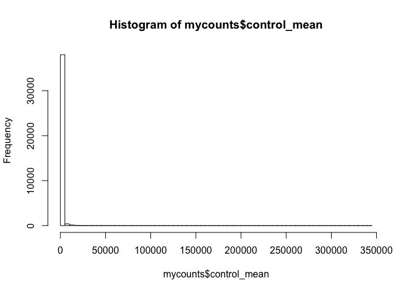
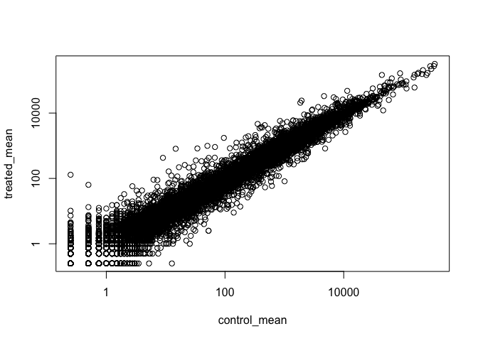
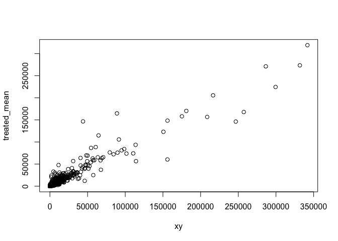
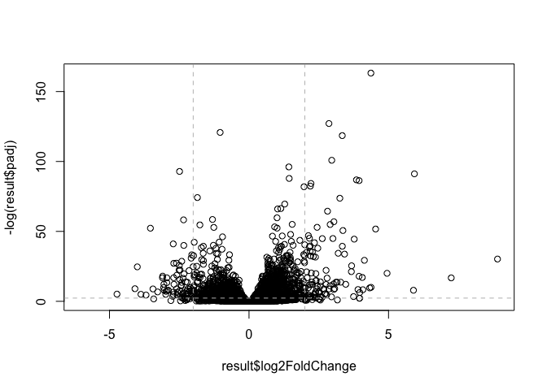

Transcriptomics and RNA-seq Analysis
================

``` r
counts <- read.csv("https://bioboot.github.io/bimm143_W18/class-material/airway_scaledcounts.csv", stringsAsFactors = FALSE)
metadata <- read.csv("https://bioboot.github.io/bimm143_W18/class-material/airway_metadata.csv", stringsAsFactors = FALSE)
```

``` r
head(counts)
```

    ##           ensgene SRR1039508 SRR1039509 SRR1039512 SRR1039513 SRR1039516
    ## 1 ENSG00000000003        723        486        904        445       1170
    ## 2 ENSG00000000005          0          0          0          0          0
    ## 3 ENSG00000000419        467        523        616        371        582
    ## 4 ENSG00000000457        347        258        364        237        318
    ## 5 ENSG00000000460         96         81         73         66        118
    ## 6 ENSG00000000938          0          0          1          0          2
    ##   SRR1039517 SRR1039520 SRR1039521
    ## 1       1097        806        604
    ## 2          0          0          0
    ## 3        781        417        509
    ## 4        447        330        324
    ## 5         94        102         74
    ## 6          0          0          0

How many genes are we dealing with?

``` r
nrow(counts)
```

    ## [1] 38694

We will compare the control vs treated count data contained in `counts`
object.

We will first extract the control columns by lookin up their names in
the `metadata` object.

``` r
# access control metadata
control <- metadata[metadata$dex=="control",]
# access id of control samples
control_id<- metadata[metadata$dex=="control",]$id
```

``` r
# Access the count colums with contorl$id
counts_ctrl <- counts[,control$id]

# Find the mean of each gene(i.e. each row)
control_mean <- rowSums(counts[,control$id])/ncol(control)
```

``` r
# repeat with "treated" 
# access control metadata
treated <- metadata[metadata$dex=="treated",]
# access id of control samples
treated_id<- metadata[metadata$dex=="treated",]$id

counts_treat <- counts[,treated$id]

# Find the mean of each gene(i.e. each row)
treated_mean <- rowSums(counts[,treated$id])/ncol(treated)
```

``` r
mycounts <- data.frame(control_mean, treated_mean)

# plot

hist(mycounts$control_mean,breaks = 80)
```

<!-- -->

Our data is very skewed so lets work with logs. First re-plot our
control vs treated on a log-log
    scale.

``` r
plot(mycounts, log="xy")
```

    ## Warning in xy.coords(x, y, xlabel, ylabel, log): 15032 x values <= 0 omitted
    ## from logarithmic plot

    ## Warning in xy.coords(x, y, xlabel, ylabel, log): 15281 y values <= 0 omitted
    ## from logarithmic plot

<!-- -->

``` r
x<-data.frame(c(1,2,4,0),c(4,3,0,0))
which(x==0,arr.ind = TRUE)[,"row"]
```

    ## [1] 4 3 4

find zero rows in our mycounts object

``` r
to.rm <- unique(which(mycounts==0, arr.ind = TRUE)[,"row"] )
newcounts <- mycounts[-to.rm,]
plot(newcounts,"xy")
```

<!-- -->

``` r
newcounts$log2fc <- log2(newcounts[,"treated_mean"]/newcounts[,"control_mean"])
head(newcounts)
```

    ##   control_mean treated_mean      log2fc
    ## 1       900.75       658.00 -0.45303916
    ## 3       520.50       546.00  0.06900279
    ## 4       339.75       316.50 -0.10226805
    ## 5        97.25        78.75 -0.30441833
    ## 7      5219.00      6687.50  0.35769358
    ## 8      2327.00      1785.75 -0.38194109

``` r
meancounts<-cbind(counts$ensgene[-to.rm],newcounts)
```

A common rule of thum in the field is to use a log2fc of greater than +2
as *up-regulated* and less than -2 as *down-regulated*

``` r
down<- sum(meancounts$log2fc < -2)
up<- sum(meancounts$log2fc > 2)
colnames(meancounts)[1]<-"GeneID"
down.gene<- meancounts$GeneID[meancounts$log2fc< -2]
up.gene<- meancounts$GeneID[meancounts$log2fc > 2]
```

## Let’s use DESeq2

``` r
library(DESeq2)
```

    ## Loading required package: S4Vectors

    ## Loading required package: stats4

    ## Loading required package: BiocGenerics

    ## Loading required package: parallel

    ## 
    ## Attaching package: 'BiocGenerics'

    ## The following objects are masked from 'package:parallel':
    ## 
    ##     clusterApply, clusterApplyLB, clusterCall, clusterEvalQ,
    ##     clusterExport, clusterMap, parApply, parCapply, parLapply,
    ##     parLapplyLB, parRapply, parSapply, parSapplyLB

    ## The following objects are masked from 'package:stats':
    ## 
    ##     IQR, mad, sd, var, xtabs

    ## The following objects are masked from 'package:base':
    ## 
    ##     anyDuplicated, append, as.data.frame, basename, cbind, colnames,
    ##     dirname, do.call, duplicated, eval, evalq, Filter, Find, get, grep,
    ##     grepl, intersect, is.unsorted, lapply, Map, mapply, match, mget,
    ##     order, paste, pmax, pmax.int, pmin, pmin.int, Position, rank,
    ##     rbind, Reduce, rownames, sapply, setdiff, sort, table, tapply,
    ##     union, unique, unsplit, which, which.max, which.min

    ## 
    ## Attaching package: 'S4Vectors'

    ## The following object is masked from 'package:base':
    ## 
    ##     expand.grid

    ## Loading required package: IRanges

    ## Loading required package: GenomicRanges

    ## Loading required package: GenomeInfoDb

    ## Loading required package: SummarizedExperiment

    ## Loading required package: Biobase

    ## Welcome to Bioconductor
    ## 
    ##     Vignettes contain introductory material; view with
    ##     'browseVignettes()'. To cite Bioconductor, see
    ##     'citation("Biobase")', and for packages 'citation("pkgname")'.

    ## Loading required package: DelayedArray

    ## Loading required package: matrixStats

    ## 
    ## Attaching package: 'matrixStats'

    ## The following objects are masked from 'package:Biobase':
    ## 
    ##     anyMissing, rowMedians

    ## Loading required package: BiocParallel

    ## 
    ## Attaching package: 'DelayedArray'

    ## The following objects are masked from 'package:matrixStats':
    ## 
    ##     colMaxs, colMins, colRanges, rowMaxs, rowMins, rowRanges

    ## The following objects are masked from 'package:base':
    ## 
    ##     aperm, apply, rowsum

``` r
dds <- DESeqDataSetFromMatrix(countData=counts, 
                              colData=metadata, 
                              design=~dex, 
                              tidy=TRUE)
```

    ## converting counts to integer mode

    ## Warning in DESeqDataSet(se, design = design, ignoreRank): some variables in
    ## design formula are characters, converting to factors

``` r
dds
```

    ## class: DESeqDataSet 
    ## dim: 38694 8 
    ## metadata(1): version
    ## assays(1): counts
    ## rownames(38694): ENSG00000000003 ENSG00000000005 ... ENSG00000283120
    ##   ENSG00000283123
    ## rowData names(0):
    ## colnames(8): SRR1039508 SRR1039509 ... SRR1039520 SRR1039521
    ## colData names(4): id dex celltype geo_id

``` r
dds <- DESeq(dds)
```

    ## estimating size factors

    ## estimating dispersions

    ## gene-wise dispersion estimates

    ## mean-dispersion relationship

    ## final dispersion estimates

    ## fitting model and testing

``` r
result <- results(dds) 
result
```

    ## log2 fold change (MLE): dex treated vs control 
    ## Wald test p-value: dex treated vs control 
    ## DataFrame with 38694 rows and 6 columns
    ##                          baseMean     log2FoldChange             lfcSE
    ##                         <numeric>          <numeric>         <numeric>
    ## ENSG00000000003  747.194195359907 -0.350703020686579 0.168245681332529
    ## ENSG00000000005                 0                 NA                NA
    ## ENSG00000000419  520.134160051965  0.206107766417861 0.101059218008052
    ## ENSG00000000457  322.664843927049 0.0245269479387471 0.145145067649248
    ## ENSG00000000460   87.682625164828  -0.14714204922212 0.257007253994673
    ## ...                           ...                ...               ...
    ## ENSG00000283115                 0                 NA                NA
    ## ENSG00000283116                 0                 NA                NA
    ## ENSG00000283119                 0                 NA                NA
    ## ENSG00000283120 0.974916032393564  -0.66825846051647  1.69456285241871
    ## ENSG00000283123                 0                 NA                NA
    ##                               stat             pvalue              padj
    ##                          <numeric>          <numeric>         <numeric>
    ## ENSG00000000003   -2.0844696749953 0.0371174658432827 0.163034808641681
    ## ENSG00000000005                 NA                 NA                NA
    ## ENSG00000000419    2.0394751758463 0.0414026263001167 0.176031664879168
    ## ENSG00000000457  0.168982303952746  0.865810560623561 0.961694238404388
    ## ENSG00000000460  -0.57252099672319  0.566969065257939 0.815848587637724
    ## ...                            ...                ...               ...
    ## ENSG00000283115                 NA                 NA                NA
    ## ENSG00000283116                 NA                 NA                NA
    ## ENSG00000283119                 NA                 NA                NA
    ## ENSG00000283120 -0.394354484734893  0.693319342566817                NA
    ## ENSG00000283123                 NA                 NA                NA

## Volcano Plots

Plot of log2fc vs p-value

``` r
plot(result$log2FoldChange, -log(result$padj))
abline(v=c(-2,2), col="gray", lty=2)
abline(h=-log(0.1), col="gray", lty=2)
```

<!-- -->
