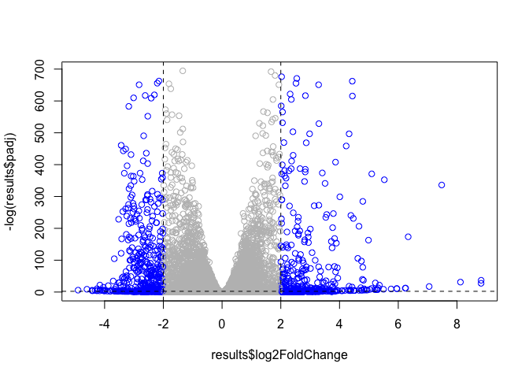

Class 16: Pathway Analysis from RNA-seq results
================

## 

The data for for hands-on session comes from GEO entry: GSE37704, which
is associated with the following publication:

Trapnell C, Hendrickson DG, Sauvageau M, Goff L et al. “Differential
analysis of gene regulation at transcript resolution with RNA-seq”. Nat
Biotechnol 2013 Jan;31(1):46-53. PMID:
23222703

``` r
colData=read.csv("https://bioboot.github.io/bggn213_W20/class-material/GSE37704_metadata.csv",1)
head(colData)
```

    ##          id     condition
    ## 1 SRR493366 control_sirna
    ## 2 SRR493367 control_sirna
    ## 3 SRR493368 control_sirna
    ## 4 SRR493369      hoxa1_kd
    ## 5 SRR493370      hoxa1_kd
    ## 6 SRR493371      hoxa1_kd

``` r
raw.countData=read.csv("https://bioboot.github.io/bggn213_W20/class-material/GSE37704_featurecounts.csv",row.names = 1)
```

``` r
#remove length column

countData <- raw.countData[,-1]
head(countData)
```

    ##                 SRR493366 SRR493367 SRR493368 SRR493369 SRR493370 SRR493371
    ## ENSG00000186092         0         0         0         0         0         0
    ## ENSG00000279928         0         0         0         0         0         0
    ## ENSG00000279457        23        28        29        29        28        46
    ## ENSG00000278566         0         0         0         0         0         0
    ## ENSG00000273547         0         0         0         0         0         0
    ## ENSG00000187634       124       123       205       207       212       258

``` r
nrow(countData)
```

    ## [1] 19808

``` r
dim(countData)
```

    ## [1] 19808     6

# remove zero

``` r
trim.Count <- countData[rowSums(countData)!=0,]
```

``` r
na.rm <- unique(which(countData==0,arr.ind = TRUE)[,"row"])
trimCount <- countData[-na.rm,]
```

``` r
identical(trimCount,trim.Count)
```

    ## [1] FALSE

``` r
#? swap(countData[countData==0,],"NA")
```

## Running DESeq2

``` r
library(DESeq2)
```

    ## Loading required package: S4Vectors

    ## Loading required package: stats4

    ## Loading required package: BiocGenerics

    ## Loading required package: parallel

    ## 
    ## Attaching package: 'BiocGenerics'

    ## The following objects are masked from 'package:parallel':
    ## 
    ##     clusterApply, clusterApplyLB, clusterCall, clusterEvalQ,
    ##     clusterExport, clusterMap, parApply, parCapply, parLapply,
    ##     parLapplyLB, parRapply, parSapply, parSapplyLB

    ## The following objects are masked from 'package:stats':
    ## 
    ##     IQR, mad, sd, var, xtabs

    ## The following objects are masked from 'package:base':
    ## 
    ##     anyDuplicated, append, as.data.frame, basename, cbind, colnames,
    ##     dirname, do.call, duplicated, eval, evalq, Filter, Find, get, grep,
    ##     grepl, intersect, is.unsorted, lapply, Map, mapply, match, mget,
    ##     order, paste, pmax, pmax.int, pmin, pmin.int, Position, rank,
    ##     rbind, Reduce, rownames, sapply, setdiff, sort, table, tapply,
    ##     union, unique, unsplit, which, which.max, which.min

    ## 
    ## Attaching package: 'S4Vectors'

    ## The following object is masked from 'package:base':
    ## 
    ##     expand.grid

    ## Loading required package: IRanges

    ## Loading required package: GenomicRanges

    ## Loading required package: GenomeInfoDb

    ## Loading required package: SummarizedExperiment

    ## Loading required package: Biobase

    ## Welcome to Bioconductor
    ## 
    ##     Vignettes contain introductory material; view with
    ##     'browseVignettes()'. To cite Bioconductor, see
    ##     'citation("Biobase")', and for packages 'citation("pkgname")'.

    ## Loading required package: DelayedArray

    ## Loading required package: matrixStats

    ## 
    ## Attaching package: 'matrixStats'

    ## The following objects are masked from 'package:Biobase':
    ## 
    ##     anyMissing, rowMedians

    ## Loading required package: BiocParallel

    ## 
    ## Attaching package: 'DelayedArray'

    ## The following objects are masked from 'package:matrixStats':
    ## 
    ##     colMaxs, colMins, colRanges, rowMaxs, rowMins, rowRanges

    ## The following objects are masked from 'package:base':
    ## 
    ##     aperm, apply, rowsum

``` r
dds=DESeqDataSetFromMatrix(countData = trim.Count,colData = colData, design = ~condition)
dds=DESeq(dds)
```

    ## estimating size factors

    ## estimating dispersions

    ## gene-wise dispersion estimates

    ## mean-dispersion relationship

    ## final dispersion estimates

    ## fitting model and testing

``` r
results <- results(dds)
```

## Make a volcano plot of log2FoldChange

``` r
mycols <- rep("gray",nrow(results))
mycols[abs(results$log2FoldChange)>2] <-"blue"
plot(results$log2FoldChange, -log(results$padj),col=mycols)
abline(v=c(-2,2), col="black", lty=2)
abline(h=-log(0.1), col="black", lty=2)
```

<!-- -->

To add annotation to my gene list I will install some bioconductor
packages

``` r
library("AnnotationDbi")
library("org.Hs.eg.db")
```

    ## 

``` r
columns(org.Hs.eg.db)
```

    ##  [1] "ACCNUM"       "ALIAS"        "ENSEMBL"      "ENSEMBLPROT"  "ENSEMBLTRANS"
    ##  [6] "ENTREZID"     "ENZYME"       "EVIDENCE"     "EVIDENCEALL"  "GENENAME"    
    ## [11] "GO"           "GOALL"        "IPI"          "MAP"          "OMIM"        
    ## [16] "ONTOLOGY"     "ONTOLOGYALL"  "PATH"         "PFAM"         "PMID"        
    ## [21] "PROSITE"      "REFSEQ"       "SYMBOL"       "UCSCKG"       "UNIGENE"     
    ## [26] "UNIPROT"

Let’s map our ENSEMBLE gene ids to the more conventional gene gene
SYMBOL

``` r
results$symbol <- mapIds(org.Hs.eg.db,
                         key=row.names(results),
                         keytype = "ENSEMBL",
                         column="SYMBOL",
                         multiVals = "first")
```

    ## 'select()' returned 1:many mapping between keys and columns

``` r
results$entrez <- mapIds(org.Hs.eg.db,
                         key=row.names(results),
                         keytype = "ENSEMBL",
                         column="ENTREZID",
                         multiVals = "first")
```

    ## 'select()' returned 1:many mapping between keys and columns

``` r
results$name <- mapIds(org.Hs.eg.db,
                         key=row.names(results),
                         keytype = "ENSEMBL",
                         column="GENENAME",
                         multiVals = "first")
```

    ## 'select()' returned 1:many mapping between keys and columns

``` r
head(results)
```

    ## log2 fold change (MLE): condition hoxa1 kd vs control sirna 
    ## Wald test p-value: condition hoxa1 kd vs control sirna 
    ## DataFrame with 6 rows and 9 columns
    ##                         baseMean     log2FoldChange              lfcSE
    ##                        <numeric>          <numeric>          <numeric>
    ## ENSG00000279457 29.9135794276176  0.179257083672691  0.324821565250144
    ## ENSG00000187634 183.229649921658  0.426457118403307  0.140265820376891
    ## ENSG00000188976 1651.18807619944 -0.692720464846367 0.0548465415913881
    ## ENSG00000187961 209.637938486147  0.729755610585227  0.131859899969346
    ## ENSG00000187583 47.2551232589398 0.0405765278756319  0.271892808601774
    ## ENSG00000187642 11.9797501642461  0.542810491577361  0.521559849534146
    ##                              stat               pvalue                 padj
    ##                         <numeric>            <numeric>            <numeric>
    ## ENSG00000279457 0.551863246932653    0.581042050747029    0.686554777832896
    ## ENSG00000187634  3.04034951107424  0.00236303749730971  0.00515718149494307
    ## ENSG00000188976 -12.6301576133496 1.43989540153787e-36 1.76548905389893e-35
    ## ENSG00000187961  5.53432552849561 3.12428248077716e-08  1.1341299310762e-07
    ## ENSG00000187583  0.14923722361139    0.881366448669145    0.919030615571379
    ## ENSG00000187642  1.04074439790984    0.297994191720984    0.403379309754101
    ##                      symbol      entrez
    ##                 <character> <character>
    ## ENSG00000279457          NA          NA
    ## ENSG00000187634      SAMD11      148398
    ## ENSG00000188976       NOC2L       26155
    ## ENSG00000187961      KLHL17      339451
    ## ENSG00000187583     PLEKHN1       84069
    ## ENSG00000187642       PERM1       84808
    ##                                                                     name
    ##                                                              <character>
    ## ENSG00000279457                                                       NA
    ## ENSG00000187634                 sterile alpha motif domain containing 11
    ## ENSG00000188976 NOC2 like nucleolar associated transcriptional repressor
    ## ENSG00000187961                              kelch like family member 17
    ## ENSG00000187583                 pleckstrin homology domain containing N1
    ## ENSG00000187642             PPARGC1 and ESRR induced regulator, muscle 1

Save annotated results

``` r
write.csv(results, file= "dds.result.csv" )
```

## Pathway Analysis

Here we are going to use the gage package for pathway analysis. Once we
have a list of enriched pathways, we’re going to use the pathview
package to draw pathway diagrams, shading the molecules in the pathway
by their degree of
    up/down-regulation.

# Install `gage` , `gageData` and `pathview` in Bioconda in R Console

``` r
library("pathview")
```

    ## ##############################################################################
    ## Pathview is an open source software package distributed under GNU General
    ## Public License version 3 (GPLv3). Details of GPLv3 is available at
    ## http://www.gnu.org/licenses/gpl-3.0.html. Particullary, users are required to
    ## formally cite the original Pathview paper (not just mention it) in publications
    ## or products. For details, do citation("pathview") within R.
    ## 
    ## The pathview downloads and uses KEGG data. Non-academic uses may require a KEGG
    ## license agreement (details at http://www.kegg.jp/kegg/legal.html).
    ## ##############################################################################

``` r
library(gage)
library(gageData)
```

``` r
# Focus on signaling and metabolic pathways only

data(kegg.sets.hs)
data(sigmet.idx.hs)

kegg.sets.hs = kegg.sets.hs[sigmet.idx.hs]

# Examine the first 3 pathways
head(kegg.sets.hs, 3)
```

    ## $`hsa00232 Caffeine metabolism`
    ## [1] "10"   "1544" "1548" "1549" "1553" "7498" "9"   
    ## 
    ## $`hsa00983 Drug metabolism - other enzymes`
    ##  [1] "10"     "1066"   "10720"  "10941"  "151531" "1548"   "1549"   "1551"  
    ##  [9] "1553"   "1576"   "1577"   "1806"   "1807"   "1890"   "221223" "2990"  
    ## [17] "3251"   "3614"   "3615"   "3704"   "51733"  "54490"  "54575"  "54576" 
    ## [25] "54577"  "54578"  "54579"  "54600"  "54657"  "54658"  "54659"  "54963" 
    ## [33] "574537" "64816"  "7083"   "7084"   "7172"   "7363"   "7364"   "7365"  
    ## [41] "7366"   "7367"   "7371"   "7372"   "7378"   "7498"   "79799"  "83549" 
    ## [49] "8824"   "8833"   "9"      "978"   
    ## 
    ## $`hsa00230 Purine metabolism`
    ##   [1] "100"    "10201"  "10606"  "10621"  "10622"  "10623"  "107"    "10714" 
    ##   [9] "108"    "10846"  "109"    "111"    "11128"  "11164"  "112"    "113"   
    ##  [17] "114"    "115"    "122481" "122622" "124583" "132"    "158"    "159"   
    ##  [25] "1633"   "171568" "1716"   "196883" "203"    "204"    "205"    "221823"
    ##  [33] "2272"   "22978"  "23649"  "246721" "25885"  "2618"   "26289"  "270"   
    ##  [41] "271"    "27115"  "272"    "2766"   "2977"   "2982"   "2983"   "2984"  
    ##  [49] "2986"   "2987"   "29922"  "3000"   "30833"  "30834"  "318"    "3251"  
    ##  [57] "353"    "3614"   "3615"   "3704"   "377841" "471"    "4830"   "4831"  
    ##  [65] "4832"   "4833"   "4860"   "4881"   "4882"   "4907"   "50484"  "50940" 
    ##  [73] "51082"  "51251"  "51292"  "5136"   "5137"   "5138"   "5139"   "5140"  
    ##  [81] "5141"   "5142"   "5143"   "5144"   "5145"   "5146"   "5147"   "5148"  
    ##  [89] "5149"   "5150"   "5151"   "5152"   "5153"   "5158"   "5167"   "5169"  
    ##  [97] "51728"  "5198"   "5236"   "5313"   "5315"   "53343"  "54107"  "5422"  
    ## [105] "5424"   "5425"   "5426"   "5427"   "5430"   "5431"   "5432"   "5433"  
    ## [113] "5434"   "5435"   "5436"   "5437"   "5438"   "5439"   "5440"   "5441"  
    ## [121] "5471"   "548644" "55276"  "5557"   "5558"   "55703"  "55811"  "55821" 
    ## [129] "5631"   "5634"   "56655"  "56953"  "56985"  "57804"  "58497"  "6240"  
    ## [137] "6241"   "64425"  "646625" "654364" "661"    "7498"   "8382"   "84172" 
    ## [145] "84265"  "84284"  "84618"  "8622"   "8654"   "87178"  "8833"   "9060"  
    ## [153] "9061"   "93034"  "953"    "9533"   "954"    "955"    "956"    "957"   
    ## [161] "9583"   "9615"

Our input will be a vector of fold change values with ENTREZ gene ids as
names

``` r
foldchanges= results$log2FoldChange
names(foldchanges)=results$entrez
head(foldchanges)
```

    ##        <NA>      148398       26155      339451       84069       84808 
    ##  0.17925708  0.42645712 -0.69272046  0.72975561  0.04057653  0.54281049

``` r
# Focus on signaling and metabolic pathways only
kegg.sets.hs = kegg.sets.hs[sigmet.idx.hs]

# Examine the first 3 pathways
head(kegg.sets.hs, 3)
```

    ## $`hsa00232 Caffeine metabolism`
    ## [1] "10"   "1544" "1548" "1549" "1553" "7498" "9"   
    ## 
    ## $`hsa00983 Drug metabolism - other enzymes`
    ##  [1] "10"     "1066"   "10720"  "10941"  "151531" "1548"   "1549"   "1551"  
    ##  [9] "1553"   "1576"   "1577"   "1806"   "1807"   "1890"   "221223" "2990"  
    ## [17] "3251"   "3614"   "3615"   "3704"   "51733"  "54490"  "54575"  "54576" 
    ## [25] "54577"  "54578"  "54579"  "54600"  "54657"  "54658"  "54659"  "54963" 
    ## [33] "574537" "64816"  "7083"   "7084"   "7172"   "7363"   "7364"   "7365"  
    ## [41] "7366"   "7367"   "7371"   "7372"   "7378"   "7498"   "79799"  "83549" 
    ## [49] "8824"   "8833"   "9"      "978"   
    ## 
    ## $`hsa04514 Cell adhesion molecules (CAMs)`
    ##   [1] "1000"      "1001"      "100133583" "1002"      "1003"      "100506658"
    ##   [7] "1013"      "10666"     "10686"     "1272"      "1364"      "1365"     
    ##  [13] "1366"      "137075"    "1462"      "1493"      "149461"    "214"      
    ##  [19] "22871"     "23114"     "23308"     "23562"     "23705"     "24146"    
    ##  [25] "257194"    "25945"     "26047"     "26285"     "2734"      "29126"    
    ##  [31] "29851"     "3105"      "3106"      "3107"      "3108"      "3109"     
    ##  [37] "3111"      "3112"      "3113"      "3115"      "3117"      "3118"     
    ##  [43] "3119"      "3122"      "3123"      "3125"      "3126"      "3127"     
    ##  [49] "3133"      "3134"      "3135"      "3383"      "3384"      "3385"     
    ##  [55] "3655"      "3676"      "3680"      "3683"      "3684"      "3685"     
    ##  [61] "3688"      "3689"      "3695"      "3696"      "3897"      "4099"     
    ##  [67] "4267"      "4359"      "4684"      "4685"      "4756"      "4897"     
    ##  [73] "4950"      "49861"     "5010"      "50848"     "51208"     "5133"     
    ##  [79] "5175"      "53842"     "54413"     "57502"     "57555"     "57863"    
    ##  [85] "5788"      "5792"      "5797"      "5817"      "5818"      "5819"     
    ##  [91] "58494"     "6382"      "6383"      "6385"      "6401"      "6402"     
    ##  [97] "6403"      "6404"      "652614"    "6614"      "6693"      "6900"     
    ## [103] "7122"      "7412"      "80380"     "80381"     "8174"      "83700"    
    ## [109] "8506"      "8516"      "9019"      "9071"      "9073"      "9074"     
    ## [115] "9075"      "9076"      "9080"      "90952"     "914"       "920"      
    ## [121] "923"       "925"       "926"       "933"       "9369"      "9378"     
    ## [127] "9379"      "940"       "941"       "942"       "947"       "958"      
    ## [133] "959"       "965"       "9672"      "999"

``` r
# Get the results
keggres = gage(foldchanges, gsets=kegg.sets.hs)
```

``` r
attributes(keggres)
```

    ## $names
    ## [1] "greater" "less"    "stats"

``` r
head(keggres$less)
```

    ##                                                        p.geomean stat.mean
    ## hsa03030 DNA replication                            9.424076e-05 -3.951803
    ## hsa03440 Homologous recombination                   3.066756e-03 -2.852899
    ## hsa00010 Glycolysis / Gluconeogenesis               8.961413e-03 -2.405398
    ## hsa00240 Pyrimidine metabolism                      9.417321e-03 -2.369057
    ## hsa00670 One carbon pool by folate                  1.054523e-02 -2.426151
    ## hsa00280 Valine, leucine and isoleucine degradation 1.374929e-02 -2.248044
    ##                                                            p.val      q.val
    ## hsa03030 DNA replication                            9.424076e-05 0.01083769
    ## hsa03440 Homologous recombination                   3.066756e-03 0.17633849
    ## hsa00010 Glycolysis / Gluconeogenesis               8.961413e-03 0.24254022
    ## hsa00240 Pyrimidine metabolism                      9.417321e-03 0.24254022
    ## hsa00670 One carbon pool by folate                  1.054523e-02 0.24254022
    ## hsa00280 Valine, leucine and isoleucine degradation 1.374929e-02 0.26352805
    ##                                                     set.size         exp1
    ## hsa03030 DNA replication                                  36 9.424076e-05
    ## hsa03440 Homologous recombination                         28 3.066756e-03
    ## hsa00010 Glycolysis / Gluconeogenesis                     53 8.961413e-03
    ## hsa00240 Pyrimidine metabolism                            98 9.417321e-03
    ## hsa00670 One carbon pool by folate                        17 1.054523e-02
    ## hsa00280 Valine, leucine and isoleucine degradation       42 1.374929e-02

``` r
pathview(gene.data=foldchanges, pathway.id="hsa04110")
```

    ## 'select()' returned 1:1 mapping between keys and columns

    ## Info: Working in directory /Users/dong/Desktop/BGGN213/Lec 11/bggn213_github/class16

    ## Info: Writing image file hsa04110.pathview.png

``` r
knitr::include_graphics("hsa04110.pathview.png")
```


``` r
# try pathview

pathview(gene.data=foldchanges, pathway.id="hsa04110", kegg.native=FALSE)
```

    ## 'select()' returned 1:1 mapping between keys and columns

    ## Info: Working in directory /Users/dong/Desktop/BGGN213/Lec 11/bggn213_github/class16

    ## Info: Writing image file hsa04110.pathview.pdf
