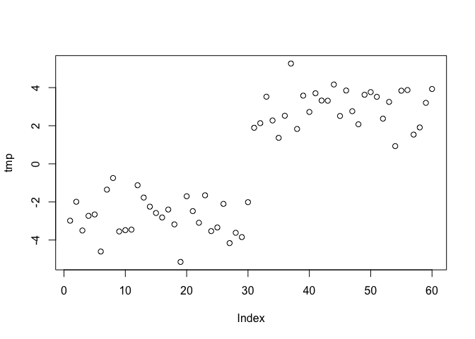

Class 9: Machine Learning 1
================
Jiayi Dong
2/5/2020

## K-means clustering

Let’s try the `kmearns()` function in R to cluster some made-up example
data.

``` r
tmp <- c(rnorm(30,-3), rnorm(30,3))
plot(tmp)
```

<!-- -->

``` r
x<-cbind(x=tmp, y<-rev(tmp))
```

Use kmeans() tfunction setting k to 2 and nstart=20

``` r
km <- kmeans(x,centers = 2, nstart = 20)
```

Inspect/print the result of km

``` r
km
```

    ## K-means clustering with 2 clusters of sizes 30, 30
    ## 
    ## Cluster means:
    ##           x          
    ## 1 -3.125541  2.806365
    ## 2  2.806365 -3.125541
    ## 
    ## Clustering vector:
    ##  [1] 1 1 1 1 1 1 1 1 1 1 1 1 1 1 1 1 1 1 1 1 1 1 1 1 1 1 1 1 1 1 2 2 2 2 2 2 2 2
    ## [39] 2 2 2 2 2 2 2 2 2 2 2 2 2 2 2 2 2 2 2 2 2 2
    ## 
    ## Within cluster sum of squares by cluster:
    ## [1] 58.49426 58.49426
    ##  (between_SS / total_SS =  90.0 %)
    ## 
    ## Available components:
    ## 
    ## [1] "cluster"      "centers"      "totss"        "withinss"     "tot.withinss"
    ## [6] "betweenss"    "size"         "iter"         "ifault"

``` r
attributes(km)
```

    ## $names
    ## [1] "cluster"      "centers"      "totss"        "withinss"     "tot.withinss"
    ## [6] "betweenss"    "size"         "iter"         "ifault"      
    ## 
    ## $class
    ## [1] "kmeans"

Q: How many points are in each cluster?

``` r
km$size
```

    ## [1] 30 30

Q: What ‘component’ of your result object details -cluster size?
-cluster assignment/membership? -cluster center?

``` r
km$size
```

    ## [1] 30 30

``` r
km$iter
```

    ## [1] 1

``` r
km$centers
```

    ##           x          
    ## 1 -3.125541  2.806365
    ## 2  2.806365 -3.125541

``` r
km$cluster
```

    ##  [1] 1 1 1 1 1 1 1 1 1 1 1 1 1 1 1 1 1 1 1 1 1 1 1 1 1 1 1 1 1 1 2 2 2 2 2 2 2 2
    ## [39] 2 2 2 2 2 2 2 2 2 2 2 2 2 2 2 2 2 2 2 2 2 2

Plot x colored by the kmeans cluster assignment and add cluster centers
as blue points

``` r
plot(x,col=c(rep("red",30),rep("green",30)))
points(km$centers, col="blue", pch=1, cex=1)
```

<!-- -->

## Hierarchiacal clustering in R

The`hclust()`function is the main Hierarchical clustering method in R
and it **must** be passed a *distance matrix* as input, not the raw
data\!

``` r
hc <- hclust(dist(x))
```

You can also ask `cutree()`for the `k` number of groups that you
    want

``` r
cutree(hc,k=5)
```

    ##  [1] 1 1 2 1 1 2 1 2 1 2 1 2 1 1 1 1 2 2 2 1 1 1 2 2 1 2 1 2 2 2 3 4 4 5 4 5 3 3
    ## [39] 5 5 5 3 3 3 5 5 5 5 4 5 3 5 3 5 4 5 5 3 5 5

## Practice PCA analysis

``` r
x <- read.csv("https://bioboot.github.io/bggn213_f17/class-material/UK_foods.csv",row.names = 1)
```

``` r
pca <- prcomp(t(x))
pca
```

    ## Standard deviations (1, .., p=4):
    ## [1] 3.241502e+02 2.127478e+02 7.387622e+01 4.188568e-14
    ## 
    ## Rotation (n x k) = (17 x 4):
    ##                              PC1          PC2         PC3          PC4
    ## Cheese              -0.056955380 -0.016012850 -0.02394295 -0.691718038
    ## Carcass_meat         0.047927628 -0.013915823 -0.06367111  0.635384915
    ## Other_meat          -0.258916658  0.015331138  0.55384854  0.198175921
    ## Fish                -0.084414983  0.050754947 -0.03906481 -0.015824630
    ## Fats_and_oils       -0.005193623  0.095388656  0.12522257  0.052347444
    ## Sugars              -0.037620983  0.043021699  0.03605745  0.014481347
    ## Fresh_potatoes       0.401402060  0.715017078  0.20668248 -0.151706089
    ## Fresh_Veg           -0.151849942  0.144900268 -0.21382237  0.056182433
    ## Other_Veg           -0.243593729  0.225450923  0.05332841 -0.080722623
    ## Processed_potatoes  -0.026886233 -0.042850761  0.07364902 -0.022618707
    ## Processed_Veg       -0.036488269  0.045451802 -0.05289191  0.009235001
    ## Fresh_fruit         -0.632640898  0.177740743 -0.40012865 -0.021899087
    ## Cereals             -0.047702858  0.212599678  0.35884921  0.084667257
    ## Beverages           -0.026187756  0.030560542  0.04135860 -0.011880823
    ## Soft_drinks          0.232244140 -0.555124311  0.16942648 -0.144367046
    ## Alcoholic_drinks    -0.463968168 -0.113536523  0.49858320 -0.115797605
    ## Confectionery       -0.029650201 -0.005949921  0.05232164 -0.003695024

``` r
attributes(pca)
```

    ## $names
    ## [1] "sdev"     "rotation" "center"   "scale"    "x"       
    ## 
    ## $class
    ## [1] "prcomp"

``` r
plot(pca$x[,1],pca$x[,2])
```

<!-- -->
