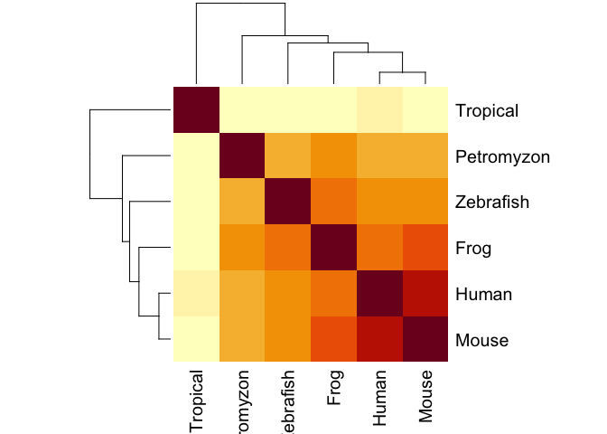

Fina A Gene Assignment
================

## Q7. Generate a sequence identity based heatmap of your aligned sequences using R.

If necessary convert your sequence alignment to the ubiquitous FASTA
format (Seaview can read in clustal format and “Save as” FASTA format
for example). Read this FASTA format alignment into R with the help of
functions in the Bio3D package. Calculate a sequence identity matrix
(again using a function within the Bio3D package). Then generate a
heatmap plot and add to your report. Do make sure your labels are
visible and not cut at the figure margins.

``` r
library(bio3d)
```

Read in alignment fasta
file.

``` r
aln <- read.fasta("~/Downloads/muscle-I20200309-172315-0861-46774147-p2m.fst")
```

Calculate a sequence identity matrix.

``` r
ide.mat <- seqidentity(aln)
ide.mat
```

    ##            Tropical Petromyzon Zebrafish  Frog Human Mouse
    ## Tropical      1.000      0.491     0.524 0.520 0.535 0.531
    ## Petromyzon    0.491      1.000     0.668 0.705 0.683 0.690
    ## Zebrafish     0.524      0.668     1.000 0.749 0.723 0.731
    ## Frog          0.520      0.705     0.749 1.000 0.782 0.790
    ## Human         0.535      0.683     0.723 0.782 1.000 0.915
    ## Mouse         0.531      0.690     0.731 0.790 0.915 1.000

Plot heatmap of sequence identity
matrix

``` r
heatmap(ide.mat, symm =TRUE)
```

<!-- -->

## Q8. Search the main protein structure database for the most similar atomic resolution structures to your aligned sequences.

Using R/Bio3D (or an online blast server if you prefer), search the main
protein structure database for the most similar atomic resolution
structures to your aligned sequences.

List the top 3 unique hits (i.e. not hits representing different chains
from the same structure) along with their Evalue and sequence identity
to your query. Please also add annotation details of these structures.
For example include the annotation terms PDB identifier (structureId),
Method used to solve the structure (experimentalTechnique), resolution
(resolution), and source organism (source). HINT: You can use a single
sequence from your alignment or generate a consensus sequence from your
alignment using the Bio3D function consensus(). The Bio3D functions
blast.pdb(), plot.blast() and pdb.annotate() are likely to be of most
relevance for completing this task. Note that the results of blast.pdb()
contain the hits PDB identifier (or pdb.id) as well as Evalue and
identity. The results of pdb.annotate() contain the other annotation
terms noted above. Note that if your consensus sequence has lots of gap
positions then it will be better to use an original sequence from the
alignment for your search of the PDB. In this case you could chose the
sequence with the highest identity to all others in your alignment by
calculating the row-wise maximum from your sequence identity matrix.

``` r
cons <- consensus(aln)
cons$seq
```

    ##   [1] "S" "H" "S" "V" "F" "S" "V" "T" "I" "H" "M" "K" "E" "T" "T" "-" "D" "G"
    ##  [19] "E" "E" "L" "V" "K" "I" "G" "K" "L" "N" "L" "V" "D" "L" "A" "G" "S" "E"
    ##  [37] "N" "I" "G" "R" "S" "G" "A" "V" "D" "K" "R" "A" "R" "E" "A" "G" "N" "I"
    ##  [55] "N" "Q" "S" "L" "L" "T" "L" "G" "R" "V" "I" "T" "A" "L" "V" "E" "R" "-"
    ##  [73] "P" "H" "I" "P" "Y" "R" "E" "S" "K" "L" "T" "R" "I" "L" "Q" "D" "S" "L"
    ##  [91] "G" "G" "R" "T" "K" "T" "S" "I" "I" "A" "T" "-" "S" "P" "A" "S" "-" "N"
    ## [109] "L" "E" "E" "T" "L" "S" "T" "L" "E" "Y" "A" "-" "R" "A" "K" "N" "I" "M"
    ## [127] "N" "K" "P" "E" "V" "N" "Q" "K" "L" "T" "K" "K" "A" "L" "I" "K" "E" "Y"
    ## [145] "T" "E" "E" "I" "E" "R" "L" "K" "R" "-" "L" "A" "A" "A" "R" "E" "K" "N"
    ## [163] "G" "V" "Y" "-" "S" "-" "E" "-" "Y" "-" "-" "-" "-" "G" "K" "-" "-" "-"
    ## [181] "Q" "E" "E" "Q" "I" "-" "E" "-" "-" "E" "K" "I" "-" "-" "-" "E" "E" "E"
    ## [199] "-" "-" "-" "-" "-" "E" "L" "F" "-" "D" "-" "-" "-" "-" "-" "-" "-" "-"
    ## [217] "K" "-" "E" "L" "-" "-" "C" "-" "-" "D" "L" "Q" "-" "K" "-" "-" "-" "L"
    ## [235] "E" "-" "T" "-" "-" "-" "L" "-" "E" "-" "K" "-" "Q" "L" "-" "-" "E" "-"
    ## [253] "-" "-" "-" "S" "-" "-" "-" "-" "T" "E" "-" "-" "L" "-" "-" "T" "A" "-"
    ## [271] "-" "L" "L" "-" "T" "-" "-" "-"

Consensus sequence has lots of gap positions, switch to use an original
sequence from the alignment for the search of the PDB.

Calculate the row-wise maximum from the sequence identity matrix.

``` r
sum(ide.mat[,1])
```

    ## [1] 3.601

``` r
sum(ide.mat[,2])
```

    ## [1] 4.237

``` r
sum(ide.mat[,3])
```

    ## [1] 4.395

``` r
sum(ide.mat[,4])
```

    ## [1] 4.546

``` r
sum(ide.mat[,5])
```

    ## [1] 4.638

``` r
sum(ide.mat[,6])
```

    ## [1] 4.657

Mouse sequence has the highest identity to all others.

``` r
anotate.1 <- pdb.annotate("4ZCA")
anotate.2<- pdb.annotate("4ZHI")
anotate.3 <- pdb.annotate("3HQD")
```
